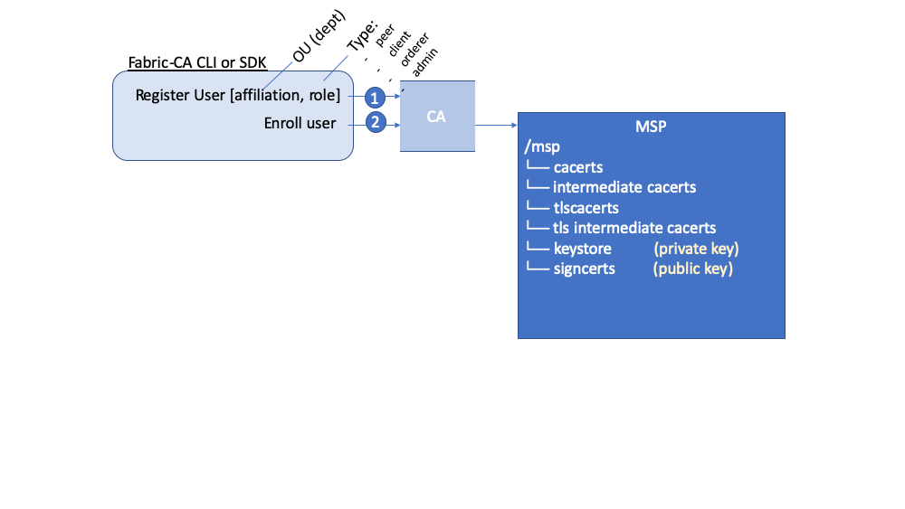

# Провайдер службы членства (MSP)

## Назначение MSP

Поскольку Fabric является закрытой блокчейн-сетью, ее участникам требуется способ подтверждения личности для совершения транзакций с другими участниками сети. В разделе [Идентификация](../identity/identity.html)
описывается, каким образом «цепочка доверия» используется в инфраструктуре открытых ключей (PKI) для проверки личности участников. Как именно "цепочка доверия" применяется в блокчейн-сети?

Удостоверяющие центры выдают идентификаторы путем создания открытых и закрытых ключей, которые образуют пары ключей для подтверждения личности.  Поскольку закрытые ключи не являются общедоступными, для подтверждения личности требуется определенный механизм. В случае Fabric — это MSP. Например, одноранговый узел использует закрытый ключ для цифровой подписи или одобрения транзакции. MSP службы упорядочения содержит открытый ключ однорангового узла, который используется для проверки подписи, прикрепленной к транзакции. Закрытый ключ используется для создания подписи транзакции, которой может соответствовать только подходящий открытый ключ, содержащийся в MSP. Таким образом, MSP позволяет подтверждать личность и определять принадлежность к сети без необходимости просмотра закрытого ключа участника.

В примере с кредитными картами в разделе «Идентификация» показывается, что удостоверяющий центр подобен платежной системе — он выдает различные типы проверяемых идентификаторов. В свою очередь, MSP определяет платежные системы, которые можно использовать для оплаты в магазине. Таким образом, MSP превращает идентификатор (кредитную карту) в роль (возможность покупать товары в магазине).

Способность MSP объединять проверяемые идентификаторы и роли имеет критическое значение в работе сетей Fabric, позволяя организациям, узлам и каналам настраивать MSP, которые определяют разрешения на уровне организации, узла и канала.


*Идентификаторы можно сравнить с кредитными картами, которые используются для подтверждения способности субъекта производить оплату. А MSP можно сравнить со списком принимаемых кредитных карт.*

Для примера представим консорциум банков, поддерживающих работу блокчейн-сети. Каждый банк обслуживает одноранговые узлы и узлы службы упорядочивания, при этом одноранговые узлы одобряют отправленные в сеть транзакции. Также в каждом банке есть подразделения и владельцы счетов. Владельцы счетов могут принадлежать к организациям, однако они не обслуживают узлы сети. Для взаимодействия с системой владельцы счетов используют только мобильные телефоны или веб-приложение. Каким образом блокчейн-сеть распознает и различает идентификаторы? Для создания идентификаторов может использоваться удостоверяющий центр. Однако, как и в примере с банковскими картами, такие идентификаторы также должны распознаваться сетью. MSP позволяют определять доверенные организации в сети. Еще, MSP — это механизм присвоения ролей и разрешений участникам сети. Поскольку MSP, определяющие эти организации, известны членам сети, их можно использовать для проверки возможности осуществления действий субъектами сети.

Также, для возможности присоединения к _существующей_ сети нужен способ преобразовывать идентификаторы во что-то, что распознается сетью. И именно MSP позволяет присоединиться к и производить действия в закрытой блокчейн-сети. Для совершения транзакций в сети Fabric участнику требуется:

1. Иметь идентификатор, выданный доверенным удостоверяющим центром сети.
2. Вступить в состав _организации_ , известной участникам сети и одобренной ими. MSP описывает то, каким образом идентификатор связан с членством в организации. Членство обеспечивается путем добавления открытого ключа участника (также известного как сертификат, подписывающий сертификат или «signcert») в MSP организации.
3. Добавить MSP в [консорциум](../glossary.html#consortium) в блокчейн-сети или канал.
4. Обеспечить включение MSP в определения [установленных правил](../policies/policies.html) сети.

## Принцип работы MSP

Несмотря на название, поставщик службы членства (MSP), на самом деле, ничего не предоставляет. Скорее требования MSP реализуются через набор папок, которые добавляются в конфигурацию сети и используются для определения организации как изнутри (организации самостоятельно назначают администраторов), так и снаружи (позволяя другим организациям проверять деятельность субъектов согласно их полномочий). Так, удостоверяющие центры генерируют сертификаты, являющиеся идентификаторами личности, а MSP содержит список разрешенных идентификаторов.

Для определения членов, входящих в доверенный домен, MSP определяет доверенные корневые и промежуточные удостоверяющие центры с помощью списка идентификаторы их членов или путем определения удостоверяющих центров, которые имеют право выдавать действительные идентификаторы для своих членов.


о функции MSP выходят за рамки простого перечисления участников сети или членов канала. Именно MSP превращает идентификатор в **роль** , определяя привилегии субъекта в рамках узла или канала. Следует отметить, что при регистрации пользователя удостоверяющим центром сети Fabric, ему назначается роль администратора, однорангового узла, клиента, или узла службы упорядочения. Например, идентификаторы с зарегистрированной ролью одноранговый узел (peer) должны присваиваться одноранговым узлам. Точно так же идентификаторы с ролью администратора (admin) должны предоставляться администраторам организации. Далее значение этих ролей будет рассмотрено более подробно.

Кроме того, MSP позволяет определять идентификаторы из списка аннулированных идентификаторов, как описано в разделе [Идентификация](../identity/identity.html). Рассмотрим, каким образом MSP участвует в этом процессе.

##Домены MSP

MSP встречаются в двух доменах блокчейн-сети:

* локально на узле субъекта (**локальный MSP**)
* в конфигурации канала (**MSP канала**)

Оба типа MSP действуют одинаково — превращают идентификаторы в роли, однако их **область применения** различается. Каждый MSP содержит роли и разрешения для определенного уровня администрирования.

### Локальные MSP

**Локальные MSP используются для клиентов и узлов (одноранговых узлов и узлов службы упорядочения)**.
Локальные MSP содержат разрешения для узла (например, содержат перечень администраторов одноранговых узлов, которые могут управлять этим узлом). Локальные MSP клиентов (владельцев счетов в примере с банками) позволяют пользователю аутентифицироваться в транзакциях в качестве члена канала (например, в транзакциях с вызовом чейнкода) или аутентифицироваться с определенной ролью в системе, например, администратором организации в транзакциях конфигурации канала.

**Для каждого узла должен быть определен локальный MSP**, поскольку он определяет административные полномочия и членство на этом уровне (администраторы одноранговых узлов могут не являться администраторами каналов, и наоборот). Это позволяет аутентифицировать сообщения участников за пределами канала и определять разрешения для конкретного узла (например, участников с полномочиями устанавливать чейнкод на одноранговом узле). Следует учитывать, что организация может включать один или несколько узлов. Провайдер службы членства определяет администраторов организации. В то время как организация, администратор организации, администратор узла и сам узел должны иметь один и тот же корень доверия.

Локальный MSP узла службы упорядочения также содержится в файловой системе узла и применяется только к этому узлу. Как и одноранговые узлы, узлы службы упорядочения также принадлежат одной организации и поэтому имеют общий MSP, содержащий перечень доверенных субъектов или узлов.

### Провайдеры службы членства канала

В то же время, **провайдеры службы членства канала определяют административные полномочия и членство на уровне канала**. Одноранговые узлы и узлы службы упорядочивания канала приложения имеют одинаковое представление о провайдерах службы членства канала и, следовательно, могут правильно аутентифицировать участников канала. Таким образом, когда организация желает присоединиться к каналу, провайдер службы членства, содержащий цепочку доверия для членов организации, должен быть указан в конфигурации канала. В противном случае транзакции от членов этой организации будут отклонены. Следует отметить, что локальные MSP представляются в виде структуры папок в файловой системе, а MSP каналов задаются в конфигурации канала.


*Фрагмент из файла config.json канала, который вклюает две MSP организации.*

**MSP каналов определяют полномочия на уровне канала**.
MSP канала определяет _связь_  между идентификаторами участников канала (которые в свою очередь также являются MSP) и применением политик на уровне канала. Провайдеры службы членства канала содержат MSP организаций участников канала.

**Для каждой организации, участвующей в канале, должен быть определен соответствующий MSP**. Рекомендуется, чтобы между организациями и MSP было настроено взаимно-однозначное соответствие. MSP определяет, какие члены уполномочены действовать от имени организации. В эти действия входит настройка самого MSP, а также подтверждение административных задач организации, например, добавление новых участников в канал. В случае, когда все участники сети являются членами одной организации или MSP, конфиденциальность данных оказывается под угрозой. Использование множества организаций способствует повышению конфиденциальности, что достигается путем распределения данных реестра только среди участников канала. Если внутри организации требуется большая степень детализации, ее можно разделить на подразделения, которые будут более подробно описаны далее в этом разделе.

**MSP системного канала включает MSP всех организаций, которые задействованы в службе упорядочения.** Служба упорядочения обычно включает узлы службы упорядочения нескольких организаций. Эти организации в совокупности обслуживают службу упорядочения. И, что наиболее важно, они управляют консорциумом организаций и политиками по умолчанию, которые наследуются каналами приложений.

**Локальные MSP определяются только в файловой системе узла или пользователя** , к которому они применяются. Следовательно, на каждый узел приходится физически и логически только один локальный MSP. Но, поскольку провайдеры службы членства канала доступны для всех узлов в канале, они логически указываются один раз в конфигурации канала. В то же время, **MSP канала также создается в файловой системе каждого узла канала и синхронизируется посредством консенсуса**. Таким образом, при наличии копии всех провайдеров службы членства канала в локальной файловой системе каждого узла, MSP канала логически находится в пределах канала или сети и обслуживается ими.

На следующей схеме показано взаимодействие локальных MSP и MSP каналов в сети:  


*MSP однорангового узла и узла службы упорядочения являются локальными, тогда как MSP канала (включая канал конфигурации сети, также известный как системный канал) являются глобальными и используются всеми участниками этого канала. На схеме системный канал сети находится под управлением организации ORG1, а другой канал приложения обслуживается организациями ORG1 и ORG2. Одноранговый узел является членом организации ORG2, которая его обслуживает, тогда как организация ORG1 обслуживает узел службы упорядочения. Организация ORG1 доверяет идентификаторам, выпущенным удостоверяющим центром RCA1, а организация ORG2 доверяет идентификаторам из RCA2. Важно отметить, что эти идентификаторы являются администраторскими и показывают, кто может управлять этими компонентами. Итак, хотя организация ORG1 управляет сетью, провайдер службы членства ORG2.MSP также существует в определении сети.*

## Роль организации в отношении MSP

**Организация** является управляемой группой членов, логической единицей. В виде организации можно представить как крупную многонациональную корпорацию, так и небольшой цветочный магазин. Наиболее важным аспектом организаций (или сокращенно  **orgs**) является то, что они управляют своими членами, используя собственные MSP. MSP позволяет привязать идентификатор к организации. Следует отметить, что в упомянутом ранее сертификате X.509 используется другое определение концепции организации.

За счет исключительной связи между организацией и ее MSP имеет смысл включать название организации в название MSP. Это правило используется в большинстве конфигураций политик. Например, MSP организации `ORG1` скорее всего, будет иметь название `ORG1-MSP`. В некоторых случаях организации может потребоваться несколько групп для ее членов, например, когда каналы используются для выполнения очень разных бизнес-функций между организациями. В этих случаях имеет смысл настроить несколько провайдеров службы членства и назвать их соответствующим образом, например, `ORG2-MSP-NATIONAL` и `ORG2-MSP-GOVERNMENT`, отражая различные корни доверия для членов организации  `ORG2` национального канала продаж `NATIONAL`в отличие от канала `GOVERNMENT`, содержащего нормы законов.

### Организационные подразделения (OUs) и MSP

Организацию также можно разделить на несколько **организационных подразделений**, каждое из которых будет иметь определенный набор обязанностей, также называемых `принадлежностями`. Организационное подразделение можно воспринимать как отдел внутри организации. Например, организация `ORG1`  может иметь такие подразделения как `ORG1.MANUFACTURING` и `ORG1.DISTRIBUTION` , чтобы отразить отдельные направления деятельности (производство и распространение в этом примере). При выдаче сертификатов X.509 удостоверяющим центром, в поле `OU` сертификата указывается направление деятельности, которому соответствует идентификатор. Преимущество использования подобных подразделений заключается в возможности использовать их в настройках политик для ограничения доступа или в смарт-контрактах для управления доступом на основе атрибутов. В противном случае для каждой организации потребуется создавать отдельные MSP.

Указывать организационные подразделения необязательно. Если они не используются, все идентификаторы, указанные в MSP в папках корневого и промежуточного удостоверяющих центров, будут считаться членами организации.

### Роли организационного подразделения узла и MSP

Кроме того, предусмотрен особый вид организационных подразделений, иногда называемый организационным подразделением узла `Node OU`, который можно использовать для присвоения роли идентификатору. Роли, задаваемые такими узлами, указываются в файле `$FABRIC_CFG_PATH/msp/config.yaml` , который содержит список организационных подразделений, члены которых входят в состав организации, представленной этим MSP. Это удобно использовать, когда нужно ограничить членство в организации по наличию идентификатора (с сертификатом одного из удостоверяющих центров, указанных в MSP) с определенной ролью Node OU. Например, с помощью организационных подразделений узлов можно создать более сложную политику одобрения, согласно которой только одноранговые узлы организации ORG1 могут одобрять транзакции, а не любой член ORG1.

Для использования ролей Node OU в сети должна быть включена функция «классификации идентификаторов». При использовании структуры MSP на основе папок это достигается путем включения опции «Node OUs» в файле config.yaml, который находится в корне папки MSP:

```
NodeOUs:
  Enable: true
  ClientOUIdentifier:
    Certificate: cacerts/ca.sampleorg-cert.pem
    OrganizationalUnitIdentifier: client
  PeerOUIdentifier:
    Certificate: cacerts/ca.sampleorg-cert.pem
    OrganizationalUnitIdentifier: peer
  AdminOUIdentifier:
    Certificate: cacerts/ca.sampleorg-cert.pem
    OrganizationalUnitIdentifier: admin
  OrdererOUIdentifier:
    Certificate: cacerts/ca.sampleorg-cert.pem
    OrganizationalUnitIdentifier: orderer
```

В приведенном примере указаны 4 возможных роли `ROLES` для MSP:

   * клиент (client)
   * одноранговый узел (peer)
   * администратор (admin)
   * узел службы упорядочения (orderer)

Такое разделение позволяет различать роли MSP по организационному подразделению, присутствующему в атрибуте CommonName сертификата X509. В приведенном выше примере любой сертификат, выданный cacerts/ca.sampleorg-cert.pem, в котором OU=client будет определяться как клиент, OU=peer — как одноранговый узел и т. д. Начиная с Fabric версии 1.4.3, существует также подразделения для узлов службы упорядочения и администраторов. Благодаря новой роли администратору больше нет необходимости помещать сертификаты непосредственно в папку admincerts каталога MSP. Скорее, роль администратора `admin` , указанная в подписывающем сертификате пользователя, квалифицирует идентификатор как пользователя с правами администратора.

Эти атрибуты роли (ROLE) и организационного подразделения (OE) присваиваются идентификатору в случае использования Fabric CA или SDK для регистрации пользователя с помощью удостоверяющего центра. А последующая команда регистрации пользователя `enroll` генерирует сертификаты в папке пользователя `/msp`.   



Полученные атрибуты ROLE и OU видны внутри подписывающего сертификата X.509, расположенного в папке `/signcerts`. Атрибут `ROLE` указан как `hf.Type` и описывает роль субъекта в организации (например, что субъект является одноранговым узлом `peer`). В следующем фрагменте показано, как роли и подразделения представлены в подписывающем сертификате.


**Примечание:** Для MSP каналов роль администратора у субъекта не всегда означает, что он может администрировать определенные ресурсы. Фактические полномочия по администрированию системы для выданного идентификатора определяются _установленными правилами_ которые управляют работой системных ресурсов.  Например, в установленных правилах канала может указываться, что администраторы `ORG1-MANUFACTURING` то есть, субъекты с ролью `admin` , состоящие в организационном подразделении узла  `ORG1-MANUFACTURING`, имеют полномочия добавлять новые организации в канал, тогда как администраторы `ORG1-DISTRIBUTION` не имеют таких прав.

Наконец, организационные подразделения могут использоваться для обозначения различных организаций в консорциуме. Но в таких случаях разные организации должны использовать одни и те же корневые и промежуточные удостоверяющие центры в своей цепочке доверия и использовать поле OU для идентификации членов различных организаций. Наличие единого удостоверяющего центра или цепочки доверия у организаций делает систему более централизованной, что является желательным свойством, и поэтому заслуживает внимательного рассмотрения в контексте блокчейн-сети

## Структура MSP

Рассмотрим элементы MSP, которые реализуют описанные выше функциональные возможности.

Локальная папка MSP содержит следующие подпапки:


*На схеме выше показаны подпапки локального MSP в файловой системе*

* **config.yaml:**  используется для настройки функции классификации идентификаторов в Fabric путем включения организационных подразделений узлов и определения принятых ролей.

* **cacerts:** эта папка содержит список самозаверяющих сертификатов X.509 корневых удостоверяющих центров, которым доверяет организация, представленная этим MSP. В этой папке MSP должен находится хотя бы один сертификат корневого удостоверяющего центра.  

 Эта папка имеет важное значение, поскольку она определяет удостоверяющие центры, которые должны выдавать все остальные сертификаты для членов соответствующей организации и формировать цепочку доверия.

* **intermediatecerts:** эта папка содержит список сертификатов X.509 промежуточных удостоверяющих центров, которым доверяет эта организация. Каждый сертификат должен быть подписан одним из корневых удостоверяющих центров в MSP или любым промежуточным удостоверяющим центром, чья цепочка удостоверяющих центров в конечном итоге приводит к доверенному корневому удостоверяющему центру.

  Промежуточный удостоверяющий центр может представлять другое подразделение организации (например,`ORG1-MANUFACTURING` и `ORG1-DISTRIBUTION` для `ORG1`),  или саму организацию (если для управления идентификацией в организации используется коммерческий удостоверяющий центр). В последнем случае промежуточные удостоверяющие центры могут использоваться для представления подразделений организации. Дополнительную информацию о практических рекомендациях настройки MSP можно посмотреть [здесь](../msp.html). Следует отметить, что возможно отсутствие промежуточного удостоверяющего центра в работающей сети. В таком случае эта папка будет пустой.

  Как и папка корневого удостоверяющего центра, эта папка определяет удостоверяющие центры, которые должны выдавать сертификаты для членов организации

* **admincerts (устарело в Fabric версии 1.4.3 и более поздних):** эта папка содержит список идентификаторов субъектов, которые выполняют роль администраторов в этой организации. Как правило, этот список должен содержать один или несколько сертификатов X.509.

  **Note:** В версиях Fabric ранее 1.4.3 администраторы определялись помещением сертификатов в папку `admincerts` в локальном каталоге MSP однорангового узла. **В Fabric версии 1.4.3 или выше помещать сертификаты в эту папку больше не нужно.** Вместо этого рекомендуется при регистрации пользователя в удостоверяющем центре назначать роль `admin` администратору узла. После этого идентификатор распознается как `admin`  в значении роли Node OU в подписывающем сертификате. Напоминаем, что для использования роли администратора необходимо включить функцию «классификации идентификаторов» в файле config.yaml, указав для аттрибута «Node OUs» значение `Enable: true`. Рассмотрим это позже.

  Напомним, что для MSP каналов роль администратора у субъекта не всегда означает, что он может администрировать определенные ресурсы. Фактические полномочия по администрированию системы для выданного идентификатора определяются _установленными правилами_ которые управляют работой системных ресурсов.Например, в политике канала может указываться, что администраторы подразделения `ORG1-MANUFACTURING`  имеют полномочия добавлять новые организации в канал, тогда как администраторы `ORG1-DISTRIBUTION`не имеют таких прав.

* **keystore: (закрытый ключ)** эта папка используется в локальных MSP одноранговых узлах или узлах службы упорядочения (а также в локальных MSP клиента) и содержит закрытый ключ узла. Этот ключ используется для подписи данных. Например, для подписи ответа на предложение транзакции в фазе одобрения.

Эта папка является обязательной для локальных MSP и должна содержать только один закрытый ключ. Доступ к этой папке следует предоставить только идентификаторам пользователей с полномочиями администратора этого однорангового узла.

  Эта папка не предусматривается конфигурацией **MSP канала** поскольку MSP каналов предназначены исключительно для предоставления функций подтверждения личности, а не возможности подписи.

  **Примечание:** В случае использования [Аппаратного модуля безопасности (HSM)](../hsm.html) для управления ключами, эта папка будет пустой, так как закрытые ключи создаются и хранятся в модуле HSM.

* **signcert:** эта папка содержит **подписывающий ключ** узла в случае с одноранговым узлом или узлом службы упорядочения (или локальным MSP клиента). Этот ключ криптографически соответствует идентификатору узла, который находится в папке **Node Identity** , и используется для подписи данных. Например, для подписи ответа на предложение транзакции в фазе одобрения.

Эта папка является обязательной для локальных MSP и должна содержать только один открытый ключ. Доступ к этой папке следует предоставить только идентификаторам пользователей с полномочиями администратора этого однорангового узла.

  Конфигурация  **MSP канала**  не включает эту папку, поскольку MSP каналов предназначены исключительно для предоставления функций подтверждения личности, а не возможности подписи.

* **tlscacerts:** эта папка содержит список самозаверяющих сертификатов X.509 корневых удостоверяющих центров, которым доверяет эта организация, **и используемых для безопасного обмена данными между узлами по протоколу TLS**. Примером использования TLS может выступать одноранговый узел, которому необходимо подключиться к узлу службы упорядочения для получения обновлений реестра.

Информация TLS провайдеров службы членства относится к узлам внутри сети, другими словами, к одноранговым узлам и узлам службы упорядочения, а не к приложениям и администраторам, которые используют сеть.

В этой папке должен находится хотя бы один сертификат корневого удостоверяющего центра. Дополнительная информация о TLS приведена в разделе [Защита соединения с помощью протокола TLS](../enable_tls.html).

* **tlsintermediatecacerts:** эта папка содержит список сертификатов промежуточных удостоверяющих центров, которым доверяет организация, представленная этим MSP, **для безопасной связи между узлами с использованием TLS**.Эту папку удобно использовать, когда для выпуска сертификатов TLS организации привлекаются коммерческие удостоверяющие центры. Как и в случае с промежуточными удостоверяющими центрами для членов организации, указывать промежуточные удостоверяющие центры TLS необязательно.

* **operationscerts:** Эта папка содержит сертификаты, необходимые для взаимодействия с API [Служба удаленных операций Fabric](../operations_service.html) API.

MSP канала имеет следующую дополнительную папку:

* **Revoked Certificates (отозванные сертификаты):** если идентификатор участника был аннулирован, в этой папке хранится информация для распознания такого идентификатора, но не сам идентификатор. Касательно идентификаторов на основе X.509 — эти идентификаторы представляют собой пары строк, известные как идентификатор ключа субъекта (SKI) и идентификатор ключа авторизации (AKI). Они проверяются при каждом использовании сертификата, чтобы убедиться, что сертификат не был аннулирован.

Этот список аналогичен списку аннулирования сертификатов (CRL) удостоверяющего центра, однако он также используется для аннулирования членства в организации. В результате администратор MSP канала может быстро удалить участника или узел из организации, оповещая сеть об обновлении списка CRL удостоверяющего центра. Этот «список списков» не является обязательным. Он заполняется только в случае аннулирования сертификатов.

Информация в этом разделе, а также разделе [Идентификация](../identity/identity.html), дает довольно хорошее представление о принципах использования идентификаторов и провайдеров службы членства в Hyperledger Fabric. В этом разделе описывается использование инфраструктуры открытых ключей и провайдеров службы членства для идентификации участников, действующих в блокчейн-сети. Рассмотрен принцип действия сертификатов, открытых/закрытых ключей и корней доверия, а также физическая и логическая структура провайдеров службы членства.

<!---
Licensed under Creative Commons Attribution 4.0 International License https://creativecommons.org/licenses/by/4.0/
-->
