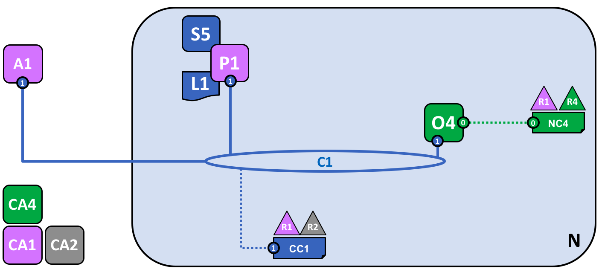
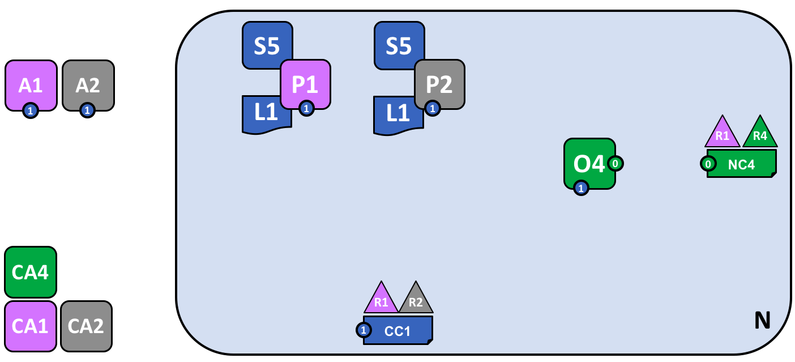

# Блокчейн-сеть

Этот раздел **на уровне ключевых идей** описывает, как Hyperledger Fabric позволяет
организациям сотрудничать в создании сетей блокчейн. Если вы архитектор, администратор или
разработчик, этот раздел поможет вам сформировать глубокое понимание основных элементов
структуры и процесса блокчейн-сети Hyperledger Fabric. В рамках этой темы будет использоваться
рабочий пример, в котором будут представлены все основные компоненты блокчейн-сети.

После прочтения этого раздела вы будете иметь четкое
представление о принимаемых организациями решениях по установлению политик, контролирующих
сеть Hyperledger Fabric. Вы также поймете, как организации управляют
развитием сети с помощью политик, ключевого механизма Hyperledger
Fabric. Одним словом, вы поймете, за что отвечают различные компоненты Hyperledger Fabric и
какие решения должны быть приняты организациями по этим компонентам.

## Что такое блокчейн-сеть?

Блокчейн сеть -- это инфраструктура, предоставляющая приложениям реестр и смартконтракты
(чейнкоды). Прежде всего, смартконтракты используются для создания транзакций, которые
распространяются по сети и записываются в копию реестра всех пир-узлов сети. Пользователи
приложений могут быть как конечными пользователями, так и администраторами блокчейн-сети.

В большинстве случаев, некоторое количество [организаций](../glossary.html#organization)
формируют [консорциум](../glossary.html#consortium) для создания сети и их роли
определяются набором [политик](../glossary.html#policy) через конфигурацию сети, принятую
консорциумом. Политики сети могут со временем меняться, если организации
консорциума соглашаются с изменениями.

## Пример сети

Перед тем как начать, давайте поймем, к чему мы стремимся. Здесь приведена диаграмма,
показывающая **окончательный вид** примера сети.

Не переживайте, если она покажется вам сложной. По мере обсуждения этой темы, мы шаг за шагом
построим сеть так, что бы вы увидели, как организации R1, R2, R3 и R4 способствуют развитию
инфраструктуры сети. Эта инфраструктура обеспечивает
функционирование блокчейн-сети и регулируется политиками, согласованными входящими в сеть
организациями. Политики регулируют, например, кто может добавлять новые организации. Также вы узнаете, как приложения
используют реестры и смартконтракты, предоставляемые блокчейн-сетью.

*Четыре организации, R1, R2, R3 и R4, подписали соглашение, что вместе создадут
и будут эксплуатировать сеть Hyperledger Fabric. R4 был выдвинут в качестве инициатора сети --
ему были предоставлены полномочия на создание начальной версии сети. R4 не собирается
осуществлять бизнес-транзакции в сети. R1 и R2 нуждаются в конфиденциальной связи в рамках
общей сети, также как R2 и R3. У организаций R1, R2 и R3 есть клиентские приложения, которые могут создавать транзакции
в каналах C1, C1 и C2, C2 соответственно.  Узел пира P1 поддерживает копию
реестра L1 канала C1. Узел пира P2 поддерживает копию реестра L1 канала C1, и копию реестра L2 канала C2. Управление сетью осуществляется в соответствии
с правилами политик, указанных в конфигурации сети NC4, сеть контролируется организациями R1 и
R4. Канал C1 управляется в соответствии с правилами политик, указанных в конфигурации канала
CC1; канал контролируется организациями R1 и R2. Канал C2 управляется в соответствии с
правилами политик, указанных в конфигурации канала CC2; канал контролируется организациями R2 и
R3. Ordering-служба O4 служит пунктом администрирования сети N и пользуется системным
каналом. Ordering-служба также поддерживает каналы C1 и C2, в целях проведения ордеринга
транзакций в блоки для дальнейшего распроcтранения. У каждой из четырех организаций есть
свой Certificate Authority (CA, центр сертификации).*

## Создаем сеть

Начнем с создания основы сети:

*Сеть создается в момент запуска ordering-службы. В нашем примере N, ordering-служба,
состоящая из одного узла, O4, настроена в соответствии с конфигурацией сети NC4, которая дает
права администратора организации R4. На уровне сети, Certificate Authority CA4 используется для
выдачи identities администраторам и узлам организации R4.*

Можно видеть, что **ordering-служба O4** -- первое, что определяет **сеть N**. Полезно
представлять ordering-службу первоначальным административным центром сети. Как было согласовано
заранее, O4 изначально настроена и запущена администратором из R4, а также запущена у R4.
Конфигурация NC4 содержит политики, описывающие изначальный набор полномочий администраторов.
Изначально это набор дает права над сетью только R4. Это изменится позже, но пока
R4 -- единственный член сети.

### Certificate Authorities

Certificate Authority, CA4, выдает сертификаты администраторам и узлам сети. CA4 играет
ключевую роль в нашей сети, поскольку он распространяет сертификаты X.509, которые используются
для идентификации компонентов, относящихся к R4. Сертификаты, розданные CA4, могут также
использоваться для подписи транзакций, чтобы показать, что организация подтверждает результат
транзакции -- предварительное условие включения транзакции в реестр. Давайте рассмотрим оба эти
аспекта CA более подробно.

Во-первых, разные компоненты блокчейн-сети используют сертификаты, чтобы идентифицировать
друг друга. Обычно существует несколько CA, поддерживающих блокчейн-сеть --
разные организации обычно используют разные CA. Мы будем использовать четыре CA в нашей сети;
по одному на каждую организацию. CA настолько важны, что Hyperledger Fabric
предоставляет встроенный (*Fabric-CA*) для помощи вам, хотя на практике организации обычно
используют свой собственный CA.

За сопоставление сертификатов и организаций-членов отвечает структура под названием
[Membership Services Provider (MSP)](../glossary.html#membership-services). Конфигурация сети
NC4 использует MSP для того, чтобы определить параметры сертификатов,
выданных CA4 (CA4 связывает владельцев сертификатов с организацией R4). NC4 использует MSP
в политиках, чтобы давать участникам R4 доступ к ресурсам сети. Политика может, например,
определить администратора из R4, который может добавлять новые организации в сеть. Мы не будет
показывать MSP на диаграммах, так как они только загромодят их, но они очень важны.

Во-вторых, мы позже увидим, как выданные CA сертификаты находятся в центре создания
[транзакций](../glossary.html#transaction) и процесса их проверки. Сертификаты X.509 используются в
[транзакционных proposals](../glossary.html#proposal) клиентских приложений и
[ответов на транзакции](../glossary.html#response) смартконтрактов для цифровой подписи
[транзакций](../glossary.html#transaction). Впоследствии узлы сети, хранящие копии реестра,
проверяют подписи транзакций на валидность перед занесением транзакций в свой реестр.

Давайте повторим базовую структуру нашего примера блокчейн-сети. Есть ресурс: сеть N, к
которой есть доступ у ряда пользователей (определенных Certificate Authority CA4) которые имеет
набор прав на ресурсы в сети N, что описано в политиках, содержащихся в конфигурации сети NC4.
Все приходит в действие, когда мы запускаем узел ordering-службы O4.

## Добавляем сетевых администраторов

NC4 изначально был настроен лишь предоставлять пользователям R4 права администратора сети.
На следующем шаге, мы разрешим пользователям организации R1 администрировать сеть. Давайте
посмотрим, как развивается сеть:

*Организация R4 обновляет конфигурациб сети, чтобы сделать R1 вторым администратором. После
этого действия R1 и R4 имеют равные права на настройку сети.*

Мы видим добавление новой организации R1 в качестве администратора -- R1 и R4 теперь имеют
равные права в сети. Мы также можем видеть, что был добавлен certificate authority CA1 -- для
идентификации пользователей из R1. С этого момента пользователи и R1, и R4 могут
администрировать сеть.

Хотя узел ordering-службы, O4, работает на инфраструктуре R4, R1 имеет такие же
администраторские права на нее. R1 или R4 могут обновить конфигурацию сети NC4 и позволить
организации R2 совершать некоторое количество сетевых операций. Тогда, несмотря на то, что R4
управляет ordering-службой, а R4 обладает всеми администраторскими правами на нее, R2 также имеет
ограниченные права на создание новых консорциумов.

В своей самой простой форме, ordering-служба является одним узлом в сети, и именно это мы видим
в примере. Ordering-службы обычно запущена на нескольких узлах сразу и может быть настроена
так, чтобы иметь разные узлы в разных организациях. Например, мы можем запустить O4 на R4 и
объединить ее с O2, отдельным узлом ordering-службы в организации R1. Таким образом, у нас
будет административная структура, включающая несколько сайтов и организаций.

Мы обсудим ordering-службу чуть [позже](#ордеринг-служба), сейчас давайте представим
ordering-службу как административный пункт, предоставляющий разным организациям
контролируемый доступ в сеть.

## Создаем консорциум

Теперь сеть администрируется R1 и R4. Первое, что нам нужно
сделать -- создать консорциум. Это слово буквально означает "группа с общей судьбой" (a group
with a shared destiny, а реестр -- shared ledger) -- поэтому это логичное название для группы
организаций в блокчейн-сети.

Давайте посмотрим, как создается консорциум:

*Сетевой администратор создает консорциум Х1, состоящий из двух членов -- организаций R1 и R2.
Определение этого консорциума хранится в конфигурации сети NC4 и будет использовано на
следующем шаге развития сети. CA1 и CA2 -- доверенные Certificate Authorities этих
организаций.*

Из-за определенной настройки NC4 только R1 и R4 могут создавать новые консорциумы. Это схема
показывает добавление нового консорциума, X1, который определяет R1 и R2 в качестве
организаций, образующих его. Также был добавлен CA2 для идентификации
пользователей из R2. Заметьте, что консорциум может состоять из скольки угодно членов -- мы
приводим двух членов в качестве простейшей конфигурации.

Почему консорциум важен? Консорциум определяет набор организаций в сети,
которым можно осуществлять **транзакции** друг с другом -- в нашем случае R1 и R2. Логично группировать организации, имеющие общие цели, и это именно то, что мы делаем.

Сеть, которая в начале контролировалась единственной организацией, сейчас контролируется большим
набором организаций. Мы могли бы начать с того, что R1, R2 и R4 имеют общий контроль, однако так
было проще понять.

Теперь мы используем консорциум X1 для создания важного элемента блокчейна Hyperledger Fabric --
**канала**.

## Создаем канала для консорциума

Давайте создадим ключевой элемент блокчейн-сети Fabric -- **канал**. Канал -- это основной
механизм связи, с помощью которого члены консорциума могут общаться друг с другом. В сети может
быть несколько каналов, но мы начнем с одного.

Давайте посмотрим, как первый канал добавляется в сеть:

*Канал C1 был создан для R1 и R2 с использованием определения консорциума X1. Канал управляется
конфигурацией канала CC1, отдельной от конфигурации сети. CC1 управляется R1 и R2, обладающими
равными правами над C1. R4 не имеет никаких прав в CC1.*

Канал C1 предоставляет механизм конфиденциальной коммуникации для консорциума X1. Канал C1 привязан только к ordering-службе O4. На
следующем этапе развития мы подключим такие компоненты, как клиентские приложения и узлы пиров.

Заметим, что организаций R3 и R4 нет в этом канале -- он предназначен лишь для обработки транзакций между R1 и R2. На
предыдущем шаге мы видели, как R4 разрешила R1 создавать новые консорциумы. Полезно заметить,
что R4 **также** разрешила R1 создавать каналы. На этой схеме канал C1 могла создать как
организация R1, так и организация R4. Канал может иметь сколько угодно
организаций -- мы приводим в пример две организации, так как это проще всего.

У канала C1 полностью отдельная от NC4 конфигурация, CC1. CC1
содержит политики, управляющие правами, которые R1 и R2 имеют в канале C1 -- как мы знаем, R3 и
R4 не имеют доступа в этот канал. R3 и R4 смогут взаимодействовать с C1 только если их добавит
R1 or R2 к соответствующей политике в CC1. Пример показывает, кто может
добавлять новые организации в канал. Важно заметить, что R4 не может добавить саму себя в канал
C1 -- ее должна добавить либо R1, либо R2.

Почему каналы так важны? Каналы очень полезны, поскольку они предоставляют механизм для
приватной коммуникации и конфиденциальных данных между членами консорциума. Каналы гарантируют
конфиденциальность в сети и изолируют данные от других каналов. Hyperledger Fabric
позволяет организациям иметь общую инфраструктуру, при этом оставляя части инфраструктуры скрытыми от других организаций.
Каналы предоставляют эффективную распределенную инфраструктуру, но при этом
поддерживают конфиденциальность данных и транзакций.

Канал "свободен от остальной сети". С момента его создания только организации, указанные в конфигурации канала, имеют над ним контроль.
Любое обновление конфигурации сети NC4 с этого момента не влияет на
конфигурацию канала CC1; например, если если изменится определение консорциума X1, это не
повлияет на состав членов канала C1.
Данные канала полностью изолированы от остальной сети.

Существует специальный **системный канал** только для ordering-службы. Он ведет себя
точно так же как и другие каналы, которые иногда называют **application**-каналами (прикладными
каналами). Мы обсудим системный канал [чуть позже](#ордеринг-служба).

## Пиры и реестры

Давайте начнем использовать канал для объединения блокчейн-сети и организационных
компонентов воедино. На следующем шаге развития сети, мы увидим, что в нашей сети N появились
два новых компонента -- узел пира P1 и копия реестра L1.

*Узел пира P1 только что присоединился к каналу C1. P1 физически хранит копию реестра L1. P1 и
O4 могут общаться друг с другом с помощью канала C1.*

Пиры -- это компоненты сети, где хранятся копии блокчейн-реестра. Наконец-то появились
узнаваемые элементы блокчейна! Целью P1 является хранение копии реестра для других
пользователей. Мы можем представлять, что L1 **физически хранится** у P1, но **логически
хранится** в канале C1. Мы поймем эту идею, когда добавим больше пиров в канал.

Ключевой частью конфигурации P1 является identity X.509, выданный CA1, который связывает P1 с
R1. Когда администратор R1 включает P1 в C1 и пир начинает загружать
блоки с ordering-службы O4, ordering-служба использует CC1 для определения
прав P1 на этом канале. Например, политика в CC1 определяет, может ли P1 (организация R1) читать
и/или записывать в C1.

Заметьте, что пиров в каналы добавляют организации, владеющие ими, и, хотя мы добавили лишь
одного пира, позже мы увидим, как в одной сети могут сосуществовать несколько таких узлов. Мы
также увидим различные роли, которые пиры могут брать на себя.

## Приложения и чейнкод смартконтрактов

Теперь, когда C1 имеет реестр, мы можем начать присоединять клиентские приложения, чтобы
начать использовать услуги, предоставляемых рабочей лошадкой реестра, пиром.

Заметьте, как выросла сеть:

*Смартконтракт S5 установили на P1. Клиентское приложение A1 организации R1 теперь может
использовать S5 для доступа в реестр через P1. A1, P1 и O4 присоеденены к каналу
C1, то есть они все могут пользоваться средствами коммуникации, предоставляемыми этим каналом.*

Теперь клиентское приложение A1 может использовать канал C1 для соединения с ресурсами сети -- в нашем случае A1 может
подключиться к P1 и O4. Обратите внимание, что каналы играют главную роль в сети - обеспечивают связь между компонентами сети и компонентами организаций. Так же как пиры и
ordering-службы, клиентские приложения имеют identity, привязанную к организации. В нашем
случае клиентское приложение A1 привязано к организации R1; и, хотя A1 находится вне
блокчейн-сети Fabric, оно подключено к ней через канал C1.

Может показаться, что A1 может получить доступ к реестру L1 напрямую через P1, однако на
самом деле доступ осуществляется через специальную программу - смартконтракт, S5. S5 определяет доступ к реестру: он предоставляет четко определенный
набор способов обновления или запроса реестра L1. Короче говоря, клиентское приложение A1, чтобы
добраться до реестра L1, должно пройти через смартконтракт S5.

Разработчики приложений организаций могут создавать смартконтракты для того, чтобы реализовать
общий для членов консорциума бизнес-процесс. Смартконтракты используются для создания
транзакций. Эту идею мы обсудим позже, а сейчас важно понять следующее: чтобы пользоваться
смарктонтрактом, необходимо **определить** его в канале и **установить** его на пир.

Пользователи Hyperledger Fabric часто используют термины **смартконтракт** и **чейнкод** как
синонимичные понятия. В общих чертах, смартконтракты определяют  **логику транзакций**,
контролирующих бизнес-объекты из world state. Смартконтракт упаковывается в
чейнкод, который впоследствии разворачивается в блокчейн-сети.

### Установка чейнкод-пакета

После разработки смартконтракта S5 администратор организации R1 создает чейнкод-пакет и
[устанавливает](../glossary.html#install) его на P1. После завершения этой операции P1
знает все о S5. В частности, узлу P1 доступна **реализация**, программный код S5.
**Интерфейс S5**  лишь описывает входные и выходные данные
S5 и не зависит от реализации S5.

Смартконтракты не должны быть установлены на каждом пире, поэтому, если у организации есть
больше одного пира в канале, она может выбрать тех пиров, у которых будут установлены смарт
контракты.

### Определение чейнкода

Несмотря на то, что чейнкод установлен на пирах отдельных организаций, он управляется и
эксплуатируется в рамках канала. Каждая организация должна одобрить **определение чейнкода** --
набор параметров, который устанавливает, как в канале будет использоваться чейнкод. Организация
должна одобрить определение чейнкода, чтобы использовать установленный смартконтракт чтобы
совершать поисковые запросы по реестру и подтверждать транзакции. В нашем примере с единственным пиром P1
администратор организации R1 должен утвердить определение чейнкода для S5.

Для сохранения определения чейнкода в канале и последующего его взаимодействия с реестром канала
необходимо одобрения определенного количества организаций (по умолчанию большинства
организаций). Поскольку наш канал состоит из одного узла, администратор из R1 может сохранить
определение чейнкода S5 в канале C1. После сохранения определения, S5 может
[использоваться](../glossary.html#invoke) клиентским приложением A1!

Заметьте, что хотя все компоненты канала теперь имеют доступ к S5, они не видят его код. Он
известен лишь установившим смартконктракт узлам; в нашем случае это P1.
Это означает, что в канале определен и сохранен только **интерфейс** смартконтракта.

### Политика подтверждения

Самой важной информацией в определении чейнкода является
[политика подтверждения](../glossary.html#endorsement-policy), определяющая, какие организации
должны одобрить транзакцию, созданную чейнкодом, прежде чем она будет добавлена в копии реестра. В нашем примере,
транзакции сохраняются в реестр L1 при наличии подтверждения от R1 или R2.

Сохранение определения чейнкода в канале помещает политику подтверждения в реестр канала; это
позволяет любому члену канала посмотреть ее. Больше про политику подтверждения можно
почитать в теме про [транзакционный поток](../txflow.html).

### Вызов смартконтракта

После установки на пир и сохранения определения в канале клиентское приложение может
[вызвать](../glossary.html#invoke) смартконтракт, отослав транзакционный proposal пирам
организаций, указанным в политике подтверждения смартконтракта. Proposal транзакции содержит
входные данные в смартконтракт, который принимает их и в случае успеха возвращает подтвержденный transaction response (транзакционный ответ), который с помощью узла пира возвращается в клиентское приложение.

Response объединяется с proposal и формируют полностью
подтвержденную транзакцию, которая впоследствии может быть распределена по всей сети. Мы более
детально рассмотрим оговорим это позже. Пока достаточно понимать, как приложения вызывают смартконтракт
для создания подтвержденной транзакции.

A1 имеет доступ к реестру L1 через смартконтракт S5, создает транзакции, которые впоследствии подтверждаются R1 и сохраняются в реестр при удовлетворении политик
подтверждения.

## Готовая сеть

Вспомним, что нашей целью было создание канала для консорциума X1. На
следующей стадии развития сети организация R2 добавит свою инфраструктуру в сеть.

Посмотрим, как развилась сеть:

*Сеть выросла после добавления инфраструктуры организации R2. R2 добавила узел пира P2, у
которого хранится копия реестра L1 и чейнкод S5. R2 одобряет то же определение чейнкода, что и
R1. P2 присоединился к каналу C1, так же как и приложение A2. A2 и P2 имеют сертификаты от
CA2. Все это означает, что оба приложения, A1 и A2, могут запускать S5 в C1, используя либо P1,
либо P2.*

P2 также хранит копию реестра L1 и смартконтракт S5.
A2 может подключаться к сети по каналу C1. Для этого администратор организации R2 создал
P2 и подключил его к каналу C1. Администратор также должен одобрить определение чейнкода S5.

Мы только что создали нашу первую сеть! На этой стадии развития сети, у нас есть канал, по
которому организации R1 и R2 могут совершать транзакции друг с другом. Это означает, что
приложения A1 и A2 могут генерировать транзакции с использованием смартконтракта S5 и реестра
L1 канала C1.

### Создание транзакций

Все пиры хранят копии реестра, однако смартконтракты хранят только часть пиров. В нашей
сети каждый пир хранит копию смартконтракта, но в более широких сетях будет много пиров, у
которых не хранятся копия смартконтракта. Пир может *запустить* смартконтракт, только если он
у него установлен, но интерфейс смартконтракта знают все пиры канала.

Пиры со смартконтрактами помогают **создавать** транзакции. Заметьте, что все пиры могут **проверять** и впоследствии **отклонять** или
**принимать** транзакции в свою копию реестра L1. Однако только пиры с установленными
смартконтрактами могут принимать участие в **подтверждении** транзакции, что имеет ключевое
значение для создания валидных транзакций.

В этом разделе нас не интересуют детали создания, распространения и принятия транзакций --
достаточно понимать, что у нас есть блокчейн-сеть, в которой организации R1 и R2 обмениваются
информацией и процессом транзакций, записываемых в реестр. Мы узнаем больше о транзакциях,
реестрах и смартконтрактах в других разделах.

### Виды пиров

В Hyperledger Fabric пиры могут играть несколько ролей в зависимости от
настройки сети. У нас уже сформировалось понимание топологии обычной сети, нужное для описания
этих ролей.

  * [*Сохраняющий пир*](../glossary.html#commitment). Каждый пир в канале является сохраняющим. Он получает блоки с подтвержденными транзакциями и сохраняет их в свою копию реестра.

  * [*Подтверждающий пир*](../glossary.html#endorsement). Каждый пир со смартконтрактом может быть подтверждающим пиром для этого смартконтракта.
    Такой пир может подтвердить proposal, создав transaction response со своей цифровой подписью.
    Политика подтверждения смартконтрактов указывает организации, чьи пиры должны поставить цифровую подпись на транзакции перед тем, как она будет принята в копию реестра пиров канала.

Это два основных типа пиров; две другие роли пиров:

  * [*Пир-лидер*](../glossary.html#leading-peer). У организации, имеющей несколько пиров в канале есть пир-лидер,
    узел, ответственный за передачу блоков от ordering-службы другим пирам организации.
    Пир может выбрать участие либо в статическом, либо в динамическом отборе лидеров.
    Поэтому полезно думать о двух категориях пиров с точки зрения лидерства -- тех, у которых отбор лидеров статичен, и тех, у которых он динамичен.
    В статичной категории лидерами могут быть ноль или больше пиров.
    В динамичной категории один пир может быть избранным лидером группы.
    Более того, в динамичной категории, если пир-лидер упадет, среди оставшихся пиров выбирется новый лидер.
    Это означает, что пиры организаций могут иметь одного или больше лидеров, связанных с ordering-службой.
    Это повышает устойчивость и масштабируемость в крупных сетях, обрабатывающих большие объемы сделок.

  * [*Anchor-пир*](../glossary.html#anchor-peer). Если пир должен связаться с пиром другой организации,
    то он может использовать один из **anchor-пиров** своей организации, определенных в конфигурации канала.
    Организация может иметь ноль или больше пиров-anchor определенных для нее, и anchor-пиры могут помогать во многих сценариях межорганизационной коммуникации.

Заметьте, что пир может быть сохраняющим пиром, подтверждающим пиром, пиром-лидером и anchor-пиром одновременно!
Только роль anchor-пира полностью опциональна -- для всех практических целей всегда должен быть пир-лидер,
хотя бы один подтверждающий пир и хотя бы один сохраняющий пир.

### Добавление организаций и пиров в канал

При добавлении R2 в канал, R2 должна установить смартконтракт S5 на узел пира P2. Это
очевидно -- если приложения A1 или A2 захотят использовать S5 на узле пира P2 для создания
транзакции, он должен там быть. Пир P2 имеет физическую копию смартконтракта и реестра, и
так же как и P1 он может генерировать и принимать транзакции в свою копию реестра L1.

R2 должен принять то же определение чейнкода, которое было принято R1 для того, чтобы
использовать смартконтракт S5. Поскольку определение чейнкода уже сохранено в канал
организацией R1, R2 может начинать пользоваться чейнкодом, как только одобрит определение
чейнкода и установит чейнкод-пакет. Сохранение транзакции происходит только один раз. Новая
организация может использовать чейнкод, как только подтвердит параметры чейнкода, установленные
другими членами канала. Поскольку подтверждение определения чейнкода происходит на уровне
организаций, R2 может единожды одобрить определение чейнкода, а потом добавлять пиров в канал с
уже установленным чейнкодом. Однако, если R2 захочет поменять определение чейнкода,то и R1, и R2
должны будут подтвердить новое определение, а затем одна из организаций
должна будет сохранить определение в канал.

В нашей сети мы видим, как канал C1 соединяет два клиентских приложения, два узла пиров и
ordering-службу. Поскольку есть только один канал, существует только один **логический** реестр,
с которым взаимодействуют эти компоненты. Узлы пиров P1 и P2 хранят идентичные копии реестра L1.
Копии смартконтракта S5 обычно реализованы с помощью одного языка программирования и в таком
случае идентичны, если же они реализованы с помощью разных языков программирования, то они
должны быть семантически одинаковы.

Можно видеть, что осторожное добавление пиров в сеть может помочь поддерживать высокую
производительность, стабильность и устойчивость. Например, большее количество пиров в сети
позволят подключать больше приложений, а большее количество пиров в организации обеспечат
дополнительную устойчивость в случае сбоев.

Все это означает, что можно настроить сложные топологии, которые поддерживают множество
целей -- не существует теоретического ограничения размера сети. Кроме того,
механизм, с помощью которого пиры отдельной организации находят друг друга и
через который общаются -- [gossip-протокол](../gossip.html#gossip-protocol) -- выдержит большое количество
пиров для поддержки этих топологий.

Осторожное использование политик сети и каналов позволяет качественно управлять огромными
сетями. Организации могут добавлять узлы пиров в сеть, если они соответствуют политикам,
утвержденным в сети. Политики сети и каналов устанавливают баланс между автономностью и
контролируемостью, характерными для децентрализованной сети.

## Упрощаем диаграмму

Теперь давайте упростим схему нашей сети. С увеличением размера сети, линии, иллюстрирующие отношения
различных компонент с каналом, начнут загромождать диаграмму.

Вот диаграмма без них:

*Теперь отношение компонента с каналом представляет маленький цветной кружок с номером канала внутри.*

## Добавляем еще один консорциум

Давайте сначала добавим организацию R3 и создадим для R2 и R3 отдельный канал, но для этого сначала
нам придется добавить консорциум X2 из R2 и R3.

*Администратор сети из R1 или R4 добавил новое определение консорциума X2 в NC4.*

Новый канал может быть создан только организациями, которые в NC4 были указаны, как имеющие на это право, то
есть R1 и R4. Это пример политики, разделяющей организации на два типа: одни могут управлять ресурсами на уровни
всей сети, а другие - только на уровне канала.

## Добавляем новый канал

Теперь давайте используем X2, чтобы создать новый канал, C2.
C1 представлен синим кружком с числом 1, а C2 - красным кружком с числом 2.

*Новый канал C2 для организациий R2 и R3, составляющих консорциум X2. C2 имеет конфигурацию CC2,
полностью независящию от CC1 и NC4. C2 управляется R2 и R3, и эти организации имеют равные права,
как указано в политике из CC2. По CC2, R1 и R4 не имеют никаких прав в C2. Например, добавить организацию
в C2 могут только R2 и R3.*

Заметьте, как CC1, CC2 и NC4 полностью не зависят друг о друга; мы наблюдаем децентрализованную природу
Hyperledger Fabric.

С развитием сети и каналов также развиваются и их конфигурации. Каждое изменение конфигурации должно происходить
через конфигурационную транзакцию, каждая из которых помещается в отдельный конфигурационный блок и далее распределяется по каналу.
Подробнее этот механизм мы обсудим [позже](#ордеринг-служба).

### Конфигурации сети и канала

На протяжении всего развития нашей сети, мы видим важную роль, которую в ней играют конфигурации сети и каналов.
Конфигурации важны, так как содержат **политики**, на которых сошлись участники сети и которые определяют
права этих участников на ресурсы сети. Так же конфигурации содержат факты о структуре сети и каналов.

Все узлы ordering-службы поддерживают конфигурацию сети и входящий в нее список всех каналов.

Конфигурация сети гораздо важнее ордеринг-службы, которая только ее реализует.

Аналогично, конфигурация канала важнее пиров. Когда пиры взаимодействуют с A1 или A2,
они соблюдают и реализуют политики, определенные в CC1.

Например, если A1 хочет получить доступ к S5 на пирах P1 и P2, пиры используют свою
копию CC1, чтобы определить права A1. Например, через политики CC1 A1 может быть разрешено только читать
данные с L1, но не записывать их. P1, P2, O4, A1, A2 - важнейшие акторы сети, но их поведение
продиктовано соответствующей конфигурацией сети или канала.

Хотя, например, у канала логически существует только одна конфигурация, физически
она скопирована, распределена на все узлы канала, при этом
она поддерживается согласованной на всех узлах.

Эта согласованность достигается той же блокчейн-технологией, что используется и для
пользовательских транзакций, но в данном случае фигурируют **конфигурационные** транзакции.
Чтобы изменить конфигурацию канала, администратор должен предложить конфигурационную транзакцию,
которую должны подписать организации, указанные в соответствующей политике -- **mod_policy**, которую
мы [обсудим позже](#изменяем-политику).

Ордеринг-служба поддерживает свой блокчейн (блокчейн системного канала), состоящий из конфигурационных транзакций, распределенный
между всеми ее узлами. Аналогично, узлы обычного канала также хранят конфигурационные транзакции, но кроме них в блокчейне
хранятся также и пользовательские транзакции.

Такой баланс между объектами, логически находящимися в одном числе, но физически распределенными на несколько копий часто встречается
в HL Fabric.

## Добавляем еще один пир

Теперь, когда R3 может полностью участвовать в C2, добавим ее компоненты инфраструктуры
в канал.

Сеть со всем компонентами R3:

Для начала, заметьте, что так как P3 -- пир канала C2, то он хранит реестр канала C2 -- L2, никак не связанный с L1.

Аналогично S5, смартконтракт S6, установленный на узле P3 и определенный в C2, используется для предоставления
контролируемого доступа приложениям к реестру L2. A3 может использовать канал C2, чтобы вызывать службы, предоставляемые
S6, которые будут создавать транзакции.

## Соединяем пир с несколькими каналами сразу

На этом финальном этапе развития сети давайте обратим внимание на R2: эта организация -- член сразу
двух консорциумов, X1 и X2. Мы можем использовать это и подсоединить пир R2, P2, сразу к двум
каналам:

R2 -- единственный член сети, который при этом состоит в двух каналах (не считая системный канал).
R2 может создавать транзакции с R1 и с R3 одновременно.

Так как P2 теперь актор канала C2, то он должен установить S6.

Каналы одновременно обеспечивают механизм как разделения организаций, так и их объединения.

Важно заметить, что поведение P2 зависит от канала, на котором пир оперирует в конкретный момент,
так как политики, определенные в CC1, отличаются от политик, определенных в CC2.

Также мы настроили A2 так, что это приложение теперь может вызывать и S5, и S6, тем самым
взаимодействуя с C1 и C2.

### Ордеринг-служба

Внимательный читатель может заметить, что ордеринг-служба является централизованным компонентом;
она была создана для содания сети и соединяет каждый канал сети. Хотя две организации, R1 и R4,
управляют NC4, которая в свою очередь управляет ордеринг-службой, ордеринг-служба
работает только на инфраструктуре R4. Это выглядит неправильно, ведь Hyperledger Fabric - децентрализованная платформа.

На самом деле, ордеринг-служба может быть полностью децентрализованной. Давайте посмотрим на более реалистичную конфигурацию
ордеринг-службы:

*Межорганизационная ордеринг-служба, состоящая из ордеринг-узлов O1 и O4.
O1 принадлежит R1, а O4 - R4. NC4 указывает разрешения для O1 и O4.*

Для соединения с ордеринг-службой другие акторы, как пиры или приложения, могут подсоединится как
к O1, так и к O4, так как оба узла работают одинаково (в теории), как определено в NC4. На практике,
акторы конкретной организации чаще подключаются к ордеринг-узлу своей организации, но не всегда.

### Децентрализованное распределение транзакций

Кроме того, что ордеринг-служба -- центр администрации сети, она также является центром
распределения транзакций. Ордеринг-служба -- компонент, который собирает подтвержденные транзакции,
упорядочивает и упаковывает в блоки, которые, затем, распределяются по всем пирам канала, которые
сохраняют блоки с транзакциями в свой реестр (блокчейн).

Заметьте, что роль узла O4 перед каналом C1 отличается от роли, которую O4 играет перед сетью.
Когда O4 взаимодействует с каналом C1, этот узел собирает транзакции с C1 и распределяет блоки по C1.
Все эти действия он проводит согласно политикам, определенным в конфигурации **канала** CC1. Когда
O4 оперирует на уровне сети, ее роль в том, чтобы быть управлять ресурсами сети согласно политикам из конфигурации **сети** NC4.

### Изменяем политику

На каждом этапе развития нашей сети мы наблюдали важную роль политик в контролировании поведения акторов системы.
Существует множество политик, позволяющих контролировать
каждый аспект поведения акторов, мы обсудили только малую их часть.

В Fabric существует самая главная политика, позволяющая администраторам сети и каналов
изменять соответствующую конфигурацию -- **modification policy** (политика модификации), или
**mod_policy**.

Пример ее использования в нашей сети:

Как только мы установили нашу сеть, только R4 могла ей управлять. На практике это было реализовано тем, что по NC4 только
R4 имела доступ к ресурсам сети. mod_policy упоминала только R4, следовательно только R4 могла менять NC4.
  
Далее R4 добавила R1 в политики создания каналов и консорциумов. Из-за этого R1 смогла потом определить X1 и X2 и создать C1 и C2.
R1 и R4 стали иметь равные права в отношении консорциумов и каналов.

R4, однако, могла дать еще больше привилегий R1, если включила бы ее в mod_policy. Тогда бы R1 имела **полный контроль**
над конфигурацией сети NC4, и даже, в теории, могла бы лишить R4 всех ее прав. На практике, R4 настроила бы mod_policy
так, что на это изменение потребовалось согласие R4. mod_policy достаточно гибкая, чтобы поддержать любые
требования по настройке процесса изменения конфигурации.

mod_policy можно настроить так, чтобы ее изменение происходило только при согласии организаций, уже в нее включенных;
mod_policy работает так же, как и любая другая политика; она определяет набор организаций, которые могут изменить саму mod_policy.

## Полностью сформировавшаяся сеть

Давайте вспомним, как выглядит наша сеть:

Мы достигли конца нашего пути. Мы создали сеть из четырех организаций с двумя каналами,
тремя пирами, двумя смартконтрактами и с ордеринг-службой из двух узлов. Все это поддерживается
четырьмя CA. Сеть предоставляет смартконтракты трем приложениям, которые могут взаимодействовать с ней
через два канала.

### Сводка по компонентам сети

* [Реестр](../glossary.html#ledger). Один на канал. Состоит из
  [Блокчейна](../glossary.html#block) и
  [World state](../glossary.html#world-state)
* [Смартконтракты](../glossary.html#smart-contract)
* [Пиры](../glossary.html#peer)
* [Ордеринг-служба](../glossary.html#ordering-service)
* [Каналы](../glossary.html#channel)
* [CA](../glossary.html#hyperledger-fabric-ca)

<!--- Licensed under Creative Commons Attribution 4.0 International License
https://creativecommons.org/licenses/by/4.0/) -->
