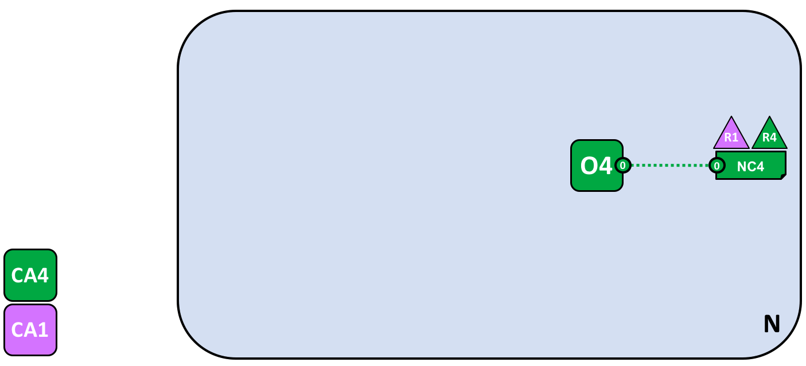

# Блокчейн-сеть

В этом разделе рассматривается **концепция** устройства сети Hyperledger Fabric, позволяющая организациям сотрудничать при формировании блокчейн-сети.  Информация этого раздела будет полезна архитекторам, администраторам или разработчикам для получения четкого представления о структуре и компонентах процессов в блокчейн-сети Hyperledger Fabric. В этой теме приводится рабочий пример, содержащий все основные компоненты блокчейн-сети.

Информация в этом разделе дает понимание концепции установленных правил и ясное представление о решениях, принимаемых организациям для настройки правил управления развернутой сетью Hyperledger Fabric. Также будет подробно рассказано, каким образом организации могут контролировать развитие сети с помощью декларативных правил — ключевой функции Hyperledger Fabric. Таким образом, в этом разделе рассматриваются основные технические компоненты Hyperledger Fabric, а также действия организаций в отношении этих компонентов.

## Что такое блокчейн-сеть

Блокчейн-сеть — это специальная инфраструктура, которая предоставляет приложениям возможность использования реестра и смарт-контрактов (чейнкодов). В первую очередь, смарт-контракты применяются для создания транзакций, которые впоследствии распределяются по всем одноранговым узлам сети, где они записываются в копии реестра без возможности внесения изменений. Пользователями приложений могут быть конечные пользователи, использующими клиентские приложения, или администраторы блокчейн-сети.

В большинстве случаев несколько [организаций](../glossary.html#organization) объединяются в [консорциум](../glossary.html#consortium) для формирования сети, при чем их полномочия определяются набором [установленных правил](../glossary.html#policy), которые согласовываются членами консорциума при первоначальной настройке сети. Более того, правила сети могут со временем меняться при условии согласия организаций в консорциуме. Об этом подробнее далее при обсуждении концепции *правил обновления*.

## Пример сети

Прежде чем начать, посмотрим на конечный результат. На этой схеме представлено **конечное состояние** примера сети.

Выглядит запутанно? Не беспокойтесь. Далее в разделе мы поэтапно построим сеть и покажем, каким образом организации R1, R2, R3 и R4 используют свою инфраструктуру для формирования сети. Блокчейн-сеть реализуется благодаря этой инфраструктуре, а также регулируется правилами, согласованными организациями, которые формируют сеть, и, например, описывают участников, которые могут добавлять новые организации. Далее будет рассказано, как приложения используют службы реестра и смарт-контрактов, предоставляемые блокчейн-сетью.

*Четыре организации, R1, R2, R3 и R4, решили подписать соглашение о создании и совместном использовании сети Hyperledger Fabric. Организация R4 была назначена инициатором сети, получив полномочия для настройки первоначальной версии сети. Организация R4 не намерена выполнять бизнес-транзакции в сети. Организации R1 и R2, а также R2 и R3, нуждаются в закрытом канале связи внутри сети. Организация R1 имеет клиентское приложение, которое может выполнять бизнес-операции в канале C1. Организация R2 имеет клиентское приложение, которое может выполнять аналогичные операции как в канале C1, так и в канале C2. Организация R3 имеет клиентское приложение, которое может производить таки операции в канале C2. Одноранговый узел P1 содержит копию реестра L1, связанного с каналом C1. Одноранговый узел P2 содержит копию реестра L1, связанного с каналом C1, и копию реестра L2, связанную с каналом C2. Одноранговый узел P3 содержит копию реестра L2, связанного с каналом C2. Сеть управляется согласно правилам, указанным в конфигурации сети NC4, а также находится под контролем организаций R1 и R4. Управление каналом C1 осуществляется в соответствии с правилами, указанными в конфигурации канала CC1. Сам канал находится под контролем организаций R1 и R2.  Управление каналом C2 осуществляется в соответствии с правилами, указанными в конфигурации канала CC2. Сам канал находится под контролем организаций R2 и R3. Предусмотрена служба упорядочения O4, которая выступает в качестве точки администрирования сети N через системный канал. Служба упорядочения также поддерживает работу каналов приложений C1 и C2 для упорядочивания транзакций в блоки, а также последующего распределения. Каждая из четырех организаций имеет собственный удостоверяющий центр.*

## Создание сети

Начнем с первых шагов создания сети:

*Сеть формируется при инициализации узла службы упорядочения. В нашем примере сети N служба упорядочения, состоящая из одного узла O4, настроена согласно конфигурации сети NC4, которая дает организации R4 права администрирования. На сетевом уровне удостоверяющий центр CA4 используется для выдачи идентификаторов администраторам и сетевым узлам организации R4.*

На схеме видно, что первым элементом, определяющим **сеть N**, является **служба упорядочения O4**. Удобно представлять службу упорядочения как первичную точку администрирования сети. Служба O4 изначально настраивается и запускается администратором организации R4, а также размещается в R4, что определяется заранее. Конфигурация NC4 содержит правила, которые описывают начальный набор административных возможностей в сети. Изначально права управлению сетью предоставляются организации R4. В настоящий момент организация R4 является единственным членом сети, что изменится далее с развитием сети.

### Удостоверяющие центры

Также на схеме показан удостоверяющий центр CA4, который используется для выдачи сертификатов администраторам и узлам сети. Центр CA4 играет ключевую роль в сети, поскольку выдает сертификаты X.509 для идентификации принадлежности различных субъектов к организации R4. Сертификаты от удостоверяющих центров также могут использоваться для подписи транзакций и одобрения результатов транзакций организацией, что является предварительным условием для записи транзакций в реестр. Рассмотрим эти две функции удостоверяющих центров более подробно.

Во-первых, разные компоненты блокчейн-сети используют сертификаты для идентификации принадлежности к определенной организации. Поэтому обычно для обслуживания сети применяется несколько удостоверяющих центров — разные организации часто используют разные центры сертификации. В нашем примере сети предусмотрено четыре центра — по одному на каждую организацию. Действительно, удостоверяющие центры настолько важны, что в Hyperledger Fabric предусмотрен свой собственный центр (с названием *Fabric-CA*), который поможет начать работу с сетью. Хотя на практике организации предпочитают использовать собственные удостоверяющие центры.

Принадлежность сертификатов организациям-членам определяется структурой, называемой [провайдер службы членства (MSP)](../glossary.html#members-services). В конфигурация сети NC4 указывается конкретный провайдер службы членства для идентификации свойств сертификатов, выдаваемых центром CA4, которые связывают владельцев сертификатов с организацией R4. Далее этот провайдер может использоваться согласно конфигурации NC4 в правилах для предоставления определенных прав на сетевые ресурсы субъектам организации R4. Примером таких правил является определение администраторов в организации R4, которые могут добавлять новые организации в сеть. Для простоты на схемах не показаны провайдеры службы членства, однако они очень важны.

Во-вторых, далее будет рассмотрено, что сертификаты от удостоверяющих центров являются основой процесса создания и проверки [транзакций](../glossary.html#transaction). В частности, сертификаты X.509 используются в [запросах на транзакции](../glossary.html#proposal) в клиентском приложении и [ответах на транзакции](../glossary.html#response) от смарт-контрактов для цифровой подписи [транзакций](../glossary.html#transaction).  Впоследствии сетевые узлы, хранящие копии реестра, проверяют действительность подписей транзакций перед применением транзакций к реестру.

Вспомним базовую структуру нашего примера блокчейн-сети. Существует сеть N — ресурс, доступным набору пользователей, определенных удостоверяющим центром CA4. У этих пользователей есть набор полномочий в отношении ресурсов сети N согласно установленным правилам, указанным в конфигурации сети NC4.  Работа сети может быть начата после настройки и запуска узла службы упорядочения O4.

## Добавление сетевых администраторов 

Согласно первичным настройкам конфигурации NC4 административные права в сети предоставляются только пользователям организации R4. Далее будет показано, как предоставить возможность управления сетью пользователям организации R1. Рассмотрим пример развития сети: 

 

*Организация R4 изменяет конфигурацию сети и назначает организацию R1 еще одним администратором.  После этого организации R1 и R4 имеют равные права по изменению конфигурации сети.*

Из этого следует, что добавление новой организации R1 в качестве администратора делает организации R1 и R4 равноправными в сети. Также был добавлен удостоверяющий центр CA1, который можно использовать для идентификации пользователей организации R1. После этого пользователи из организаций R1 и R4 могут управлять сетью.

Хотя узел службы упорядочения O4 входит в состав инфраструктуры организации R4, организация R1 имеет общие административные права над ним при условии наличия доступа к сети R4. Это означает, что организации R1 или R4 могут изменять конфигурацию сети NC4 для предоставления организации R2 полномочий на проведение определенных операций в сети.  Таким образом, несмотря на то, что организация R4 обслуживает службу упорядочения и организация R1 имеет полные административные права над ней, организация R2 имеет только ограниченные права на создание новых консорциумов.

В простейшей форме служба упорядочения — это отдельный узел в сети, как показано в примере. Службы упорядочения обычно включают несколько узлов с возможностью использования узлов из разных организаций. Например, организация R4 может обслуживать узел O4 и обеспечить связь с другим узлом службы упорядочения O2 организации R1.  Это позволяет создать структуру администрирования со множеством узлов и организаций.

[Далее в этом разделе](#the-ordering-service) мы более подробно рассмотрим службу упорядочения, а пока можно представлять эту службу, как точку администрирования для предоставления контролируемого доступа к сети различным организациям.

## Определение консорциума 

Несмотря на то, что в нашем примере обе организации R1 и R4 могут администрировать сеть, на данном этапе еще мало что может быть сделано. Сперва следует определить значение термина «консорциум». Это слово буквально означает «группа с общим предназначением», что отлично подходит для описания группы организаций в блокчейн-сети.

Представление консорциума приведено на схеме ниже: 

*Сетевой администратор определяет консорциум X1, который состоит из двух участников — организаций R1 и R2. Такое определение консорциума хранится в конфигурации сети NC4 и будет использоваться на следующем этапе развития сети. Центы CA1 и CA2 являются соответствующими удостоверяющими центрами для указанных организаций.*

Согласно конфигурации сети NC4, только организации R1 или R4 могут создавать новые консорциумы. На схеме показано добавление нового консорциума X1, в котором организации R1 и R2 определены, как входящие в его состав.  Также видно, что для идентификации пользователей из организации R2 добавлен удостоверяющий центр CA2. Следует заметить, что консорциум может включать любое количество организаций-членов. В нашем примере приведен простейший вариант с двумя организациями.

Предназначение консорциумов Итак, консорциум определяет набор организаций в сети с общей потребностью **осуществлять транзакции** между собой, в нашем примере — организации R1 и R2. Имеет смысл группировать организации с общей целью, что и происходит.

Несмотря на то, что сеть инициируется одной организацией, дальнейшее управление сетью может осуществляться большим количеством организаций.  Мы могли бы сразу назначить общие административные права организациям R1, R2 и R4, однако рассматриваемый пример сети более прост для понимания.

Воспользуемся консорциумом X1 для создания действительно важной составляющей блокчейн-сети Hyperledger Fabric, а именно — **канала**.

## Создание канала для консорциума

Приступим к созданию **канала** — ключевого компонента блокчейн-сети Fabric. Канал — это основной механизм связи, с помощью которого члены консорциума могут взаимодействовать друг с другом. Сеть может содержать множество каналов, но для простоты начнем с одного.

На схеме ниже показано добавление первого канала в сеть:

*Канал C1 создан для организаций R1 и R2 с использованием определения консорциума X1. Канал управляется конфигурацией канала CC1, не зависящей от конфигурации сети.  Конфигурация CC1 настраивается организациями R1 и R2, которые имеют равные права по управлению каналом C1. Организация R4 не имеет полномочий на изменение конфигурации CC1.*

Канал C1 обеспечивает механизм закрытой связи для членов консорциума X1. Как видно, канал C1 подключен только к службе упорядочения O4. На следующем этапе развития сети в канал будут добавлены такие компоненты, как клиентские приложения и одноранговые узлы. Сейчас канал в примере представляет **потенциал** для подключения новых компонентов.

Хотя канал C1 входит в состав сети N, он имеет независимую структуру. Также следует обратить внимание, что организации R3 и R4 не являются членами этого канала — он предназначен для обработки транзакций только между организациями R1 и R2. На предыдущем этапе было показано, как организация R4 может предоставить организации R1 права на создание новых консорциумов. Полезно отметить, что организация R4 **также** дала организации R1 полномочия для создания каналов! В нашем примере канал C1 может быть создан организацией R1 или R4. Опять же, следует обратить внимание, что к каналу может подключаться любое количество организаций. Две организации из нашего примера являются самым простым вариантом.

Также, конфигурация CC1 канала C1 полностью независима от конфигурации сети NC4. Конфигурация канала CC1 содержит правила, которые устанавливают права организаций R1 и R2 в канале C1. И, как было показано, организации R3 и R4 не имеют полномочий в этом канале. Организации R3 и R4 могут взаимодействовать с каналом C1 только в случае добавления организациями R1 или R2 в соответствующие правила конфигурации канала CC1. Примером может служить определение того, кто может добавлять новые организации в канал. В частности, обратите внимание, что организация R4 не может самостоятельно добавить себя в канал C1 — только организации R1 или R2 могут авторизовать такое действие.

Предназначение каналов Каналы предусмотрены в качестве механизма закрытой связи и обмена данными между членами консорциума. Каналы обеспечивают конфиденциальность по отношению к другим каналам и к сети в целом. Hyperledger Fabric предоставляет мощные средства в этом отношении, позволяя организациям совместно использовать инфраструктуру и одновременно сохранять конфиденциальность.  В этом нет противоречия — разные консорциумы сети нуждаются в совместном использовании разной информации и процессов, а каналы, в свою очередь, обеспечивают эффективный механизм для этого.  Каналы позволяют эффективно совместно использовать инфраструктуру при сохранении конфиденциальности связи и обмена данными.

Также можно видеть, что после создания канала, он в прямом смысле слова становится «отдельным от сети». Только явно указанные в конфигурации канала организации могут управлять этим каналом. Аналогично, после создания канала любые изменения конфигурации сети NC4 не будут иметь прямого влияния на конфигурацию канала CC1. Например, если определение консорциума X1 будет изменено, это не повлияет на членов канала C1. Таким образом, практическая ценность каналов состоит в возможности закрытой связи между организациями, входящими в состав канала. Более того, данные в канале полностью изолированы от остальной сети, включая другие каналы.

Также в любой сети существует специальный **системный канал** для использования службой упорядочения.  Принцип действия системного канала полностью соответствует обычным каналам, которые по этой причине иногда называют **каналами приложений**.  Обычно этот канал не требует особого внимания, но все же мы рассмотрим его немного подробнее [далее в этом разделе](#the-ordering-service).

## Одноранговые узлы и узлы службы упорядочения

Попробуем использовать канал для соединения блокчейн-сети с компонентами организаций. На следующем этапе развития сети можно увидеть добавление двух новых компонентов в сеть N, а именно однорангового узла P1 и копии реестра L1.

*Одноранговый узел P1 присоединился к каналу C1. Одноранговый узел P1 физически содержит копию реестра L1. Узлы P1 и O4 могут связываться друг с другом по каналу C1.*

Одноранговые узлы — это компоненты сети, в которых размещаются копии реестра блокчейна.  Таким образом мы возвращаемся к уже известным компонентам блокчейна. Назначение однорангового узла P1 в сети — хранить копию реестра L1 для нужд других компонентов. Можно представить, что копия реестра L1 **физически хранится** на узле P1 и **логически размещается** в канале C1. Это станет более ясным при добавлении дополнительных узлов в канал.

Ключевой составляющей конфигурации узла P1 является идентификатор X.509, выданный удостоверяющим центром CA1, который связывает узел P1 с организацией R1. При добавлении однорангового узла P1 к каналу C1 администратором организации R1, и при обращении однорангового узла к узлу службы упорядочения O4 для получения блоков транзакций, узел O1 определяет разрешения узла P1 в рамках этого канала согласно конфигурации канала CC1. Например, правила конфигурации CC1 определяют, может ли узел P1 (или организация R1) производить чтение и/или запись в канале C1.

Напомним, что одноранговые узлы добавляются в каналы организациями, которым принадлежат эти каналы. В нашем примере был добавлен только один одноранговый узел.  Далее будет показаны примеры со множеством одноранговых узлов в нескольких каналах сети. Также чуть позже будет рассказно о различных ролях, которые могут быть назначены одноранговым узлам. 

## Приложения и чейнкод смарт-контрактов 

Теперь канал C1 содержит реестр и можно подключать клиентские приложения для использования функционала рабочей лошадки реестра — однорангового узла.

На схеме ниже показано дальнейшее развитие сети:

 

*Смарт-контракт S5 был установлен на узле P1.  Клиентское приложение A1 организации R1 может использовать смарт-контракт S5 для доступа к реестру через одноранговый узел P1. Приложение A1, а также узлы P1 и O4, подключены к каналу C1 и могут использовать средства связи, предоставляемые этим каналом.*

На следующем этапе развития сети мы рассмотрим, как клиентское приложение A1 может использовать канал C1 для подключения к определенным сетевые ресурсам. В нашем примере приложение A1 может подключаться как к одноранговому узлу P1, так и к узлу службы упорядочения O4. Опять же, следует заметить, что каналы имеют центральное значение во взаимодействиях между сетью и компонентами организаций. Так же, как одноранговые узлы и узлы службы упорядочения, клиентское приложение получает идентификатор, который связывает его с организацией.  В нашем примере клиентское приложение A1 связано с организацией R1, и хотя оно находится за пределами блокчейн-сети Fabric, доступ приложения к сети осуществляется через канал C1.

Взглянув на схему можно подумать, что приложение A1 получает доступ к реестру L1 напрямую через узел P1. Однако на самом деле доступом управляет специальная программа, называемая чейнкодом смарт-контракта S5. Смарт-контракт S5 можно воспринимать, как элемент, содержащий определения всех возможных вариантов доступа к реестру. Смарт-контракт S5 — это четко определенный набор способов, с помощью которых можно считывать или обновлять реестр L1. Проще говоря, клиентское приложение A1 должно обратиться к смарт-контракту S5, чтобы получить доступ к реестру L1.

Смарт-контракты создаются разработчиками приложений в организациях для реализации совместного бизнес-процесса всех членов консорциума. Смарт-контракты используются для создания транзакций, которые впоследствии могут быть распределены по всем узлам сети. Об этом расскажем немного позже — эту идею легче рассматривать на примере большой сети. Пока важно понять, что сперва со смарт-контрактом должны быть выполнены две операции — он должен быть **установлен** на одноранговых узлах, а затем **определен** в канале.

Пользователи Hyperledger Fabric часто используют термины **смарт-контракт** и **чейнкод** как синонимы. В целом, смарт-контракт определяет **логику транзакции**, которая управляет жизненным циклом бизнес-объекта, хранящегося в глобальном состоянии. Далее он упаковывается в чейнкод, который затем развертывается в блокчейн-сети. Можно рассматривать смарт-контракты как механизм управления транзакциями. Чейнкод в свою очередь определяет, каким образом смарт-контракты упаковываются для развертывания.

### Установка пакета чейнкода 

После разработки смарт-контракта S5 администратор организации R1 должен создать пакет чейнкода и [установить](../glossary.html#install) его на одноранговом узле P1. Это простая операция и после ее выполнения узел P1 имеет все данные о смарт-контракте S5. В частности, узел P1 имеет доступ к **внутренней реализации** логики смарт-контракта S5 — программного кода для доступа к реестру L1. Сравните это с **интерфейсом** смарт-контракта S5, который только описывает входы и выходы S5 без предоставления информации о его реализации.

Если организация имеет несколько одноранговых узлов в канале, нет необходимости устанавливать смарт-контракт на каждом узле. Организация может выбрать определенные узлы, на которых будет установлен смарт-контракт.

## Определение чейнкода

Хотя чейнкод устанавливается на одноранговых узлах отдельных организаций, он управляется и используется в рамках одного канала. Каждая организация должна утвердить **определение чейнкода** — набор параметров, определяющих, каким образом чейнкод будет использоваться в канале. Организация должна утвердить определение чейнкода для возможности использования установленного смарт-контракта при обращениях к реестру и одобрении транзакций. В нашем примере с одним одноранговым узлом P1 администратор организации R1 должен утвердить определение чейнкода для смарт-контракта S5.

Предварительно указанное количество организаций должно одобрить определение чейнкода (большинство по умолчанию), прежде чем определение чейнкода может быть записано в канал и использовано для взаимодействия с реестром канала. Поскольку канал содержит только одного участника, администратор компании R1 может записать определение чейнкода смарт-контракта S5 в канал C1 без дополнительных действий. После записи определения чейнкода смарт-контракт S5 может быть [вызван](../glossary.html#invoke) клиентским приложением A1.

Следует заметить, что несмотря на наличие доступа к смарт-контракту S5, все компоненты канала не имеют доступа к его программной логике.  Такой доступ имеется только у тех узлов, на которых установлен смарт-контракт. В нашем примере — это узел P1. Это означает, что по сути в канале определяется и записывается **интерфейс** смарт-контракта, а не **реализация** смарт-контракта, которая устанавливается на определенных узлах. Чтобы закрепить понимание процесса — установка смарт-контракта  соответствует **физическому размещению** на одноранговом узле, а определение смарт-контракта в рамках канала соответствует **логическому размещению** в канале.

### Правила одобрения

Самая важная информация в определении чейнкода — это [правила одобрения](../glossary.html#endorsement-policy). Эти правила описывают организации, которые должны одобрить транзакции, прежде чем они будут записаны другими организациями в свои копии реестра. В нашем примере сети запись транзакций в реестр L1 возможна только в том случае, если организации R1 или R2 одобрят их.

При записи определения чейнкода в канале, правила одобрения применяются к реестру канала, что дает доступ к ним любому участнику канала. Более подробно о правилах одобрения рассказано в разделе [Транзакционный поток](../txflow.html).

### Вызов смарт-контракта 

После установки смарт-контракта на одноранговом узле и определения в канале, смарт-контракт может быть [вызван](../glossary.html#invoke) клиентским приложением. Вызов осуществляется клиентским приложением путем отправки запросов на транзакцию одноранговым узлам организаций, указанным в правилах одобрения смарт-контракта. Запрос на транзакцию служит входными данными для смарт-контракта при создании одобренного ответа на транзакцию, который возвращается одноранговым узлом
в клиентское приложение.

Именно эти ответы на транзакции упаковываются вместе с запросом на транзакцию для формирования полностью одобренной транзакции, которая может быть распределена по всей сети.  Позже мы рассмотрим это более подробно. Пока достаточно понять, как приложения вызывают смарт-контракты для получения одобренных транзакций.

На этом этапе развития сети видно, что организация R1 является полноценным участником сети. Приложения этой организации, начиная с приложения A1, могут получить доступ к реестру L1 с помощью смарт-контракта S5 для создания транзакций, которые будут одобрены организацией R1 и, следовательно, записаны в реестр, поскольку они выполняют требования правил одобрения.

## Полноценная сеть 

Напомним, что нашей целью было создать канал для консорциума X1, т.е., организаций R1 и R2. На следующем этапе развития сети организация R2 добавляет в сеть свою инфраструктуру.

На схеме показано дальнейшее развитие сети: 

*Сеть развивается за счет добавления инфраструктуры организации R2. В частности, организация R2 добавила одноранговый узел P2, на котором размещена копия реестра L1 и чейнкод S5. Организация R2 утверждает то же определение чейнкода, что и организация R1. Узел P2 также присоединился к каналу C1, как и приложение A2. Приложение A2 и узел P2 идентифицируются с помощью сертификатов удостоверяющего центра CA2. Это означает, что оба приложения A1 и A2 могут вызывать чейнкод S5 в канале C1 через одноранговые узлы P1 и P2.*

На схеме видно, что организация R2 добавила одноранговый узел P2 в канал C1. Узел P2 также содержит копии смарт-контракта S5 и реестра L1. Организация R2 также добавила клиентское приложение A2, которое может подключаться к сети через канал C1. Для этого администратор организации R2 создал одноранговый узел P2 и добавил его в канал C1 так же, как администратор организации R1. Администратор также должен утвердить то же определение чейнкода, что и организация R1.

Итак, мы имеем полностью рабочую сеть! На этом этапе развития в состав сети входит канал, по которому организации R1 и R2 могут полноценно взаимодействовать друг с другом. В частности, приложения A1 и A2 могут создавать транзакции с использованием смарт-контракта S5 и реестра L1 на канале C1.

### Создание и прием транзакций

В отличие от реестра, копии которого содержаться во всех одноранговых узлах, смарт-контракты могут устанавливаться на некоторых узлах, а на других отсутствовать. В нашем примере сети каждый одноранговый узел имеет копию смарт-контракта, однако в более крупных сетях многие одноранговые узлы могут не содержать копии смарт-контракта. Одноранговый узел может *выполнить* смарт-контракт, только если смарт-контракт установлен на этом узле. Также узлы могут *получить доступ* к интерфейсу смарт-контракта при подключении к каналу.

Не следует воспринимать неполноценными одноранговые узлы без установленных смарт-контрактов. Скорее одноранговые узлы со смарт-контрактами обладают особой способностью — они помогают **создавать** транзакции. Обратите внимание, что все одноранговые узлы могут **подтверждать** и впоследствии **принимать** или **отклонять** запись транзакции в свою копию реестра L1. Однако только одноранговые узлы с установленным смарт-контрактом могут принимать участие в процессе **одобрения** транзакции, который играет центральную роль в получении подтвержденных транзакций.

В рамках этого раздела нет необходимости подробно рассматривать процесс создания, распределения и записи транзакций. Достаточно понимать, что в нашем примере блокчейн-сети организации R1 и R2 могут совместно использовать информацию и процессы с помощью реестра транзакций.  Более подробно о транзакциях, реестрах, смарт-контрактах будет рассказано в других разделах.

### Типы одноранговых узлов 

Не смотря на то, что все одноранговые узлы сети Hyperledger Fabric являются идентичными, они могут выполнять несколько ролей в зависимости от конфигурации сети.  С накопленными знаниями о типичной сетевой топологии теперь можно перейти к рассмотрению ролей.

  * [*Обновляющий узел*](../glossary.html#commitment). Все одноранговые узлы в канале являются обновляющими. Узлы получают блоки сгенерированных транзакций, которые впоследствии подтверждаются перед записью (обновлением) в копии реестра этих узлов.

  * [*Одобряющий узел*](../glossary.html#endorsement). Каждый одноранговый узел с установленным смарт-контрактом *может* быть одобряющим узлом.     Однако, непосредственное исполнение *роли* одобряющего узла происходит, когда смарт-контракт на одноранговом узле используется клиентским приложением для создания ответа на транзакцию с цифровой подписью. Термин «одобряющий узел» явно указывает на это.

    В правилах одобрения для смарт-контракта указываются организации, чьи одноранговые узлы должны подписать цифровой подписью сгенерированную транзакцию для возможности добавления в копию реестра обновляющего узла.

Одобряющие и обновляющие узлы являются двумя основными ролями. Также предусмотрены две дополнительные роли:

  * [*Ведущий узел*] (../glossary.html#leading-peer). При наличии нескольких одноранговых узлов в канале организации на ведущий узел ложится ответственность за распределение транзакций от узла службы упорядочения среди остальных обновляющих узлов в организации.  Одноранговые узлы могут участвовать в статическом или динамическом выборе ведущих узлов.

    Поэтому удобно представлять две группы одноранговых узлов касательно выбора ведущих узлов — узлы со статическим выбором ведущих узлов и узлы с динамическим выбором ведущих узлов. При статическом выборе любое количество (включая ноль) одноранговых узлов могут быть определены как ведущие. При динамическом выборе только один узел определяется ведущим. Более того, при сбое однорангового ведущего узла в группе с динамическим выбором оставшиеся одноранговые узлы переизбирают ведущий узел.

    Это означает, что одноранговые узлы организации могут иметь один или нескольких ведущих узлов, подключенных к службе упорядочения. Такая система помогает улучшить отказоустойчивость и масштабируемость больших сетей, обрабатывающих большие объемы транзакций. 

  * [*Якорный узел*](../glossary.html#anchor-peer). Если одноранговому узлу необходимо связаться с одноранговым узлом другой организации, он может использовать один из **якорных узлов**, указанных в конфигурации канала для этой организации.     В организации может быть любое количество (включая ноль) якорных узлов, которые могут помочь в различных сценариях взаимодействия между организациями.

Следует заметить, что любой одноранговый узел может одновременно иметь роль обновляющего, одобряющего, ведущего и якорного узлов! Только роль якорного узла является необязательной для работы сети — для всех практических целей необходим один ведущий узел, а также по одному одобряющему узлу и обновляющему узлу.

### Добавление организаций и одноранговых узлов в канал 

При добавлении организации R2 в канал, эта организация должна установить смарт-контракт S5 на свой одноранговый узел P2. Так, если приложения A1 или A2 хотят использовать смарт-контракт S5 на одноранговом узле P2 для создания транзакций, смарт-контракт должен быть сперва установлен. Согласно схеме одноранговый узел P2 имеет физические копии смарт-контракта и реестра. Как и P1, узел P2 может создавать и записывать транзакции в свою копию реестра L1.

Для использования смарт-контракта S5 организация R2 должна утвердить то же определение чейнкода, которое было одобрено организацией R1. Поскольку определение чейнкода уже было записано в канале организацией R1, организация R2 может использовать этот чейнкод после утверждение его определения и установки пакета чейнкода. Транзакция записи выполняется только один раз. Новая организация может использовать чейнкод после утверждения параметров чейнкода, согласованных с другими участниками канала. Поскольку утверждение чейнкода происходит на уровне организации, организация R2 может утвердить чейнкод один раз и добавить любое количество одноранговых узлов в канал с установленным пакетом чейнкода. Однако, если организация R2 захочет изменить определение чейнкода, организациям R1 и R2 потребуется утвердить новое определение чейнкода для своей организации, после чего одна из организаций запишет определение в канал.

В нашем примере сети видно, что канал C1 соединяет два клиентских приложения, два одноранговых узла и службу упорядочения.  Поскольку в сети определен только один канал, существует только один **логический** реестр, с которым эти компоненты взаимодействуют. Одноранговые узлы P1 и P2 имеют идентичные копии реестра L1. Копии смарт-контракта S5 обычно реализуются идентично с использованием одного языка программирования. В ином случае они должны быть семантически эквивалентными.

Видно, что обоснованное добавление одноранговых узлов в сеть способствует повышению пропускной способности, стабильности и отказоустойчивости. Например, большее количество одноранговых узлов в сети позволяет использовать большее количество приложений. В то время как, большое количество узлов в организации обеспечит дополнительную отказоустойчивость в случае запланированных или незапланированных отключений.

Все это позволяет настраивать сложные топологии, поддерживающие различные функциональные цели, так как теоретических ограничений на размер сети не существует. Кроме того, специальный механизм — [протокол gossip](../gossip.html#gossip-protocol), с помощью которого одноранговые узлы отдельной организации могут эффективно обнаруживать друга с друга и взаимодействовать, позволяет включать большое количество одноранговых узлов для поддержки любых топологий.

Продуманное использование правил сети и канала позволяет управлять даже большими сетями.  Организации могут добавлять одноранговые узлы в сеть, если они соответствуют установленным правилам сети. Правила сети и каналов определяют ключевую особенность децентрализованной сети — баланс между автономностью и контролем.

## Упрощение визуальных обозначений

Далее мы упростим обозначения на схеме, используемой для представления примера блокчейн-сети. С увеличением размера сети использование линий, которые изначально применялись для обозначения взаимодействий в канале, станет неудобным. Представьте сложность представления сети при добавлении еще нескольких одноранговых узлов, клиентских приложений или другого канала.

А именно это мы собираемся сделать далее в разделе. И для этого необходимо упростить обозначения. Ниже приведено упрощенное представление рассматриваемого ранее примера сети:

*Схема описывает канал C1 в сети N, а именно: клиентские приложения A1 и A2, использующие канал C1 для взаимодействия с одноранговыми узлами P1 и P2 и узлом службы упорядочения O4. Одноранговые узлы P1 и P2 могут использовать возможности взаимодействия, предоставляемые каналом C1. Служба упорядочения О4 также может использовать канал С1 для своих нужд. Канал C1 имеет конфигурацию CC1.*

Обратите внимание, что схема сети была упрощена путем замены линий каналов точками подключения в виде синих кружков с номером канала. Таким образом сохраняется вся информация. Такое представление легче масштабировать, поскольку в нем устраняются пересечения линий, позволяя точнее представлять более крупные сети. Такое упрощение достигается путем сосредоточения внимания на точках соединения между компонентами и каналом, а не на самом канале.

## Добавление нового определения консорциума 

На следующем этапе развития сети организация R3 добавляет в сеть свою инфраструктуру.  Организациям R2 и R3 будет выделен отдельный канал приложения, который позволит им взаимодействовать друг с другом.  Этот канал будет полностью независим от ранее определенного канала для обеспечения конфиденциальности транзакций организаций R2 и R3.

Вернемся на уровень сети и определим новый консорциум X2 для организаций R2 и R3:

*Сетевой администратор организации R1 или R4 добавил новое определение консорциумам X2, который включает организации R2 и R3. Далее для консорциума X2 будет добавлен новый канал.*

Обратите внимание, что в сети теперь присутствуют два консорциума —  X1 для организаций R1 и R2 и X2 для организаций R2 и R3. Консорциум X2 был добавлен с целью создания нового канала специально для организаций R2 и R3.

Новый канал может быть создан организациями, которые имеют соответствующие права согласно правил конфигурации сети NC4, то есть организациями R1 или R4. Этот пример правил разделяет организации, которые могут управлять ресурсами на уровне сети, и организации, которые могут управлять ресурсами на уровне каналов. Рассмотрение принципов работы этих правил поможет понять, почему Hyperledger Fabric имеет сложную **многоуровневую** структуру правил.

На практике определение консорциума X2 было добавлено в конфигурацию сети NC4. Подробности этого механизма описаны в другом разделе документации.

## Добавление нового канала 

Теперь воспользуемся новым определением консорциума X2 для создания нового канала C2. Чтобы помочь в понимании упрощенного обозначения каналов, воспользуемся двумя визуальными обозначениями — канал C1 обозначается синими кружками, тогда как канал C2 представлен красными линиями:

*Новый канал C2 был создан для организаций R2 и R3 с использованием определения консорциума X2. Канал имеет конфигурацию CC2, которая полностью независима от конфигурации сети NC4 и конфигурации канала CC1. Канал C2 управляется организациями R2 и R3, которые имеют равные права на управление каналом C2 согласно правил конфигурации канала CC2. Согласно конфигурации CC2 организации R1 и R4 вообще не имеют прав в канале.*

Канал C2 обеспечивает механизм закрытой связи для членов консорциума X2. Повторим — каналы создаются организациям, объединенными в консорциум. Конфигурация канала CC2 теперь содержит правила касательно ресурсов канала, согласно которым права управления каналом C2 принадлежат организациям R2 и R3. Канал управляется исключительно организациями R2 и R3 — организации R1 и R4 не имеют прав в рамках канала C2. Например, конфигурация канала CC2 впоследствии может быть изменена, позволяя добавлять организации и поддерживать развитие сети, однако это могут сделать только организации R2 или R3.

Обратите внимание, как конфигурации каналов CC1 и CC2 остаются полностью независимыми друг от друга, а также от конфигурации сети NC4. На этом примере снова виден децентрализованный характер сети Hyperledger Fabric — после создания канала C2 он управляется организациями R2 и R3, и не зависит от других элементов сети. Правила каналов всегда независимы друг от друга и могут быть изменены только уполномоченными организациями.

Конфигурации сети и каналов изменяются по мере развития сети и каналов. Предусмотрен процесс для контроля этих изменений с помощью транзакций конфигурации, которые записывают изменения в конфигурациях. Каждое изменение конфигурации приводит к созданию новой транзакции блока конфигурации. [Далее в этом разделе](#the-ordering-serivce) будет показано, как эти блоки проверяются и принимаются для обновления конфигураций сети и каналов.

### Конфигурации сети и каналов 

Наш пример сети показывает важность конфигураций сети и каналов. Конфигурации важны, так как они инкапсулируют **установленные правила**, согласованные участниками сети, предоставляя общую базу для управления доступом к сетевым ресурсам. Конфигурации сети и каналов также содержат **факты** о составе сети и каналов, например, название консорциума и его организаций.

Так, при создании сети с помощью узла службы упорядочения О4, поведение сети регулируется конфигурацией сети NC4. Первоначальная конфигурация NC4 содержит только правила, которые позволяют организации R4 управлять сетевыми ресурсами. Впоследствии в конфигурацию NC4 вносятся изменения для предоставления организации R1 прав на управление сетевыми ресурсами. После внесения этих изменений любой администратор организации R1 или R4, который подключается к узлу службы упорядочения O4, будет иметь права на управление сетью согласно правилам в конфигурации сети NC4. На внутреннем уровне каждый узел службы упорядочения записывает каждый канал в конфигурации сети, создавая запись для каждого созданного канала на уровне сети.

Это означает, что, хотя узел службы упорядочения O4 является субъектом, создавшим консорциумы X1 и X2 и каналы C1 и C2, **все сведения** о сети содержатся в конфигурации сети NC4, которой подчиняется узел службы упорядочения O4.  Пока узел службы упорядочения O4 соблюдает правила конфигурации сети NC4 при взаимодействии с сетевыми ресурсами, работа сети полностью соответствует принципам, согласованным ранее всеми организациями в сети. Во многих отношениях конфигурацию NC4 можно считать более важной, чем узел службы упорядочения O4, потому что, в конечном счете, именно эта конфигурация управляет доступом к сети.

Те же принципы применяются к конфигурациям каналов по отношению к одноранговым узлам. В нашем примере сети подразумевается, что узлы P1 и P2 также соблюдают все правила. При взаимодействии одноранговых узлов P1 и P2 с клиентскими приложениями A1 или A2, каждый из них действует согласно правил конфигурации канала CC1, которые определяют доступ к ресурсам канала C1.

Например, если приложение A1 хочет получить доступ к чейнкоду смарт-контракта S5, размещенного на одноранговых узлах P1 или P2, каждый одноранговый узел использует свою копию конфигурации канала CC1 для контроля операций, выполняемых приложением A1. Например, приложение A1 может иметь права на чтение или запись данных в реестр L1 в соответствии с правилами, определенными в конфигурации канала CC1. Такая же зависимость будет далее показана между субъектами в канале и конфигурацией канала CC2.  Опять же, несмотря на то, что одноранговые узлы и приложения являются критически важными участниками сети, их поведение в канале в большей мере диктуется правилами конфигурации канала, чем любыми другими факторами.

Наконец, необходимо разобраться в физической реализации конфигураций сети и каналов. Из примеров видно, что конфигурации сети и каналов являются логически уникальными — предусмотрено по одной конфигурации для каждого канала и сети. Это важно — компоненты, которые обращаются к сети или каналу, должны иметь доступ к общим разрешениям, предоставляемым различным организациям.

Несмотря на логическую уникальность конфигурации, ее копии хранятся и обновляются в каждом узле сети или канала. Например, в нашей сети одноранговые узлы P1 и P2 содержат копию конфигурации канала CC1, и по завершению процесса создания сети, одноранговые узлы P2 и P3 будут иметь копию конфигурации канала CC2. Точно так же узел службы упорядочения O4 имеет копию конфигурации сети, однако в [многоузловой конфигурации](#the-ordering-service) каждый узел службы упорядочения будет иметь свою собственную копию конфигурации сети.

Согласованность конфигураций сети и каналов поддерживается за счет транзакций **конфигурации** с помощью той же технологии блокчейна, которая используется в пользовательских транзакциях. Чтобы изменить конфигурацию сети или канала, администратор отправляет транзакцию конфигурации. Эта транзакция должна быть подписана организациями, указанными в качестве ответственных за изменение конфигурации в соответствующих правилах. Эти правила называются **правилами обновления** (mod_policy) и они будут рассмотрены [далее](#changing-policy).

Действительно, узлы службы упорядочения управляют мини-блокчейном через **канал конфигурации**, о котором упоминалось ранее. Транзакции конфигурации сети распределяются узлами службы упорядочения канала конфигурации. Эти транзакции используются для обеспечения согласованности копий сетевой конфигурации по всем узлам службы упорядочения. Аналогичным образом одноранговые узлы в **канале приложения** могут распределять транзакции конфигурации канала. Точно так же эти транзакции используются для обеспечения согласованности копий конфигурации канала по всем одноранговым узлам канала.

Физически распределенные и логически уникальные объекты являются распространенным механизмом в устройстве сети Hyperledger Fabric. Например, логически уникальная конфигурация сети физически реплицируется в узлах службы упорядочения. Тот же принцип применяется к конфигурациям каналов, реестрам и, в некоторой степени, смарт-контрактам, которые устанавливаются в нескольких местах, однако имеют логически единый интерфейс на уровне канала. Такой принцип позволяет сети Hyperledger Fabric оставаться децентрализованной и одновременно управляемой.

## Добавление новых одноранговых узлов 

После предоставления организации R3 полных прав на управление каналом C2, добавим компоненты ее инфраструктуры в канал нашего примера сети.  Вместо того, чтобы добавлять каждый компонент по отдельности, мы добавим сразу все компоненты — одноранговый узел, локальную копию реестра, смарт-контракт и клиентское приложение.

На схеме ниже приведен пример сети с добавленными компонентами организации R3:

 

*Схема отображает каналы C1 и C2 сети N, а именно: клиентские приложения A1 и A2, использующие канал C1 для взаимодействия с одноранговыми узлами P1, P2 и узлом службы упорядочения O4, а также клиентское приложение A3, использующее канал C2 для взаимодействия с одноранговым узлом P3 и узлом службы упорядочения O4. Служба упорядочения О4 также может использовать каналы С1 и C2 для своих нужд. Конфигурация канала CC1 применима к каналу C1, а конфигурация CC2 — к каналу C2.*

Прежде всего, следует обратить внимание, что поскольку одноранговый узел P3 подключен к каналу C2, он имеет **другой** реестр L2 для одноранговых узлов канала C1.  Реестр L2 фактически ограничен каналом C2. Реестр L1 также является независимым и ограниченным каналом C1.  В этом есть смысл. Канал C2 используется для обеспечения закрытой связи между членами консорциума X2, в то время как реестр L2 — это закрытое хранилище для транзакций членов консорциума.

Аналогичным образом смарт-контракт S6, установленный на одноранговом узле P3 и определенный в канале C2, используется для обеспечения контролируемого доступа к реестру L2. Приложение A3 теперь может использовать канал C2 для вызова функций, предоставляемых смарт-контрактом S6, и для создания транзакций, которые могут быть записаны в копиях реестра L2 в сети.

Итак, пример нашей сети теперь содержит два полностью независимых канала.  Эти каналы предоставляют организациям независимые средства для взаимодействия друг с другом. В этом можно проследить принцип децентрализации, а также баланс между контролем и автономностью. Это достигается с помощью правил, применяемых к каналам, которые определяются различными организациями и влияют на них. 

## Добавление однорангового узла в несколько каналов 

На этом заключительном этапе развития нашего примера сети мы вернемся к организации R2. Можно воспользоваться тем фактом, что организация R2 входит в состав обоих консорциумов X1 и X2, и добавить ее в оба канала: 

*Схема отображает каналы C1 и C2 сети N, а именно: клиентское приложение A1 может использовать канал C1 для взаимодействия с одноранговыми узлами P1, P2 и узлом службы упорядочения O4; клиентское приложение A2 может использовать канал C1 для взаимодействия с одноранговыми узлами P1 и P2, а также каналом C2 для взаимодействия с одноранговыми узлами P2, P3 и узлом службы упорядочения O4; клиентское приложение A3 может использовать канал C2 для взаимодействия с одноранговыми узлами P3, P2 и узлом службы упорядочения O4. Служба упорядочения О4 также может использовать каналы С1 и C2 для своих нужд. Конфигурация канала CC1 применима к каналу C1, а конфигурация CC2 — к каналу C2.*

Из схемы видно, что организация R2 — особенная, так как является единственной организацией в сети, которая входит в состав сразу двух каналов приложений.  Эта организация может обмениваться транзакциями с организацией R1 по каналу C1 и взаимодействовать с организацией R3 по каналу C2.

Обратите внимание, что для канала C1 на одноранговом узле P2 установлен смарт-контракт S5, а также смарт-контракт S6 для канала C2. Одноранговый узел P2 является полноправным участником обоих каналов благодаря наличию разных смарт-контрактов для разных реестров.

Такой подход очень удобен — каналы являются одновременно механизмом разделения организаций и механизмом обеспечения взаимодействия организаций. В то же время эта инфраструктура предоставляется и совместно используется несколькими независимыми организациями.

Также важно отметить, что поведение однорангового узла P2 контролируется по-разному в зависимости от канала, в котором он выполняет транзакцию. В частности, правила конфигурации канала CC1 диктуют операции, доступные узлу P2 при выполнении транзакций в канале C1, а правила конфигурации канала CC2 управляют возможностями узла P2 в канале C2.

Опять же, так происходит потому, что организации R2 и R1 согласовали правила для канала C1, а организации R2 и R3 согласовали правила для канала C2. Эти определения содержаться в соответствующих правилах канала — они используются всеми компонентами канала для обеспечения правильного поведения, как было согласованно ранее.

Точно так же, клиентское приложение A2 теперь может выполнять транзакции в каналах C1 и C2.  А его поведение будет регулироваться правилами соответствующих конфигураций каналов.  Кроме того, обратите внимание, что для клиентского приложения A2 и однорангового узла P2 используется смешанное визуальное представление — одновременно линии и кружки. Эти обозначения эквивалентны.

### Служба упорядочения

Из ранее написанного можно сделать вывод, что узел службы упорядочения является централизованным компонентом — он изначально используется для создания сети и подключения ко всем каналам в сети.  Несмотря на добавление организаций R1 и R4 в правила конфигурации сети NC4, которые управляют работой узла службы упорядочения, этот узел являлся частью инфраструктуры R4. С точки зрение децентрализации это выглядит неправильно.

Но следует понимать, что в нашем примере сети показана простейшая конфигурация службы упорядочения для объяснения концепции точки администрирования сети. Фактически, служба упорядочения может быть полностью децентрализована.  Ранее упоминалось, что служба упорядочения может состоять из множества узлов, принадлежащих разным организациям.

На схеме ниже показана более реалистичная конфигурация узлов службы упорядочения: 

*Cлужба упорядочения для нескольких организаций.  Служба упорядочения включает узлы O1 и O4. Узел службы упорядочения O1 входит в состав организации R1, а узел O4 предоставляется организацией R4. Конфигурация сети NC4 определяет права доступа к сетевым ресурсам для субъектов из обеих организаций R1 и R4.*

Можно видеть, что служба упорядочения полностью децентрализована — ее узлы входят в состав как организации R1, так и организации R4. Согласно конфигурации сети NC4, организации R1 и R4 имеют равные права на ресурсы сети.  Клиентские приложения и одноранговые узлы организаций R1 и R4 могут управлять сетевыми ресурсами, подключаясь либо к узлу службы упорядочения O1, либо к узлу O4, поскольку оба узла ведут себя одинаково согласно правилам конфигурации сети NC4. На практике субъекты из конкретной организации *обычно* используют инфраструктуру, предоставляемую организацией, к которой они принадлежат. Однако, возможны другие варианты.

### Децентрализованное распределение транзакций 

Служба упорядочения не только является точкой администрирования сети, но и имеет еще один важный аспект, являясь точкой распределения транзакций. Служба упорядочения — это компонент, который получает одобренные транзакции от приложений и упорядочивает их в блоки транзакций, которые впоследствии распределяются между всеми одноранговыми узлами в канале. Подтвержденные или неподтвержденные транзакции записываются на каждом одноранговом узле с соответствующим обновлением локальной копии реестра.

Обратите внимание, что узел службы упорядочения O4 выполняет совершенно иную роль в канале C1 по сравнению с сетью N. На уровне канала роль узла O4 заключается в получении транзакций и распределении блоков по узлам канала C1. Это происходит в соответствии с правилами, определенными в конфигурации канала CC1. Напротив, на сетевом уровне узел службы упорядочения O4 — это точка управления сетевыми ресурсами в соответствии с правилами, определенными в конфигурации сети NC4. Еще раз обратите внимание, как эти роли определяются разными правилами конфигураций канала и сети соответственно. Это должно подчеркнуть важность конфигурации на основе декларативных правил в сети Hyperledger Fabric. Правила определяют и используются для контроля согласованного поведения всех членов консорциума.

Из схемы видно, что служба упорядочения и другие компоненты Hyperledger Fabric являются полностью децентрализованными. Независимо от того, действует ли служба упорядочения в качестве точки управления сетью или для распределения блоков в канале, ее узлы могут быть распределены по необходимости среди организаций в сети.

### Изменение установленных правил 

На примере сети в этом разделе можно убедиться в важности установленных правил для контроля поведения субъектов в системе. Мы рассмотрели только некоторые из правил. Многие дополнительные правила могут быть определены для управления любыми аспектами работы сети. Эти правила рассматриваются в других разделах документации.

Что наиболее важно, в сети Hyperledger Fabric предусмотрена уникально мощная функциональность, позволяющая администраторам сети и каналов самостоятельно управлять изменением правил. Основополагающий принцип заключается в том, что изменение правил является постоянным, независимо от того, происходит ли оно внутри одной организации или инициируется несколькими организациями, или навязано внешними регулирующими органами. Например, новые организации могут присоединяться к каналу, а полномочия существующих организаций могут быть расширены или уменьшены. Давайте подробнее рассмотрим, каким образом происходит изменение правил в Hyperledger Fabric.

Ключевым моментом понимания является то, что изменение правил управляется правилами внутри самих правил.  **Правила обновления** или **mod_policy** для краткости — это высокоуровневые правила в конфигурации сети или канала, которые позволяют управлять внесением изменений. Приведем два кратких примера использования правил mod_policy **ранее** для контроля изменений в нашем примере сети.

Первый раз эти правила использовались при первоначальной настройке сети. При этом только организация R4 имела права на управления сетью. Это достигалось за счет указания организации R4 в конфигурации сети NC4, как единственной организации с полномочиями на управление сетевыми ресурсами.  Также согласно правил обновления конфигурации сети NC4, только организация R4 имела права на изменение этой конфигурации.

Затем, по мере развития сети N, организация R1 также получила права на управление сетью.  Это было сделано организацией R4 путем добавления организации R1 в установленные правила, предоставляя возможность создания каналов и консорциумов. Благодаря этому изменению организация R1 смогла определить консорциумы X1 и X2 и создать каналы C1 и C2. Организация R1 имела равные административные права над правилами канала и консорциума в конфигурации сети.

Однако организация R4 могла предоставить организации R1 еще больше возможностей по настройке сети. Так, при добавлении организации R1 в правила mod_policy, организация R1 получает права контроля изменений установленных правил сети.

Такие дополнительные полномочия намного шире предыдущих, предоставляя организации R1 **полный контроль** над конфигурацией сети NC4! Это означает, что организация R1 может даже лишить организацию R4 полномочий на управление сетью.  На практике организация R4 настраивает правила обновления таким образом, что изменения должны утверждаться самой организацией R4 или всеми организации, указанными в правилах обновления mod_policy. Широкие возможности настройки позволяют создавать правила mod_policy любой сложности для описания необходимого процесса внесения изменений.

Благодаря mod_policy любая базовая конфигурации может быть постепенно и контролируемо преобразована в более сложную. В нашем примере сети все это происходило с согласия всех вовлеченных организаций. Правила mod_policy схожи в действии с другими правилами конфигурации сети или канала. Правила обновления определяют набор организаций, которым разрешено изменять непосредственно сами правила обновления.

В этом подразделе мы лишь поверхностно рассмотрели возможности установленных правил в целом и правил обновления в частности. Более подробно правила обновления обсуждаются в разделе установленных правил. А пока вернемся к нашему примеру сети.

## Полноценная сеть 

Вспомним, как выглядел наш пример сети согласно оговоренным ранее обозначениям. По мере развития примера сети мы изменили обозначения для внесения дополнительной ясности и компактности в схемы более сложных топологий:

*На этой схеме показано, что блокчейн-сеть Fabric состоит из двух каналов приложений и одного канала службы упорядочения. Организации R1 и R4 отвечают за канал службы упорядочения, организации R1 и R2 отвечают за синий канал приложения, а организации R2 и R3 отвечают за красный канал приложения. Клиентское приложение A1 является элементом организации R1, а удостоверяющий центр CA1 — удостоверяющим центром этой организации. Обратите внимание, что одноранговый узел P2 организации R2 может использовать синий и красный каналы приложений для взаимодействия с другими узлами. Канал приложений имеют собственные конфигурации — CC1 и CC2, соответственно. Конфигурация системного канала является частью конфигурации сети NC4.*

На этом заканчивается обзор создания примера блокчейн-сети Hyperledger Fabric. Мы создали сеть из четырех организаций с двумя каналами и тремя одноранговыми узлами, а также с двумя смарт-контрактами и службой упорядочения.  В сети действуют четыре удостоверяющих центра. Возможности реестра и смарт-контрактов предоставляются трем клиентским приложениям, которые могут взаимодействовать с сетью по двум каналам. Предлагаем еще раз посмотреть схему готовой сети, и перечитать те подразделы, которые остались непонятными.

### Перечень компонентов сети

Ниже приводится перечень компонентов сети, которые были рассмотрены в это разделе:

* [Реестр](../glossary.html#ledger). По одному на канал. Состоит из [блокчейна](../glossary.html#block) и [глобального состояния](../glossary.html#world-state)
* [Смарт-контракт](../glossary.html#smart-contract) (или чейнкод)
* [Одноранговые узлы](../glossary.html#peer)
* [Служба упорядочения](../glossary.html#ordering-service)
* [Канал](../glossary.html#ledger)
* [Удостоверяющий центр](../glossary.html#hyperledger-fabric-ca)

## Заключение

В этом разделе рассматривалось, каким образом организации совместно используют свою инфраструктуру для создания общей блокчейн-сети Hyperledger Fabric.  Было показано, как предоставляемая разными организациями инфраструктура может быть организована в каналы, которые обеспечивают механизмы закрытой связи с возможностью подробной настройки.  Также рассматривались, каким образом определяется принадлежность клиентских приложений, администраторов, одноранговых узлов и узлов службы упорядочения к разным организациям с помощью сертификатов, выданных соответствующими удостоверяющими центрами.  И, напоследок, была показана важность установленных правил для назначения согласованных полномочий этим субъектам организаций в отношении ресурсов сети и каналов.