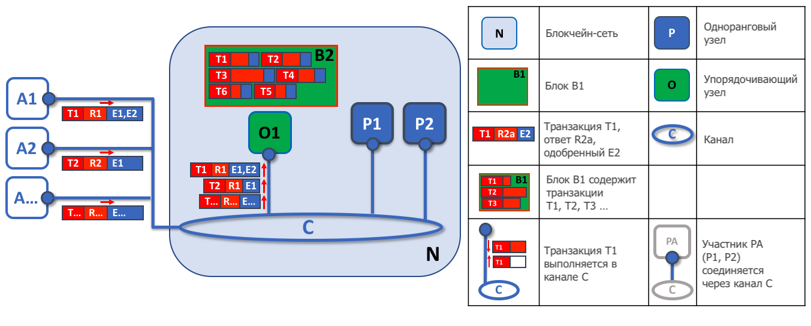
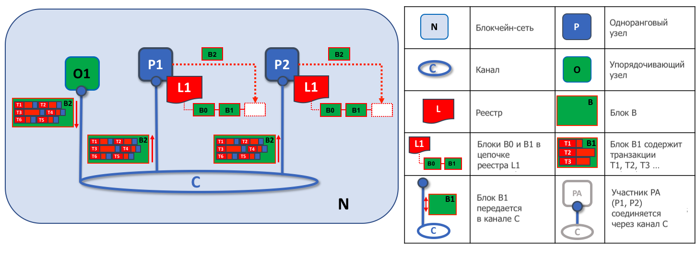

# Служба упорядочения

**Целевая аудитория:** архитекторы, администраторы службы упорядочения, создатели каналов

Эта статья является концептуальным введением в понятие упорядочивания. В ней описывается, как служба упорядочения 
взаимодействует с одноранговыми узлами и какую роль играет в процессе выполнения транзакций. Также в статье сделан
обзор доступных в настоящее время реализаций службы упорядочения с акцентом на рекомендуемую реализацию на основе 
**Raft**. 

## Что такое упорядочивание?

Многие распределенные блокчейны, такие, как Ethereum и Bitcoin, не имеют контроля доступа, что позволяет любому узлу
участвовать в процессе консенсуса, в ходе которого транзакции упорядочиваются и собираются в блоки. В связи с этим
такие системы полагаются на **вероятностные** алгоритмы консенсуса, в конечном итоге с высокой степенью вероятности
гарантирующие согласованность реестра, но при этом допускающие его расхождение (так же известное как "форк"), при 
котором разные участники сети имеют разное представление об установленном порядке транзакций.

Hyperledger Fabric работает по-другому. В ней есть узлы, называемые **упорядочивающими**, которые и осуществляют
упорядочивание транзакций и вместе с другими упорядочивающими узлами образуют **упорядочивающий сервис**. Поскольку
Fabric спроектирована для использования **детерминированных** алгоритмов консенсуса, любой блок, подтвержденный 
одноранговым узлом, гарантированно является окончательным и правильным. Копии реестра не могут расходиться, как это
случается в других блокчейн-сетях без контроля доступа.

Кроме того, в дополнение к обеспечению окончательности, отделение одобрения выполнения чейнкода (которое происходит
на одноранговых узлах) от упорядочивания транзакций дает Fabric преимущества в производительности и масштабируемости,
устраняя узкие места, возникающие, когда выполнение транзакций и их упорядочивание происходит на одних и тех же узлах.

## Упорядочивающие узлы и конфигурация канала

В дополнение к своей **упорядочивающей** роли упорядочивающие узлы поддерживают список организаций, которым разрешено
создавать каналы. Этот список известен как "консорциум" и хранится в конфигурации "системного канала" службы 
упорядочения. По умолчанию этот список и канал, в котором он находится, может редактировать только администратор
службы упорядочения. Обратите внимание, что таких списков у службы упорядочения может быть несколько, что делает
консорциум средством для многопользовательского использования в Fabric.

Упорядочивающие узлы также обеспечивают начальный контроль доступа для каналов, определяя, кто может читать и записывать
данные в них, а кто может менять конфигурацию каналов. Не стоит забывать, что права на изменение элемента конфигурации
канала зависят от политик, установленных соответствующими администраторами при создании консорциума или канала. 
Конфигурационные транзакции обрабатываются упорядочивающими узлами, поскольку для этого необходимо знать текущий набор
политик для осуществления контроля доступа. В этом случае упорядочивающий узел обрабатывает обновление конфигурации,
чтобы убедиться в том, что тот, кто выполняет это обновление, имеет соответствующие административные права. Если это
так, узел проверяет запрос на соответствие текущей конфигурации, генерирует новую транзакцию и упаковывает ее в блок,
который рассылается всем одноранговым узлам в канале. Далее одноранговые узлы обрабатывают конфигурационную транзакцию,
чтобы убедиться, что изменения, одобренные упорядочивающим узлом, действительно соответствуют политикам, определенным в
канале.

## Упорядочивающие узлы и идентификация

У всех, кто взаимодействует с блокчейн-сетью, включая одноранговые и упорядочивающие узлы, приложения и администраторов,
есть идентификатор, полученный из цифрового сертификата и определения провайдера службы членства (MSP). 

Для получения дополнительной информации об идентификаторах и MSP ознакомьтесь с нашей соответствующими статьями в нашей
документации: [Идентификаторы](../identity/identity.html) и [Провайдеры службы членства](../membership/membership.html).

Как и одноранговые узлы, упорядочивающие узлы принадлежат организациям. И, как в случае с одноранговыми узлами, для каждой
организации должен использоваться отдельный удостоверяющий центр (УЦ). Будет ли этот УЦ корневым или для каждой из
организаций будет развернут промежуточный УЦ, связанный с корневым УЦ, решать вам. 

## Служба упорядочения и выполнение транзакций

### Первый этап: предложение

Из статьи про [одноранговые узлы](../peers/peers.html) мы знаем, что они составляют основу блокчейн-сети, поддерживая
копии реестра, которые могут запрашиваться и обновляться приложениями с помощью умных контрактов.

В частности, обновляющие реестр приложения участвуют в процессе, состоящем из трех этапов, который гарантирует, что все
копии реестра на одноранговых узлах блокчейн-сети согласованы друг с другом. 

На первом этапе клиентское приложение отправляет предложение о транзакции подгруппе одноранговых узлов, которые 
вызывают умный контракт для создания предлагаемого обновления реестра, а затем одобряют результат этого вызова. Здесь
узлы не применяют предложенное обновление к своим копиям реестра. Вместо этого одобряющие узлы возвращают клиентскому
приложению ответ на предложение о транзакции. Одобренные предложения транзакций в итоге упорядочиваются и собираются в
блоки на втором этапе, а затем - на третьем этапе - распространяются среди всех одноранговых узлов для окончательной 
проверки и применения к реестру.

Для более подробного изучения первого этапа выполнения транзакций обратитесь к статье об [одноранговых узлах](../peers/peers.html#phase-1-proposal). 

### Второй этап: упорядочивание и упаковка транзакций в блоки

После завершения первого этапа выполнения транзакции клиентское приложение получило одобренный ответ на предложение о
транзакции от нескольких одноранговых узлов. И теперь выполнение транзакции переходит на второй этап.

На этом этапе клиенты приложений отправляют транзакции, содержащие одобренные ответы на предложения о транзакции, на
узел службы упорядочения. Служба упорядочения создает блоки транзакций, которые в конечном итоге (на третьем этапе) 
будут распространены между всеми одноранговыми узлами в канале для окончательной проверки и применения к реестру.

Упорядочивающие узлы принимают транзакции от множества различных приложений одновременно. Эти узлы работают сообща, 
образую службу упорядочения. Ее работа заключается в том, чтобы упорядочить пакеты отправленных транзакций в четко
определенной последовательности и упаковать их в *блоки*. Эти блоки станут *блоками* в блокчейне! 

Количество транзакций в блоке зависит от параметров конфигурации канала, определяющих желаемый размер блока и 
максимальный временной интервал между двумя сформированными блоками (это `BatchSize` и `BatchTimeout` соответственно).
Сформированные блоки сохраняются в реестре упорядочивающего узла и распространяются между одноранговыми узлами в канале. 
Если в этот момент одноранговый узел выключен или будет присоединен к каналу позже, он получит блоки от узла службы 
упорядочения после подключения к нему или от других одноранговых узлов через протокол gossip. Далее мы увидим, как блок 
обрабатывается одноранговыми узлами на третьем этапе. 

*Первая задача упорядочивающего узла - это упаковка предлагаемых обновлений реестра. В этом примере приложение A1
отправляет транзакцию T1, одобренную одноранговыми узлами E1 и E2, упорядочивающему узлу O1. Параллельно приложение A2
отправляет транзакцию T2, одобренную узлом E1, тому же узлу O1. Узел O1 упаковывает транзакции T1 и T2, полученные от
приложений A1 и A2 соответственно, вместе с другими транзакциями, полученными от других приложений в блок B2. Как мы
видим, в блоке B2 порядок транзакций такой: T1, T2, T3, T4, T6, T5. Этот порядок может не совпадать с порядком 
поступления транзакций в службу упорядочивания! (В данном примере показана упрощенная конфигурация службы упорядочения,
состоящей из одного узла)*

Стоит отметить, что последовательность транзакций в блоке может не совпадать с порядком, в котором служба упорядочивания
их получила, поскольку сразу несколько узлов службы могут получать транзакции примерно одновременно. Тут важно то, что
транзакции располагаются в строгом порядке, и одноранговые узлы будут использовать этот порядок при проверке транзакций
и их применении к реестру.

Такое строгое упорядочивание транзакций в блоках отличает Hyperledger Fabric от других блокчейн-платформ, в которых
одна и та же транзакция может быть упакована в несколько разных блоков, конкурирующих между собой, чтобы попасть
в цепочку. В Hyperledger Fabric блоки, генерируемые службой упорядочения, являются **конечными**. Как только 
транзакция попадает в блок, ее положение в реестре уже неизменно. Как мы уже говорили, конечность в Hyperledger Fabric
означает, что в ней не существует **форков** и подтвержденные транзакции никогда не будут отменены или удалены.

Также можно видеть, что в отличие от одноранговых узлов, которые выполняют умные контракты, узлы службы упорядочения
этого не делают. Каждая авторизованная транзакция, поступающая в службу упорядочения, механически упаковывается в блок и
на этом этапе не делается никаких заключений о ее содержании (за исключением конфигурационных транзакций канала, о
которых говорилось выше).

После рассмотрения второго этапа мы видим, что узлы службы упорядочения отвечают за простые, но жизненно важные
процессы сбора предлагаемых транзакциями обновлений реестра и их упорядочивания в блоки, готовые к распространению.

### Третий этап: проверка и запись

Третий этап выполнения транзакции включает в себя распространение с последующей проверкой блоков от упорядочивающего
сервиса к одноранговым узлам, где они могут быть записаны в реестр.

Третий этап начинается с того, что упорядочивающий сервис рассылает блоки всем подключенным к нему одноранговым узлам.
Стоит отметить, что не каждый одноранговый узел в сети должен быть подключен к сервису упорядочивания. Блоки могут 
передаваться и между одноранговыми узлами по [**протоколу gossip**](../gossip.html).  

Каждый одноранговый узел проверят распространенные по сети блоки независимо, но делает это детерминированным способом,
что обеспечивает согласованность их копий реестра. В частности, каждый узел в канале проверяет каждую транзакцию в
блоке, чтобы убедиться, что она была одобрена узлами требуемых организаций, что эти одобрения узлов совпадают и что
она не стала недействительной в результате других недавно совершенных транзакций, которые могли находиться в процессе 
выполнения после одобрения этой транзакции. Недействительные транзакции тоже сохраняются в неизменяемом блоке, созданном
упорядочивающими узлами, но они помечаются как недействительные и не применяются к состоянию реестра.

*Вторая задача упорядочивающего узла - это распространение блоков среде одноранговых узлов. В этом примере
упорядочивающий узел O1 рассылает блок B2 одноранговым узлам P1 и P2. Узел P1 обрабатывает блок B2, в результате чего
он добавляется в копию реестра L1 на узле P1. Параллельно одноранговый узел P2 обратабывает блок B2, и этот блок
добавляется в копию реестра L1 на узле P2. После завершения этого процесса реестр L1 согласованно обновлен на узлах
P1 и P2, и каждый из них может сообщить подключенным приложениям, что транзакция была обработана*

В общем, на третьем этапе блоки, сформированные службой упорядочивания, согласованно применяются к реестру. Строгий
порядок транзакций в блоках позволяет каждому одноранговому узлу удостовериться в том, что обновления каждой транзакции
в блоке согласованно применяется во всей блокчейн-сети.

Для более глубокого изучения этого этапа обратитесь к статье об [одноранговых узлах](../peers/peers.html#phase-3-validation-and-commit). 

## Реализации службы упорядочения

Хотя все доступные сегодня варианты службы упорядочения обрабатывают транзакции и обновления конфигурации одинаково, 
существует несколько различных реализаций достижения консенсуса между упорядочивающими узлами при установлении порядка 
транзакций.

Информацию о том, как запустить упорядочивающий узел (независимо от реализации службы, в которой он будет
использоваться), можно найти в документации [по запуску упорядочивающего](../orderer_deploy.html). 

* **Raft** (рекомендованный вариант)

  Добавленная в версии 1.4.1 реализация Raft является отказоустойчивой (CFT) упорядочивающей службой, в основе которой 
  лежит реализация [протокола Raft](https://raft.github.io/raft.pdf) в [`etcd`](https://coreos.com/etcd/). Raft 
  использует модель "лидер-последователь", в которой выбирается узел-лидер (в каждом канале) и его решения воспроизводятся
  узлами-последователями. Упорядочивающие службы Raft проще в настройке и управлении, чем службы на основе Kafka. Они
  спроектированы таким образом, чтобы несколько разных организаций могли владеть узлами упорядочивающей службы.

* **Kafka** (устаревший вариант в версиях 2.x)

  Как и вариант службы упорядочения, основанный на Raft, Apache Kafka - это отказоустойчивая (CFT) реализация,
  использующая модель "лидер-последователь". Для управления Kafka использует сервис-координатор Zookeeper. Служба
  упорядочения на основе Kafka доступна, начиная с версии 1.0, но многим пользователям дополнительные административные
  расходы по управлению кластером Kafka кажутся нежелательными.

* **Solo** (устаревший вариант в версиях 2.x)

  Реализация упорядочивающей службы Solo предназначена исключительно для тестирования и состоит только из одного узла.
  Эта реализация устарела и будет удалена в будущих выпусках. Существующие пользователи реализации Solo должны будут
  перейти на сеть Raft с одним узлом для получения аналогичной функциональности.

## Raft

Информацию о настройке службы упорядочения Raft можно найти в [нашей документации](../raft_configuration.html). 

Реализация протокола Raft в Fabric является рекомендуемым вариантом службы упорядочения для производственных
сетей. Она использует модель "лидер-последователь", в которой лидер динамически избирается среди упорядочивающих узлов в
канале (этот набор узлов также называется "множеством согласующих") и этот лидер рассылает сообщения 
узлам-последователям. Поскольку система может выдержать потерю нескольких узлов, включая узлы-лидеры, до тех пор, пока
остается большинство упорядочивающих узлов ("кворум"), Raft считается отказоустойчивым (CFT). Другими словами, если 
в канале есть три узла, он может выдержать потерю одного узла (останется два). Если в канале пять узлов, можно потерять
два из них (останется три).

С точки зрения сервиса, который реализации службы упорядочения Raft и Kafka (о ней мы поговорим позже) предоставляют 
сети и каналу, они похожи. Обе эти реализации являются отказоустойчивыми и используют модель "лидер-последователь". Если
вы разработчик приложений, разработчик умных контрактов или администратор одноранговых узлов, вы не заметите разницы в
работе между службами упорядочения на основе Raft и Kafka. Однако есть несколько важных различий, которые стоит 
рассмотреть, особенно если вы собираетесь управлять упорядочивающей службой:

* Raft проще в настройке. И хотя у Kafka много поклонников, даже они (обычно) признают, что развертывание кластера
Kafka и его координатора Zookeeper может быть сложным, требующим высокого уровня знаний в инфраструктуре и настройках
Kafka. Кроме того, в Kafka гораздо больше компонентов, которыми нужно управлять, поэтому в Kafka гораздо больше точек
отказа. Еще у Kafka есть свои версии, которые необходимо согласовывать между упорядочивающими узлами. **В Raft все
встроено в ваш упорядочивающий узел**.

* Kafka и Zookeeper не предназначены для работы в больших сетях. Хотя Kafka и является отказоустойчивой, ее следует
запускать на небольшой группе узлов. На практике это означает, чтобы кластером Kafka управляла одна организация. 
Учитывая это, при использовании Kafka, поддерживаемой Fabric, наличие упорядочивающих узлов, управляемых разными 
организациями, не добавляет децентрализации, поскольку все эти узлы будут обращаться к одному и тому же кластеру Kafka, 
который находится под контролем одной организации. При использовании Raft может иметь свои собственные упорядочивающие 
узлы, что делает систему более децентрализованной.

* Fabric обладает встроенной поддержкой Raft, а в случае с Kafka и Zookeeper пользователи должны получить необходимые
образы и самостоятельно научиться их использовать. Кроме того, поддержка Kafka осуществляется через [Apache](https://kafka.apache.org/),
разработчика этой системы с открытым исходным кодом, а не через Hyperledger Fabric. Реализация же Raft в Fabric была 
разработана и будет поддерживаться сообществом разработчиков Fabric и ее службы поддержки. 

* В то время как Kafka использует пул серверов (называемых "брокерами Kafka"), а администратор организации службы
упорядочивания указывает, сколько узлов необходимо использовать в каждом канале, Raft позволяет пользователям указать,
какие упорядочивающие узлы будут развернуты в том или ином канале. Таким образом организации с одноранговыми узлами
могут убедиться в том, что, если они также владеют упорядочивающим узлом, этот узел будет включен в состав службы
упорядочивания данного канала, а не доверять одному администратору, управляющему узлами Kafka и зависеть от него.

* Raft - это первый шаг к упорядочивающей службе с византийской устойчивостью (BFT) в Fabric. Как мы увидим, некоторые
решения при разработке Raft были обусловлены именно этим. Если вы заинтересованы в BFT, изучение использования Raft
должно облегчить переход. 

По этим причинам, поддержка упорядочивающих сервисов на основе Kafka прекращается в Fabric v2.x.

Примечание: как и в случае с Solo и Kafka упорядочивающие службы Raft могут терять транзакции после того, как
подтверждение получения было отправлено клиенту. Например, если узел-лидер аварийно завершит свою работу примерно в то
же время, как узел-последователь отправит подтверждение получения. Поэтому клиенты должны прослушивать одноранговые узлы
на предмет записи транзакций в реестр независимо (для проверки правильности транзакций), но следует позаботиться о том,
чтобы клиент также мог обрабатывать ситуации, в которых транзакция не завершается в заданный промежуток времени. В 
зависимости от приложения в этом случае может быть желательным повторно отправить транзакцию или собрать новый набор 
одобрений от одноранговых узлов.  

### Понятия Raft

Хотя Raft во многом предоставляет тот же функционал, что и Kafka, и делает это в более простом и удобном виде, эта
реализация имеет существенные отличия от Kafka, вводит ряд новых понятий (или изменяет существующие понятия) в Fabric.

**Запись в журнале**. Основной единицей работы в службе упорядочивания Raft является "запись в журнале", а полная 
последовательность таких записей называется "журналом". Журнал считается согласованным, если большинство (другими 
словами, кворум) членов согласны с записями и их порядком, делая журналы на разных упорядочивающих узлах согласованными.

**Множество согласующих**. Это упорядочивающие узлы, активно участвующие в механизме консенсуса и получающие рассылаемые
журналы для данного канала. Это могут быть все доступные узлы (либо в одном кластере, либо в разных кластерах, входящих 
в системный канал), либо подмножество этих узлов.

**Конечный автомат (FSM)**. На каждом упорядочивающем узле Raft есть конечный автомат. Все вместе они используются для
обеспечения детерминированности (записи в одной и той же последовательности) журналов на разных упорядочивающих узлах.

**Кворум**. Это понятие описывает минимальное количество согласующих, которые должны подтвердить предложение порядка
транзакций, чтобы они могли быть упорядочены. Для каждого множества согласующих это **большинство** узлов. В кластере
из пяти узлов для кворума должны быть доступны три узла. Если кворум узлов по какой-то причине не доступен, кластер
службы упорядочивания становится недоступным для операций чтения и записи в канале, и новые журналы не могут быть 
записаны.

**Лидер**. Это не новое понятие, Kafka тоже использует лидеров, как было сказано выше. Но важно понимать, что в любой
момент множество согласующих в канале выбирает один узел в качестве лидера (позже мы опишем, как это происходит в Raft).
Лидер отвечает за прием новых записей журнала, их репликацию на упорядочивающие узлы-последователи, а также он принимает
решение, когда новая запись считается записанной в журнал. Это не особый **тип** упорядочивающего узла. Это всего лишь
роль, которую узел может играть в какой-то момент времени в зависимости от обстоятельств.

**Последователь**. Опять же это не новое понятие. Тут также важно понимать, что узлы-последователи получают журналы
от лидера, детерминированно их реплицируют, гарантируя, что эти журналы остаются согласованными. Как мы увидим в разделе
о выборе лидера, последователи также получают от лидера сигналы проверки работоспособности ("heartbeat"). В случае, если
лидер перестает посылать эти сигналы в течение определенного периода времени, последователи инициируют выборы лидера, и
один из них становится новым лидером.

### Raft в процессе выполнения транзакций

Каждый канал работает с **отдельным** экземпляром протокола Raft, что позволяет каждому из них отдельно выбирать лидера.
Такая конфигурация также позволяет дополнительно децентрализовать сервис в тех случаях, когда кластеры состоят из
упорядочивающих узлов, контролируемых различными организациями. И несмотря на то, что все узлы Raft должны входить в
системный канал, они не должны входить во все каналы приложений. Создатели (и администраторы) каналов имеют возможность
выбирать подмножество доступных упорядочивающих узлов, а также добавлять или удалять узлы в канале по мере необходимости
(при условии, что за один раз добавляется или удаляется только один упорядочивающий узел).

Хотя такая конфигурация создает дополнительные накладные расходы в виде избыточных сигналов проверки работоспособности и
параллельных процессов (goroutines), она создает необходимую базу для перехода на BFT.

Транзакции в Raft (предложения транзакций или обновления конфигурации) автоматически направляются упорядочивающим узлом,
который получил транзакцию, текущему лидеру в канале. Это означает, что одноранговым узлам и приложениям не требуется
знать, кто является лидером в каждый момент времени. Это необходимо знать только упорядочивающим узлам.

После проверки транзакций упорядочивающей службой, устанавливается их порядок, они упаковываются в блоки, согласуются и 
распределяются по сети, как описано выше при рассмотрении второго этапа выполнения транзации. 

### Замечания об архитектуре

#### Как происходит выбор лидера в Raft

Выбор лидера является внутренним процессом службы упорядочения. Тем не менее давайте посмотрим, как это происходит.

Узлы в Raft находятся в одном из трех состояний: последователь, кандидат или лидер. При запуске каждый узел становится
**последователем**. В этом состоянии они могут принимать записи журнала от лидера (если он уже выбран) или голосовать
за лидера. Если в течение определенного времени (например, пяти секунд) не поступает никаких записей или сигналов
проверки работоспособности, узлы переходят в состояние **кандидат**. В этом состоянии узлы запрашивают голоса у других 
узлов. Если кандидат получает кворум голосов, он становится **лидером**. Лидер должен принимать новые записи журнала и
передавать их последователям.

Чтобы получить визуальное представление о том, как происходит выбор лидера, ознакомьтесь со следующим материалом:
[The Secret Lives of Data](http://thesecretlivesofdata.com/raft/).

#### Моментальные снимки

Если упорядочивающий узел аварийно завершает свою работу, как он получает пропущенные записи журнала при перезапуске?

Да, можно бесконечно хранить все журналы, но для экономии дискового пространства Raft делает создание "моментальных
снимков". При этом пользователи сами определяют, сколько байт данных будет храниться в журнале. Это количество данных
будет соответствовать определенному количеству блоков (которое зависит от количества данных в блоках. Обратите внимание,
что в моментальном снимке хранятся только полные блоки).

Например, отстающая по данным реплика `R1` только что была вновь подключена к сети. Ее последний блок - `100`.
Узел-лидер `L` находится на блоке `196` и его настройки таковы, что размер моментального снимка составляет 20 блоков.
Поэтому `R1` получит блок `180` от `L` и сделает запрос `Deliver` на блоки со `101` по `180`. Блоки `180` - `196` затем
будут переданы на `R1` через обычный протокол Raft.

### Kafka (устаревший вариант в версиях 2.x)

Другой отказоустойчивый вариант упорядочивающего сервиса, работающий в Fabric, основан на использовании распределенной
потоковой платформы Kafka в качестве кластера упорядочивающих узлов. Подробнее о Kafka можно прочитать [странице Apache Kafka](https://kafka.apache.org/intro).
На высоком уровне Kafka использует ту же модель "лидер-последователь", что и Raft, в которой транзакции (в Kafka они
называются "сообщениями") передаются от узла-лидера узлам-последователям. Если узел-лидер выходит из строя, один из
последователей становится лидером и работа сервиса упорядочивания продолжается, обеспечивая отказоустойчивость, как и 
в Raft. 

Управление кластером Kafka, включая координацию задач, членство в кластере, контроль доступа, выборы контроллера и 
другие функции, выполняется сервисом-координатором Zookeeper и связанных с ним API.

Кластеры Kafka и координаторы Zookeeper, как известно, сложны в настройке, поэтому данная документация предполагает
наличие знаний о работе Kafka и Zookeeper. Если вы решили использовать Kafka, не имея таких знаний, то вам следует
выполнить, *как минимум*, первые шесть шагов из [краткого руководства по Kafka](https://kafka.apache.org/quickstart),
прежде чем экспериментировать с упорядочивающей службой на основе Kafka. Вы также можете изучить
[пример файла конфигурации](https://github.com/hyperledger/fabric/blob/release-1.1/bddtests/dc-orderer-kafka.yml) для
получения краткого обоснования используемых значений параметров для Kafka и Zookeeper.

О том, как запустить службу упорядочения на основе Kafka, читайте [в нашей документации по Kafka](../kafka.html).

<!--- Licensed under Creative Commons Attribution 4.0 International License
https://creativecommons.org/licenses/by/4.0/) -->
