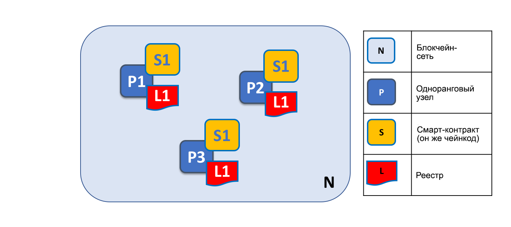
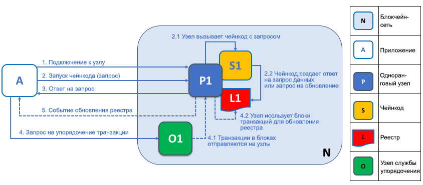
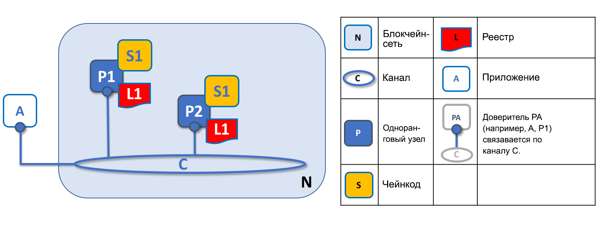
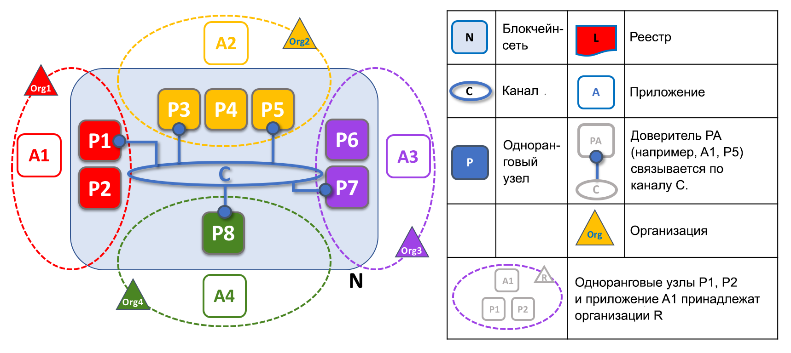
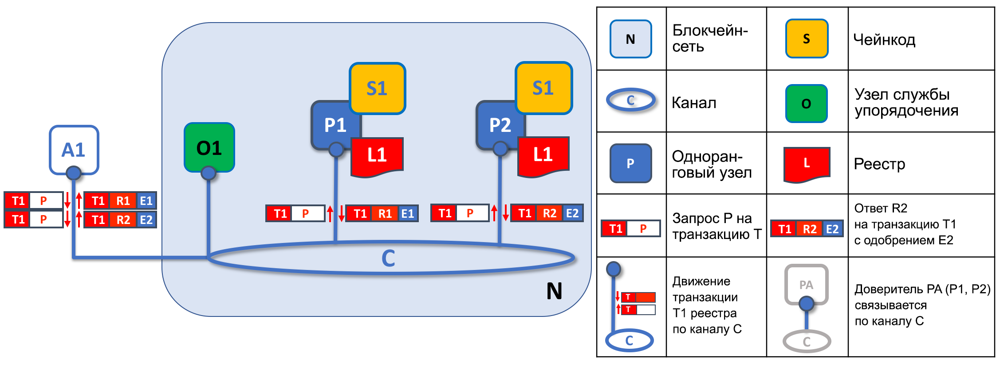
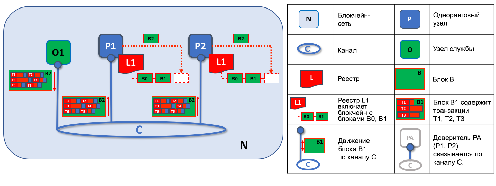

# Одноранговые узлы

Блокчейн-сеть состоит в основном из набора *одноранговых узлов*. Размещая реестры и смарт-контракты, одноранговые узлы являются фундаментальным элементом сети. Напомним, что реестр хранит все генерируемые смарт-контрактами транзакции без возможности внесения изменений (смарт-контракты в свою очередь содержатся в *чейнкоде* Hyperledger Fabric, подробнее об этом позже). Смарт-контракты и реестры используются, соответственно, для инкапсуляции совместно используемых *процессов* и *информации* в сети. Эти особенности одноранговых узлов делают их хорошей отправной точкой для понимания принципа работы сети Fabric.

Конечно, другие элементы блокчейн-сети не менее важны — реестры и смарт-контракты, узлы службы упорядочения, установленные правила, каналы, приложения, организации, идентификаторы и членство, о которых можно прочитать в соответствующих разделах. В этом разделе основное внимание уделяется одноранговым узлам и их связи с другими элементами сети Fabric.

*Блокчейн-сеть состоит из одноранговых узлов, каждый из которых может содержать копии реестра и смарт-контракты. В этом примере сеть N состоит из одноранговых узлов P1, P2 и P3, каждый из которых содержит собственный экземпляр распределенного реестра L1. Узлы P1, P2 и P3 используют одинаковый чейнкод S1 для доступа к своей копии распределенного реестра*.

Одноранговыёе узлы можно создавать, запускать, останавливать, перенастраивать и даже удалять. В узлах предусмотрен набор API-интерфейсов, которые позволяют администраторам и приложениям взаимодействовать с службами, предоставляемыми этими узлами. Подробнее об этих службах будет рассказано далее в этом разделе.

### Несколько слов о терминологии

Fabric реализует **смарт-контракты** с помощью технологии под названием **чейнкод** — фрагмент кода, который обращается к реестру, написанный на одном из поддерживаемых языков программирования. В этом разделе будет использоваться термин **чейнкод**, однако его можно читать как **смарт-контракт**, если этот термин более привычен. По сути это одно и то же! Чтобы узнать больше о чейнкоде и смарт-контрактах, ознакомьтесь с [документацией по смарт-контрактам и чейнкоду](../smartcontract/smartcontract.html).

## Реестры и чейнкод

Рассмотрим одноранговые узлы более подробно. Именно на одноранговых узлах размещаются реестр и чейнкод. Точнее, одноранговый узел фактически хранит *экземпляры* реестра и *экземпляры* чейнкода. Следует отметить, что благодаря такому механизму обеспечивается преднамеренное дублирование в сети Fabric, что позволяет устранить единые точки отказа. Больше о распределенной и децентрализованной природе блокчейн-сети будет рассказано далее в этом разделе.

*На одноранговом узле размещаются экземпляры реестра и экземпляры чейнкода. В этом примере узел P1 содержит экземпляр реестра L1 и экземпляр чейнкода S1. Один одноранговый узел может хранить несколько реестров и чейнкодов.*

Поскольку одноранговый узел является *хостом* для реестров и чейнкодов, для получения доступа к этим ресурсам приложения и администраторы должны взаимодействовать с одноранговым узлом. Поэтому одноранговые узлы считаются фундаментальными структурными элементами сети Fabric. При создании однорангового узла, он не содержит ни реестра, ни чейнкода. Далее в разделе будет рассмотрено создание реестров и установка чейнкодов на одноранговых узлах.

### Использование нескольких реестров

Одноранговый узел может содержать более одного реестра. Таким образом повышается гибкость организации системы. В самой простой конфигурации одноранговый узел используется для управления одним реестром, однако он может содержать два или более реестров при необходимости.

*Одноранговый узел, на котором размещено несколько реестров. Одноранговые узлы содержат один или несколько реестров, при этом каждый реестр содержит ноль или несколько чейнкодов, относящихся к этим реестрам. В этом примере одноранговый узел P1 содержит реестры L1 и L2. Доступ к реестру L1 осуществляется с помощью чейнкода S1. В то же время, доступ к реестру L2 можно получить с помощью чейнкодов S1 и S2.*

Хотя одноранговый узел вполне может иметь экземпляр реестра без чейнкодов, которые обращаются к этому реестру, такая конфигурация одноранговых узлов используется редко. В большинстве одноранговых узлов устанавливается по крайней мере один чейнкод, который может запрашивать или обновлять экземпляры реестра однорангового узла. Стоит упомянуть, что независимо от установки чейнкодов для использования внешними приложениями, одноранговые узлы также имеют специальные **системные чейнкоды**, которые всегда присутствуют. В этом разделе системные чейнкоды не рассматриваются.

### Использование нескольких чейнкодов

Не существует четкой связи между количеством реестров в одноранговом узле и количеством чейнкодов, которые могут получать доступ к этим реестрам. Одноранговый узел может содержать много чейнкодов и много доступных реестров.

*Пример однорангового узла, на котором размещено несколько чейнкодов. К каждому реестру могут обращаться любое количество чейнкодов. В этом примере одноранговый узел P1 содержит реестры L1 и L2, причем доступ к реестру L1 осуществляется с помощью чейнкодов S1 и S2, а к L2 — с помощью S1 и S3. Как видно, чейнкод S1 имеет одновременный доступ к реестрам L1 и L2.*

Немного позже мы расскажем о важности **каналов** Fabric при использовании нескольких реестров или чейнкодов на одном одноранговом узле.

## Приложения и одноранговые узлы

Перейдем к рассмотрению взаимодействия приложений с одноранговыми узлами для доступа к реестру. Запрос к реестру состоит из простого трехэтапного взаимодействия между приложением и одноранговым узлом. Взаимодействие с обновлением реестра немного более сложное и требует двух дополнительных этапов. Эти этапы показаны упрощенно, чтобы ускорить знакомство с Fabric — наиболее важно понять разницу во взаимодействии между приложениями и одноранговыми узлами при запросах к реестру по сравнению с транзакциями обновления реестра.

Приложения всегда подключаются к одноранговым узлам для доступа к реестрам и чейнкодам. Комплект разработчика (SDK) Fabric упрощает эту задачу для программистов. Его API-интерфейсы позволяют приложениям подключаться к одноранговым узлам, вызывать чейнкоды для создания и отправления транзакций в сеть, которые будут упорядочены, проверены и записаны в распределенном реестре, а также получать уведомления по завершении этого процесса.

Подключаясь к одноранговым узлам приложения могут выполнять чейнкоды для осуществления запросов или обновления реестра. Результат транзакции с запросом к реестру возвращается немедленно, тогда как обновление реестра предполагает более сложное взаимодействие между приложениями, одноранговыми узлами и узлами службы упорядочения. Разберем это немного подробнее.

*Одноранговые узлы вместе с узлами службы упорядочения поддерживают реестр в актуальном состоянии на каждом одноранговом узле. В этом примере приложение A подключается к узлу P1 и вызывает чейнкод S1, чтобы отправить запрос или обновить реестр L1. Узел P1 вызывает чейнкод S1 для генерации ответа на запрос, который содержит результат запроса или предлагаемое обновление реестра. Приложение A получает ответ и на этом все процессы запросов завершаются. Для обновления реестра приложение A создает транзакцию из всех ответов и отправляет ее в узел службы упорядочения O1. Узел O1 собирает транзакции со всей сети в блоки и распределяет их по всем одноранговым узлам, включая узел P1. Узел P1 проверяет транзакцию перед записью в реестр L1. После обновления реестра L1 узел P1 генерирует событие и отправляет в приложение A, чтобы подтвердить завершение процесса.*

Одноранговый узел может немедленно отправить результаты ответа на запрос в приложение, поскольку вся необходимая информация находится в локальной копии реестра на узле. Одноранговые узлы никогда не обращаются к другим одноранговым узлам для создания ответа на запрос из приложения. Однако приложения могут подключаться к одному или нескольким одноранговым узлам при отправке запроса. Например, чтобы проверить идентичность результатов, полученных от нескольких одноранговых узлов, или получить более актуальный результат от другого однорангового узла, если есть подозрение, что информация устарела. На схеме показано, что запрос к реестру является простым трехэтапным процессом.

Транзакция обновления начинается так же, как транзакция запроса, однако включает два дополнительных этапа. Несмотря на то, что приложения, вносящие обновления в реестр, подключаются к одноранговым узлам для вызова чейнкода, в отличие от приложений, запрашивающих данные из реестра, отдельный одноранговый узел не может самостоятельно обновить реестр, так как другие одноранговые узлы должны сначала одобрить изменение в ходе процесса под названием **консенсус**. Следовательно, одноранговые узлы возвращают приложению **предлагаемое** обновление, которое этот одноранговый узел применит к реестру при условии предварительного согласия других одноранговых узлов. На четвертом этапе (первый дополнительный этап) приложение отправляет соответствующий набор подходящих предложенных обновлений в сеть одноранговых узлов в качестве транзакции для записи в соответствующие реестры этих узлов. Это осуществляется за счет использования **узла службы упорядочения** приложением для упаковки транзакций в блоки и распределения блоков по сети одноранговых узлов, где транзакции могут быть проверены перед применением к локальной копии реестра каждого однорангового узла. Поскольку процесс упорядочения занимает некоторое время (секунды), приложение получает уведомление асинхронно, как показано для пятого этапа.

Далее в этом разделе будет более подробно рассказано о процессе упорядочивания. Этот вопрос рассматривается более углубленно в разделе [Транзакционный поток](../txflow.html).

## Одноранговые узлы и каналы

Хотя этот раздел посвящен одноранговым узлам, а не каналам, стоит уделить каналам некоторое внимание, чтобы понять, каким образом одноранговые узлы взаимодействуют друг с другом и с приложениями через *каналы* — механизм, с помощью которого компоненты внутри блокчейн-сети могут взаимодействовать и совершать транзакции *конфиденциальным* образом.

Этими компонентами обычно являются одноранговые узлы, узлы службы упорядочения и приложения, которые в случае присоединения к каналу соглашаются на совместное использование и управление идентичными копиями реестра, связанного с этим каналом. Для понимания сути можно представить канал как группу друзей (хотя участникам канала не обязательно быть друзьями!). Человек может иметь несколько групп друзей, объединяемых совместной деятельностью. Эти группы могут быть совершенно не связанными (группа друзей по профессиональной деятельности и группа друзей по хобби) или же могут пересекаться в определенном аспекте. Тем не менее, каждая группа представляет собой отдельную сущность со своего рода «правилами».

*Каналы позволяют определенному набору одноранговых узлов и приложений взаимодействовать друг с другом в блокчейн-сети. В этом примере приложение A может напрямую связываться с одноранговыми узлами P1 и P2 через канал C. Канал можно воспринимать как способ взаимодействия между конкретными приложениями и одноранговыми узлами (для упрощения схемы узлы службы упорядочения не показаны, однако такие узлы обязательно присутствуют в реальной сети).*

 Из схемы видно, что принцип работы каналов отличается от одноранговых узлов. Более уместно воспринимать канал как логическую структуру, образованную набором физических одноранговых узлов. *Очень важно понимать, что одноранговые узлы — это точка для доступа и управления каналами*.

## Одноранговые узлы и организации

Теперь, благодаря пониманию работы одноранговых узлов и их взаимодействий с реестрами, чейнкодами и каналами, легко рассматривать то, как организации объединяются для создания блокчейн-сети.

Блокчейн-сеть управляется группой организаций, а не одной организацией. Одноранговые узлы играют центральную роль в построении такой распределенной сети, так как они принадлежат и являются точками подключения к сети для этих организаций.

*Одноранговые узлы в блокчейн-сети с несколькими организациями. Блокчейн-сеть строится из одноранговых узлов, принадлежащих и предоставляемых различными организациями. В этом примере четыре организации предоставляют восемь одноранговых узлов для формирования сети. Канал C объединяет пять одноранговых узлов P1, P3, P5, P7 и P8 в сети N. Другие одноранговые узлы этих организаций не подключены к этому каналу, но обычно входят в состав как минимум одного другого канала. Приложения, разработанные определенной организацией, могут подключаться к одноранговым узлам своей организации, а также к узлам других организаций. Также для упрощения схемы узел службы упорядочения не показан.*

Очень важно понять, что происходит при формировании блокчейн-сети. *Сеть формируется и управляется несколькими организациями, которые добавляют в нее ресурсы.* Обсуждаемые в этом разделе одноранговые узлы — это ресурсы сети, однако добавляемые организациями ресурсы представляют собой больше чем просто одноранговые узлы. Здесь действует следующий принцип — существование сети буквально невозможно без организаций, которые добавляют свои собственные ресурсы в общую сеть. Более того, сеть увеличивается и сокращается вместе с ресурсами, предоставляемыми этими сотрудничающими организациями.

Из схемы видно отсутствие централизованных ресурсов (кроме службы упорядочения). В [примере выше](#Peer8) существование сети **N** было бы невозможным, если бы организации не предоставили свои одноранговые узлы. Это отражает тот факт, что блокчейн-сеть не существует в реальном смысле до тех пор, пока организации не предоставят ресурсы, образующие эту сеть. Более того, сеть не зависит от какой-либо отдельной организации. Она ​​будет существовать до тех пор, пока остается хотя бы одна организация, независимо от присоединения и отсоединения других организаций. В этом заключается суть децентрализации сети.

Приложения разных организаций, как в [примере выше](#Peer8), могут совпадать или быть разными. Такое возможно из-за того, что организация самостоятельно решает, как ее приложения обрабатывают копии реестра на своих одноранговых узлах. Это означает, что логика приложений и пользовательских интерфейсов может отличаться в различных организациях, даже если их соответствующие одноранговые узлы содержат одни и те же данные реестра.

Приложения подключаются либо к одноранговым узлам своей организации, либо к одноранговым узлам другой организации, в зависимости от требуемого характера взаимодействия с реестром. Приложения обычно подключаются к одноранговым узлам своей организации для взаимодействия с реестром при запросах. Далее будет показано, почему приложениям нужно подключаться к одноранговым узлам *всех* организаций, требуемых для одобрения внесения обновлений в реестр.

## Одноранговые узлы и идентификация

Теперь известно, как одноранговые узлы разных организаций объединяются и формируют блокчейн-сеть, и стоит потратить несколько минут, чтобы разобраться, как администраторы организаций добавляют одноранговые узлы в организации.

Одноранговые узлы получают идентификаторы с помощью цифровых сертификатов, выдаваемых определенным удостоверяющим центром. Подробная информация о цифровых сертификатах X.509 приведена в другом разделе этого руководства, но пока можно воспринимать цифровой сертификат как удостоверение личности, которое позволяет получить большое количество проверяемой информации об узле. *Цифровые сертификаты назначаются всем одноранговым узлам в сети администраторами организаций, которым они принадлежат*.

*При подключении однорангового узла к каналу, цифровой сертификат идентифицирует организацию-владельца узла с помощью провайдера службы членства (MSP). В этом примере узлы P1 и P2 имеют идентификаторы, выданные удостоверяющим центром CA1. Согласно установленным правилам своей конфигурации канал C определяет, что согласно провайдеру службы членства ORG1.MSP идентификаторы, выданные удостоверяющим центром CA1, принадлежат организации ORG1. Аналогично, одноранговые узлы P3 и P4 идентифицируются ORG2.MSP как часть организации ORG2.*

При каждом подключении однорангового узла к блокчейн-сети с использованием канала, *права однорангового узла определяются согласно его идентификатору и установленным правилам в конфигурации канала.* Связывание идентификаторов и организаций осуществляется компонентом под названием *провайдер службы членства* (MSP). Этот компонент определяет, каким образом одноранговому узлу назначается роль в организации и, соответственно, какой доступ он будет иметь к ресурсам блокчейна. Кроме того, одноранговый узел может принадлежать только одной организации и, следовательно, быть связанным только с одним MSP. Более подробно об управлении доступом к одноранговым узлам будет рассказано далее в этой статье. Также в руководстве есть целый раздел, посвященный MSP и правилам управления доступом. В рамках этого раздела представьте, что MSP обеспечивает связь между отдельным идентификатором и определенной организационной ролью в блокчейн-сети.

Отвлекаясь отметим, что одноранговые узлы, а также *все взаимодействующие с блокчейн-сетью компоненты, идентифицируются с организациями с помощью цифрового сертификата и MSP*. Одноранговые узлы, приложения, конечные пользователи, администраторы и узлы службы упорядочения должны иметь идентификатор и связанный с ним MSP для возможности взаимодействия с блокчейн-сетью. *Каждому объекту, который взаимодействует с блокчейн-сетью с помощью идентификатора дается специальное обозначение — доверитель.* Более подробно о доверителях и организациях рассказано в других разделах этого руководства, однако приведенной в этой статье информации более чем достаточно, чтобы углубить понимание работы одноранговых узлов.

Наконец, следует отметить, что физическое расположение однорангового узла не имеет большого значения — он может находиться в облаке, или в центре обработки данных одной из организаций, или на локальном компьютере. Принадлежность узла к организации определяет его цифровой сертификат. В примере выше узел P3 может размещаться в центре обработки данных организации ORG1, однако если цифровой сертификат узла выдается удостоверяющим центром CA2, то узел принадлежит организации ORG2.

## Одноранговые узлы и узлы службы упорядочения

Уже упоминалось, что одноранговые узлы образуют основу блокчейн-сети, размещая реестры и смарт-контракты, которые могут запрашиваться и обновляться приложениями при обращении к этим одноранговым узлам. Однако механизм, с помощью которого приложения и одноранговые узлы взаимодействуют друг с другом для обеспечения согласованности копий реестра на всех одноранговых узлах, базируется на специальных *узлах службы упорядочения*, которые мы рассмотрим подробнее.

Транзакция обновления реестра сильно отличается от транзакции с запросом, потому что для обновления реестра недостаточно одного однорангового узла — обновление требует согласия других одноранговых узлов сети. Прежде чем обновление может быть применено к локальному реестру однорангового узла, другие одноранговые узлы сети должны одобрить обновление реестра.  Этот процесс называется *консенсус* и занимает гораздо больше времени, чем простой запрос. И после подтверждения транзакции всеми требуемыми одноранговыми узлами, транзакция записывается в реестр, а одноранговые узлы уведомляют подключенные приложения об обновлении реестра. В этом разделе приводятся более подробные сведения о том, как одноранговые узлы и узлы службы упорядочения участвуют в процессе достижения консенсуса.

В частности, для обновления реестра приложениями используется трехэтапный процесс, обеспечивающий согласованность копий реестров на всех одноранговых узлах блокчейн-сети.  

* На первом этапе приложения работают с группой *узлов-поручителей*, каждый из которых одобряет предлагаемое приложением обновление реестра, однако не применяет это обновление к своей копии реестра.
* На втором этапе одобрения собираются и упаковываются в блоки как транзакции.
* На третьем и последнем этапе эти блоки распределяются обратно по всем одноранговым узлам, где каждая транзакция проверяется перед записью в копию реестра соответствующего узла.

Далее станет понятно, что узлы службы упорядочения занимают центральное место в этом процессе. Но сперва следует немного подробнее рассмотреть, как приложения и одноранговые узлы используют узлы службы упорядочения для создания обновлений реестра, которые можно согласованно применять к распределенному, реплицированному реестру.

### Этап 1: Запрос на одобрение

Первый этап процесса выполнения транзакции включает взаимодействие между приложением и набором одноранговых узлов — в нем не участвуют узлы службы упорядочения. Этап 1 касается только приложения, которое запрашивает узлы-поручители различных организаций одобрить результаты предложенного вызова чейнкода.

Этап 1 начинается с создания приложением запроса на транзакцию, которая отправляется на одобрение всеми одноранговыми узлами из требуемого набора. Каждый из *узлов-поручителей* затем независимо друг от друга выполняет чейнкод, используя запрос на транзакцию для создания ответа на запрос. Эти узлы не применяют обновление к реестру, а просто подписывают его и возвращают в приложение. Как только приложение получает достаточное количество подписанных ответов на запрос, первый этап транзакционного потока считается завершенным. Рассмотрим этот этап немного подробнее.

*Запрос на транзакцию независимо обрабатывается узлами-поручителями, которые возвращают одобренные ответы на запрос. В этом примере приложение A1 создает запрос P на одобрение транзакции T1, которое отправляется одноранговым узлам P1 и P2 канала C. Узел P1 выполняет чейнкод S1 с использованием запроса P на одобрение транзакции T1, генерируя ответ R1 на транзакцию T1, которую он подтверждает одобрением E1. В то же время узел P2 выполняет чейнкод S1, используя запрос P на одобрение транзакции T1, генерируя ответ R2 на транзакцию T1, который он подтверждает одобрением E2. Приложение A1 получает два ответа с одобрением транзакции T1, а именно E1 и E2.*

Изначально набор одноранговых узлов выбирается приложением для создания набора предлагаемых обновлений реестра. Выбор одноранговых узлов приложением Выбор зависит от *установленных правил одобрения* (для чейнкода). Эти правила определяют набор организаций, которым необходимо одобрить предлагаемое изменение реестра, прежде чем оно будет принято сетью. Буквально это и означает достижение консенсуса — каждая задействованная организация должна одобрить предлагаемое изменение реестра *до того, как* оно будет записано в копии реестра на одноранговых узлах.

Одноранговый узел одобряет ответ на запрос, добавляя цифровую подпись и подписывая все данные пакета, используя закрытый ключ. Это одобрение впоследствии может использоваться для подтверждения того, что одноранговый узел этой организации выдал определенный ответ. В указанном примере, если одноранговый узел P1 принадлежит организации ORG1, одобрение E1 соответствует цифровому подтверждению того, что «ответ R1 на транзакцию T1 обновления реестра L1 был предоставлен узлом P1 организации ORG1!».

Этап 1 завершается, когда приложение получает подписанные ответы на запросы от достаточного числа партнеров. Отметим, что разные одноранговые узлы могут возвращать приложению разные и, следовательно, несогласованные ответы по транзакции *для одного и того же запроса на транзакцию*. Это может происходить потому, что результат был сгенерирован в разное время на разных одноранговых узлах с копиями реестра в разных состояниях. В таком случае приложение может просто запросить более актуальный ответ на запрос. Менее вероятна ситуация, когда результаты могут быть разными из-за *недетерминированного* выполнения чейнкода, что крайне нежелательно. Недетерминизм — враг чейнкодов и реестров. Возникновение этого феномена указывает на серьезную проблему с предлагаемой транзакцией, поскольку к копиям реестра могут быть применены несогласованные результаты. Oдноранговый узел сам по себе не может знать о недетерминированности результата транзакции (на самом деле даже этого недостаточно, и более подробно недетерминизм рассматривается в разделе, посвященному транзакциям).

В конце этапа 1 приложение при необходимости может отбросить противоречивые ответы на транзакции, тем самым прервав процесс выполнения транзакции. Далее будет показано, что при попытке приложения использовать несовместимый набор ответов на транзакцию для обновления реестра, обновление будет отклонено.

### Этап 2: Упорядочение и упаковка транзакций в блоки

Второй этап процесса выполнения транзакции — это этап упаковки. Узел службы упорядочения играет ключевую роль в этом процессе — он получает транзакции, содержащие одобренные ответы на запросы от нескольких приложений, и упорядочивает транзакции в блоки. Дополнительные сведения об этапе упорядочения и упаковки указаны в [принципах этапа упорядочивания](../orderer/ordering_service.html#phase-two-ordering-and-Packaging-Transactions-into-blocks).

### Этап 3: Проверка и запись

В конце этапа 2 узлы службы упорядочения осуществляют простые и критически важные процессы сбора предлагаемых транзакций обновления, а также упорядочивания и упаковки их в блоки для отправки на одноранговые узлы.

Заключительный этап процесса выполнения транзакции включает в себя распределение блоков с узла службы упорядочения и последующую проверку блоков на одноранговых узлах, где они могут быть записаны в реестр. В частности, каждый одноранговый узел проверяет все транзакции блока на наличие одобрений от всех соответствующих организаций перед тем как записать их в реестре. Неподтвержденные транзакции сохраняются для аудита, и не заносятся в реестр.

*Дополнительная роль узла службы упорядочения заключается в распределении блоков между узлами. В этом примере узел службы упорядочения O1 отправляет блок B2 на одноранговые узлы P1 и P2. Одноранговый узел P1 обрабатывает блок B2, в результате чего новый блок добавляется в копию реестра L1 узла P1. Параллельно, одноранговый узел P2 обрабатывает блок B2 и добавляет его в свою копию реестра L1. В ходе этого процесса реестр L1 согласованно обновляется на одноранговых узлах P1 и P2. Оба узла могут уведомить подключенные приложения о том, что транзакция была обработана.*

Этап 3 начинается с распределения блоков узлом службы упорядочения по всем подключенным к нему одноранговым узлам. Одноранговые узлы подключаются к узлу службы упорядочения через каналы таким образом, что при создании нового блока всем подключенным одноранговым узлам отправляется ​копия этого блока. Каждый одноранговый узел обрабатывает этот блок самостоятельно одним и тем же способом, как и все одноранговые узлы на канале. Таким образом поддерживается согласованность реестра. Также стоит отметить, что не каждый одноранговый узел должен быть подключен к узлу службы упорядочения. Одноранговые узлы могут каскадно передавать блоки другим одноранговым узлам по протоколу **gossip**, а те в свою очередь могут самостоятельно обрабатывать эти блоки. Однако обсуждение этого процесса выходит за пределы настоящего раздела.

После получения блока одноранговый узел обрабатывает каждую транзакцию в той очередности, в которой она появляется в блоке. Одноранговые узлы проверяют каждую транзакцию на наличие одобрения необходимыми организациями в соответствии с *установленными правилами одобрения* чейнкода, который сгенерировал транзакцию. Например, некоторые транзакции могут быть одобрены только одной организацией, тогда как другие могут потребовать нескольких одобрений для признания их подтвержденными. Такой процесс проверки гарантирует, что все соответствующие организации пришли к одинаковому итогу или результату. Также следует заметить, что эта проверка отличается от проверки одобрения на этапе 1, когда приложение получает ответ от узлов-поручителей и принимает решение об отправке транзакции. В случае, если приложение нарушает установленные правила одобрения, отправляя неприемлемые транзакции, одноранговый узел все еще может отклонить транзакцию в процессе проверки на этапе 3.

Если транзакция была одобрена надлежащим образом, одноранговый узел попытается применить ее к реестру. Для этого одноранговый узел должен выполнить проверку согласованности реестра, чтобы подтвердить, что текущее состояние реестра совместимо с состоянием реестра на момент создания предложенного обновления. Это не всегда возможно, даже если транзакция полностью одобрена. Например, другая транзакция могла обновить тот же актив в реестре, поэтому новое обновление больше не является актуальным и, следовательно, больше не может быть применено. Таким образом, реестр поддерживается согласованным на всех одноранговых узлах в канале, потому что каждый из них следует одним и тем же правилам проверки.

Реестр обновляется после успешного подтверждения каждой отдельной транзакции одноранговым узлом. Неподтвержденные транзакции не переносятся в реестр, однако сохраняются для целей аудита, как и успешные транзакции. Это означает, что блоки одноранговых узлов почти полностью совпадают с блоками, полученными от узла службы упорядочения, за исключением флага подтверждения для каждой транзакции в блоке.

Важно отметить, что этап 3 не требует запуска чейнкода — это происходит только на этапе 1. Поэтому чейнкоды должны быть доступны только на узлах-поручителях, а не по всей блокчейн-сети. Такой механизм удобен, так как он позволяет скрыть внутреннюю логику чейнкода от одобряющих организаций. В то же время результаты выполнения чейнкодов (ответы запроса на транзакцию) передаются всем одноранговым узлам в канале, независимо от того, одобрили они транзакцию или нет. Такая особенность узлов-поручителей обеспечивает масштабируемость и конфиденциальность.

Наконец, при записи блока в реестре однорангового узла, этот узел генерирует соответствующее *событие*. *События блока* содержат полное содержимое блока, а *события транзакции блока* содержат только общую информацию, например, данные о подтверждении каждой транзакции в блоке. События *чейнкода*, вызванные выполнением чейнкода, также могут быть опубликованы во время записи в реестр. Приложения могут регистрироваться на эти типы событий, чтобы получать уведомления при их создании. Получение уведомлений завершает третий и последний этап процесса выполнения транзакции.

Таким образом, на этапе 3 созданные узлом службы упорядочения  блоки последовательно применяются к реестру. Строгое упорядочение транзакций в блоки позволяет каждому одноранговому узлу проверять, чтобы обновления транзакций согласованно применялись по всей блокчейн-сети.

### Узлы службы упорядочения и консенсус

Процесс выполнения транзакции называется *консенсусом*, так как все одноранговые узлы достигают согласия относительно последовательности и содержимого транзакций в процессе, который осуществляется при посредничестве узлов службы упорядочения. Консенсус — это многоэтапный процесс. При этом приложения получают уведомления об обновлении реестра только по завершении процесса, что может происходить в разное время на разных узлах.

Узлы службы упорядочения рассматриваются более подробно в одном из следующих разделов, поэтому пока можно воспринимать их как узлы, которые собирают предлагаемые обновления реестра от приложений и распространяют среди одноранговых узлов для проверки и записи в реестр.

Это все! На этом завершается обзор одноранговых узлов и других компонентов, с которыми они взаимодействуют в сети Fabric. Как было показано, одноранговые узлы во многих отношениях являются наиболее фундаментальным элементом — они формируют сеть, размещают чейнкоды и реестр, обрабатывают запросы и ответы по транзакциям и поддерживают актуальность реестра, согласованно применяя к нему обновления.
