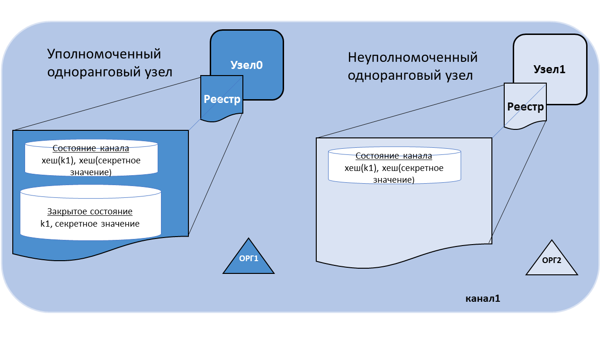
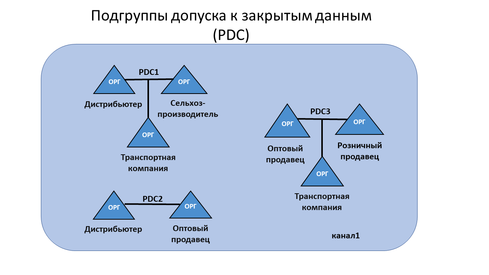
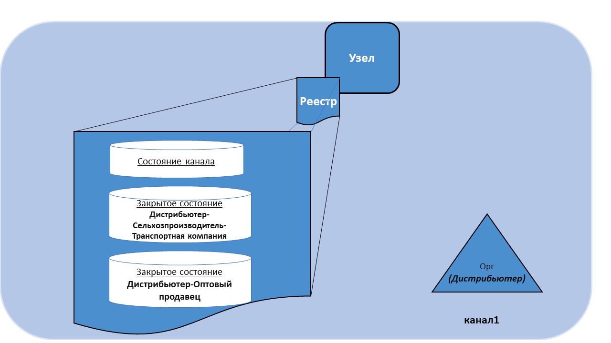

# Закрытые данные

## Определение закрытых данных

Если группе организаций в канале требуется обеспечить конфиденциальность данных от других организаций в этом канале, для этой цели может быть создан новый канал, включающий только те организации, которые должны иметь доступ к данным. Однако создание отдельных каналов в каждом случае создает дополнительные административные издержки (поддержка работы версий чейнкода, правил, провайдеров службы членства и т. д.), а также предотвращает возможность использований ситуаций, в которых необходимо, чтобы все участники канала имели доступ к транзакции, сохраняя при этом часть данных закрытыми.

Вот почему в сети Fabric предусмотрена возможность создания **подгрупп допуска к закрытым данным**, которые позволяют определенной группе организаций в канале одобрять, записывать или запрашивать закрытые данные без необходимости создания отдельного канала.

## Подгруппы допуска к закрытым данным

Подгруппа допуска включает два компонента:

1. **Непосредственно закрытые данные**, распространяемые с помощью [протокола gossip](../gossip.html) от узла к узлу организаций, имеющих право на доступ к таким данным. Эти данные хранятся в закрытой базе данных состояний на одноранговых узлах авторизованных организаций, доступ к которым можно получить, обратившись к чейнкоду, размещенном на этих узлах.    Служба упорядочения не участвует в этом процессе и не имеет доступа к закрытым данным. Обратите внимание, что поскольку для распределения закрытых данных между одноранговыми узлами авторизованных организаций используется протокол gossip, в канале должны быть настроены якорные узлы, а также задан параметр CORE_PEER_GOSSIP_EXTERNALENDPOINT на каждом узле для инициализации связи между организациями.

2. **Хеш этих данных**, который одобряется, упорядочивается и записывается в реестры каждого однорангового узла в канале. Хеш служит доказательством существования транзакции и используется для проверки действительности состояния, а также может использоваться для целей аудита.

На схеме ниже показано содержимое копий реестра одноранговых узлов, одному из которых разрешено иметь закрытые данные, а другой таковых не имеет. 

Участники подгрупп допуска могут предоставлять доступ к закрытым данными третьим сторонам при спорах или передаче активов третьей стороне. В свою очередь, третья сторона может вычислить хеш закрытых данных для проверки того, что он соответствует состоянию в реестре канала, и подтвердить, что такое состояние существовало в определенный момент времени у членов подгруппы.

В некоторых случаях удобно иметь набор подгрупп допуска, каждая из которых ограничена одной организацией. Например, организация может записывать закрытые данные в собственную подгруппу допуска, и эти данные впоследствии могут быть переданы другим участникам канала и на них будут ссылаться транзакции чейнкода. Такой пример приводиться далее в разделе при рассмотрении совместного использования закрытых данных.

### Варианты использования подгруппы допуска внутри канала вместо отдельного канала

* Следует использовать **канал**, когда все транзакции (и реестры) должны быть конфиденциальными в пределах группы организаций, которые являются членами канала. 

* Следует использовать **подгруппу допуска к закрытым данным**, когда ожидается совместное использование транзакций (и реестров) группой организаций, при чем только часть этих организаций должна иметь доступ к некоторым (или всем) данным в транзакции.  Кроме того, поскольку закрытые данные распространяются в сети от узла к узлу, а не с помощью блоков, подгруппу допуска к закрытым данным следует использовать, если необходимо закрыть доступ узлов службы упорядочения к данным транзакций.

## Пример использования подгрупп допуска 

Рассмотрим канал с группой из пяти организаций, которые торгуют сельскохозяйственными продуктами: 

* **Cельхозпроизводитель** продает товары за границу. 
* **Дистрибьютор** распространяет товары за границей. 
* **Транспортная компания** перевозит товары между сторонами. 
* **Оптовый продавец** закупает товары у дистрибьюторов. 
* **Розничный продавец** покупает товары у транспортных компаний и оптовых продавцов. 

**Дистрибьютору** может потребоваться осуществлять транзакции c **фермером** и **транспортной компанией**, при этом делая условия сделок конфиденциальными для **оптового** и **розничного продавцов** (чтобы не раскрывать наценку).

**Дистрибьютору** также может потребоваться обмениваться закрытыми данных с **оптовым продавцом** из-за более низких цен в сравнении с **розничным продавцом**.

**Оптовому продавцу** может потребоваться обмениваться закрытыми данными с **розничным продавцом** и **транспортной компанией**.

Вместо создания нескольких каналов с малым количеством участников для указанных взаимодействий, можно определить несколько подгрупп допуска к закрытым данным **(PDC)** для обмена закрытыми данными между следующими участниками:

1. PDC1: **дистрибьютор**, **сельхозпроизводитель** и **транспортная компания** 
2. PDC2: **дистрибьютор** и **оптовый продавец** 
3. PDC3: **оптовый продавец**, **розничный продавец** и **транспортная компания**. 

В этом примере принадлежащие **дистрибьютору** одноранговые узлы будет иметь несколько закрытых баз данных в своих копиях реестра, которые включают закрытые данные взаимодействий **дистрибьютора**, **сельхозпроизводителя** и **транспортной компании**, а также взаимодействий **дистрибьютора** и **оптового продавца**.

## Транзакционный поток с закрытыми данными 

Когда подгруппы допуска к закрытым данным указываются в чейнкоде, поведение транзакционного потока изменяется для обеспечения конфиденциальности закрытых данных при запросе, одобрении и записи транзакций в реестре.

Подробное описание транзакционных потоков, в которых не используются закрытые данные приведено в разделе [транзакционный поток](../txflow.html).

1. Клиентское приложение отправляет запрос на транзакцию для вызова функции чейнкода (чтения или записи закрытых данных) одобряющим узлам, которые принадлежат уполномоченным организациям в подгруппе допуска. Закрытые данные или данные, используемые для генерации закрытых данных в чейнкоде, отправляются в поле `transient` запроса.

2. Одобряющие одноранговые узлы осуществляют транзакцию и сохраняют закрытые данные во `временном хранилище данных` (локальное временное хранилище однорангового узла). Они распространяют закрытые данные среди уполномоченных узлов в соответствии с правилами подгруппы допуска с помощью [протокола gossip](../gossip.html).

3. Одобряющий узел отправляет клиенту ответ на запрос. Ответ на запрос включает одобренный набор чтения-записи, который включает общедоступные данные, а также хеш любых ключей и значений закрытых данных. *Закрытые данные не отправляются обратно клиенту*. Для получения дополнительной информации о процессе одобрения в контексте закрытых данных читайте [этот раздел](../private-data-arch.html#endorsement).

4. Клиентское приложение отправляет транзакцию (которая включает ответ на запрос с хешами закрытых данных) в службу упорядочения. Транзакции с хешами закрытых данных обычно включаются в блоки.    Блок с хешами закрытых данных распределяется между всеми одноранговыми узлами. Таким образом, все одноранговые узлы в канале могут согласованно проверять транзакции с помощью хешей закрытых данных без необходимости получения фактического доступа к этим данным.

5. Во время записи блока применяются правила подгруппы допуска для определения одноранговых узлов, которые имеют полномочия для доступа к закрытым данным. При наличии доступа узлы сперва проверяют локальное `временное хранилище данных` на наличие закрытых данных в момент одобрения чейнкода. В противном случае узлы пробуют получить закрытые данные от другого уполномоченного однорангового узла. Далее узлы проверят соответствие закрытых данных хешам в общедоступном блоке и записывают транзакцию и блок. После проверки/записи закрытые данные перемещаются в копии базы закрытых данных состояний и закрытого хранилища набора записи на этих узлах. Затем закрытые данные удаляются из `временного хранилища данных`.

## Совместное использование закрытых данных 

Во многих случаях ключи/значения закрытых данных из одной подгруппы допуска могут запрашиваться для совместного использования другими участниками канала или требоваться в других подгруппах допуска, например, для проведения транзакции с закрытыми данными с участником канала или группой членов канала, которые не входят в изначальную группу допуска к закрытым данным. Стороны, получающие закрытые данные, обычно проверяют, являются ли данные частью транзакции согласно хешам в блокчейне.

Подгруппы допуска к закрытым данным обладают несколькими особенностями, позволяющими совместно использовать и проверять закрытые данные:

* Во-первых, для записи ключа в подгруппу не обязательно быть членом подгруппы при условии выполнения правил одобрения.   Правила одобрения могут быть определены на уровне чейнкода, на уровне ключа (с использованием одобрения на основе состояния) или на уровне подгруппы допуска (начиная с версии Fabric 2.0).

* Во-вторых, начиная с версии 1.4.2 появляется функция API-интерфейса чейнкода GetPrivateDataHash(), который позволяет чейнкоду на одноранговых узлах, не являющихся членами подгруппы, считывать хеш-значение закрытого ключа. Как будет показано далее, эта функция очень важна, поскольку позволяет чейнкоду проверять закрытые данные на соответствие хешам в блокчейне, которые были созданы из закрытых данных предыдущих транзакций.

Эту возможность совместного использования и проверки закрытых данных следует учитывать при разработке приложений и связанных с ними подгрупп допуска к закрытым данным. Безусловно, можно создавать многосторонние подгруппы допуска к закрытым данным для обмена данными между различными комбинациями членов канала, однако при таком подходе может образоваться большое количество подгрупп допуска. Как вариант, можно использовать меньшее количество подгрупп допуска к закрытым данным (например, по одной подгруппе на организацию или одной подгруппе на пару организаций) и настраивать совместное использование закрытых данных для других участников канала или других подгрупп по мере необходимости. В версии Fabric 2.0 были добавлены неявные подгруппы допуска к закрытым данным для отдельных организаций, которые доступны любому чейнкоду, что отменяет необходимость определения таких подгрупп для каждой организации при развертывании чейнкода.

### Варианты совместного использования закрытых данных 

Благодаря возможности создания подгрупп допуска к закрытым данным для отдельных организаций, становятся доступными несколько вариантов совместного использования или передачи закрытых данных без дополнительных времязатрат на определение большого количества подгрупп допуска, включающих наборы организаций. Ниже указаны некоторые из вариантов совместного использования, которые могут быть применены в приложениях, обращающихся к чейнкоду: 

* **Отдельные открытые ключи для отслеживания общедоступного состояния** 
  При необходимости можно использовать отдельный открытый ключ для отслеживания общедоступного состояния (например, свойств активов, права владения, и т. д.). Также для каждой организации, которая должна иметь доступ к соответствующим закрытым данным актива, можно создать закрытый ключ/значение в подгруппах допуска к закрытым данным каждой организации.

* **Контроль доступа к чейнкоду** 
  Предусмотрена возможность контроля доступа к чейнкоду, например, чтобы указать клиентов, которые могут запрашивать закрытые данные в подгруппе. Например, при наличии списка контроля доступа к ключу или набору ключей в подгруппе допуска к закрытым данным, в чейнкоде можно получить идентификационные данные отправителя клиента (с помощью функции API-интерфейса чейнкода GetCreator() или функций API-интерфейса библиотеки CID GetID() или GetMSPID()) и проверить наличие прав доступа перед предоставлением доступа к закрытым данным. Точно так же для предоставления доступа к закрытым данным можно потребовать от клиента передать кодовую фразу в чейнкод, которая должна соответствовать кодовой фразе, хранящейся на уровне ключа. Следует отметить, что этот шаблон также можно использовать для ограничения доступа клиентов к данным общедоступных состояний. 

* **Обмен закрытыми данными по внешнему каналу** 
  Для обмена данными вне сети можно обмениваться закрытыми данными по внешнему каналу с другими организациями, при этом организации могут хешировать ключ/значение для проверки соответствия хешу в чейнкоде, используя функцию API-интерфейса чейнкода GetPrivateDataHash(). Например, организация, желающая приобрести актив, может захотеть проверить свойства актива и убедиться, что продавец является законным владельцем, путем проверки хеша в чейнкоде перед провеодением покупки. 

* **Совместное использование закрытых данных с другими подгруппами допуска** 
  Закрытыми данными можно «поделиться» с помощью чейнкода, который создает соответствующий ключ/значение в подгруппе допуска к закрытым данным другой организации. Для этого ключ/значение закрытых данных передается в чейнкод с помощью поля `transient`, при этом чейнкод может подтвердить, что хеш переданных закрытых данных соответствует хешу в чейнкоде из соответствующей подгруппы допуска к закрытым данным с помощью функции GetPrivateDataHash(), а затем записать закрытые данные в подгруппу допуска к закрытым данным другой организации.

* **Передача закрытых данных в другие подгруппы допуска**
  Закрытые данные можно «передать» с помощью чейнкода, который удаляет ключ закрытых данных из одной подгруппы допуска к закрытым данным и создает его в подгруппе допуска другой организации.   Опять же, поле `transient` используется для передачи закрытых данных при вызове чейнкода, а в чейнкоде используется функция GetPrivateDataHash() для подтверждения, что данные существуют в подгруппе допуска к закрытым данным перед удалением ключа из одной подгруппы и созданием ключа в подгруппе допуска другой организации. Чтобы гарантировать удаление транзакции из одной подгруппы допуска и добавление в другую подгруппу, можно запросить одобрение у других сторон, например, регулирующего органа или аудитора.

* **Использование закрытых данных для одобрения транзакции**
  Если необходимо получить одобрение контрагента на транзакцию до ее завершения (например, запись в чейнкоде о согласии на покупку актива по определенной цене), чейнкод может запросить «предварительное согласование» транзакции у контрагента, предварительно записав закрытый ключ в подгруппу допуска контрагента или в вашу подгруппу, который затем будет проверен чейнкодом с помощью функции GetPrivateDataHash(). Фактически, точно такой механизм используется встроенным чейнкодом системы жизненного цикла, чтобы гарантировать, что организации согласны с определением чейнкода перед записью определения в канале. Начиная с версии Fabric 2.0, этот шаблон становится более мощным за счет правил одобрения на уровне подгрупп допуска к закрытым данным, чтобы гарантировать, что чейнкод выполняется и одобряется на собственном доверенном узле владельца подгруппы допуска. В качестве альтернативы можно использовать взаимно согласованный ключ с правилами одобрения на уровне ключа, который затем обновляется с учетом условий предварительного согласования и одобряется узлами из необходимых организаций.

* **Конфиденциальность участников транзакции**
  Варианты предыдущего шаблона также могут исключить утечку информации об участниках определенной транзакции. Например, покупатель заявляет о согласии на покупку в собственной подгруппе допуска к частным данным, а затем в последующей транзакции продавец ссылается на закрытые данные покупателя уже в своей подгруппе допуска. Доказательство транзакции с хешированными ссылками записывается в чейнкоде, при этом только покупатель и продавец знают, что они являются участниками транзакции. В то же время при необходимости они могут раскрыть прообразы для проверки хешей, например, в случае проведения последующей транзакции с другим участником.

Дополняя приведенную выше информацию о шаблонах стоит отметить, что транзакции с закрытыми данными могут подчиняться тем же условиям, что и данные о состоянии в обычном канале, а именно:

* **Контроль доступа к транзакциям на уровне ключа** 
  В закрытые данные можно добавить данные о владельце, чтобы последующие транзакции могли подтвердить, что отправитель имеет право на совместное использование или передачу данных. В этом случае чейнкод получит идентификационные данные отправителя (например, с помощью функции API-интерфейса чейнкода GetCreator() или функций API-интерфейса библиотеки CID GetID() и GetMSPID()), объединит их с другими закрытыми данными, которые передаются в чейнкод, хеширует их и использует функцию GetPrivateDataHash() для подтверждения, что данные соответствуют хешу в чейнкоде, прежде чем продолжить выполнение транзакции.

* **Правила одобрения на уровне ключа** 
  Также, как и в случае с обычными данными о состоянии в канале, можно использовать одобрение на основе состояния, чтобы указать организации, которые должны принимать участие в одобрении транзакций и которые разделяют между собой или передают закрытые данные с помощью функции API-интерфейса чейнкода SetPrivateDataValidationParameter(), например чтобы указать, что только одноранговый узел организации-владельца, узел организации-доверителя или другая третья сторона должны одобрять такие транзакции.

### Пример сценария использования — передача активов с использованием подгруппы допуска к закрытым данным.

Вышеупомянутые шаблоны совместного использования закрытых данных можно комбинировать для создания эффективных приложений на основе чейнкода. Рассмотрим для примера реализацию сценария передачи активов с использованием отдельных подгрупп допуска к закрытым данным для каждой организации:

* Актив можно отслеживать с помощью уникального ключа UUID в открытом состоянии чейнкода. В таком случае используются только данные о праве владения активом, больше никакой информации об активе не предоставляется. 

* Чейнкод требует, чтобы любой запрос на передачу исходил от клиента-владельца актива, а ключ был связан с одобрением на основе состояния, требующим, чтобы одноранговые узлы организации-владельца и организации, выступающей в качестве регулирующего органа, одобряли любые запросы на передачу. 

* Подгруппа допуска к закрытым данным владельца актива содержит закрытые данные об активе, привязанные к хешу уникального ключа UUID. Другие организации и служба упорядочения будут видеть только хеш данных актива. 

* Предположим, что регулирующий орган также является участником всех подгрупп допуска и поэтому хранит закрытые данные, хотя это не обязательно.

Транзакция покупки актива будет выполняться следующим образом:

1. Владелец и потенциальный покупатель заключают сделку вне сети по продаже актива по определенной цене.

2. Продавец предоставляет доказательство своего права владения, передавая закрытые данные по внешнему каналу, либо предоставляя покупателю свои идентификационные данные при запросе закрытых данных на узле покупателя или узле регулирующего органа.

3. Покупатель проверяет, соответствует ли хеш закрытых данных общедоступному хешу в сети.

4. Покупатель вызывает чейнкод, чтобы записать подробности своей заявки в собственную подгруппу допуска к закрытым данным.    Чейнкод вызывается на одноранговом узле покупателя и, возможно, на одноранговом узле регулирующего органа, если это требуется правилами одобрения подгруппы допуска к закрытым данным.

5. Текущий владелец (продавец) вызывает чейнкод для продажи и передачи актива, передавая закрытые данные и информацию о заявке. Чейнкод вызывается на одноранговых узлах продавца, покупателя и регулирующего органа, чтобы произвести проверку на соответствие правилам одобрения открытого ключа, а также правилам одобрения подгрупп допуска к закрытым данным покупателя и продавца.

6. Чейнкод проверяет, что отправляющий клиент является владельцем, сверяет закрытые данные с хешем в подгруппе допуска продавца и сверяет подробности заявки с хешем в подгруппе допуска покупателя. Затем чейнкод вносит предлагаемые обновления в открытый ключ (делая покупателя новым владельцем, и указывая покупающую организацию и регулирующий орган в правилах одобрения), записывает закрытые данные в подгруппу допуска покупателя, а также при необходимости удаляет закрытые данные из базы данных подгруппы допуска продавца. Перед окончательным одобрением одобряющие узлы обеспечивают передачу закрытых данных любым другим уполномоченным узлам продавца и регулирующего органа.

7. Продавец отправляет транзакцию с общедоступными данными и хешами закрытых данных для заказа, и она распределяется среди всех участников канала в блоке.

8. В ходе проверки блока каждого однорангового узла последовательно проверяется соблюдение правил одобрения (одобрение должны предоставить покупатель, продавец и регулирующий орган), а также, что общедоступное и закрытое состояние, которое было считано в чейнкоде, не было изменено какой-либо другой транзакцией с момента выполнения чейнкода.

9. Все одноранговые узлы записывают транзакцию как подтвержденную, поскольку она прошла все проверки.    Одноранговые узлы покупателя и узлы регулирующего органа получают закрытые данные от других уполномоченных одноранговых узлов, если они не получили их во время одобрения, и сохраняют эти данные в своей базе закрытых данных состояний (при условии, что закрытые данные совпадают с хешами транзакции).

10. После завершения транзакции актив считается переданным, а другие заинтересованные в активе участники канала могут запросить историю изменений открытого ключа, чтобы понять историю его происхождения, однако не получая доступа к какой-либо конфиденциальной информации, если владелец не поделится таковой по необходимости.

Такой простейший сценарий передачи актива может быть расширен для других случаев. Например, чейнкод передачи актива может проверить доступность записи об оплате для удовлетворения требований платежа и доставки, или проверить, что банк представил аккредитив до выполнения чейнкода передачи актива. И вместо содержания собственных одноранговых узлов, участники транзакций могут проводить транзакции с помощью одноранговых узлов организаций-дверителей. 

## Удаление закрытых данных 

В случае с данными повышенной конфиденциальности, стороны, совместно использующие закрытые данные, могут пожелать или быть обязанными по закону периодически «удалять» данные на своих узлах, оставляя хеш данных в блокчейне в качестве неизменяемого свидетельства существования закрытых данных.

В некоторых из этих случаев закрытые данные должны существовать только в базе закрытых данных однорангового узла до тех пор, пока они не будут скопированы в внешнюю базу данных, находящуюся вне блокчейна однорангового узла. Данные могут также существовать на одноранговых узлах только до тех пор, пока с ними не будет выполнен бизнес-процесс чейнкода (сделка урегулирована, контракт выполнен и т.д.)

Для поддержки этих вариантов использования закрытые данные могут быть удалены, если они не были изменены для настраиваемого количества блоков. Удаленные закрытые данные не могут быть запрошены из чейнкода и недоступны другим запрашивающим одноранговым узлам.

## Определение подгрупп допуска к закрытым данным

Дополнительные сведения об определении подгрупп допуска к закрытым данным, а также другая низкоуровневая информация о закрытых данных и подгруппах допуска приведена в разделе документации по [закрытым данным](../private-data-arch.html).
