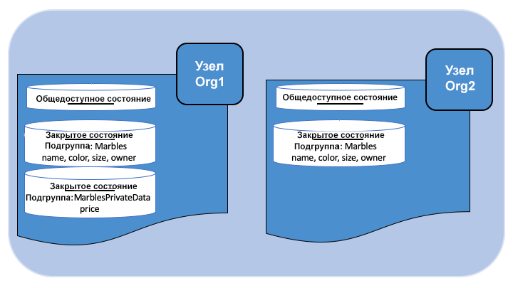

Использование приватных данных в сетях Fabric
============================================

В этом учебном руководстве демонстрируется использование коллекций для хранения приватных данных в блокчейн-сети, доступ к которым имеют только авторизованные одноранговые узлы организаций.

Информация в этом руководстве предполагает понимание принципов работы хранилищ закрытых данных и случаев их использования. Для получения дополнительной информации смотрите раздел :doc:`private-data/private-data`.

.. note:: В этом руководстве используется новый жизненный цикл чейнкода Fabric, добавленный в версии 2.0. Если для использования закрытых данных с чейнкодом требуется предыдущая модель жизненного цикла, смотрите «Пример использования закрытых данных в сетях Fabric <https://hyperledger-fabric.readthedocs.io/en/release-1.4/private_data_tutorial.html>`__ для версии 1.4.

Это руководство состоит из следующих подразделов, которые помогут разобраться с определением, настройкой и использованием приватных данных в сетях Fabric:

#. :ref:`pd-build-json`
#. :ref:`pd-read-write-private-data`
#. :ref:`pd-install-define_cc`
#. :ref:`pd-store-private-data`
#. :ref:`pd-query-authorized`
#. :ref:`pd-query-unauthorized`
#. :ref:`pd-purge`
#. :ref:`pd-indexes`
#. :ref:`pd-ref-material`

В руководстве описывается развертывание `примера закрытых данных marbles <https://github.com/hyperledger/fabric-samples/tree/{BRANCH}/chaincode/marbles02_private>`__ в примере сети Fabric, чтобы продемонстрировать, как создавать, развертывать и использовать подгруппы допуска к закрытым данным. Перед тем как приступить к изучению, следует выполнить шаги, описанные в разделе :doc:`install`.

.. _pd-build-json:

Создание файла JSON определения допуска
-------------------------------------------------

Чтобы обеспечить конфиденциальность данных в канале, следует сперва создать определение подгруппы допуска, в котором описывается правила доступа к закрытым данным.

В определении подгруппы допуска указывается, кто может сохранять данные, на скольких одноранговых узлах данные будут распределены, сколько одноранговых узлов требуется для распространения закрытых данных, а также время существования приватных данных в соответствующей базе данных. Далее будет показано, каким образом можно использовать функции API-интерфейса чейнкода ``PutPrivateData`` и ``GetPrivateData`` для связывания подгруппы допуска с закрытыми данными.

Определение подгруппы допуска включает следующие параметры:

.. _blockToLive:

- ``name``: название подгруппа допуска.

- ``policy``: определяет одноранговые узлы организации, которые имеют право сохранять данные подгруппы допуска.

- ``requiredPeerCount``: количество одноранговых узлов, необходимых для распространения закрытых данных, как условие одобрения чейнкода.

- ``maxPeerCount``: количество одноранговых узлов, которым отправляются данные текущим одобряющим узлом в целях резервирования. При сбое одобряющего узла будут доступны другие узлы в случае обращения к закрытым данным.

- ``blockToLive``: для очень важных данных, например, информации по ценообразованию или личных данных, это значение определяет время (количество блоков), в течение которого данные будут существовать в закрытой базе данных. Данные будут существовать в течение указанного количества блоков в закрытой базе данных, после чего будут очищены и станут недоступными в сети. Чтобы закрытые данные хранились без ограничений по времени (автоматическая очистка производится не будет), следует установить значение ``0`` для параметра ``blockToLive``.

- ``memberOnlyRead``: значение ``true`` подразумевает, что одноранговые узлы будут автоматически предоставлять доступ к закрытым данным только клиентам, принадлежащим к одной из организаций-членов подгруппы допуска.

Использование закрытых данных далее демонстрируется на примере приватных данных marble, содержащем два определения подгрупп допуска к закрытым данным: ``collectionMarbles`` и ``collectionMarblePrivateDetails``. Параметр ``policy`` определения подгруппы допуска ``collectionMarbles`` позволяет всем членам канала (организациям Org1 и Org2) хранить закрытые данные в закрытой базе данных. Подгруппа допуска ``collectionMarblesPrivateDetails`` позволяет только членам организации Org1 хранить закрытые данные в собственной закрытой базе данных.

Подробно о создании определения правил рассказано в разделе :doc:`endorsement-policies`.

.. code:: json

 // collections_config.json

 [
   {
        "name": "collectionMarbles",
        "policy": "OR('Org1MSP.member', 'Org2MSP.member')",
        "requiredPeerCount": 0,
        "maxPeerCount": 3,
        "blockToLive":1000000,
        "memberOnlyRead": true
   },

   {
        "name": "collectionMarblePrivateDetails",
        "policy": "OR('Org1MSP.member')",
        "requiredPeerCount": 0,
        "maxPeerCount": 3,
        "blockToLive":3,
        "memberOnlyRead": true
   }
 ]

Данные, которые защищаются этими правилами, связываются в чейнкоде, и о них будет рассказано далее в руководстве.

Файл определения подгруппы допуска развертывается при записи определения чейнкода в канале с помощью команды `peer lifecycle chaincode commit <commands/peerlifecycle.html#peer-lifecycle-chaincode-commit>`__. Этом процесс более подробно описывается в подразделе 3 ниже.

.. _pd-read-write-private-data:

Чтение и запись закрытых данные с помощью функций API-интерфейса чейнкода
-------------------------------------------------------------------------

Следующий шаг обеспечения конфиденциальности данных в канале — это создание определения данных в чейнкода. В примере marbles закрытые данные разделены на два отдельных определения данных для ограничения доступа разных организаций.

.. code-block:: GO

 // Одноранговые узлы организаций Org1 и Org2 будут хранить эти приватные данные в базе данных вне сети
 type marble struct {
   ObjectType string `json:"docType"`
   Name       string `json:"name"`
   Color      string `json:"color"`
   Size       int    `json:"size"`
   Owner      string `json:"owner"`
 }

 // Только одноранговые узлы организации Org1 будут хранить эти приватные данные в базе данных вне сети
 type marblePrivateDetails struct {
   ObjectType string `json:"docType"`
   Name       string `json:"name"`
   Price      int    `json:"price"`
 }

Доступ к закрытым данным будет ограничен следующим образом:

- Значения ``name, color, size, and owner`` будут доступны всем членам канала (организациям Org1 и Org2).
- Значения ``price`` будут доступны только членам Org1.

Таким образом, два разных набора закрытых данных определены в примере закрытых данных marbles. Привязка этих данных к правилам подгруппы допуска, которые ограничивают доступ к данным, осуществляется с помощью функций API-интерфейса чейнкода. В частности, чтение и запись закрытых данных с использованием определения подгруппы допуска выполняется путем вызова функций ``GetPrivateData()`` и ``PutPrivateData()``, про которые можно прочесть в `этом разделе <https://godoc.org/github.com/hyperledger/fabric-chaincode-go/shim#ChaincodeStub>`_.

На следующей схеме показана модель закрытых данных, используемая в примере закрытых данных marbles.

Чтение данных из подгруппы допуска
~~~~~~~~~~~~~~~~~~~~~~~~~~~~~~~~~~

Для обращения к закрытым данным в базе данных используйте функцию API-интерфейса чейнкода ``GetPrivateData()``. Функция ``GetPrivateData()`` принимает два аргумента — **название подгруппы допуска** и ключ данных. Напомним, что подгруппа допуска ``collectionMarbles`` позволяет членам организаций Org1 и Org2 хранить закрытые данные в базе данных вне сети, в то время как подгруппа допуска ``collectionMarblePrivateDetails`` позволяет только членам организации Org1 хранить закрытые данные в базе данных вне сети. Далее указаны подробности реализации для следующих двух `функций marbles для работы с закрытыми даннами<https://github.com/hyperledger/fabric-samples/blob/{BRANCH}/chaincode/marbles02_private/go/marbles_chaincode_private.go>`__:

 * **readMarble** для запроса значений свойств ``name, color, size и owner``;
 * **readMarblePrivateDetails** для запроса значений свойства ``price``.

Эти функции будут использовать далее в разделе при обращении к базе данных с помощью команд одноранговых улов.

Запись закрытых данных
~~~~~~~~~~~~~~~~~~~~~~

Для записи закрытых данных в закрытую базу данных используется функция API-интерфейса чейнкода ``PutPrivateData()``. С функцией также передается название подгруппы допуска. Поскольку пример закрытых данных marbles включает две подгруппы допуска, в чейнкоде производится два вызова:

1. При записи закрытых данных ``name, color, size и owner`` с использованием подгруппы допуска с названием ``collectionMarbles``.
2. При записи закрытых данных ``price`` с использованием подгруппы допуска с названием ``collectionMarblePrivateDetails``.

Например, в следующем фрагменте кода функции ``initMarble``, функция ``PutPrivateData()`` вызывается дважды — по одному разу для каждого набора закрытых данных.

.. code-block:: GO

  // ==== Создание объект marble, запись в JSON и сохранение в состоянии ====
	marble := &marble{
		ObjectType: "marble",
		Name:       marbleInput.Name,
		Color:      marbleInput.Color,
		Size:       marbleInput.Size,
		Owner:      marbleInput.Owner,
	}
	marbleJSONasBytes, err := json.Marshal(marble)
	if err != nil {
		return shim.Error(err.Error())
	}

	// === Сохранение объекта marble в состоянии ===
	err = stub.PutPrivateData("collectionMarbles", marbleInput.Name, marbleJSONasBytes)
	if err != nil {
		return shim.Error(err.Error())
	}

	// ==== Создание закрытых данных объекта marble со свойством price, запись в JSON и сохранение в состоянии ====
	marblePrivateDetails := &marblePrivateDetails{
		ObjectType: "marblePrivateDetails",
		Name:       marbleInput.Name,
		Price:      marbleInput.Price,
	}
	marblePrivateDetailsBytes, err := json.Marshal(marblePrivateDetails)
	if err != nil {
		return shim.Error(err.Error())
	}
	err = stub.PutPrivateData("collectionMarblePrivateDetails", marbleInput.Name, marblePrivateDetailsBytes)
	if err != nil {
		return shim.Error(err.Error())
	}

Итак, определение правил выше для файла ``collection.json`` позволяет одноранговым узлам организаций Org1 и Org2 хранить закрытые данные marbles ``name, color, size, owner`` в закрытой базе данных и проводить транзакции с этими данными. Однако только одноранговые узлы организации Org1 могут хранить закрытые данные ``price`` в своей закрытой базе данных и проводить транзакции с ними.

Поскольку используется подгруппа допуска, для обеспечения еще большей конфиденциальности только хеши закрытых данных отправляются через узлы службы упорядочения, а не сами данные, таким образом сохраняя конфиденциальность закрытых данных.

Запуск сети
-----------

Теперь рассмотрим команды, которые позволяют продемонстрировать способы использования закрытых данных.

:guilabel:`Пробуем на практике`

Перед установкой, определением и использованием чейнкода закрытых данных marbles следует запустить пример сети Fabric. В рамках этого учебного примера будем использовать известное начальное состояние. Следующая команда удалит любые активные или устаревшие контейнеры Docker, а также ранее созданные артефакты. Итак, для очистки от предыдущих сред выполните команду:

.. code:: bash

   cd fabric-samples/test-network
   ./network.sh down

В случае первого выполнения команд из этого учебного руководства следует установить зависимости чейнкода, прежде чем развернуть его в сети. Выполните следующие команды:

.. code:: bash

    cd ../chaincode/marbles02_private/go
    GO111MODULE=on go mod vendor
    cd ../../../test-network

При повторном прохождении указанных шагов, сперва следует удалить базовые контейнеры Docker для чейнкода закрытых данных marbles. Выполните следующие команды для очистки от предыдущих сред:

.. code:: bash

   docker rm -f $(docker ps -a | awk '($2 ~ /dev-peer.*.marblesp.*/) {print $1}')
   docker rmi -f $(docker images | awk '($1 ~ /dev-peer.*.marblesp.*/) {print $3}')

Находясь в каталоге ``test-network`` выполните следующую команду для запуска примера сети Fabric с базой данных CouchDB:

.. code:: bash

   ./network.sh up createChannel -s couchdb

Эта команда развернет сеть Fabric, состоящую из одного канала под названием ``mychannel`` с двумя организациями (с одним одноранговым узлом каждая) и службой упорядочения. При этом качестве базы данных состояний будет использоваться база данных состояний CouchDb. Для подгрупп допуска могут применяться базы данных LevelDB или CouchDB. База данных CouchDB была выбрана, чтобы продемонстрировать использование индексов с закрытыми данными.

.. note:: Для работы подгрупп допуска важно правильно настроить протокол gossip для организаций. Смотрите раздел документации :doc:`gossip` и обратите особого внимание на описание «якорных узлов». В этом учебном руководстве подробно не описываются особенности работы протокола gossip, так как он уже настроен в примере сети. Однако при настройке канала очень важно настроить якорные узлы протокола gossip для правильной работы подгрупп допуска.

.. _pd-install-define_cc:

Установка и определение чейнкода с подгруппой допуска
-----------------------------------------------------

Клиентские приложения взаимодействуют с реестром блокчейн с помощью чейнкода. Поэтому пакет чейнкода необходимо установить на каждом одноранговом узле, который будет выполнять и одобрять транзакции. Чтобы иметь возможность взаимодействовать с чейнкодом в канале, участники канала должны утвердить определение чейнкода, которое описывает правила управления чейнкодом, а также настройки подгруппы допуска к закрытым данным. Операции упаковки, установки и определения чейнкода в канале подробно описаны в документе :doc:`commands/peerlifecycle`.

Перед установкой на одноранговых узлах чейнкод следует упаковать. Можно воспользоваться командой `peer lifecycle chaincode package <commands/peerlifecycle.html#peer-lifecycle-chaincode-package>`__ для упаковки чейнкода marbles.

Пример сети включает в себя две организации, Org1 и Org2, причем каждая содержит по одному одноранговому узлу. Следовательно, пакет чейнкода следует установить на двух узлах:

- peer0.org1.example.com
- peer0.org2.example.com

После упаковки чейнкода можно использовать команду `peer lifecycle chaincode install <commands/peerlifecycle.html#peer-lifecycle-chaincode-install>`__ для установки чейнкода Marbles на одноранговых узлах.

:guilabel:`Пробуем на практике`

Будем считать, что пример сети уже запущен. Скопируйте и вставьте следующие переменные среды в интерфейс командной строки для взаимодействия с сетью и работы от имени администратора организации Org1. Убедитесь, что вы находитесь в каталоге `test-network`.

.. code:: bash

    export PATH=${PWD}/../bin:$PATH
    export FABRIC_CFG_PATH=$PWD/../config/
    export CORE_PEER_TLS_ENABLED=true
    export CORE_PEER_LOCALMSPID="Org1MSP"
    export CORE_PEER_TLS_ROOTCERT_FILE=${PWD}/organizations/peerOrganizations/org1.example.com/peers/peer0.org1.example.com/tls/ca.crt
    export CORE_PEER_MSPCONFIGPATH=${PWD}/organizations/peerOrganizations/org1.example.com/users/Admin@org1.example.com/msp
    export CORE_PEER_ADDRESS=localhost:7051

1. Используйте следующую команду для упаковки чейнкода закрытых данных marbles.

.. code:: bash

    peer lifecycle chaincode package marblesp.tar.gz --path ../chaincode/marbles02_private/go/ --lang golang --label marblespv1

Эта команда создаст пакет чейнкода с названием marblesp.tar.gz.

2. Используйте следующую команду для установки пакета чейнкода на одноранговом узле ``peer0.org1.example.com``.

.. code:: bash

    peer lifecycle chaincode install marblesp.tar.gz

При успешном завершении команды установки будет возвращен идентификатор чейнкода с аналогичным результатом:

.. code:: bash

    2019-04-22 19:09:04.336 UTC [cli.lifecycle.chaincode] submitInstallProposal -> INFO 001 Installed remotely: response:<status:200 payload:"\nKmarblespv1:57f5353b2568b79cb5384b5a8458519a47186efc4fcadb98280f5eae6d59c1cd\022\nmarblespv1" >
    2019-04-22 19:09:04.336 UTC [cli.lifecycle.chaincode] submitInstallProposal -> INFO 002 Chaincode code package identifier: marblespv1:57f5353b2568b79cb5384b5a8458519a47186efc4fcadb98280f5eae6d59c1cd

3. Далее воспользуемся интерфейсом командной строки от имени администратора Org2. Скопируйте и вставьте следующий блок команд и выполните их все сразу:

.. code:: bash

    export CORE_PEER_LOCALMSPID="Org2MSP"
    export CORE_PEER_TLS_ROOTCERT_FILE=${PWD}/organizations/peerOrganizations/org2.example.com/peers/peer0.org2.example.com/tls/ca.crt
    export CORE_PEER_MSPCONFIGPATH=${PWD}/organizations/peerOrganizations/org2.example.com/users/Admin@org2.example.com/msp
    export CORE_PEER_ADDRESS=localhost:9051

4. Используйте следующую команду для установки чейнкода на одноранговом узле организации Org2:

.. code:: bash

    peer lifecycle chaincode install marblesp.tar.gz

Утверждение определения чейнкода
~~~~~~~~~~~~~~~~~~~~~~~~~~~~~~~~

Каждый участник канала, который хочет использовать чейнкод, должен утвердить определение чейнкода для своей организации. Поскольку в рамках этого примера обе организации будут использовать чейнкод, определение чейнкода должно быть одобрено обеими организациями (Org1 и Org2) с помощью команды `peer lifecycle chaincode approveformyorg <commands/peerlifecycle.html#peer-lifecycle-chaincode-approveformyorg>`__. Определение чейнкода также включает определение подгруппы допуска к закрытым данным, которое содержится в примере ``marbles02_private``. Путь к файлу JSON подгруппы допуска указывается с помощью флага ``--collections-config``.

:guilabel:`Пробуем на практике`

Выполните следующие команды из каталога ``test-network``, чтобы одобрить определение от имени организаций Org1 и Org2.

1. Используйте следующую команду для обращения к одноранговому узлу, чтобы получить идентификатор пакета установленного чейнкода.

.. code:: bash

    peer lifecycle chaincode queryinstalled

Эта команда возвращает такой же идентификатор пакета, как и команда установки. В терминале должно появиться похожее сообщение:

.. code:: bash

    Установленные чейнкоды на одноранговом узле:
    Package ID: marblespv1:f8c8e06bfc27771028c4bbc3564341887881e29b92a844c66c30bac0ff83966e, Label: marblespv1

2. Укажите идентификатор пакета в качестве переменной среды. Вставьте идентификатор пакета marblespv1, возвращенный командой ``peer lifecycle chaincode queryinstalled``, в указанную ниже команду. Идентификатор пакета будет разным для разных пользователей, поэтому нужно выполнить этот шаг, используя идентификатор пакета из консоли.

.. code:: bash

    export CC_PACKAGE_ID=marblespv1:f8c8e06bfc27771028c4bbc3564341887881e29b92a844c66c30bac0ff83966e

3. Убедитесь, что вы используете интерфейс командной строки от имени организации Org1. Скопируйте и вставьте следующий блок команд в контейнер однорангового узла и выполните их все сразу:

.. code :: bash

    export CORE_PEER_LOCALMSPID="Org1MSP"
    export CORE_PEER_TLS_ROOTCERT_FILE=${PWD}/organizations/peerOrganizations/org1.example.com/peers/peer0.org1.example.com/tls/ca.crt
    export CORE_PEER_MSPCONFIGPATH=${PWD}/organizations/peerOrganizations/org1.example.com/users/Admin@org1.example.com/msp
    export CORE_PEER_ADDRESS=localhost:7051

4. Используйте следующую команду для одобрения определения чейнкода закрытых данных marbles от имени организации Org1. Эта команда включает в себя путь к файлу определения подгруппы допуска.

.. code:: bash

    export ORDERER_CA=${PWD}/organizations/ordererOrganizations/example.com/orderers/orderer.example.com/msp/tlscacerts/tlsca.example.com-cert.pem
    peer lifecycle chaincode approveformyorg -o localhost:7050 --ordererTLSHostnameOverride orderer.example.com --channelID mychannel --name marblesp --version 1.0 --collections-config ../chaincode/marbles02_private/collections_config.json --signature-policy "OR('Org1MSP.member','Org2MSP.member')" --package-id $CC_PACKAGE_ID --sequence 1 --tls --cafile $ORDERER_CA

При успешном завершении команды отобразиться сообщение, аналогичное следующему:

.. code:: bash

    2020-01-03 17:26:55.022 EST [chaincodeCmd] ClientWait -> INFO 001 txid [06c9e86ca68422661e09c15b8e6c23004710ea280efda4bf54d501e655bafa9b] committed with status (VALID) at

5. Далее воспользуемся интерфейсом командной строки от имени Org2. Скопируйте и вставьте следующий блок команд в контейнер однорангового узла и выполните их все сразу:

.. code:: bash

    export CORE_PEER_LOCALMSPID="Org2MSP"
    export CORE_PEER_TLS_ROOTCERT_FILE=${PWD}/organizations/peerOrganizations/org2.example.com/peers/peer0.org2.example.com/tls/ca.crt
    export CORE_PEER_MSPCONFIGPATH=${PWD}/organizations/peerOrganizations/org2.example.com/users/Admin@org2.example.com/msp
    export CORE_PEER_ADDRESS=localhost:9051

6. После этого можно утвердить определение чейнкода от лица организации Org2.

.. code:: bash

    peer lifecycle chaincode approveformyorg -o localhost:7050 --ordererTLSHostnameOverride orderer.example.com --channelID mychannel --name marblesp --version 1.0 --collections-config ../chaincode/marbles02_private/collections_config.json --signature-policy "OR('Org1MSP.member','Org2MSP.member')" --package-id $CC_PACKAGE_ID --sequence 1 --tls --cafile $ORDERER_CA

Запись определения чейнкода
~~~~~~~~~~~~~~~~~~~~~~~~~~~

После утверждения определения чейнкода достаточным количеством организаций (большинством в этом примере), одна организация может записать определение в канал.

Для записи определения чейнкода в канале используйте команду `peer lifecycle chaincode commit <commands/peerlifecycle.html#peer-lifecycle-chaincode-commit>`__. Эта команда также развернет определение подгруппы допуска в канале.

Чейнкод можно использовать после записи его определения в канале. Так как чейнкод закрытых данных marbles содержит функцию инициирования, следует использовать команду `peer chaincode invoke <commands/peerchaincode.html?%20chaincode%20instantiate#peer-chaincode-instantiate>`__ для вызова функции ``Init()``, прежде чем будет можно использовать другие функции чейнкода.

:guilabel:`Пробуем на практике`

1. Выполниите следующие команды для записи определения чейнкода закрытых данных marbles в канале ``mychannel``.

.. code:: bash

    export ORDERER_CA=${PWD}/organizations/ordererOrganizations/example.com/orderers/orderer.example.com/msp/tlscacerts/tlsca.example.com-cert.pem
    export ORG1_CA=${PWD}/organizations/peerOrganizations/org1.example.com/peers/peer0.org1.example.com/tls/ca.crt
    export ORG2_CA=${PWD}/organizations/peerOrganizations/org2.example.com/peers/peer0.org2.example.com/tls/ca.crt
    peer lifecycle chaincode commit -o localhost:7050 --ordererTLSHostnameOverride orderer.example.com --channelID mychannel --name marblesp --version 1.0 --sequence 1 --collections-config ../chaincode/marbles02_private/collections_config.json --signature-policy "OR('Org1MSP.member','Org2MSP.member')" --tls --cafile $ORDERER_CA --peerAddresses localhost:7051 --tlsRootCertFiles $ORG1_CA --peerAddresses localhost:9051 --tlsRootCertFiles $ORG2_CA

При успешном выполнении команды отобразиться сообщение, аналогичное следующему:

.. code:: bash

    2020-01-06 16:24:46.104 EST [chaincodeCmd] ClientWait -> INFO 001 txid [4a0d0f5da43eb64f7cbfd72ea8a8df18c328fb250cb346077d91166d86d62d46] committed with status (VALID) at localhost:9051
    2020-01-06 16:24:46.184 EST [chaincodeCmd] ClientWait -> INFO 002 txid [4a0d0f5da43eb64f7cbfd72ea8a8df18c328fb250cb346077d91166d86d62d46] committed with status (VALID) at localhost:7051

.. _pd-store-private-data:

Хранение закрытых данных
------------------------

Действуя от лица организации Org1, которая уполномочена проводить транзакции со закрытыми данными в примере закрытых данных marbles, переключитесь обратно к одноранговому узлу организации Org1 и отправьте запрос на добавление объекта marble:

:guilabel:`Пробуем на практике`

Скопируйте и вставьте следующий набор команд в интерфейс командной строки в каталоге `test-network`:

.. code :: bash

    export CORE_PEER_LOCALMSPID="Org1MSP"
    export CORE_PEER_TLS_ROOTCERT_FILE=${PWD}/organizations/peerOrganizations/org1.example.com/peers/peer0.org1.example.com/tls/ca.crt
    export CORE_PEER_MSPCONFIGPATH=${PWD}/organizations/peerOrganizations/org1.example.com/users/Admin@org1.example.com/msp
    export CORE_PEER_ADDRESS=localhost:7051

Вызовите функцию ``initMarble``, которая создаст объект marble с такими закрытыми данными, как название ``marble1``, владелец ``tom``, цвет ``blue``, размер ``35`` и цена ``99``. Напомним, что закрытые данные **цены** будут храниться отдельно от закрытых данных **названия, владельца, цвета и размера**. Поэтому, функция ``initMarble`` вызывает функцию API-интерфейса ``PutPrivateData()`` дважды, чтобы сохранить закрытые данные отдельно для каждой подгруппы допуска. Также обратите внимание, что закрытые данные передаются с использованием флага ``--transient``. Информация, отправляемая в виде временных данных transient, не сохраняется в транзакции для обеспечения еще большей конфиденциальности данных. Временные данные передаются в двоичном формате, поэтому при использовании интерфейса командной строки они должны быть закодированы по стандарту base64. Для записи закодированного значения base64 используется переменная среды, а также команда ``tr`` для удаления проблемных символов новой строки, которые добавляются при выполнении команды linux base64.

.. code:: bash

    export MARBLE=$(echo -n "{\"name\":\"marble1\",\"color\":\"blue\",\"size\":35,\"owner\":\"tom\",\"price\":99}" | base64 | tr -d \\n)
    peer chaincode invoke -o localhost:7050 --ordererTLSHostnameOverride orderer.example.com --tls --cafile ${PWD}/organizations/ordererOrganizations/example.com/orderers/orderer.example.com/msp/tlscacerts/tlsca.example.com-cert.pem -C mychannel -n marblesp -c '{"Args":["InitMarble"]}' --transient "{\"marble\":\"$MARBLE\"}"

В терминале должно появиться похожее сообщение:

.. code:: bash

    [chaincodeCmd] chaincodeInvokeOrQuery->INFO 001 Chaincode invoke successful. result: status:200

.. _pd-query-authorized:

Обращение к закрытым данным от имени авторизованного однорангового узла
-----------------------------------------------------------------------

Определение подгруппы допуска позволяет всем членам организаций Org1 и Org2 хранить закрытые данные ``name, color, size, owner`` в базе данных вне сети, однако одноранговые узлы организации Org1 также могут хранить закрытые данные ``price``. От имени авторизованного однорангового узла организации Org1 отправим запросы к двум наборам закрытых данных.

Первая команда запроса ``query`` вызывает функцию ``readMarble``, передавая подгруппу допуска ``collectionMarbles`` в качестве аргумента.

.. code-block:: GO

   // ===============================================
   // readMarble - считывает объект marble из состояния чейнкода
   // ===============================================

   func (t *SimpleChaincode) readMarble(stub shim.ChaincodeStubInterface, args []string) pb.Response {
   	var name, jsonResp string
   	var err error
   	if len(args) != 1 {
   		return shim.Error("Incorrect number of arguments. Expecting name of the marble to query")
   	}

   	name = args[0]
   	valAsbytes, err := stub.GetPrivateData("collectionMarbles", name) // считывает объект marble из состояния чейнкода

   	if err != nil {
   		jsonResp = "{\"Error\":\"Failed to get state for " + name + "\"}"
   		return shim.Error(jsonResp)
   	} else if valAsbytes == nil {
   		jsonResp = "{\"Error\":\"Marble does not exist: " + name + "\"}"
   		return shim.Error(jsonResp)
   	}

   	return shim.Success(valAsbytes)
   }

Вторая команда ``query`` вызывает функцию ``readMarblePrivateDetails``, которая в качестве аргумента передает ``collectionMarblePrivateDetails``.

.. code-block:: GO

   // ===============================================
   // readMarblePrivateDetails - считывает закрытые данные объекта marble из состояния чейнкода
   // ===============================================

   func (t *SimpleChaincode) readMarblePrivateDetails(stub shim.ChaincodeStubInterface, args []string) pb.Response {
   	var name, jsonResp string
   	var err error

   	if len(args) != 1 {
   		return shim.Error("Incorrect number of arguments. Expecting name of the marble to query")
   	}

   	name = args[0]
   	valAsbytes, err := stub.GetPrivateData("collectionMarblePrivateDetails", name) // считывает закрытые данные объекта marble из состояния чейнкода

   	if err != nil {
   		jsonResp = "{\"Error\":\"Failed to get private details for " + name + ": " + err.Error() + "\"}"
   		return shim.Error(jsonResp)
   	} else if valAsbytes == nil {
   		jsonResp = "{\"Error\":\"Marble private details does not exist: " + name + "\"}"
   		return shim.Error(jsonResp)
   	}
   	return shim.Success(valAsbytes)
   }

А теперь :guilabel:`пробуем на практике`.

Запросим закрытые данные ``name, color, size и owner`` объекта ``marble1`` от имени члена организации Org1. Обратите внимание, что поскольку запросы не записываются в реестр, нет необходимости передавать название объекта marble с флагом временных данных.

.. code:: bash

    peer chaincode query -C mychannel -n marblesp -c '{"Args":["ReadMarble","marble1"]}'

Должен быть отображен следующий результат:

.. code:: bash

    {"color":"blue","docType":"marble","name":"marble1","owner":"tom","size":35}

Запросим закрытые данные ``price`` объекта ``marble1`` от имени члена организации Org1.

.. code:: bash

    peer chaincode query -C mychannel -n marblesp -c '{"Args":["ReadMarblePrivateDetails","marble1"]}'

Должен быть отображен следующий результат:

.. code:: bash

    {"docType":"marblePrivateDetails","name":"marble1","price":99}

.. _pd-query-unauthorized:

Обращение к закрытым данным от имени неавторизованного однорангового узла
-------------------------------------------------------------------------

Теперь переключимся к организации Org2. Организация Org2 хранит закрытые данные ``name, color, size, owner`` объектов marbles в отдельной базе данных, однако не имеет доступа к закрытым данным ``price``. Отправим запросы к двум наборам закрытых данных.

Переключение к одноранговому узлу Org2
~~~~~~~~~~~~~~~~~~~~~~~~~~~~~~~~~~~~~~

Запустите следующие команды для работы от имени администратора организации Org2 и отправьте запрос к одноранговому узлу Org2.

:guilabel:`Пробуем на практике`

.. code:: bash

    export CORE_PEER_LOCALMSPID="Org2MSP"
    export CORE_PEER_TLS_ROOTCERT_FILE=${PWD}/organizations/peerOrganizations/org2.example.com/peers/peer0.org2.example.com/tls/ca.crt
    export CORE_PEER_MSPCONFIGPATH=${PWD}/organizations/peerOrganizations/org2.example.com/users/Admin@org2.example.com/msp
    export CORE_PEER_ADDRESS=localhost:9051

Запрос закрытых данных, доступных для организации Org2
~~~~~~~~~~~~~~~~~~~~~~~~~~~~~~~~~~~~~~~~~~~~~~~~~~~~~~

Одноранговые узлы организации Org2 оперируют первым набором закрытых данных marbles (``name, color, size and owner``), храня их в базе данных вне сети и обращаясь к ним с помощью функции ``readMarble()``, передавая подгруппу допуска в аргументе ``collectionMarbles``.

:guilabel:`Пробуем на практике`

.. code:: bash

    peer chaincode query -C mychannel -n marblesp -c '{"Args":["ReadMarble","marble1"]}'

В консоли должно появиться похожее сообщение:

.. code:: json

    {"docType":"marble","name":"marble1","color":"blue","size":35,"owner":"tom"}

Запрос закрытых данных, недоступных для организации Org2
~~~~~~~~~~~~~~~~~~~~~~~~~~~~~~~~~~~~~~~~~~~~~~~~~~~~~~~~

Одноранговые узлы организации Org2 не имеют доступа к закрытым данным ``price`` объектов marbles в своей базе данных вне сети. При попытке запроса таких данных, они получают хеш ключа, соответствующего общедоступному состоянию, однако доступ к закрытому состоянию им не предоставляется.

:guilabel:`Пробуем на практике`

.. code:: bash

    peer chaincode query -C mychannel -n marblesp -c '{"Args":["ReadMarblePrivateDetails","marble1"]}'

В консоли должно появиться похожее сообщение:

.. code:: json

    Error: endorsement failure during query. response: status:500
    message:"{\"Error\":\"Failed to get private details for marble1:
    GET_STATE failed: transaction ID: d9c437d862de66755076aeebe79e7727791981606ae1cb685642c93f102b03e5:
    tx creator does not have read access permission on privatedata in chaincodeName:marblesp collectionName: collectionMarblePrivateDetails\"}"

Члены организации Org2 могут видеть только общедоступные хеши закрытых данных.

.. _pd-purge:

Удаление закрытых данных
------------------------

В случаях, когда закрытые данные должны храниться только в реестре до тех пор, пока они будут скопированы в базу данных вне сети, можно «очищать» данные (purge) после определенного установленного количества блоков, оставляя только хеш данных, который служит неизменным доказательством транзакции.

Это нужно, когда участники транзакции не хотят раскрывать закрытые данные другим организациям в канале, включая личные или конфиденциальные данные, например, данные о ценообразовании в нашем случае. Таким образом, данные будут существовать ограниченное количество времени и могут быть очищены после того нахождения без изменений в блокчейне в течении указанного количества блоков. Это поведение контролируется параметром ``blockToLive`` в определении подгруппы допуска.

Например, в определении подгруппы допуска ``collectionMarblePrivateDetails`` параметр ``blockToLive`` имеет значение ``3``. Это означает, что данные будут существовать во внешней базе данных в течение трех блоков, а затем будут очищены. А теперь соберем все части вместе. Напомним, что определение подгруппы допуска ``collectionMarblePrivateDetails`` связывается с закрытыми данными ``price`` при вызове функции``initMarble()``, которая в свою очередь вызывает функцию API-интерфейса ``PutPrivateData()`` и передает ``collectionMarblePrivateDetails`` в качестве аргумента.

Далее в разделе увидим, как данные о ценах стираются при добавлении блоков в блокчейн — создадим четыре новые транзакции (создадим новый объект marble, а затем трижды осуществим передачу этого объекта), что добавит четыре новых блока в блокчейн. После четвертой транзакции (осуществления трех передач объекта marble) проверим, что закрытые данные цен очищены.

:guilabel:`Пробуем на практике`

Вернемся обратно к организации Org1, используя следующие команды. Скопируйте и вставьте следующий блок кода, а затем запустите его внутри контейнера однорангового узла:

.. code :: bash

    export CORE_PEER_LOCALMSPID="Org1MSP"
    export CORE_PEER_TLS_ROOTCERT_FILE=${PWD}/organizations/peerOrganizations/org1.example.com/peers/peer0.org1.example.com/tls/ca.crt
    export CORE_PEER_MSPCONFIGPATH=${PWD}/organizations/peerOrganizations/org1.example.com/users/Admin@org1.example.com/msp
    export CORE_PEER_ADDRESS=localhost:7051

Откройте новое окно терминала и просмотрите журнал закрытых данных для этого однорангового узла с помощью следующей команды. Обратите внимание, что используется максимальная величина блока.

.. code:: bash

    docker logs peer0.org1.example.com 2>&1 | grep -i -a -E 'private|pvt|privdata'

Вернемся к контейнеру однорангового узла и отправим запрос данных о цене для объекта **marble1** с помощью следующей команды (этот запрос не создает новую транзакцию в реестре, так как данные не передаются).

.. code:: bash

    peer chaincode query -C mychannel -n marblesp -c '{"Args":["ReadMarblePrivateDetails","marble1"]}'

В терминале должно появиться похожее сообщение:

.. code:: bash

    {"docType":"marblePrivateDetails","name":"marble1","price":99}

Данные ``price`` все еще находится в реестре закрытых данных.

Используйте следующую команду для создания нового объекта **marble2**. Эта транзакция создаст новый блок в блокчейн.

.. code:: bash

    export MARBLE=$(echo -n "{\"name\":\"marble2\",\"color\":\"blue\",\"size\":35,\"owner\":\"tom\",\"price\":99}" | base64 | tr -d \\n)
    peer chaincode invoke -o localhost:7050 --ordererTLSHostnameOverride orderer.example.com --tls --cafile ${PWD}/organizations/ordererOrganizations/example.com/orderers/orderer.example.com/msp/tlscacerts/tlsca.example.com-cert.pem -C mychannel -n marblesp -c '{"Args":["InitMarble"]}' --transient "{\"marble\":\"$MARBLE\"}"

Переключитесь обратно в окно терминала и повторно просмотрите журнал закрытых данных для этого однорангового узла. Высота блока должна увеличиться на 1.

.. code:: bash

    docker logs peer0.org1.example.com 2>&1 | grep -i -a -E 'private|pvt|privdata'

Вернемся к контейнеру однорангового узла и повторно отправим запрос данных о цене для объекта **marble1** с помощью следующей команды:

.. code:: bash

    peer chaincode query -C mychannel -n marblesp -c '{"Args":["ReadMarblePrivateDetails","marble1"]}'

Закрытые данные не были очищены, поэтому результаты остаются такими же, как и в предыдущем запросе:

.. code:: bash

    {"docType":"marblePrivateDetails","name":"marble1","price":99}

Передадим объект marble2 новому владельцу "joe", запустив следующую команду. Эта транзакция добавит еще один новый блок в блокчейн.

.. code:: bash

    export MARBLE_OWNER=$(echo -n "{\"name\":\"marble2\",\"owner\":\"joe\"}" | base64 | tr -d \\n)
    peer chaincode invoke -o localhost:7050 --ordererTLSHostnameOverride orderer.example.com --tls --cafile ${PWD}/organizations/ordererOrganizations/example.com/orderers/orderer.example.com/msp/tlscacerts/tlsca.example.com-cert.pem -C mychannel -n marblesp -c '{"Args":["TransferMarble"]}' --transient "{\"marble_owner\":\"$MARBLE_OWNER\"}"

Переключитесь обратно в окно терминала и повторно просмотрите журнал закрытых данных для этого однорангового узла. Высота блока должна увеличиться на 1.

.. code:: bash

    docker logs peer0.org1.example.com 2>&1 | grep -i -a -E 'private|pvt|privdata'

Вернемся к контейнеру однорангового узла и отправим запрос данных о цене для объекта marble1 с помощью следующей команды:

.. code:: bash

    peer chaincode query -C mychannel -n marblesp -c '{"Args":["ReadMarblePrivateDetails","marble1"]}'

Закрытые данные цены будут по-прежнему доступны.

.. code:: bash

    {"docType":"marblePrivateDetails","name":"marble1","price":99}

Передадим объект marble2 новому владельцу "tom", запустив следующую команду. Эта транзакция создаст третий блок в блокчейн.

.. code:: bash

    export MARBLE_OWNER=$(echo -n "{\"name\":\"marble2\",\"owner\":\"tom\"}" | base64 | tr -d \\n)
    peer chaincode invoke -o localhost:7050 --ordererTLSHostnameOverride orderer.example.com --tls --cafile ${PWD}/organizations/ordererOrganizations/example.com/orderers/orderer.example.com/msp/tlscacerts/tlsca.example.com-cert.pem -C mychannel -n marblesp -c '{"Args":["TransferMarble"]}' --transient "{\"marble_owner\":\"$MARBLE_OWNER\"}"

Переключитесь обратно в окно терминала и повторно просмотрите журнал закрытых данных для этого однорангового узла. Высота блока должна увеличиться на 1.

.. code:: bash

    docker logs peer0.org1.example.com 2>&1 | grep -i -a -E 'private|pvt|privdata'

Вернемся к контейнеру однорангового узла и отправим запрос данных о цене для объекта marble1 с помощью следующей команды:

.. code:: bash

    peer chaincode query -C mychannel -n marblesp -c '{"Args":["ReadMarblePrivateDetails","marble1"]}'

Закрытые данные цены будут по-прежнему доступны.

.. code:: bash

    {"docType":"marblePrivateDetails","name":"marble1","price":99}

И, наконец, передадим объект marble2 новому владельцу "jerry", выполнив следующую команду. Эта транзакция создаст четвертый блок в блокчейн. После этой транзакции закрытые данные ``price`` будут очищены.

.. code:: bash

    export MARBLE_OWNER=$(echo -n "{\"name\":\"marble2\",\"owner\":\"jerry\"}" | base64 | tr -d \\n)
    peer chaincode invoke -o localhost:7050 --ordererTLSHostnameOverride orderer.example.com --tls --cafile ${PWD}/organizations/ordererOrganizations/example.com/orderers/orderer.example.com/msp/tlscacerts/tlsca.example.com-cert.pem -C mychannel -n marblesp -c '{"Args":["TransferMarble"]}' --transient "{\"marble_owner\":\"$MARBLE_OWNER\"}"

Переключитесь обратно в окно терминала и повторно просмотрите журнал закрытых данных для этого однорангового узла. Высота блока должна увеличиться на 1.

.. code:: bash

    docker logs peer0.org1.example.com 2>&1 | grep -i -a -E 'private|pvt|privdata'

Вернемся к контейнеру однорангового узла и отправим запрос данных о цене для объекта marble1 с помощью следующей команды:

.. code:: bash

    peer chaincode query -C mychannel -n marblesp -c '{"Args":["ReadMarblePrivateDetails","marble1"]}'

Теперь вы не сможете получить доступ к этим закрытым данным, так как они были очищены. В консоли должно появиться похожее сообщение:

.. code:: bash

    Error: endorsement failure during query. response: status:500
    message:"{\"Error\":\"Marble private details does not exist: marble1\"}"

.. _pd-indexes:

Использование индексов с закрытыми данными
------------------------------------------

Индексы также можно применять к подгруппам допуска к закрытым данным путем их упаковывания вместе с чейнкодом в каталоге ``META-INF/statedb/couchdb/collections/<collection_name>/indexes``. `Здесь <https://github.com/hyperledger/fabric-samples/blob/{BRANCH}/chaincode/marbles02_private/go/META-INF/statedb/couchdb/collections/collectionMarbles/indexes/indexOwner.json>`__ представлен пример индекса.

Для развертывания чейнкода в производственных средах рекомендуется определить индексы вместе с чейнкодом, чтобы чейнкод и соответствующие индексы развертывались автоматически одним целым после установки чейнкода на одноранговых узлах и запуска в канале. Связанные индексы автоматически развертываются при запуске чейнкода в канале, когда флаг ``--collections-config`` непосредственно указывает путь к файлу JSON подгруппы допуска.

.. _pd-ref-material:

Дополнительные ресурсы
----------------------

Дополнительная информация о закрытых данных представлено в следующем специальном видео.

.. note:: В этом видео используется предыдущую модель жизненного цикла для установки вместе с чейнкодом подгрупп допуска к закрытый данным.

.. raw:: html

     
   <iframe width="560" height="315" src="https://www.youtube.com/embed/qyjDi93URJE" frameborder="0" allowfullscreen></iframe>
     

.. Licensed under Creative Commons Attribution 4.0 International License
   https://creativecommons.org/licenses/by/4.0/
