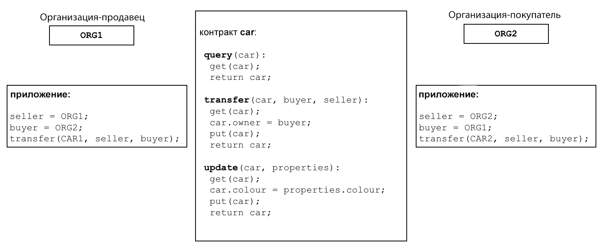
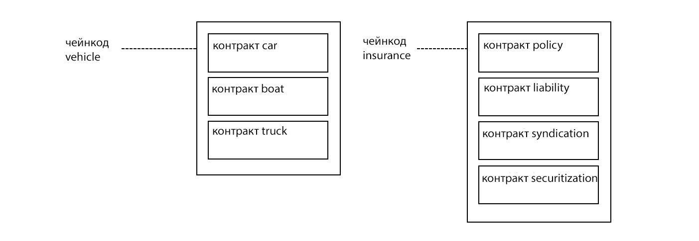
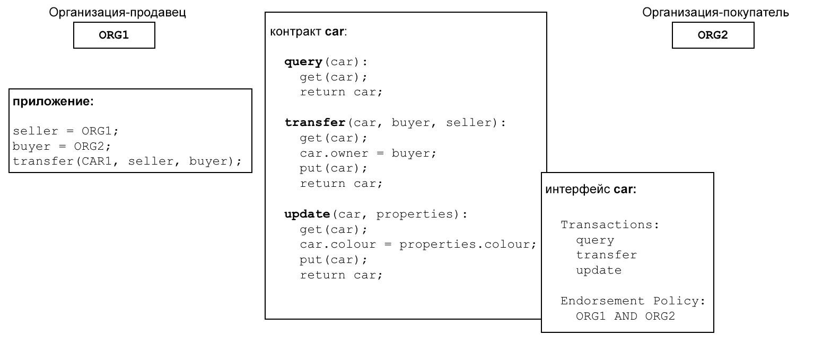
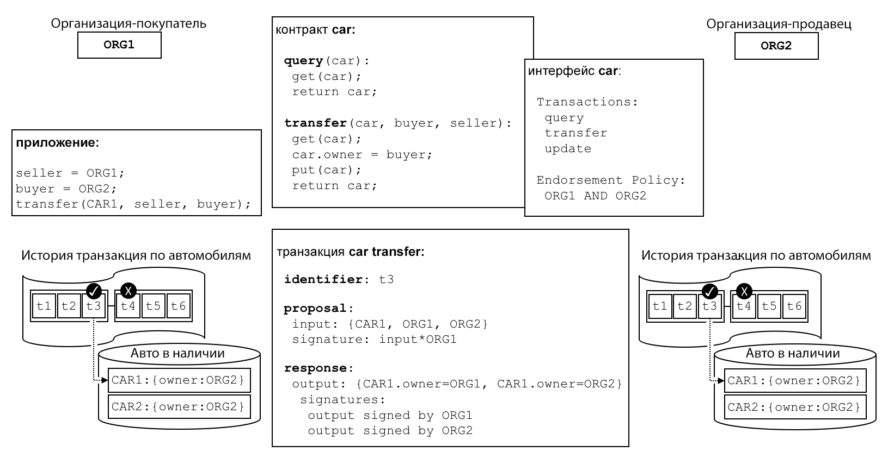
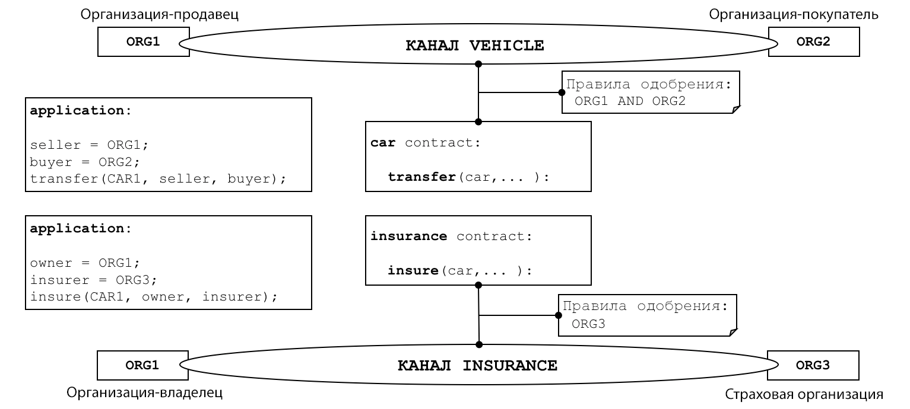

# Смартконтракты и чейнкод

**Для кого это**: Архитекторы, разработчики смартконтрактов и приложений, администраторы

С перспективы разработчика приложений **смартконтракт** вместе с
[реестром](../ledger/ledger.html) составляют сердце блокчейн-системы Hyperledger Fabric. Реестр
хранит факты о текущем и бывшем состоянии бизнес-объектов, а **смартконтракт** определяет
логику, согласно которой реестр пополняется новыми фактами. **Чейнкод** обычно используется
администраторами для группировки связанных смартконтрактов для последующего развертывания, но
может также использоваться для низкоуровневого системного программирования Fabric. В этой теме
мы сфокусируемся на том, почему существуют **смартконтракты** и **чейнкоды** и как и когда их
можно использовать.

В этой теме мы поговорим о:

* [Что такое смартконтракт](#смартконтракт)
* [Пара слов о терминологии](#терминология)
* [Смартконтракты и реестр](#реестр)
* [Как разработать смартконтракт](#разработка)
* [Значение политики подтверждения](#подтверждение)
* [Валидные транзакции](#валидные-транзакции)
* [Определения чейнкодов и каналы](#каналы)
* [Коммуникация между смартконтрактами](#внешние-коммуникации)
* [Что такое системный чейнкод?](#системный-чейнкод)

## Смартконтракт

Прежде чем начинать осуществлять транзакции предприятия должны определить общий набор
контрактов, охватывающий общие термины, данные, правила, определения и процессы. Все вместе эти
контракты образуют **бизнес модель**, которая управляет всеми взаимодействиями между сторонами
транзакций.

 *Смартконтракт в исполняемом коде определяет
правила для разных организаций. Приложения вызывают смартконтракт для создания транзакций,
которые впоследствии записываются в реестр.*

Используя блокчейн-сеть, мы можем превратить эти контракты в исполняемые программы -- называемые
**смартконтрактами** -- чтобы открыть широкий спектр новых возможностей. Смартконтракт может
реализовать правила управления для любого типа бизнес-объекта, так что они будут автоматически
исполняться при выполнении смартконтракта. Например, смартконтракт может обеспечить доставку
нового автомобиля в установленные сроки или перевод средств на заранее оговоренных условиях. Все
это улучшает поток товаров и капитала. Кроме того, выполнение смартконтракта гораздо эффективней
ручной работы человека.

В диаграме выше, мы видим, как две организации `ORG1` и `ORG2` определили смартконтракт `car`
для того, чтобы  `query`, `transfer` и `update` машины (запрашивать, передавать и обновлять).
Приложения этих организаций вызывают этот смартконтракт для исполнения согласованного шага
бизнес-процесса, например, для передачи права собственности на конкретный автомобиль от `ORG1` к
`ORG2`.


## Терминология

Пользователи Hyperledger Fabric часто используют термины **смартконтракт** и **чейнкод** в
качестве синонимов. Смартконтракт определяет **транзакционную логику**, контролирующую жизненный
цикл бизнес-объекта из world state. Потом он запаковывается в чейнкод, который впоследствии
разворачивается в блокчейн-сети.

 *Смартконтракт определен в чейнкоде. Несколько
смартконтрактов могут быть определены в одном чейнкоде. Когда чейнкод разворачивается, все
смартконтракты внутри него становятся доступными приложениям.*

На схеме мы видим чейнкод `vehicle`, содержащий три смартконтракта: `cars`, `boats` и `trucks`.
Кроме того, мы видим чейнкод `insurance`, содержащий четыре смартконтракта: `policy`,
`liability`, `syndication` and `securitization`. В обоих случаях контракты покрывают ключевые
аспекты бизнес-процесса транспортных средств и страхования. В этой теме мы будем использовать в
качестве примера контракт `car`. Мы видим, что смартконтракт - это специфическая программа,
связанная с определенными бизнес-процессами, в то время как чейнкод - технический контейнер для
группы связанных смартконтрактов.

## Реестр

Блокчейн постоянно регистрирует транзакции, обновляющие состояния в реестре. Смартконтракт
получает доступ к двум частям реестра -- блокчейну, который записывает историю всех транзакций,
и world state, содержащему кэш текущего значения этих состояний.

Смартконтракт может **put**, **get** и **delete** (добавлять, доставать, удалять) состояния
world state, а также запрашивать запись транзакций блокчейна.

* **get** --- обычно запрашивает информацию о текущем состоянии бизнес-объекта
* **put** --- обычно создает бизнес-объект или изменяет уже существующий в world state реестра
* **delete** --- обычно удаляет бизнес-объект из текущего состояния реестра, но не из истории

Смартконтрактам доступны многие [APIs](../developapps/transactioncontext.html#structure). Во
всех этих случаях, что бы ни делали транзакции: создавали, читали, обновляли, удаляли бизнес-
объекты из world state, блокчейн содержит [неизменяемую запись](../ledger/ledger.html) этих
изменений.

## Разработка

Смартконтракты находятся в фокусе разработки приложений, и, как мы видели, один или больше
смартконтрактов может определяться единственным чейнкодом. Размещение чейнкода в сети делает все
его смартконтракты доступными всем организациям в сети. Это означает, что только администраторы
должны беспокоиться о чейнкоде, а остальные могут использовать термин смартконтракт.

В центре смартконтракта набор определений `transaction` (транзакций). Посмотрите на пример
fabcar.js [тут](https://github.com/hyperledger/fabricsamples/blob/{BRANCH}/chaincode/fabcar/javascript/lib/fabcar.js#L93), здесь транзакция смартконтракта создает новую машину:

```javascript
async createCar(ctx, carNumber, make, model, color, owner) {

    const car = {
        color,
        docType: 'car',
        make,
        model,
        owner,
    };

    await ctx.stub.putState(carNumber, Buffer.from(JSON.stringify(car)));
}
```

Вы можете узнать больше о смартконтракте **Fabcar** в разделе [Пишем первое приложение]
(../write_first_app.html).

Смартконтракт умеет описывать практически бесконечный набор бизнес юзкейсов. Работа разработчика
смартконтрактов состоит в том, чтобы превратить существующий бизнес-процесс в смартконтракт на,
например, JavaScript, Go или Java. О том, как разработать смартконтракт, вы можете узнать в
разделе [Разработка приложений](../developapps/developing_applications.html).

## Подтверждение

К каждому чейнкоду привязана политика подтверждения, которая применяется ко всем
смартконтрактам, определенным в нем. Политика подтверждения имеет очен важное значение; она
указывает, какие организации в блокчейн-сети должны подписать транзакцию, полученную с помощью
данного смартконтракта для того, чтобы транзакция была признана **валидной**.

 *У каждого смартконтракта есть связанная с ним
политика подтверждения. В рамках этой политики подтверждения определяется, какие организации
должны утверждать транзакции, сгенерированные смартконтрактом, прежде чем эти транзакции могут
быть признаны действительными.*

Политика подтверждения может, например, постановить, что три из четырех организаций, участвующих
в блокчейн-сети, должны подписать транзакцию, чтобы она считалась **валидной**. Все транзакции,
валидные и невалидные, добавляются в реестр, но только валидные обновляют world state.

Если политика подтверждения предусматривает, что более чем одна организация должна подписать
транзакцию, тогда для генерации валидной транакции смартконтракт должен быть запущен достаточным
количеством организаций. В примере выше транзакция смартконтракта `transfer` машины должна быть
запущена и подписана обеими организациями `ORG1` и `ORG2`, чтобы быть валидной.

Политики подтверждения отличают Hyperledger Fabric от таких блокчейнов как Ethereum или Bitcoin.
В таких системах валидные транзакции генерируются любым узлом в сети. Hyperledger Fabric более
реалистично отражает мир; транзакции должны подтверждаться доверенными организациями в сети.
Например, правительственная организация должна подписать валидную транзакцию `issueIdentity`,
или оба `buyer` и `seller` (продавец и покупатель) машины должны подписать транзакцию. Политики
подтверждения спроектированы так, чтобы позволять Hyperledger Fabric лучше соответствовать
взаимодействиям из реального мира.

Наконец, политики подтверждения --- лишь один пример [policy](../access_control.html#policies) в
Hyperledger Fabric. Другие политики могут определять, кто может запрашивать или обновлять
реестр, добавлять или удалять членов из сети. Как правило, политики должны быть заранее
согласованы консорциумом организаций в блокчейн-сети, хотя их можно будет впоследствии изменять.
Политики сами могут определять правила, по которым их можно изменять. Можно также определять
[пользовательскую политику подтверждения](../pluggable_endorsement_and_validation.html).

## Валидные транзакции

Запущенный смартконтракт работает на узле пира, принадлежащего организации в блокчейн-сети.
Контракт принимает входные параметры, называемые **транзакционные proposal** и использует их в
комбинации с программной логикой для прочтения реестра и записи в него. Изменения world state
записываются в **ответ на транзакционное proposal** (или **транзакционный ответ**), содержащий
**read-write set** с прочитанным состоянием и новым состоянием, которое будет записано, если
транзакция валидна. Заметьте, что world state **не обновляется, когда запускается
смартконтракт**!

 *Все транзакции имеют идентификатор, proposal,
ответ, подписанный набором организаций. Все траназкции записаны в блокчейн, неважно валидны ли
они, но только валидные транзакции обновляют wordl state*

Давайте рассмотрим транзакцию `car transfer`. Мы видим транзакцию `t3`, отвечающую за трансфер
между `ORG1` и `ORG2`. У транзакции есть входные данные `{CAR1, ORG1, ORG2}` и выходные данные
`{CAR1.owner=ORG1, CAR1.owner=ORG2}`, показывающие смену владельца с `ORG1` на `ORG2`. Заметьте,
что входные данные подписаны приложением организации `ORG1`, а выходные данные подписаны
*обеими* организациями `ORG1` и `ORG2`. Эти подписи были сгенерированы с использованием
приватных ключей, что означает, что кто угодно в сети может проверить, что все участники сети
согласны с транзакционными деталями.

Транзакция, распространенная по пирам во всей сети, **валидируется** двумя фазами у каждого
пира. Во-первых, транзакция проверяется на подписи всех организаций в соответствии с политикой
подтверждения. Во-вторых, проверяется то, что текущее значение world state соответствует read-
set транзакции на момент, когда она была подписана подтверждающими пирами; что за это время не
произошло обновления. Если транзакция проходит оба теста, она помечается **валидной**. Все
транзакции добавляются в историю блокчейна, но только **валидные** транзакции влияют на world
state.

В нашем примере, `t3` --- валидная транзакция, поэтому владельцем `CAR1` стала `ORG2`. Однако,
`t4` (не показана) --- невалидная транзакция, поэтому она записана в реестр, но не обновила
world state и `CAR2` все еще принадлежит `ORG2`.

Для понимания, как использовать смартконтракт или чейнкод с world state, ознакомьтесь с темой
[пространство имен чейнкода](../developapps/chaincodenamespace.html).

## Каналы

Hyperledger Fabric позволяет организации одновременно участвовать в нескольких отдельных
блокчейн-сетях с помощью **каналов**. Присоединяясь к нескольким каналам, организации могут
участвовать в так называемой **сети сетей**. Каналы обеспечивают эффективный обмен
инфраструктурой, при этом сохраняют данные и сообщения конфиденциальными. Они достаточно
независимы, чтобы помочь организациям разделить их рабочие потоки с различными партнерами, но
достаточно интегрированы, чтобы при необходимости позволять организациям координировать
независимую деятельность.

 *Канал предоставляет механизм полностью
отдельной коммуникации между набором организаций. Когда определение чейнкода сохраняется в
канал, все смартконтракты в чейнкоде становятся доступными приложениям этого канала.*

У пиров организаций смартконтракт установлен внутри чейнкод-пакета, а члены канала могут
запустить смартконтракт только после того, как чейнкод будет определен в канале. **Определение
чейнкода** это структура, содержащая параметры, управляющие работой чейнкода. Эти параметры
включают в себя имя чейнкода, его версию и его политику подтверждения. Каждый член канала
соглашается с параметрами чейнкода, подтверждая определение чейнкода. Когда определенное
количество организаций (по умолчанию большинство) подтвердило одно и то же определение чейнкода,
оно сохраняется на канал. Смартконтракты внутри чейнкода после этого могут запускаться членами
канала, при условии соблюдения политики подтверждения, указанной в определении чейнкода.
Политика подтверждения в равной степени применяется ко всем смартконтрактам, определенным внутри
одного чейнкода.

В примере [above](#каналы) контракт `car` определен в канале `VEHICLE`, а контракт `insurance`
определен в канале `INSURANCE`. Определение чейнкода `car` содержит политику подтверждения,
которая указывает, что для признания транзакции валидной нужны подписи обеих организаций `ORG1`
и `ORG2`. Определение чейнкода контракта `insurance` указывает, что нужна подпись только `ORG3`.
`ORG1` участвует в двух сетях, канале `VEHICLE` и сети `INSURANCE`, и может координировать
деятельность с `ORG2` и `ORG3` между этими двумя сетями.

Определение чейнкода дает участникам канала возможность договориться об управлении чейнкодом до
того, как они начнут использовать смартконтракт для совершения транзакций в канале. Обращаясь к
примеру выше, обе организации `ORG1` и `ORG2` хотят подтвердить транзакцию, вызывающую контракт
`car`. Поскольку по умолчанию политика требует, чтобы большинство организаций одобрило
определение чейнкода, обе организации должны утвердить политику подтверждения `AND{ORG1,ORG2}`.
Иначе `ORG1` и `ORG2` одобрят разные определения чейнкода и не смогут сохранить определение
чейнкода на канале.

## Внешние коммуникации

Смартконтракт может вызывать другие смартконтракты как по одному каналу, так и между разными
каналами. Таким образом, они не могут читать и писать данные world state, к которым бы они иначе
не имели бы доступа из-за пространств имен смартконтрактов.

Существуют ограничения в отношении межконтрактной коммуникации, полностью описанные в теме
[пространство имен чейнкода](../developapps/chaincodenamespace.html#cross-chaincode-access).

## Системный чейнкод

Определенные внутри чейнкода смартконтракты кодируют зависящие от области правила бизнес-
процесса, согласованные набором организаций. Чейнкод можен быть также низкоуровневым, то есть проводить действия на уровне системы. Такой чейнкод не зависит от конкретного сценария, он не связан со смартконтрактами бизнесс-процессов.

Ниже приведены разные виды системного чейнкода и соответствующие им аббревиатуры:

* `_lifecycle` --- работает на всех пирах и управляет установкой чейнкода на пирах, одобрением определений чейнкода и сохранением определений чейнкода в каналах. Про реализацию `_lifecycle` процесса можно прочитать [здесь](../chaincode_lifecycle.html).

* Lifecycle system chaincode (LSCC) управляет жизненным циклом чейнкода в 1.х релизах Fabric. Эта версия жизненного цикла требовала, чтобы чейнкод создавался и изменялся в каналах. Вы все еще можете использовать LSCC для управления вашим чейнкодом, если у вас есть приложение канала, установленное на V1_4_x или ниже.

* **Configuration system chaincode (CSCC)** работает на всех пирах для изменения в настройках канала, например, обновления политики. Вы можете узнать больше об этом процессе [здесь](../configtx.html#configuration-updates).

* **Query system chaincode (QSCC)** работает на всех пирах, чтобы обеспечить работу APIs реестра, включающих запрос блоков, транзакционный запрос и так далее. Больше узнать об API реестра можно [здесь](../developapps/transactioncontext.html).

* **Endorsement system chaincode (ESCC)** работает на подтверждающих пирах для криптографической подписи транзакционных ответов. Про реализацию ESCC можно прочитать подробнее [здесь](../peers/peers.html#phase-1-proposal).

* **Validation system chaincode (VSCC)** валидирует транзакцию, включая проверку политики подтверждения и версии read-write set. Вы можете прочитать про реализацию VSCC [здесь](../peers/peers.html#phase-3-validation).

Администраторы и разработчики Fabric могут настроить системные чейнкоды для их собственных
пользователей. Однако разработка и управление системными чейнкодами это специализированная
деятельность, совершенно не связанная с разработкой смартконтрактов, и обычно в ней нет
необходимости. Изменения в системный чейнкод должны вноситься очень аккуратно, так как они имеют
огромное значение для правильного функционирования сети Hyperledger Fabric. Например, если
системный чейнкод разработан некорректно, один пир может обновлять его копию world state или
блокчейна не так, как другой пир. Это отсутствие консенсуса --- одна из форм **форка реестра**,
очень нежелательная ситуация.

<!--- Licensed under Creative Commons Attribution 4.0 International License
https://creativecommons.org/licenses/by/4.0/ -->
