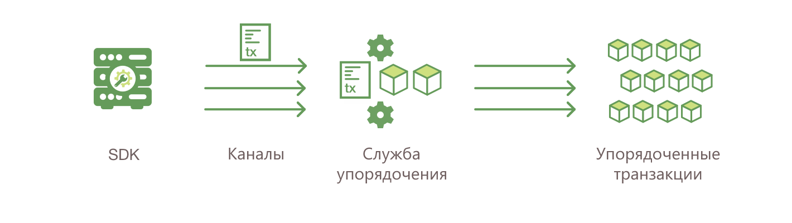

Выполнение транзакции
=====================

В этой статье описывается механика проведения транзакций во время стандартного процесса обмена активами.
В рассматриваемом примере присутствуют два клиента, A и B, которые покупают и продают редис. Оба клиента
имеют по одному одноранговому узлу в сети, через которые они отправляют транзакции и взаимодействуют с реестром.

.. image:: images/step0.png

**Исходные условия**

В этом примере предполагается, что канал уже настроен и работает. А пользователь приложения зарегистрировался
в удостоверяющем центре организации и получил необходимые криптографические ключи, используемые для аутентификации в сети.

Чейнкод (содержащий набор пар «ключ-значение», описывающих исходное состояние рынка редиса) установлен на одноранговых
узлах и развернут в канале. Чейнкод содержит логику, определяющую набор инструкций транзакции и согласованную цену на редис.
Для этого чейнкода также определена политика одобрения, согласно которой одноранговые узлы ``peerA`` и ``peerB`` должны одобрять любую транзакцию.

1. **Клиент A инициирует транзакцию**.

Что это означает: Клиент А отправляет запрос на покупку редиса. Этот запрос отправляется одноранговым узлам ``peerA`` и ``peerB``,
которые представляют клиентов A и B, соответственно. Правила одобрения требуют, чтобы оба одноранговых узла одобрили транзакцию,
поэтому запрос направляется как узлу ``peerA``, так и узлу ``peerB``.

Далее создается предложение транзакции. Приложение, работающее с SDK (на языках Node, Java, Python), использует одну из доступных
функций API для создания предложения транзакции. В предложении запрашивается вызов функции чейнкода с определенными входными
параметрами с целью считывания и/или обновления реестра.

Функции SDK служат программной прослойкой для упаковки предложения транзакции в правильный формат (protocol buffers по протоколу gRPC),
при этом криптографические ключи пользователя используются для создания уникальной подписи этого предложения транзакции.

2. **Одобряющие узлы проверяют подпись и проводят транзакцию**.

Одобряющие узлы проверяют следующее: (1) предложение транзакции сформировано правильно; (2) оно не было отправлено ранее (защита от атак с повтором);
(3) подпись действительна (обращением к провайдеру службы членства); (4) отправитель (клиент A, в примере) должным образом авторизован для выполнения
предложенной операции в этом канале (а именно, каждый одобряющий узел гарантирует, что отправитель удовлетворяет требованиям политики *Writers* канала).
Одобряющие узлы принимают входные данные предложения транзакции в качестве аргументов вызываемой функции чейнкода. Затем чейнкод выполняется,
обращаясь к базе данных текущего состояния для получения результатов транзакции, включая значение ответа, набор чтения, набор записи (т.е.
пары «ключ-значение», описывающие создаваемый или обновляемый актив). На этом этапе никаких обновлений в реестр не вносится. Набор этих значений
вместе с подписью одобряющего узла передается обратно в качестве «ответа на предложения» функции SDK, которая анализирует данные, передаваемые в приложение.

.. note:: Провайдер службы членства — это компонент однорангового узла, который позволяет ему проверять запросы транзакций, поступающие от клиентов,
          а также подписывать (одобрять) результаты транзакций. Политики записи определяются во время создания канала и определяют, какие пользователи
          имеют право отправлять транзакцию в канал. Для получения дополнительной информации смотрите раздел :doc:`membership/membership`.

.. image:: images/step3.png

3. **Проверка ответов на запрос**.

Приложение проверяет подписи одобряющих узлов и сравнивает ответы на запросы, чтобы определить, совпадают ли ответы.
Если чейнкод только считывает реестр, приложение проверяет только ответ на запрос и обычно не отправляет транзакцию
в службу упорядочения. Если клиентское приложение намеревается отправить транзакцию в службу упорядочения для обновления
реестра, оно определяет, были ли получены указанные одобрения перед отправкой (т.е., одобрения от узлов peerA и peerB).
Особенности архитектуры заключаются в том, что даже если приложение решит не проверять ответы или иным образом
пересылать неодобренную транзакцию, политика одобрения все равно будет соблюдена одноранговыми узлами на этапе
проверки перед записью в реестр.

4. **Клиент собирает одобрения в транзакцию**.

Приложение отправляет предложение транзакции и ответ в «сообщении транзакции» в службу упорядочения. Транзакция
содержит наборы чтения и записи, подписи одобряющих узлов и идентификатор канала. Службе упорядочения не нужно
проверять содержимое транзакции для выполнения своих функций. Она просто получает транзакции
их всех каналов в сети, упорядочивает их в хронологическом порядке по каналам и создает блоки транзакций для каждого канала.

5. **Транзакция подтверждается и записывается**.

Блоки транзакций «доставляются» всем одноранговым узлам в канале. Транзакции в блоке проверяются, чтобы убедиться в том,
что соблюдена политика одобрения, а также чтобы гарантировать, что в состояние реестра не изменилось для переменных
набора чтения, с момента создания набора чтения при выполнении транзакции. Транзакции в блоке помечаются как
действительные или недействительные.

.. image:: images/step6.png

6. **Обновление реестра**.

Каждый одноранговый узел добавляет блок в цепочку блоков канала и наборы записи фиксируются в базе данных
текущего состояния для каждой действительной транзакции. Каждый одноранговый узел генерирует событие,
чтобы уведомить клиентское приложение о том, что транзакция (вызов) была добавлена в цепочку без возможности
дальнейших изменений, а также уведомление о том, была ли транзакция признана действительной или нет.

.. note:: Приложения прослушивают событие транзакции после отправки транзакции, например, с помощью функции
          ``submitTransaction``, которая автоматически прослушивает события транзакции. Без прослушивания
          событий транзакции, невозможно узнать действительно ли транзакция была упорядочена, проверена и записана в реестре.

Также можно использовать приведенную ниже последовательность действий, чтобы более подробно изучить транзакционный поток.

.. image:: images/flow-4.png
