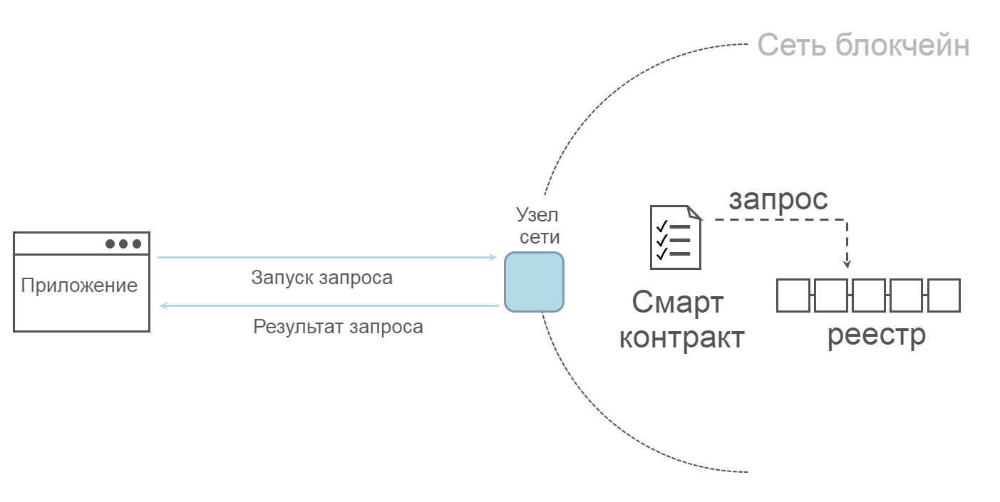

Как написать свое первое приложение
===================================

.. note:: Если вы еще не очень хорошо знакомы с основами архитектуры
          сети Fabric, то, до того, как изучать этот раздел,
          вам может быть полезным сначала ознакомиться с разделом :doc:`key_concepts`.

          Также стоит отметить, что это руководство является введением в приложения Fabric
          и использует смарт-контракты и приложения в простой форме.
          Для более глубокого изучения приложений Fabric и смарт-контрактов, см.
          наш раздел:
          :doc:`developapps/developing_applications` или
          :doc:`tutorial/commercial_paper`.

В этом руководстве мы изложим введение в то, как приложения Fabric взаимодействуют
с развернутыми блокчейн-сетями. В этом руководстве используются примеры программ, созданные
при помощи Fabric SDK (наборов средств разработки), подробно описанных в :doc:`/developapps/application`  --
для того, чтобы вызывать смарт-контракты для запроса и обновления реестра посредством
интерфейса смарт-контракта (API), подробно описанного в :doc:`/developapps/smartcontract`.
Мы используем также образцы программ и развернутый удостоверяющий центр для создания
сертификатов X.509, которые потребубися приложению для взаимодействия с приватным блокчейном.

**О FabCar**

Пример FabCar показывает, как запрашивать `Car`, наш пример бизнес-объекта, записанного в реестр,
и как обновлять реестр (записывать новый объект `Car` в реестр).
Для этого используются два следующих компонента:

  1. Пример приложения, которое обращается к блокчейну, вызывая транзакции, реализованные в
  смарт-контрактах.

  2. Сам смарт-контракт, реализующий транзакции взаимодействия с реестром.

Для этого пройдем три принципиально важных этапа:

  **1. Настройка среды разработки. ** Для нашего приложения необходима сеть, с которой оно
  бы взаимодействовало, так что мы развернем простую сеть для наших смарт-контрактов
  и приложения.

  .. image:: images/AppConceptsOverview.png

  **2. Изучение образца смарт-контракта.**
  Мы исследуем образец смарт-контракта FabCar, чтобы понять транзакции внутри него, и
  как они используются приложением для запроса и обновления реестра.

  **3. Организовать взаимодействие со смарт-контрактом при помощи приложения.**
  Наше приложение будет использовать смарт-контракт FabCar для опроса и обновления принадлежностей машины в реестре.
  Мы погрузимся в программный код приложений и транзакций, которые создаются приложениями, включая опрос машины, опрос нескольких
  машин и создание новой машины.

После того, как вы изучите руководство, вы будете иметь основы представлений о том,
как взаимодействует приложения Fabric и смарт-контракты - для того, чтобы управлять данными
в распределенном реестре блокчейн-сети.

Предисловие:
----------------

Вдобавок к стандарным требованиям :doc:`prereqs` для  Fabric, в этом руководстве также испольуется Hyperledger Fabric SDK для Node.js.
Ознакомьтесь с Node.js SDK `README <https://github.com/hyperledger/fabric-sdk-node#build-and-test>`__ в котором содержится актуальный набор требований для начала работы.

- Если вы используете macOS, следует предпринять следующие шаги:

  1. Установите `Homebrew <https://brew.sh/>`_.
  2. Сверьтесь со списком требований к Node SDK `prerequisites <https://github.com/hyperledger/fabric-sdk-node#build-and-test>`_ чтобы знать, Node какого уровня установить.
  3. Запустите ``brew install node`` чтобы загрузить последнюю версию узла или выберите конкретную версию, как пример: ``brew install node@10`` в зависимости от того, что требуется.
  4. Запустите ``npm install``.

- Если вы в среде Windows,  можете установить `windows-build-tools <https://github.com/felixrieseberg/windows-build-tools#readme>`_ с npm, который установит все требуемые компиляторы и инструменты при запуске следующей команды:

  .. code:: bash

    npm install --global windows-build-tools

- Если вы в среде Linux, вам нужно установить `Python v2.7 <https://www.python.org/download/releases/2.7/>`_, `make <https://www.gnu.org/software/make/>`_, и набор компиляторов C/C++, такой как `GCC <https://gcc.gnu.org/>`_. Затем можете запустить следующую команду, чтобы установить оставшиеся инструменты:

  .. code:: bash

    sudo apt install build-essentials

Настройка сети блокчейн
-----------------------------

Если вы уже проходили шаги в руководстве :doc:`test_network` и подняли сеть,
тогда данное руководство остановит вашу ранее запущенную сеть, прежде чем запустить новую.

Запуск сети
^^^^^^^^^^^^^^^^^^

.. note:: это руководство показывает смарт-контракт на примере JavaScript-версии, но репозиторий ``fabric-samples``
          содержит также версиии на Go, Java и TypeScript. Для изучения
          Go, Java или TypeScript - версий, смените аргумент ``javascript``
          для ``./startFabric.sh`` ниже на ``go``, ``java`` или ``typescript``
          и следуйте инструкциям на терминале.

Проследуйте в поддиректорию ``fabcar`` в вашей локальной копии репозитория
``fabric-samples``.

.. code:: bash

  cd fabric-samples/fabcar

Запустите скриптом ``startFabric.sh`` свою сеть.

.. code:: bash

  ./startFabric.sh javascript

Эта команда развернет тестовую сеть Fabric с двумя одноранговыми узлами и службой упорядочения.
Вместо использования инструмента cryptogen tool, мы запустим тестовую сеть
при помощи удостоверяющих центров. Мы используем один из УЦ для того, чтобы создать
сертификаты и ключи, которые пригодятся нашим приложениям на следующем этапе. Скрипт ``startFabric.sh``
также развернет и инициализирует JavaScript-версию смарт-контракта FabCar
на канале ``mychannel``, и затем вызовет смарт-контракт для внесения начальных данных в реестр.

Образец приложения
^^^^^^^^^^^^^^^^^^
Первый компонент FabCar, образец приложения, приведен на следующих языках:

- `Golang <https://github.com/hyperledger/fabric-samples/blob/{BRANCH}/fabcar/go>`__
- `Java <https://github.com/hyperledger/fabric-samples/blob/{BRANCH}/fabcar/java>`__
- `JavaScript <https://github.com/hyperledger/fabric-samples/blob/{BRANCH}/fabcar/javascript>`__
- `Typescript <https://github.com/hyperledger/fabric-samples/blob/{BRANCH}/fabcar/typescript>`__

В этом руководстве мы разберем образец, написанный на ``javascript`` для nodejs.

Из директории ``fabric-samples/fabcar`` перейдите в папку
``javascript``.

.. code:: bash

  cd javascript

Эта директория содержит образцы программ, разработанные при помощи Fabric
SDK для Node.js. Запустите следующую команду для установки зависимостей приложения.
Завершение займет около минуты:

.. code:: bash

  npm install

Этот процесс устанавливает ключевые зависимости приложения, определенные в
``package.json``. Важнейшим из них является класс ``fabric-network``;
при его помощи приложение может использовать идентификаторы, кошельки и шлюзы, чтобы
соединяться с каналами, записывать транзакции и ожидать уведомления. В этом
руководстве также используется класс ``fabric-ca-client``, чтобы удостоверять пользователей
при помощи соответствующих УЦ, создавая для них действующие идентификаторы, которые впоследствии
будут использоваться методами классов ``fabric-network``.

По завершении``npm install``, всё будет готово для запуска приложения.
Давайте посмотрим на файлы приложения JavaScript, которые мы будем использовать:

.. code:: bash

  ls

И вы должны видеть следующее:

.. code:: bash

  enrollAdmin.js  node_modules       package.json  registerUser.js
  invoke.js       package-lock.json  query.js      wallet

Для других языков программирования также есть файлы, например в директории
``fabcar/java``. Можете ознакомиться с ними после того, как изучите пример на
JavaScript -- принципы те же.

Регистрация пользователя-администратора
---------------------------------------

.. note:: Последующие два раздела описывают общение с удостоверяющим центром.
          Может оказаться полезным наблюдать за потоком журналов УЦ при запуске
          программы. Для этого откройте новую терминальную оболочку и запустите:
          ``docker logs -f ca_org1``.

Как только мы создали сеть, администратор, буквально  ``admin`` ---
был создан как **регистратор** для УЦ. Первым нашим шагом будет создание секретного
ключа, открытого ключа и сертификата X.509 для ``admin``, используя программу ``enroll.js``.
Этот процесс использует  **Запрос на подпись сертификата** (CSR) --- секретный и открытый ключи сначала
создаются локально, затем открытый ключ посылается в УЦ, который в ответ возвращает
зашифрованный сертификат для использования в приложении. Эти сведения затем хранятся в кошельке,
позволяя нам выполнять роль администратора для УЦ.

Давайте зарегистрируем пользователя ``admin``:

.. code:: bash

  node enrollAdmin.js

Эта команда сохраняет сведения об адинистраторе УЦ в директории ``wallet``.
Сертификат и секретный ключ можно увиеть в файле ``wallet/admin.id``.

Регистрация пользователя приложения
---------------------------------------

Наш  ``admin`` работал с УЦ. Теперь, когда удостоверяющие сведения об администраторе
содержатся в кошельке, мы можем создать пользователя приложения, которого в свою очередь
используем для общения с блокчейном. Запустите следующую команду для регистрации и входа
нового пользователя с именем ``appUser``:

.. code:: bash

  node registerUser.js

Подобно входу администратору, эта программа использует CSR для регистрации ``appUser`` и
хранения удостоверяющих его сведений вместе с таковыми для ``admin``- в кошельке.
Теперь у нас есть идентификаторы для двух отдельных пользователей -- ``admin`` и ``appUser``,
которые могут быть использованы нашим приложением.

Запрос к реестру
-------------------

Каждый одноранговый узел в сети блокчейн хранит копию `реестра <./ledger/ledger.html>`_.
Приложение может просматривать последние данные из реестра, производя вызов смарт-контракта
"только на чтение" для своих узлов, который называем "запросом".

В упрощенном виде запрос работает так:

Наиболее распространенным видом запроса является запрос текущего значения данных в реестре
- его "глобальное состояние" - `world state <./ledger/ledger.html#world-state>`_.
Глобальное состояние представлено множеством пар ключ-значение, и приложения могут запрашивать созданные
одному или нескольким значениям ключей. Более того, можно использовать сложные запросы
к данным реестра, если вы используете CouchDB как базу данных состояний и моделируете свои данные в JSON.
Это может быть очень полезно, если вы ищете все записи, которые ставят определенные
ключевые слова в соответствие определенным значениям, например, при поиске всех машин одного владельца.

Сначала давайте запустим нашу программу ``query.js`` чтобы она сообщила список всех машин в реестре.
Эта программа использует второй наш идентификатор -- ``appUser`` -- чтобы читать реестр.

.. code:: bash

  node query.js

Результат действия программы должен выглядеть так:

.. code:: json

  Wallet path: ...fabric-samples/fabcar/javascript/wallet
  Transaction has been evaluated, result is:
  [{"Key":"CAR0","Record":{"color":"blue","docType":"car","make":"Toyota","model":"Prius","owner":"Tomoko"}},
  {"Key":"CAR1","Record":{"color":"red","docType":"car","make":"Ford","model":"Mustang","owner":"Brad"}},
  {"Key":"CAR2","Record":{"color":"green","docType":"car","make":"Hyundai","model":"Tucson","owner":"Jin Soo"}},
  {"Key":"CAR3","Record":{"color":"yellow","docType":"car","make":"Volkswagen","model":"Passat","owner":"Max"}},
  {"Key":"CAR4","Record":{"color":"black","docType":"car","make":"Tesla","model":"S","owner":"Adriana"}},
  {"Key":"CAR5","Record":{"color":"purple","docType":"car","make":"Peugeot","model":"205","owner":"Michel"}},
  {"Key":"CAR6","Record":{"color":"white","docType":"car","make":"Chery","model":"S22L","owner":"Aarav"}},
  {"Key":"CAR7","Record":{"color":"violet","docType":"car","make":"Fiat","model":"Punto","owner":"Pari"}},
  {"Key":"CAR8","Record":{"color":"indigo","docType":"car","make":"Tata","model":"Nano","owner":"Valeria"}},
  {"Key":"CAR9","Record":{"color":"brown","docType":"car","make":"Holden","model":"Barina","owner":"Shotaro"}}]

Давайте изучим внимательнее, как программа `query.js` использует программный интерфейс
`Fabric Node SDK <https://hyperledger.github.io/fabric-sdk-node/>`__ чтобы
взаимодействовать с нашей сетью Fabric. Используйте редактор (например, atom или visual studio) и откройте
 ``query.js``.

Это приложение начинается с рассмотрения двух ключевых классов из
модуля ``fabric-network``; ``Wallets`` и  ``Gateway``. Эти классы
будут использованы для нахождения идентификатора ``appUser`` в кошельке, и использования его
для соединенния с сетью:

.. code:: bash

  const { Gateway, Wallets } = require('fabric-network');

Сначала программа использует класс Wallet, чтобы извлечь нашего пользователя из файловой системы.

.. code:: bash

  const identity = await wallet.get('appUser');

Как только программа получила идентификатор, она использует класс Gateway для соединения с сетью.

.. code:: bash

  const gateway = new Gateway();
  await gateway.connect(ccpPath, { wallet, identity: 'appUser', discovery: { enabled: true, asLocalhost: true } });

``ccpPath`` описывает путь к профилю соединения, который будет использовать наше приложение для соединения с нашей сетью.
Профиль соединения был загружен из директории ``fabric-samples/test-network`` и размечен как файл JSON:

.. code:: bash

  const ccpPath = path.resolve(__dirname, '..', '..', 'test-network','organizations','peerOrganizations','org1.example.com', 'connection-org1.json');

Если вы захотите узнать подробнее о структуре профиля соединения,
и как он определяет сеть, смотрите в разделе `the connection profile <./developapps/connectionprofile.html>`_.

Сеть может подразделяться на множество каналов, и следующая важная строчка кода соединяет приложение
с конкретным каналом в сети,``mychannel``, в котором был развернут наш смарт-контракт:

.. code:: bash

  const network = await gateway.getNetwork('mychannel');

В рамках этого канала нам доступен смарт-контракт FabCar для взаимодействия с реестром:

.. code:: bash

  const contract = network.getContract('fabcar');

Внутри FabCar много разных **транзакций**, и наше приложение поначалу
использует транзакцию``queryAllCars``, чтобы извлечь глобальное состояние реестра:

.. code:: bash

  const result = await contract.evaluateTransaction('queryAllCars');

В свою очередь метод ``evaluateTransaction`` представляет одну из простейших транзакций
смарт-контракта в сети. Он просто посылает запрос на узел, определенный в профиле соединения, и узел
этот запрос оценивает. Смарт-контракт опрашивает все машины на принадлежащей узлу копии реестра
и возвращает результат приложению. Эта транзакция не изменяет реестр.

Смарт-контракт FabCar
-------------------------
Смарт-контракт FabCar есть на следующих языках программирования:

- `Golang <https://github.com/hyperledger/fabric-samples/blob/{BRANCH}/chaincode/fabcar/go>`__
- `Java <https://github.com/hyperledger/fabric-samples/blob/{BRANCH}/chaincode/fabcar/java>`__
- `JavaScript <https://github.com/hyperledger/fabric-samples/blob/{BRANCH}/chaincode/fabcar/javascript>`__
- `Typescript <https://github.com/hyperledger/fabric-samples/blob/{BRANCH}/chaincode/fabcar/typescript>`__

Рассмотрим транзакции в смарт-контракте FabCar, написанном на JavaScript. Откройте
новый терминал и найдите JavaScript-версию смарт-контракта FabCar
в репозитории ``fabric-samples``:

.. code:: bash

  cd fabric-samples/chaincode/fabcar/javascript/lib

Откройте файл ``fabcar.js`` в текстовом редакторе.

Вот как определен наш смарт-контракт через класс ``Contract`` :

.. code:: bash

  class FabCar extends Contract {...

Внутри структуры этого класса, видно, что у нас определены следующие транзакции:
 ``initLedger``, ``queryCar``, ``queryAllCars``,
``createCar``, и ``changeCarOwner``. К примеру:

.. code:: bash

  async queryCar(ctx, carNumber) {...}
  async queryAllCars(ctx) {...}

Посмотрим внимательнее на транзакцию ``queryAllCars``, чтобы понять,
как она взаимодействует с реестром.

.. code:: bash

  async queryAllCars(ctx) {

    const startKey = '';
    const endKey = '';

    const iterator = await ctx.stub.getStateByRange(startKey, endKey);

Эти строчки кода показывают, как извлечь информацию о всех машинах из реестра, по
диапазону значений ключа: ``getStateByRange``. Если задать startKey и endKey пустыми,
это будет проинтерпретировано, как задание всех ключей от начала и до конца.
Следующим примером, если задать ``startKey = 'CAR0', endKey = 'CAR999'`` , тогда ``getStateByRange``
извлечет машины со значениями ключа ``CAR0`` (включительно) and ``CAR999`` (не включая) в алфавитном порядке.
Остаток кода пробегает по результатам запроса и пакует их в JSON для использования приложением.

Ниже приведено представление того, как приложение будет вызывать разные транзакции
смарт-контракта. Каждая транзакция использует широкий набор интерфейсов, таких как
``getStateByRange`` для взаимодействия с реестром. Ознакомиться с интерфейсами подробнее можно
в <https://hyperledger.github.io/fabric-chaincode-node/>`_.

Вот пример транзакции``queryAllCars`` и транзакции ``createCar``.
Чуть позже в руководстве мы используем их для изменения реестра и добавления нового
блока в блокчейн.

Но сначала вернемся к программе ``query`` и изменим
запрос ``evaluateTransaction`` на ``CAR4``. Программа ``query`` теперь
будет выглядеть так:

.. code:: bash

  const result = await contract.evaluateTransaction('queryCar', 'CAR4');

Сохраните программу и откройте директорию``fabcar/javascript``.
Теперь снова запустите программу``query``:

.. code:: bash

  node query.js

Вы должны увидеть следующее:

.. code:: json

  Wallet path: ...fabric-samples/fabcar/javascript/wallet
  Transaction has been evaluated, result is:
  {"color":"black","docType":"car","make":"Tesla","model":"S","owner":"Adriana"}

Если вернуться назад и посмотреть на результат транзакции
``queryAllCars``, можно увидеть, что ``CAR4`` это принадлежащая Адриане (Adriana) черная Tesla model S,
что и соответствует результату выше.

Мы можем использовать транзакцию``queryCar``, чтобы сделать запрос о любой машине, используя
значение ее ключа (например, ``CAR0``) и получить всю информацию об этой машине (модель, владелец, марка, и т.д.).

Прекрасно. Теперь вы умеете составлять транзакции простых запросов в смарт-контракте и познакомились
с несколькими параметрами программы query.

Наступила пора менять реестр...

Обновление реестра
-------------------

Теперь, когда мы исполнили несколько запросов к реестру и написали несколько строчек кода,
мы готовы к обновлению реестра. Мы можем вносить разные изменения, но для начала попробуем
создать **новую** машину.

С точки зрения приложения, обновление реестра - вещь простая.
Приложение посылает транзакцию в блокчейн-сеть, и после того, как она провалидирована и записана,
приложение получает уведомление о том, что транзакция прошла успешно.
С точки же зрения внутренней механики, эта процедура содержит внутренний процесс, называемый
**консенсус**, посредством которого разные компоненты блокчейн-сети, работая вместе, приходят
к тому, что каждое изменение в реестр является валидным и совершается в согласованном и
последовательном порядке.

На диаграмме выше вы можете наблюдать основные компоненты этого процесса.
Сеть содержит не только множество одноранговых узлов сети, каждый из которых хранит
копию реестра, и, как вариант, копию смарт-контракта, но также содержит и службу упорядочения.
Служба упорядочения координирует транзакции сети, она создает блоки, содержащие
в четко определенной последовательности транзакции, порожденные всеми приложениями сети.

Наше первое изменение в реестр создаст новую машину.
У нас есть отдельная программа ``invoke.js``, которую мы используем для внесения изменений в реестр.
Точно так же, как и с запросами, откройте программу в текстовом редакторе и посмотрите на участок кода, в котором
мы сконструировали нашу транзакцию и послали ее в сеть:

.. code:: bash

  await contract.submitTransaction('createCar', 'CAR12', 'Honda', 'Accord', 'Black', 'Tom');

Убедитесь, как приложение вызывает транзакцию смарт-контракта ``createCar``, чтобы
создать черную Honda Accord, принадлежащую Тому. Мы написали ``CAR12`` как ключ
лишь для того, чтобы показать, что последовательные ключи нам здесь не обязательны.

Сохраните и запустите программу:

.. code:: bash

  node invoke.js

Если вызов состоялся успешно, вы увидите ровно следующее:

.. code:: bash

  Wallet path: ...fabric-samples/fabcar/javascript/wallet
  Transaction has been submitted

Обратите внимание, как приложение ``invoke`` провзаимодействовало с сетью, используя
интерфейс ``submitTransaction``, а не ``evaluateTransaction``.

.. code:: bash

  await contract.submitTransaction('createCar', 'CAR12', 'Honda', 'Accord', 'Black', 'Tom');

``submitTransaction`` гораздо более сложен, чем ``evaluateTransaction``.
Не ограничиваясь взаимодействием с одним узлом, SDK пошлет предложение
``submitTransaction``в каждый узел требуемой организации в сети.
Каждый из этих узлов исполнит требуемый смарт-контракт при помощи этого предложения
и создаст и подпишет ответ на транзакцию и вернет его в SDK.
SDK собирает все подписанные ответы на транзакцию в одну транзакцию, которую посылает затем
на узел упорядочения. Узел упорядочения собирает и выстраивает в последовательность транзакции
от каждого приложения в блок транзакций. Затем узел упорядочения рассылает эти блоки всем
узлам в сети, в которых эти транзакции валидируются и записываются. И, наконец, SDK получает от него
уведомление, и контроль возвращается к приложению.

.. note:: ``submitTransaction`` также включает в себя процедуру "слушания", которая
          контролирует валидацию транзакции и запись в реестр.
          Приложения должны или слушать запись в реестр, или применять
          интерфейс, такой как ``submitTransaction``, чтобы он сделал это за вас.
          Без этого, нет уверенности, что ваша транзакция будет успешно упорядочена,
          валидирована и записана в реестр.

``submitTransaction`` делает это всё для приложения! Тот процесс, посредством которого
приложение, смарт-контракт, узлы и служба упорядочения сотрудничают для того, чтобы
сохранить реестр одинаковым для всей сети, называется консенсус, и детально объяснен в разделе:
`section <./peers/peers.html>`_.

Чтобы убедиться, что транзакция записана в реестр, вернитесь к
``query.js`` и измените аргумент с ``CAR4`` на ``CAR12``.

Иными словами, измените это:

.. code:: bash

  const result = await contract.evaluateTransaction('queryCar', 'CAR4');

На это:

.. code:: bash

  const result = await contract.evaluateTransaction('queryCar', 'CAR12');

Еще раз сохраните, затем запросите:

.. code:: bash

  node query.js

И в качестве результата получите:

.. code:: bash

  Wallet path: ...fabric-samples/fabcar/javascript/wallet
  Transaction has been evaluated, result is:
  {"color":"Black","docType":"car","make":"Honda","model":"Accord","owner":"Tom"}

Поздравляем! Вы создали машину и убедились, что она записана в реестр!

Продолжая, давайте предположим, что Том, поступая щедро, решил подарить свою машину
Honda Accord некоему Дейву.

Чтобы сделать это, вернемся к ``invoke.js`` и изменим транзакцию смарт-контракта с
 ``createCar`` на ``changeCarOwner``, изменив следующие входные данные:

.. code:: bash

  await contract.submitTransaction('changeCarOwner', 'CAR12', 'Dave');

Первый аргумент --- ``CAR12`` --- обозначает машину, у которой сменится владелец.
Второй аргумент  --- ``Dave`` --- определит нового владельца машины.

Сохраните и запустите программу снова:

.. code:: bash

  node invoke.js

Теперь давайте запросим реестр опять и убедимся, что Дейв теперь связан с ключом машины
``CAR12`` :

.. code:: bash

  node query.js

Должен получиться следующий результат:

.. code:: bash

   Wallet path: ...fabric-samples/fabcar/javascript/wallet
   Transaction has been evaluated, result is:
   {"color":"Black","docType":"car","make":"Honda","model":"Accord","owner":"Dave"}

Принадлежность ``CAR12`` перешла от Тома к Дейву.

.. note:: В реальном мире такой смарт-контракт, скорее всего, будет иметь какой-то
          контроль доступа. Например, только некоторые авторизованные пользователи
          смогут создавать новые машины, и только сам владелец машины сможет
          передать свою машину кому-либо.

Убрать за собой
--------

После окончания использования программы FabCar, вы можете остановить сеть, используя
скрипт ``networkDown.sh``.

.. code:: bash

  ./networkDown.sh

Эта команда остановит УЦ, узлы и узел упорядочивающей службы созданной нами сети.
Она также удалит шифрованный материал пользователей ``admin`` и ``appUser`` из
директории ``wallet``. Заметьте, что и все данные из реестра будут утеряны.
Если вы захотите снова пройти по шагам руководства, вы начнете с чистого начального состояния.

Итог
-------

Теперь, когда мы сделали несколько запросов и несколько обновлений, у вас есть
достаточно хорошее представление о том, как приложения взаимодействуют с блокчейн-сетью,
используя смарт-контракт для запросов или изменения реестра. Вы ознакомились с
основами тех функций, которые выполняют смарт-контракты, интерфейсы API и SDK, при
исполнении запросов и изменений. После этого руководства, у вас, скорее всего,
есть ощущение того, что способы использования разных видов приложений для бизнес-задач
и операций вам в целом знакомы.

Дополнительные ресурсы
--------------------

Как уже было отмечено, есть целый раздел
:doc:`developapps/developing_applications` в котором содержится исчерпывающая
информация о смарт-контрактах, конструкциях процессов и данных, есть более
подробное руководство о примере использования для вексельного обращения `tutorial <./tutorial/commercial_paper.html>`_
и большое количество других материалов о разработке приложений.

.. Licensed under Creative Commons Attribution 4.0 International License
   https://creativecommons.org/licenses/by/4.0/
