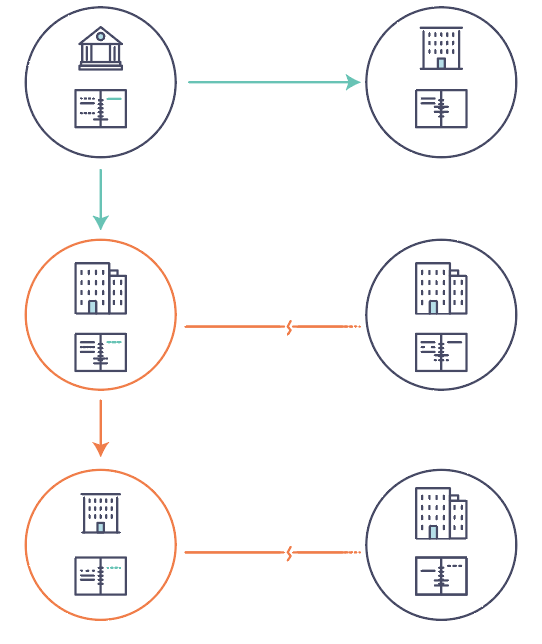

介绍
============
Hyperledger Fabric 是分布式账本解决方案的平台，采用模块化架构，提供高安全性、弹性、灵活性和可扩展性。它被设计为支持以可插拔方式实现不同组件，并适应复杂的经济生态系统。

我们建议新用户先浏览本文后面的内容，以熟悉区块链的工作方式以及 Hyperledger Fabric 的特性和组件。

当你熟悉区块链和 Hyperledger Fabric 后请转到 :doc:`getting_started` ，然后查看那里的示例、技术规范、API等。

什么是区块链？
---------------------
**一个分布式账本**

区块链网络的核心是一个分布式账本，记录网络上发生的所有交易。

区块链账本通常被描述为 **去中心化的** ，因为它会被复制到许多网络参与者中，每个参与者都在 **协作** 维护账本。我们将看到去中心化和协作是强大的属性，反映了企业在现实世界中交换商品和服务的方式。

.. image:: images/basic_network.png

除了分散和协作之外，信息仅能以附加的方式记录到区块链上，并使用加密技术保证一旦将交易添加到账本就无法修改。这种“不可修改”的属性简化了信息的溯源，因为参与者可以确定信息在记录后没有改变过。这就是为什么区块链有时被描述为 **证明系统** 。

**智能合约**

为了支持以同样的方式更新信息，并实现一整套账本功能（交易，查询等），区块链使用 **智能合约** 来提供对账本的受控访问。

.. image:: images/Smart_Contract.png

智能合约不仅是在网络中封装和简化信息的关键机制，它还可以被编写成自动执行参与者的特定交易的合约。

例如，可以编写智能合约以规定运输物品的成本，其中运费根据物品到达的速度而变化。根据双方同意并写入账本的条款，当收到物品时，相应的资金会自动转手。

**共识**

保持账本在整个网络中同步的过程称为 **共识** 。该过程确保账本仅在交易被相应参与者批准时更新，并且当账本更新时，它们以相同的顺序更新相同的交易。

.. image:: images/consensus.png

稍后您将学习更多关于账本，智能合约和共识的知识。目前，将区块链视为共享的复制交易系统就足够了，该系统通过智能合约进行更新，并通过称为共识的协作流程来保持一致。

为什么区块链有用？
---------------------------

**现在的记录系统**

现在的交易网络只不过是已存在的业务记录保存网络的升级版本。 **业务网络** 中的成员彼此交易，但他们分别维护各自的交易记录。他们所交易的东西，无论是16世纪的佛兰芒挂毯还是今天的证券，必须在每次出售时确定其来源，以确保出售物品的企业拥有的所有权。

你得到的是一个如下所示的商业网络：

现代技术已经从石碑和纸质文件夹演变为硬盘驱动器和云平台，但底层结构是相同的。因为没有管理网络参与者身份的统一系统，因而溯源非常费力，需要数天才能清理证券交易（其世界交易量以数万亿美元计算），合同必须手动签署和执行，而且系统中的每个数据库的信息都是孤立的，这也意味着单点故障。

即使可见性和信任的需求很明确，但在如今支离破碎的信息和流程共享方法下，不可能构建一个跨业务网络的记录系统。

**区块链的不同**

如果业务网络不是由“现代”交易系统代表的效率低下的老鼠窝（译者注：老鼠窝，指乱七八糟的系统），而是有一套在网络上建立身份，执行交易和存储数据的标准方法，那会怎么样？如果资产来源可以通过查看交易列表来确定，此列表一旦写入，无法更改，因此可信任，那会怎么样？

该业务网络看起来更像是这样的：

.. image:: images/future_net.png

这就是一个区块链网络，其中每个参与者都有自己的账本副本。除了共享账本信息之外，还共享更新账本的过程。与今天使用参与者的 **私人** 程序更新其 **私人** 账本的系统不同，区块链系统具有 **共享** 程序来更新 **共享** 账本。

利用共享账本协调其业务网络的能力，区块链网络可以减少与处理私人信息相关的时间、成本和风险，同时提高信任和可见性。

你现在已经知道区块链是什么，以及为什么它有用。还有许多其他重要的细节，但它们都与信息和流程共享的这些基本思想有关。

什么是Hyperledger Fabric？
---------------------------

Linux 基金会于2015年创建了 Hyperledger（超级账本）项目，以推进跨行业的区块链技术。它不是用来宣布一个区块链标准，而是鼓励通过社区流程开发区块链技术的协作方法，其中包括鼓励开放式开发、和随着时间的推移采用关键标准的知识产权。

Hyperledger Fabric 是 Hyperledger 中的区块链项目之一。与其他区块链技术一样，它有一个账本，使用智能合约，是一个参与者管理交易的系统。

Hyperledger Fabric 与其他区块链系统不同的地方是 **私有** 和 **许可** 。与允许未知身份参与网络的开放式非许可系统（需要诸如“工作量证明”之类的协议来验证交易并保护网络）不同，Hyperledger Fabric 网络的成员需要从可信赖的 **成员服务提供者（MSP）** 注册。

Hyperledger Fabric 还提供多种可插拔选项。账本数据可以以多种格式存储，共识机制可以交换替换，并且支持不同的MSP。

Hyperledger Fabric 还提供创建 **通道** 的功能，允许一组参与者创建各自的交易账本。对于某些网络而言，这是一个特别重要的选择。这些网络中，一些参与者可能是竞争对手，并且不希望他们做出的每笔交易都被每个参与者知晓，例如，他们只向某些参与者提供的特殊价格，而其他人不是。如果两个参与者组成一个通道，那么只有这两个参与者拥有该通道的账本副本，而其他参与者没有。

**共享账本**

Hyperledger Fabric 有一个账本子系统，包括两个组件： **世界状态** 和 **交易日志** 。每个参与者都拥有他们所属的每个 Hyperledger Fabric 网络的账本副本。

世界状态组件描述了在给定时间点的账本的状态。它是账本的数据库。交易日志组件记录产生世界状态中当前值的所有交易；这是世界状态的更新历史。然后，账本包括世界状态数据库和交易日志历史记录。

账本中世界状态的数据存储是可替换的。默认情况下，这是 LevelDB 键值存储数据库。交易日志不需要是可插拔的。它只记录区块链网络使用账本数据库前后的值。

**智能合约**

Hyperledger Fabric 智能合约用 **链码** 编写，当该应用程序需要与账本交互时，由区块链外部的应用程序调用。在大多数情况下，链码只与账本的数据库、世界状态（例如，查询）交互，而不与交易日志交互。

链码可以用几种编程语言实现。目前支持 Go 和 Node。

**隐私**

根据网络的需求，企业对企业（B2B）网络中的参与者可能对他们共享的信息量非常敏感。对于其他网络，隐私不是最受关注的问题。

Hyperledger Fabric 支持私有网络（使用通道）是很重要的，因为网络是相对开放的。

**共识**

交易必须按照发生的顺序写入账本，即使它们可能位于网络中不同的参与者集合之中。为此，必须建立交易的顺序，且必须采用一种方法来拒绝错误（或恶意）插入到账本中的非法交易。

这是一个彻底的计算机科学研究领域，且有很多方法可以实现它，每个方法都有不同的权衡。例如，PBFT（实用拜占庭容错算法）可以为文件副本提供一种机制，使其能够保持各个副本的一致性，即使在发生损坏的情况下也是如此。或者，在比特币中，通过称为挖矿的过程进行排序，其中竞争计算机竞相解决加密难题，该难题定义所有过程随后构建的顺序。

Hyperledger Fabric 被设计为允许网络启动者选择最能代表参与者间存在的关系的共识机制。与隐私一样，有一系列需求；从他们的关系高度结构化的网络，到更加点对点的网络。

.. Licensed under Creative Commons Attribution 4.0 International License
   https://creativecommons.org/licenses/by/4.0/
