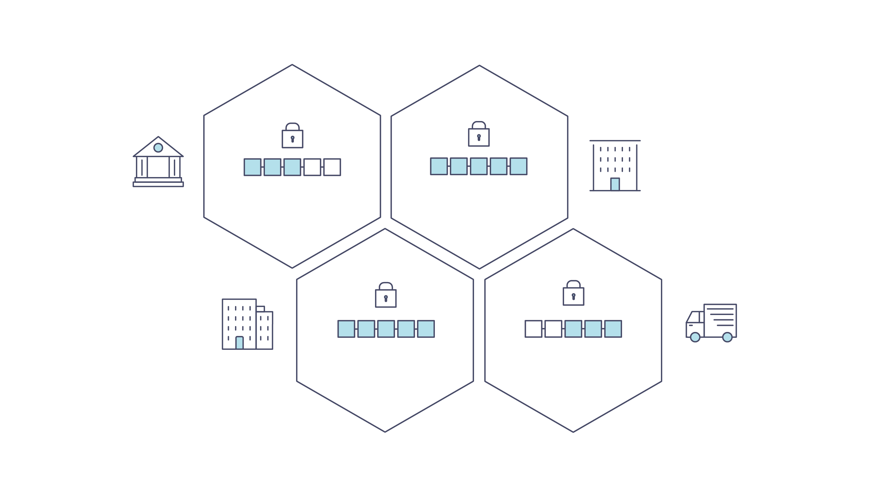

介绍
============
Hyperledger Fabric 是分布式账本解决方案的平台，采用模块化架构，提供高安全性、弹性、灵活性和可扩展性。它被设计为支持以可插拔方式实现不同组件，并适应复杂的经济生态系统。
Introduction
============
Hyperledger Fabric is a platform for distributed ledger solutions underpinned
by a modular architecture delivering high degrees of confidentiality,
resiliency, flexibility, and scalability. It is designed to support pluggable
implementations of different components and accommodate the complexity and
intricacies that exist across the economic ecosystem.

我们建议新用户先浏览本文后面的内容，以熟悉区块链的工作方式以及 Hyperledger Fabric 的特性和组件。

We recommend first-time users begin by going through the rest of the
introduction below in order to gain familiarity with how blockchains work
and with the specific features and components of Hyperledger Fabric.

当你熟悉区块链和 Hyperledger Fabric 后请转到 :doc:`getting_started` ，然后查看那里的示例、技术规范、API等。

Once comfortable --- or if you're already familiar with blockchain and
Hyperledger Fabric --- go to :doc:`getting_started` and from there explore the
demos, technical specifications, APIs, etc.

什么是区块链？
---------------------
**一个分布式账本**

What is a Blockchain?
---------------------
**A Distributed Ledger**

区块链网络的核心是一个分布式账本，记录网络上发生的所有交易。

At the heart of a blockchain network is a distributed ledger that records all
the transactions that take place on the network.

区块链账本通常被描述为 **去中心化的** ，因为它会被复制到许多网络参与者中，每个参与者都在 **协作** 维护账本。我们将看到去中心化和协作是强大的属性，反映了企业在现实世界中交换商品和服务的方式。

A blockchain ledger is often described as **decentralized** because it is replicated
across many network participants, each of whom **collaborate** in its maintenance.
We’ll see that decentralization and collaboration are powerful attributes that
mirror the way businesses exchange goods and services in the real world.

除了分散和协作之外，信息仅能以附加的方式记录到区块链上，并使用加密技术保证一旦将交易添加到账本就无法修改。这种“不可修改”的属性简化了信息的溯源，因为参与者可以确定信息在记录后没有改变过。这就是为什么区块链有时被描述为 **证明系统** 。

In addition to being decentralized and collaborative, the information recorded
to a blockchain is append-only, using cryptographic techniques that guarantee
that once a transaction has been added to the ledger it cannot be modified.
This property of "immutability" makes it simple to determine the provenance of
information because participants can be sure information has not been changed
after the fact. It’s why blockchains are sometimes described as **systems of proof**.

**智能合约**

**Smart Contracts**

为了支持以同样的方式更新信息，并启控制账本所有的功能（交易，查询等），区块链使用 **智能合约** 来提供对账本的受控访问。

To support the consistent update of information --- and to enable a whole host of
ledger functions (transacting, querying, etc) --- a blockchain network uses **smart
contracts** to provide controlled access to the ledger.

.. image:: images/Smart_Contract.png

智能合约不仅是在网络中封装和简化信息的关键机制，它还可以被编写成自动执行参与者的特定交易的合约。

Smart contracts are not only a key mechanism for encapsulating information
and keeping it simple across the network, they can also be written to allow
participants to execute certain aspects of transactions automatically.

例如，可以编写智能合约以规定运输物品的成本，其中运费根据物品到达的速度而变化。根据双方同意并写入账本的条款，当收到物品时，相应的资金会自动转手。

A smart contract can, for example, be written to stipulate the cost of shipping
an item where the shipping charge changes depending on how quickly the item arrives.
With the terms agreed to by both parties and written to the ledger,
the appropriate funds change hands automatically when the item is received.

**共识**

**Consensus**

保持账本在整个网络中同步的过程称为 **共识** 。该过程确保账本仅在交易被相应参与者批准时更新，并且当账本更新时，它们以相同的顺序更新相同的交易。

The process of keeping the ledger transactions synchronized across the network ---
to ensure that ledgers update only when transactions are approved by the appropriate
participants, and that when ledgers do update, they update with the
same transactions in the same order --- is called **consensus**.

.. image:: images/consensus.png

稍后您将学习更多关于账本，智能合约和共识的知识。目前，将区块链视为共享的复制交易系统就足够了，该系统通过智能合约进行更新，并通过称为共识的协作流程来保持一致。

You'll learn a lot more about ledgers, smart contracts and consensus later. For
now, it’s enough to think of a blockchain as a shared, replicated transaction
system which is updated via smart contracts and kept consistently
synchronized through a collaborative process called consensus.

为什么区块链有用？
---------------------------

Why is a Blockchain useful?
---------------------------

**现在的记录系统**

**Today’s Systems of Record**

现在的交易网络只不过是已存在的业务记录保存网络的升级版本。 **业务网络** 中的成员彼此交易，但他们分别维护各自的交易记录。他们所交易的东西，无论是16世纪的佛兰芒挂毯还是今天的证券，必须在每次出售时确定其来源，以确保出售物品的企业拥有的所有权。

The transactional networks of today are little more than slightly updated
versions of networks that have existed since business records have been kept.
The members of a **business network** transact with each other, but they maintain
separate records of their transactions. And the things they’re transacting ---
whether it’s Flemish tapestries in the 16th century or the securities of today
--- must have their provenance established each time they’re sold to ensure that
the business selling an item possesses a chain of title verifying their
ownership of it.

你得带的是一个如下所示的商业网络：

What you’re left with is a business network that looks like this:

.. image:: images/current_network.png

现代技术已经从石碑和纸质文件夹演变为硬盘驱动器和云平台，但底层结构是相同的。用于管理因为没有统一管理网络参与者身份的系统，因而溯源非常费力，需要数天才能清理证券交易（其世界数量以数万亿美元计算），合同必须手动签署和执行，而且系统中的每个数据库的信息都是唯一的，这也意味着单点故障。

Modern technology has taken this process from stone tablets and paper folders
to hard drives and cloud platforms, but the underlying structure is the same.
Unified systems for managing the identity of network participants do not exist,
establishing provenance is so laborious it takes days to clear securities
transactions (the world volume of which is numbered in the many trillions of
dollars), contracts must be signed and executed manually, and every database in
the system contains unique information and therefore represents a single point
of failure.

即使可见性和信任的需求很明确，在如今支离破碎的信息和流程共享方法下，也不可能构建一个跨业务网络的记录系统。

It’s impossible with today’s fractured approach to information and
process sharing to build a system of record that spans a business network, even
though the needs of visibility and trust are clear.

**区块链差异**

**The Blockchain Difference**

如果业务网络不是由“现代”交易系统代表的效率低下的老鼠窝（译者注：老鼠窝，指乱七八糟的系统），而是有一套在网络上建立身份，执行交易和存储数据的标准方法，那会怎么样？如果资产来源可以通过查看交易列表来确定，此列表一旦写入，无法更改，因此可信任，那会怎么样？

What if, instead of the rat’s nest of inefficiencies represented by the “modern”
system of transactions, business networks had standard methods for establishing
identity on the network, executing transactions, and storing data? What
if establishing the provenance of an asset could be determined by looking
through a list of transactions that, once written, cannot be changed, and can
therefore be trusted?

该业务网络看起来更像是这样的：

That business network would look more like this:

.. image:: images/future_net.png

这就是一个区块链网络，其中每个参与者都有自己的账本副本。除了共享账本信息之外，还共享更新账本的过程。与今天使用参与者的 **私人** 程序更新其 **私人** 账本的系统不同，区块链系统具有 **共享** 程序来更新 **共享** 账本。

This is a blockchain network, wherein every participant has their own replicated
copy of the ledger. In addition to ledger information being shared, the processes
which update the ledger are also shared. Unlike today’s systems, where a
participant’s **private** programs are used to update their **private** ledgers,
a blockchain system has **shared** programs to update **shared** ledgers.

利用共享账本协调其业务网络的能力，区块链网络可以减少与处理私人信息相关的时间、成本和风险，同时提高信任和可见性。

With the ability to coordinate their business network through a shared ledger,
blockchain networks can reduce the time, cost, and risk associated with private
information and processing while improving trust and visibility.

你现在已经知道区块链是什么，以及为什么它有用。还有许多其他重要的细节，但它们都与信息和流程共享的这些基本思想有关。

You now know what blockchain is and why it’s useful. There are a lot of other
details that are important, but they all relate to these fundamental ideas of
the sharing of information and processes.

什么是Hyperledger Fabric？
---------------------------

What is Hyperledger Fabric?
---------------------------

Linux基金会于2015年创建了 Hyperledger（超级账本）项目，以推进跨行业的区块链技术。它不是用来宣布一个区块链标准，而是鼓励通过社区流程协作开发区块链技术的方法，其中包括鼓励开放式开发、和随着时间的推移采用关键标准的知识产权。

The Linux Foundation founded the Hyperledger project in 2015 to advance
cross-industry blockchain technologies. Rather than declaring a single
blockchain standard, it encourages a collaborative approach to developing
blockchain technologies via a community process, with intellectual property
rights that encourage open development and the adoption of key standards over
time.

Hyperledger Fabric 是 Hyperledger 中的区块链项目之一。与其他区块链技术一样，它有一个账本，使用智能合约，是一个参与者管理交易的系统。

Hyperledger Fabric is one of the blockchain projects within Hyperledger.
Like other blockchain technologies, it has a ledger, uses smart contracts,
and is a system by which participants manage their transactions.

Hyperledger Fabric 与其他区块链系统不同的地方是 **私有** 和 **许可** 。与允许未知身份参与网络的开放式非许可系统（需要诸如“工作量证明”之类的协议来验证交易并保护网络）不同，Hyperledger Fabric 网络的成员需要从可信赖的 **成员服务提供者（MSP）** 注册。

Where Hyperledger Fabric breaks from some other blockchain systems is that
it is **private** and **permissioned**. Rather than an open permissionless system
that allows unknown identities to participate in the network (requiring protocols
like "proof of work" to validate transactions and secure the network), the members
of a Hyperledger Fabric network enroll through a trusted **Membership Service Provider (MSP)**.

Hyperledger Fabric 还提供多种可插拔选项。账本数据可以以多种格式存储，共识机制可以交换替换，并且支持不同的MSP。

Hyperledger Fabric also offers several pluggable options. Ledger data can be
stored in multiple formats, consensus mechanisms can be swapped in and out,
and different MSPs are supported.

Hyperledger Fabric 还提供创建 **通道** 的功能，允许一组参与者创建各自的交易账本。对于某些网络而言，这是一个特别重要的选择。这些网络中，一些参与者可能是竞争对手，并且不希望他们做出的每笔交易都被每个参与者知晓，例如，他们只向某些参与者提供的特殊价格，而其他人不是。如果两个参与者组成一个通道，那么只有这两个参与者拥有该通道的账本副本，而其他参与者没有。

Hyperledger Fabric also offers the ability to create **channels**, allowing a group of
participants to create a separate ledger of transactions. This is an especially
important option for networks where some participants might be competitors and not
want every transaction they make --- a special price they're offering to some participants
and not others, for example --- known to every participant. If two participants
form a channel, then those participants --- and no others --- have copies of the ledger
for that channel.

**共享账本**

**Shared Ledger**

Hyperledger Fabric 有一个账本子系统，包括两个组件： **世界状态** 和 **交易日志** 。每个参与者都拥有他们所属的每个 Hyperledger Fabric 网络的账本副本。

Hyperledger Fabric has a ledger subsystem comprising two components: the **world
state** and the **transaction log**. Each participant has a copy of the ledger to
every Hyperledger Fabric network they belong to.

世界状态组件描述了在给定时间点的账本的状态。它是账本的数据库。交易日志组件记录产生世界状态中当前值的所有交易；这是世界状态的更新历史。然后，账本包括世界状态数据库和交易日志历史记录。

The world state component describes the state of the ledger at a given point
in time. It’s the database of the ledger. The transaction log component records
all transactions which have resulted in the current value of the world state;
it’s the update history for the world state. The ledger, then, is a combination
of the world state database and the transaction log history.

账本世界状态的数据存储是可替换的。默认情况下，这是 LevelDB 键值存储数据库。交易日志不需要是可插拔的。它只记录区块链网络使用的账本数据库前后的值。

The ledger has a replaceable data store for the world state. By default, this
is a LevelDB key-value store database. The transaction log does not need to be
pluggable. It simply records the before and after values of the ledger database
being used by the blockchain network.

**智能合约**

**Smart Contracts**

Hyperledger Fabric 智能合约用 **链码** 编写，当该应用程序需要与账本交互时，由区块链外部的应用程序调用。在大多数情况下，链码只与账本的数据库、世界状态（例如，查询）交互，而不与交易日志交互。

Hyperledger Fabric smart contracts are written in **chaincode** and are invoked
by an application external to the blockchain when that application needs to
interact with the ledger. In most cases, chaincode interacts only with the
database component of the ledger, the world state (querying it, for example), and
not the transaction log.

链码可以用几种编程语言实现。目前支持 Go 和 Node。

Chaincode can be implemented in several programming languages. Currently, Go and
Node are supported.

**隐私**

**Privacy**

根据网络的需求，企业对企业（B2B）网络中的参与者可能对他们共享的信息量非常敏感。对于其他网络，隐私不是最受关注的问题。

Depending on the needs of a network, participants in a Business-to-Business
(B2B) network might be extremely sensitive about how much information they share.
For other networks, privacy will not be a top concern.

Hyperledger Fabric 支持私有网络（使用通道）是很重要的，因为网络是相对开放的。

Hyperledger Fabric supports networks where privacy (using channels) is a key
operational requirement as well as networks that are comparatively open.

**共识**

**Consensus**

交易必须按照发生的顺序写入账本，即使它们可能位于网络中不同的参与者集合之中。为此，必须建立交易的顺序，且必须采用一种方法来拒绝错误（或恶意）插入到账本中的非法交易。

Transactions must be written to the ledger in the order in which they occur,
even though they might be between different sets of participants within the
network. For this to happen, the order of transactions must be established
and a method for rejecting bad transactions that have been inserted into the
ledger in error (or maliciously) must be put into place.

这是一个彻底的计算机科学研究领域，且有很多方法可以实现它，每个方法都有不同的权衡。例如，PBFT（实用拜占庭容错算法）可以为文件副本提供一种机制，使其能够保持各个副本的一致性，即使在发生损坏的情况下也是如此。或者，在比特币中，通过称为挖矿的过程进行排序，其中竞争计算机竞相解决加密难题，该难题定义所有过程随后构建的顺序。

This is a thoroughly researched area of computer science, and there are many
ways to achieve it, each with different trade-offs. For example, PBFT (Practical
Byzantine Fault Tolerance) can provide a mechanism for file replicas to
communicate with each other to keep each copy consistent, even in the event
of corruption. Alternatively, in Bitcoin, ordering happens through a process
called mining where competing computers race to solve a cryptographic puzzle
which defines the order that all processes subsequently build upon.

Hyperledger Fabric 被设计为允许网络启动者选择最能代表参与者间存在的关系的共识机制。与隐私一样，有一系列需求；从在他们的关系中高度结构化的网络，到更加点对点的网络。

Hyperledger Fabric has been designed to allow network starters to choose a
consensus mechanism that best represents the relationships that exist between
participants. As with privacy, there is a spectrum of needs; from networks
that are highly structured in their relationships to those that are more
peer-to-peer.

我们将了解有关 Hyperledger Fabric 共识机制的更多信息，Hyperledger Fabric 的共识机制目前包括 Solo、Kafka 和 Raft。

我在哪了解更多？
-----------------------

* `身份 <identity/identity.html>`_ (概念文档)

将带您了解网络中的关键角色身份（使用已建立的PKI结构和x.509证书）。

* `成员 <membership/membership.html>`_ (概念文档)

带您了解将身份转换为 Fabric 网络中的角色的成员服务提供商（MSP）。

* `节点 <peers/peers.html>`_ (概念文档)

节点，组织所有的托管账本和智能合约，构成 Fabric 网络的物理结构。

* :doc:`build_network` (教程)

了解如何使用示例脚本下载 Fabric 二进制文件并启动您自己的示例网络。然后拆解网络，了解它是如何一步一步构建的。

* :doc:`write_first_app` (教程)

部署一个非常简单的网络（甚至比构建您的第一个网络更简单）与简单的智能合约和应用程序一起使用。

* :doc:`txflow`

以宏观视角来查看示例交易流。

* :doc:`fabric_model`

以宏观视角来查看本章介绍的和其他的一些组件和概念，并介绍了它们如何在示例交易流中协同工作。
