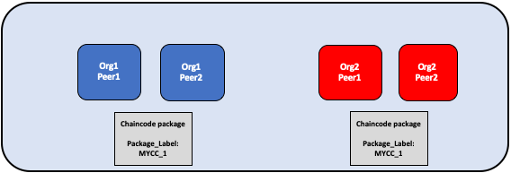
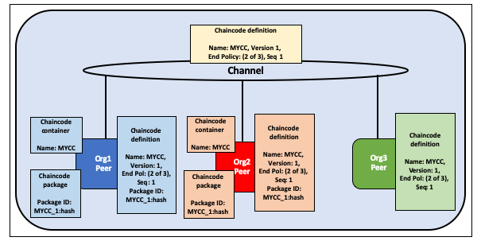

# Fabric 链码生命周期

## 什么是链码？

链码是一段用 [Go](https://golang.org)、[Node.js](https://nodejs.org) 或者 [Java](https://java.com/en/) 写的实现了规定接口的程序。链码运行在一个隔离于背书 peer 节点进程的安全的 Docker 容器中。链码通过应用提交的交易来初始化以及管理账本状态。

链码通常用来处理网络中成员共同接受的业务逻辑，所以它可以被认为是“智能合约”。通过链码创建的账本更新只适用于该链码，并且不能直接被另一个链码访问到。然而在同一个网络中，在被授予适当权限的情况下，链码可以调用另一个链码来访问它的状态。

在这个概念主题下，我们将会以一个区块链网络操作者而不是应用开发者的视角来探索链码。链码操作者可以用本文作为在网络上使用 Fabric 链码生命周期来部署和管理链码的指南。

## 部署一个链码

Fabric 链码生命周期是一个过程，它允许多个组织在使用一个链码之前就如何操作达成一致。网络操作者可以使用 Fabric 生命周期来展开以下的任务：

- [安装和定义链码](#install-and-define-a-chaincode)
- [升级链码](#upgrade-a-chaincode)
- [部署场景](#deployment-scenarios)
- [迁移到新的 Fabric 生命周期](#migrate-to-the-new-fabric-lifecycle)

你可以通过创建一个通道并设置其 capabilities 为 V2_0 来使用 Fabric 链码生命周期。在 capabilities 为 V2_0 的通道上，你将不能使用旧的生命周期来安装、初始化或升级链码。然而，在启动 V2_0 后，你仍然可以调用用之前生命周期模式安装的链码。如果你从 v1.4.x 网络基础上升级并且需要启动新的生命周期，查看 [启用新的链码生命周期](./enable_cc_lifecycle.html)。

## 安装以及定义链码

Fabric 链码生命周期需要组织同意定义一个链码的参数，比如说名称、版本以及链码背书策略。通道成员通过以下四步达成共识。不是通道上的每一个组织都需要完成每一步。

1、**打包链码：** 这一步可以被一个或者每一个组织完成。

2、**安装链码在你的 peer 节点上：** 每一个用链码的组织需要完成这一步。

3、**为你的组织批准链码定义：** 使用链码的每一个组织需要完成这一步。链码能够在通道上运行之前，链码定义需要被足够多的组织批准来满足通道的生命周期背书（LifecycleEndorsement）策略（默认为大多数组织）。

4、**提交链码定义到链上：** 一旦通道上所需数量的组织已经同意，提交交易需要被提交。提交者首先从已同意组织中的足够的 peer 节点中收集背书，然后通过提交交易来提交链码声明。

本文提供了操作 Fabric 链码生命周期的细节概述而不是特定的指令。学习更多关于如何通过 Peer CLI 工具来使用 Fabric 生命周期，查看 [部署智能合约到通道上的教程](deploy_chaincode.html) 或者 [peer 生命周期指令参考](commands/peerlifecycle.html).

### 步骤一：打包智能合约

在被安装到 peer 节点之前，链码需要被打包进一个 tar 文件。你可以使用 Fabric Peer 二进制可执行文件、Node Fabric SDK、或者第三方工具例如 GNU tar 来打包链码。当你创建一个链码包的时候，你需要提交一个用来创建简明易读的包描述的链码包标签。

如果你使用第三方工具来打包链码，结果文件（译者注：打包生成的文件）需要为以下格式。Fabric peer 的二进制可执行文件和 Fabric SDKs 将会自动以这个格式来创建文件。
- 链码需要被打包进一个以 `.tar.gz` 文件扩展名结尾的 tar 文件。
- tar 文件需要包含两个文件（没有目录）：“metadata.json”和另一个包含了链码文件的 tar 文件“code.tar.gz”。
- “metadata.json”包含了指定链码语言、代码路径、以及包标签的 JSON 文件。以下，你可以看到一个元数据文件：
  ```
  {"Path":"fabric-samples/chaincode/fabcar/go","Type":"golang","Label":"fabcarv1"}
  ```



*链码分别被 Org1 和 Org2 打包。为了使用名字和版本来识别包，两个组织都使用 MYCC_1 作为包标签。对于多个组织来说使用相同的包标签没有必要。*

### 步骤二：在你的 peers 节点上安装链码
  
你需要在每个要执行和背书交易的peer节点上安装链码包。无论使用 CLI 或者是 SDK，你需要以 **Peer Administrator** （译者注：peer 所在组织的管理员） 的身份来完成这步。链码安装后，你的 peer 节点会构建链码，并且如果你的链码有问题，会返回一个构建错误。建议每个组织只打包链码一次，然后安装相同的包在属于他们组织的每一个 peer 节点上。如果某个通道希望确保每个组织都运行同样的链码，某一个组织可以打包链码并通过带外数据（译者注：不通过链上）把它发送给其他通道成员.

通过指令成功安装链码后会返回链码包标识符，它是包标签和包哈希值的结合。这个包标识符用来关联安装在你的 peer 节点上的链码包已被批准的链码。为下一步的操作**保存这个标识符**。你也可以通过使用 Peer CLI 工具查询安装在 peer节点上的包来查看包标识符。

  

*Org1 和 Org2 的管理员安装链码 MYCC_1 到加入通道的 peer 节点上。安装链码包构建了链码并且创建了包标识符 MYCC_1:hash。*

### 步骤三：为你的组织批准链码定义

通过 **链码定义** 来管理链码。当通道成员批准一个链码定义，这个批准便作为一个组织在接受链码参数方面的投票。这些同意的组织定义允许通道成员在链码可以在通道上使用之前达成一致意见（译者注：同意链码运行在此通道上）。链码定义包含了以下需要持续在组织之间保持一致的参数：

- **名称：** 应用调用链码时使用的名称。
- **版本：** 一个版本号或者和给定链码包关联的值。如果你升级链码二进制文件（译者注：打包后的链码文件），你也需要改变你的链码版本。
- **序列号：** 链码被定义的次数。这个值是一个整数，并且被用来追踪链码的更新次数。例如当你第一次安装并且同意一个链码定义，这个序列号会是1。当你下一次更新链码，序列号会是2。
- **背书策略：** 哪些组织需要执行并且验证交易输出。背书策略可以表达为传递给 CLI 工具的字符串或者它能参考通道配置中的一个策略。默认情况下，背书策略设置为 ``Channel/Application/Endorsement``，默认通道中大多数组织为一笔交易背书。
- **集合配置（译者注：私有数据集合配置）：** 和你链码相关的私有数据集合定义文件的路径。了解更多关于私有数据集合的信息，查看 [私有数据架构参考](https://hyperledger-fabric.readthedocs.io/en/{BRANCH}/private-data-arch.html)。
- **ESCC/VSCC 插件：** 这个链码使用的定制的背书或者验证插件名称。
- **初始化：** 如果你使用 Fabric Chaincode Shim API 提供的低级别的 API，你的链码需要包含用来初始化链码的 `Init` 方法。链码接口需要这个方法，但不必要被你的应用调用。 当你批准一个链码定义时，你可以指定是否 `Init` 方法必须在调用（译者注：调用非 init 方法）之前被执行。如果你指定需要 `Init`，Fabric 会确保`Init` 方法在链码中的其他方法之前被调用，并且只会被调用一次。 请求执行 `Init` 方法允许你实现链码初始化时运行的逻辑，例如设置一些初始状态。每次你的链码版本更新，你都需要调用 `Init` 来初始化链码，假定链码定义增加了版本号意味着 `Init` 是需要的。

  如果你正在使用 Fabric peer CLI 工具，当你同意提交链码定义时候，你可以使用 `--init-required` 变量来表示 `Init` 方法必须被调用来初始化新的链码版本。用 Fabric peer CLI 工具调用 `Init` 方法时，需要使用 `peer chaincode invoke` 指令来传 `--isInit` 变量。

  如果你使用 Fabric 合约 API，你不需要把 `Init` 方法包含进你的链码。然而，你仍然可以使用 `--init-required` 变量发起从应用调用来初始化链码的请求。如果你使用 `--init-required` 变量，为了每次初始化链码时增加链码的版本号，你需要传 `--isInit` 变量或者参数给链码调用。你可以用链码中的任何方法结合传 `--isInit` 变量来初始化链码。

链码定义也包括 **Package Identifier**。对每个希望使用链码的组织来说，这是个必须的参数。对于每个组织来说包 ID 不需要一致。一个组织可以在不安装链码包或者定义中不包含 identifier 的情况下，批准链码定义。

每个希望使用链码的通道成员需要为他们的组织批准链码定义。这个批准操作需要提交给排序服务，在此之后会分发给所有的 peer 节点。这个批准操作需要被你的 **Organization Administrator** 提交。在批准交易被成功提交后，同意的定义存储在你的组织中所有 peer 节点都可访问到的集合中。结果是，尽管你有多个 peer 节点，你只需要为你的组织同意一个链码一次。

  

*Org1 和 Org2 的组织管理员为他们的组织批准 MYCC 链码定义。链码定义的其他字段包括链码名称、版本号和背书策略。因为两个组织都会用链码来背书交易，所以两个组织同意的定义都需要 packageID。*

### 步骤四：提交链码定义到通道

一旦足够多的通道成员同意一个链码定义，某个组织能够提交定义到通道。你可以用 checkcommitreadiness 命令在使用 Peer CLI 工具将链码定义提交到通道之前，基于哪个通道成员已经批准了该定义，来检查提交链码定义是否应该成功。（译者注：根据通道成员同意的状况，来判断提交是否可能成功）。提交交易请求首先发送给通道成员的 peer 节点，peer 节点会查询链码定义被他们组织同意的状况，并且为定义背书如果所在组织已经同意了。交易然后提交给排序服务，排序服务会把链码定义提交给通道。提交定义交易需要以 **Organization** **Administrator** 身份来提交。

链码在被成功提交到通道之前，需要被同意的组织的数量是通过 ``Channel/Application/LifecycleEndorsement`` 策略来管理的。默认情况下，这个策略需要通道中大多数的组织来给交易背书。生命周期背书策略不同于链码背书策略。例如，尽管一个链码背书策略只需要一个或两个组织的签名，根据默认策略大多数的通道成员仍然需要批准链码定义。当提交一个通道定义，你需要面向足够多的 peer 组织，以确保你的生命周期背书策略被满足。你可以在 [策略概念主题](policies/policies.html) 中了解到更多关于 Fabric 链码生命周期策略。

你也可以设置 ``Channel/Application/LifecycleEndorsement`` 策略为一个签名策略并且明确指明通道上可以批准链码定义的组织集合。这允许你创建一个其中大多数组织作为链码管理者并且治理通道业务逻辑的通道。如果你的通道有大量的 Idemix（译者注：身份混合，实现零知识证明）组织，你也可以用一个签名策略（译者注：策略只需要一个签名），因为这些组织不能批准链码定义或者为链码背书并且可能阻碍通道达成大多数成员同意的结果。

  

*Org1 或 Org2 的一个组织管理员提交链码定义到通道。通道上的定义不包含 packageID。*

一个组织在不安装链码包的条件下能够批准链码定义。如果一个组织不需要使用链码，他们可以在没有包身份的情况下批准一个链码定义来确保生命周期背书策略被满足。

在链码定义已经提交到通道上后，链码容器会在所有的链码安装到的 peer 节点上启动，来允许通道成员开始使用链码。可能会花费几分钟的时间来启动链码容器。你可以用链码定义来要求调用 ``Init`` 方法初始化链码。如果 ``Init`` 方法调用是需要的，链码的第一个调用必须是调用 ``Init`` 方法。``Init`` 方法的调用服从于链码的背书策略。

  

*一旦 MYCC 链码在通道上定义，Org1 和 Org2 能开始使用链码。每个 peer 节点上的链码的第一个调用会启动该 peer 上的链码容器。*  

## 升级链码

你可以用相同的 Fabric 生命周期流程（译者注：和部署链码的生命周期相同）来升级一个链码。你可以升级链码二进制文件或者只升级链码策略。根据以下步骤来升级一个合约：

1、**重新打包链码：** 如果你升级二进制文件，你只需要完成这一步。

  

   *Org1 和 Org2 升级链码二进制并且重新打包链码。两个组织都用不同的包标签。*  

2、**在你的 peer 节点上安装新的链码包：** 再次复述，如果你正在升级链码二进制文件你只需要完成这一步。安装新的链码包会生成一个包 ID，你需要把它传给新的链码定义。如果链码二进制文件升级了，你也需要修改链码版本，版本会被生命周期流程追踪。

  

   *Org1和Org2在他们的 peer 节点上安装新链码包。安装会生成一个新的 packageID。*  

3、 **批准一个新的链码定义：** 如果你正在升级链码二进制文件，你需要在链码定义中升级链码版本和包 ID。你也可以在不打包你的链码二进制文件情况下升级链码背书策略。通道成员只需要在新的策略中批准一个定义。新的定义需要在定义中把 **sequence**（译者注：序列号） 变量的值加一。

  

   *Org1 或者 Org2 的组织管理员为他们相关的组织批准新的链码定义。新的定义引用新的 packageID 并且改变链码版本。因为这是第一次升级链码，序列号从1增加到2。*

4、 **提交定义到通道：** 当足够多的通道成员批准新的链码定义，某个组织可以提交新的定义来升级通道上的链码定义。没有单独的升级指令作为生命周期流程的某部分。

  

   *Org1 或者 Org2 的一个组织的管理员提交新的链码定义到通道上。*  

你提交链码定义后，一个新的包含升级后的链码二进制文件的链码容器会启动。如果你在链码定义中请求执行 ``Init`` 方法，你需要在成功提交新的定义后再次调用 ``Init`` 方法来初始化升级过的链码。如果你升级没有改变链码的版本号，链码容器会保持一致并且你不需要调用``Init`` 方法。

  

 *一旦新的定义提交到链上，每个 peer 节点会自动启动新的链码容器。*

Fabric 链码生命周期在链码定义中使用 **sequence** （译者注：序列号）来跟踪升级。所有的通道成员需要把序列号加一并且同意新的定义来升级链码。版本参数用来追踪链码二进制文件，并且只需要当你升级链码二进制时改变。

## 部署场景

以下的例子描述了你如何才能使用 Fabric 链码生命周期来管理通道和链码。

### 加入通道

一个新的组织可以在链码已经定义的情况下加入通道，并且在安装完链码包和批准已经提交到通道的链码定义后，开始使用链码。
  
  

*Org3 加入通道并且批准之前已经被 Org1 和 Org2 提交到通道的相同链码定义。*

在批准链码定义后，新的组织会在包安装到它们的 peer 节点上之后，开始使用链码包。定义不需要再次被提交。如果背书策略设置为默认需要大多数通道成员背书的策略，然后背书策略会自动更新为把新的组织也包括进去。

  

*链码容器会在 Org3 的 peer 节点上调用后启动。*

### 升级背书策略

你可以在不重新打包或者重新安装链码的情况下使用链码定义来更新背书策略。通道成员可以用新的背书策略批准一个链码定义并且提交到链上。

  

*Org1、Org2 和 Org3 同意一个新的需要三个组织背书交易的背书策略。它们把定义序列号从1增加到2，但是不需要更新链码版本。*

新的背书策略会在新的定义提交到通道上后奏效。通道成员不需要为了更新背书策略而通过调用链码或者执行 `Init` 方法来重新启动链码容器。

  

*组织提交新的链码定义到通道上来更新背书策略。*

### 不安装链码的情况下批准定义

你可以在不安装链码包的情况下批准一个链码定义。甚至尽管你不希望使用链码来背书交易或者查询账本，你还是被允许在链码提交到通道上之前为链码定义背书。你需要批准其他通道成员相同的参数，但不需要把 packageID 包含为链码定义的一部分。

  

*Org3 不需要安装链码包。结果是，他们不需要提供 packageID 来作为链码定义的一部分。然而，Org3 仍然可以背书已经提交到通道上的 MYCC 链码的定义。*

### 一个组织不同意链码定义

不批准已经提交到通道上的链码定义的组织不能使用链码。没有批准链码定义或者批准了不同的链码定义的组织不能在他们的 peer 节点上执行合约。

  

*Org3 批准了一个和 Org1、Org2 不同的背书策略。结果是，Org3 不能在通道上使用 MYCC 链码。然而，Org1 或者 Org2 仍然能得到足够的背书来提交定义到通道上并且使用链码。链码的交易仍然能被添加到账本上并且保存到 Org3 的 peer 节点上。然而，Org3 不能背书交易。*

一个组织可以用任何序列号或者版本号批准一个新的链码定义。这允许你批准已经提交到通道上的定义并且开始使用链码。你也可以为了纠正在批准和打包链码过程中犯得错误，而批准一个新的链码定义。

### 通道不同意链码定义

如果通道上的组织不同意一个链码定义，定义不能被提交到通道上。没有通道成员能用链码。

  

*Org1、Org2 和 Org3 都批准不同的链码定义。结果是，没有通道成员能得到足够的背书来提交链码定义到通道上。没有通道成员能使用链码。*

### 组织安装不同的链码包

当它们批准一个链码定义时，每个组织能用不同的 packageID。这允许通道成员能安装不同的具备相同背书策略并且在相同的链码域名中读写数据的链码二进制文件。

组织可以使用这个功能来安装包含特定组织业务逻辑的智能合约。每个组织的智能合约可能包含额外的在它们的 peer 节点背书交易之前的验证。每个组织也能写用它们已有系统中的数据来帮助整合智能合约的代码。

  

*Org1 和 Org2 分别安装的 MYCC 链码版本包含了它们组织特定的业务逻辑。*

### 用一个包安装多套链码

通过批准和提交多套链码定义的方式，你可以用一个链码包创建在一个通道上的多套链码实例。每个定义需要指定一个不同的链码名称。允许你在一个通道上运行多套智能合约实例，但让合约服从于不同的背书策略。

  

*Org1 和 Org2 用 MYCC_1 链码包来批准和提交两个不同的链码定义。结果是，两个 peer 节点都有两个链码容器运行在他们的 peer 节点上。 MYCC1 具备1/2的背书策略（译者注：2个组织中需要有1个背书），而 MYCC2 有一个2/2的背书策略（译者注：2个组织都必须背书）。*

## 迁移到新的 Fabric 生命周期

关于迁移到新的生命周期的信息，查看 [升级到2.0版本的注意事项](./upgrade_to_newest_version.html#chaincode-lifecycle)。

如果你需要升级你的通道配置来启动新的生命周期，查看 [启动新的链码生命周期](./enable_cc_lifecycle.html).

## 更多信息

你可以观看以下视频来学习更多关于 Fabric 链码生命周期的动机以及它是如何实现的。

<iframe class="embed-responsive-item" id="youtubeplayer2" title="Starter Plan videos" type="text/html" width="560" height="315" src="https://www.youtube.com/embed/XvEMDScFU2M" frameborder="0" webkitallowfullscreen mozallowfullscreen allowfullscreen> </iframe>

<!--- Licensed under Creative Commons Attribution 4.0 International License
https://creativecommons.org/licenses/by/4.0/ -->
