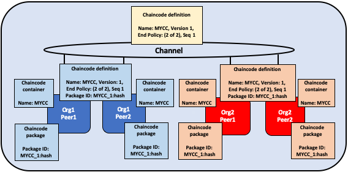

# Fabric 链码生命周期

## 什么链码？

链码是一段用 [Go](https://golang.org)、[Node.js](https://nodejs.org) 或者 [Java](https://java.com/en/) 实现了规定接口的程序。链码在安全的Docker容器中运行，与背书节点的进程隔离。通过应用程序提交的交易，链码初始化和管理账本状态。

链码通常处理网络成员协商达成的业务逻辑，因此可以被视为"智能合约"。由链码创建的账本更新仅限于该链码的范围，其他链码无法直接访问。然而，在同一个网络中，如果具有适当的权限，一个链码可以调用另一个链码来访问其状态。

在这个概念主题中，我们将从区块链网络运营者的角度来探讨链码，而不是应用程序开发者。链码运营者可以将本主题作为指南，了解如何使用Fabric链码生命周期在其网络上部署和管理链码。

## 部署链码

Fabric 链码生命周期是一个过程，它允许多个组织在使用一个链码之前就如何操作来达成一致。网络操作者可以使用 Fabric 生命周期来展开以下的任务：

- [安装和定义链码](#install-and-define-a-chaincode)
- [升级链码](#upgrade-a-chaincode)
- [部署场景](#deployment-scenarios)
- [迁移到新的 Fabric 生命周期](#migrate-to-the-new-fabric-lifecycle)

你可以通过创建一个新通道并将通道能力设置为V2_0来使用Fabric链码生命周期。在启用V2_0能力的通道上，你将无法使用旧的生命周期模型来安装、实例化或更新链码。然而，在启用V2_0能力后，你仍然可以调用使用先前生命周期模型安装的链码。如果你正在从v1.4.x网络升级，并需要编辑通道配置以启用新的生命周期，请查阅 [启用新的链码生命周期](./enable_cc_lifecycle.html)。

## 安装以及定义链码

Fabric 链码生命周期需要组织同意一些参数来定义一个链码，比如说名称、版本以及链码背书策略。通道成员通过以下四步达成共识。并非通道上的每个组织都需要完成每个步骤。

1、**打包链码：** 这一步可以被一个或者每个组织完成。

2、**在你的对等节点上安装链码：** 每个将使用链码对交易进行背书或查询账本的组织都需要完成这一步骤。

3、**为你的组织批准链码定义：** 使用链码的每一个组织需要完成这一步。链码能够在通道上运行之前，链码定义需要被足够多的组织批准来满足通道的生命周期背书（LifecycleEndorsement）策略（默认为大多数组织）。

4、**提交链码定义到通道上：** 每个将使用链码的组织都需要完成这一步骤。在链码可以在通道上启动之前，需要有足够数量的组织批准链码定义，以满足通道的LifecycleEndorsement策略（默认情况下是多数批准）。

本文提供了操作 Fabric 链码生命周期的细节概述而不是特定的指令。学习更多关于如何通过 Peer CLI 工具来使用 Fabric 生命周期，查看 [部署智能合约到通道上的教程](deploy_chaincode.html) 或者 [peer 生命周期指令参考](commands/peerlifecycle.html).

### 步骤一：打包智能合约

在被安装到 peer 节点之前，链码需要被打包进一个 tar 文件。你可以使用 Fabric Peer 二进制可执行文件、Node Fabric SDK、或者第三方工具例如 GNU tar 来打包链码。在创建链码包时，你需要提供一个链码包标签，以创建一个简洁且易于阅读的描述.

如果你使用第三方工具来打包链码，结果文件（译者注：打包生成的文件）需要为以下格式。Fabric peer 的二进制可执行文件和 Fabric SDKs 将会自动以这个格式来创建文件。
- 链码需要被打包进一个以 `.tar.gz` 文件扩展名结尾的 tar 文件。
- tar 文件需要包含两个文件（没有目录）：“metadata.json”和另一个包含了链码文件的 tar 文件“code.tar.gz”。
- “metadata.json”包含了指定链码语言、代码路径、以及包标签的 JSON 文件。以下，你可以看到一个元数据文件：
  ```
  {"Path":"fabric-samples/chaincode/fabcar/go","Type":"golang","Label":"fabcarv1"}
  ```


*链码分别被 Org1 和 Org2 打包。为了使用名字和版本来识别包，两个组织都使用 MYCC_1 作为包标签。对于多个组织来说使用相同的包标签没有必要。*

### 步骤二：在你的对等节点上安装链码
  
你需要在每个要执行和背书交易的对等节点上安装链码包。无论使用 CLI 或者是 SDK，你需要以 **Peer Administrator** （译者注：peer 所在组织的管理员） 的身份来完成这步。链码安装后，你的对等节点会构建链码，并且如果你的链码有问题，会返回一个构建错误。建议每个组织只打包链码一次，然后在属于他们组织的每一个 peer 节点上安装相同的包。如果某个通道希望确保每个组织都运行同样的链码，某一个组织可以打包链码并通过其他链把它发送给其他通道成员.

成功的安装命令将返回一个链码包标识符，该标识符是包标签与包的哈希值的组合。该包标识符用于将安装在您的对等节点上的链码包与您的组织批准的链码定义关联起来。**保存该标识符**以备下一步使用。您还可以使用Peer CLI查询安装在您的对等节点上的包来找到包标识符。

  

*Org1 和 Org2 的管理员安装链码 MYCC_1 到加入通道的 peer 节点上。安装链码包构建了链码并且创建了包标识符 MYCC_1:hash。*

### 步骤三：为你的组织批准链码定义

链码受到**链码定义**的管理。当通道成员批准链码定义时，这个批准就像组织对其接受的链码参数进行投票一样。这些已批准的组织定义允许通道成员在链码在通道上使用之前就链码达成共识。链码定义包含了以下需要一直在组织之间保持一致的参数：

- **名称：** 应用调用链码时使用的名称。
- **版本：** 版本号是与特定链码包关联的一个版本号或值。如果升级了链码二进制文件，还需要相应地更改链码版本。版本号可以包含任何字符，但通常使用类似于`v1.2.3`的格式。版本号不会被对等节点检查，它仅仅是一个指示符，旨在帮助组织在更新链码逻辑时进行协调。
- **序列号：** 链码在通道上定义的次数。该值是一个整数，用于跟踪链码的升级。例如，当在通道上首次批准和提交链码定义时，序列号必须设置为1。当下次升级链码或更新链码定义时，将序列号增加到2。序列号由对等节点使用，以确保所有组织在批准和提交的链码定义方面保持同步。
- **背书策略：** 组织用来执行和验证交易输出。背书策略可以作为一个字符串传递给CLI，或者可以引用通道配置中的策略。默认情况下，背书策略设置为`Channel/Application/Endorsement`，默认要求通道中的大多数组织对交易进行背书。
- **集合配置（译者注：私有数据集合配置）：** 和链码相关的私有数据集合定义文件的路径。了解更多关于私有数据集合的信息，查看 [私有数据架构参考](https://hyperledger-fabric.readthedocs.io/en/{BRANCH}/private-data-arch.html)。
- **ESCC/VSCC 插件：** 当前链码使用的定制化背书或者验证插件的名称。
- **初始化：** 如果使用Fabric Chaincode Shim API提供的低级API，链码需要包含一个`Init`函数，用于初始化链码。这个函数是链码接口所必需的，但不一定需要被应用程序调用。当批准链码定义时，可以指定在调用Invoke之前是否必须调用`Init`。如果指定需要调用`Init`，Fabric将确保在链码的任何其他函数之前调用`Init`函数，并且只调用一次。请求执行`Init`函数可以让您实现在链码初始化时运行的逻辑，例如设置一些初始状态。每次增加链码的版本时，需要调用`Init`来初始化链码，前提是增加版本的链码定义指示需要调用`Init`。

   如果使用Fabric对等节点CLI，可以在批准和提交链码定义时使用`--init-required`标志，表示必须调用`Init`函数来初始化新的链码版本。要使用Fabric对等节点CLI调用`Init`，请使用`peer chaincode invoke`命令，并传递`--isInit`标志。

   如果使用Fabric合约API，不需要在链码中包含`Init`方法。然而，仍然可以使用`--init-required`标志请求应用程序调用来初始化链码。如果使用`--init-required`标志，需要在每次增加链码版本时通过`--isInit`标志或参数传递给链码调用来初始化链码。可以使用链码中的任何函数传递`--isInit`并初始化链码。
   链码定义也包括 **Package Identifier**。对每个希望使用链码的组织来说，这是个必须的参数。对于每个组织来说包 ID 不需要一致。一个组织可以在不安装链码包或者定义中不包含 identifier 的情况下，批准链码定义。
   
   请注意，在大多数情况下，建议将初始化逻辑嵌入到链码中，而不是使用上述描述的链码生命周期机制。链码函数通常会对现有状态进行检查，初始化状态可以像任何其他链码状态一样实现，并在后续的链码函数调用中进行检查。在链码逻辑中处理初始化状态而不是使用链码生命周期机制的好处是，不仅限于一个初始化函数，而是完全掌控初始化逻辑，并可以调用自己的函数从应用程序中初始化状态，与调用所有其他应用程序函数的方式保持一致。

链码定义还包括**包标识符（Package Identifier）**。这是每个希望使用链码的组织所必需的参数。对于所有组织来说，包标识符并不需要是相同的。一个组织可以批准链码定义，而无需安装链码包或在定义中包含标识符。

希望使用链码的每个通道成员都需要为其组织批准链码定义。此批准需要提交给订购服务，然后分发给所有的对等节点。此批准需要由**组织管理员**提交。在成功提交批准事务后，已批准的定义将存储在可供组织的所有对等节点访问的集合中。因此，即使有多个对等节点，只需要为您的组织批准一次链码即可。

  

*Org1 和 Org2 的组织管理员为他们的组织批准 MYCC 链码定义。链码定义的其他字段包括链码名称、版本号和背书策略。因为两个组织都会用链码来背书交易，所以两个组织同意的定义都需要 packageID。*

### 步骤四：提交链码定义到通道

一旦足够数量的通道成员批准了链码定义，一个组织就可以将该定义提交到通道。在使用对等节点CLI将其提交到通道之前，可以使用`checkcommitreadiness`命令来检查，看到基于哪些通道成员已经批准了定义的情况下提交链码定义是否会成功。提交交易建议首先发送给通道成员的对等节点，这些节点查询其组织已批准的链码定义，并在其组织已经批准的情况下对该定义进行背书。然后将事务提交给订购服务，订购服务将链码定义提交到通道。提交定义的交易需要由**组织管理员**提交。

在成功将定义提交到通道之前，需要批准定义的组织数量受到`Channel/Application/LifecycleEndorsement`策略的管理。默认情况下，该策略要求通道中的大多数组织背书该交易。LifecycleEndorsement策略与链码背书策略是分开的。例如，即使链码背书策略只需要来自一个或两个组织的签名，根据默认策略，仍然需要通道中的大多数组织批准链码定义。在提交通道定义时，需要针对足够数量的通道中的对等组织，以满足LifecycleEndorsement策略。可以在[策略概念主题](policies/policies.html) 中了解有关Fabric链码生命周期策略的更多信息。

还可以将`Channel/Application/LifecycleEndorsement`策略设置为签名策略，并明确指定通道上可以批准链码定义的组织集合。这使能够创建一个通道，其中一些组织充当链码管理员，管理通道使用的业务逻辑。如果通道中存在大量的Idemix（译者注：凭证系统，实现零知识证明技术，实现隐私保护），它们无法批准链码定义或背书链码，可能会导致通道无法达到多数。在这种情况下，可以使用签名策略。

  

*Org1 或 Org2 的一个组织管理员提交链码定义到通道。通道上的定义不包含 packageID。*

一个组织可以在不安装链码包的情况下批准链码定义。如果一个组织不需要使用链码，他们可以在链码定义中没有包标识符的情况下批准，以确保满足生命周期背书策略。

在链码定义提交到通道之后，链码容器将在安装了链码的所有对等节点上启动，从而允许通道成员开始使用链码。链码容器启动可能需要几分钟的时间。可以使用链码定义来要求调用`Init`函数来初始化链码。如果要求调用`Init`函数，则链码的第一次调用必须是对`Init`函数的调用。对`Init`函数的调用受到链码背书策略的约束。

  

*一旦 MYCC 链码在通道上定义，Org1 和 Org2 能开始使用链码。每个 peer 节点上的链码的第一个调用会启动该 peer 上的链码容器。*  

## 升级链码

可以用相同的 Fabric 生命周期流程（译者注：和部署链码的生命周期相同）来升级一个链码。可以升级链码二进制文件或者只升级链码策略。根据以下步骤来升级一个合约：

1、**重新打包链码：** 如果升级二进制文件，需要完成这一步。

  

   *Org1 和 Org2 升级链码二进制并且重新打包链码。两个组织都用不同的包标签。*  

2、**在你的 peer 节点上安装新的链码包：** 再次复述，如果正在升级链码二进制文件，需要完成这一步。安装新的链码包会生成一个包 ID，需要把它传给新的链码定义。如果链码二进制文件升级了，也需要修改链码版本，版本会被生命周期流程追踪。

  

   *Org1和Org2在他们的对等节点上安装新链码包。安装会生成一个新的 packageID。*  

3、 **批准一个新的链码定义：** 如果正在升级链码二进制文件，需要在链码定义中升级链码版本和包 ID。也可以在不打包你的链码二进制文件情况下升级链码背书策略。通道成员只需要在新的策略中批准一个定义。新的定义需要在定义中把 **sequence**（译者注：序列号） 变量的值加1。

  

   *Org1 或者 Org2 的组织管理员为他们相关的组织批准新的链码定义。新的定义引用新的 packageID 并且改变链码版本。因为这是第一次升级链码，序列号从1增加到2。*

4、 **提交定义到通道：** 当足够多的通道成员批准新的链码定义，某个组织可以提交新的定义来升级通道上的链码定义。没有单独的升级指令作为生命周期流程的某部分。

  

   *Org1 或者 Org2 的一个组织的管理员提交新的链码定义到通道上。*  

提交链码定义后，一个新的包含升级后的链码二进制文件的链码容器会启动。如果在链码定义中请求执行 ``Init`` 方法，需要在成功提交新的定义后再次调用 ``Init`` 方法来初始化升级过的链码。如果升级没有改变链码的版本号，链码容器会保持一致并且你不需要调用``Init`` 方法。

  

 *一旦新的定义提交到链上，每个 peer 节点会自动启动新的链码容器。*

Fabric 链码生命周期在链码定义中使用 **sequence** （译者注：序列号）来跟踪升级。所有的通道成员需要把序列号加1并且同意新的定义来升级链码。版本参数用来追踪链码二进制文件，并且只有当升级链码二进制时需要改变。

## 部署场景

以下的例子描述了如何才能使用 Fabric 链码生命周期来管理通道和链码。

### 加入通道

一个新的组织可以在链码已经定义的情况下加入通道，并且在安装完链码包和批准已经提交到通道的链码定义后，开始使用链码。
  
  

*Org3 加入通道并且批准之前已经被 Org1 和 Org2 提交到通道的相同链码定义。*

在批准链码定义之后，新的组织可以在其对等节点上安装链码包后开始使用链码。不需要再次提交定义。如果背书策略设置为默认策略，要求从大多数通道成员获得背书，那么背书策略将自动更新以包括新的组织。

  

*链码容器会在 Org3 的 peer 节点上调用后启动。*

### 升级背书策略

可以在不重新打包或者重新安装链码的情况下使用链码定义来更新背书策略。通道成员可以用新的背书策略批准一个链码定义并且提交到链上。

  

*Org1、Org2 和 Org3 同意一个新的需要三个组织背书交易的背书策略。它们把定义序列号从1增加到2，但是不需要更新链码版本。*

新的背书策略会在新的定义提交到通道上后奏效。通道成员不需要为了更新背书策略而通过调用链码或者执行 `Init` 方法来重新启动链码容器。

  

*组织提交新的链码定义到通道上来更新背书策略。*

### 不安装链码的情况下批准定义

可以在不安装链码包的情况下批准链码定义。这使得可以在将链码提交到通道之前背书链码定义，即使不打算使用链码来背书交易或查询账本。需要批准与通道的其他成员相同的参数，但不需要将包标识符作为链码定义的一部分。

  

*Org3 不需要安装链码包。结果是，他们不需要提供 packageID 来作为链码定义的一部分。然而，Org3 仍然可以背书已经提交到通道上的 MYCC 链码的定义。*

### 一个组织不同意链码定义

一个组织如果没有批准已经提交到通道的链码定义，将无法使用该链码。那些没有批准链码定义或者批准了不同链码定义的组织将无法在其对等节点上执行该链码。

  

*Org3 批准了一个和 Org1、Org2 不同的背书策略。结果是，Org3 不能在通道上使用 MYCC 链码。然而，Org1 或者 Org2 仍然能得到足够的背书来提交定义到通道上并且使用链码。链码的交易仍然能被添加到账本上并且保存到 Org3 的 peer 节点上。然而，Org3 不能背书交易。*

一个组织可以用任何序列号或者版本号批准一个新的链码定义。这允许批准已经提交到通道上的定义并且开始使用链码。也可以为了纠正在批准和打包链码过程中犯的错误，而批准一个新的链码定义。

### 通道不同意链码定义

如果通道上的组织不同意一个链码定义，定义不能被提交到通道上。没有通道成员能用链码。

  

*Org1、Org2 和 Org3 都批准不同的链码定义。结果是，没有通道成员能得到足够的背书来提交链码定义到通道上。没有通道成员能使用链码。*

### 组织安装不同的链码包

当它们批准一个链码定义时，每个组织能用不同的 packageID。这允许通道成员能安装不同的具备相同背书策略并且在相同的链码域名中读写数据的链码二进制文件。

组织可以使用这个功能来安装包含特定组织业务逻辑的智能合约。每个组织的智能合约可能包含额外的验证，用来在它们的对等节点背书交易之前。每个组织还可以编写代码，帮助将智能合约与其现有系统的数据进行集成。

  

*Org1 和 Org2 分别安装的 MYCC 链码版本包含了它们组织特定的业务逻辑。*

### 用一个包安装多套链码

通过批准和提交多套链码定义的方式，可以用一个链码包创建在一个通道上的多套链码实例。每个定义需要指定一个不同的链码名称。允许在一个通道上运行多套智能合约实例，但让得合约服从于不同的背书策略。

  

*Org1 和 Org2 用 MYCC_1 链码包来批准和提交两个不同的链码定义。结果是，两个 peer 节点都有两个链码容器运行在他们的 peer 节点上。 MYCC1 具备1/2的背书策略（译者注：2个组织中需要有1个背书），而 MYCC2 有一个2/2的背书策略（译者注：2个组织都必须背书）。*

## 迁移到新的 Fabric 生命周期

关于迁移到新的生命周期的信息，查看 [升级到2.0版本的注意事项](./upgrade_to_newest_version.html#chaincode-lifecycle)。

如果需要升级通道配置来启动新的生命周期，查看 [启动新的链码生命周期](./enable_cc_lifecycle.html).

## 更多信息

你可以观看以下视频来学习更多关于 Fabric 链码生命周期的动机以及它是如何实现的。
<iframe class="embed-responsive-item" id="youtubeplayer2" title="Starter Plan videos" type="text/html" width="560" height="315" src="https://www.youtube.com/embed/XvEMDScFU2M" frameborder="0" webkitallowfullscreen mozallowfullscreen allowfullscreen> </iframe>

<!--- Licensed under Creative Commons Attribution 4.0 International License
https://creativecommons.org/licenses/by/4.0/ -->
