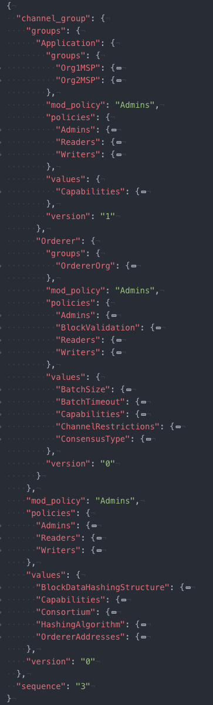

# 更新通道配置

*受众：网络管理员、节点管理员*

## 什么是通道配置？

像许多复杂的系统一样，Hyperledger Fabric 网络由一些**结构**及其相关的**过程**组成。


* **Structure**：包括用户（如管理员）、组织、peer 节点、排序节点、CA、智能合约以及应用程序。
* **Process**：结构相互作用的方式。其中最重要的是 [策略](./policies/policies.html)，这些规则控制着哪些用户可以在什么条件下执行什么操作。

识别区块链网络的结构和管理结构如何相互作用的过程的信息位于**通道配置**中。这些配置由通道成员共同决定，并包含在提交给通道账本的区块中。通道配置可以使用 `configtxgen` 工具来构建，该工具使用 `configtx.yaml` 文件作为输入。你可以在此处[查看 `configtx.yaml` 的样例文件](https://github.com/hyperledger/fabric/blob/release-2.0/sampleconfig/configtx.yaml)。

由于配置位于区块中（第一个区块被称为创世区块，它包含通道的最新配置），因此更新通道配置的过程（比如，通过添加成员来更改结构或者修改通道配置）被称为**配置更新交易**。

在生产网络中，通道的初始化配置由该通道的初始成员在外部决定，同样的，配置更新交易也通常是在外部讨论后由单个通道管理员提出。

在本主题中，我们将：

* 展示一个应用程序通道的完整配置示例。
* 讨论很多可以编辑的通道参数。
* 展示更新通道配置的过程，该过程包括提取、转换和确定配置范围的命令，这些命令会将通道配置转换成易于人们阅读的格式。
* 讨论可以用于修改通道配置的方法。
* 展示重新格式化配置的过程，并获取使配置生效所必需的签名。

## 可以更新的通道参数

通道是高度可配置的，但也有限制。某些与通道相关的内容（例如通道的名称）被确定后就无法再进行修改。而且修改我们在本主题中讨论的某个参数时需要满足通道配置中指定的相关策略。

在本节中，我们将查看一个通道配置示例，并展示那些可以更新的配置参数。

### 通道配置示例

要查看应用程序通道被提取并被确定范围后的内容，请点击下方的**点击此处查看配置**。为了方便阅读，最好将此配置放入支持 JSON 折叠的查看器中，比如 atom 或 Visual Studio。

请注意：为简单起见，这里只展示了应用程序通道的配置。排序系统通道的配置与应用程序通道的配置非常相似，但不完全相同。不过当提取和编辑配置时，使用的基本规则、结构是相同的，你可以在[更新通道的功能级别](./updating_capabilities.html)主题中查看相关内容。

<details>
  <summary>
    **Click here to see the config**. Note that this is the configuration of an application channel, not the orderer system channel.
  </summary>
  ```
  {
    "channel_group": {
      "groups": {
        "Application": {
          "groups": {
            "Org1MSP": {
              "groups": {},
              "mod_policy": "Admins",
              "policies": {
                "Admins": {
                  "mod_policy": "Admins",
                  "policy": {
                    "type": 1,
                    "value": {
                      "identities": [
                        {
                          "principal": {
                            "msp_identifier": "Org1MSP",
                            "role": "ADMIN"
                          },
                          "principal_classification": "ROLE"
                        }
                      ],
                      "rule": {
                        "n_out_of": {
                          "n": 1,
                          "rules": [
                            {
                              "signed_by": 0
                            }
                          ]
                        }
                      },
                      "version": 0
                    }
                  },
                  "version": "0"
                },
                "Endorsement": {
                  "mod_policy": "Admins",
                  "policy": {
                    "type": 1,
                    "value": {
                      "identities": [
                        {
                          "principal": {
                            "msp_identifier": "Org1MSP",
                            "role": "PEER"
                          },
                          "principal_classification": "ROLE"
                        }
                      ],
                      "rule": {
                        "n_out_of": {
                          "n": 1,
                          "rules": [
                            {
                              "signed_by": 0
                            }
                          ]
                        }
                      },
                      "version": 0
                    }
                  },
                  "version": "0"
                },
                "Readers": {
                  "mod_policy": "Admins",
                  "policy": {
                    "type": 1,
                    "value": {
                      "identities": [
                        {
                          "principal": {
                            "msp_identifier": "Org1MSP",
                            "role": "ADMIN"
                          },
                          "principal_classification": "ROLE"
                        },
                        {
                          "principal": {
                            "msp_identifier": "Org1MSP",
                            "role": "PEER"
                          },
                          "principal_classification": "ROLE"
                        },
                        {
                          "principal": {
                            "msp_identifier": "Org1MSP",
                            "role": "CLIENT"
                          },
                          "principal_classification": "ROLE"
                        }
                      ],
                      "rule": {
                        "n_out_of": {
                          "n": 1,
                          "rules": [
                            {
                              "signed_by": 0
                            },
                            {
                              "signed_by": 1
                            },
                            {
                              "signed_by": 2
                            }
                          ]
                        }
                      },
                      "version": 0
                    }
                  },
                  "version": "0"
                },
                "Writers": {
                  "mod_policy": "Admins",
                  "policy": {
                    "type": 1,
                    "value": {
                      "identities": [
                        {
                          "principal": {
                            "msp_identifier": "Org1MSP",
                            "role": "ADMIN"
                          },
                          "principal_classification": "ROLE"
                        },
                        {
                          "principal": {
                            "msp_identifier": "Org1MSP",
                            "role": "CLIENT"
                          },
                          "principal_classification": "ROLE"
                        }
                      ],
                      "rule": {
                        "n_out_of": {
                          "n": 1,
                          "rules": [
                            {
                              "signed_by": 0
                            },
                            {
                              "signed_by": 1
                            }
                          ]
                        }
                      },
                      "version": 0
                    }
                  },
                  "version": "0"
                }
              },
              "values": {
                "AnchorPeers": {
                  "mod_policy": "Admins",
                  "value": {
                    "anchor_peers": [
                      {
                        "host": "peer0.org1.example.com",
                        "port": 7051
                      }
                    ]
                  },
                  "version": "0"
                },
                "MSP": {
                  "mod_policy": "Admins",
                  "value": {
                    "config": {
                      "admins": [],
                      "crypto_config": {
                        "identity_identifier_hash_function": "SHA256",
                        "signature_hash_family": "SHA2"
                      },
                      "fabric_node_ous": {
                        "admin_ou_identifier": {
                          "certificate": "LS0tLS1CRUdJTiBDRVJUSUZJQ0FURS0tLS0tCk1JSUNKekNDQWMyZ0F3SUJBZ0lVYWVSeWNkQytlR1lUTUNyWTg2UFVXUEdzQUw0d0NnWUlLb1pJemowRUF3SXcKY0RFTE1Ba0dBMVVFQmhNQ1ZWTXhGekFWQmdOVkJBZ1REazV2Y25Sb0lFTmhjbTlzYVc1aE1ROHdEUVlEVlFRSApFd1pFZFhKb1lXMHhHVEFYQmdOVkJBb1RFRzl5WnpFdVpYaGhiWEJzWlM1amIyMHhIREFhQmdOVkJBTVRFMk5oCkxtOXlaekV1WlhoaGJYQnNaUzVqYjIwd0hoY05NakF3TXpJME1qQXhPREF3V2hjTk16VXdNekl4TWpBeE9EQXcKV2pCd01Rc3dDUVlEVlFRR0V3SlZVekVYTUJVR0ExVUVDQk1PVG05eWRHZ2dRMkZ5YjJ4cGJtRXhEekFOQmdOVgpCQWNUQmtSMWNtaGhiVEVaTUJjR0ExVUVDaE1RYjNKbk1TNWxlR0Z0Y0d4bExtTnZiVEVjTUJvR0ExVUVBeE1UClkyRXViM0puTVM1bGVHRnRjR3hsTG1OdmJUQlpNQk1HQnlxR1NNNDlBZ0VHQ0NxR1NNNDlBd0VIQTBJQUJLWXIKSmtqcEhjRkcxMVZlU200emxwSmNCZEtZVjc3SEgvdzI0V09sZnphYWZWK3VaaEZ2YTFhQm9aaGx5RloyMGRWeApwMkRxb09BblZ4MzZ1V3o2SXl1alJUQkRNQTRHQTFVZER3RUIvd1FFQXdJQkJqQVNCZ05WSFJNQkFmOEVDREFHCkFRSC9BZ0VCTUIwR0ExVWREZ1FXQkJTcHpDQWdPaGRuSkE3VVpxUWlFSVFXSFpnYXZEQUtCZ2dxaGtqT1BRUUQKQWdOSUFEQkZBaUVBbEZtYWdIQkJoblFUd3dDOXBQRTRGbFY2SlhIbTdnQ1JyWUxUbVgvc0VySUNJRUhLZG51KwpIWDgrVTh1ZkFKbTdrL1laZEtVVnlWS2E3bGREUjlWajNveTIKLS0tLS1FTkQgQ0VSVElGSUNBVEUtLS0tLQo=",
                          "organizational_unit_identifier": "admin"
                        },
                        "client_ou_identifier": {
                          "certificate": "LS0tLS1CRUdJTiBDRVJUSUZJQ0FURS0tLS0tCk1JSUNKekNDQWMyZ0F3SUJBZ0lVYWVSeWNkQytlR1lUTUNyWTg2UFVXUEdzQUw0d0NnWUlLb1pJemowRUF3SXcKY0RFTE1Ba0dBMVVFQmhNQ1ZWTXhGekFWQmdOVkJBZ1REazV2Y25Sb0lFTmhjbTlzYVc1aE1ROHdEUVlEVlFRSApFd1pFZFhKb1lXMHhHVEFYQmdOVkJBb1RFRzl5WnpFdVpYaGhiWEJzWlM1amIyMHhIREFhQmdOVkJBTVRFMk5oCkxtOXlaekV1WlhoaGJYQnNaUzVqYjIwd0hoY05NakF3TXpJME1qQXhPREF3V2hjTk16VXdNekl4TWpBeE9EQXcKV2pCd01Rc3dDUVlEVlFRR0V3SlZVekVYTUJVR0ExVUVDQk1PVG05eWRHZ2dRMkZ5YjJ4cGJtRXhEekFOQmdOVgpCQWNUQmtSMWNtaGhiVEVaTUJjR0ExVUVDaE1RYjNKbk1TNWxlR0Z0Y0d4bExtTnZiVEVjTUJvR0ExVUVBeE1UClkyRXViM0puTVM1bGVHRnRjR3hsTG1OdmJUQlpNQk1HQnlxR1NNNDlBZ0VHQ0NxR1NNNDlBd0VIQTBJQUJLWXIKSmtqcEhjRkcxMVZlU200emxwSmNCZEtZVjc3SEgvdzI0V09sZnphYWZWK3VaaEZ2YTFhQm9aaGx5RloyMGRWeApwMkRxb09BblZ4MzZ1V3o2SXl1alJUQkRNQTRHQTFVZER3RUIvd1FFQXdJQkJqQVNCZ05WSFJNQkFmOEVDREFHCkFRSC9BZ0VCTUIwR0ExVWREZ1FXQkJTcHpDQWdPaGRuSkE3VVpxUWlFSVFXSFpnYXZEQUtCZ2dxaGtqT1BRUUQKQWdOSUFEQkZBaUVBbEZtYWdIQkJoblFUd3dDOXBQRTRGbFY2SlhIbTdnQ1JyWUxUbVgvc0VySUNJRUhLZG51KwpIWDgrVTh1ZkFKbTdrL1laZEtVVnlWS2E3bGREUjlWajNveTIKLS0tLS1FTkQgQ0VSVElGSUNBVEUtLS0tLQo=",
                          "organizational_unit_identifier": "client"
                        },
                        "enable": true,
                        "orderer_ou_identifier": {
                          "certificate": "LS0tLS1CRUdJTiBDRVJUSUZJQ0FURS0tLS0tCk1JSUNKekNDQWMyZ0F3SUJBZ0lVYWVSeWNkQytlR1lUTUNyWTg2UFVXUEdzQUw0d0NnWUlLb1pJemowRUF3SXcKY0RFTE1Ba0dBMVVFQmhNQ1ZWTXhGekFWQmdOVkJBZ1REazV2Y25Sb0lFTmhjbTlzYVc1aE1ROHdEUVlEVlFRSApFd1pFZFhKb1lXMHhHVEFYQmdOVkJBb1RFRzl5WnpFdVpYaGhiWEJzWlM1amIyMHhIREFhQmdOVkJBTVRFMk5oCkxtOXlaekV1WlhoaGJYQnNaUzVqYjIwd0hoY05NakF3TXpJME1qQXhPREF3V2hjTk16VXdNekl4TWpBeE9EQXcKV2pCd01Rc3dDUVlEVlFRR0V3SlZVekVYTUJVR0ExVUVDQk1PVG05eWRHZ2dRMkZ5YjJ4cGJtRXhEekFOQmdOVgpCQWNUQmtSMWNtaGhiVEVaTUJjR0ExVUVDaE1RYjNKbk1TNWxlR0Z0Y0d4bExtTnZiVEVjTUJvR0ExVUVBeE1UClkyRXViM0puTVM1bGVHRnRjR3hsTG1OdmJUQlpNQk1HQnlxR1NNNDlBZ0VHQ0NxR1NNNDlBd0VIQTBJQUJLWXIKSmtqcEhjRkcxMVZlU200emxwSmNCZEtZVjc3SEgvdzI0V09sZnphYWZWK3VaaEZ2YTFhQm9aaGx5RloyMGRWeApwMkRxb09BblZ4MzZ1V3o2SXl1alJUQkRNQTRHQTFVZER3RUIvd1FFQXdJQkJqQVNCZ05WSFJNQkFmOEVDREFHCkFRSC9BZ0VCTUIwR0ExVWREZ1FXQkJTcHpDQWdPaGRuSkE3VVpxUWlFSVFXSFpnYXZEQUtCZ2dxaGtqT1BRUUQKQWdOSUFEQkZBaUVBbEZtYWdIQkJoblFUd3dDOXBQRTRGbFY2SlhIbTdnQ1JyWUxUbVgvc0VySUNJRUhLZG51KwpIWDgrVTh1ZkFKbTdrL1laZEtVVnlWS2E3bGREUjlWajNveTIKLS0tLS1FTkQgQ0VSVElGSUNBVEUtLS0tLQo=",
                          "organizational_unit_identifier": "orderer"
                        },
                        "peer_ou_identifier": {
                          "certificate": "LS0tLS1CRUdJTiBDRVJUSUZJQ0FURS0tLS0tCk1JSUNKekNDQWMyZ0F3SUJBZ0lVYWVSeWNkQytlR1lUTUNyWTg2UFVXUEdzQUw0d0NnWUlLb1pJemowRUF3SXcKY0RFTE1Ba0dBMVVFQmhNQ1ZWTXhGekFWQmdOVkJBZ1REazV2Y25Sb0lFTmhjbTlzYVc1aE1ROHdEUVlEVlFRSApFd1pFZFhKb1lXMHhHVEFYQmdOVkJBb1RFRzl5WnpFdVpYaGhiWEJzWlM1amIyMHhIREFhQmdOVkJBTVRFMk5oCkxtOXlaekV1WlhoaGJYQnNaUzVqYjIwd0hoY05NakF3TXpJME1qQXhPREF3V2hjTk16VXdNekl4TWpBeE9EQXcKV2pCd01Rc3dDUVlEVlFRR0V3SlZVekVYTUJVR0ExVUVDQk1PVG05eWRHZ2dRMkZ5YjJ4cGJtRXhEekFOQmdOVgpCQWNUQmtSMWNtaGhiVEVaTUJjR0ExVUVDaE1RYjNKbk1TNWxlR0Z0Y0d4bExtTnZiVEVjTUJvR0ExVUVBeE1UClkyRXViM0puTVM1bGVHRnRjR3hsTG1OdmJUQlpNQk1HQnlxR1NNNDlBZ0VHQ0NxR1NNNDlBd0VIQTBJQUJLWXIKSmtqcEhjRkcxMVZlU200emxwSmNCZEtZVjc3SEgvdzI0V09sZnphYWZWK3VaaEZ2YTFhQm9aaGx5RloyMGRWeApwMkRxb09BblZ4MzZ1V3o2SXl1alJUQkRNQTRHQTFVZER3RUIvd1FFQXdJQkJqQVNCZ05WSFJNQkFmOEVDREFHCkFRSC9BZ0VCTUIwR0ExVWREZ1FXQkJTcHpDQWdPaGRuSkE3VVpxUWlFSVFXSFpnYXZEQUtCZ2dxaGtqT1BRUUQKQWdOSUFEQkZBaUVBbEZtYWdIQkJoblFUd3dDOXBQRTRGbFY2SlhIbTdnQ1JyWUxUbVgvc0VySUNJRUhLZG51KwpIWDgrVTh1ZkFKbTdrL1laZEtVVnlWS2E3bGREUjlWajNveTIKLS0tLS1FTkQgQ0VSVElGSUNBVEUtLS0tLQo=",
                          "organizational_unit_identifier": "peer"
                        }
                      },
                      "intermediate_certs": [],
                      "name": "Org1MSP",
                      "organizational_unit_identifiers": [],
                      "revocation_list": [],
                      "root_certs": [
                        "LS0tLS1CRUdJTiBDRVJUSUZJQ0FURS0tLS0tCk1JSUNKekNDQWMyZ0F3SUJBZ0lVYWVSeWNkQytlR1lUTUNyWTg2UFVXUEdzQUw0d0NnWUlLb1pJemowRUF3SXcKY0RFTE1Ba0dBMVVFQmhNQ1ZWTXhGekFWQmdOVkJBZ1REazV2Y25Sb0lFTmhjbTlzYVc1aE1ROHdEUVlEVlFRSApFd1pFZFhKb1lXMHhHVEFYQmdOVkJBb1RFRzl5WnpFdVpYaGhiWEJzWlM1amIyMHhIREFhQmdOVkJBTVRFMk5oCkxtOXlaekV1WlhoaGJYQnNaUzVqYjIwd0hoY05NakF3TXpJME1qQXhPREF3V2hjTk16VXdNekl4TWpBeE9EQXcKV2pCd01Rc3dDUVlEVlFRR0V3SlZVekVYTUJVR0ExVUVDQk1PVG05eWRHZ2dRMkZ5YjJ4cGJtRXhEekFOQmdOVgpCQWNUQmtSMWNtaGhiVEVaTUJjR0ExVUVDaE1RYjNKbk1TNWxlR0Z0Y0d4bExtTnZiVEVjTUJvR0ExVUVBeE1UClkyRXViM0puTVM1bGVHRnRjR3hsTG1OdmJUQlpNQk1HQnlxR1NNNDlBZ0VHQ0NxR1NNNDlBd0VIQTBJQUJLWXIKSmtqcEhjRkcxMVZlU200emxwSmNCZEtZVjc3SEgvdzI0V09sZnphYWZWK3VaaEZ2YTFhQm9aaGx5RloyMGRWeApwMkRxb09BblZ4MzZ1V3o2SXl1alJUQkRNQTRHQTFVZER3RUIvd1FFQXdJQkJqQVNCZ05WSFJNQkFmOEVDREFHCkFRSC9BZ0VCTUIwR0ExVWREZ1FXQkJTcHpDQWdPaGRuSkE3VVpxUWlFSVFXSFpnYXZEQUtCZ2dxaGtqT1BRUUQKQWdOSUFEQkZBaUVBbEZtYWdIQkJoblFUd3dDOXBQRTRGbFY2SlhIbTdnQ1JyWUxUbVgvc0VySUNJRUhLZG51KwpIWDgrVTh1ZkFKbTdrL1laZEtVVnlWS2E3bGREUjlWajNveTIKLS0tLS1FTkQgQ0VSVElGSUNBVEUtLS0tLQo="
                      ],
                      "signing_identity": null,
                      "tls_intermediate_certs": [],
                      "tls_root_certs": [
                        "LS0tLS1CRUdJTiBDRVJUSUZJQ0FURS0tLS0tCk1JSUNKekNDQWMyZ0F3SUJBZ0lVYWVSeWNkQytlR1lUTUNyWTg2UFVXUEdzQUw0d0NnWUlLb1pJemowRUF3SXcKY0RFTE1Ba0dBMVVFQmhNQ1ZWTXhGekFWQmdOVkJBZ1REazV2Y25Sb0lFTmhjbTlzYVc1aE1ROHdEUVlEVlFRSApFd1pFZFhKb1lXMHhHVEFYQmdOVkJBb1RFRzl5WnpFdVpYaGhiWEJzWlM1amIyMHhIREFhQmdOVkJBTVRFMk5oCkxtOXlaekV1WlhoaGJYQnNaUzVqYjIwd0hoY05NakF3TXpJME1qQXhPREF3V2hjTk16VXdNekl4TWpBeE9EQXcKV2pCd01Rc3dDUVlEVlFRR0V3SlZVekVYTUJVR0ExVUVDQk1PVG05eWRHZ2dRMkZ5YjJ4cGJtRXhEekFOQmdOVgpCQWNUQmtSMWNtaGhiVEVaTUJjR0ExVUVDaE1RYjNKbk1TNWxlR0Z0Y0d4bExtTnZiVEVjTUJvR0ExVUVBeE1UClkyRXViM0puTVM1bGVHRnRjR3hsTG1OdmJUQlpNQk1HQnlxR1NNNDlBZ0VHQ0NxR1NNNDlBd0VIQTBJQUJLWXIKSmtqcEhjRkcxMVZlU200emxwSmNCZEtZVjc3SEgvdzI0V09sZnphYWZWK3VaaEZ2YTFhQm9aaGx5RloyMGRWeApwMkRxb09BblZ4MzZ1V3o2SXl1alJUQkRNQTRHQTFVZER3RUIvd1FFQXdJQkJqQVNCZ05WSFJNQkFmOEVDREFHCkFRSC9BZ0VCTUIwR0ExVWREZ1FXQkJTcHpDQWdPaGRuSkE3VVpxUWlFSVFXSFpnYXZEQUtCZ2dxaGtqT1BRUUQKQWdOSUFEQkZBaUVBbEZtYWdIQkJoblFUd3dDOXBQRTRGbFY2SlhIbTdnQ1JyWUxUbVgvc0VySUNJRUhLZG51KwpIWDgrVTh1ZkFKbTdrL1laZEtVVnlWS2E3bGREUjlWajNveTIKLS0tLS1FTkQgQ0VSVElGSUNBVEUtLS0tLQo="
                      ]
                    },
                    "type": 0
                  },
                  "version": "0"
                }
              },
              "version": "1"
            },
            "Org2MSP": {
              "groups": {},
              "mod_policy": "Admins",
              "policies": {
                "Admins": {
                  "mod_policy": "Admins",
                  "policy": {
                    "type": 1,
                    "value": {
                      "identities": [
                        {
                          "principal": {
                            "msp_identifier": "Org2MSP",
                            "role": "ADMIN"
                          },
                          "principal_classification": "ROLE"
                        }
                      ],
                      "rule": {
                        "n_out_of": {
                          "n": 1,
                          "rules": [
                            {
                              "signed_by": 0
                            }
                          ]
                        }
                      },
                      "version": 0
                    }
                  },
                  "version": "0"
                },
                "Endorsement": {
                  "mod_policy": "Admins",
                  "policy": {
                    "type": 1,
                    "value": {
                      "identities": [
                        {
                          "principal": {
                            "msp_identifier": "Org2MSP",
                            "role": "PEER"
                          },
                          "principal_classification": "ROLE"
                        }
                      ],
                      "rule": {
                        "n_out_of": {
                          "n": 1,
                          "rules": [
                            {
                              "signed_by": 0
                            }
                          ]
                        }
                      },
                      "version": 0
                    }
                  },
                  "version": "0"
                },
                "Readers": {
                  "mod_policy": "Admins",
                  "policy": {
                    "type": 1,
                    "value": {
                      "identities": [
                        {
                          "principal": {
                            "msp_identifier": "Org2MSP",
                            "role": "ADMIN"
                          },
                          "principal_classification": "ROLE"
                        },
                        {
                          "principal": {
                            "msp_identifier": "Org2MSP",
                            "role": "PEER"
                          },
                          "principal_classification": "ROLE"
                        },
                        {
                          "principal": {
                            "msp_identifier": "Org2MSP",
                            "role": "CLIENT"
                          },
                          "principal_classification": "ROLE"
                        }
                      ],
                      "rule": {
                        "n_out_of": {
                          "n": 1,
                          "rules": [
                            {
                              "signed_by": 0
                            },
                            {
                              "signed_by": 1
                            },
                            {
                              "signed_by": 2
                            }
                          ]
                        }
                      },
                      "version": 0
                    }
                  },
                  "version": "0"
                },
                "Writers": {
                  "mod_policy": "Admins",
                  "policy": {
                    "type": 1,
                    "value": {
                      "identities": [
                        {
                          "principal": {
                            "msp_identifier": "Org2MSP",
                            "role": "ADMIN"
                          },
                          "principal_classification": "ROLE"
                        },
                        {
                          "principal": {
                            "msp_identifier": "Org2MSP",
                            "role": "CLIENT"
                          },
                          "principal_classification": "ROLE"
                        }
                      ],
                      "rule": {
                        "n_out_of": {
                          "n": 1,
                          "rules": [
                            {
                              "signed_by": 0
                            },
                            {
                              "signed_by": 1
                            }
                          ]
                        }
                      },
                      "version": 0
                    }
                  },
                  "version": "0"
                }
              },
              "values": {
                "AnchorPeers": {
                  "mod_policy": "Admins",
                  "value": {
                    "anchor_peers": [
                      {
                        "host": "peer0.org2.example.com",
                        "port": 9051
                      }
                    ]
                  },
                  "version": "0"
                },
                "MSP": {
                  "mod_policy": "Admins",
                  "value": {
                    "config": {
                      "admins": [],
                      "crypto_config": {
                        "identity_identifier_hash_function": "SHA256",
                        "signature_hash_family": "SHA2"
                      },
                      "fabric_node_ous": {
                        "admin_ou_identifier": {
                          "certificate": "LS0tLS1CRUdJTiBDRVJUSUZJQ0FURS0tLS0tCk1JSUNIakNDQWNXZ0F3SUJBZ0lVQVFkb1B0S0E0bEk2a0RrMituYzk5NzNhSC9Vd0NnWUlLb1pJemowRUF3SXcKYkRFTE1Ba0dBMVVFQmhNQ1ZVc3hFakFRQmdOVkJBZ1RDVWhoYlhCemFHbHlaVEVRTUE0R0ExVUVCeE1IU0hWeQpjMnhsZVRFWk1CY0dBMVVFQ2hNUWIzSm5NaTVsZUdGdGNHeGxMbU52YlRFY01Cb0dBMVVFQXhNVFkyRXViM0puCk1pNWxlR0Z0Y0d4bExtTnZiVEFlRncweU1EQXpNalF5TURFNE1EQmFGdzB6TlRBek1qRXlNREU0TURCYU1Hd3gKQ3pBSkJnTlZCQVlUQWxWTE1SSXdFQVlEVlFRSUV3bElZVzF3YzJocGNtVXhFREFPQmdOVkJBY1RCMGgxY25OcwpaWGt4R1RBWEJnTlZCQW9URUc5eVp6SXVaWGhoYlhCc1pTNWpiMjB4SERBYUJnTlZCQU1URTJOaExtOXlaekl1ClpYaGhiWEJzWlM1amIyMHdXVEFUQmdjcWhrak9QUUlCQmdncWhrak9QUU1CQndOQ0FBVFk3VGJqQzdYSHNheC8Kem1yVk1nWnpmODBlb3JFbTNIdis2ZnRqMFgzd2cxdGZVM3hyWWxXZVJwR0JGeFQzNnJmVkdLLzhUQWJ2cnRuZgpUQ1hKak93a28wVXdRekFPQmdOVkhROEJBZjhFQkFNQ0FRWXdFZ1lEVlIwVEFRSC9CQWd3QmdFQi93SUJBVEFkCkJnTlZIUTRFRmdRVWJJNkV4dVRZSEpjczRvNEl5dXZWOVFRa1lGZ3dDZ1lJS29aSXpqMEVBd0lEUndBd1JBSWcKWndjdElBNmdoSlFCZmpDRXdRK1NmYi9iemdsQlV4b0g3ZHVtOUJrUjFkd0NJQlRqcEZkWlcyS2UzSVBMS1h2aApERmQvVmMrcloyMksyeVdKL1BIYXZWWmkKLS0tLS1FTkQgQ0VSVElGSUNBVEUtLS0tLQo=",
                          "organizational_unit_identifier": "admin"
                        },
                        "client_ou_identifier": {
                          "certificate": "LS0tLS1CRUdJTiBDRVJUSUZJQ0FURS0tLS0tCk1JSUNIakNDQWNXZ0F3SUJBZ0lVQVFkb1B0S0E0bEk2a0RrMituYzk5NzNhSC9Vd0NnWUlLb1pJemowRUF3SXcKYkRFTE1Ba0dBMVVFQmhNQ1ZVc3hFakFRQmdOVkJBZ1RDVWhoYlhCemFHbHlaVEVRTUE0R0ExVUVCeE1IU0hWeQpjMnhsZVRFWk1CY0dBMVVFQ2hNUWIzSm5NaTVsZUdGdGNHeGxMbU52YlRFY01Cb0dBMVVFQXhNVFkyRXViM0puCk1pNWxlR0Z0Y0d4bExtTnZiVEFlRncweU1EQXpNalF5TURFNE1EQmFGdzB6TlRBek1qRXlNREU0TURCYU1Hd3gKQ3pBSkJnTlZCQVlUQWxWTE1SSXdFQVlEVlFRSUV3bElZVzF3YzJocGNtVXhFREFPQmdOVkJBY1RCMGgxY25OcwpaWGt4R1RBWEJnTlZCQW9URUc5eVp6SXVaWGhoYlhCc1pTNWpiMjB4SERBYUJnTlZCQU1URTJOaExtOXlaekl1ClpYaGhiWEJzWlM1amIyMHdXVEFUQmdjcWhrak9QUUlCQmdncWhrak9QUU1CQndOQ0FBVFk3VGJqQzdYSHNheC8Kem1yVk1nWnpmODBlb3JFbTNIdis2ZnRqMFgzd2cxdGZVM3hyWWxXZVJwR0JGeFQzNnJmVkdLLzhUQWJ2cnRuZgpUQ1hKak93a28wVXdRekFPQmdOVkhROEJBZjhFQkFNQ0FRWXdFZ1lEVlIwVEFRSC9CQWd3QmdFQi93SUJBVEFkCkJnTlZIUTRFRmdRVWJJNkV4dVRZSEpjczRvNEl5dXZWOVFRa1lGZ3dDZ1lJS29aSXpqMEVBd0lEUndBd1JBSWcKWndjdElBNmdoSlFCZmpDRXdRK1NmYi9iemdsQlV4b0g3ZHVtOUJrUjFkd0NJQlRqcEZkWlcyS2UzSVBMS1h2aApERmQvVmMrcloyMksyeVdKL1BIYXZWWmkKLS0tLS1FTkQgQ0VSVElGSUNBVEUtLS0tLQo=",
                          "organizational_unit_identifier": "client"
                        },
                        "enable": true,
                        "orderer_ou_identifier": {
                          "certificate": "LS0tLS1CRUdJTiBDRVJUSUZJQ0FURS0tLS0tCk1JSUNIakNDQWNXZ0F3SUJBZ0lVQVFkb1B0S0E0bEk2a0RrMituYzk5NzNhSC9Vd0NnWUlLb1pJemowRUF3SXcKYkRFTE1Ba0dBMVVFQmhNQ1ZVc3hFakFRQmdOVkJBZ1RDVWhoYlhCemFHbHlaVEVRTUE0R0ExVUVCeE1IU0hWeQpjMnhsZVRFWk1CY0dBMVVFQ2hNUWIzSm5NaTVsZUdGdGNHeGxMbU52YlRFY01Cb0dBMVVFQXhNVFkyRXViM0puCk1pNWxlR0Z0Y0d4bExtTnZiVEFlRncweU1EQXpNalF5TURFNE1EQmFGdzB6TlRBek1qRXlNREU0TURCYU1Hd3gKQ3pBSkJnTlZCQVlUQWxWTE1SSXdFQVlEVlFRSUV3bElZVzF3YzJocGNtVXhFREFPQmdOVkJBY1RCMGgxY25OcwpaWGt4R1RBWEJnTlZCQW9URUc5eVp6SXVaWGhoYlhCc1pTNWpiMjB4SERBYUJnTlZCQU1URTJOaExtOXlaekl1ClpYaGhiWEJzWlM1amIyMHdXVEFUQmdjcWhrak9QUUlCQmdncWhrak9QUU1CQndOQ0FBVFk3VGJqQzdYSHNheC8Kem1yVk1nWnpmODBlb3JFbTNIdis2ZnRqMFgzd2cxdGZVM3hyWWxXZVJwR0JGeFQzNnJmVkdLLzhUQWJ2cnRuZgpUQ1hKak93a28wVXdRekFPQmdOVkhROEJBZjhFQkFNQ0FRWXdFZ1lEVlIwVEFRSC9CQWd3QmdFQi93SUJBVEFkCkJnTlZIUTRFRmdRVWJJNkV4dVRZSEpjczRvNEl5dXZWOVFRa1lGZ3dDZ1lJS29aSXpqMEVBd0lEUndBd1JBSWcKWndjdElBNmdoSlFCZmpDRXdRK1NmYi9iemdsQlV4b0g3ZHVtOUJrUjFkd0NJQlRqcEZkWlcyS2UzSVBMS1h2aApERmQvVmMrcloyMksyeVdKL1BIYXZWWmkKLS0tLS1FTkQgQ0VSVElGSUNBVEUtLS0tLQo=",
                          "organizational_unit_identifier": "orderer"
                        },
                        "peer_ou_identifier": {
                          "certificate": "LS0tLS1CRUdJTiBDRVJUSUZJQ0FURS0tLS0tCk1JSUNIakNDQWNXZ0F3SUJBZ0lVQVFkb1B0S0E0bEk2a0RrMituYzk5NzNhSC9Vd0NnWUlLb1pJemowRUF3SXcKYkRFTE1Ba0dBMVVFQmhNQ1ZVc3hFakFRQmdOVkJBZ1RDVWhoYlhCemFHbHlaVEVRTUE0R0ExVUVCeE1IU0hWeQpjMnhsZVRFWk1CY0dBMVVFQ2hNUWIzSm5NaTVsZUdGdGNHeGxMbU52YlRFY01Cb0dBMVVFQXhNVFkyRXViM0puCk1pNWxlR0Z0Y0d4bExtTnZiVEFlRncweU1EQXpNalF5TURFNE1EQmFGdzB6TlRBek1qRXlNREU0TURCYU1Hd3gKQ3pBSkJnTlZCQVlUQWxWTE1SSXdFQVlEVlFRSUV3bElZVzF3YzJocGNtVXhFREFPQmdOVkJBY1RCMGgxY25OcwpaWGt4R1RBWEJnTlZCQW9URUc5eVp6SXVaWGhoYlhCc1pTNWpiMjB4SERBYUJnTlZCQU1URTJOaExtOXlaekl1ClpYaGhiWEJzWlM1amIyMHdXVEFUQmdjcWhrak9QUUlCQmdncWhrak9QUU1CQndOQ0FBVFk3VGJqQzdYSHNheC8Kem1yVk1nWnpmODBlb3JFbTNIdis2ZnRqMFgzd2cxdGZVM3hyWWxXZVJwR0JGeFQzNnJmVkdLLzhUQWJ2cnRuZgpUQ1hKak93a28wVXdRekFPQmdOVkhROEJBZjhFQkFNQ0FRWXdFZ1lEVlIwVEFRSC9CQWd3QmdFQi93SUJBVEFkCkJnTlZIUTRFRmdRVWJJNkV4dVRZSEpjczRvNEl5dXZWOVFRa1lGZ3dDZ1lJS29aSXpqMEVBd0lEUndBd1JBSWcKWndjdElBNmdoSlFCZmpDRXdRK1NmYi9iemdsQlV4b0g3ZHVtOUJrUjFkd0NJQlRqcEZkWlcyS2UzSVBMS1h2aApERmQvVmMrcloyMksyeVdKL1BIYXZWWmkKLS0tLS1FTkQgQ0VSVElGSUNBVEUtLS0tLQo=",
                          "organizational_unit_identifier": "peer"
                        }
                      },
                      "intermediate_certs": [],
                      "name": "Org2MSP",
                      "organizational_unit_identifiers": [],
                      "revocation_list": [],
                      "root_certs": [
                        "LS0tLS1CRUdJTiBDRVJUSUZJQ0FURS0tLS0tCk1JSUNIakNDQWNXZ0F3SUJBZ0lVQVFkb1B0S0E0bEk2a0RrMituYzk5NzNhSC9Vd0NnWUlLb1pJemowRUF3SXcKYkRFTE1Ba0dBMVVFQmhNQ1ZVc3hFakFRQmdOVkJBZ1RDVWhoYlhCemFHbHlaVEVRTUE0R0ExVUVCeE1IU0hWeQpjMnhsZVRFWk1CY0dBMVVFQ2hNUWIzSm5NaTVsZUdGdGNHeGxMbU52YlRFY01Cb0dBMVVFQXhNVFkyRXViM0puCk1pNWxlR0Z0Y0d4bExtTnZiVEFlRncweU1EQXpNalF5TURFNE1EQmFGdzB6TlRBek1qRXlNREU0TURCYU1Hd3gKQ3pBSkJnTlZCQVlUQWxWTE1SSXdFQVlEVlFRSUV3bElZVzF3YzJocGNtVXhFREFPQmdOVkJBY1RCMGgxY25OcwpaWGt4R1RBWEJnTlZCQW9URUc5eVp6SXVaWGhoYlhCc1pTNWpiMjB4SERBYUJnTlZCQU1URTJOaExtOXlaekl1ClpYaGhiWEJzWlM1amIyMHdXVEFUQmdjcWhrak9QUUlCQmdncWhrak9QUU1CQndOQ0FBVFk3VGJqQzdYSHNheC8Kem1yVk1nWnpmODBlb3JFbTNIdis2ZnRqMFgzd2cxdGZVM3hyWWxXZVJwR0JGeFQzNnJmVkdLLzhUQWJ2cnRuZgpUQ1hKak93a28wVXdRekFPQmdOVkhROEJBZjhFQkFNQ0FRWXdFZ1lEVlIwVEFRSC9CQWd3QmdFQi93SUJBVEFkCkJnTlZIUTRFRmdRVWJJNkV4dVRZSEpjczRvNEl5dXZWOVFRa1lGZ3dDZ1lJS29aSXpqMEVBd0lEUndBd1JBSWcKWndjdElBNmdoSlFCZmpDRXdRK1NmYi9iemdsQlV4b0g3ZHVtOUJrUjFkd0NJQlRqcEZkWlcyS2UzSVBMS1h2aApERmQvVmMrcloyMksyeVdKL1BIYXZWWmkKLS0tLS1FTkQgQ0VSVElGSUNBVEUtLS0tLQo="
                      ],
                      "signing_identity": null,
                      "tls_intermediate_certs": [],
                      "tls_root_certs": [
                        "LS0tLS1CRUdJTiBDRVJUSUZJQ0FURS0tLS0tCk1JSUNIakNDQWNXZ0F3SUJBZ0lVQVFkb1B0S0E0bEk2a0RrMituYzk5NzNhSC9Vd0NnWUlLb1pJemowRUF3SXcKYkRFTE1Ba0dBMVVFQmhNQ1ZVc3hFakFRQmdOVkJBZ1RDVWhoYlhCemFHbHlaVEVRTUE0R0ExVUVCeE1IU0hWeQpjMnhsZVRFWk1CY0dBMVVFQ2hNUWIzSm5NaTVsZUdGdGNHeGxMbU52YlRFY01Cb0dBMVVFQXhNVFkyRXViM0puCk1pNWxlR0Z0Y0d4bExtTnZiVEFlRncweU1EQXpNalF5TURFNE1EQmFGdzB6TlRBek1qRXlNREU0TURCYU1Hd3gKQ3pBSkJnTlZCQVlUQWxWTE1SSXdFQVlEVlFRSUV3bElZVzF3YzJocGNtVXhFREFPQmdOVkJBY1RCMGgxY25OcwpaWGt4R1RBWEJnTlZCQW9URUc5eVp6SXVaWGhoYlhCc1pTNWpiMjB4SERBYUJnTlZCQU1URTJOaExtOXlaekl1ClpYaGhiWEJzWlM1amIyMHdXVEFUQmdjcWhrak9QUUlCQmdncWhrak9QUU1CQndOQ0FBVFk3VGJqQzdYSHNheC8Kem1yVk1nWnpmODBlb3JFbTNIdis2ZnRqMFgzd2cxdGZVM3hyWWxXZVJwR0JGeFQzNnJmVkdLLzhUQWJ2cnRuZgpUQ1hKak93a28wVXdRekFPQmdOVkhROEJBZjhFQkFNQ0FRWXdFZ1lEVlIwVEFRSC9CQWd3QmdFQi93SUJBVEFkCkJnTlZIUTRFRmdRVWJJNkV4dVRZSEpjczRvNEl5dXZWOVFRa1lGZ3dDZ1lJS29aSXpqMEVBd0lEUndBd1JBSWcKWndjdElBNmdoSlFCZmpDRXdRK1NmYi9iemdsQlV4b0g3ZHVtOUJrUjFkd0NJQlRqcEZkWlcyS2UzSVBMS1h2aApERmQvVmMrcloyMksyeVdKL1BIYXZWWmkKLS0tLS1FTkQgQ0VSVElGSUNBVEUtLS0tLQo="
                      ]
                    },
                    "type": 0
                  },
                  "version": "0"
                }
              },
              "version": "1"
            }
          },
          "mod_policy": "Admins",
          "policies": {
            "Admins": {
              "mod_policy": "Admins",
              "policy": {
                "type": 3,
                "value": {
                  "rule": "MAJORITY",
                  "sub_policy": "Admins"
                }
              },
              "version": "0"
            },
            "Endorsement": {
              "mod_policy": "Admins",
              "policy": {
                "type": 3,
                "value": {
                  "rule": "MAJORITY",
                  "sub_policy": "Endorsement"
                }
              },
              "version": "0"
            },
            "LifecycleEndorsement": {
              "mod_policy": "Admins",
              "policy": {
                "type": 3,
                "value": {
                  "rule": "MAJORITY",
                  "sub_policy": "Endorsement"
                }
              },
              "version": "0"
            },
            "Readers": {
              "mod_policy": "Admins",
              "policy": {
                "type": 3,
                "value": {
                  "rule": "ANY",
                  "sub_policy": "Readers"
                }
              },
              "version": "0"
            },
            "Writers": {
              "mod_policy": "Admins",
              "policy": {
                "type": 3,
                "value": {
                  "rule": "ANY",
                  "sub_policy": "Writers"
                }
              },
              "version": "0"
            }
          },
          "values": {
            "Capabilities": {
              "mod_policy": "Admins",
              "value": {
                "capabilities": {
                  "V2_0": {}
                }
              },
              "version": "0"
            }
          },
          "version": "1"
        },
        "Orderer": {
          "groups": {
            "OrdererOrg": {
              "groups": {},
              "mod_policy": "Admins",
              "policies": {
                "Admins": {
                  "mod_policy": "Admins",
                  "policy": {
                    "type": 1,
                    "value": {
                      "identities": [
                        {
                          "principal": {
                            "msp_identifier": "OrdererMSP",
                            "role": "ADMIN"
                          },
                          "principal_classification": "ROLE"
                        }
                      ],
                      "rule": {
                        "n_out_of": {
                          "n": 1,
                          "rules": [
                            {
                              "signed_by": 0
                            }
                          ]
                        }
                      },
                      "version": 0
                    }
                  },
                  "version": "0"
                },
                "Readers": {
                  "mod_policy": "Admins",
                  "policy": {
                    "type": 1,
                    "value": {
                      "identities": [
                        {
                          "principal": {
                            "msp_identifier": "OrdererMSP",
                            "role": "MEMBER"
                          },
                          "principal_classification": "ROLE"
                        }
                      ],
                      "rule": {
                        "n_out_of": {
                          "n": 1,
                          "rules": [
                            {
                              "signed_by": 0
                            }
                          ]
                        }
                      },
                      "version": 0
                    }
                  },
                  "version": "0"
                },
                "Writers": {
                  "mod_policy": "Admins",
                  "policy": {
                    "type": 1,
                    "value": {
                      "identities": [
                        {
                          "principal": {
                            "msp_identifier": "OrdererMSP",
                            "role": "MEMBER"
                          },
                          "principal_classification": "ROLE"
                        }
                      ],
                      "rule": {
                        "n_out_of": {
                          "n": 1,
                          "rules": [
                            {
                              "signed_by": 0
                            }
                          ]
                        }
                      },
                      "version": 0
                    }
                  },
                  "version": "0"
                }
              },
              "values": {
                "MSP": {
                  "mod_policy": "Admins",
                  "value": {
                    "config": {
                      "admins": [],
                      "crypto_config": {
                        "identity_identifier_hash_function": "SHA256",
                        "signature_hash_family": "SHA2"
                      },
                      "fabric_node_ous": {
                        "admin_ou_identifier": {
                          "certificate": "LS0tLS1CRUdJTiBDRVJUSUZJQ0FURS0tLS0tCk1JSUNDekNDQWJHZ0F3SUJBZ0lVUkgyT0tlV1loaStFMkFHZ3IwWUdlVTRUOWs0d0NnWUlLb1pJemowRUF3SXcKWWpFTE1Ba0dBMVVFQmhNQ1ZWTXhFVEFQQmdOVkJBZ1RDRTVsZHlCWmIzSnJNUkV3RHdZRFZRUUhFd2hPWlhjZwpXVzl5YXpFVU1CSUdBMVVFQ2hNTFpYaGhiWEJzWlM1amIyMHhGekFWQmdOVkJBTVREbU5oTG1WNFlXMXdiR1V1ClkyOXRNQjRYRFRJd01ETXlOREl3TVRnd01Gb1hEVE0xTURNeU1USXdNVGd3TUZvd1lqRUxNQWtHQTFVRUJoTUMKVlZNeEVUQVBCZ05WQkFnVENFNWxkeUJaYjNKck1SRXdEd1lEVlFRSEV3aE9aWGNnV1c5eWF6RVVNQklHQTFVRQpDaE1MWlhoaGJYQnNaUzVqYjIweEZ6QVZCZ05WQkFNVERtTmhMbVY0WVcxd2JHVXVZMjl0TUZrd0V3WUhLb1pJCnpqMENBUVlJS29aSXpqMERBUWNEUWdBRS9yb2dWY0hFcEVQMDhTUTl3VTVpdkNxaUFDKzU5WUx1dkRDNkx6UlIKWXdyZkFxdncvT0FodVlQRkhnRFZ1SFExOVdXMGxSV2FKWmpVcDFxNmRCWEhlYU5GTUVNd0RnWURWUjBQQVFILwpCQVFEQWdFR01CSUdBMVVkRXdFQi93UUlNQVlCQWY4Q0FRRXdIUVlEVlIwT0JCWUVGTG9kWFpjaTVNNlFxYkNUCm1YZ3lTbU1aYlZHWE1Bb0dDQ3FHU000OUJBTUNBMGdBTUVVQ0lRQ0hFTElvajJUNG15ODI0SENQRFc2bEZFRTEKSDc1c2FyN1V4TVJSNmFWckZnSWdMZUxYT0ZoSDNjZ0pGeDhJckVyTjlhZmdjVVIyd0ZYUkQ0V0V0MVp1bmxBPQotLS0tLUVORCBDRVJUSUZJQ0FURS0tLS0tCg==",
                          "organizational_unit_identifier": "admin"
                        },
                        "client_ou_identifier": {
                          "certificate": "LS0tLS1CRUdJTiBDRVJUSUZJQ0FURS0tLS0tCk1JSUNDekNDQWJHZ0F3SUJBZ0lVUkgyT0tlV1loaStFMkFHZ3IwWUdlVTRUOWs0d0NnWUlLb1pJemowRUF3SXcKWWpFTE1Ba0dBMVVFQmhNQ1ZWTXhFVEFQQmdOVkJBZ1RDRTVsZHlCWmIzSnJNUkV3RHdZRFZRUUhFd2hPWlhjZwpXVzl5YXpFVU1CSUdBMVVFQ2hNTFpYaGhiWEJzWlM1amIyMHhGekFWQmdOVkJBTVREbU5oTG1WNFlXMXdiR1V1ClkyOXRNQjRYRFRJd01ETXlOREl3TVRnd01Gb1hEVE0xTURNeU1USXdNVGd3TUZvd1lqRUxNQWtHQTFVRUJoTUMKVlZNeEVUQVBCZ05WQkFnVENFNWxkeUJaYjNKck1SRXdEd1lEVlFRSEV3aE9aWGNnV1c5eWF6RVVNQklHQTFVRQpDaE1MWlhoaGJYQnNaUzVqYjIweEZ6QVZCZ05WQkFNVERtTmhMbVY0WVcxd2JHVXVZMjl0TUZrd0V3WUhLb1pJCnpqMENBUVlJS29aSXpqMERBUWNEUWdBRS9yb2dWY0hFcEVQMDhTUTl3VTVpdkNxaUFDKzU5WUx1dkRDNkx6UlIKWXdyZkFxdncvT0FodVlQRkhnRFZ1SFExOVdXMGxSV2FKWmpVcDFxNmRCWEhlYU5GTUVNd0RnWURWUjBQQVFILwpCQVFEQWdFR01CSUdBMVVkRXdFQi93UUlNQVlCQWY4Q0FRRXdIUVlEVlIwT0JCWUVGTG9kWFpjaTVNNlFxYkNUCm1YZ3lTbU1aYlZHWE1Bb0dDQ3FHU000OUJBTUNBMGdBTUVVQ0lRQ0hFTElvajJUNG15ODI0SENQRFc2bEZFRTEKSDc1c2FyN1V4TVJSNmFWckZnSWdMZUxYT0ZoSDNjZ0pGeDhJckVyTjlhZmdjVVIyd0ZYUkQ0V0V0MVp1bmxBPQotLS0tLUVORCBDRVJUSUZJQ0FURS0tLS0tCg==",
                          "organizational_unit_identifier": "client"
                        },
                        "enable": true,
                        "orderer_ou_identifier": {
                          "certificate": "LS0tLS1CRUdJTiBDRVJUSUZJQ0FURS0tLS0tCk1JSUNDekNDQWJHZ0F3SUJBZ0lVUkgyT0tlV1loaStFMkFHZ3IwWUdlVTRUOWs0d0NnWUlLb1pJemowRUF3SXcKWWpFTE1Ba0dBMVVFQmhNQ1ZWTXhFVEFQQmdOVkJBZ1RDRTVsZHlCWmIzSnJNUkV3RHdZRFZRUUhFd2hPWlhjZwpXVzl5YXpFVU1CSUdBMVVFQ2hNTFpYaGhiWEJzWlM1amIyMHhGekFWQmdOVkJBTVREbU5oTG1WNFlXMXdiR1V1ClkyOXRNQjRYRFRJd01ETXlOREl3TVRnd01Gb1hEVE0xTURNeU1USXdNVGd3TUZvd1lqRUxNQWtHQTFVRUJoTUMKVlZNeEVUQVBCZ05WQkFnVENFNWxkeUJaYjNKck1SRXdEd1lEVlFRSEV3aE9aWGNnV1c5eWF6RVVNQklHQTFVRQpDaE1MWlhoaGJYQnNaUzVqYjIweEZ6QVZCZ05WQkFNVERtTmhMbVY0WVcxd2JHVXVZMjl0TUZrd0V3WUhLb1pJCnpqMENBUVlJS29aSXpqMERBUWNEUWdBRS9yb2dWY0hFcEVQMDhTUTl3VTVpdkNxaUFDKzU5WUx1dkRDNkx6UlIKWXdyZkFxdncvT0FodVlQRkhnRFZ1SFExOVdXMGxSV2FKWmpVcDFxNmRCWEhlYU5GTUVNd0RnWURWUjBQQVFILwpCQVFEQWdFR01CSUdBMVVkRXdFQi93UUlNQVlCQWY4Q0FRRXdIUVlEVlIwT0JCWUVGTG9kWFpjaTVNNlFxYkNUCm1YZ3lTbU1aYlZHWE1Bb0dDQ3FHU000OUJBTUNBMGdBTUVVQ0lRQ0hFTElvajJUNG15ODI0SENQRFc2bEZFRTEKSDc1c2FyN1V4TVJSNmFWckZnSWdMZUxYT0ZoSDNjZ0pGeDhJckVyTjlhZmdjVVIyd0ZYUkQ0V0V0MVp1bmxBPQotLS0tLUVORCBDRVJUSUZJQ0FURS0tLS0tCg==",
                          "organizational_unit_identifier": "orderer"
                        },
                        "peer_ou_identifier": {
                          "certificate": "LS0tLS1CRUdJTiBDRVJUSUZJQ0FURS0tLS0tCk1JSUNDekNDQWJHZ0F3SUJBZ0lVUkgyT0tlV1loaStFMkFHZ3IwWUdlVTRUOWs0d0NnWUlLb1pJemowRUF3SXcKWWpFTE1Ba0dBMVVFQmhNQ1ZWTXhFVEFQQmdOVkJBZ1RDRTVsZHlCWmIzSnJNUkV3RHdZRFZRUUhFd2hPWlhjZwpXVzl5YXpFVU1CSUdBMVVFQ2hNTFpYaGhiWEJzWlM1amIyMHhGekFWQmdOVkJBTVREbU5oTG1WNFlXMXdiR1V1ClkyOXRNQjRYRFRJd01ETXlOREl3TVRnd01Gb1hEVE0xTURNeU1USXdNVGd3TUZvd1lqRUxNQWtHQTFVRUJoTUMKVlZNeEVUQVBCZ05WQkFnVENFNWxkeUJaYjNKck1SRXdEd1lEVlFRSEV3aE9aWGNnV1c5eWF6RVVNQklHQTFVRQpDaE1MWlhoaGJYQnNaUzVqYjIweEZ6QVZCZ05WQkFNVERtTmhMbVY0WVcxd2JHVXVZMjl0TUZrd0V3WUhLb1pJCnpqMENBUVlJS29aSXpqMERBUWNEUWdBRS9yb2dWY0hFcEVQMDhTUTl3VTVpdkNxaUFDKzU5WUx1dkRDNkx6UlIKWXdyZkFxdncvT0FodVlQRkhnRFZ1SFExOVdXMGxSV2FKWmpVcDFxNmRCWEhlYU5GTUVNd0RnWURWUjBQQVFILwpCQVFEQWdFR01CSUdBMVVkRXdFQi93UUlNQVlCQWY4Q0FRRXdIUVlEVlIwT0JCWUVGTG9kWFpjaTVNNlFxYkNUCm1YZ3lTbU1aYlZHWE1Bb0dDQ3FHU000OUJBTUNBMGdBTUVVQ0lRQ0hFTElvajJUNG15ODI0SENQRFc2bEZFRTEKSDc1c2FyN1V4TVJSNmFWckZnSWdMZUxYT0ZoSDNjZ0pGeDhJckVyTjlhZmdjVVIyd0ZYUkQ0V0V0MVp1bmxBPQotLS0tLUVORCBDRVJUSUZJQ0FURS0tLS0tCg==",
                          "organizational_unit_identifier": "peer"
                        }
                      },
                      "intermediate_certs": [],
                      "name": "OrdererMSP",
                      "organizational_unit_identifiers": [],
                      "revocation_list": [],
                      "root_certs": [
                        "LS0tLS1CRUdJTiBDRVJUSUZJQ0FURS0tLS0tCk1JSUNDekNDQWJHZ0F3SUJBZ0lVUkgyT0tlV1loaStFMkFHZ3IwWUdlVTRUOWs0d0NnWUlLb1pJemowRUF3SXcKWWpFTE1Ba0dBMVVFQmhNQ1ZWTXhFVEFQQmdOVkJBZ1RDRTVsZHlCWmIzSnJNUkV3RHdZRFZRUUhFd2hPWlhjZwpXVzl5YXpFVU1CSUdBMVVFQ2hNTFpYaGhiWEJzWlM1amIyMHhGekFWQmdOVkJBTVREbU5oTG1WNFlXMXdiR1V1ClkyOXRNQjRYRFRJd01ETXlOREl3TVRnd01Gb1hEVE0xTURNeU1USXdNVGd3TUZvd1lqRUxNQWtHQTFVRUJoTUMKVlZNeEVUQVBCZ05WQkFnVENFNWxkeUJaYjNKck1SRXdEd1lEVlFRSEV3aE9aWGNnV1c5eWF6RVVNQklHQTFVRQpDaE1MWlhoaGJYQnNaUzVqYjIweEZ6QVZCZ05WQkFNVERtTmhMbVY0WVcxd2JHVXVZMjl0TUZrd0V3WUhLb1pJCnpqMENBUVlJS29aSXpqMERBUWNEUWdBRS9yb2dWY0hFcEVQMDhTUTl3VTVpdkNxaUFDKzU5WUx1dkRDNkx6UlIKWXdyZkFxdncvT0FodVlQRkhnRFZ1SFExOVdXMGxSV2FKWmpVcDFxNmRCWEhlYU5GTUVNd0RnWURWUjBQQVFILwpCQVFEQWdFR01CSUdBMVVkRXdFQi93UUlNQVlCQWY4Q0FRRXdIUVlEVlIwT0JCWUVGTG9kWFpjaTVNNlFxYkNUCm1YZ3lTbU1aYlZHWE1Bb0dDQ3FHU000OUJBTUNBMGdBTUVVQ0lRQ0hFTElvajJUNG15ODI0SENQRFc2bEZFRTEKSDc1c2FyN1V4TVJSNmFWckZnSWdMZUxYT0ZoSDNjZ0pGeDhJckVyTjlhZmdjVVIyd0ZYUkQ0V0V0MVp1bmxBPQotLS0tLUVORCBDRVJUSUZJQ0FURS0tLS0tCg=="
                      ],
                      "signing_identity": null,
                      "tls_intermediate_certs": [],
                      "tls_root_certs": [
                        "LS0tLS1CRUdJTiBDRVJUSUZJQ0FURS0tLS0tCk1JSUNDekNDQWJHZ0F3SUJBZ0lVUkgyT0tlV1loaStFMkFHZ3IwWUdlVTRUOWs0d0NnWUlLb1pJemowRUF3SXcKWWpFTE1Ba0dBMVVFQmhNQ1ZWTXhFVEFQQmdOVkJBZ1RDRTVsZHlCWmIzSnJNUkV3RHdZRFZRUUhFd2hPWlhjZwpXVzl5YXpFVU1CSUdBMVVFQ2hNTFpYaGhiWEJzWlM1amIyMHhGekFWQmdOVkJBTVREbU5oTG1WNFlXMXdiR1V1ClkyOXRNQjRYRFRJd01ETXlOREl3TVRnd01Gb1hEVE0xTURNeU1USXdNVGd3TUZvd1lqRUxNQWtHQTFVRUJoTUMKVlZNeEVUQVBCZ05WQkFnVENFNWxkeUJaYjNKck1SRXdEd1lEVlFRSEV3aE9aWGNnV1c5eWF6RVVNQklHQTFVRQpDaE1MWlhoaGJYQnNaUzVqYjIweEZ6QVZCZ05WQkFNVERtTmhMbVY0WVcxd2JHVXVZMjl0TUZrd0V3WUhLb1pJCnpqMENBUVlJS29aSXpqMERBUWNEUWdBRS9yb2dWY0hFcEVQMDhTUTl3VTVpdkNxaUFDKzU5WUx1dkRDNkx6UlIKWXdyZkFxdncvT0FodVlQRkhnRFZ1SFExOVdXMGxSV2FKWmpVcDFxNmRCWEhlYU5GTUVNd0RnWURWUjBQQVFILwpCQVFEQWdFR01CSUdBMVVkRXdFQi93UUlNQVlCQWY4Q0FRRXdIUVlEVlIwT0JCWUVGTG9kWFpjaTVNNlFxYkNUCm1YZ3lTbU1aYlZHWE1Bb0dDQ3FHU000OUJBTUNBMGdBTUVVQ0lRQ0hFTElvajJUNG15ODI0SENQRFc2bEZFRTEKSDc1c2FyN1V4TVJSNmFWckZnSWdMZUxYT0ZoSDNjZ0pGeDhJckVyTjlhZmdjVVIyd0ZYUkQ0V0V0MVp1bmxBPQotLS0tLUVORCBDRVJUSUZJQ0FURS0tLS0tCg=="
                      ]
                    },
                    "type": 0
                  },
                  "version": "0"
                }
              },
              "version": "0"
            }
          },
          "mod_policy": "Admins",
          "policies": {
            "Admins": {
              "mod_policy": "Admins",
              "policy": {
                "type": 3,
                "value": {
                  "rule": "MAJORITY",
                  "sub_policy": "Admins"
                }
              },
              "version": "0"
            },
            "BlockValidation": {
              "mod_policy": "Admins",
              "policy": {
                "type": 3,
                "value": {
                  "rule": "ANY",
                  "sub_policy": "Writers"
                }
              },
              "version": "0"
            },
            "Readers": {
              "mod_policy": "Admins",
              "policy": {
                "type": 3,
                "value": {
                  "rule": "ANY",
                  "sub_policy": "Readers"
                }
              },
              "version": "0"
            },
            "Writers": {
              "mod_policy": "Admins",
              "policy": {
                "type": 3,
                "value": {
                  "rule": "ANY",
                  "sub_policy": "Writers"
                }
              },
              "version": "0"
            }
          },
          "values": {
            "BatchSize": {
              "mod_policy": "Admins",
              "value": {
                "absolute_max_bytes": 103809024,
                "max_message_count": 10,
                "preferred_max_bytes": 524288
              },
              "version": "0"
            },
            "BatchTimeout": {
              "mod_policy": "Admins",
              "value": {
                "timeout": "2s"
              },
              "version": "0"
            },
            "Capabilities": {
              "mod_policy": "Admins",
              "value": {
                "capabilities": {
                  "V2_0": {}
                }
              },
              "version": "0"
            },
            "ChannelRestrictions": {
              "mod_policy": "Admins",
              "value": null,
              "version": "0"
            },
            "ConsensusType": {
              "mod_policy": "Admins",
              "value": {
                "metadata": {
                  "consenters": [
                    {
                      "client_tls_cert": "LS0tLS1CRUdJTiBDRVJUSUZJQ0FURS0tLS0tCk1JSUN3akNDQW1pZ0F3SUJBZ0lVZG9JbmpzaW5vVnZua0llbE5WUU8wbDRMbEdrd0NnWUlLb1pJemowRUF3SXcKWWpFTE1Ba0dBMVVFQmhNQ1ZWTXhFVEFQQmdOVkJBZ1RDRTVsZHlCWmIzSnJNUkV3RHdZRFZRUUhFd2hPWlhjZwpXVzl5YXpFVU1CSUdBMVVFQ2hNTFpYaGhiWEJzWlM1amIyMHhGekFWQmdOVkJBTVREbU5oTG1WNFlXMXdiR1V1ClkyOXRNQjRYRFRJd01ETXlOREl3TVRnd01Gb1hEVEl4TURNeU5ESXdNak13TUZvd1lERUxNQWtHQTFVRUJoTUMKVlZNeEZ6QVZCZ05WQkFnVERrNXZjblJvSUVOaGNtOXNhVzVoTVJRd0VnWURWUVFLRXd0SWVYQmxjbXhsWkdkbApjakVRTUE0R0ExVUVDeE1IYjNKa1pYSmxjakVRTUE0R0ExVUVBeE1IYjNKa1pYSmxjakJaTUJNR0J5cUdTTTQ5CkFnRUdDQ3FHU000OUF3RUhBMElBQkdGaFd3SllGbHR3clBVellIQ3loNTMvU3VpVU1ZYnVJakdGTWRQMW9FRzMKSkcrUlRSOFR4NUNYTXdpV05sZ285dU00a1NGTzBINURZUWZPQU5MU0o5NmpnZjB3Z2Zvd0RnWURWUjBQQVFILwpCQVFEQWdPb01CMEdBMVVkSlFRV01CUUdDQ3NHQVFVRkJ3TUJCZ2dyQmdFRkJRY0RBakFNQmdOVkhSTUJBZjhFCkFqQUFNQjBHQTFVZERnUVdCQlJ2M3lNUmh5cHc0Qi9Cc1NHTlVJL0VpU1lNN2pBZkJnTlZIU01FR0RBV2dCUzYKSFYyWEl1VE9rS213azVsNE1rcGpHVzFSbHpBZUJnTlZIUkVFRnpBVmdoTnZjbVJsY21WeUxtVjRZVzF3YkdVdQpZMjl0TUZzR0NDb0RCQVVHQndnQkJFOTdJbUYwZEhKeklqcDdJbWhtTGtGbVptbHNhV0YwYVc5dUlqb2lJaXdpCmFHWXVSVzV5YjJ4c2JXVnVkRWxFSWpvaWIzSmtaWEpsY2lJc0ltaG1MbFI1Y0dVaU9pSnZjbVJsY21WeUluMTkKTUFvR0NDcUdTTTQ5QkFNQ0EwZ0FNRVVDSVFESHNrWUR5clNqeWpkTVVVWDNaT05McXJUNkdCcVNUdmZXN0dXMwpqVTg2cEFJZ0VIZkloVWxVV0VpN1hTb2Y4K2toaW9PYW5PWG80TWxQbGhlT0xjTGlqUzA9Ci0tLS0tRU5EIENFUlRJRklDQVRFLS0tLS0K",
                      "host": "orderer.example.com",
                      "port": 7050,
                      "server_tls_cert": "LS0tLS1CRUdJTiBDRVJUSUZJQ0FURS0tLS0tCk1JSUN3akNDQW1pZ0F3SUJBZ0lVZG9JbmpzaW5vVnZua0llbE5WUU8wbDRMbEdrd0NnWUlLb1pJemowRUF3SXcKWWpFTE1Ba0dBMVVFQmhNQ1ZWTXhFVEFQQmdOVkJBZ1RDRTVsZHlCWmIzSnJNUkV3RHdZRFZRUUhFd2hPWlhjZwpXVzl5YXpFVU1CSUdBMVVFQ2hNTFpYaGhiWEJzWlM1amIyMHhGekFWQmdOVkJBTVREbU5oTG1WNFlXMXdiR1V1ClkyOXRNQjRYRFRJd01ETXlOREl3TVRnd01Gb1hEVEl4TURNeU5ESXdNak13TUZvd1lERUxNQWtHQTFVRUJoTUMKVlZNeEZ6QVZCZ05WQkFnVERrNXZjblJvSUVOaGNtOXNhVzVoTVJRd0VnWURWUVFLRXd0SWVYQmxjbXhsWkdkbApjakVRTUE0R0ExVUVDeE1IYjNKa1pYSmxjakVRTUE0R0ExVUVBeE1IYjNKa1pYSmxjakJaTUJNR0J5cUdTTTQ5CkFnRUdDQ3FHU000OUF3RUhBMElBQkdGaFd3SllGbHR3clBVellIQ3loNTMvU3VpVU1ZYnVJakdGTWRQMW9FRzMKSkcrUlRSOFR4NUNYTXdpV05sZ285dU00a1NGTzBINURZUWZPQU5MU0o5NmpnZjB3Z2Zvd0RnWURWUjBQQVFILwpCQVFEQWdPb01CMEdBMVVkSlFRV01CUUdDQ3NHQVFVRkJ3TUJCZ2dyQmdFRkJRY0RBakFNQmdOVkhSTUJBZjhFCkFqQUFNQjBHQTFVZERnUVdCQlJ2M3lNUmh5cHc0Qi9Cc1NHTlVJL0VpU1lNN2pBZkJnTlZIU01FR0RBV2dCUzYKSFYyWEl1VE9rS213azVsNE1rcGpHVzFSbHpBZUJnTlZIUkVFRnpBVmdoTnZjbVJsY21WeUxtVjRZVzF3YkdVdQpZMjl0TUZzR0NDb0RCQVVHQndnQkJFOTdJbUYwZEhKeklqcDdJbWhtTGtGbVptbHNhV0YwYVc5dUlqb2lJaXdpCmFHWXVSVzV5YjJ4c2JXVnVkRWxFSWpvaWIzSmtaWEpsY2lJc0ltaG1MbFI1Y0dVaU9pSnZjbVJsY21WeUluMTkKTUFvR0NDcUdTTTQ5QkFNQ0EwZ0FNRVVDSVFESHNrWUR5clNqeWpkTVVVWDNaT05McXJUNkdCcVNUdmZXN0dXMwpqVTg2cEFJZ0VIZkloVWxVV0VpN1hTb2Y4K2toaW9PYW5PWG80TWxQbGhlT0xjTGlqUzA9Ci0tLS0tRU5EIENFUlRJRklDQVRFLS0tLS0K"
                    }
                  ],
                  "options": {
                    "election_tick": 10,
                    "heartbeat_tick": 1,
                    "max_inflight_blocks": 5,
                    "snapshot_interval_size": 16777216,
                    "tick_interval": "500ms"
                  }
                },
                "state": "STATE_NORMAL",
                "type": "etcdraft"
              },
              "version": "0"
            }
          },
          "version": "0"
        }
      },
      "mod_policy": "Admins",
      "policies": {
        "Admins": {
          "mod_policy": "Admins",
          "policy": {
            "type": 3,
            "value": {
              "rule": "MAJORITY",
              "sub_policy": "Admins"
            }
          },
          "version": "0"
        },
        "Readers": {
          "mod_policy": "Admins",
          "policy": {
            "type": 3,
            "value": {
              "rule": "ANY",
              "sub_policy": "Readers"
            }
          },
          "version": "0"
        },
        "Writers": {
          "mod_policy": "Admins",
          "policy": {
            "type": 3,
            "value": {
              "rule": "ANY",
              "sub_policy": "Writers"
            }
          },
          "version": "0"
        }
      },
      "values": {
        "BlockDataHashingStructure": {
          "mod_policy": "Admins",
          "value": {
            "width": 4294967295
          },
          "version": "0"
        },
        "Capabilities": {
          "mod_policy": "Admins",
          "value": {
            "capabilities": {
              "V2_0": {}
            }
          },
          "version": "0"
        },
        "Consortium": {
          "mod_policy": "Admins",
          "value": {
            "name": "SampleConsortium"
          },
          "version": "0"
        },
        "HashingAlgorithm": {
          "mod_policy": "Admins",
          "value": {
            "name": "SHA256"
          },
          "version": "0"
        },
        "OrdererAddresses": {
          "mod_policy": "/Channel/Orderer/Admins",
          "value": {
            "addresses": [
              "orderer.example.com:7050"
            ]
          },
          "version": "0"
        }
      },
      "version": "0"
    },
    "sequence": "3"
  }
```
</details>

这种格式的配置看起来很吓人，但是只要你研究一下你就会发现，它是有逻辑结构的。

例如，让我们看一下关闭了若干标签后的配置。

请注意，这是应用程序通道的配置，而不是排序系统通道的配置。



配置的结构现在应该更清晰了。你可以看到这些配置分组：`Channel`、`Application` 和 `Orderer`，以及与这些分组相关的配置参数（我们将在下一节中详细讨论这些配置参数），还可以看到表示组织的MSP所在的位置。请注意，`Channel` 配置分组位于 `Orderer` 下方。

### 关于这些参数的更多信息

在本节中，我们将深入研究可配置的值在配置上下文中的位置。

首先，在配置的多个部分中都有如下配置参数：

* **策略**。策略不仅是一个配置值（它可以按照 `mod_policy` 中的定义进行升级），它们还定义了所有参数在发生变更时所需的环境。更多相关信息，请查看 [Policies](./policies/policies.html)。

* **Capabilities**。确保网络和通道以相同的方式处理事情，为诸如通道配置更新和链码调用之类的事情创建确定性的结果。如果没有确定性的结果，当通道上的某个peer节点则使交易生效时，通道上的另一个peer节点可能会使交易无效。更多相关信息，请查看 [Capabilities](./capabilities_concept.html)。

#### `Channel/Application`

管理应用程序通道特有的配置参数（例如，添加或删除通道成员）。默认情况下，更改这些参数需要大多数应用程序组织管理员的签名。

* **向通道中添加组织**。要想将组织添加到通道，必须生成其 MSP 和其他组织的参数并将它们添加到此处(`Channel/Application/groups`里)。

* **与组织相关的参数**。任何特定于组织的参数（例如标识锚节点或组织管理员的证书）都可以修改。请注意，默认情况下，更改这些值不需要大多数应用程序组织管理员的签名，而只需要该组织本身管理员的签名即可。

#### `Channel/Orderer`

管理排序服务或排序系统通道特有的配置参数，这需要大多数排序组织的管理员同意（默认情况下只有一个排序组织，但是也可以有多个，例如当多个组织向排序服务提供节点时就会存在多个排序组织）。

* **Batch size**。 这些参数决定了一个区块中交易的数量和大小。没有哪个区块会大于 `absolute_max_bytes`，也没有哪个区块包含的交易数会比 `max_message_count` 多。如果可以构造大小不超过 `preferred_max_bytes` 的区块，那么区块将被提早分割，而大于此大小的交易将出现在它们自己的区块中。（译者注：现根据 Fabric release-2.0源代码对 `preferred_max_bytes` 做进一步阐述。打包区块时为防止区块过大，有一个 BlockCut 的过程，cut 的规则是：如果当前 Envelope message 的大小大于 `preferred_max_bytes`，则将之前接收到的message打包为一个区块，同时将当前 message 单独打包为另一个区块；如果当前message小于等于 `preferred_max_bytes` 且该message加上之前接收到的 message 大于 `preferred_max_bytes`，则将当前 message 与之前接收到的 message 打包为一个区块，否则继续接收 message。）

* **Batch timeout**。 是指在第一个交易到达后至分割区块前的等待时间。降低这个值会改善延迟，但降低太多则会由于区块未达到最大容量而降低吞吐量。（译者注：假设区块大小为1M。如果超时时间太短，则生成的区块会远小于1M，此时出块较快、交易延迟较低，但这也会导致区块数量激增。处理大量的区块会消耗非常多的时间从而降低系统吞吐量。）

* **Block validation**。 该策略指定了一个区块被视为有效区块需要满足什么样的签名要求。默认情况下，它需要排序组织中某个成员的签名。

* **Consensus type**。为了能将基于 Kafka 的排序服务切换为基于Raft的排序服务，可以更改通道的共识类型。更多相关信息，请查看[从Kafka迁移到Raft](./kafka_raft_migration.html)。


* **Raft 排序服务参数。**想了解Raft排序服务特有的参数，请查看[Raft配置](./raft_configuration.html)。

* **kafka brokers**（如果可用）。当设置 `ConsensusType` 设置为 `kafka` 时，`brokers` 列表将遍历 Kafka brokers 的某些子集（最好是全部），以供排序节点在启动时进行初始连接。

#### `Channel`

管理那些peer组织和排序服务组织都需要同意才能修改的配置参数，需要大多数应用程序组织管理员和排序组织管理员的同意。

* **Orderer addresses**。 客户端可以用来调用排序节点的 `Broadcast` 和 `Deliver` 功能的地址列表。peer 节点会在这些地址中随机选择，并在它们之间进行故障转移来获取区块。

* **哈希结构**。区块数据的哈希值用 Merkle Tree 进行计算。这个值定义了 Merkle Tree 的宽度。目前，这个值固定为 `4294967295`，它是对区块数据串联后进行简单的 flat hash 而得到的结果。

* **哈希算法。** 此算法用于计算编码到区块中的 hash 值。这会影响数据哈希和本区块的前一区块的哈希字段。请注意，这个字段当前仅有一个有效的值（`SHA256`），并且不应该被修改。

#### 系统通道配置参数

某些配置值是排序系统通道中特有的。

* **Channel creation policy**。 此参数用于定义策略值，该策略值将被设置为在联盟中定义的新通道的 Application group 的 mod_policy。系统将根据策略在新通道中的实例化值对附加到通道创建请求中的签名集进行检查，以确保通道创建是经过授权的。请注意，这个配置值只能在排序系统通道中设置。

* **Channel restrictions**。 此参数仅在排序系统通道中可编辑。排序节点可以分配的通道总数被定义为 `max_count`。这在使用弱联盟 `ChannelCreation` 策略的预生产环境中非常有用。

## 编辑配置

更新通道配置共有三步操作，从概念上来讲比较简单：

1. 获取最新的通道配置
2. 创建修改后的通道配置
3. 创建配置更新交易

但是你将会发现，在这种概念上的简单之外，还伴随着一个有点复杂的过程。因此，有些用户可能选择将提取、转换和确定配置更新范围的过程脚本化。用户还可以选择如何修改通道配置：可以手动修改，也可以使用 `jq` 之类的工具进行修改。

我们提供了两个教程，这些教程专门用于编辑通道配置以实现特定的目标：

* [向通道中添加组织](./channel_update_tutorial.html)：展示向现有通道添加其他组织的过程。
* [更新通道功能](./updating_a_channel.html)：展示如何更新通道功能。

在本主题中，我们将展示编辑通道配置的过程，该过程独立于配置更新的最终目标。

### 为配置更新设置环境变量

在尝试使用示例命令前，请确保设置以下环境变量，这些环境变量取决于你部署的方式。请注意，必须为每个要更新的通道设置通道名称 `CH_NAME`，因为通道配置更新只能应用于要更新的通道的配置（排序系统通道除外，因为默认情况下，它的配置会被拷贝到应用程序通道的配置中）。

* `CH_NAME`：要更新的通道的名称。
* `TLS_ROOT_CA`：提出配置更新的组织，其TLS CA的root CA证书的路径。
* `CORE_PEER_LOCALMSPID`：MSP的名称。
* `CORE_PEER_MSPCONFIGPATH`：组织MSP的绝对路径。
* `ORDERER_CONTAINER`：排序节点容器的名称。请注意，在定位排序服务时，你可以定位排序服务中任意一个活动的节点，你的请求将被自动转发给排序服务的 leader 节点。

请注意：本主题将为各种要被提取、修改的 JSON 文件和 protobuf 文件提供默认名称（`config_block.pb`、`config_block.json`等）。你可以使用任何名字。但需要注意的是，除非你在每次配置更新结束时回过头来清除这些文件，否则在进行其他更新时必须用其他文件名来命名文件。（译者注：请每次更新时尽量使用不同的名字，最好在每次更新结束后备份并删除本次更新产生的 JSON 文件和 protobuf 文件，避免下次更新时产生混淆。可以考虑为文件添加具有明确含义的前缀，如："add_xxx_org_"。）

### 步骤 1：提取并转换配置

更新通道配置的第一步是获取最新的配置区块，这个过程包含三步。首先，我们要获取 protobuf 格式的通道配置并将其写入 `config_block.pb` 文件。

请确保以下命令是在 peer 容器中进行的。

现在执行：

```
peer channel fetch config config_block.pb -o $ORDERER_CONTAINER -c $CH_NAME --tls --cafile $TLS_ROOT_CA
```

接下来，我们要把上述命令得到的 protobuf 版本的通道配置转换为 JSON 版本，并将转换后的内容写入 `config_block.json ` 文件（JSON 文件更易于人们阅读和理解）：

```
configtxlator proto_decode --input config_block.pb --type common.Block --output config_block.json
```

最后，为了方便阅读，我们将从配置中排除所有不必要的元数据并重新写入一个新文件。你可以给该文件起任何名字，但在本例中，我们将其命名为 `config.json`。

```
jq .data.data[0].payload.data.config config_block.json > config.json
```

现在我们要 copy 一份 `config.json` 并将其命名为 `modified_config.json`。**请不要直接编辑 ``config.json``** 文件，因为我们将在后面的步骤中计算 ``config.json`` 和 ``modified_config.json`` 之间的差异。

```
cp config.json modified_config.json
```

### 步骤 2：修改配置

在这一步，你有两种可选的方式来修改配置。

1. 用文本编辑器打开 ``modified_config.json`` 并进行编辑。有些在线教程描述了如何从没有编辑器的容器中复制文件、编辑文件然后将其放回容器。
2. 使用 ``jq`` 完成对配置的编辑。

是手动编辑配置还是使用 `jq` 编辑配置取决于你的实际情况。由于 `jq` 使用简单而且能编写脚本（当对多个通道进行相同的配置更新时，编写脚本会是一个优势），因此在更新通道时我们推荐使用此种方式。有关如何使用 `jq` 的示例，请查看[更新通道功能](./updating_a_channel.html#Create-a-capabilities-config-file)，里面展示了多个用 `jq` 操作 `capabilities.json` 功能配置文件的命令。如果你不想更新通道的功能，而是要更新其他内容，则必须对其中涉及 `jq` 命令和 JSON 文件进行相应的修改。

有关通道配置的内容和结构的更多信息，请查看上面的[通道配置示例](#Sample-channel-configuration)。

### 步骤 3：重新编码并提交配置

无论你是手动配置的还是使用向 `jq` 之类的工具进行配置的，除了计算旧配置和新配置之间的差异，你还必须运行与之前提取、确定配置范围相反的过程，然后将配置更新提交给通道上的其他管理员。

首先，我们将 `config.json` 文件恢复回protobuf格式并将恢复后的内容写入 `config.pb` 文件。接下来对 `modified_config.json` 文件执行相同的操作，然后计算两个文件之间的差异，并将差异写入 `config_update.pb` 文件。

```
configtxlator proto_encode --input config.json --type common.Config --output config.pb

configtxlator proto_encode --input modified_config.json --type common.Config --output modified_config.pb

configtxlator compute_update --channel_id $CH_NAME --original config.pb --updated modified_config.pb --output config_update.pb
```

既然我们已经计算出了旧配置和新配置之间的差异，那么我们现在可以将更新应用于配置中了。

```
configtxlator proto_decode --input config_update.pb --type common.ConfigUpdate --output config_update.json

echo '{"payload":{"header":{"channel_header":{"channel_id":"'$CH_NAME'", "type":2}},"data":{"config_update":'$(cat config_update.json)'}}}' | jq . > config_update_in_envelope.json

configtxlator proto_encode --input config_update_in_envelope.json --type common.Envelope --output config_update_in_envelope.pb
```

提交配置更新交易：

```
peer channel update -f config_update_in_envelope.pb -c $CH_NAME -o $ORDERER_CONTAINER --tls --cafile $TLS_ROOT_CA
```

我们的配置更新交易表示原始配置和修改后的配置之间的差异，但是排序服务会将其转换为完整的通道配置。

## 获取必要的签名

无论你要修改的是什么内容，在生成新的 protobuf 配置文件后，protobuf 配置文件需要满足相关的策略才会被认为有效，通常（并非总是）需要其他组织的签名。

*请注意：你可以根据你的应用程序编写收集签名的脚本。一般来说，你收集到的签名可能会比你需要的签名多。*

获取这些签名的实际过程取决于你是如何设置系统的，不过主要有两种实现方式。Fabric 命令行目前默认使用 “pass it along” 方式。也就是说，提出配置更新的组织的管理员要将更新发送给需要签名的其他人（如另一个管理员）。这个管理员对接收到的配置更新进行签名（或不签名）并把它传递给下一个管理员，以此类推，直到有足够的签名可以提交配置为止。

这种方式的优点是简单——当有足够的签名时，最后一个管理员可以直接提交配置交易（在 Fabric 中，`peer channel update` 命令默认包含当前组织的签名）。但是这个过程只适用于较小的通道，因为 “pass it along” 方式可能会很耗时。

另一种方式是将更新提交给通道中每个管理员并等待他们返回足够的签名。这些签名会被集中在一起提交。这使创建配置更新的管理员的工作更加困难（他们必须处理每个签名者返回的文件），但对于正在开发 Fabric 管理应用程序的用户来说，这是推荐的工作流程。

配置被添加到账本后，最好将其提取并转换成 JSON 格式以确认所有内容均已被正确添加。确认过程中得到的文件也可以用作最新配置的副本。

<!--- Licensed under Creative Commons Attribution 4.0 International License
https://creativecommons.org/licenses/by/4.0/ -->