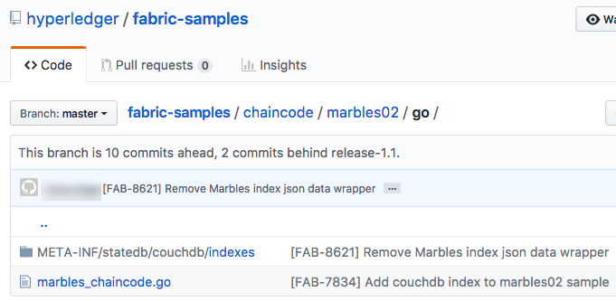

使用 CouchDB
====================

本教程将讲述在 Hyperledger Fabric 中使用 CouchDB 作为状态数据库的步骤。现在，
你应该已经熟悉 Fabric 的概念并且已经浏览了一些示例和教程。

.. note:: 这个教程使用了 Fabric v2.0 引进的新功能链码生命周期。
          如果你想要使用以前版本的生命周期模型来操作链码的索引功能，
          访问 v1.4 版本的 `使用 CouchDB <https://hyperledger-fabric.readthedocs.io/en/release-1.4/couchdb_tutorial.html>`__ .
本教程将带你按如下步骤与学习：

#. :ref:`cdb-enable-couch`
#. :ref:`cdb-create-index`
#. :ref:`cdb-add-index`
#. :ref:`cdb-install-deploy`
#. :ref:`cdb-query`
#. :ref:`cdb-best`
#. :ref:`cdb-pagination`
#. :ref:`cdb-update-index`
#. :ref:`cdb-delete-index`

想要更深入的研究 CouchDB 的话，请参阅 :doc:`couchdb_as_state_database` ，关于 Fabric 账
本的跟多信息请参阅 `Ledger <ledger/ledger.html>`_ 主题。下边的教程将详细讲述如何在你的区
块链网络中使用 CouchDB 。

本教程将使用 `Marbles sample <https://github.com/hyperledger/fabric-samples/blob/master/chaincode/marbles02/go/marbles_chaincode.go>`__ 作为演示在 Fabric 中使用 CouchDB 的用例，并且将会把 Marbles 部署在 :doc:`build_network` （BYFN）教程网络上。

为什么是 CouchDB ？
~~~~~~~~~~~~~~~~~~~~~~~~~~~~

Fabric 支持两种类型的节点数据库。LevelDB 是默认嵌入在 peer 节点的状态数据库。
LevelDB 用于将链码数据存储为简单的键-值对，仅支持键、键范围和复合键查询。CouchDB 是一
个可选的状态数据库，支持以 JSON 格式在账本上建模数据并支持富查询，以便您查询实际数据
内容而不是键。CouchDB 同样支持在链码中部署索引，以便高效查询和对大型数据集的支持。

为了发挥 CouchDB 的优势，也就是说基于内容的 JSON 查询，你的数据必须以 JSON 格式
建模。你必须在设置你的网络之前确定使用 LevelDB 还是 CouchDB 。由于数据兼容性的问
题，不支持节点从 LevelDB 切换为 CouchDB 。网络中的所有节点必须使用相同的数据库类
型。如果你想 JSON 和二进制数据混合使用，你同样可以使用 CouchDB ，但是二进制数据只
能根据键、键范围和复合键查询。

.. _cdb-enable-couch:

在 Hyperledger Fabric 中启用 CouchDB
~~~~~~~~~~~~~~~~~~~~~~~~~~~~~~~~~~~~

CouchDB 是独立于节点运行的一个数据库进程。在安装、管理和操作的时候有一些额外
的注意事项。有一个可用的 Docker 镜像 `CouchDB <https://hub.docker.com/_/couchdb/>`__
并且我们建议它和节点运行在同一个服务器上。我们需要在每一个节点上安装一个 CouchDB
容器，并且更新每一个节点的配置文件 ``core.yaml`` ，将节点指向 CouchDB 容器。
``core.yaml`` 文件的路径必须在环境变量 FABRIC_CFG_PATH 中指定：

* 对于 Docker 的部署，在节点容器中 ``FABRIC_CFG_PATH`` 指定的文件夹中的 ``core.yaml``
  是预先配置好的。如果你要使用 docker 环境，你可以通过重写 ``docker-compose-couch.yaml``
  中的环境变量来覆盖 core.yaml

* 对于原生的二进制部署， ``core.yaml`` 包含在发布的构件中。

编辑 ``core.yaml`` 中的 ``stateDatabase`` 部分。将 ``stateDatabase`` 指定为 ``CouchDB``
并且填写 ``couchDBConfig`` 相关的配置。在 Fabric 中配置 CouchDB 的更多细节，请参阅
`CouchDB 配置 <couchdb_as_state_database.html#couchdb-configuration>`__ 。

.. _cdb-create-index:

创建一个索引
~~~~~~~~~~~~~~~

为什么索引很重要？

索引可以让数据库不用在每次查询的时候都检查每一行，可以让数据库运行的更快和更高效。
一般来说，对频繁查询的数据进行索引可以使数据查询更高效。为了充分发挥 CouchDB 的优
势 -- 对 JSON 数据进行富查询的能力 -- 并不需要索引，但是为了性能考虑强烈建议建立
索引。另外，如果在一个查询中需要排序，CouchDB 需要在排序的字段有一个索引。

.. note::

   没有索引的情况下富查询也是可以使用的，但是会在 CouchDB 的日志中抛出一个没
   有找到索引的警告。如果一个富查询中包含了一个排序的说明，需要排序的那个字段
   就必须有索引；否则，查询将会失败并抛出错误。

为了演示构建一个索引，我们将会使用来自 `Marbles
sample <https://github.com/hyperledger/fabric-samples/blob/{BRANCH}/chaincode/marbles02/go/marbles_chaincode.go>`__. 的数据。
在这个例子中， Marbles 的数据结构定义如下：

.. code:: javascript

  type marble struct {
	   ObjectType string `json:"docType"` //docType is used to distinguish the various types of objects in state database
	   Name       string `json:"name"`    //the field tags are needed to keep case from bouncing around
	   Color      string `json:"color"`
           Size       int    `json:"size"`
           Owner      string `json:"owner"`
  }

在这个结构体中，（ ``docType``, ``name``, ``color``, ``size``, ``owner`` ）属性
定义了和资产相关的账本数据。 ``docType`` 属性用来在链码中区分可能需要单独查询的
不同数据类型的模式。当时使用 CouchDB 的时候，建议包含 ``docType`` 属性来区分在链
码命名空间中的每一个文档。（每一个链码都需要有他们自己的 CouchDB 数据库，也就是
说，每一个链码都有它自己的键的命名空间。）

在 Marbles 数据结构的定义中， ``docType`` 用来识别这个文档或者资产是一个弹珠资产。
同时在链码数据库中也可能存在其他文档或者资产。数据库中的文档对于这些属性值来说都是
可查询的。

当为链码查询定义一个索引的时候，每一个索引都必须定义在一个扩展名为 ``*.json`` 的文本文件中，并且索引定义的格式必须为 CouchDB 索引的 JSON 格式。

需要以下三条信息来定义一个索引：

  * `fields`: 这些是常用的查询字段
  * `name`: 索引名
  * `type`: 它的内容一般是 json

例如，这是一个对字段 ``foo`` 的一个名为 ``foo-index`` 的简单索引。

.. code:: json

    {
        "index": {
            "fields": ["foo"]
        },
        "name" : "foo-index",
        "type" : "json"
    }

可选地，设计文档（ design document ）属性 ``ddoc`` 可以写在索引的定义中。`design document <http://guide.couchdb.org/draft/design.html>`__ 是 CouchDB 结构,用于包含索引。索引可以以组的形式定义在设计文档中以提升效率，但是 CouchDB 建议每一个设计文档包含一个索引。

.. tip:: 当定义一个索引的时候，最好将 ``ddoc`` 属性和值包含在索引内。包含这个
         属性以确保在你需要的时候升级索引，这是很重要的。它还使你能够明确指定
         要在查询上使用的索引。

这里有另外一个使用 Marbles 示例定义索引的例子，在索引 ``indexOwner`` 使用了多个字段 ``docType`` 和 ``owner`` 并且包含了 ``ddoc`` 属性：

.. _indexExample:

.. code:: json

  {
    "index":{
        "fields":["docType","owner"] // Names of the fields to be queried
    },
    "ddoc":"indexOwnerDoc", // (optional) Name of the design document in which the index will be created.
    "name":"indexOwner",
    "type":"json"
  }

在上边的例子中，如果设计文档 ``indexOwnerDoc`` 不存在，当索引部署的时候会自动创建
一个。一个索引可以根据字段列表中指定的一个或者多个属性构建，而且可以定义任何属性的
组合。一个属性可以存在于同一个 docType 的多个索引中。在下边的例子中， ``index1``
只包含 ``owner`` 属性， ``index2`` 包含 ``owner 和 color`` 属性， ``index3`` 包含
``owner、 color 和 size`` 属性。另外，注意，根据 CouchDB 的建议，每一个索引的定义
都包含一个它们自己的 ``ddoc`` 值。

.. code:: json

  {
    "index":{
        "fields":["owner"] // Names of the fields to be queried
    },
    "ddoc":"index1Doc", // (optional) Name of the design document in which the index will be created.
    "name":"index1",
    "type":"json"
  }

  {
    "index":{
        "fields":["owner", "color"] // Names of the fields to be queried
    },
    "ddoc":"index2Doc", // (optional) Name of the design document in which the index will be created.
    "name":"index2",
    "type":"json"
  }

  {
    "index":{
        "fields":["owner", "color", "size"] // Names of the fields to be queried
    },
    "ddoc":"index3Doc", // (optional) Name of the design document in which the index will be created.
    "name":"index3",
    "type":"json"
  }

一般来说，你为索引字段建模应该匹配将用于查询过滤和排序的字段。对于以 JSON 格式
构建索引的更多信息请参阅 `CouchDB documentation <http://docs.couchdb.org/en/latest/api/database/find.html#db-index>`__ 。

关于索引最后要说的是，Fabric 在数据库中为文档建立索引的时候使用一种成为 ``索引升温
（index warming）`` 的模式。 CouchDB 直到下一次查询的时候才会索引新的或者更新的
文档。Fabric 通过在每一个数据区块提交完之后请求索引更新的方式，来确保索引处于 ‘热
（warm）’ 状态。这就确保了查询速度快，因为在运行查询之前不用索引文档。这个过程保
持了索引的现状，并在每次新数据添加到状态数据的时候刷新。

.. _cdb-add-index:

将索引添加到你的链码文件夹
~~~~~~~~~~~~~~~~~~~~~~~~~~~~~~~~~~~~~~

当你完成索引之后，你需要把它打包到你的链码中，以便于将它部署到合适的元数据文件夹。你可以使用 :doc:`commands/peerlifecycle` 命令安装链码。JSON 索引文件必须放在链码目录的 ``META-INF/statedb/couchdb/indexes`` 路径下。

下边的 `Marbles 示例 <https://github.com/hyperledger/fabric-samples/tree/master/chaincode/marbles02/go>`__ 展示了如何将索引打包到链码中。

这个例子包含了一个名为 indexOwnerDoc 的索引:

.. code:: json

  {"index":{"fields":["docType","owner"]},"ddoc":"indexOwnerDoc", "name":"indexOwner","type":"json"}

启动网络
-----------------

:guilabel:`Try it yourself`

我们将会启动一个 Fabric 测试网络并且使用它来部署 marbles 链码。
使用下面的命令导航到 Fabric samples 中的目录 `test-network` ：

.. code:: bash

    cd fabric-samples/test-network

对于这个教程，我们希望在一个已知的初始状态进行操作。
下面的命令会删除正在进行的或停止的 docker 容器并且移除之前生成的构件：

.. code:: bash

    ./network.sh down

如果你之前从没运行过这个教程，在我们部署链码到网络之前你需要使用 vendor 来安装链码的依赖文件。
运行以下的命令：

.. code:: bash

    cd ../chaincode/marbles02/go
    GO111MODULE=on go mod vendor
    cd ../../../test-network

在 `test-network` 目录中，使用以下命令部署带有 CouchDB 的测试网络：

.. code:: bash

    ./network.sh up createChannel -s couchdb

运行这个命令会创建两个使用 CouchDB 作为状态数据库的 fabric 节点。
同时也会创建一个排序节点和一个名为 ``mychannel`` 的通道

.. _cdb-install-deploy:

安装和定义链码
~~~~~~~~~~~~~~~~~~~~~~~~~~~~~~~~

客户端应用程序通过链码和区块链账本交互。所以我们需要在每一个执行和背书交易的节点上安装链码。但是在我们和链码交互之前，通道中的成员需要一致同意链码的定义，以此
来建立链码的治理。在之前的章节中，我们演示了如何将索引添加到链码文件夹中以便索引和链码部署在一起。

链码在安装到 Peer 节点之前需要打包。我们可以使用 `peer lifecycle chaincode package <commands/peerlifecycle.html#peer-lifecycle-chaincode-package>`__ 命令来打包弹珠链码。

:guilabel:`Try it yourself`

1. 启动测试网络后，在你终端拷贝粘贴下面的环境变量，这样就可以使用 Org1 管理员用户和网络交互。
确保你在 `test-network` 目录中。

.. code:: bash

    export PATH=${PWD}/../bin:$PATH
    export FABRIC_CFG_PATH=${PWD}/../config/
    export CORE_PEER_TLS_ENABLED=true
    export CORE_PEER_LOCALMSPID="Org1MSP"
    export CORE_PEER_TLS_ROOTCERT_FILE=${PWD}/organizations/peerOrganizations/org1.example.com/peers/peer0.org1.example.com/tls/ca.crt
    export CORE_PEER_MSPCONFIGPATH=${PWD}/organizations/peerOrganizations/org1.example.com/users/Admin@org1.example.com/msp
    export CORE_PEER_ADDRESS=localhost:7051

2. 使用下面的命令来打包 marbles 链码：

.. code:: bash

    peer lifecycle chaincode package marbles.tar.gz --path ../chaincode/marbles02/go --lang golang --label marbles_1

这个命令会创建一个名为 marbles.tar.gz 的链码包。

3. 使用下面的命令来安装链码包到节点上
``peer0.org1.example.com``:

.. code:: bash

    peer lifecycle chaincode install marbles.tar.gz

一个成功的安装命令会返回链码 id ，就像下面的返回信息：

.. code:: bash

    2019-04-22 18:47:38.312 UTC [cli.lifecycle.chaincode] submitInstallProposal -> INFO 001 Installed remotely: response:<status:200 payload:"\nJmarbles_1:0907c1f3d3574afca69946e1b6132691d58c2f5c5703df7fc3b692861e92ecd3\022\tmarbles_1" >
    2019-04-22 18:47:38.312 UTC [cli.lifecycle.chaincode] submitInstallProposal -> INFO 002 Chaincode code package identifier: marbles_1:0907c1f3d3574afca69946e1b6132691d58c2f5c5703df7fc3b692861e92ecd3

安装链码到 ``peer0.org1.example.com`` 后，我们需要让 Org1 同意链码定义。

4. 使用下面的命令来用你的当前节点查询已安装链码的 package ID 。

.. code:: bash

    peer lifecycle chaincode queryinstalled

这个命令会返回和安装命令相同的 package ID 。
你应该看到类似下面的输出：

.. code:: bash

    Installed chaincodes on peer:
    Package ID: marbles_1:60ec9430b221140a45b96b4927d1c3af736c1451f8d432e2a869bdbf417f9787, Label: marbles_1

5. 将 package ID 声明为一个环境变量。
将 ``peer lifecycle chaincode queryinstalled`` 命令返回的 marbles_1 的 package ID 粘贴到下面的命令中。
package ID 不是所有用户都一样，所以你需要使用终端返回的 package ID 来完成这个步骤。

.. code:: bash

    export CC_PACKAGE_ID=marbles_1:60ec9430b221140a45b96b4927d1c3af736c1451f8d432e2a869bdbf417f9787

6. 使用下面的命令让 Org1 同意 marbles 链码定义。

.. code:: bash

    export ORDERER_CA=${PWD}/organizations/ordererOrganizations/example.com/orderers/orderer.example.com/msp/tlscacerts/tlsca.example.com-cert.pem
    peer lifecycle chaincode approveformyorg -o localhost:7050 --ordererTLSHostnameOverride orderer.example.com --channelID mychannel --name marbles --version 1.0 --signature-policy "OR('Org1MSP.member','Org2MSP.member')" --init-required --package-id $CC_PACKAGE_ID --sequence 1 --tls --cafile $ORDERER_CA

命令成功运行的时候你应该看到和下面类似的信息：

.. code:: bash

    2020-01-07 16:24:20.886 EST [chaincodeCmd] ClientWait -> INFO 001 txid [560cb830efa1272c85d2f41a473483a25f3b12715d55e22a69d55abc46581415] committed with status (VALID) at

在链码定义提交之前，我们需要大多数组织同意链码定义。这意味着我们需要 Org2 也同意该链码定义。因为我们不需要 Org2 背书链码并且不安装链码包到 Org2 的节点，所以 packageID 作为链码定义的一部分，我们不需要向 Org2 提供它。

7. 让终端使用 Org2 管理员身份操作。将下面的命令一起拷贝粘贴到节点容器并且一次性全部运行。

.. code:: bash

    export CORE_PEER_LOCALMSPID="Org2MSP"
    export CORE_PEER_TLS_ROOTCERT_FILE=${PWD}/organizations/peerOrganizations/org2.example.com/peers/peer0.org2.example.com/tls/ca.crt
    export CORE_PEER_MSPCONFIGPATH=${PWD}/organizations/peerOrganizations/org2.example.com/users/Admin@org2.example.com/msp
    export CORE_PEER_ADDRESS=localhost:9051

8. 使用下面的命令让 Org2 同意链码定义：

.. code:: bash

    peer lifecycle chaincode approveformyorg -o localhost:7050 --ordererTLSHostnameOverride orderer.example.com --channelID mychannel --name marbles --version 1.0 --signature-policy "OR('Org1MSP.member','Org2MSP.member')" --init-required --sequence 1 --tls --cafile $ORDERER_CA

9. 现在我们可以使用 `peer lifecycle chaincode commit <commands/peerlifecycle.html#peer-lifecycle-chaincode-commit>`__  命令来提交链码定义到通道：

.. code:: bash

    export ORDERER_CA=${PWD}/organizations/ordererOrganizations/example.com/orderers/orderer.example.com/msp/tlscacerts/tlsca.example.com-cert.pem
    export ORG1_CA=${PWD}/organizations/peerOrganizations/org1.example.com/peers/peer0.org1.example.com/tls/ca.crt
    export ORG2_CA=${PWD}/organizations/peerOrganizations/org2.example.com/peers/peer0.org2.example.com/tls/ca.crt
    peer lifecycle chaincode commit -o localhost:7050 --ordererTLSHostnameOverride orderer.example.com --channelID mychannel --name marbles --version 1.0 --sequence 1 --signature-policy "OR('Org1MSP.member','Org2MSP.member')" --init-required --tls --cafile $ORDERER_CA --peerAddresses localhost:7051 --tlsRootCertFiles $ORG1_CA --peerAddresses localhost:9051 --tlsRootCertFiles $ORG2_CA

提交交易成功的时候你应该看到类似下面的信息：

.. code:: bash

    2019-04-22 18:57:34.274 UTC [chaincodeCmd] ClientWait -> INFO 001 txid [3da8b0bb8e128b5e1b6e4884359b5583dff823fce2624f975c69df6bce614614] committed with status (VALID) at peer0.org2.example.com:9051
    2019-04-22 18:57:34.709 UTC [chaincodeCmd] ClientWait -> INFO 002 txid [3da8b0bb8e128b5e1b6e4884359b5583dff823fce2624f975c69df6bce614614] committed with status (VALID) at peer0.org1.example.com:7051

10. 因为 marbles 链码包含一个初始化函数，所以在我们使用链码其他函数前需要使用 `peer chaincode invoke <commands/peerchaincode.html?%20chaincode%20instantiate#peer-chaincode-invoke>`__ 命令调用 ``Init()`` ：

.. code:: bash

    peer chaincode invoke -o localhost:7050 --ordererTLSHostnameOverride orderer.example.com --channelID mychannel --name marbles --isInit --tls --cafile $ORDERER_CA --peerAddresses localhost:7051 --tlsRootCertFiles $ORG1_CA -c '{"Args":["Init"]}'

验证部署的索引
-------------------------

当链码在节点上安装并且在通道上部署完成之后，索引会被部署到每一个节点的 CouchDB
状态数据库上。你可以通过检查 Docker 容器中的节点日志来确认 CouchDB 是否被创建成功。

:guilabel:`Try it yourself`

 为了查看节点 Docker 容器的日志，打开一个新的终端窗口，然后运行下边的命令来匹配索 引被创建的确认信息。

::

   docker logs peer0.org1.example.com  2>&1 | grep "CouchDB index"

你将会看到类似下边的结果：

::

   [couchdb] CreateIndex -> INFO 0be Created CouchDB index [indexOwner] in state database [mychannel_marbles] using design document [_design/indexOwnerDoc]

.. note:: 如果 Marbles 没有安装在节点 ``peer0.org1.example.com`` 上，你可
           能需要切换到其他的安装了 Marbles 的节点。

.. _cdb-query:

查询 CouchDB 状态数据库
~~~~~~~~~~~~~~~~~~~~~~~~~~~~~~~~

现在索引已经在 JSON 中定义了并且和链码部署在了一起，链码函数可以对 CouchDB 状态数据库执行 JSON 查询，同时 peer 命令可以调用链码函数。

在查询的时候指定索引的名字是可选的。如果不指定，同时索引已经在被查询的字段上存在了，已存在的索引会自动被使用。

.. tip:: 在查询的时候使用 ``use_index`` 关键字包含一个索引名字是一个好的习惯。如果
         不使用索引名，CouchDB 可能不会使用最优的索引。而且 CouchDB 也可能会不使用
         索引，但是在测试期间数据少的化你很难意识到。只有在数据量大的时候，你才可能
         会意识到因为 CouchDB 没有使用索引而导致性能较低。

在链码中构建一个查询
----------------------------

你可以使用链码中定义的富查询来查询账本上的数据。 `marbles02 示例 <https://github.com/hyperledger/fabric-samples/blob/master/chaincode/marbles02/go/marbles_chaincode.go>`__ 中包含了两个富查询方法：

  * **queryMarbles** --

      一个 **富查询** 示例。这是一个可以将一个（选择器）字符串传入函数的查询。
      这个查询对于需要在运行时动态创建他们自己的选择器的客户端应用程序很有用。
      跟多关于选择器的信息请参考 `CouchDB selector syntax <http://docs.couchdb.org/en/latest/api/database/find.html#find-selectors>`__ 。

  * **queryMarblesByOwner** --

      一个查询逻辑保存在链码中的**参数查询**的示例。在这个例子中，函数值接受单个参数，
      就是弹珠的主人。然后使用 JSON 查询语法查询状态数据库中匹配 “marble” 的 docType
      和 拥有者 id 的 JSON 文档。

使用 peer 命令运行查询
------------------------------------

由于缺少一个客户端程序，我们可以使用节点命令来测试链码中定义的查询函数。我们将自定义 `peer chaincode query <commands/peerchaincode.html?%20chaincode%20query#peer-chaincode-query>`__
命令来使用Marbles索引 ``indexOwner`` 并且使用 ``queryMarbles`` 函数查询所有 marbles 中拥有者是 "tom" 的 marble 。

:guilabel:`Try it yourself`

在查询数据库之前，我们应该添加些数据。运行下面的命令使用 Org1 创建一个拥有者是 "tom" 的 marble ：

.. code:: bash

    export CORE_PEER_LOCALMSPID="Org1MSP"
    export CORE_PEER_TLS_ROOTCERT_FILE=${PWD}/organizations/peerOrganizations/org1.example.com/peers/peer0.org1.example.com/tls/ca.crt
    export CORE_PEER_MSPCONFIGPATH=${PWD}/organizations/peerOrganizations/org1.example.com/users/Admin@org1.example.com/msp
    export CORE_PEER_ADDRESS=localhost:7051
    peer chaincode invoke -o localhost:7050 --ordererTLSHostnameOverride orderer.example.com --tls --cafile ${PWD}/organizations/ordererOrganizations/example.com/orderers/orderer.example.com/msp/tlscacerts/tlsca.example.com-cert.pem -C mychannel -n marbles -c '{"Args":["initMarble","marble1","blue","35","tom"]}'

当链码实例化后，然后部署索引，索引就可以自动被链码的查询使用。CouchDB 可以根 据查询的字段决定使用哪个索引。如果这个查询准则存在索引，它就会被使用。但是建议在查询的时候指定 ``use_index`` 关键字。下边的 peer 命令就是一个如何通过在选择器语法中包含 ``use_index`` 关键字来明确地指定索引的例子：

.. code:: bash

   // Rich Query with index name explicitly specified:
   peer chaincode query -C mychannel -n marbles -c '{"Args":["queryMarbles", "{\"selector\":{\"docType\":\"marble\",\"owner\":\"tom\"}, \"use_index\":[\"_design/indexOwnerDoc\", \"indexOwner\"]}"]}'

详细看一下上边的查询命令，有三个参数值得关注：

*  ``queryMarbles``

  Marbles 链码中的函数名称。注意使用了一个 `shim <https://godoc.org/github.com/hyperledger/fabric-chaincode-go/shim>`__
  ``shim.ChaincodeStubInterface`` 来访问和修改账本。 ``getQueryResultForQueryString()``
  传递 queryString 给 shim API ``getQueryResult()``。

.. code:: bash

  func (t *SimpleChaincode) queryMarbles(stub shim.ChaincodeStubInterface, args []string) pb.Response {

	  //   0
	  // "queryString"
	   if len(args) < 1 {
		   return shim.Error("Incorrect number of arguments. Expecting 1")
	   }

	   queryString := args[0]

	   queryResults, err := getQueryResultForQueryString(stub, queryString)
	   if err != nil {
		 return shim.Error(err.Error())
	   }
	   return shim.Success(queryResults)
  }

*  ``{"selector":{"docType":"marble","owner":"tom"}``

  这是一个 **ad hoc 选择器** 字符串的示例，用来查找所有 ``owner`` 属性值为 ``tom``
  的 ``marble`` 的文档。

*  ``"use_index":["_design/indexOwnerDoc", "indexOwner"]``

  指定设计文档名 ``indexOwnerDoc`` 和索引名 ``indexOwner`` 。在这个示例中，查询
  选择器通过指定 ``use_index`` 关键字明确包含了索引名。回顾一下上边的索引定义 :ref:`cdb-create-index` ，
  它包含了设计文档， ``"ddoc":"indexOwnerDoc"`` 。在 CouchDB 中，如果你想在查询
  中明确包含索引名，在索引定义中必须包含 ``ddoc`` 值，然后它才可以被 ``use_index``
  关键字引用。

利用索引的查询成功后返回如下结果：

.. code:: json

  Query Result: [{"Key":"marble1", "Record":{"color":"blue","docType":"marble","name":"marble1","owner":"tom","size":35}}]

.. _cdb-best:

查询和索引的最佳实践
~~~~~~~~~~~~~~~~~~~~~~~~~~~~~~~~~~~~~~~~~~

由于不必扫描整个数据库，couchDB 中使用索引的查询会完成的更快。理解索引的机制会使你在网络中写出更高性能的查询语句并帮你的应用程序处理更大的数据或区块。

规划好安装在你链码上的索引同样重要。你应该每个链码只安装少量能支持大部分查询的索引。
添加太多索引或索引使用过多的字段会降低你网络的性能。这是因为每次区块提交后都会更新索引。
"索引升温( index warming )"需要更新的索引越多，完成交易的时间就越长。

这部分的案例有助于演示查询该如何使用索引，什么类型的查询拥有最好的性能。当你写查询的时候记得下面几点：

* 使用的索引中所有字段必须同样包含在选择器和排序部分。
* 越复杂的查询性能越低并且使用索引的几率也越低。
* 你应该尽量避免会引起全表查询或全索引查询的操作符，比如： ``$or``, ``$in`` and ``$regex`` 。

在教程的前面章节，你已经对 marbles 链码执行了下面的查询：

.. code:: bash

  // Example one: query fully supported by the index
  export CHANNEL_NAME=mychannel
  peer chaincode query -C $CHANNEL_NAME -n marbles -c '{"Args":["queryMarbles", "{\"selector\":{\"docType\":\"marble\",\"owner\":\"tom\"}, \"use_index\":[\"indexOwnerDoc\", \"indexOwner\"]}"]}'

Marbles 链码已经安装了 ``indexOwnerDoc`` 索引：

.. code:: json

  {"index":{"fields":["docType","owner"]},"ddoc":"indexOwnerDoc", "name":"indexOwner","type":"json"}

注意查询中的字段 ``docType`` 和 ``owner`` 都包含在索引中，这使得该查询成为一个完全支持查询（ fully supported query ）。
因此这个查询能使用索引中的数据，不需要搜索整个数据库。像这样的完全支持查询比你链码中的其他查询返回地更快。

如果你在上述查询中添加了额外字段，它仍会使用索引。然后，查询会另外在索引数据中查找符合额外字段的数据，导致相应时间变长。
下面的例子中查询仍然使用索引，但是会比前面的查询返回更慢。

.. code:: bash

  // Example two: query fully supported by the index with additional data
  peer chaincode query -C $CHANNEL_NAME -n marbles -c '{"Args":["queryMarbles", "{\"selector\":{\"docType\":\"marble\",\"owner\":\"tom\",\"color\":\"red\"}, \"use_index\":[\"/indexOwnerDoc\", \"indexOwner\"]}"]}'

没有包含全部索引字段的查询会查询整个数据库。举个例子，下面的查询使用 owner 字段查找数据，
没有指定该项拥有的类型。因为索引 ownerIndexDoc 包含两个字段 ``owner`` 和 ``docType`` ，
所以下面的查询不会使用索引。

.. code:: bash

  // Example three: query not supported by the index
  peer chaincode query -C $CHANNEL_NAME -n marbles -c '{"Args":["queryMarbles", "{\"selector\":{\"owner\":\"tom\"}, \"use_index\":[\"indexOwnerDoc\", \"indexOwner\"]}"]}'

一般来说，越复杂的查询返回的时间就越长，并且使用索引的概率也越低。
操作符 ``$or``, ``$in`` 和 ``$regex`` 会常常使得查询搜索整个索引或者根本不使用索引。

举个例子，下面的查询包含了条件 ``$or`` 使得查询会搜索每一个 marble 和每一条拥有者是 tom 的数据。

.. code:: bash

  // Example four: query with $or supported by the index
  peer chaincode query -C $CHANNEL_NAME -n marbles -c '{"Args":["queryMarbles", "{\"selector\":{\"$or\":[{\"docType\":\"marble\"},{\"owner\":\"tom\"}]}, \"use_index\":[\"indexOwnerDoc\", \"indexOwner\"]}"]}'

这个查询仍然会使用索引，因为它查找的字段都包含在索引 ``indexOwnerDoc`` 中。然而查询中的条件 ``$or`` 需要扫描索引中
所有的项，导致响应时间变长。 

索引不支持下面这个复杂查询的例子。

.. code:: bash

  // Example five: Query with $or not supported by the index
  peer chaincode query -C $CHANNEL_NAME -n marbles -c '{"Args":["queryMarbles", "{\"selector\":{\"$or\":[{\"docType\":\"marble\",\"owner\":\"tom\"},{\"color\":\"yellow\"}]}, \"use_index\":[\"indexOwnerDoc\", \"indexOwner\"]}"]}'

这个查询搜索所有拥有者是 tom 的 marbles 或其它颜色是黄色的项。 这个查询不会使用索引因为它需要查找
整个表来匹配条件 ``$or``。根据你账本的数据量，这个查询会很久才会响应或者可能超时。

虽然遵循查询的最佳实践非常重要，但是使用索引不是查询大量数据的解决方案。区块链的数据结构优化了
校验和确定交易，但不适合数据分析或报告。如果你想要构建一个仪表盘（ dashboard ）作为应用程序的一部分或分析网络的
数据，最佳实践是查询一个从你节点复制了数据的离线区块链数据库。这样可以使你了解区块链上的数据并且不会降低
网络的性能或中断交易。

你可以使用来自你应用程序的区块或链码事件来写入交易数据到一个离线的链数据库或分析引擎。
对于每一个接收到的区块，区块监听应用将遍历区块中的每一个交易并根据每一个有效交易的 ``读写集`` 中的键值对构建一个数据存储。
文档 :doc:`peer_event_services` 提供了可重放事件，以确保下游数据存储的完整性。有关如何使用事件监听器将数据写入外部数据库的例子，
访问 Fabric Samples 的 `Off chain data sample <https://github.com/hyperledger/fabric-samples/tree/{BRANCH}/off_chain_data>`__

.. _cdb-pagination:

在 CouchDB 状态数据库查询中使用分页
~~~~~~~~~~~~~~~~~~~~~~~~~~~~~~~~~~~~~~~~~~~~~~~~

当 CouchDB 的查询返回了一个很大的结果集时，有一些将结果分页的 API 可以提供给链码调用。分
页提供了一个将结果集合分区的机制，该机制指定了一个 ``pagesize`` 和起始点 -- 一个从结果集
合的哪里开始的 ``书签`` 。客户端应用程序以迭代的方式调用链码来执行查询，直到没有更多的结
果返回。更多信息请参考 `topic on pagination with CouchDB <couchdb_as_state_database.html#couchdb-pagination>`__ 。

我们将使用 `Marbles sample <https://github.com/hyperledger/fabric-samples/blob/master/chaincode/marbles02/go/marbles_chaincode.go>`__
中的函数 ``queryMarblesWithPagination`` 来演示在链码和客户端应用程序中如何使用分页。

* **queryMarblesWithPagination** --

    一个 **使用分页的 ad hoc 富查询** 的示例。这是一个像上边的示例一样，可以将一个（选择器）
    字符串传入函数的查询。在这个示例中，在查询中也包含了一个 ``pageSize`` 作为一个 ``书签`` 。

为了演示分页，需要更多的数据。本例假设你已经加入了 marble1 。在节点容器中执行下边的命令创建
4 个 “tom” 的弹珠，这样就创建了 5 个 “tom” 的弹珠：

:guilabel:`Try it yourself`

.. code:: bash

    export CORE_PEER_LOCALMSPID="Org1MSP"
    export CORE_PEER_TLS_ROOTCERT_FILE=${PWD}/organizations/peerOrganizations/org1.example.com/peers/peer0.org1.example.com/tls/ca.crt
    export CORE_PEER_MSPCONFIGPATH=${PWD}/organizations/peerOrganizations/org1.example.com/users/Admin@org1.example.com/msp
    export CORE_PEER_ADDRESS=localhost:7051
    peer chaincode invoke -o localhost:7050 --ordererTLSHostnameOverride orderer.example.com --tls --cafile  ${PWD}/organizations/ordererOrganizations/example.com/orderers/orderer.example.com/msp/tlscacerts/tlsca.example.com-cert.pem -C mychannel -n marbles -c '{"Args":["initMarble","marble2","yellow","35","tom"]}'
    peer chaincode invoke -o localhost:7050 --ordererTLSHostnameOverride orderer.example.com --tls --cafile  ${PWD}/organizations/ordererOrganizations/example.com/orderers/orderer.example.com/msp/tlscacerts/tlsca.example.com-cert.pem -C mychannel -n marbles -c '{"Args":["initMarble","marble3","green","20","tom"]}'
    peer chaincode invoke -o localhost:7050 --ordererTLSHostnameOverride orderer.example.com --tls --cafile  ${PWD}/organizations/ordererOrganizations/example.com/orderers/orderer.example.com/msp/tlscacerts/tlsca.example.com-cert.pem -C mychannel -n marbles -c '{"Args":["initMarble","marble4","purple","20","tom"]}'
    peer chaincode invoke -o localhost:7050 --ordererTLSHostnameOverride orderer.example.com --tls --cafile  ${PWD}/organizations/ordererOrganizations/example.com/orderers/orderer.example.com/msp/tlscacerts/tlsca.example.com-cert.pem -C mychannel -n marbles -c '{"Args":["initMarble","marble5","blue","40","tom"]}'

除了上边示例中的查询参数， queryMarblesWithPagination 增加了 ``pagesize`` 和 ``bookmark`` 。
``PageSize`` 指定了每次查询返回结果的数量。 ``bookmark`` 是一个用来告诉 CouchDB 从每一页从
哪开始的 “锚（anchor）” 。（结果的每一页都返回一个唯一的书签）

*  ``queryMarblesWithPagination``

  Marbles 链码中函数的名称。注意 `shim <https://godoc.org/github.com/hyperledger/fabric-chaincode-go/shim>`__
  ``shim.ChaincodeStubInterface`` 用于访问和修改账本。 ``getQueryResultForQueryStringWithPagination()``
  将 queryString 、 pagesize 和 bookmark 传递给 shim API ``GetQueryResultWithPagination()`` 。

.. code:: bash

  func (t *SimpleChaincode) queryMarblesWithPagination(stub shim.ChaincodeStubInterface, args []string) pb.Response {

  	//   0
  	// "queryString"
  	if len(args) < 3 {
  		return shim.Error("Incorrect number of arguments. Expecting 3")
  	}

  	queryString := args[0]
  	//return type of ParseInt is int64
  	pageSize, err := strconv.ParseInt(args[1], 10, 32)
  	if err != nil {
  		return shim.Error(err.Error())
  	}
  	bookmark := args[2]

  	queryResults, err := getQueryResultForQueryStringWithPagination(stub, queryString, int32(pageSize), bookmark)
  	if err != nil {
  		return shim.Error(err.Error())
  	}
  	return shim.Success(queryResults)
  }

下边的例子是一个 peer 命令，以 pageSize 为 ``3`` 没有指定 boomark 的方式调用 queryMarblesWithPagination 。

.. tip:: 当没有指定 bookmark 的时候，查询从记录的“第一”页开始。

:guilabel:`Try it yourself`

.. code:: bash

  // Rich Query with index name explicitly specified and a page size of 3:
  peer chaincode query -C $CHANNEL_NAME -n marbles -c '{"Args":["queryMarblesWithPagination", "{\"selector\":{\"docType\":\"marble\",\"owner\":\"tom\"}, \"use_index\":[\"_design/indexOwnerDoc\", \"indexOwner\"]}","3",""]}'

下边是接收到的响应（为清楚起见，增加了换行），返回了五个弹珠中的三个，因为 ``pagesize`` 设置成了 ``3`` 。

.. code:: bash

  [{"Key":"marble1", "Record":{"color":"blue","docType":"marble","name":"marble1","owner":"tom","size":35}},
   {"Key":"marble2", "Record":{"color":"yellow","docType":"marble","name":"marble2","owner":"tom","size":35}},
   {"Key":"marble3", "Record":{"color":"green","docType":"marble","name":"marble3","owner":"tom","size":20}}]
  [{"ResponseMetadata":{"RecordsCount":"3",
  "Bookmark":"g1AAAABLeJzLYWBgYMpgSmHgKy5JLCrJTq2MT8lPzkzJBYqz5yYWJeWkGoOkOWDSOSANIFk2iCyIyVySn5uVBQAGEhRz"}}]

.. note::  Bookmark 是 CouchDB 每次查询的时候唯一生成的，并显示在结果集中。将返回的 bookmark 传递给迭代查询的子集中来获取结果的下一个集合。

下边是一个 pageSize 为 ``3`` 的调用 queryMarblesWithPagination 的 peer 命令。
注意一下这里，这次的查询包含了上次查询返回的 bookmark 。

:guilabel:`Try it yourself`

.. code:: bash

  peer chaincode query -C $CHANNEL_NAME -n marbles -c '{"Args":["queryMarblesWithPagination", "{\"selector\":{\"docType\":\"marble\",\"owner\":\"tom\"}, \"use_index\":[\"_design/indexOwnerDoc\", \"indexOwner\"]}","3","g1AAAABLeJzLYWBgYMpgSmHgKy5JLCrJTq2MT8lPzkzJBYqz5yYWJeWkGoOkOWDSOSANIFk2iCyIyVySn5uVBQAGEhRz"]}'

下边是接收到的响应（为清楚起见，增加了换行），返回了五个弹珠中的三个，返回了剩下的两个记录：

.. code:: bash

  [{"Key":"marble4", "Record":{"color":"purple","docType":"marble","name":"marble4","owner":"tom","size":20}},
   {"Key":"marble5", "Record":{"color":"blue","docType":"marble","name":"marble5","owner":"tom","size":40}}]
  [{"ResponseMetadata":{"RecordsCount":"2",
  "Bookmark":"g1AAAABLeJzLYWBgYMpgSmHgKy5JLCrJTq2MT8lPzkzJBYqz5yYWJeWkmoKkOWDSOSANIFk2iCyIyVySn5uVBQAGYhR1"}}]

最后一个命令是调用 queryMarblesWithPagination 的 peer 命令，其中 pageSize 为 ``3`` ，bookmark 是前一次查询返回的结果。

:guilabel:`Try it yourself`

.. code:: bash

    peer chaincode query -C $CHANNEL_NAME -n marbles -c '{"Args":["queryMarblesWithPagination", "{\"selector\":{\"docType\":\"marble\",\"owner\":\"tom\"}, \"use_index\":[\"_design/indexOwnerDoc\", \"indexOwner\"]}","3","g1AAAABLeJzLYWBgYMpgSmHgKy5JLCrJTq2MT8lPzkzJBYqz5yYWJeWkmoKkOWDSOSANIFk2iCyIyVySn5uVBQAGYhR1"]}'

下边是接收到的响应（为清楚起见，增加了换行）。没有记录返回，说明所有的页
面都获取到了：

.. code:: bash

    []
    [{"ResponseMetadata":{"RecordsCount":"0",
    "Bookmark":"g1AAAABLeJzLYWBgYMpgSmHgKy5JLCrJTq2MT8lPzkzJBYqz5yYWJeWkmoKkOWDSOSANIFk2iCyIyVySn5uVBQAGYhR1"}}]

对于如何使用客户端应用程序使用分页迭代结果集，请在
`Marbles sample <https://github.com/hyperledger/fabric-samples/blob/master/chaincode/marbles02/go/marbles_chaincode.go>`__ 。
中搜索 ``getQueryResultForQueryStringWithPagination`` 函数。

.. _cdb-update-index:

升级索引
~~~~~~~~~~~~~~~

可能需要随时升级索引。相同的索引可能会存在安装的链码的子版本中。为了索引的升级，
原来的索引定义必须包含在设计文档 ``ddoc`` 属性和索引名。为了升级索引定义，使用相
同的索引名并改变索引定义。简单编辑索引 JSON 文件并从索引中增加或者删除字段。 Fabric
只支持 JSON 类型的索引。不支持改变索引类型。升级后的索引定义在链码定义提交之后
会重新部署在节点的状态数据库中。

.. note:: 如果状态数据库有大量数据，重建索引的过程会花费较长时间，在此期间链码执
          行或者查询可能会失败或者超时。

迭代索引定义
----------------------------------

如果你在开发环境中访问你的节点的 CouchDB 状态数据库，你可以迭代测试各种索引以支
持你的链码查询。链码的任何改变都可能需要重新部署。使用 `CouchDB Fauxton interface <http://docs.couchdb.org/en/latest/fauxton/index.html>`__
或者命令行 curl 工具来创建和升级索引。

.. note:: Fauxton 是用于创建、升级和部署 CouchDB 索引的一个网页，如果你想尝试这个接口，
          有一个 Marbles 示例中索引的 Fauxton 版本格式的例子。如果你使用 CouchDB 部署了测试网络，可以通过在浏览器的导航栏中打开 ``http://localhost:5984/_utils`` 来
          访问 Fauxton 。

另外，如果你不想使用 Fauxton UI，下边是通过 curl 命令在 ``mychannel_marbles`` 数据库上创
建索引的例子：

.. code:: bash

  // Index for docType, owner.
  // Example curl command line to define index in the CouchDB channel_chaincode database
   curl -i -X POST -H "Content-Type: application/json" -d
          "{\"index\":{\"fields\":[\"docType\",\"owner\"]},
            \"name\":\"indexOwner\",
            \"ddoc\":\"indexOwnerDoc\",
            \"type\":\"json\"}" http://hostname:port/mychannel_marbles/_index

.. note:: 如果你在测试网络中配置了 CouchDB，请使用 ``localhost:5984`` 替换 hostname:port 。

.. _cdb-delete-index:

删除索引
~~~~~~~~~~~~~~~

Fabric 工具不能删除索引。如果你需要删除索引，就要手动使用 curl 命令或者 Fauxton 接
口操作数据库。

删除索引的 curl 命令格式如下：

.. code:: bash

   curl -X DELETE http://localhost:5984/{database_name}/_index/{design_doc}/json/{index_name} -H  "accept: */*" -H  "Host: localhost:5984"

要删除本教程中的索引，curl 命令应该是：

.. code:: bash

   curl -X DELETE http://localhost:5984/mychannel_marbles/_index/indexOwnerDoc/json/indexOwner -H  "accept: */*" -H  "Host: localhost:5984"

.. Licensed under Creative Commons Attribution 4.0 International License
   https://creativecommons.org/licenses/by/4.0/
