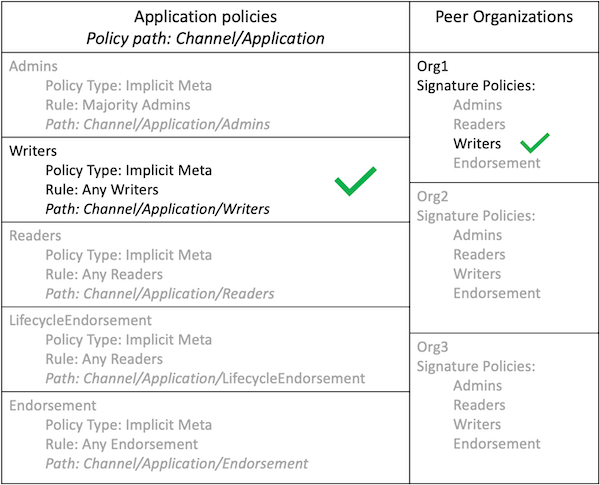
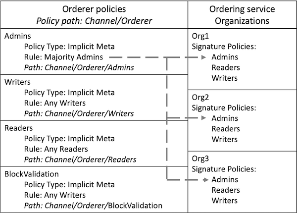

# 通道策略

通道是组织之间进行通信的一种私有方法。因此，通道配置的大多数更改都需要该通道的其他成员同意。如果一个组织可以在未经其他组织批准的情况下加入该通道并读取账上的数据，则通道将没有作用。通道**组织结构**的任何更改都必须由一组能够满足通道策略的组织批准。

策略还控制用户如何与通道交互的**过程**，例如在将链码部署到通道之前需要一些组织批准或着需要由通道管理员完成一些操作。

通道策略非常重要，因此需要在单独的主题中进行讨论。与通道配置的其他部分不同，控制通道的策略由`configtx.yaml`文件的不同部分组合起来才能确定。尽管可以在几乎没有任何约束的情况下为任何场景配置通道策略，但本主题将重点介绍如何使用Hyperledger Fabric提供的默认策略。如果您使用Fabric测试网络或[Fabric示例配置](https://github.com/hyperledger/fabric/blob/{BRANCH}/sampleconfig/configtx.yaml)使用的默认策略，则您创建的每个通道都会使用签名策略，ImplicitMeta策略和访问控制列表的组合来确定组织如何与通道进行交互并同意更新通道结构。您可以通过访问[主题：策略概念](../policies.html)了解有关Hyperledger Fabric中策略角色的更多信息。

## 签名策略

默认情况下，每个通道成员都定义了一组引用其组织的签名策略。当提案提交给Peer或交易提交给Orderer节点时，节点将读取附加到交易上的签名，并根据通道配置中定义的签名策略对它们进行评估。每个签名策略都有一个规则，该规则指定了一组签名可以满足该策略的组织和身份。您可以在下面`configtx.yaml`中的**Organizations**部分中看到由Org1定义的签名策略：
```yaml
- &Org1

  ...

  Policies:
      Readers:
          Type: Signature
          Rule: "OR('Org1MSP.admin', 'Org1MSP.peer', 'Org1MSP.client')"
      Writers:
          Type: Signature
          Rule: "OR('Org1MSP.admin', 'Org1MSP.client')"
      Admins:
          Type: Signature
          Rule: "OR('Org1MSP.admin')"
      Endorsement:
          Type: Signature
          Rule: "OR('Org1MSP.peer')"
```

上面的所有策略都可以通过Org1的签名来满足。但是，每个策略列出了组织内部能够满足该策略的一组不同的角色。`Admins`策略只能由具有管理员角色的身份提交的交易满足，而只有具有peer的身份才能满足`Endorsement`策略。附加到单笔交易上的一组签名可以满足多个签名策略。例如，如果交易附加的背书由Org1和Org2共同提供，则此签名集将满足Org1和Org2的`Endorsement`策略。

## ImplicitMeta策略

如果您的通道使用默认策略，则每个组织的签名策略将由通道配置中更高层级的ImplicitMeta策略评估。ImplicitMeta策略不是直接评估提交给通道的签名，而是使用规则在通道配置中指定可以满足该策略的一组其他策略。 如果交易可以满足该策略引用的下层签名策略集合，则它可以满足ImplicitMeta策略。

您可以在下面的`configtx.yaml`文件的**Application**部分中看到定义的ImplicitMeta策略：
```yaml
Policies:
    Readers:
        Type: ImplicitMeta
        Rule: "ANY Readers"
    Writers:
        Type: ImplicitMeta
        Rule: "ANY Writers"
    Admins:
        Type: ImplicitMeta
        Rule: "MAJORITY Admins"
    LifecycleEndorsement:
        Type: ImplicitMeta
        Rule: "MAJORITY Endorsement"
    Endorsement:
        Type: ImplicitMeta
        Rule: "MAJORITY Endorsement"
```

**Application**部分中的ImplicitMeta策略控制Peer组织如何与通道进行交互。每个策略都引用与每个通道成员关联的签名策略。您会在下面看到**Application**部分的策略与**Organization**部分的策略之间的关系：

    

*图1：Admins ImplicitMeta策略可以由每个组织定义的大多数Admins签名策略满足。*

每个策略均在通道配置中引用其路径。由于**Application**部分中的策略位于通道组内部的应用程序组中，因此它们被称为`Channel/Application`策略。由于Fabric文档中的大多数位置都是通过策略路径来引用策略的，因此在本教程的其余部分中，我们将通过策略路径来引用策略。

每个ImplicitMeta中的`Rule`均引用可以满足该策略的签名策略的名称。 例如，`Channel/Application/Admins` ImplicitMeta策略引用每个组织的`Admins`签名策略。 每个`Rule`还包含满足ImplicitMeta策略所需的签名策略的数量。例如，`Channel/Application/Admins`策略要求满足大多数`Admins`签名策略。

    

*图2：提交给该通道的通道更新请求包含来自Org1，Org2和Org3的签名，满足每个组织的签名策略。因此，该请求满足Channel/Application/Admins策略。Org3检查呈浅绿色，因为不需要签名个数达到大多数。*

再举一个例子，大多数组织的`Endorsement`策略都可以满足`Channel/Application/Endorsement`策略，这需要每个组织的Peer签名。Fabric链码生命周期将此策略用作默认链码背书策略。除非您提交链码定义时使用不同的背书策略，否则调用链码的交易必须得到大多数通道成员的认可。

    

*图3：来自客户端应用程序的交易调用了Org1和Org2的Peer上的链码。链码调用成功，并且该应用程序收到了两个组织的Peer背书。由于此交易满足Channel/Application/Endorsement策略，因此该交易符合默认的背书策略，可以添加到通道的账本中。*

同时使用ImplicitMeta策略和签名策略的优点是，您可以在通道级别设置治理规则，同时允许每个通道成员选择对其组织进行签名所需的身份。例如，通道可以指定要求大多数组织管理员给通道配置更新签名。但是，每个组织可以使用其签名策略来选择其组织中的哪些身份是管理员，甚至要求其组织中的多个身份签名才能批准通道更新。

ImplicitMeta策略的另一个优点是，在从通道中添加或删除组织时，不需要更新它们。以*图 3*为例，如果将两个新组织添加到通道，则`Channel/Application/Endorsement`将需要三个组织的背书才能验证交易。

ImplicitMeta策略的一个缺点是它们不会显式读取通道成员使用的签名策略（这就是为什么它们被称为隐式策略）的原因。相反，他们假定用户具有基于通道配置的必需签名策略。`Channel/Application/Endorsement`策略的`rule`基于通道中Peer组织的数量。如果*图 3*中的三个组织中有两个不具备`Endorsement`签名策略，则任何交易都无法获得满足`Channel/Application/Endorsement` ImplicitMeta策略所需的大多数背书。

## 通道修改策略

通道**结构**由通道配置内的修改策略控制。通道配置的每个组件都有一个修改策略，需要满足修改策略才能被通道成员更新。例如，每个组织定义的策略和通道MSP，包含通道成员的应用程序组以及定义通道共识者集合的配置组件均具有不同的修改策略。

每个修改策略都可以引用ImplicitMeta策略或签名策略。例如，如果您使用默认策略，则定义每个组织的值将引用与该组织关联的`Admins`签名策略。因此，组织可以更新其通道MSP或设置锚节点，而无需其他通道成员的批准。定义通道成员集合的应用程序组的修改策略是`Channel/Application/Admins` ImplicitMeta策略。因此，默认策略是大多数组织需要批准添加或删除通道成员。

## 通道策略和访问控制列表

通道配置中的策略也由[访问控制列表（ACLs）](../access_control.html)引用，该访问控制列表用于限制对通道使用的Fabric资源的访问。ACL扩展了通道配置内的策略，以管理通道的**进程**。您可以在[示例 configtx.yaml文件](http://github.com/hyperledger/fabric/blob/{BRANCH}/sampleconfig/configtx.yaml)中看到默认的ACL。每个ACL都使用路径引用通道策略。例如，以下ACL限制了谁可以基于`/Channel/Application/Writers`策略调用链码：
```
# ACL policy for invoking chaincodes on peer
peer/Propose: /Channel/Application/Writers
```

大多数默认ACL指向通道配置的Application部分中的ImplicitMeta策略。为了扩展上面的示例，如果组织可以满足`/Channel/Application/Writers`策略，则可以调用链码。

    

*图 4：/Channel/Application/Writers策略满足 peer/Propose ACL。可以使用任何writers签名策略的客户应用程序从任何组织提交的交易来满足此策略。*

## Orderer策略

`configtx.yaml`的**Orderer**部分中的ImplicitMeta策略以与**Application**部分管理Peer组织类似的方式来管理通道的Orderer节点。 ImplicitMeta策略指向与排序服务管理员的组织相关联的签名策略。

    

*图 5：Channel/Orderer/Admins策略指向与排序服务的管理员相关联的Admins签名策略。*

如果使用默认策略，则需要大多数Orderer组织批准添加或删除Orderer节点。

    

*图 6：提交的从通道中删除Orderer节点的请求包含来自网络中三个Orderer组织的签名，符合Channel/Orderer/Admins策略。 Org3检查为浅绿色，因为不需要签名个数达到大多数。*

Peer使用`Channel/Orderer/BlockValidation`策略来确认添加到通道的新块是由作为通道共识者集合一部分的Orderer节点生成的，并且该块未被篡改或被另一个Peer组织创建。默认情况下，任何具有`Writers`签名策略的Orderer组织都可以创建和验证通道的块。

<!--- Licensed under Creative Commons Attribution 4.0 International License
https://creativecommons.org/licenses/by/4.0/ -->
