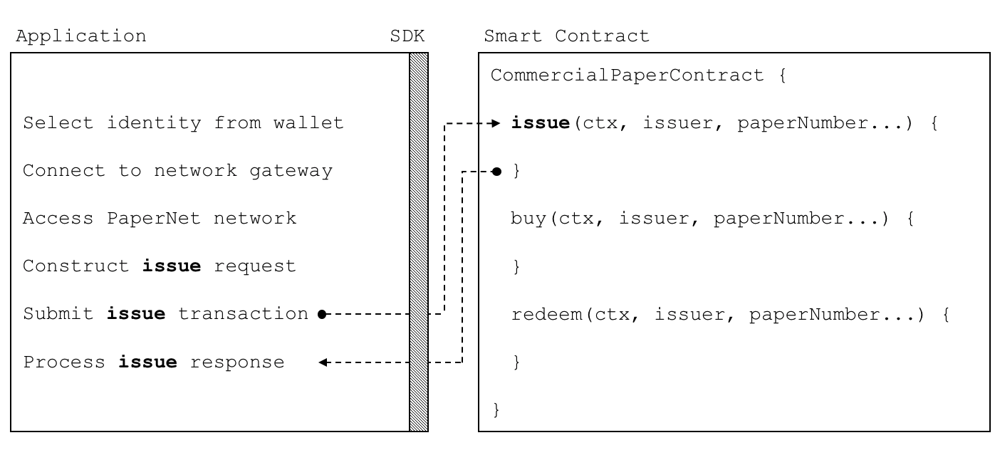

# 应用
# Application

**受众**：架构师、应用程序和智能合约开发人员

**Audience**: Architects, Application and smart contract developers

应用程序可以通过将交易提交到帐本或查询帐本内容来与区块链网络进行交互。本主题介绍了应用程序如何执行此操作的机制; 在我们的场景中，组织使用应用程序访问 PaperNet，这些应用程序调用定义在商业票据智能合约中的**发行**、**购买**和**兑换**交易。尽管 MagnetoCorp 的应用发行商业票据是基础功能，但它涵盖了所有主要的理解点。

An application can interact with a blockchain network by submitting transactions
to a ledger or querying ledger content. This topic covers the mechanics of how
an application does this; in our scenario, organizations access PaperNet using
applications which invoke **issue**, **buy** and **redeem** transactions
defined in a commercial paper smart contract. Even though MagnetoCorp's
application to issue a commercial paper is basic, it covers all the major points
of understanding.

在本主题中，我们将介绍：

In this topic, we're going to cover:

* [从应用程序到调用智能合约](#基本流程)
* [应用程序如何使用钱包和身份](#钱包)
* [应用程序如何使用网关连接](#网关)
* [如何访问特定网络](#网络通道)
* [如何构造交易请求](#构造请求)
* [如何提交交易](#提交交易)
* [如何处理交易响应](#处理响应)

* [The application flow to invoke a smart contract](#basic-flow)
* [How an application uses a wallet and identity](#wallet)
* [How an application connects using a gateway](#gateway)
* [How to access a particular network](#network-channel)
* [How to construct a transaction request](#construct-request)
* [How to submit a transaction](#submit-transaction)
* [How to process a transaction response](#process-response)

为了帮助您理解，我们将参考 Hyperledger Fabric 提供的商业票据示例应用程序。您可以[下载](../install.html) 并[在本地运行它](../tutorial/commercial_paper.html)。它是用 JavaScript 和 Java 编写的，但逻辑与语言无关，因此您可以轻松地查看正在发生的事情！（该示例也适用于 Go。）

To help your understanding, we'll make reference to the commercial paper sample
application provided with Hyperledger Fabric. You can [download
it](../install.html) and [run it locally](../tutorial/commercial_paper.html). It
is written in both JavaScript and Java, but the logic is quite language independent, so you'll
easily be able to see what's going on! (The sample will become available for  Go as well.)

## 基本流程

## Basic Flow

应用程序使用 Fabric SDK 与区块链网络交互。 以下是应用程序如何调用商业票据智能合约的简化图表：

An application interacts with a blockchain network using the Fabric SDK. Here's
a simplified diagram of how an application invokes a commercial paper smart
contract:

 *PaperNet 应用程序调用商业票据智能合约来提交发行交易请求。*

 *A PaperNet application invokes
the commercial paper smart contract to submit an issue transaction request.*

应用程序必须遵循六个基本步骤来提交交易：

An application has to follow six basic steps to submit a transaction:

* 从钱包中选择一个身份
* 连接到网关
* 访问所需的网络
* 构建智能合约的交易请求
* 将交易提交到网络
* 处理响应

* Select an identity from a wallet
* Connect to a gateway
* Access the desired network
* Construct a transaction request for a smart contract
* Submit the transaction to the network
* Process the response

您将看到典型应用程序如何使用 Fabric SDK 执行这六个步骤。 您可以在 `issue.js` 文件中找到应用程序代码。请在浏览器中[查看](https://github.com/hyperledger/fabric-samples/blob/master/commercial-paper/organization/magnetocorp/application/issue.js)，如果您已下载，请在您喜欢的编辑器中打开它。 花一些时间看一下应用程序的整体结构; 尽管有注释和空白，但是它只有100行代码！

You're going to see how a typical application performs these six steps using the
Fabric SDK. You'll find the application code in the `issue.js` file. [View
it](https://github.com/hyperledger/fabric-samples/blob/{BRANCH}/commercial-paper/organization/magnetocorp/application/issue.js)
in your browser, or open it in your favourite editor if you've downloaded it.
Spend a few moments looking at the overall structure of the application; even
with comments and spacing, it's only 100 lines of code!

## 钱包

## Wallet

在 `issue.js` 的顶部，您将看到两个 Fabric 类导入代码域：

Towards the top of `issue.js`, you'll see two Fabric classes are brought
into scope:

```JavaScript
const { FileSystemWallet, Gateway } = require('fabric-network');
```

```JavaScript
const { Wallets, Gateway } = require('fabric-network');
```

您可以在[node SDK 文档](https://hyperledger.github.io/fabric-sdk-node/master/module-fabric-network.html)中了解 `fabric-network` 类，但是现在，让我们看看如何使用它们将 MagnetoCorp 的应用程序连接到 PaperNet。该应用程序使用 Fabric **Wallet** 类，如下所示：

You can read about the `fabric-network` classes in the
[node SDK documentation](https://hyperledger.github.io/fabric-sdk-node/{BRANCH}/module-fabric-network.html), but for
now, let's see how they are used to connect MagnetoCorp's application to
PaperNet. The application uses the Fabric **Wallet** class as follows:

```JavaScript
const wallet = new FileSystemWallet('../identity/user/isabella/wallet');
```

```JavaScript
const wallet = await Wallets.newFileSystemWallet('../identity/user/isabella/wallet');
```

了解 `wallet` 如何在本地文件系统中找到[钱包](./wallet.html)。从钱包中检索到的身份显然适用于使用 `issue` 应用程序的 Isabella 用户。钱包拥有一组身份——X.509 数字证书——可用于访问 PaperNet 或任何其他 Fabric 网络。如果您运行该教程，并查看此目录，您将看到 Isabella 的身份凭证。

See how `wallet` locates a [wallet](./wallet.html) in the local filesystem. The
identity retrieved from the wallet is clearly for a user called Isabella, who is
using the `issue` application. The wallet holds a set of identities -- X.509
digital certificates -- which can be used to access PaperNet or any other Fabric
network. If you run the tutorial, and look in this directory, you'll see the
identity credentials for Isabella.

想想一个[钱包](./wallet.html)里面装着政府身份证，驾照或 ATM 卡的数字等价物。其中的 X.509 数字证书将持有者与组织相关联，从而使他们有权在网络通道中获得权利。例如， `Isabella` 可能是 MagnetoCorp 的管理员，这可能比其他用户更有特权——来自 DigiBank 的 `Balaji`。 此外，智能合约可以在使用[交易上下文](./transactioncontext.html)的智能合约处理期间检索此身份。

Think of a [wallet](./wallet.html) holding the digital equivalents of your
government ID, driving license or ATM card. The X.509 digital certificates
within it will associate the holder with a organization, thereby entitling them
to rights in a network channel. For example, `Isabella` might be an
administrator in MagnetoCorp, and this could give her more privileges than a
different user -- `Balaji` from DigiBank.  Moreover, a smart contract can
retrieve this identity during smart contract processing using the [transaction
context](./transactioncontext.html).

另请注意，钱包不持有任何形式的现金或代币——它们持有身份。

Note also that wallets don't hold any form of cash or tokens -- they hold
identities.

## 网关

## Gateway

第二个关键类是 Fabric **Gateway**。最重要的是，[网关](./gateway.html)识别一个或多个提供网络访问的 Peer 节点——在我们的例子中是 PaperNet。了解 `issue.js` 如何连接到其网关：

The second key class is a Fabric **Gateway**. Most importantly, a
[gateway](./gateway.html) identifies one or more peers that provide access to a
network -- in our case, PaperNet. See how `issue.js` connects to its gateway:

```JavaScript
await gateway.connect(connectionProfile, connectionOptions);
```

`gateway.connect()` 有两个重要参数：

`gateway.connect()` has two important parameters:

  * **connectionProfile**：[连接配置文件](./connectionprofile.html)的文件系统位置，用于将一组 Peer 节点标识为 PaperNet 的网关

  * **connectionProfile**: the file system location of a
    [connection profile](./connectionprofile.html) that identifies
    a set of peers as a gateway to PaperNet

  * **connectionOptions**：一组用于控制 `issue.js` 与 PaperNet 交互的选项
    
了解客户端应用程序如何使用网关将自身与可能发生变化的网络拓扑隔离开来。网关负责使用[连接配置文件](./connectionprofile.html)和[连接选项](./connectionoptions.html)将交易提案发送到网络中的正确 Peer 节点。

  * **connectionOptions**: a set of options used to control how `issue.js`
    interacts with PaperNet

花一些时间检查连接[配置文件](https://github.com/hyperledger/fabric-samples/blob/master/commercial-paper/organization/magnetocorp/gateway/networkConnection.yaml) `./gateway/connectionProfile.yaml`。它使用[YAML](http://yaml.org/spec/1.2/spec.html#Preview)，易于阅读。


它被加载并转换为 JSON 对象：

See how the client application uses a gateway to insulate itself from the
network topology, which might change. The gateway takes care of sending the
transaction proposal to the right peer nodes in the network using the
[connection profile](./connectionprofile.html) and [connection
options](./connectionoptions.html).

```JavaScript
let connectionProfile = yaml.safeLoad(file.readFileSync('./gateway/connectionProfile.yaml', 'utf8'));
```

Spend a few moments examining the connection
[profile](https://github.com/hyperledger/fabric-samples/blob/{BRANCH}/commercial-paper/organization/magnetocorp/gateway/networkConnection.yaml)
`./gateway/connectionProfile.yaml`. It uses
[YAML](http://yaml.org/spec/1.2/spec.html#Preview), making it easy to read.

现在，我们只关注 `channels:` 和 `peers:` 配置部分:(我们稍微修改了细节，以便更好地解释发生了什么。）

It was loaded and converted into a JSON object:

```YAML
channels:
  papernet:
    peers:
      peer1.magnetocorp.com:
        endorsingPeer: true
        eventSource: true

```JavaScript
let connectionProfile = yaml.safeLoad(file.readFileSync('./gateway/connectionProfile.yaml', 'utf8'));
```

      peer2.digibank.com:
        endorsingPeer: true
        eventSource: true

Right now, we're only interested in the `channels:` and `peers:` sections of the
profile: (We've modified the details slightly to better explain what's
happening.)

peers:
  peer1.magnetocorp.com:
    url: grpcs://localhost:7051
    grpcOptions:
      ssl-target-name-override: peer1.magnetocorp.com
      request-timeout: 120
    tlsCACerts:
      path: certificates/magnetocorp/magnetocorp.com-cert.pem

```YAML
channels:
  papernet:
    peers:
      peer1.magnetocorp.com:
        endorsingPeer: true
        eventSource: true

  peer2.digibank.com:
    url: grpcs://localhost:8051
    grpcOptions:
      ssl-target-name-override: peer1.digibank.com
    tlsCACerts:
      path: certificates/digibank/digibank.com-cert.pem
```

      peer2.digibank.com:
        endorsingPeer: true
        eventSource: true

看一下 `channel:` 如何识别 `PaperNet:` 网络通道及其两个 Peer 节点。MagnetoCorp 拥有 `peer1.magenetocorp.com`，DigiBank 拥有 `peer2.digibank.com`，两者都有背书节点的角色。通过 `peers:` 键链接到这些 Peer 节点，其中包含有关如何连接它们的详细信息，包括它们各自的网络地址。

peers:
  peer1.magnetocorp.com:
    url: grpcs://localhost:7051
    grpcOptions:
      ssl-target-name-override: peer1.magnetocorp.com
      request-timeout: 120
    tlsCACerts:
      path: certificates/magnetocorp/magnetocorp.com-cert.pem

连接配置文件包含大量信息——不仅仅是 Peer 节点——而是网络通道，网络排序节点，组织和 CA，因此如果您不了解所有信息，请不要担心！

  peer2.digibank.com:
    url: grpcs://localhost:8051
    grpcOptions:
      ssl-target-name-override: peer1.digibank.com
    tlsCACerts:
      path: certificates/digibank/digibank.com-cert.pem
```

现在让我们将注意力转向 `connectionOptions` 对象：

See how `channel:` identifies the `PaperNet:` network channel, and two of its
peers. MagnetoCorp has `peer1.magenetocorp.com` and DigiBank has
`peer2.digibank.com`, and both have the role of endorsing peers. Link to these
peers via the `peers:` key, which contains details about how to connect to them,
including their respective network addresses.

```JavaScript
let connectionOptions = {
  identity: userName,
  wallet: wallet
}
```

The connection profile contains a lot of information -- not just peers -- but
network channels, network orderers, organizations, and CAs, so don't worry if
you don't understand all of it!

了解它如何指定应使用 identity、`userName` 和 wallet、`wallet` 连接到网关。 这些是在代码中分配值较早的。

Let's now turn our attention to the `connectionOptions` object:

应用程序可以使用其他[连接选项](./connectionoptions.html)来指示 SDK 代表它智能地执行操作。 例如：

```JavaScript
let connectionOptions = {
    identity: userName,
    wallet: wallet,
    discovery: { enabled:true, asLocalhost: true }
};
```

```JavaScript
let connectionOptions = {
  identity: userName,
  wallet: wallet,
  eventHandlerOptions: {
    commitTimeout: 100,
    strategy: EventStrategies.MSPID_SCOPE_ANYFORTX
  },
}
```

See how it specifies that identity, `userName`, and wallet, `wallet`, should be
used to connect to a gateway. These were assigned values earlier in the code.

这里， `commitTimeout` 告诉 SDK 等待100秒以监听是否已提交交易。 `strategy:EventStrategies.MSPID_SCOPE_ANYFORTX` 指定 SDK 可以在单个 MagnetoCorp Peer 节点确认交易后通知应用程序，与 `strategy: EventStrategies.NETWORK_SCOPE_ALLFORTX` 相反，`strategy: EventStrategies.NETWORK_SCOPE_ALLFORTX` 要求 MagnetoCorp 和 DigiBank 的所有 Peer 节点确认交易。

There are other [connection options](./connectionoptions.html) which an
application could use to instruct the SDK to act intelligently on its behalf.
For example:

如果您愿意，请[阅读更多](./connectionoptions.html) 有关连接选项如何允许应用程序指定面向目标的行为而不必担心如何实现的信息。

```JavaScript
let connectionOptions = {
  identity: userName,
  wallet: wallet,
  eventHandlerOptions: {
    commitTimeout: 100,
    strategy: EventStrategies.MSPID_SCOPE_ANYFORTX
  },
}
```

## 网络通道

Here, `commitTimeout` tells the SDK to wait 100 seconds to hear whether a
transaction has been committed. And `strategy:
EventStrategies.MSPID_SCOPE_ANYFORTX` specifies that the SDK can notify an
application after a single MagnetoCorp peer has confirmed the transaction, in
contrast to `strategy: EventStrategies.NETWORK_SCOPE_ALLFORTX` which requires
that all peers from MagnetoCorp and DigiBank to confirm the transaction.

在网关 `connectionProfile.yaml` 中定义的 Peer 节点提供 `issue.js` 来访问 PaperNet。 由于这些 Peer 节点可以连接到多个网络通道，因此网关实际上为应用程序提供了对多个网络通道的访问！

If you'd like to, [read more](./connectionoptions.html) about how connection
options allow applications to specify goal-oriented behaviour without having to
worry about how it is achieved.

了解应用程序如何选择特定通道：

## Network channel

```JavaScript
const network = await gateway.getNetwork('PaperNet');
```

The peers defined in the gateway `connectionProfile.yaml` provide
`issue.js` with access to PaperNet. Because these peers can be joined to
multiple network channels, the gateway actually provides the application with
access to multiple network channels!

从这一点开始， `network` 将提供对 PaperNet 的访问。 此外，如果应用程序想要访问另一个网络，`BondNet`，同时，它很容易：

See how the application selects a particular channel:

```JavaScript
const network2 = await gateway.getNetwork('BondNet');
```

```JavaScript
const network = await gateway.getNetwork('PaperNet');
```

现在，我们的应用程序可以访问第二个网络 `BondNet`，同时可以访问 `PaperNet`！

From this point onwards, `network` will provide access to PaperNet.  Moreover,
if the application wanted to access another network, `BondNet`, at the same
time, it is easy:

我们在这里可以看到 Hyperledger Fabric 的一个强大功能——应用程序可以通过连接到多个网关 Peer 节点来加入**网络中的网络**，每个网关 Peer 节点都连接到多个网络通道。 根据 `gateway.connect()` 提供的钱包标识，应用程序将在不同的通道中拥有不同的权限。

```JavaScript
const network2 = await gateway.getNetwork('BondNet');
```

## 构造请求

Now our application has access to a second network, `BondNet`, simultaneously
with `PaperNet`!

该应用程序现在准备**发行**商业票据。要做到这一点，它将再次使用 `CommercialPaperContract`，它可以非常直接地访问这个智能合约：

We can see here a powerful feature of Hyperledger Fabric -- applications can
participate in a **network of networks**, by connecting to multiple gateway
peers, each of which is joined to multiple network channels. Applications will
have different rights in different channels according to their wallet identity
provided in `gateway.connect()`.

```JavaScript
const contract = await network.getContract('papercontract', 'org.papernet.commercialpaper');
```

## Construct request

请注意应用程序如何提供名称——`papercontract`——以及可选的合约命名空间： `org.papernet.commercialpaper`！ 我们看到如何从包含许多合约的 `papercontract.js` 链码文件中选出一个[合约名称](./contractname.html)。在 PaperNet 中，`papercontract.js` 已安装并使用名称 `papercontract` 部署到了通道，如果您有兴趣，请[如何](../chaincode4noah.html)部署包含多个智能合约的链代码。

The application is now ready to **issue** a commercial paper.  To do this, it's
going to use `CommercialPaperContract` and again, its fairly straightforward to
access this smart contract:

如果我们的应用程序同时需要访问 PaperNet 或 BondNet 中的另一个合约，这将很容易：

```JavaScript
const contract = await network.getContract('papercontract', 'org.papernet.commercialpaper');
```

```JavaScript
const euroContract = await network.getContract('EuroCommercialPaperContract');

Note how the application provides a name -- `papercontract` -- and an explicit
contract name: `org.papernet.commercialpaper`! We see how a [contract
name](./contractname.html) picks out one contract from the `papercontract.js`
chaincode file that contains many contracts. In PaperNet, `papercontract.js` was
installed and deployed to the channel with the name `papercontract`, and if you're
interested, read [how](../chaincode_lifecycle.html) to deploy a chaincode containing
multiple smart contracts.

const bondContract = await network2.getContract('BondContract');
```

If our application simultaneously required access to another contract in
PaperNet or BondNet this would be easy:

在这些例子中，注意我们是如何不使用一个有效的合约名字——每个文件我们只有一个智能合约，并且 `getContract()` 将会使用它找到的第一个合约。

```JavaScript
const euroContract = await network.getContract('EuroCommercialPaperContract');

回想一下 MagnetoCorp 用于发行其第一份商业票据的交易：

const bondContract = await network2.getContract('BondContract');
```

```
Txn = issue
Issuer = MagnetoCorp
Paper = 00001
Issue time = 31 May 2020 09:00:00 EST
Maturity date = 30 November 2020
Face value = 5M USD
```

In these examples, note how we didn't use a qualifying contract name -- we have
only one smart contract per file, and `getContract()` will use the first
contract it finds.

我们现在将此交易提交给 PaperNet！

Recall the transaction MagnetoCorp uses to issue its first commercial paper:

## 提交交易

```
Txn = issue
Issuer = MagnetoCorp
Paper = 00001
Issue time = 31 May 2020 09:00:00 EST
Maturity date = 30 November 2020
Face value = 5M USD
```

提交一个交易是对 SDK 的单个方法调用：

Let's now submit this transaction to PaperNet!

```JavaScript
const issueResponse = await contract.submitTransaction('issue', 'MagnetoCorp', '00001', '2020-05-31', '2020-11-30', '5000000');
```

## Submit transaction

了解 `submitTransaction()` 参数如何与交易请求匹配。它们的值将传递给智能合约中的 `issue()` 方法，并用于创建新的商业票据。回想一下它的签名：

Submitting a transaction is a single method call to the SDK:

```JavaScript
async issue(ctx, issuer, paperNumber, issueDateTime, maturityDateTime, faceValue) {...}
```

```JavaScript
const issueResponse = await contract.submitTransaction('issue', 'MagnetoCorp', '00001', '2020-05-31', '2020-11-30', '5000000');
```

那可能会显示，一个智能合约会在应用程序触发了 `submitTransaction()` 之后很快地收到控制，但是并不是那样的。在外表下，SDK 使用了 `connectionOptions` 和 `connectionProfile` 来将交易提案发送给网络中正确的节点，从那里可以得到所需的背书。但是应用程序并不用担心——它仅仅是触发了 `submitTransaction` 然后 SDK 会除了接下来所有的事情！

See how the `submitTransaction()` parameters match those of the transaction
request.  It's these values that will be passed to the `issue()` method in the
smart contract, and used to create a new commercial paper.  Recall its
signature:

我们注意到，`submitTransaction` API 包含了监听交易提交的一个流程。监听提交是必须的，因为如果没有它的话，你将不会知道你的交易是否被成功地排序了，验证了并且提交到了账本上。

```JavaScript
async issue(ctx, issuer, paperNumber, issueDateTime, maturityDateTime, faceValue) {...}
```

现在让我们将注意力转向应用程序如何处理响应！

It might appear that a smart contract receives control shortly after the
application issues `submitTransaction()`, but that's not the case. Under the
covers, the SDK uses the `connectionOptions` and `connectionProfile` details to
send the transaction proposal to the right peers in the network, where it can
get the required endorsements. But the application doesn't need to worry about
any of this -- it just issues `submitTransaction` and the SDK takes care of it
all!

## 处理响应

Note that the `submitTransaction` API includes a process for listening for
transaction commits. Listening for commits is required because without it,
you will not know whether your transaction has successfully been orderered,
validated, and committed to the ledger.

回想一下 `papercontract.js` 如何**发行**交易返回一个商业票据响应：

Let's now turn our attention to how the application handles the response!

```JavaScript
return paper.toBuffer();
```

## Process response

您会注意到一个轻微的怪癖——新`票据`需要在返回到应用程序之前转换为缓冲区。请注意 `issue.js` 如何使用类方法 `CommercialPaper.fromBuffer()` 将响应缓冲区重新转换为商业票据：

Recall from `papercontract.js` how the **issue** transaction returns a
commercial paper response:

```JavaScript
let paper = CommercialPaper.fromBuffer(issueResponse);
```

```JavaScript
return paper.toBuffer();
```

这样可以在描述性完成消息中以自然的方式使用`票据`：

You'll notice a slight quirk -- the new `paper` needs to be converted to a
buffer before it is returned to the application. Notice how `issue.js` uses the
class method `CommercialPaper.fromBuffer()` to rehydrate the response buffer as
a commercial paper:

```JavaScript
console.log(`${paper.issuer} commercial paper : ${paper.paperNumber} successfully issued for value ${paper.faceValue}`);
```

```JavaScript
let paper = CommercialPaper.fromBuffer(issueResponse);
```

了解如何在应用程序和智能合约中使用相同的 `paper` 类——如果您像这样构建代码，它将真正有助于可读性和重用。

This allows `paper` to be used in a natural way in a descriptive completion
message:

与交易提案一样，智能合约完成后，应用程序可能会很快收到控制权，但事实并非如此。SDK 负责管理整个共识流程，并根据`策略`连接选项在应用程序完成时通知应用程序。 如果您对 SDK 的内容感兴趣，请阅读详细的[交易流程](../../txflow.html)。

```JavaScript
console.log(`${paper.issuer} commercial paper : ${paper.paperNumber} successfully issued for value ${paper.faceValue}`);
```

就是这样！在本主题中，您已了解如何通过检查 MagnetoCorp 的应用程序如何在 PaperNet 中发行新的商业票据，从示例应用程序调用智能合约。现在检查关键账本和智能合约数据结构是由它们背后的[架构主题](./architecture.html)设计的。

See how the same `paper` class has been used in both the application and smart
contract -- if you structure your code like this, it'll really help readability
and reuse.

As with the transaction proposal, it might appear that the application receives
control soon after the smart contract completes, but that's not the case. Under
the covers, the SDK manages the entire consensus process, and notifies the
application when it is complete according to the `strategy` connectionOption. If
you're interested in what the SDK does under the covers, read the detailed
[transaction flow](../../txflow.html).

That’s it! In this topic you’ve understood how to call a smart contract from a
sample application by examining how MagnetoCorp's application issues a new
commercial paper in PaperNet. Now examine the key ledger and smart contract data
structures are designed by in the [architecture topic](./architecture.html) behind
them.
