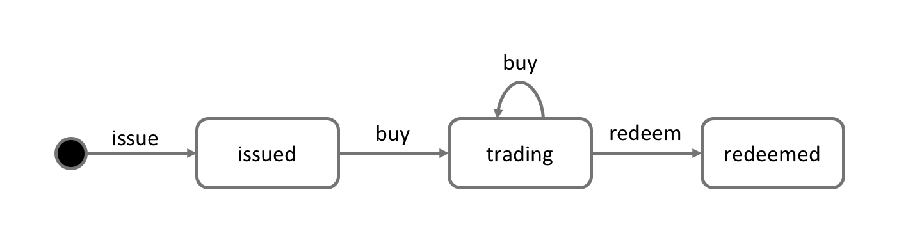
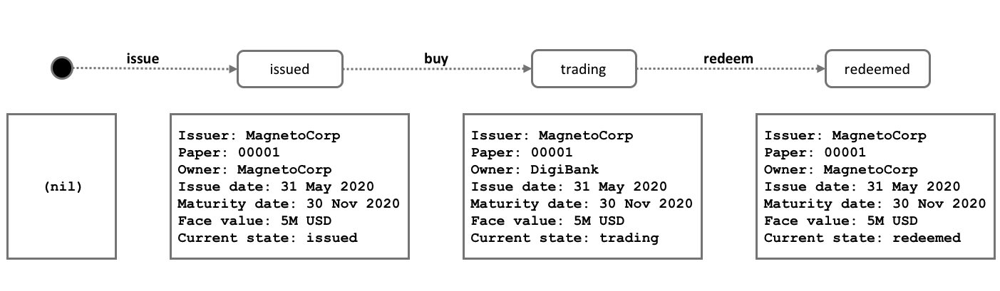
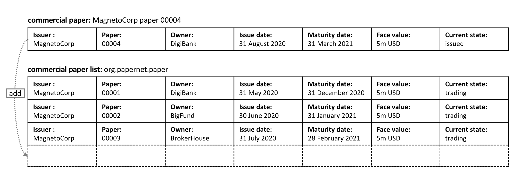
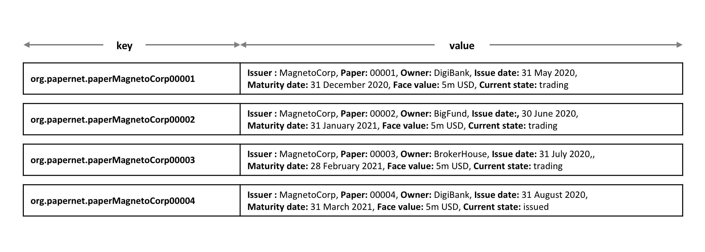

# 流程和数据设计
# Process and Data Design

**受众**：架构师，应用程序和智能合约开发者，业务专家

**Audience**: Architects, Application and smart contract developers, Business
professionals

本主题主要讨论在 PaperNet 中如何设计商业票据的流程和与它相关的数据结构。我们在 [分析章节](./analysis.html) 中已经强调使用状态和交易对 PaperNet 建模提供了一种精确的方法来了解正在发生的事情。我们现在将详细阐述这两个强烈相关的概念，以帮助我们随后设计 PaperNet 的智能合约和应用程序。

This topic shows you how to design the commercial paper processes and their
related data structures in PaperNet. Our [analysis](./analysis.html) highlighted
that modelling PaperNet using states and transactions provided a precise way to
understand what's happening. We're now going to elaborate on these two strongly
related concepts to help us subsequently design the smart contracts and
applications of PaperNet.

## 生命周期

## Lifecycle

正如我们所见，在处理商业票据时有两个重要的概念：**状态**和**交易**。实际上，*所有*区块链用例都是如此;状态建模是重要的概念对象，其生命周期转换由交易描述。对状态和交易的有效分析是成功实施的重要起点。

As we've seen, there are two important concepts that concern us when dealing
with commercial paper; **states** and **transactions**. Indeed, this is true for
*all* blockchain use cases; there are conceptual objects of value, modeled as
states, whose lifecycle transitions are described by transactions. An effective
analysis of states and transactions is an essential starting point for a
successful implementation.

我们可以用状态转移表来表示商业票据的生命周期：

We can represent the life cycle of a commercial paper using a state transition
diagram:

 *商业票据的状态转移表。商业票据通过**发行**，**购买**和**兑换**交易在**已发行**、**交易中**和**已兑换**之间进行状态转移。*

 *The state transition
diagram for commercial paper. Commercial papers transition between **issued**,
**trading** and **redeemed** states by means of the **issue**, **buy** and
**redeem** transactions.*

了解状态图如何描述商业票据随着时间如何变化，以及特定交易如何控制生命周期转换。在 Hypledger Fabric 中，智能合约实现了在不同状态之间转换商业票据的交易逻辑。商业票据状态实际上是保存在帐本的世界状态中; 让我们来深入了解一下。

See how the state diagram describes how commercial papers change over time, and
how specific transactions govern the life cycle transitions. In Hyperledger
Fabric, smart contracts implement transaction logic that transition commercial
papers between their different states. Commercial paper states are actually held
in the ledger world state; so let's take a closer look at them.

## 账本状态

## Ledger state

回想一下商业票据的结构：

Recall the structure of a commercial paper:

 *商业票据可以被表示为属性集，每个属性都对应一个值。通常，这些属性的组合会为每个票据提供一个唯一键*

 *A commercial paper can be
represented as a set of properties, each with a value. Typically, some
combination of these properties will provide a unique key for each paper.*

商业票据的 `Paper` 属性的值是 `00001`，`Face value` 属性的值是 `5M USD`。更重要的是，
`Current state` 属性表示了商业票据是 `issued` 状态，`trading` 状态还是 `redeemed` 状态。
结合来看，属性的完整集合构成了商业票据的**状态**。此外，这些商业票据的全部集合构成了账本的
[世界状态](../ledger/ledger.html#world-state)。

See how a commercial paper `Paper` property has value `00001`, and the `Face
value` property has value `5M USD`. Most importantly, the `Current state`
property indicates whether the commercial paper is `issued`,`trading` or
`redeemed`. In combination, the full set of properties make up the **state** of
a commercial paper. Moreover, the entire collection of these individual
commercial paper states constitutes the ledger
[world state](../ledger/ledger.html#world-state).

所有的账本状态都是这种形式；每个状态都是一个属性集，每个都有不同的值。状态的*多属性*是一个强大的特性——允许我们把 Fabric 的状态看做是一个向量而不是一个简单的标量。然后，我们把整个实际的对象当做独立的状态，随后由交易逻辑控制状态转换。Fabric 的状态是由键值对实现的，其中值以捕获对象的多个属性的格式编码对象属性，通常是 JSON 格式。根据这些属性，[账本数据库](../ledger/ledger.html#ledger-world-state-database-options) 可以支持高级的查询操作，这对于复杂的对象检索非常有帮助。

All ledger state share this form; each has a set of properties, each with a
different value. This *multi-property* aspect of states is a powerful feature --
it allows us to think of a Fabric state as a vector rather than a simple scalar.
We then represent facts about whole objects as individual states, which
subsequently undergo transitions controlled by transaction logic. A Fabric state
is implemented as a key/value pair, in which the value encodes the object
properties in a format that captures the object's multiple properties, typically
JSON. The [ledger
database](../ledger/ledger.html#ledger-world-state-database-options) can support
advanced query operations against these properties, which is very helpful for
sophisticated object retrieval.

查看 MagnetoCorp 的票据 `00001` 如何表示为一个状态向量，根据不同的交易刺激进行转换:

See how MagnetoCorp's paper `00001` is represented as a state vector that
transitions according to different transaction stimuli:

 *商业票据状态是由于不同的交易而产生和过渡的。Hyperledger Fabric 状态拥有多个属性，使他们成为向量而不是标量。*

 *A commercial paper state is
brought into existence and transitions as a result of different transactions.
Hyperledger Fabric states have multiple properties, making them vectors rather
than scalars.*

注意每个独立的票据都起于空状态，技术上被称作 [nil](https://en.wikipedia.org/wiki/Null_(SQL))，来表示票据不存在！通过**发行**交易，票据 `00001` 问世，然后由于**购买**和**兑换**交易而更新状态。

Notice how each individual paper starts with the empty state, which is
technically a [`nil`](https://en.wikipedia.org/wiki/Null_(SQL)) state for the
paper, as it doesn't exist! See how paper `00001` is brought into existence by
the **issue** transaction, and how it is subsequently updated as a result of the
**buy** and **redeem** transactions.

注意每个状态是如何自描述的；每个属性都有一个名字和值。尽管目前所有的商业票据都有相同的属性，这种情况不一定总是如此，而 Hyperledger Fabric 支持不同的状态有不同的属性。这允许相同的帐本世界状态包含相同资产的不同形式以及不同类型的资产。同样使得更新状态结构成为可能；试想有一个新的规则需要一个额外的数据字段。灵活的状态属性集支持数据演化的基本需求。

Notice how each state is self-describing; each property has a name and a value.
Although all our commercial papers currently have the same properties, this need
not be the case for all time, as Hyperledger Fabric supports different states
having different properties. This allows the same ledger world state to contain
different forms of the same asset as well as different types of asset. It also
makes it possible to update a state's structure; imagine a new regulation that
requires an additional data field. Flexible state properties support the
fundamental requirement of data evolution over time.

## 状态键值

## State keys

大多数的实际应用中，状态会有一个属性组合在给定的上下文中唯一识别它——它就是**主键**。PaperNet 商业票据的主键是通过 `Issuer` 属性和 `paper` 属性拼接得到的；所以 MagnetoCorp 的第一个票据的主键就是 `MagnetoCorp00001`。

In most practical applications, a state will have a combination of properties
that uniquely identify it in a given context -- it's **key**. The key for a
PaperNet commercial paper is formed by a concatenation of the `Issuer` and
`paper` properties; so for MagnetoCorp's first paper, it's `MagnetoCorp00001`.

状态的主键允许我们唯一识别一个票据；它是通过**发行**交易创建的，然后由**购买**和**兑换**更新。Hyperledger Fabric 需要账本中的每个状态都有唯一的主键。

A state key allows us to uniquely identify a paper; it is created as a result
of the **issue** transaction and subsequently updated by **buy** and **redeem**.
Hyperledger Fabric requires each state in a ledger to have a unique key.

当唯一主键在可用的属性集中不能获得，应用决定的唯一键会被指定为交易的输入来创建状态。这个唯一键的形式一般是 [UUID](https://en.wikipedia.org/wiki/Universally_unique_identifier)，尽管可读性不好，但是是一个很好的实践。最重要的是账本中每个独立的状态对象都必须有一个唯一键。

When a unique key is not available from the available set of properties, an
application-determined unique key is specified as an input to the transaction
that creates the state. This unique key is usually with some form of
[UUID](https://en.wikipedia.org/wiki/Universally_unique_identifier), which
although less readable, is a standard practice. What's important is that every
individual state object in a ledger must have a unique key.

_Note: 在主键中你应该避免使用 U+0000 (nil byte)。_

_Note: You should avoid using U+0000 (nil byte) in keys._

## 多个状态

## Multiple states

正如我们所见，PaperNet 中的商业票据作为状态向量被存储在账本中。能够从账本中查询不同的商业票据是合理的需求；比如，查询所有由 MagnetoCorp 发行的的票据，或者查询所有由 MagnetoCorp 发行且处在 `redeemed` 状态的票据。

As we've seen, commercial papers in PaperNet are stored as state vectors in a
ledger. It's a reasonable requirement to be able to query different commercial
papers from the ledger; for example: find all the papers issued by MagnetoCorp,
or: find all the papers issued by MagnetoCorp in the `redeemed` state.

为了满足不同类型的查询任务，把所有相关的商业票据按逻辑顺序排列在一起是很有帮助的。PaperNet 的设计包含了商业票据列表的思想——一个逻辑容器，每当商业票据发行或发生其他更改时，该容器都会更新。

To make these kinds of search tasks possible, it's helpful to group all related
papers together in a logical list. The PaperNet design incorporates the idea of
a commercial paper list -- a logical container which is updated whenever
commercial papers are issued or otherwise changed.

### 逻辑表示

### Logical representation

把所有的 PaperNet 商业票据放在一个商业票据列表中是有帮助的:

It's helpful to think of all PaperNet commercial papers being in a single list
of commercial papers:

 *MagnetoCorp 新增加的票据 00004 被加入到已有的商业票据列表中。*

 *MagnetoCorp's
newly created commercial  paper 00004 is added to the list of existing
commercial papers.*

新票据由于**发行**交易被加入到列表中，然后列表中已存在的票据因为**购买**交易和**兑换**交易可以被更新状态。列表有一个描述性的名称：`org.papernet.papers`；使用这种 [DNS 名](https://en.wikipedia.org/wiki/Domain_Name_System)真的是一个好主意，因为适当的名称会让你的区块链设计对其他人来说是直观的。这种想法同样也适用于智能合约的[名字](./contractname.html)。

New papers can be added to the list as a result of an **issue** transaction, and
papers already in the list can be updated with **buy** or **redeem**
transactions. See how the list has a descriptive name: `org.papernet.papers`;
it's a really good idea to use this kind of [DNS
name](https://en.wikipedia.org/wiki/Domain_Name_System) because well-chosen
names will make your blockchain designs intuitive to other people. This idea
applies equally well to smart contract [names](./contractname.html).

### 物理的代表

### Physical representation

我们可以正确地想到 PaperNet 中的单个票据列表—— `org.papernet.papers` ——列表最好作为一组单独的 Fabric 状态来实现，其复合键将状态与其列表关联起来。这样，每个状态的复合键都是惟一的，并支持有效的列表查询。

While it's correct to think of a single list of papers in PaperNet --
`org.papernet.papers` -- lists are best implemented as a set of individual
Fabric states, whose composite key associates the state with its list. In this
way, each state's composite key is both unique and supports effective list query.

 *将 PaperNet 商业票据列表表示为一组不同的 Hyperledger Fabric 状态*

 *Representing a list of
PaperNet commercial papers as a set of distinct Hyperledger Fabric states*

注意列表中的每个票据都是如何用向量状态表示的，其中唯一的**组合**键是由 `org.papernet.paper` 的属性 `Issuer` 和 `Paper` 连接而成的。这种结构有两个好处：

Notice how each paper in the list is represented by a vector state, with a
unique **composite** key formed by the concatenation of `org.papernet.paper`,
`Issuer` and `Paper` properties. This structure is helpful for two reasons:

  * 允许我们检查账本中的任意状态向量在哪个列表中，不用引用到不同的列表。这类似于观察一群体育迷，通过他们穿的衬衫的颜色来判断他们支持哪支球队。体育迷们自我宣布他们的忠诚;我们不需要粉丝名单。

  * It allows us to examine any state vector in the ledger to determine which
    list it's in, without reference to a separate list. It's analogous to
    looking at set of sports fans, and identifying which team they support by
    the colour of the shirt they are wearing. The sports fans self-declare their
    allegiance; we don't need a list of fans.

  * Hyperlegder Fabric 内部使用了一个并发控制[机制](../arch-deep-dive.html#the-endorsing-peer-simulates-a-transaction-and-produces-an-endorsement-signature)来更新账本，所以把票据保存在不同的状态向量中大大减少了共享状态碰撞的机会。这种碰撞需要交易重新提交，复杂化了应用设计，而且降低了性能。

第二点是 Hyperledger Fabric 的关键；状态向量的物理设计对于优化性能和行为**非常重要**。保持状态的独立!

  * Hyperledger Fabric internally uses a concurrency control
    mechanism <!-- Add more information to explain this topic-->
    to update a ledger, such that keeping papers in separate state vectors vastly
    reduces the opportunity for shared-state collisions. Such collisions require
    transaction re-submission, complicate application design, and decrease
    performance.

## 信任关系

This second point is actually a key take-away for Hyperledger Fabric; the
physical design of state vectors is **very important** to optimum performance
and behaviour. Keep your states separate!

我们已经讨论了网络中的不同角色，如发行者，交易员或评级机构，以及不同的商业利益如何决定谁需要签署交易。在 Fabric 中，这些规则由所谓的背书策略捕获。这些规则可以在链码粒度上设置，也可以为单个状态键设置。

## Trust relationships

这意味着在 PaperNet 中，我们可以为整个命名空间设置一个规则，以确定哪些组织可以发行新票据。然后，可以为单个票据设置和更新规则，以捕获购买和兑换交易的信任关系。

We have discussed how the different roles in a network, such as issuer, trader
or rating agencies as well as different business interests determine who needs
to sign off on a transaction. In Fabric, these rules are captured by so-called
[**endorsement policies**](endorsementpolicies.html). The rules can be set on
a chaincode granularity, as well as for individual state keys.

在下一个主题中，我们将向您展示如何结合这些设计概念来实现 PaperNet 商业票据智能合约，然后是应用程序来使用它！

This means that in PaperNet, we can set one rule for the whole namespace that
determines which organizations can issue new papers. Later, rules can be set
and updated for individual papers to capture the trust relationships of buy
and redeem transactions.

In the next topic, we will show you how to combine these design concepts to
implement the PaperNet commercial paper smart contract, and then an application
in exploits it!
