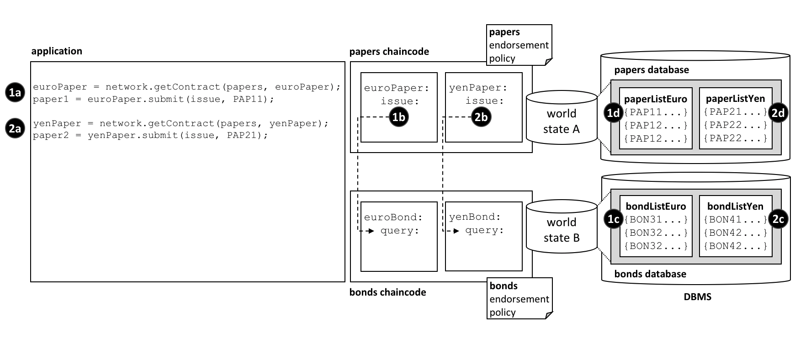

# 链码命名空间

**本文面向的读者是**: 架构师，应用程序和智能合约开发人员，管理员

链码命名空间允许其保持自己的世界状态与其他链码的不同。具体来说，同链码的智能合约对相同的世界状态都拥有直接的访问权，而不同链码的智能合约无法直接访问对方的世界状态。如果一个智能合约需要访问其他链码的世界状态，可通过执行链码-对-链码的调用来完成。最后，区块链可以包含涉及了不同世界状态的交易。

本文我们将讲述以下内容：

* [命名空间的重要性](#动机)
* [什么是链码命名空间](#情景)
* [通道和链码命名空间](#通道)
* [如何使用链码命名空间](#usage)
* [如何使用智能合约来访问世界状态](#跨链码访问)
* [链码命名空间的设计考虑](#思考)

## 动机

命名空间是一个常见的概念。我们知道虽然*公园街道，纽约和帕克街道，西雅图*这些属于不同街道，但是他们有共同的名字。城市为公园街提供了一个**命名空间**，同时赋予了它自由度和清晰度。

在电脑系统中也是如此。命名空间实现了让不同用户在不影响其他方操作的情况下对一个共享系统的不同部分进行编程和操作。许多编程语言都有命名空间，这就使得程序可以轻松地分配独特的识别符，如变量名，而无须担心其他程序也在进行相同操作。下文中会介绍到Hyperledger Fabric通过命名空间使得智能合约可以保持自己的账本世界状态与其他智能合约的不同。

## 情景

让我们通过下面的图表来看一下账本世界状态如何管理对通道组织很重要的商业对象的相关事实。无论对象是商业票据，债券，还是车牌号码，无论这些对象位于生命周期的什么位置，它们都会被作为状态维持在账本数据状态数据库中。智能合约通过与账本（世界状态和区块链）交互来管理这些商业对象，而多数情况下这一过程会涉及到智能合约查询或更新账本世界状态。

账本世界状态是通过访问该状态的智能合约的链码来进行划分的，理解这一点至关重要 。这种划分或者*命名空间*对架构师、管理员和程序员来说是一点非常重要的设计考虑。

 *账本世界状态根据访问其状态的链码被分成不同命名空间。在一个给定通道上，相同链码的智能合约共享相同世界状态，不同链码的智能合约无法直接访问对方的世界状态。同样的道理，区块链可以包含与不同链码世界状态相关的交易。*

在我们的示例中可以看到两种不同的链码中定义了四种智能合约，每个都位于它们自己的链码容器里。  `euroPaper` 和`yenPaper` 智能合约被定义在  `papers` 链码中。  `euroBond` 和 `yenBond`  智能合约的情况也类似——它们被定义在`bonds`链码中。该设计可帮助应用程序员们理解他们的工作对象，是商业票据还是欧元或日元的债券，因为各金融产品的规则不会受货币种类影响，这就使得用相同链码管理这些金融产品的部署成为可能。

 [上图](#情景) 还展示了这一部署选择的结果。数据库管理系统为 `papers` 和 `bonds` 链码以及各自其中包含的智能合约创建了不同的世界状态数据库。 `World state A` 和 `world state B` 被分别放在不同的数据库中；其中的数据也被分隔开，从而使得一个单独的世界状态查询（比如）不会同时访问两个世界状态。据说世界状态根据其链码进行了*命名空间设定*。

看看  `world state A` 是如何包含两个列表的商业票据 `paperListEuro` 和 `paperListYen` 。状态  `PAP11` 和`PAP21` 分别是由  `euroPaper` 和 `yenPaper` 智能合约管理的每个票据的示例。由于这些智能合约共享同样的链码命名空间，因此它们的key(`PAPxyz`) 必须在 `papers` 链码的命名空间里是唯一的。要注意怎样能在`papers` 链码上写一个能对所有商业票据（无论是欧元还是日元）执行汇总计算的智能合约，因为这些商业票据共享相同的命名空间。债券的情况也类似——债券保存在  `world state B` 中，  `world state B` 与另一个`bonds` 数据库形成映射，它们的key必须都是唯一的。

同样重要的一点是，命名空间意味着  `euroPaper` 和 `yenPaper` 无法直接访问  `world state B` ，也意味着  `euroBond` 和 `yenBond` 无法直接访问  `world state A` 。这样的分隔是有帮助的，因为商业票据和债券是相差很大的两种金融工具，它们各有不同的属性和规定。同时命名空间还意味着 `papers` 和 `bonds`  可以有相同的key，因为它们在不同的命名空间。这是有帮助的，因为它为命名提供了足够大的自由空间。以此来为不同的商业对象命名。

最重要的一点是，我们可以看到区块链是与在特定通道上运行的节点相关的，它包括了影响 `world state A` 和 `world state B` 的交易。这就解释了为什么区块链是节点中最基础的数据结构。因为世界状态集是区块链交易的汇总结构，所以它总是能从区块链中重新创建。世界状态通常仅要求该状态的当前值，所以它可以简化智能合约，提升智能合约的效率。通过命名空间来让世界状态彼此各不相同，这能帮助智能合约将各自逻辑从其他智能合约中隔离出来，而不需要担心那些与不同世界状态通信的交易。例如， `bonds`  合约不需要担心 `paper`  交易，因为该合约无法看到由它所造成的世界状态。

同样值得注意的是，节点，链码容器和数据库管理系统（DBMS）在逻辑上来说都是不同的过程。节点和其所有的链码容器始终位于不同的操作系统进程中，但是 DBMS 可被配置为嵌入或分离，这取决于它的[类型](../ledger/ledger.html#world-state-database-options)。对于 LevelDB 来说，DBMS 整体被包含在节点中，但是对于 CouchDB 来说，这是另外一个操作系统进程。

要记住，该示例中命名空间的选择是商业上要求共享不同币种商业票据的结果，但是要将商业票据与债券区别开，这一点很重要。想想如何对命名空间的结果进行修改以满足保持每个金融资产等级互不相同这一商业需求，或者来共享所有商业票据和债券。

## 通道

如果一个节点加入了多个通道，那么将会为每个通道创建、管理一条新的区块链。而且每当有链码部署在一条新通道上，就会为其创建一个新的世界状态数据库。这就意味着通道还可以随着链码命名空间来为世界状态生成一种命名空间。

然而，相同的节点和链码容器流程可同时加入多个通道，与区块链和世界状态数据库不同，这些流程不会随着加入的通道数而增加。

例如，如果链码 `papers` 和 `bonds`  在一个新的通道上被部署了，将会有一个完全不同的区块链和两个新的世界状态数据库被创建出来。但是，节点和链码容器不会随之增加；它们只会各自连接到更多相应的通道上。

## 使用

让我们来用商业票据的[例子](#情景)讲解一个应用程序是如何使用带有命名空间的智能合约的。值得注意的是应用程序与节点交互，该节点将请求发送到对应的链码容器，随后，该链码容器访问DBMS。请求的传输是由下图中的节点**核心**组件完成的。

以下是使用商业票据和债券的应用程序代码，以欧元和日元定价。该代码可以说是不言自明的：

```javascript
const euroPaper = network.getContract(papers, euroPaper);
paper1 = euroPaper.submit(issue, PAP11);

const yenPaper = network.getContract(papers, yenPaper);
paper2 = yenPaper.submit(redeem, PAP21);

const euroBond = network.getContract(bonds, euroBond);
bond1 = euroBond.submit(buy, BON31);

const yenBond = network.getContract(bonds, yenBond);
bond2 = yenBond.submit(sell, BON41);
```

看一下应用程序是怎么：

* 访问`euroPaper` 和 `yenPaper` 合约，用 `getContract() ` API指明`paper` 的链码。看交互点**1a**和**2a**。
  
* 访问  `euroBond` 和 `yenBond`  合约，用 `getContract()`  API指明`bonds`链码。看交互点**3a**和**4a**。
  
* 向网络提交一个  `issue` 交易，以使 `PAP11`  票据使用  `euroPaper` 合约。看交互点**1a**。这就产生了由  `world state A` 中的  `PAP11`  状态代表的商业票据；交互点**1b**。这一操作在交互点**1c**上被捕获为区块链的一项交易。
  
* 向网络发送一个  `redeem` 交易，让商业票据 `PAP21` 来使用 `yenPaper` 合约。看交互点**2a**。这就产生了由   `world state A` 中 `PAP21`  代表的一个商业票据；交互点**2b**。该操作在交互点**2c**被捕获为区块链的一项交易。
  
* 向网络发送一个  `buy` 交易，让债券 `BON31` 来使用 `euroBond` 合约。看交互点**3a**。这就产生了由   `world state B` 中 `BON31`  代表的一个商业票据；交互点**3b**。该操作在交互点**3c**被捕获为区块链的一项交易。
  
* 向网络发送一个  `sell` 交易，让债券 `BON41` 来使用 `yenBond` 合约。看交互点**4a**。这就产生了由   `world state B` 中 `BON41`  代表的一个商业票据；交互点**4b**。该操作在交互点**4c**被捕获为区块链的一项交易。

我们来看看智能合约是如何与世界状态交互的：

* `euroPaper` 和 `yenPaper`  合约可直接访问 `world state A`，但无法直接访问 `world state B`。 `world state A`储存在与`papers`链码相对应的数据库管理系统中的`papers`数据库里面。
  
* `euroBond` 和 `yenBond`  合约可以直接访问`world state B`，但是无法直接访问`world state A`。`world state B`储存在与`bonds`链码相对应的数据库管理系统中的`bonds`数据库里面。

看看区块链是如何为所有世界状态捕获交易的：

* 与交易相对应的交互点**1c**和**2c**分别创建和更新商业票据 `PAP11` 和 `PAP21`。它们都包含在    `world state A` 中。
  
* 与交易相对应的交互点**3c**和**4c**都会对  `BON31` 和 `BON41` 进行更新。它们都包含在`world state B` 中。
  
* 如果 `world state A` 或 `world state B` 因任何原因被破坏，可通过重新进行区块链上的所有交易来重新创建`world state A` 或 `world state B`。

## 跨链码访问

如 [情景](#情景)中的示例可见， `euroPaper` 和 `yenPaper`  无法直接访问` world state B `。这是因为我们对链码和智能合约进行了设置，使得这些链码和世界状态各自之间保持不同。不过，我们来想象一下 `euroPaper` 需要访问 `world state B`。

为什么会发生这种情况呢？想象一下当发行商业票据时，智能合约想根据到期日相似的债券的当前收益情况来对票据进行定价。这种情况时，需要  `euroPaper` 合约能够在 `world state B`中查询债券价格。看以下图表来研究一下应该如何设计交互的结构。

 *链码和智能合约如何能够直接访问其他世界状态——通过自己的链码。*

注意如何：

* 应用程序在 `euroPaper` 智能合约中发送 `issue` 交易来颁布 `PAP11`。看交互点 **1a**。
  
* `euroPaper` 智能合约中的 `issue` 交易在 `euroBond` 智能合约中调用 `query` 交易。看交互点 **1b**。
  
* `euroBond` 中的 `query` 从 `world state B` 中索取信息。看交互点 **1c**。
   
* 当控制返回到 `issue` 交易，它可利用响应中的信息对票据定价，并使用信息来更新 `world state A`。看交互点 **1d**。
  
* 发行以日元定价的商务票据的控制流程也是一样的。看交互点 **2a**，**2b**，**2c** 和 **2d**。

链码间的控制传递是利用 `invokeChiancode()`
[API](https://hyperledger.github.io/fabric-chaincode-node/{BRANCH}/api/fabric-shim.ChaincodeStub.html#invokeChaincode__anchor)来实现的。

该 API 将控制权从一个链码传递到另一个链码。

虽然我们在示例中只谈论了查询交易，但是用户也能够调用一个将更新所谓链码世界状态的智能合约。请参考下面的 [思考](#思考) 部分。

## 思考

* 大体上来说，每各链码都包含一个智能合约。

* 若多个智能合约之间关系紧密，应该把它们部署在同一链码中。通常，只有当这些智能合约共享相同的世界状态时才需要这样做。
  
* 链码命名空间将不同的世界状态分隔开来。这大体上会将彼此不相关的数据区分开。注意，命名空间是由 Hyperledger Fabric 分配并直接映射到链码名字的，用户无法选择。
  
* 对于使用 `invokeChaincode()` API 的链码间交互，必须将这两个链码安装在相同节点上。
  
  * 对于仅需要查询被调用链码的世界状态的交互，该调用可发生在与调用发起者链码不同的通道上。
      
  * 对于需要更新背调用链码世界状态的交互，调用必须发生在与调用发起者链码相同的通道上。

<!--- Licensed under Creative Commons Attribution 4.0 International License
https://creativecommons.org/licenses/by/4.0/ -->