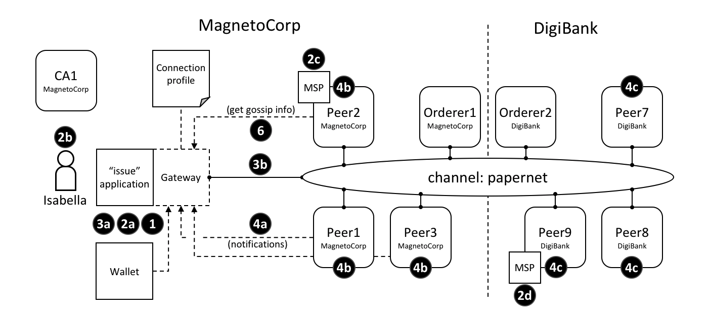

# 连接选项

**受众**：架构师、管理员、应用程序与智能合约开发者

连接选项（Connection option）用于与连接配置文件联合使用去*精准地*控制一个网关如何与网络交互。通过使用网关，允许一个应用开发专注于商业逻辑而不是网络拓扑。

本主题中，我们将涉及:

* [为什么连接选项很重要](#情景)
* [应用程序如何使用连接选项](#用法)
* [每个连接选项的作用](#选项)
* [何时使用特定的连接选项](#注意事项)

## 情景

连接选项指定网关行为的特定方面。网关对于[一些原因](./gateway.html)是重要，其主要目的是允许应用程序去聚焦在业务逻辑和智能合约，同时管理与网络的一些组件的交互。


*连接控制行为的不同交互点。这些选项将会在本文中被充分说明*

一个连接选项的例子可能是想说明：被 `issue` 程序使用的网关应该使用 `Isabella` 身份将交易提交到 `papernet` 网络中。另一个可能是网关应该等待来自 MagnetoCorp 的三个节点去确定一个交易被提交并返回控制。连接选项允许应用程序去指定与网络交互的网关的精准行为。如果没有网关，应用程序需要去很多的工作；网关节省了你的时间，让你的应用程序更加可读，不易出错。

## 用法

我们将马上描述应用程序可用的连接选项的[全集](#选项)；首先让我们看看他们如何被示例 MagnetoCorp `issue` 应用指定：

```javascript
const userName = 'User1@org1.example.com';
const wallet = new FileSystemWallet('../identity/user/isabella/wallet');

const connectionOptions = {
  identity: userName,
  wallet: wallet,
  eventHandlerOptions: {
    commitTimeout: 100,
    strategy: EventStrategies.MSPID_SCOPE_ANYFORTX
    }
  };

await gateway.connect(connectionProfile, connectionOptions);
```

看一下 `identity` 和 `wallet` 选项是 `connectionOptions` 对象的简单属性。他们分别有 `userName` and `wallet`，他们较早的被设置在代码里。相比于这些属性，`eventHandlerOptions` 本身就是一个独立的对象。它有两个属性：`commitTimeout: 100` （以秒为单位）和 `strategy:EventStrategies.MSPID_SCOPE_ANYFORTX`。

看一下 `connectionOptions` 如何作为一个 `connectionProfile` 的补充被传递给网关的；网络被网络配置文件所标识，这些选项精确地指定了网关该如何与它交互。现在让我们看下可用选项。

## 选项

这里是可用选项的列表以及他们的作用。

* `wallet`  标识了将要被应用程序上的网关所使用的钱包。看一下交互**1**，钱包是由应用程序指定的，但它实际上是检索身份的网关。
  
  一个钱包必须被指定；最重要的决定是钱包使用的[类型](./wallet.html#type)，是文件系统、内存、HSM 还是数据库。

* `identity`  应用程序从 `wallet` 中使用的用户身份。看一下交互**2a**；用户身份被应用程序指定，也代表了应用程序的用户 Isabella，**2b**。身份实际上被网络检索。

  在我们的例子中，Isabella 的身份将会被不同的 MSP（**2c**，**2d**）使用，用于确定他为来自 MagnetoCorp 的一员，并且在其中扮演着一个特殊的角色。这两个事实将相应地决定了他在资源上的许可。

  一个用户的身份必须被指定。正如你所看到的，这个身份对于 Hyperledger Fabric 是一个*有权限的*网络的概念来说是基本的原则——所有的操作者有一个身份，包括应用程序、Peer 节点和排序节点，这些身份决定了他们在资源上的控制。你可以在成员身份服务[话题](../membership/membership.html)中阅读更过关于这方面的概念。

* `clientTIsIdentity` 是可以从钱包（**3a**）获取到的身份，用于确保网关和不同的t通道组件之间的交流（**3b**），比如 Peer 节点和排序节点。

  注意：这个身份不同于用户身份。即使 `clientTlsIdentity` 对于安全通信来说很重要，但它并不像用户身份那样基础，因为它的范围没有超过确保网络的通信。

  `clientTlsIdentity` 是可选项。建议你把它设置进生产环境中。你应该也使用不同的 `clientTlsIdentity` 用做 `identity`，因为这些身份有着非常不同的意义和生命周期。例如，如果 `clientTIsIdentity` 被破坏，那么你的 `identity` 也会被破坏；让他们保持分离会更加安全。

* `eventHandlerOptions.commitTimeout` 是可选的。它以秒为单位指定网关在将控制权返回给应用程序之前，应该等待任何对等方提交事务的最大时间量(**4a**)。用于通知的 Peer 节点集合由 ` eventHandlerOptions` 选项决定。如果没有指定 commitTimeout，网关默认将使用300秒的超时。

* `eventHandlerOptions.strategy` 是可选的。它定义了网关用来监听交易被提交通知的 Peer 节点集合。例如，是监听组织中的单一的 Peer 节点还是全部的节点。可以采用以下参数之一：

  * `EventStrategies.MSPID_SCOPE_ANYFORTX` 监听用户组织内的**一些** Peer 节点。在我们的例子中，看一下交互点**4b**；MagnetoCorp 中的 peer1、peer2、peer3 节点能够通知网关。

  * `EventStrategies.MSPID_SCOPE_ALLFORTX` **这是一个默认值**。监听用户组织内的**所有** Peer 节点。在我们例子中，看一下交互点**4b**。所有来自 MagnetoCorp 的节点必须全部通知网关：peer1、peer2 和 peer3 节点。只有已知/被发现和可用的 Peer 节点才会被计入，停止或者失效的节点不包括在内。

  * `EventStrategies.NETWORK_SCOPE_ANYFORTX` 监听整个网络通道内的**一些** Peer 节点。在我们的例子中，看一下交互点 **4b** 和 **4c**；MagnetoCorp 中部分 Peer 节点1-3 或者 DigiBank 的部分 Peer 节点 7-9 能够通知网关。

  * `EventStrategies.NETWORK_SCOPE_ALLFORTX` 监听整个网络通道内**所有** Peer 节点。在我们的例子中，看一些交互 **4b** 和 **4c**。所有来自 MagnetoCorp 和 DigiBank 的 Peer 节点 1-3  和 Peer 节点 7-9 都必须通知网关。只有已知/被发现和可用的 Peer 节点才会被计入，停止或者失效的节点不包括在内。

  * <`PluginEventHandlerFunction`> 用户定义的事件处理器的名字。这个允许用户针对事件处理而定义他们自己的逻辑。看一下如何[定义](https://hyperledger.github.io/fabric-sdk-node/master/tutorial-transaction-commit-events.html)一个时间处理器插件，并检验一个[示例处理器](https://github.com/hyperledger/fabric-sdk-node/blob/master/test/integration/network-e2e/sample-transaction-event-handler.js)。

	如果你有一个迫切需要事件处理的需求的话，那么用户定义的事件处理器是有必要的；大体上来说，一个内建的事件策略是足够的。一个用户定义的事件处理器的例子可能是等待超过半数的组织内的 Peer 节点，以去确认交易被提交。

  如果你确实指定了一个用户定义的事件处理器，她不会影响你的一个应用程序的逻辑；它是完全独立的。处理器被处理过程中的SDK调用；它决定了什么时候调用它，并且使用它的处理结果去选择哪个 Peer 节点用于事件通知。当SDK完成它的处理的时候，应用程序收到控制。
  
  如果一个用户定义的事件处理器没有被指定，那么 `EventStrategies`的默认值将会被使用。

* `discovery.enabled` 是可选项，可能的值是 `true` 还是 `false`。默认是 `ture`。它决定了网关是否使用[服务发现](../discovery-overview.html)去增加连接配置文件里指定的网络拓扑。看一下交互点**6**；peer 节点的 gossip 信息会被网关使用。

  这个值会被 `INITIALIIZE-WITH-DISCOVERY` 的环境变量覆盖，其值可以被设置成 `true` 或者 `false`。

* `discovery.asLocalhost` 是可选项，可能的值是 `true`或者 `false`。默认是`true`。它决定在服务发现期间发现的 IP 地址是否从 docker 网络传递给本地主机。

  通常，开发人员将为其网络组件（如 Peer 节点、排序节点 和 CA 节点）编写使用 docker 容器的应用程序，但是他们自己本身不会运行在 docker 容器内。这个就是为什么 `true` 是默认的，这生产环境中，应用程序很可能以网络组件相同的方式运行在 docker 中，因此不需要地址转换。在这种情况下，应用程序应该要不明确指定 `false`，要不使用环境变量来覆盖。

  这个值会被 `DISCOVERY-AS-LOCALHOST` 环境变量覆盖，其值可以被设置成 `true` 或者 `false`。

## 注意事项

当打算选择连接选项的时候，下面的事项列表是有帮助的。

* `eventHandlerOptions.commitTimeout` 和 `eventHandlerOptions.strategy` 协同工作。例如，`commitTimeout: 100` 和 `strategy:EventStrategies.MSPID_SCOPE_ANYFORTX` 意味着网关最多等待100秒，使得*一些*  Peer 节点确定交易被提交。相反，指定 `strategy:  EventStrategies.NETWORK_SCOPE_ALLFORTX` 意味着网关将会等待*所有*组织里的*所有* Peer 节点100秒。

* `eventHandlerOptions.strategy:EventStrategies.MSPID_SCOPE_ALLFORTX` 的默认值将等待应用程序内的组织的所有 Peer 节点提交提交交易。这是一个好的默认设置，因为应用程序能够确保所有的节点有一个最新账本的拷贝，最小的并发性问题<!-- Add a link with more information explaining this topic-->。

  然而，当组织内的 Peer 节点数量增加，等待所有 Peer 节点则没有必要，在这种情况下，使用一个可插拔的事件处理器能够提供更多有效果的策略。例如，在一个公式能够保持所有帐本同步的安全假设下，相同的 Peer 节点集合能够用于提交交易和监听通知。

* 服务发现要求 `clientTlsIdentity` 被设置。因为与应用程序有交换信息的 Peer 节点需要确信他们在与信任的实体交换信息。如果 `clientTlsIdentity` 没有被设置，那么 `discovery` 不会生效，不管它是否被设置。

* 即使应用程序在连接网关时能够设置连接选项，但是管理员可能需要覆盖这些选项。这是因为选项与网络交互有关，而网络交互可能随时间而变化。例如，管理员试图了解使用服务发现对网络性能的影响。

  一个好的方式是在一个配置文件中定义应用程序覆盖，此文件在配置与网关的连接的时候，会被应用程序读取。

  因为服务发现选项 `enabled` 和 `asLocalHost` 最容易被管理员频繁的覆盖，环境变量 `INITIALIIZE-WITH-DISCOVERY` 和 `DISCOVERY-AS-LOCALHOST`  是因为方便而提供的。管理员应该在应用程序的生产环境中设置他们，其生产环境很可能是一个 docker 容器。

<!--- Licensed under Creative Commons Attribution 4.0 International License
https://creativecommons.org/licenses/by/4.0/ -->