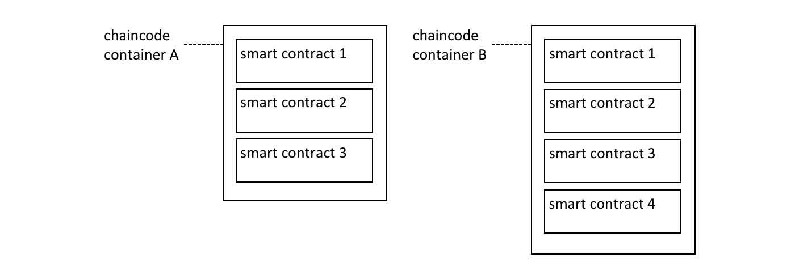
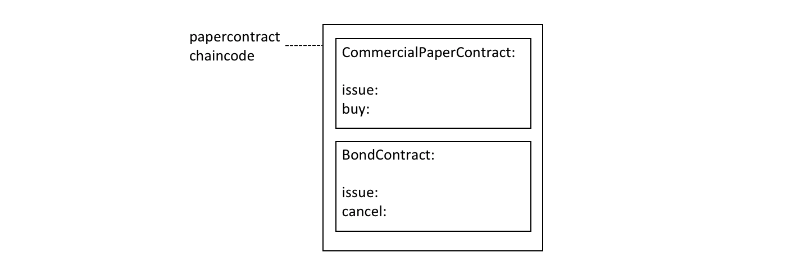

# 合约名称

**受众**:架构师、应用程序与合约开发者、管理员

链码（Chaincode）是一种用于部署代码到 Hyperledger Fabric 区块链网络中的通用容器。链码中定义一个或多个相关联的智能合约。每个智能合约在链码中有一个唯一的标识名。应用程序通过合约名称去访问已经实例化的链码内指定的智能合约。

在本主题中，我们将会讲到:
* [一个链码容器如何包括多个智能合约](#链码)
* [如何分配一个智能合约的名字](#命名)
* [如何使用应用程序中的智能合约](#应用程序)
* [默认的智能合约](#默认合约)

## 链码

在[开发应用](./developing_applications.html)主题中，我们能够看到 Fabric SDK 如何提供了高级的编程抽象，从而能够帮助那些应用程序和智能合约的开发者们聚焦在他们的业务问题上，而不是将目光放在如何与 Fabric 网络交互的这些细节中。

智能合约（Smart Contract）是一种高级编程抽象的例子，可以在链码容器中定义智能合约。当一个链码被安装到 Peer 节点并部署到通道后，链码内所有的智能合约对你的应用来说都是可用的。


*多个智能合约能够被定义在同一个链码内。每一个智能合约都通过链码内的名字而被唯一标识。*

在[上图](#链码)中，链码 A 中定义了三个智能合约，然而链码 B 中有四个智能合约。看一下链码名称如何被用于限定一个特定的智能合约。

账本结构由一组已经部署的智能合约所定义。那是因为账本包括了一些有关网络所感兴趣的业务对象（例如 PaperNet 内的商业票据），并且这些业务对象通过智能合约内定义的交易功能在其生命周期（例如：发行，购买，赎回）中移动。

在大多数情况下，一个链码内仅仅只定义了一个智能合约。然而，将相关联的智能合约放在一个链码中是有意义的。比如，以不同货币计价的商业票据中，可能有 `EuroPaperContract`, `DollarPaperContract`, `YenPaperContract`，这些智能合约在部署他们的通道内可能要互相保持同步。

## 命名

链码里的每一个智能合约都通过合约名称被唯一标识。当智能合约可以在构造类时显示分配这个名称，或者让 `Contract` 类隐式分配一个默认名称。

查看 papercontract.js 链码[文件](https://github.com/hyperledger/fabric-samples/blob/{BRANCH}/commercial-paper/organization/magnetocorp/contract/lib/papercontract.js#L31)：

```javascript
class CommercialPaperContract extends Contract {

    constructor() {
        // Unique name when multiple contracts per chaincode file
        super('org.papernet.commercialpaper');
    }
```

看一下 `CommercialPaperContract` 构造函数是如何将合约名称指定为 `org.papernet.commercialpaper` 的。结果是：在 `papercontract` 链码内，这个智能合约现在与合约名 `org.papernet.commercialpaper` 相关联。

如果没有明确指定一个合约名，则会分配一个默认的名字——类名。在我们的例子中，默认的合约名是 `CommercialPaperContract`。

细心地选择你的名字。不仅仅每一个智能合约必须有一个唯一的名字，而且一个精心挑选的名字也是很有启发性的。特别地，建议使用显式的 DNS 样式命名方法，对组织清晰、有意义的名称有帮助； `org.papernet.commercialpaper` 表达了 PaperNet 网络已经定义了一个标准的商业票据智能合约。

在一个给定链码内，合约名称也有利于消除具有相同名字的不同合约方法交易函数之间的歧义。当智能合约紧密联系的时候，这种歧义就容易发生；他们的交易名称往往倾向于一致。我们能够看到，通过链码和智能合约的名字的组合，一个交易被唯一地定义在通道内。

合约名称在链码文件内必须是唯一的。在部署前，一些代码编辑器将会检测是否存在具有相同类名的多个定义的情况。如果存在多个类使用了相同的合约名，无论是显式还是隐式指定，链码都将会返回错误。

## 应用程序

一旦链码安装在一个 Peer 节点而且部署在一个通道上，链码里的智能合约对于应用程序来说是可访问的：

```javascript
const network = await gateway.getNetwork(`papernet`);

const contract = await network.getContract('papercontract', 'org.papernet.commercialpaper');

const issueResponse = await contract.submitTransaction('issue', 'MagnetoCorp', '00001', '2020-05-31', '2020-11-30', '5000000');
```

看一下应用程序如何通过 `network.getContract()` 方法访问智能合约。`papercontract` 链码的名 `org.papernet.commercialpaper` 返回了一个引用，此引用使用 `contract.submitTransaction()` 接口去提交发布商业票据的交易。

## 默认合约

被定义在链码内的第一个智能合约被成为*默认*合约。这个默认是有用的，因为链码内往往有一个被定义的智能合约；这个默认的智能合约允许应用程序直接地访问这些交易，而不需要特殊指定合约名称。


*一个默认地智能合约是第一个被定义在链码的智能合约。*

在这个图表中，`CommercialPaperContract` 就是那个默认的智能合约。即使我们有两个智能合约，默认的智能合约让我们[当前](#应用程序)的例子更加容易去编写。

```javascript
const network = await gateway.getNetwork(`papernet`);

const contract = await network.getContract('papercontract');

const issueResponse = await contract.submitTransaction('issue', 'MagnetoCorp', '00001', '2020-05-31', '2020-11-30', '5000000');
```

在 `papercontract` 链码内，`CommercialPaperContract` 就是那个默认的智能合约，同时它有一个 `issue` 交易。注意，在 `BondContract` 内发布的交易事务仅仅能通过显示地寻址指来调用。同样地，即使 `cancel` 交易是唯一的（因为 `BondContract` 不是默认的智能合约），它也必须要显示地寻址。

在大多数情况下，一个链码仅仅只包括一个单一的智能合约，所以对链码仔细命名，能够降低开发者将链码视为概念来关注的需求。在[上述](#默认合约)代码例子中，感觉 `papercontract` 像是一个智能合约。

总而言之，在一个给定的链码内，合约名称是一些简单的机制去标识独自的智能合约。合约名称让应用程序更加容易的发现特定的智能合约而且更方便地使用它访问账本。

<!--- Licensed under Creative Commons Attribution 4.0 International License
https://creativecommons.org/licenses/by/4.0/ -->
