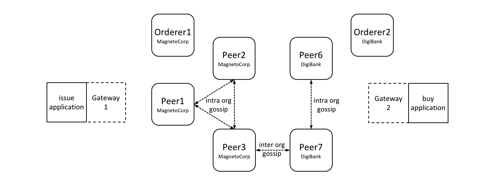

# 网关
# Gateway

**受众**：架构师，应用和智能合约开发者

**Audience**: Architects, application and smart contract developers

网关代表应用程序管理与区块链网络的交互，使其能够专注于业务逻辑。应用程序连接到网关，然后使用该网关的配置管理所有后续交互。

A gateway manages the network interactions on behalf of an application, allowing
it to focus on business logic. Applications connect to a gateway and then all
subsequent interactions are managed using that gateway's configuration.

本主题，将包括如下内容：

In this topic, we're going to cover:

*  [为什么网关很重要](#场景)
*  [应用程序如何使用网关](#连接)
*  [如何定义静态网关](#静态网关)
*  [如何为服务发现定义动态网关](#动态网关)
*  [使用多个网关](#多网关)

* [Why gateways are important](#scenario)
* [How applications use a gateway](#connect)
* [How to define a static gateway](#static)
* [How to define a dynamic gateway for service discovery](#dynamic)
* [Using multiple gateways](#multiple-gateways)

## 场景

## Scenario

Hyperledger Fabric 网络通道可以不断变化。Peer 节点、排序节点和 CA 组件，由网络中的不同组织提供，会经常变化。造成这种情况的原因包括业务需求增加或减少，以及计划内和计划外中断。网关为应用解除这种负担，使其能够专注于它试图解决的业务问题。

A Hyperledger Fabric network channel can constantly change.  The peer, orderer
and CA components, contributed by the different organizations in the network,
will come and go. Reasons for this include increased or reduced business demand,
and both planned and unplanned outages. A gateway relieves an application of
this burden, allowing it to focus on the business problem it is trying to solve.


*MagnetoCorp 和 DigiBank 应用程序（发行和购买）将各自的网络交互委托给其网关。每个网关都了解网络信道拓扑，包括 MagnetoCorp 和 DigiBank 两个组织的多个 Peer 节点 和 排序节点，使应用程序专注于业务逻辑。Peer 节点可以使用 gossip 协议在组织内部和组织之间相互通信。*

 *A MagnetoCorp and DigiBank
applications (issue and buy) delegate their respective network interactions to
their gateways. Each gateway understands the network channel topology comprising
the multiple peers and orderers of two organizations MagnetoCorp and DigiBank,
leaving applications to focus on business logic. Peers can talk to each other
both within and across organizations using the gossip protocol.*

应用程序可以通过两种不同的方式使用网关：

A gateway can be used by an application in two different ways:

* **静态**：网关配置*完全*定义在[连接配置](./connectionprofile.html)中。应用程序可用的所有 Peer 节点、排序节点和 CA 在用于配置网关的连接配置文件中静态定义。比如对 Peer 节点来说，这包括他们作为背书节点或事件通知节点的角色配置。你可以在连接配置[主题](./connectionprofile.html)中了解到更多关于角色的内容。

* **Static**: The gateway configuration is *completely* defined in a [connection
  profile](./connectionprofile.html). All the peers, orderers and CAs
  available to an application are statically defined in the connection profile
  used to configure the gateway. For peers, this includes their role as an
  endorsing peer or event notification hub, for example. You can read more about
  these roles in the connection profile [topic](./connectionprofile.html).

  SDK 将使用此静态拓扑并结合网关[连接配置](./connectionoptions)来管理交易提交和通知过程。连接配置必须包括足够多的网络拓扑来允许网关以应用程序的身份和网络进行交互；包括网络通道、组织、排序节点、Peer 节点和他们的角色。

  The SDK will use this static topology, in conjunction with gateway
  [connection options](./connectionoptions), to manage the transaction
  submission and notification processes. The connection profile must contain
  enough of the network topology to allow a gateway to interact with the
  network on behalf of the application; this includes the network channels,
  organizations, orderers, peers and their roles.

* **动态**：网关配置被最小化的定义在连接配置中。通常，指定应用程序组织中的一个或两个 Peer 节点，然后使用[服务发现](../discovery-overview.html)来发现可用的网络拓扑。这包括 Peer 节点, 排序节点、通道、部署过的智能合约和他们的背书策略。（在生产环境中，网关配置需要至少指定两个可用的 Peer 节点。）


  SDK 将使用静态的配置和发现的拓扑信息，结合网关连接选项来管理交易提交和通知过程。作为其中的一部分，它还将智能地使用发现的拓扑；比如，它会使用为智能合约发现的背书策略来*计算*需要的最少背书节点。

* **Dynamic**: The gateway configuration is minimally defined in a connection
  profile. Typically, one or two peers from the application's organization are
  specified, and they use [service discovery](../discovery-overview.html) to
  discover the available network topology. This includes peers, orderers,
  channels, deployed smart contracts and their endorsement policies. (In
  production environments, a gateway configuration should specify at least two
  peers for availability.)

你可能会问静态或动态网关哪一个更好？这取决于对可预测性和响应性的权衡。静态网络将始终以相同的方式运行，因为它们将网络视为不变的。从这个意义上讲，它们是可预测的——如果它们可用，它们将始终使用相同的 Peer 节点和排序节点。动态网络在了解网络如何变化时更具响应性——它们可以使用新添加的 Peer 节点和排序节点，从而带来额外的弹性和可扩展性，可能会带来一定的可预测性成本。一般情况下，使用动态网络比较好，实际上这是网关的默认模式。

  The SDK will use all of the static and discovered topology information, in
  conjunction with gateway connection options, to manage the transaction
  submission and notification processes. As part of this, it will also
  intelligently use the discovered topology; for example, it will *calculate*
  the minimum required endorsing peers using the discovered endorsement policy
  for the smart contract.

请注意，静态或动态可以使用*相同*的连接配置文件。显然，如果配置文件被静态网关使用，它需要是全面的，而动态网关使用只需要很少的配置。

You might ask yourself whether a static or dynamic gateway is better? The
trade-off is between predictability and responsiveness. Static networks will
always behave the same way, as they perceive the network as unchanging. In this
sense they are predictable -- they will always use the same peers and orderers
if they are available. Dynamic networks are more responsive as they understand
how the network changes -- they can use newly added peers and orderers, which
brings extra resilience and scalability, at potentially some cost in
predictability. In general it's fine to use dynamic networks, and indeed this
the default mode for gateways.

这两种类型的网关对应用程序都是透明的；无论是静态网关还是动态网关应用程序设计无序改变。意思就是一些应用可以使用服务发现，另外一些可以不使用。通常，SDK 使用动态发现意味着更少的定义和更加的智能；而这是默认的。

Note that the *same* connection profile can be used statically or dynamically.
Clearly, if a profile is going to be used statically, it needs to be
comprehensive, whereas dynamic usage requires only sparse population.

## 连接

Both styles of gateway are transparent to the application; the application
program design does not change whether static or dynamic gateways are used. This
also means that some applications may use service discovery, while others may
not. In general using dynamic discovery means less definition and more
intelligence by the SDK; it is the default.

当应用连接到一个网关，需要提供两个配置项。在随后的 SDK 处理程序中会使用到：

## Connect

```javascript
  await gateway.connect(connectionProfile, connectionOptions);
```

When an application connects to a gateway, two options are provided. These are
used in subsequent SDK processing:

* **连接配置**：不管是静态网关还是动态网关，`connectionProfile` 是被 SDK 用来做交易处理的网关配置项，它可以使用 YAML 或 JSON 进行配置，尽管在传给网关后会被转换成 JSON 对象。

```javascript
  await gateway.connect(connectionProfile, connectionOptions);
```

  ```javascript
  let connectionProfile = yaml.safeLoad(fs.readFileSync('../gateway/paperNet.yaml', 'utf8'));
  ```

* **Connection profile**: `connectionProfile` is the gateway configuration that
  will be used for transaction processing by the SDK, whether statically or
  dynamically. It can be specified in YAML or JSON, though it must be converted
  to a JSON object when passed to the gateway:

  阅读更多关于[连接配置](./connectionprofile.html)的信息，了解如何配置。

  ```javascript
  let connectionProfile = yaml.safeLoad(fs.readFileSync('../gateway/paperNet.yaml', 'utf8'));
  ```

* **连接选项**：`connectionOptions` 允许应用程序声明而不是实现所需的交易处理行为。连接选项被 SDK 解释以控制与网络组件的交互模式，比如选择哪个身份进行连接，使用哪个节点做事件通知。这些选项可在不影响功能的情况下显著地降低应用复杂度。这是可能的，因为 SDK 已经实现了许多应用程序所需的低级逻辑; 连接选项控制逻辑流程。

  Read more about [connection profiles](./connectionprofile.html) and how
  to configure them.

  阅读可用的[连接选项](./connectionoptions.html)列表以及何时使用它们。


## 静态网关

* **Connection options**: `connectionOptions` allow an application to declare
  rather than implement desired transaction processing behaviour. Connection
  options are interpreted by the SDK to control interaction patterns with
  network components, for example to select which identity to connect with, or
  which peers to use for event notifications. These options significantly reduce
  application complexity without compromising functionality. This is possible
  because the SDK has implemented much of the low level logic that would
  otherwise be required by applications; connection options control this logic
  flow.

静态网关定义了一个固定的网络视图。在 MagnetoCorp [场景](#场景)中，网关可以识别来自 MagnetoCorp 的单个 Peer 节点，来自 DigiBank 的单个 Peer 节点以及 MagentoCorp 的排序节点。或者，网关可以定义来自 MagnetCorp 和 DigiBank 的*所有* Peer 节点和排序节点。在两个案例中，网关必须定义充分的网络视图来获取和分发商业票据的交易背书。

  Read about the list of available [connection options](./connectionoptions.html)
  and when to use them.

应用可以通过在 `gateway.connect()` API 上明确指定连接选项 `discovery: { enabled:false }` 来使用静态网关。或者，在环境变量中设置 `FABRIC_SDK_DISCOVERY=false`，将始终覆盖应用程序的选择。

## Static

检查被 MagnetoCorp 发行票据应用使用的[连接选项](https://github.com/hyperledger/fabric-samples/blob/master/commercial-paper/organization/magnetocorp/gateway/networkConnection.yaml)。了解一下所有的 Peer 节点、排序节点和 CA 是如何配置的，包括他们的角色。

Static gateways define a fixed view of a network. In the MagnetoCorp
[scenario](#scenario), a gateway might identify a single peer from MagnetoCorp,
a single peer from DigiBank, and a MagentoCorp orderer. Alternatively, a gateway
might define *all* peers and orderers from MagnetCorp and DigiBank. In both
cases, a gateway must define a view of the network sufficient to get commercial
paper transactions endorsed and distributed.

值得注意的是，静态网关代表*这一刻*的网络视图。随着网络的变化，在网关文件中反映变更可能很重要。当重新加载网关配置文件时，应用程序将会自动生效这些变更。

Applications can use a gateway statically by explicitly specifying the connect
option `discovery: { enabled:false }` on the `gateway.connect()` API.
Alternatively, the environment variable setting `FABRIC_SDK_DISCOVERY=false`
will always override the application choice.

## 动态网关

Examine the [connection
profile](https://github.com/hyperledger/fabric-samples/blob/{BRANCH}/commercial-paper/organization/magnetocorp/gateway/networkConnection.yaml)
used by the MagnetoCorp issue application. See how all the peers, orderers and
even CAs are specified in this file, including their roles.

动态网关为网络定义一个小的固定*起点*。在 MagnetoCorp [场景](#场景)中，动态网关可能只识别来自 MagnetoCorp 的单个 Peer 节点; 其他一切都将被发现！（为了提供弹性，最好定义两个这样的引导节点。）

It's worth bearing in mind that a static gateway represents a view of a network
at a *moment in time*.  As networks change, it may be important to reflect this
in a change to the gateway file. Applications will automatically pick up these
changes when they re-load the gateway file.

如果应用程序选择了[服务发现](../discovery-overview.html)，则网关文件中定义的拓扑将使用此进程生成的拓扑进行扩充。服务发现从网关定义开始，使用 [gossip 协议](../gossip.html)查找 MagnetoCorp 组织内的所有连接的 Peer 节点和排序节点。如果已为某个通道定义了[锚节点](../glossary.html#anchor-peer)，则服务发现将使用跨组织的 goosip 协议来发现已连接组织的组件。此过程还将发现安装在 Peer 节点上的智能合约及其在通道级别定义的背书策略。与静态网关一样，发现的网络必须足以获取和分发商业票据交易背书。

## Dynamic

动态网关时 Fabric 应用的默认设置。可在 `gateway.connect()` API 上明确的指定连接选项配置 `discovery: { enabled:true }`。或者，设置环境变量 `FABRIC_SDK_DISCOVERY=true`，将会覆盖应用程序的选择。

Dynamic gateways define a small, fixed *starting point* for a network. In the
MagnetoCorp [scenario](#scenario), a dynamic gateway might identify just a
single peer from MagnetoCorp; everything else will be discovered! (To provide
resiliency, it might be better to define two such bootstrap peers.)

动态网络代表了一个与时俱进的网络视图。随着网络的改变，服务发现将会确保网络视图精确反映应用程序可见的拓扑。应用程序将会自动生效这些变更；甚至不需要重载网关配置文件。

If [service discovery](../discovery-overview.html) is selected by an
application, the topology defined in the gateway file is augmented with that
produced by this process. Service discovery starts with the gateway definition,
and finds all the connected peers and orderers within the MagnetoCorp
organization using the [gossip protocol](../gossip.html). If [anchor
peers](../glossary.html#anchor-peer) have been defined for a channel, then
service discovery will use the gossip protocol across organizations to discover
components within the connected organization. This process will also discover
smart contracts installed on peers and their endorsement policies defined at a
channel level. As with static gateways, the discovered network must be
sufficient to get commercial paper transactions endorsed and distributed.

## 多网关

Dynamic gateways are the default setting for Fabric applications. They can be
explicitly specified using the connect option `discovery: { enabled:true }` on
the `gateway.connect()` API. Alternatively, the environment variable setting
`FABRIC_SDK_DISCOVERY=true` will always override the application choice.

最后，应用程序可以直接为相同或不同的网络定义多个网关。此外，应用程序可以静态和动态地使用命名网关。

A dynamic gateway represents an up-to-date view of a network. As networks
change, service discovery will ensure that the network view is an accurate
reflection of the topology visible to the application. Applications will
automatically pick up these changes; they do not even need to re-load the
gateway file.

拥有多个网关可能会有所帮助。 原因如下：

## Multiple gateways

* 代表不同用户处理请求。

Finally, it is straightforward for an application to define multiple gateways,
both for the same or different networks. Moreover, applications can use the name
gateway both statically and dynamically.

* 同时连接不同的网络。

It can be helpful to have multiple gateways. Here are a few reasons:

* 通过同时将其行为与现有配置进行比较来测试网络配置。

* Handling requests on behalf of different users.

* Connecting to different networks simultaneously.

* Testing a network configuration, by simultaneously comparing its behaviour
  with an existing configuration.
