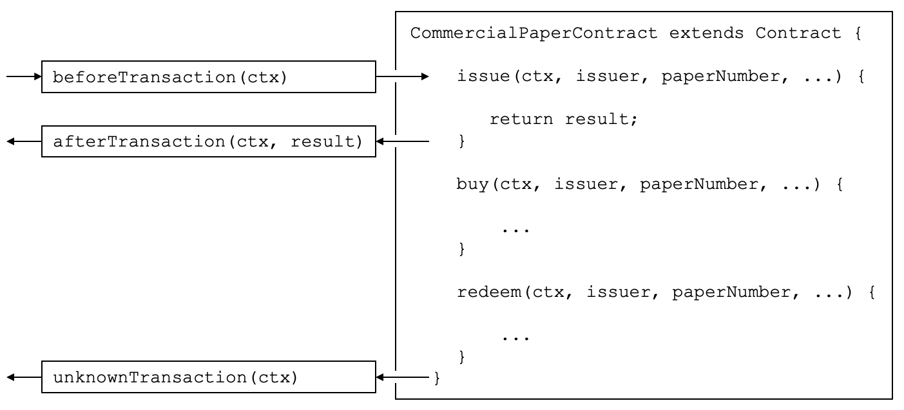

# 交易处理器

**受众**：架构师，应用和智能合约开发者

交易处理器允许智能合约开发人员在应用程序和智能合约交互期间的关键点上定义通用处理。交易处理器是可选的，但是如果定义了，它们将在调用智能合约中的每个交易之前或之后接收控制权。还有一个特定的处理器，当请求调用未在智能合约中定义的交易时，该处理程序接收控制。

这里是一个[商业票据智能合约示例](./smartcontract.html)的交易处理器的例子：



*前置、后置和未知交易处理器。在这个例子中，`beforeTransaction()` 在 **issue**, **buy** 和 **redeem** 交易之前被调用。`afterTransaction()` 在 **issue**, **buy** 和 **redeem** 交易之后调用。`UnknownFunction()` 当请求调用未在智能合约中定义的交易时调用。（通过不为每个交易重复 `beforeTransaction` 和 `afterTransaction` 框来简化该图）*

## 处理器类型

有三种类型的交易处理器，它们涵盖应用程序和智能合约之间交互的不同方面：

  * **前置处理器**：在每个智能合约交易执行之前调用。该处理器通常用来改变交易使用的交易上下文。处理器可以访问所有 Fabric API；如，可以使用 `getState()` 和 `putState()`。

  * **后置处理器**：在每个智能合约交易执行之后调用。处理器通常会对所有的交易执行通用的后置处理，同样可以访问所有的 Fabric API。

  * **未知处理器**：试图执行未在智能合约中定义的交易时被调用。通常，处理器将记录管理员后续处理的失败。处理器可以访问所有的 Fabric API。

Defining a transaction handler is optional; a smart contract will perform
correctly without handlers being defined. A smart contract can define at most
one handler of each type.

## 定义处理器

交易处理器作为具有明确定义名称的方法添加到智能合约中。这是一个添加每种类型的处理器的示例：

```JavaScript
CommercialPaperContract extends Contract {

    ...

    async beforeTransaction(ctx) {
        // Write the transaction ID as an informational to the console
        console.info(ctx.stub.getTxID());
    };

    async afterTransaction(ctx, result) {
        // This handler interacts with the ledger
        ctx.stub.cpList.putState(...);
    };

    async unknownTransaction(ctx) {
        // This handler throws an exception
        throw new Error('Unknown transaction function');
    };

}
```

交易处理器定义的形式对于所有处理程序类型都是类似的，但请注意 `afterTransaction(ctx，result)` 如何接收交易返回的任何结果。[API 文档](https://hyperledger.github.io/fabric-chaincode-node/{BRANCH}/api/fabric-contract-api.Contract.html) 展示了这些处理器的准确格式。

## 处理器处理

一旦处理器添加到智能合约中，它可以在交易处理期间调用。在处理期间，处理器接收 `ctx` ，即[交易上下文](./transationcontext.md)，会执行一些处理，完成后返回控制权。继续如下的处理：

* **前置处理器**：如果处理器成功完成，使用更新后的上下文调用交易。如果处理器抛出异常，不会调用交易，智能合约失败并显示异常错误消息。

* **后置处理器**：如果处理器成功完成，则智能合约将按调用的交易确定完成。如果处理程序抛出异常，则交易将失败并显示异常错误消息。

* **未知处理器**：处理器应该通过抛出包含所需错误消息的异常来完成。如果未指定**未知处理器**，或者未引发异常，则存在合理的默认处理;智能合约将以**未知交易**错误消息失败。

如果处理器需要访问函数和参数，这很容易做到：

```JavaScript
async beforeTransaction(ctx) {
    // Retrieve details of the transaction
    let txnDetails = ctx.stub.getFunctionAndParameters();


    console.info(`Calling function: ${txnDetails.fcn} `);
    console.info(util.format(`Function arguments : %j ${stub.getArgs()} ``);
}
```

See how this handler uses the utility API `getFunctionAndParameters` via the
[transaction context](./transactioncontext.html#stub).

## 多处理器

It is only possible to define at most one handler of each type for a smart
contract. If a smart contract needs to invoke multiple functions during before,
after or unknown handling, it should coordinate this from within the appropriate
function.