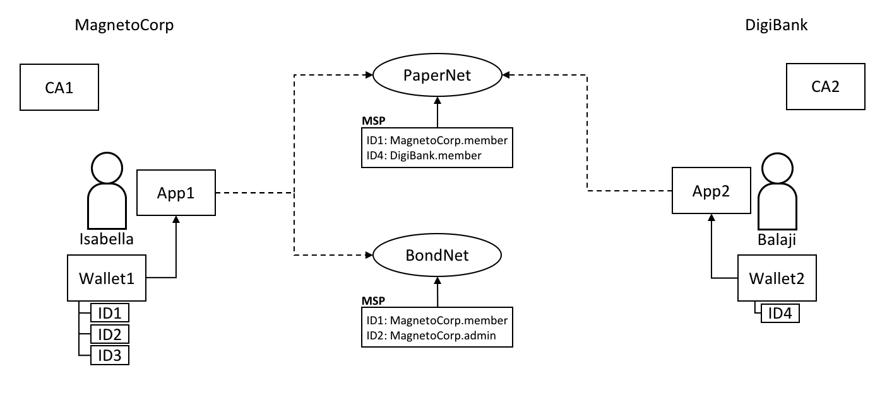
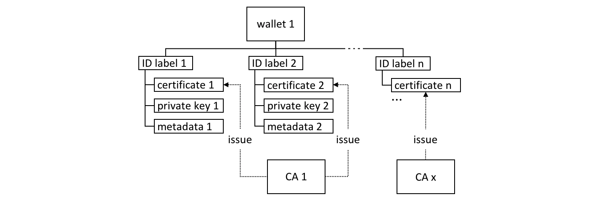

# 钱包

**受众**：架构师、应用程序和智能合约应用开发者们

一个钱包包括了一组用户身份。当与通道连接的时候，应用程序会从这些身份中选择一个用户来运行。对通道资源的访问权限，比如账本，由与 MSP（Membership provider）相关联的这个身份所定义。

在本主题中，我们将涉及：

* [为什么钱包是重要的](#情景)
* [钱包是如何被组织的](#结构)
* [钱包的不同类型](#类型)
* [钱包的操作](#操作)

## 情景

当应用程序连接到一个比如像 PaperNer 的网络通道的时候，它选择一个用户身份去这么做，例如 `ID1`。通道的 MSP 将 `ID1` 与组织内特定的角色相关联，而且这个角色将最终决定应用程序在通道上的权限。


*两个用户， Isabella 和 Balaji 拥有包含能够用于连接不同网络通道的不同身份的钱包，PaperNet 和 BondNet。*

思考一下这两个用户的例子；来自于 MagnetoCorp 的 lsabella 和来自 DigiBank 的 Balaji。Isabella 打算使用应用程序1去调用 PaperNet 里的智能合约和一个 BondNet 的智能合约。同理，Balaji 打算使用应用程序2去调用智能合约，但是这是在 PaperNet 中。（对于应用程序来说，访问多个网络和其中多个的智能合约是[简单的](./application.html#construct-request)。)

看一下：

* MagnetoCorp 使用 CA1 去颁发身份，DigiBank 使用 CA2 去颁发身份。这些身份被存储在用户的钱包中。

* Balaji 的钱包拥有一个唯一的身份, `ID4` 由 CA2 发行。Isabella 的钱包拥有多种被 CA1 颁发的身份，`ID1`、 `ID2`  和 `ID3`。钱包能够让一个用户拥有多个身份，并且每一个身份都能由不同的 CA 颁发。

* Isabella 和 Balaji 都连接到 PaperNet，它（PaperNet）的 MSP 确定了 Isabella 是 MagnetoCorp 的成员，且确定了 Balaji 是 DigiBank 组织的一员，因为信任颁发他们身份的 CA。（一个组织使用多个 CA 或者一个 CA 支持多个组织是[可能的](../membership/membership.html#mapping-msps-to-organizations)） 

* Isabella 能够使用 `ID1` 去连接 PaperNet 和 BondNet。在这两种情况下，当 Isabella 使用这个身份时候，她会被是识别为 MangetoCorp 的一员。

* Isabella 能够使用 `ID2` 去连接 BondNet，在这种情况下，她被标识为 MagnetoCorp 的管理员。这给了 Isabella 两种不同的权利：`ID1` 把她标识为能够读写 BondNet 账本的 MagnetoCorp 的普通一员，然而 `ID2` 标识她为能够给 BondNet 添加组织的 MagnetoCorp 的管理员。

* Balaji 不能够使用 `ID4` 连接 BondNet。如果他尝试去连接，`ID4` 将不会被认可其属于 DigiBank，因为 CA2 不知道 BondNet 的 MSP。

## 类型

根据他们身份存储的位置，会有不同的钱包的类型。


*三种不同的钱包类型:文件系统、内存和 CouchDB*

* **文件系统（FileSystem）**：这是存储钱包最常见的地方；文件系统是无处不在的、容易理解且可以挂载在网络上。对于钱包来说，这是很好的默认选择。

* **内存（In-memory）**：存储在应用程序里的钱包。当你的应用程序正在运行在一个没有访问文件系统的约束环境的时候，使用这种类型的钱包；有代表性的是 web 浏览器。需要记住的是这种类型的钱包是不稳定的；在应用程序正常结束或者崩溃的时候，身份将失去丢失。

* **CouchDB**：存储在 Couch DB 的钱包。这是最罕见的一种钱包存储形式，但是对于想去使用数据备份和恢复机制的用户来说，CouchDB 钱包能够提供一个有用的选择去简化崩溃的恢复。

使用 `Wallets` [类](https://hyperledger.github.io/fabric-sdk-node/{BRANCH}/module-fabric-network.Wallets.html)提供的工厂方法来创建钱包。

### 硬件安全模块

硬件安全模块(Hardware Security Module，HSM)是一种超安全、防篡改的设备，
它存储数字身份信息，特别是私钥，HSM可以
本地连接到您的计算机或者可访问的网络。大多数HSM提供
使用私钥执行机上加密的能力，正是如此所以私钥
从不与HSM分离。

HSM可以用于任何类型的钱包。在本例中身份证书
将被存储在钱包中，私钥将被存储于HSM中。

要启用HSM管理身份的功能，必须使用HSM连接信息配置`IdentityProvider`，并将其注册到钱包。
要了解更多细节，
请参考[使用钱包管理身份](https://hyperledger.github.io/fabric-sdk-node/{BRANCH}/tutorial-wallet.html)教程。

## 结构

一个单一的钱包能够保存多个身份，每一个都被一个被指定的证书机构发放。每一个身份都有一个规范的带有描述性标签的结构，一个包括公钥、私钥与一些 Fabric-specific 元数据的 X.509 证书。不同的[钱包类型](#类型) 将这个结构合理地映射到他们地存储机制上。


*Fabric 钱包能够持有多个被不同证书机构颁发的身份，身份包含了证书、私钥和一些 Fabric 元数据*

这是几个关键的类方法，使得钱包和身份更容易被管理：

```JavaScript
const identity: X509Identity = {
    credentials: {
        certificate: certificatePEM,
        privateKey: privateKeyPEM,
    },
    mspId: 'Org1MSP',
    type: 'X.509',
};
await wallet.put(identityLabel, identity);
```

看看如何创建一个`identity`，它有元数据`Org1MSP`，一个`certificate`和
一个`privateKey`。看看`wallet.put()`如何将此身份添加到带有一个
特定的`identityLabel`的钱包。

在上面的例子中，`Gateway`类只要求`mspId`和`type`元数据被设置为
一个身份——`Org1MSP`和`X.509`。它**当前**使用MSP ID值认证
[connection profile](./connectionprofile.html)中的特定peer节点，
例如，当一个特定的通知[strategy](./connectoptions.html)被请求。
在DigiBank gateway文件`networkConnection.yaml`中，看看
`Org1MSP`通知将如何与`peer0.org1.example.com`关联:

```yaml
organizations:
  Org1:
    mspid: Org1MSP

    peers:
      - peer0.org1.example.com
```

你真的不需要担心内部不同的钱包类型的结构，但是如果你感兴趣，导航到商业票据例子里的用户身份文件夹：

```
magnetocorp/identity/user/isabella/
                                  wallet/
                                        User1@org1.example.com.id
```

你能够检查这些文件，但是正如讨论的，它很容易去使用 SDK 实现这些数据。

## 选项

不同的钱包类型都实现了一个公共的
[Wallet](https://hyperledger.github.io/fabric-sdk-node/{BRANCH}/module-fabric-network.Wallet.html)接口，
该接口提供了一组标准api来管理身份标识。这意味着
其他应用程序可以独立于底层钱包存储
机制；例如，文件系统和HSM钱包都以高度
类似的方式进行处理。


*钱包遵循一个生命周期：他们能够被创建、被打开，身份能够被读取、添加和删除。*

应用程序能够根据一个简单的生命周期去使用钱包。钱包能够被打开、创建，随后可以添加、读取、更新和删除身份。花费一些时间在 [JSDOC](https://hyperledger.github.io/fabric-sdk-node/{BRANCH}/module-fabric-network.Wallet.html) 中不同的 `Wallet` 方法上来看一下他们是如何工作的；商业票据的教程在 `addToWallet.js` 中提供了一个很好的例子：

```JavaScript
const wallet = await Wallets.newFileSystemWallet('../identity/user/isabella/wallet');

const cert = fs.readFileSync(path.join(credPath, '.../User1@org1.example.com-cert.pem')).toString();
const key = fs.readFileSync(path.join(credPath, '.../_sk')).toString();

const identityLabel = 'User1@org1.example.com';
const identity = {
    credentials: {
        certificate: cert,
        privateKey: key,
    },
    mspId: 'Org1MSP',
    type: 'X.509',
};

await wallet.put(identityLabel, identity);
```

注意：

* 当程序第一次运行的时候，钱包被创建在本地文件系统 `.../isabella/wallet`。

* `证书`和`密钥`从文件系统中下载。

* 一个新的身份使用`证书`,`密钥` 和 `Org1MSP` 来创建。

* 新的身份通过 `wallet.put()` 加入的钱包中，并附带 `User1@org1.example.com` 标签。

这是关于钱包你所要知道的所有事情。你已经看到用户代表在访问 Fabric 网络资源上，钱包如何持有被应用程序使用的身份的。更具你的应用程序和安全需要，这里有一些有用的不同类型的钱包，和一套简单的 API 去帮助应用程序去管理其内部的钱包和身份。

<!--- Licensed under Creative Commons Attribution 4.0 International License
https://creativecommons.org/licenses/by/4.0/ -->
