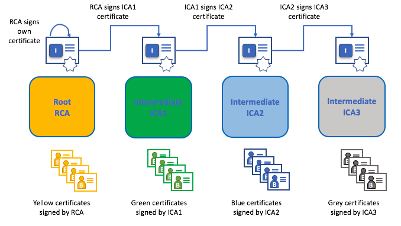
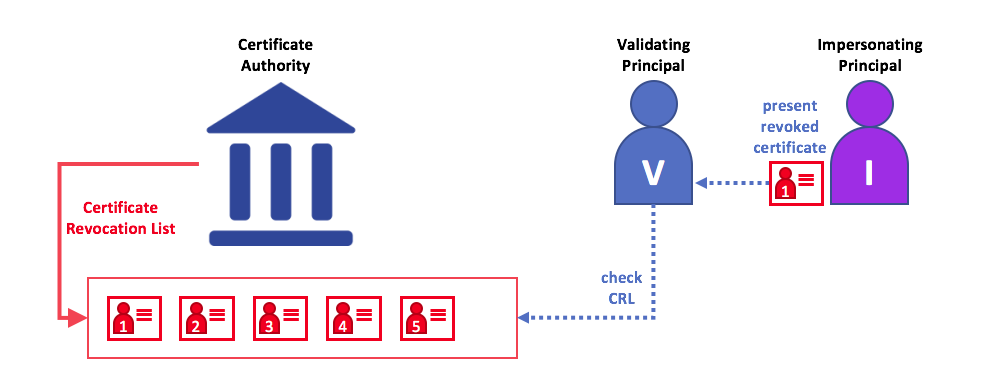

# 身份

## 什么是身份？

区块链网络中的不同参与者包括 Peer 节点、排序节点、客户端应用程序、管理员等等。这些参与者都有一个封装在 X.509 数字证书中的数字身份。这些身份非常重要，因为它们**决定了参与者在区块链网络中对资源的确切权限和对信息的访问权限**。

此外，数字身份还具有一些额外的属性，Fabric 使用这些属性来确定权限，并为身份和相关属性的联合提供了一个特殊的名称—**主体**。主体与 userid 或 groupid 类似，但是更加灵活，因为它们可以包含参与者身份的广泛属性，比如参与者的组织、组织单元、角色，甚至参与者的特定身份。当我们讨论主体时，它们是决定其权限的属性。

要使身份**可验证**，它必须来自**受信**的权威机构。[成员服务提供者](../membership/membership.html)（MSP）就是Fabric中的受信机构。更具体地说，MSP 是一个为组织定义有效身份管理规则的组件。Fabric 中的默认 MSP 实现使用 X.509 证书作为身份，采用了传统公钥基础设施（PKI）层次模型（稍后将详细介绍 PKI）。

## 一个简单的场景来解释身份的使用

假设你去超市买一些杂货。在收银台，你会看到一个牌子，上面写着只接受 Visa、Mastercard 和 AMEX 卡。如果你想用另一张卡支付——我们称之为 “ImagineCard”——不管这张卡是否真实，你的账户里是否有足够的资金。我们不会接受的。

*拥有一张有效的信用卡是不够的——它还必须被商店接受！PKI 和 MSP 以相同的方式协同工作——PKI 提供了一个身份列表，MSP 表示这些身份中哪些是参与网络的给定组织的成员。*

PKI 证书授权中心和 MSP 提供了类似的功能组合。PKI 就像一个卡提供商——它提供许多不同类型的可验证身份。另一方面，MSP 类似于商店接受的卡片提供者列表，确定哪些身份是商店支付网络的可信成员（参与者）。**MSP 将可验证的身份转换为区块链网络的成员**。

让我们更详细地研究一下这些概念。

## 什么是PKI？

**公钥基础设施（PKI）是一组互联网技术，它在网络中提供安全的通信**。将 **S** 放入 **HTTPS** 的是 PKI——如果您在 web 浏览器上阅读本文，您可能正在使用 PKI 来确保它来自经过验证的来源。

*公钥基础设施（PKI）的元素。PKI 由证书授权中心组成，这些授权中心向各方（例如服务的用户、服务提供者）颁发数字证书，然后在与环境交换的消息中使用这些证书对自己进行身份验证。CA 的证书撤销列表（CRL）构成不再有效的证书的引用。撤销证书的原因有很多。例如，因为与证书关联的加密私有材料已被公开，证书可能会被吊销。*

虽然区块链网络不仅仅是一个通信网络，它还依赖 PKI 标准来确保各个网络参与者之间的安全通信，并确保在区块链上发布的消息得到正确的身份验证。因此，了解 PKI 的基础知识以及为什么 MSP 如此重要是很重要的。

PKI 有四个要素：
 * **数字证书**
 * **公钥和私钥**
 * **证书授权中心**
 * **证书撤销列表**

让我们快速描述一下这些 PKI 基础知识，如果您想了解更多细节，可以从 [Wikipedia](https://en.wikipedia.org/wiki/Public_key_infrastructure) 开始。

## 数字证书

数字证书是包含一组与证书持有者相关的属性的文档。最常见的证书类型是符合 [X.509 标准](https://en.wikipedia.org/wiki/X.509)的证书，该标准允许在其结构中编码某参与方的身份细节。

例如，密歇根州底特律市 Mitchell Cars 公司制造部门的玛丽莫里斯可能拥有一个 SUBJECT  属性为 C=US, ST=Michigan, L=Detroit, O=Mitchell Cars, OU=Manufacturing, CN=Mary Morris /UID=123456 的数字证书。玛丽的证件类似于她的政府身份证——它提供了有关玛丽的信息，她可以用这些信息来证明有关她的关键事实。在 X.509 证书中还有许多其他属性，但是现在让我们只关注这些属性。

*描述一个叫玛丽·莫里斯的参与方的数字证书。玛丽是证书的 SUBJECT ，突出显示的主题文本显示了关于玛丽的关键事实。如您所见，证书还包含更多的信息。最重要的是，玛丽的公钥分布在她的证书中，而她的私钥没有。此签名密钥必须保持私有。*

重要的是，玛丽的所有属性都可以使用一种称为密码学的数学技术（字面意思是“秘密写作”）记录下来，这样篡改会使证书失效。密码学允许玛丽向其他人提供她的证书，以证明她的身份，只要另一方信任证书颁发者，即**证书颁发机构**（certificate Authority, CA）。只要 CA 安全地保存某些加密信息（即它自己的**私有签名密钥**），任何阅读证书的人都可以确保关于玛丽的信息没有被篡改——它始终具有玛丽莫里斯的那些特定属性。将玛丽的 X.509 证书看作是无法更改的数字身份证。

## 认证，公钥和私钥

身份认证和消息完整性是安全通信中的重要概念。身份认证要求交换消息的各方确信创建特定消息的身份。要使信息具有“完整性”，就意味着信息在传输期间不可能发生过修改。例如，您可能想要搞清楚正与自己通信的到底是真的玛丽还是冒充者。或者，如果玛丽给你发了一条信息，你可能想要确保它在传输过程中没有被任何人篡改过。

传统的身份认证机制依赖于**数字签名**，顾名思义，就是允许一方对其消息进行数字**签名**。数字签名还为签名消息的完整性提供了保证。

从技术上讲，数字签名机制要求每一方都持有两个加密连接的密钥:一个公开密钥和一个私有秘钥。公开密钥高度可获取，充当身份验证锚；私有秘钥用于在消息上生成**数字签名**。数字签名消息的接收方可以通过检查消息中的附加签名在预期发送方的公钥下是否有效来验证所接收消息的来源和完整性。

**私钥与其对应公钥之间的独特关系是使安全通信成为可能的密码术**。密钥之间独特的数学关系在于私钥可用于对消息生成签名，只有对应的公钥能够、且仅能在相同消息上与之匹配。

在上面的示例中，玛丽使用她的私钥对消息签名。任何使用玛丽的公钥查看此签名消息的人都可以验证该签名。

## 证书授权

如您所见，参与者或节点可通过**数字身份**的方式参与区块链网络，该数字身份是由系统信任的机构为其颁布的。多数情况下，数字身份（或简称**身份**）具有密码验证的数字证书形式，符合 X.509 标准，由证书授权中心（CA）颁发。

CA 是互联网安全协议的一个常见部分，您可能听说过一些比较流行的协议：赛门铁克（最初是 Verisign）、GeoTrust、DigiCert、GoDaddy 和 Comodo 等等。

*证书授权中心将证书分发给不同的参与者。这些证书由 CA 进行数字签名，证书把参与者与其公钥绑定在一起（也可以和一整套属性绑定）。因此，如果一方信任 CA （并且知道CA的公钥），那么通过验证参与者证书上的 CA 签名，它就可以信任以下事实：证书中的公钥是该参与者的；该参与者拥有证书中所包含的属性。*

证书既不包含参与者的私钥，也不包含 CA 的私钥，因此可以广泛传播。证书可作为验证不同参与者所发送的信息的信任锚。

CA 也有一个证书，可以广泛使用。这样的话，若某参与方想要使用一指定CA颁布的证书，可以通过检查证书只能由相应私钥（CA）的持有者生成来验证该证书。

在区块链设置中，希望与网络交互的每个参与者都需要一个身份。在这种情况下，您可能会说可以使用一**个或多个 CA** 从**数字的角度定义组织的成员**。CA为组织的参与者拥有可验证的数字身份奠定了基础。

### 根 CA，中间 CA 和信任链

CA 有两种类型：**根 CA** 和**中间 CA**。由于根 CA（赛门铁克、Geotrust等）必须向互联网用户**安全颁发**数亿个证书，因此将此过程分散到所谓的中间 CA 是有意义的。中间 CA 的证书由根 CA 或其他中间机构颁发，这就为链上所有 CA 颁发的全部证书建立起一条“信任链”。追溯到根 CA 的这种能力不仅使得 CA在保证安全的同时扩展了自身功能——让使用证书的组织在运用中间 CA的时候有足够信心——而且还限制了根 CA 的暴露。根CA一旦遭到破坏，将会危及整个信任链。而如果受到损害的是中间CA，则曝光量会小得多。

*在根 CA 和一组中间 CA 之间建立信任链的前提是，每个中间 CA 的证书颁发机构 要么是根 CA 本身，要么是与根CA有信任链关系的其他中间CA。*

当涉及到跨多个组织颁发证书时，中间 CA 提供了巨大的灵活性，这在许可区块链系统（如 Fabric）中非常有用。例如，您将看到不同的组织可能使用不同的根 CA，或者使用相同的根 CA 和不同的中间 CA——这完全取决于网络的需要。

### Fabric CA

因为 CA 非常重要，所以Fabric 内置了一个的CA 组件，支持用户在自己搭建的区块链网络中创建 CA。该组件——称为 **Fabric CA**，是一个私有根 CA 的提供者，能够管理具有 X.509 证书的 Fabric 参与者的数字身份。因为 Fabric CA 是针对 Fabric 根 CA 需求的一种自定义 CA，所以它本质上不能为浏览器中的常规/自动使用提供 SSL 证书。但是，由于必须使用**一些** CA 来管理身份（即使是在测试环境中），因此可以用Fabric CA 来提供和管理证书。使用公共/商业根CA或中间 CA 来提供身份也是可以的，而且是完全合适的。

如果您感兴趣，可以在 [CA 文档部分](http://hyperledger-fabric-ca.readthedocs.io/)阅读更多关于 Fabric CA 的内容。

## 证书撤销列表

证书撤销列表（Certificate Revocation List， CRL）很容易理解——它就是一个证书的参照列表，有了它，CA 就知道列表上的这些证书是因为这样或那样的原因被撤销了的。回忆一下上文中我们谈到的商店场景，其中CRL 就好比一个被盗信用卡列表。

当第三方想要验证另一方的身份时，它首先会检查颁发其证书的 CA 的 CRL，以确保该证书未被撤销。验证者不是必须要检查 CRL，但是如果他们不检查 ，就将冒着接受被盗身份的风险。

*使用 CRL 检查证书是否依然有效。如果虚假身份者试图将一个已受损的数字证书传递给验证方，可以根据证书颁发CA 的 CRL 检查它，以确保它未被列为不再有效。*

注意，被撤销的证书与到期的证书相差甚远。被撤销的证书还没有过期——按其他任何标准衡量，它们都是完全有效的证书。有关 CRL 的更多信息，请单击[这里](https://hyperledger-fabric-ca.readthedocs.io/en/latest/users-guide.html#generating-a-crl-certificate-revocation-list)。

现在您已经了解了 PKI 如何通过信任链来提供可验证的身份，下一步就来看如何使用这些身份来代表区块链网络的受信成员。这就是成员服务提供者（MSP）发挥作用的地方——**它能识别出区块链网络中给定组织的成员**。

要了解更多关于成员身份的信息，请参阅关于 [MSP](../membership/membership.html) 的概念文档。

<!---
Licensed under Creative Commons Attribution 4.0 International License https://creativecommons.org/licenses/by/4.0/
-->
