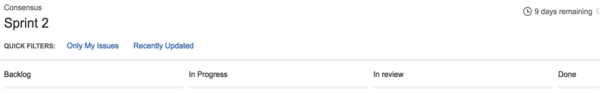

通过 Jira 来了解当前的工作
===========================================

本文档旨在让你进一步了解基于社区路线图的 Hyperledger Fabric v1 架构方面的工作进展。我们通过 `Jira <https://jira.hyperledger.org/>`__ 来管理路线图。

我们用冲刺（sprint）来管理，并且按照反馈列表中问题实现的优先级进行排序展示。我们使用面板来实现这些功能。通过点击 **Boards** -> **Manage Boards** 来查看这些面板：

.. figure:: images/Jira.png
   :alt: Jira boards

   Jira boards

现在点击屏幕左侧的 **全部面板** ：

.. figure:: images/Jira1.png
   :alt: Jira boards

   Jira boards

在这里，你可以看到所有公共（或者受限制的）面板。如果你想看当前冲刺下的美容，请点击 **可见性** 为 **全部用户**，而且 **面板类型** 是 **Scrum** 的条目。举个例子， **面板名称** Consensus：

.. figure:: images/Jira2.png
   :alt: Jira boards

   Jira boards

当你点击了 **面板名称** 下的 Consensus 之后，你会被重定向到下面的列中：

   Jira boards

这些列的含义如下:

-  Backlog – 为当前冲刺计划的条目（冲刺的定义是两周一个迭代）, 但是不在当前的进程中。
-  In progress – 由某些人正在进行的条目。
-  In Review – 在 Gerrit 中正在等待审查和合并的条目。
-  Done – 在这个冲刺中已经合并完成的条目。

如果你希望查看某一个特性的 backlog 的所有条目，点击导航栏左侧的行即可：

.. figure:: images/Jira4.png
   :alt: Jira boards

   Jira boards

这张图展示了当前的冲刺的条目，所有的底部的待办的条目。所有的条目都按优先级排列。

如果有一个你感兴趣的条目正在进行，你有一些问题或者想了解一些信息，或者你觉得有些条目有必要提高优先级，请在 Jira上 直接评论。感谢所有有帮助的反馈和帮助。

.. Licensed under Creative Commons Attribution 4.0 International License
   https://creativecommons.org/licenses/by/4.0/

