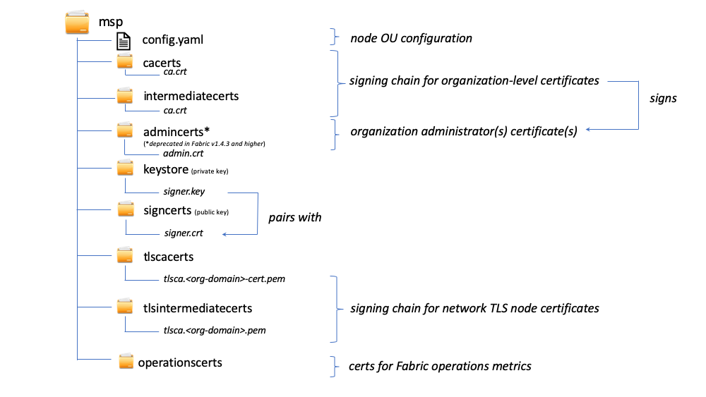

# 成员服务提供者 (MSP)

## 为什么需要MSP?

因为Fabric是一个认证性的网络, 所以区块链参与者需要一种向网络中的其他参与者证实自己身份的机制从而在网络中进行交易。如果你已经阅读文档[身份](../identity/identity.html)，你会看到公钥基础结构如何通过信任链提供可认证的身份信息。那么区块链网络是怎么应用信任链的？

证书机构通过生成可以用来证实身份的由公钥和私钥形成的键值对来发放认证信息。因为一个私钥永远不会被公开，所以引入了一种可以证实身份的机制即MSP。例如，一个peer节点用它的私钥进行数字签名或背书交易。接着排序节点包含的该peer节点的公钥会被用来验证交易携带的签名是否合法。私钥被用作生成交易信息上的，只有与私钥相对应的且作为MSP一部分的公钥可以匹配的签名。因此，MSP是一个可让身份被信任和被网络中其他参与者公认的，而不需要暴露成员的私钥的机制。

回想一下同样是身份认证相关的信用卡场景，证书颁发机构就像一个信用卡提供商，它分发许多不同类型的可验证的身份。另一方面，MSP确定商店接受哪些信用卡提供商。通过这种方式，MSP将一个身份(信用卡)转换为一个角色(在商店购买东西的能力)。

这种将可验证身份转换为角色的能力是Fabric网络功能的基础，因为它给予组织、节点和通道建立MSPs的能力，使其确定谁可以在组织、节点和通道层次上运作。


*Identities类似于你的信用卡，用来证明你可以支付。MSP类似于被商店接受的信用卡清单。*

以运用区块链网络的银行联盟为例。各个银行操作peer节点和排序节点，并且这些peer节点对提交到网络的交易进行背书。然而，每个银行也会有部门和账户持有人。帐户持有人将属于各个组织，但不会运行网络上的节点。他们只会通过移动电话或web应用程序与系统交互。那么网络如何识别和区分这些身份呢?于是一个CA用于创建身份，但就跟信用卡的例子一样，这些身份不能就这样被颁发，它们需要被网络识别。MSPs被用于定义哪些是受网络成员信任的组织。MSPs也是在网络中为成员提供一系列角色和权限的机制。因为定义这些组织的MSPs是网络成员所知道的，所以可以使用这些MSP来验证是否允许网络对象试图执行的操作。

最后，考虑一下如果您想要加入一个 _现有的_ 网络，您需要一种方法来将您的身份转换为可以被网络识别的东西。MSP是一种机制，使您能够加入一个需要许可的区块链网络。要在Fabric网络上进行交易，成员需要这样做：

1. 拥有一个由网络信任的CA颁发的身份。
2. 成为一个被网络成员认可和认可的 _组织_ 的成员。MSP将身份与组织的成员资格联系在一起。成员资格是通过将成员的公钥(也称为证书、签名证书或签证)添加到组织的MSP来实现的。
3. 将MSP添加到网络上的一个[联盟](../glossary.html#consortium) 或者通道。
4. 确保MSP包括在网络中的[策略](../policies/policies.html) 定义。

## MSP是什么?

尽管取着这样的名字，但是实际上成员服务提供者并不提供任何东西。相反,MSP要求的实现是一组文件夹添加到网络的配置，和用于内部地(组织决定它的管理员是谁)和外部地(通过允许其他组织验证对象是否有权做他们正在试图做的事情)定义一个组织。尽管证书颁发机构生成代表身份的证书，但MSP仍包含一个被允许的身份的列表。

MSP通过列出其成员的身份，或通过确定哪些是为其成员授权颁发有效身份的ca，来识别和确定接受来自这些根ca和中间ca所定义的信任域的成员。

但是MSP的能力不仅仅是简单地列出谁是一个网络参与者或一个通道的成员。MSP通过标识参与者在节点或通道上拥有的特定特权，将身份转换为**角色**。请注意，当用户使用Fabric CA注册时，该用户必须关联到管理员、peer节点、客户端、排序节点或成员其中之一的角色。例如，注册为“peer”角色的身份应该自然而然地给到peer节点。同样，注册为“admin”角色的身份也应该被授予给组织管理员。我们将在本章节后面深入探讨这些角色的重要性。

此外，MSP可以识别被撤销的身份列表——就像[身份](../identity/identity.html)文档中所讨论的——而我们将讨论该过程如何扩展到MSP。

## MSP 域

在区块链网络中，MSP 出现在两个位置：

* 在参与者节点本地（**本地 MSP**）
* 在通道配置中（**通道 MSP**）

本地MSPs和通道MSPs之间的关键区别不在于它们如何运作——它们都将身份转化为角色——而是它们的**范围**。每个MSP列出特定管理级别上的角色和权限。

### 本地MSP

**本地MSP是为客户端和节点(peer节点和排序节点)定义的**。
本地MSPs定义节点的权限(例如，谁是可以操作节点的peer节点管理员)。客户端(以上银行场景的账户持有人)的本地MSP,允许用户作为一个通道成员或作为一个特定角色的所有者如组织管理者，在其交易(如链码交易)进行身份验证从而进入系统,例如,进行配置交易。

**每个节点都必须定义一个本地MSP**，因为它定义了在该级别上谁拥有管理权或参与权(peer节点管理员不一定是通道管理员，反之亦然)。这允许在通道上下文之外对成员消息进行身份验证，并定义特定节点(例如，能够在peer节点上安装链码的节点)的权限。请注意，一个组织可以拥有一个或多个节点。MSP定义了组织管理员。组织、组织的管理员、节点的管理员以及节点本身都应该具有相同的信任根。

排序节点的本地MSP也在节点的文件系统上定义，并且只应用于该节点。与peer节点一样，排序节点也由单个组织拥有，因此有一个MSP来列出它信任的参与者角色或节点。

### 通道MSP

相比之下，**通道MSP在通道层面上定义了管理权和参与权**。应用程序通道上的peer节点和排序节点共用通道MSP的相同视图，因此能够正确地对通道参与者进行身份验证。这意味着，如果组织希望加入通道，则需要在通道配置中添加包含组织成员信任链的MSP。否则，来自该组织身份的交易将被拒绝。本地MSP表现为文件系统上的文件夹结构，而通道MSP则在通道配置中被描述。


*从通道配置config.json文件中截取片段，其中包括两个组织MSP*

**通道MSP识别谁在通道层次拥有权限**。
通道MSP定义通道成员(本身是MSP)的身份和通道级策略的执行之间的 _关系_ 。通道MSP包含通道成员组织的MSP。

**每个参与通道的组织都必须为其定义一个MSP**。事实上，建议在组织和MSP之间建立一对一的映射。MSP定义了哪些成员被授权代表组织行事。这包括MSP本身的配置以及批准组织进行具有管理角色权限的任务，例如向通道添加新成员。如果所有网络成员都是单个组织或MSP的一部分，那将没有数据隐私。多个组织通过将账本数据仅隔离给通道成员来促成隐私保护。如果组织内部需要更细的隔离粒度，则可以将组织进一步划分为组织单元(ou)，我们将在本章节后面详细描述这些单元。

**系统通道MSP包括参与排序服务的所有组织的MSP**。排序服务可能包括来自多个组织的排序节点，这些组织共同运行排序服务，最重要的是管理组织联盟和应用程序通道所继承的默认策略。

**本地MSP仅在其应用的节点或用户的文件系统上定义**。因此，在物理上和逻辑上，每个节点只有一个本地MSP。然而，由于通道MSP对通道内的所有节点都可用，它们在通道配置中逻辑上仅定义一次。然而，**通道MSP也在通道中的每个节点的文件系统上实例化，并通过共识保持同步**。因此，尽管每个节点的本地文件系统上都有每个通道MSP的副本，但从逻辑上讲，通道MSP存在并被维护于通道或网络上。

下图说明了本地MSP和通道MSP在网络中是如何共存的:


*peer节点和排序节点的MSP是本地化的，而一个通道(包括网络配置通道，也称为系统通道)的MSP是全局化的，被该通道的所有参与者共用。在该图中，网络系统通道由ORG1管理，而另一个应用程序通道可以由ORG1和ORG2管理。peer节点是ORG2的成员并由ORG2管理，而ORG1则管理图中的排序节点。ORG1信任来自RCA1颁布的身份，而ORG2信任来自RCA2颁布的身份。需要注意的是，这些是管理身份标识，反映了谁可以管理这些组件。所以当ORG1管理网络时，网络定义中确实存在ORG2的MSP*。

## 组织在MSP中的角色是什么?

**组织**是一个逻辑上成员们的管理组。它可以大到跨国公司，也可以小到花店。关于组织(或**orgs**)最重要的是他们在单个MSP下管理其成员。MSP允许将标识链接到组织。注意，这与我们前面提到的组织概念中定义的X.509证书不同。

组织和它的MSP之间的专属关系使得以组织的名字为前缀命名MSP是合乎情理的，大多数策略配置都会采用这种约定。例如，组织`ORG1`可能有一个类似于`ORG1-MSP`的MSP。在某些情况下，一个组织可能需要多个成员组——例如，在组织之间使用通道执行完全不同的业务功能。在这些情况下，有多个msp并据此约定命名它们是有意义的，例如，`ORG2-MSP-NATIONAL`和`ORG2-MSP-GOVERNMENT`，反映了`GOVERNMENT`控制的通道与`NATIONAL`交易通道在`ORG2`中不同的成员资格信任根。

### 组织单元(ou)和MSP

一个组织也可以被划分为多个**组织单元**，每个单元都有一定的职责，也称为`affiliations`。可以将组织单元看作组织内部的一个部门。例如，`ORG1`组织可能同时拥有`ORG1.MANUFACTURING`和`ORG1.DISTRIBUTION`组织单元，这反映了相隔离的业务流水线。当CA颁发X.509证书时，证书中的`OU`字段指定该身份所属的业务流水线。这样使用组织单元的一个好处是，这些值可以用于定义策略，以限制访问，或者用于基于属性的访问控制的智能合约。否则，就需要为每个组织创建单独的MSP。

OU字段是否指定是可选的。如果不使用ou, MSP中的所有身份(由根CA和中间CA文件夹认定的)都将被视为组织的成员。

### 节点组织单元和MSP

此外，还有一种特殊类型的组织单元，有时称为`节点组织单元`，可用于授予角色以身份标识。这些节点组织单元角色定义在`$FABRIC_CFG_PATH/msp/config.yaml`配置文件中，并包含一个组织单元列表，这些单元成员被认为是MSP所代表的组织的一部分。当您希望将组织成员限制为只具有特定节点组织单元角色的身份标识时(由MSP指定的其中一个CA进行签名)，这一点特别有用。例如，通过节点组织单元，您可以实现更细粒度的背书策略，该策略要求Org1的peer节点(而不是Org1的任何成员)为交易背书。

为了使用节点组织单元角色，您必须为网络启用“身份分类”特性。使用文件夹形式的MSP时，这可以通过在MSP目录下的配置文件config.yaml中启用“Node OUs”字段来实现:

```
NodeOUs:
  Enable: true
  ClientOUIdentifier:
    Certificate: cacerts/ca.sampleorg-cert.pem
    OrganizationalUnitIdentifier: client
  PeerOUIdentifier:
    Certificate: cacerts/ca.sampleorg-cert.pem
    OrganizationalUnitIdentifier: peer
  AdminOUIdentifier:
    Certificate: cacerts/ca.sampleorg-cert.pem
    OrganizationalUnitIdentifier: admin
  OrdererOUIdentifier:
    Certificate: cacerts/ca.sampleorg-cert.pem
    OrganizationalUnitIdentifier: orderer
```

在上述例子中, MSP有4种节点组织单元`角色`:

   * client
   * peer
   * admin
   * orderer

这个约定允许您根据X509证书的CommonName属性中显示的OU来区分MSP角色。上面的示例说明由cacerts/ca.sampleorg-cert.pem颁发的任何证书，字段OU=client的将被认定为客户端，字段OU=peer的将被认定为peer，以此类推。从Fabric的1.4.3版本开始，还有一个用于排序节点和管理员的OU。新的admins角色意味着您不再需要显式地将证书放置在MSP目录下的admincerts文件夹中。相反，用户的signcert文件夹结构中呈现的`admin`角色使其具有管理员用户的身份标识。

当使用Fabric CA或SDK`注册`带有CA的用户时，这些角色和OU属性会被分配给一个身份标识。随后`enroll`用户命令会在用户的`/msp`文件夹中生成证书。   


生成的角色和OU属性在位于`/signcerts`文件夹中的X.509签名证书中可见。`ROLE`属性被标识为`hf.Type`，其指的是参与者在其组织中的角色(例如，指定参与者是一个`peer`节点)。请参阅以下来自签名证书的代码片段，它显示了角色和ou在证书中是如何表示的。


**注意：** 对于通道MSP，仅仅只是某个参与者具有管理员的角色的话，是不能意味着他们就可以管理特定的资源的。给定的身份标识在管理系统方面的实际权力由管理系统资源的 _策略_ 决定。例如，通道策略可能指定`ORG1-MANUFACTURING`管理员，即具有`admin`角色和`ORG1-MANUFACTURING`节点组织单元的身份，使其有权向通道添加新组织，而`ORG1-DISTRIBUTION`管理员则没有这样的权限。

最后，联盟中的不同组织可以使用组织单元来区分彼此。但在这种情况下，不同的组织必须为其信任链使用相同的根CA和中间CA，并分配OU字段来标识每个组织的成员们。当每个组织都拥有相同的CA或信任链时，这使得系统比预期中的更加中心化，因此这在区块链网络上应该仔细考虑。

## MSP结构

让我们来探究提供我们迄今为止描述的这些功能的MSP元素。

本地MSP文件夹包含以下子文件夹:



*上图显示了本地MSP在文件系统中的子文件夹*

* **config.yaml:** 通过启用“Node OUs”和定义可接受的角色来配置Fabric中的身份分类特性。

* **cacerts:** 此文件夹包含此MSP代表的组织所信任的根CA的自签名X.509证书列表。此MSP文件夹中必须至少有一个根CA证书。

  这是最重要的文件夹，因为它确定了派生所有其他证书的必要CA，拥有这些证书才能被视为对应组织的成员，从而形成信任链。

* **intermediatecerts:** 此文件夹包含该组织所信任的中间CA的X.509证书列表。每个证书必须由MSP中的一个根CA，或者其本身颁发的CA链最终会指向一个受信任的根CA的任何中间CA，进行签名。

  一个中间CA可能代表组织的不同细分(如`ORG1-MANUFACTURING`和`ORG1-DISTRIBUTION`对应于`ORG1`)，或者组织本身(如果商业CA被用于组织的身份管理，则可能是这种情况)。在后一种情况下，中间CA可以用来表示组织的细分。[这里](../msp.html)你可以找到关于MSP配置的最佳实践的更多信息。请注意，一个正常工作的网络可能没有中间CA，在这种情况下，这个文件夹将是空的。

  与根CA文件夹一样，该文件夹也定义了CA，且证书必须从该CA颁发，才能被视为组织的成员。

* **admincerts (在Fabric的1.4.3及以上版本被弃用):** 此文件夹包含一个身份列表，这些身份定义了具有此组织管理员角色的参与者。通常，这个列表中应该有一个或多个X.509证书。

  **注意:** 在Fabric v1.4.3之前，管理员是通过显式地将证书放在peer节点本地MSP目录的`admincerts`文件夹中来被定义的。**Fabric的1.4.3及以上版本不再需要此文件夹中的证书。** 相反，建议在用户注册到CA时，使用`admin`角色来指定节点管理员。然后，该标识被节点OU角色在它们的signcert中识别为`admin`。提醒一下，为了使用管理员角色，必须在以上的config.yaml配置文件中，通过将“Node OUs”设置为`Enable: true`来启用“identity classification”特性。我们稍后将进一步探讨这个问题。

  提醒一下，对于通道MSP，仅有参与者具有管理员角色这个条件，并不能说明他们可以管理特定的资源。给定身份在管理系统中拥有的实际权限是由管理系统资源的 _策略_ 决定的。例如，通道策略可能指定`ORG1-MANUFACTURING`管理员拥有向通道添加新组织的权限，而`ORG1-DISTRIBUTION`管理员没有这样的权限。

* **keystore: (私钥)** 这个文件夹是为peer节点或排序节点的本地MSP(或客户端的本地MSP)定义的，其包含节点的私钥。此私钥用于签名数据——例如，作为背书阶段的一部分，用其签名交易提案响应。

  此文件夹对于本地MSP是强制性的，并且必须准确地包含一个私钥。显然，对该文件夹的访问必须仅限于对peer节点负有管理责任的用户。

  **通道MSP**配置不包含此文件夹，因为通道MSP仅提供身份验证功能，而不提供签名功能。

  **注意:** 如果您使用[硬件安全模块(HSM)](../hsm.html)进行私钥管理，此文件夹将为空，因为私钥由HSM生成并存储在HSM中。

* **signcert:** 对于peer节点或order节点(或在客户端的本地MSP中)，此文件夹包含节点的**签名密钥**。该密钥以加密方式与包含在**Node Identity**文件夹中的节点身份匹配，并用于签名数据——例如，作为背书阶段的一部分，签名交易提案响应。

  此文件夹对于本地MSP是强制性的，并且必须准确地包含一个公钥。显然，对该文件夹的访问必须仅限于对peer节点负有管理责任的用户。

  **通道MSP**的配置不包含此文件夹，因为通道MSP仅提供身份验证功能，而不提供签名功能。

* **tlscacerts:** 此文件夹包含受此组织信任的根CA的自签名X.509证书列表，**用于进行节点之间基于TLS的安全通信**。TLS通信的一个例子是peer节点需要连接到排序节点，以便它能接收到账本更新数据。

  MSP和TLS信息与网络内的节点相关——peer节点和排序节点，换句话说，而不是与使用网络的应用程序和管理程序相关。

  此文件夹中必须至少有一个TLS根CA证书。有关TLS的更多信息，请参见[使用传输层安全协议(TLS)保护通信](../enable_tls.html)。

* **tlsintermediatecacerts:** 此文件夹包含一个受该MSP所代表的组织信任的中间CA证书列表，**用于进行节点之间基于TLS的安全通信**。当商业CA被用作一个组织的TLS证书时，此文件夹特别有用。与成员资格中间CA类似，TLS中间CA的指定是可选的。

* **operationscerts:** 此文件夹包含与[Fabric运维服务](../operations_service.html)API通信所需的证书。

通道MSP包含以下附加文件夹:

* **Revoked Certificates:** 如果参与者的身份被撤销，关于该身份的识别信息——而不是身份本身——会被保存在这个文件夹中。对于基于x.509的身份，这些标识符是被称为Subject Key Identifier(SKI)和Authority Access Identifier(AKI)的字符串对，并且在使用证书时被检查，以确保证书没有被撤销。

  尽管这个列表在概念上与CA的证书撤销列表(CRL)相同而已，但它也与组织成员的撤销有关。因此，通道MSP的管理员可以通过发布CA的更新过的CRL，快速从组织中撤销参与者或节点。这个“撤销列表中的列表”具有可选择性。只有当证书被撤销时，它才会被填充。

如果你读过这个文档以及我们关于[身份](../identity/identity.html)的文档，你应该对身份和成员在 Hyperledger Fabric 中的作用有了很好的理解。您了解了如何使用 PKI 和 MSP 来识别在区块链网络中协作的参与者。您学习了证书、公钥、私钥和信任根的工作原理，以及 MSP 的物理和逻辑结构。

<!---
Licensed under Creative Commons Attribution 4.0 International License https://creativecommons.org/licenses/by/4.0/
-->
