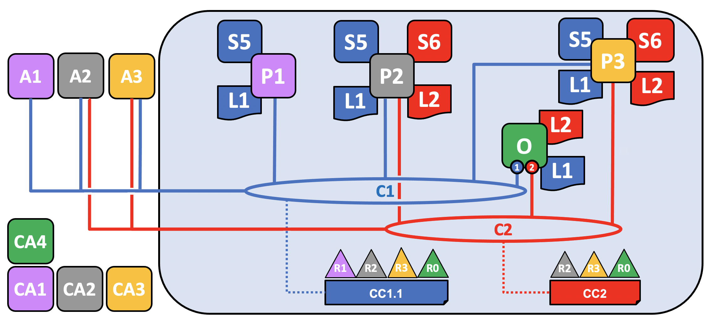

# 区块链网络

这个话题会在**概念层面上**描述 Hyperledger Fabric 是如何让组织间以区块链网络的形式进行合作的。如果你是一个架构师，管理员或者开发者，你可以通过这个话题来理解在 Hyperledger Fabric 区块链网络中的主要结构和处理组件。这个话题会使用一个可管理的工作的例子来介绍在一个区块链网络中的主要组件。理解了本例之后你可以阅读更多关于这些组件的详细信息，或者尝试 [构建一个示例网络](../build_network.html)。

当阅读完这个话题并且理解策略的概念后，你就能够完全理解组织在建立管控一个部署的 Hyperledger Fabric 网络而需要做的决策。你也能够理解组织是如何使用定义的策略来管理网络的演变的，策略是 Hyperledger Fabric 的一个重要特点。简言之，你会理解 Hyperledger Fabric 的主要技术组件以及组织对于他们所要做的决策。

## 什么是区块链网络

区块链网络是一个为应用程序提供账本及智能合约（chaincode）服务的技术基础设施。首先，智能合约被用来生成交易，接下来这些交易会被分发给网络中的每个节点，这些交易会被记录在他们的账本副本上并且是不可篡改的。这个应用程序的用户可能是使用客户端应用的终端用户，或者是一个区块链网络的管理员。

在大多数的额情况下，多个[组织](../glossary.html#organization) 会聚集到一起作为一个[联盟](../glossary.html#consortium) 来形成一个网络，并且他们的权限是由一套在网络最初配置的时候联盟成员都同意的[规则](../glossary.html#policy)来决定的。并且，网络的规则可以在联盟中的组织同意的情况下随时地被改变，就像当我们讨论 *修改规则* 概念的时候将要发现的那样。

## 示例网络

在我们开始前，让我们来展示一下我们最终要做的东西吧！这是一个图表展示了我们示例网络的 **最终状态**。

不必担心这个看起来非常复杂！在我们学习这个话题的过程中，我们会一点一点地构建起这个网络，所以你能够了解组织 R1、R2、R3 和 R4 是如何为网络提供基础设施并且从中获益。这个基础设施实现了区块链网络，并且它是由来自网络中的组织都同意的规则来管理的，比如谁可以添加新的组织。你会发现应用程序是如何消费账本以及区块链网络所提供的智能合约服务。

*四个组织 R1、R2、R3 和 R4，他们共同决定，并且达成了一个协议，他们将会设置并开发一个 Hyperledger Fabric 网络。R4 被分配作为网络的初始者，它有权设置网络的初始版本。R4 不会在网络中去进行任何的业务交易。R1 和 R2 在整个网络中有进行私有通信的需求，R2 和 R3 也是。组织 R1 有一个客户端的应用能够在通道 C1 中进行业务的交易。组织 R2 有一个客户端应用可以在通道 C1 和 C2 中进行类似的工作。组织 R3 可以在通道 C2 中做这样的工作。节点 P1 维护了 C1 的账本 L1 的副本。节点 P2 维护了 C1 的账本 L1 和 C2 的账本 L2 的副本。节点 P3 维护了 C2 的账本 L2 的副本。这个网络是根据在网络配置 NC4 中指定的规则来进行管理的，整个网络由组织 R1 和 R4 管理。通道 C1 是根据在通道配置 CC1 中指定的规则来管理的，这个通道由组织 R1 和 R2 管理。通道 C2 是根据在 通道配置 CC2 中指定的规则来管理的，这个通道由组织 R2 和 R3 管理。这有一个排序服务 O4 作为这个网络 N 的一个网络管理员节点，并且使用系统通道。排序服务同时也支持应用通道 C1 和 C2，来对交易进行排序、加入区块然后分发。每个组织都有一个首选的 CA。*

## 创建网络

让我们从头开始来创建网络的基础：

*当一个排序服务启动后就形成了这样的一个网络。在我们的示例网络 N 中，排序服务 O4 由一个单独的节点组成，是根据一个网络配置 NC4 来进行配置的。在网络层面上，证书颁发机构 CA4 被用来向管理员和组织 R4 的网络节点分配身份信息。*

我们能够看到，在定义 **网络 N** 的时候，第一件事情就是定义一个 **排序服务， O4**。对于一个网络在最初就考虑以管理员节点的形式定义这个排序服务是非常有帮助的。就像在之前同意的，O4 最初被配置并且由组织 R4 的一个管理员来启动，并且由 R4 管理。配置 NC4 包含了描述网络管理能力初始集合的规则。最初在网络中集合仅赋予了 R4 这个权利。这个在将来会变化，我们稍后会看到，但是目前 R4 是这个网络中唯一的一个成员。

### 证书颁发机构（Certificate Authorities，CA）

你也能够看到一个证书颁发机构，CA4，它会被用来给管理者和网络节点颁发证书。CA4 在我们的网络中扮演着重要的角色，因为它会分配 X.509 证书，这个证书能够用来识别属于组织 R4 的组件。由 CA 颁发的证书也可以用来为交易提供签名，来表明一个组织对交易的结果进行背书，背书是一笔交易可以被接受并记录到账本上的前提条件。让我们对有关 CA 的两个方面更详细的介绍一下。

首先，在区块链网络中的不同组件之间，彼此是使用证书来标识自己是来自于特定组织的。这就是为什么通常会有多个 CA 来支持一个区块链网络，因为不同的组织通常会使用不同的 CA。在我们的网络中，我们会使用 4 个 CA，每个组织会有一个 CA。事实上，CA 是非常重要的，所以 Hyperledger Fabric 提供给你一个内置的 CA（被称为 *Fabric-CA*）以方便使用，尽管在实际当中，组织会选择使用它们自己的 CA。

将证书同成员组织进行匹配是通过一个称为成员服务提供者（[Membership Service Provider, MSP](../glossary.html#membership-services)）的结构来实现的。网络配置 NC4 使用一个已命名的 MSP 来识别由 CA4 颁发的证书的属性，这些证书会关联到组织 R4 下的证书持有者。NC4 接下来会使用在策略中的这个 MSP 名字来分配在网络资源上的特殊权利。这个策略的一个例子就是，在 R4 中识别管理员，这个管理员可以向网络中添加新的成员组织。我们没有在这些图标中显示 MSP，因为他们会很杂乱，但是他们是非常重要的。

第二点，接下来我们会看到由 CA 签发的证书是如何在[交易](../glossary.html#transaction)的生成和验证的流程中处于核心位置的。特别的，X.509 证书被用于客户端应用的[交易提案](../glossary.html#proposal)和智能合约的[交易响应](../glossary.html#response)，来对[交易](../glossary.html#transaction)进行数字签名。接下来持有账本副本的网络节点在接受将交易更新到账本之前会验证交易签名是否有效。

让我们重新整理一下我们的区块链网络示例的基本结构。这有一个资源，网络 N，有一些用户能够访问这个网络，这些用户是由一个证书颁发机构 CA4 定义的，他们具有网络配置 NC4 中包含的规则中所描述的在网络 N 中的权利。当我们配置和启动排序服务节点 O4 的时候上边讲的事情都会发生。

## 添加网络管理员

NC4 最初被配置为仅仅允许 R4 用户在网络中具有管理的权限。在接下来的阶段，我们会允许组织 R1 用户也具有管理的权限。让我们来看看网络是如何演变的：

*组织 R4 更新了网络配置来使组织 R1 也成为了管理员。现在 R1 和 R4 在网络配置中便具有了相同的权限。*

我们看到了新的组织 R1 变成了管理员，R1 和 R4 现在在网络中具有了相同的权限。我们看到证书颁发机构 CA1 也被添加进来了，他用来标识 R1 组织的用户。现在从 R1 和 R4 来的用户就已经是网络的管理员了。

尽管排序节点 O4 是运行在 R4 的基础设施上的，如果 R1 能够访问到的话就可以共享管理的权限。也就是说 R1 或者 R4 可以更新这个网络配置 NC4 来允许组织 R2 进行网络维护中的部分功能。通过这种方式，尽管 R4 运行着排序服务，但是 R1 在其中也具有着全部的管理员权限，R2 具有有限的创建新联盟的权限。

在这个最简单的模式中，排序服务在网络中是一个独立的节点，就像你在例子中看到的。排序服务通常是多节点的，也可以被配置为在不同组织中的不同节点上。比如，我们可能会在 R4 中运行 O4 并连接到 O2，O2 是在组织 R1 中的另一个排序节点。通过这种方式，我们就有了一个多节点、多组织的管理结构。

我们会在[后边](#the-ordering-service)讨论更多关于排序服务的话题，但是目前只需要把排序服务当成是一个管理者，它给不同的组织提供了对于网络的管理的权限。

## 定义联盟

尽管这个网络当前可以被 R1 和 R4 管理，但是只有这些还是太少了。我们需要做的第一件事就是定义一个联盟。这个词表示“具有着共同命运的一个群组”，也就是在一个区块链网络中合理地选择出来的一些组织。

让我们来看看如何定义一个联盟：

*网络管理员定义了一个包含两个成员的联盟 X1，包含组织 R1 和 R2。这个联盟的定义被存储在了网络配置 NC4 中，会在接下来的网络开发中被使用。CA1 和 CA2 是这两个组织对应的证书颁发机构。*

由于 NC4 的配置方式，只有 R1 和 R4 能够创建新的联盟。这个图标显示了一个新的联盟 X1，它定义了 R1 和 R2 是它的联盟组织。我们也看到了 CA2 也被添加进来标识来自 R2 的用户。注意一个联盟可以包含任意数量的组织，这里我们仅包含了两个组织作为一个最简单的配置。

为什么联盟这么重要？我们能够看到联盟定义了网络中的一部分组织，他们共享了彼此能够**交易**的需求，在这个示例中就是 R1 和 R2 能够进行交易。这对于一组有着共同的目标的组织来说是有意义的。

这个网络虽然最初仅包含一个组织，现在已经由多个组织来管理了。我们将从 R1、R2 和 R4 共享管控权的方式开始，这样的构成更容易被理解。

现在我们要使用联盟 X1 创建一个对于 Hyperledger Fabric 区块链非常重要的部分——**通道**。

## 为联盟创建通道

现在让我们来创建对于 Fabric 区块链网络的关键部分——通道。通道是一个联盟中的成员彼此进行通信的主要机制。在一个网络中可能会有多个通道，但是现在让我们从一个通道开始。

让我们来看下第一个通道是如何被添加到这个网络中的：

*使用联盟 X1 为 R1 和 R2 创建的的通道 C1。这个通道通过通道配置 CC1 来进行管理，完全独立于网络配置。CC1 是由 R1 和 R2 管理的，他们在 C1 上具有同等的权利。R4 在 CC1 中是没有任何权利的。*

通道 C1 为联盟 X1 提供了一个私有的通信机制。我们能够看到通道 C1 已经关联到了排序服务 O4 但是这并没有附带任何功能。在网络开发的下一个阶段，我们将会连接不同的组件，比如客户端应用和 Peer 节点。但是到目前为止，一个通道就代表了将来要进行连接的**可能性**。

尽管 C1 是网络 N 中的一部分，它还是跟这个网络非常不同的。同时也要注意到组织 R3 和 R4 并没有在这个通道中，因为这个通道仅仅是为了处理在 R1 和 R2 之间进行的交易的。在上一步中，我们看到了 R4 是如何能够为 R1 分配权限来创建新的联盟。R4 同样**也**允许 R1 来创建通道。在这个图中，组织 R1 和 R4 创建了通道 C1。再次强调，一个通道可以包含任意数量的组织，但是我们目前只包含了两个组织，这是一个最简单的配置。

需要注意的是通道 C1 如何具有一个同网络配置 NC4 完全分开的配置 CC1。CC1 包含了赋予 R1 和 R2 在通道 C1 上的权利的规则，就像我们看到的那样，R3 和 R4 在这个通道中没有权限。R3 和 R4 只有被 R1 或 R2 添加到通道配置 CC1 中的规则后才能够跟 C1 进行交互。这样做的一个例子是定义谁能够向通道中添加新的组织。特别要注意的是 R4 是不能够将它自己添加到通道 C1 中的，这个只能由 R1 或者 R2 来授权添加。

为什么通道会如此重要？通道非常有用，因为提供了一个联盟成员之间进行私有通信和私有数据的机制。通道提供了与其他通道以及整个网络的隐私性。Hyperledger Fabric 在这一点上是很强悍的，因为它允许组织间共享基础设施的同时又保持了私有性。这里并不矛盾，网络中不同的联盟之间会需要将不同的信息和流程进行适合的共享，通道为之提供了有效的机制。通道提供了一个有效的基础设施共享，同时保持了数据和通信的隐私性。

我们也能够看到一旦通道被创建之后，它会真正地代表了“从网络中解放出来”。从现在开始和未来，只有在通道配置中指定的组织才能够控制它。同样的，从现在开始，之后的对于网络配置 NC4 的任何改动都不会对通道配置 CC1 造成任何直接的影响。比如如果联盟定义 X1 被改动了，它不会影响通道 C1 的成员。所以通道是有用的，因为他们允许构成通道的组织间进行私有的沟通。并且在通道中的数据跟网络中的其他部分是完全隔离的，包括其他的通道。

同时，这里还有一个被排序服务使用的特殊的**系统通道**。它跟常规的通道是完全一样的方式运行的，因此常规的通道有时候又被称为**应用通道**。我们通常不会关心这个通道，但是[以后](#the-ordering-service)我们会更详细的讨论它。

## 节点和账本

现在，让我们开始使用通道来将这个区块链网络以及组织的组件关联到一起吧。在网络开发的下一个阶段，我们能够看到我们的网络 N 又新增了两个组件，称作 Peer 节点 P1 和账本实例 L1。

*一个 Peer 节点 P1 加入了通道 C1。物理上 P1 会存储账本 L1 的副本。P1 和 O4 可以使用通道 C1 来进行通信。*

Peer 节点是存储区块链账本副本的网络组件。至少，我们已经开始看到了一些区块链标志性的组件了！P1 在这个网络中的目的是单纯地放置被其他人访问的账本 L1 的副本。我们可以想象 L1 会被**物理地**存储在 P1 上，但是 **逻辑上** 是存储在通道 C1 上。当我们向通道中添加更多的节点之后，我们对这些就会更加清楚。

P1 的配置中一个关键部分就是一个由 CA1 颁发的 X.509 身份信息，它将 P1 和组织 R1 关联了起来。当 P1 启动之后，它就可以使用排序 O4 **加入**通道C1。当 O4 收到这个加入请求，它会使用通道配置 CC1 来决定 P1 在这个通道中的权限。比如，CC1 决定 P1 是否能够向账本 L1 中读取或写入信息。

注意节点是如何通过所在组织加入到通道的，尽管我们仅仅加了一个节点，我们将会看到如何在网络中将多个节点加入通道。我们也会在后边的部分看到节点能够扮演的不同的角色。

## 应用程序和智能合约链码

现在通道 C1 拥有了一个账本，我们可以连接客户端应用来使用由 Peer 节点提供的服务了。

注意网络是如何变化的：

*智能合约 S5 被安装在了 P1 上。在组织 R1 中的客户端应用 A1 可以通过 Peer 节点 P1 使用 S5 来访问账本。A1、P1 和 O4 都加入了通道 C1，他们都可以使用由这个通道提供的通信设施。*

在网络开发的下一个阶段，我们可以看到客户端应用 A1 能够使用通道 C1 来连接指定的网络资源，在这个示例中，A1 能够连接 Peer 节点 P1 和排序节点 O4。再次注意，看看通道是如何处在网络和组织的组件的通信中心的。就像 Peer 节点和排序节点一样，客户端应用也会有一个使它和组织相关联的身份信息。在我们的例子中，客户端应用 A1 是跟组织 R1 相关联的，尽管它处在 Fabric 区块链网络的外边，但它是可以通过通道 C1 跟网络相连的。

现在我们能够清楚地看到 A1 能够通过 P1 直接访问账本 L1，但是事实上，所有的访问都是由一个称为智能合约链码 S5 的特殊程序来管理的。将 S5 理解为定义访问账本的常规模式，S5 提供了一套完整的定义来对账本 L1 进行查询及更新。简言之，客户端应用 A1 需要通过智能合约 S5 来获得账本 L1。

智能合约可以被每个组织的应用开发者创建来实现一个在联盟成员间共享的业务流程。智能合约被用来帮助生成被分发到网络中每个节点的交易。我们接下来会详细讨论。当网络变得更大了之后，这个会更容易理解。现在，需要理解的重要的事情是，为了达到这一点，需要对智能合约执行两项操作，它必须被**安装**，然后在通道中被**定义**。

Hyperledger Fabric 用户经常会在内部使用名词**智能合约**和**链码**。大体上来说，一个智能合约定义了**交易逻辑**，它控制了在世界状态中包含的一个业务对象的生命周期。然后它会被打包进一个链码中，这个链码会被部署到一个区块链网络中。可以把智能合约想象为管理交易，链码则管理着智能合约应该如何被打包部署。

### 安装链码包

在智能合约 S5 被开发完之后，组织 R1 中的管理员必须要把它[安装](../glossary.html#install)到节点 P1 上。这是一个很简单的操作。当完成之后，P1 就完全了解了 S5。特别地，P1 能够看到 S5 的**实现**逻辑（用来访问账本 L1 的程序代码）。我们将这个同 S5 的**接口**进行对比，接口只是描述了 S5 的输入和输出，但是没有它的实现。

当一个组织在一个通道中有多个 Peer 节点时，可以选择在哪个节点安装智能合约，而不需要每个 Peer 节点上都安装。

### 定义链码

尽管链码会被安装在组织的 Peer 节点上，但是它是在一个通道范围内被管理和维护的。每个组织需要批准一个**链码定义**，和一系列参数来定义在一个通道中链码应该被如何使用。一个组织必须要批准一个链码定义，才能使用已经安装的智能合约来查询账本和为交易背书。在我们的例子中，只有一个单独的 Peer 节点 P1，一个组织中的管理员 R1 必须要批准 S5 的链码定义。

在链码定义能够被提交到通道并且用来同通道账本进行互动之前，需要有效数量的组织来批准一个链码的定义（默认为大多数）。因为通道中只有一个成员，R1 的管理员可以提交 S5 的链码定义到通道 C1。当这个定义提交后，S5 就可以被客户端应用 A1 [调用](../glossary.html#invoke)了！

注意，虽然在这个通道上的每个组件现在都可以访问 S5，但是他们是不能够看到它的程序逻辑的。这对于安装了这个智能合约的节点还是保持隐私性的，在我们的示例中指的是 P1。从概念上讲，这意味着实际上是定义并提交了智能合约的**接口**到通道，而不是安装了智能合约的**实现**。为了强调这个想法，安装智能合约展示了我们是如何将它**物理地存储**在 Peer 节点上，而实例化智能合约展示了我们是如何将它**逻辑地存储**在通道中。

### 背书策略

在链码定义提供的信息中最重要的部分就是[背书策略](../glossary.html#endorsement-policy)。它描述了在交易被其他的组织接受并存储在他们的账本副本上之前，哪些组织必须要同意此交易。在我们的示例网络中，只有当 R1 和 R2 对交易进行背书之后，交易才能够被接受并存储到账本 L1 中。

将链码定义提交到通道的同时背书策略也会被放置在通道账本上，通道中的每个成员都可以访问该策略。你可以在[交易流程话题](../txflow.html)中阅读更多关于背书策略的内容。

### 调用智能合约

当智能合约被安装在 Peer 节点并且在通道上定义之后，它就可以被客户端应用[调用](../glossary.html#invoke)了。客户端应用是通过发送交易提案给智能合约背书策略所指定的 Peer 的节点方式来调用智能合约的。这个交易的提案会作为智能合约的输入，智能合约会使用它来生成一个背书交易响应，这会由 Peer 节点返回给客户端应用。

这些交易的响应会和交易的提案打包到一起形成一个完整的经过背书的交易，他们会被分发到整个网络。我们会在之后更详细的了解，现在理解应用是如何调用智能合约来生成经过背书的交易就已经足够了。

在网络开发的这个阶段，我们能够看到组织 R1 完整参与了这个网络。它的应用，从 A1 开始，通过智能合约 S5 访问账本 L1，并生成将要被 R1 背书的交易，最后会被接受并添加到账本中，因为这满足了背书策略。

## 完成网络

我们的目标是为联盟 X1（由组织 R1 和 R2 构成）创建一个通道。网络开发的下一个阶段是将组织 R2 的基础设施添加到网络中。

让我们看一下网络是如何演进的：

*这个网络通过增加新组织 R2 的基础设施变得更大了。具体来说，R2 添加了 Peer 节点 P2，它会存有账本 L1 的一个副本，和链码 S5。R2 像 R1 一样批准了相同的链码定义。P2 也加入了通道 C1，也有一个客户端应用 A2。A2 和 P2 使用由 CA2 颁发的证书来标识 A2 和 P2。所有这些都说明了 A1 和 A2 能够使用 Peer 节点 P1 或者 P2 来调用在 C1 上的 S5。*

我们能够看到组织 R2 在通道 C1 上添加了 Peer 节点 P2。P2 也存储了账本 L1 和智能合约 S5 的副本。R2 也添加了客户端应用 A2，它能够通过通道 C1 连接到网络。为了达到这个目的，组织 R2 的管理员添加了 Peer 节点 P2 并且将它加入到通道 C1，就像 R1 的管理员一样。管理员也必须要像 R1 那样批准相同的链码定义。

我们创建了第一个可运行的网络！目前，我们定义了一个通道，在这个通道中组织 R1 和 R2 能够彼此进行交易。特别地，这意味着 A1 和 A2 能够使用在通道 C1 上的智能合约 S5 和账本 L1 来生成交易。

### 生成并接受交易

相较于经常会存有账本副本的 Peer 节点，我们能够看到两种类型的 Peer 节点，一类是存储智能合约而另一类则不存。在我们的网络中，每个 Peer 节点都会存储智能合约的副本，但是在一个更大的网络中，会存在更多的 Peer 节点并且没有存储智能合约的副本。节点只有在安装了智能合约之后才能够*运行*它，但是这个 Peer 节点可以通过连接到通道来*获取*一个智能合约的接口信息。

对于没有安装智能合约的 Peer 节点，我们不应该认为他们在某种程度上是较差的。更多情况下，带有智能合约的 Peer 节点通常会拥有一个特殊的能力——帮助**生成**交易。需要注意的是所有的 Peer 节点都可以**验证**并**接受**或者**拒绝**交易存入他们的账本 L1 的副本中。然而，只有安装了智能合约的 Peer 节点才能够参与交易**背书**的流程，这是生成一笔有效交易的核心。

我们不需要关心交易生成的详细信息、分发和被接受的，只需知道我们有一个区块链网络，在这个网络中组织 R1 和 R2 能够共享由账本记录的交易信息和流程就够了。我们会在其他的部分学习更多关于交易、账本以及智能合约。

### Peer 节点的类型

在 Hyperledger Fabric 中，所有的 Peer 节点都是一样的，基于这个网络的配置，Peer 节点能够担当多个角色。我们现在对于描述这些角色的典型网络拓扑已经有足够的理解了。

  * [*提交节点*](../glossary.html#commitment)。通道中的每个 Peer 节点都是一个提交节点。他们会接收生成的区块，在这些区块被验证之后会以附加的方式提交到 Peer 节点的账本副本中。

  * [*背书节点*](../glossary.html#endorsement)。每个安装了智能合约的 Peer 节点都*可以*作为一个背书节点。然而，想要*成为*一个真正的背书节点，节点上的智能合约必须要被客户端应用使用，来生成一个被签名的交易响应。*背书节点*的术语就是这样来的。

    智能合约的背书策略明确了在交易被接受并且记录到提交节点的账本之前，需要哪些组织的 Peer 节点为交易签名。

这是 Peer 节点的两个主要类型，一个 Peer 节点还可以担任的两种其他的角色:

  * [*主节点*](../glossary.html#leading-peer)。当组织在通道中具有多个 Peer 节点的时候，会有一个主节点，它负责将交易从排序节点分发到该组织中其他的提交节点。一个节点可以选择参与静态或者动态的领导选举。

    这是很有用的，从管理者的角度来考虑的话会有两套节点，一套是静态选择的主节点，另一套是动态选举的主节点。对于静态选择，0个或者多个节点可以被配置为主节点。对于动态选举，一个节点会被选举成为主节点。另外，在动态选举主节点中，如果一个主节点出错了，那么剩下的节点将会重新选举一个主节点。

    这意味着一个组织的节点可以有一个或者多个主节点连接到排序服务。这有助于改进需要处理大量交易的大型网络的弹性以及可扩展性。

  * [*锚节点*](../glossary.html#anchor-peer)。如果一个 Peer 节点需要同另一个组织的 Peer 节点通信的话，它可以使用对方组织通道配置中定义的锚节点。一个组织可以拥有0个或者多个锚节点，并且一个锚节点能够帮助很多不同的跨组织间的通信。

需要注意的是，一个 Peer 节点可以同时是一个提交节点、背书节点、主节点和锚节点。在实际情况中只有锚节点是可选的，一般都会有一个主节点，至少一个背书节点和一个提交节点。

### 向通道中添加组织和节点

当 R2 加入到通道的时候，组织必须要向它的 Peer 节点 P2 上安装智能合约 S5。这很明显，如果应用 A1 或者 A2 想要使用 Peer 节点 P2 上的 S5 来生成交易，节点 P2 就必须安装了智能合约 S5。现在，Peer 节点 P2 有了智能合约和账本的物理的副本，像 P1 一样，它可以生成并接受交易到它的账本 L1 的副本上了。

R2 必须要像 R1 那样批准相同的链码定义才能够使用智能合约 S5。因为链码定义已经被组织 R1 提交到了通道，当 R2 的组织批准了链码定义并且安装了链码包之后，R2 就可以使用链码了。提交的交易只需要发生一次。通道中新的组织批准了通道中其他成员已经同意的链码参数之后就可以使用链码了。因为链码定义的批准是发生在组织级别的，所以 R2 只需要批准链码定义一次，然后就可以将多个节点加入到安装了链码包的通道。然而，如果 R2 想改变链码的定义，那么 R1 和 R2 需要为他们的组织批准一个新的定义，然后其中的一个组织需要将定义提交到通道。

在我们的网路中，我们能够看到通道 C1 连接了两个客户端应用、两个 Peer 节点和一个排序服务。因为这里只有一个通道，也就只有一个跟这个通道组件交互的**逻辑**账本。Peer 节点 P1 和 P2 具有相同的账本 L1 的副本。智能合约 S5 的副本通常会使用相同的编程语言来进行相同的实现，如果语言不同，他们也必须有相同的语义。

我们能够看到，在网络精心的增加节点有助于提升吞吐量、稳定性以及弹性。比如，网络中有更多的节点将允许更多的应用来连接这个网络，并且当组织中有多个节点发生计划内和计划外停机的时候可以提供额外的弹性。

这意味着可以通过配置网络拓扑来支持不同的目的，网络的大小是没有理论上限的。并且，一个组织内节点的发现和通信的技术机制，[gossip 协议](../gossip.html#gossip-protocol)，可以容纳大量的 Peer 节点来支持这样的拓扑。

网络和通道策略的精心使用可以很好的管理庞大的网络。组织可以随意地向网络中添加 Peer 节点，只要他们满足了网络的策略。网络及通道的策略在描绘去中心化网络中的自主和管控之间创建了平衡。

## 简化视觉词汇表

我们现在要简化一下我们示例区块链网络的视觉词汇表。随着网络的增长，之前帮助我们理解通道的连线将会变得越发笨拙。设想一下如果我们添加了另外一个 Peer 节点或者客户端应用，又或者另外一个通道的话，我们的图表将会变得有多复杂。

我们接下来要为网络中添加更多内容，在我们做这个之前，让我们来一起简化一下视觉词汇表吧。下边是我们目前开发的网络的简图：

*这个图表展示了在网络 N 中和通道 C1 的相关内容：客户端应用 A1 和 A2 能够通过节点 P1 和 P2 以及排序节点 O4 使用通道 C1 来进行通信。Peer 节点 P1 和 P2 可以使用通道 C1 的通信服务。排序服务 O4 可以使用通道 C1 的通信服务。通道配置 CC1 应用于通道 C1。*

注意，这个网络的图表通过将通道连线替换成了连接点的方式进行了简化，连接点显示为一个蓝色的圆圈，里边包含了通道数字。没有任何的信息丢失。这种展现方式更加的可扩展，因为它去除了交叉的连接线。这个让我们能够更清晰地展现更大的网络。我们通过更加关注组件和通道之间的连接点，而不是通道本身的方式实现了这样的简化。

## 添加另外一个联盟定义

在网络开发的下一个阶段，我们引入了组织 R3。我们将会给 R2 和 R3 一个新的独立的应用通道，以便他们互相进行交易。这个应用通道会同之前定义的通道完全分离开来，所以 R2 和 R3 的交易信息会对他们保持良好的隐私性。

让我们回到网络级别并且为 R2 和 R3 定义一个新的联盟 X2：

*来自 R1 或者 R4 的网络管理员添加了一个新的联盟定义 X2，其中包含了 R2 和 R3。这将会被用来为 X2 定义一个新的通道。*

注意到现在网络中已经有两个联盟被定义了：组织 R1 和 R2 的联盟 X1，以及组织 R2 和 R3 的联盟 X2。引入联盟 X2 是为了给 R2 和 R3 创建一个新的通道。

新通道只能够由网络配置策略 NC4 中指定的组织比如 R1 或者 R4 来创建，因为只有他们才有相关的权限。这是一个区分在网络级别和通道级别谁能管理资源的策略的例子。在工作中观察这些策略能够帮助我们理解为什么 Hyperledger Fabric 具有一个复杂的**层级的**策略结构。

实际上，联盟定义 X2 已经被添加进了网络配置 NC4。我们会在文档的其他部分讨论具体的技术细节。

## 添加一个新的通道

让我们使用这个新的联盟定义 X2 来创建一个新的通道 C2。为了帮助加强你对于简单通道符号的理解，我们会使用两种视觉样式：通道 C1，使用蓝色的圆圈来表示；通道C2，使用红色的连接线表示：

*一个使用联盟定义 X2 为 R2 和 R3 的创建的新通道 C2。这个通道具有通道配置 CC2，完全同网络配置 NC4 以及通道配置 CC1 分离。通道 C2 由 R2 和 R3 来管理，他们两个就像 CC2 中的一个策略定义的那样具有相同的权利。R1 和 R4 在 CC2 中是没有任何权利的。*

通道 C2 为联盟 X2 提供了一个私有的通信机制。这里，需要注意的是联盟将组织统一到一起的方式就是通道。通道配置 CC2 现在包含了管理通道资源的策略，通过通道C2 来向组织分配管理权限。这由 R2 和 R3 唯一管理，R1 和 R4 在通道 C2 中是没有权力的。比如可以更新通道配置 CC2 来添加新的组织以支持网络的增长，但是这个只能由 R2 或者 R3 来完成。

注意，通道配置 CC1 和 CC2 以及网络配置 NC4 是彼此完全分离的。我们也看到了一个 Hyperledger Fabric 网络的去中心化的特质，一旦通道 C2 被创建后，它是由组织 R2 和 R3 来管理的，独立于网络中的其他元素。通道的策略通常是保持彼此分离的，并且只能由通道中授权的组织来进行改动。

随着网络和通道的发展，网络和通道的配置也会升级。这里有一个以可控形式实现的流程——引入包含配置变更的配置交易。每次配置的改变会生成一个新的配置区块，在[后边的话题中](#the-ordering-serivce)，我们会看到这些区块是如何被验证和接受，并更新相关网络及通道的配置。

### 网络和通道配置

在我们的示例网络中，我们看到了网络和通道配置的重要性。这些配置很重要，是因为他们封装了网络成员同意的**策略**，这提供了对网络资源访问控制的共享参考。网络和通道配置也包含了有关网络和通道组成的一些**情况**，比如联盟的名字以及它所包含的组织。

比如，当使用排序服务节点 O4 首次组建网络的时候，它的行为是由网络配置 NC4 来管理的。NC4 的初始配置中只包含了允许组织 R4 来管理网络资源的策略。NC4 接下来被变更为也允许 R1 来管理网络资源。一旦这个改动生效后，任何来自于组织 R1 或者 R4 的管理员连接到 O4 都将具有网络管理的权限，因为这是网络配置 NC4 中的策略所允许的。在内部来说，在排序服务中的每个节点都记录着网络配置中的每个通道，所以在网络级别中每个通道被创建时都会有一条记录。

这就意味着，尽管排序服务节点 O4 创建了联盟 X1 和 X2 以及通道 C1 和 C2，网络配置 NC4 中包含了 O4 遵守的这个网络的**智慧**。只要 O4 是一个好的参与者，并且在它处理网络资源的任何时候都能够正确的实现在 NC4 中定义的策略的话，那么我们的网络就会按照所有的组织一致同意的方式工作。在很多方面 NC4 被认为要比 O4 更重要，因为最终是它来管控网络的访问。

与 Peer 节点同样的概念也可以应用到通道配置。在我们的网络中，P1 和 P2 是很类似的角色。当 Peer 节点 P1 和 P2 同客户端应用程序 A1 或者 A2 进行交互的时候，他们使用了在通道配置中定义的策略来管理对通道 C1 资源的访问。

比如，如果 A1 想要访问在 Peer 节点 P1 或者 P2 上的智能合约链码 S5 的话，每个 Peer 节点会使用它的 CC1 的副本来决定 A1 能够进行哪些操作。比如根据在 CC1 中定义的策略，A1 可能被允许从账本 L1 上读取或者写入数据。后边我们会看到在通道和通道配置 CC2 中对操作者相同的模式。我们能够看到尽管 Peer 节点和应用程序在网络中是关键的操作者，他们在一个通道中的行为更多的是由通道配置的策略来决定的。

最后，理解网络和通道配置是如何在物理上来实现的是非常重要的。我们能够看到网络和通道的配置在逻辑上是独立的，网络会有一个配置，每个通道也会有一个配置。这一点非常重要，任何访问网络或者通道的组件必须对不同组织的授权有共同的理解。

尽管在逻辑上是独立的配置，实际上它会被复制到组成网络或者通道的每个节点，并保持一致。比如，在我们的网络中，节点 P1 和 P2 都有通道配置 CC1 的副本，在这个网络完成的时候，节点 P2 和 P3 也会有通道配置 CC2 的副本。类似的，排序服务节点 O4 有网络配置的副本，但是在[多节点配置](#the-ordering-service)中，每个排序服务节点都会有他们自己的关于网络配置的副本。

网络和通道的配置使用了和用户交易所使用的相同的区块链技术来保持一致，只是被叫做**配置**的交易。想要改变网络或者通道的配置，管理员必须要提交一个配置交易来改变网络或者通道的配置。该交易必须被对应策略中指定的组织签名，这些组织负责配置的改变。这个策略被称为**mod_policy** 我们[稍后讨论](#changing-policy)。

实际上，排序服务节点运行着一个小型的区块链，通过我们前边提到过的**系统通道**连接。使用系统通道排序服务节点分发网络配置交易。这些交易被用来维护每个排序服务节点间网络配置副本的一致性。类似的，**应用程序通道**中的 Peer 节点分发通道配置交易。同样，这些交易被用来维护每个 Peer 节点通道配置的一致性。

这种对象在逻辑上独立，却在物理分发上平衡，这在 Hyperledger Fabric 中是一种常见的模式。像网络配置这样的对象，逻辑上是独立的，但在一些排序服务节点间被物理复制。对于通道配置、账本及智能合约，我们也看到了这样的情况，他们被安装在了多个地方，但是在逻辑上他们的接口是在通道级别上的。这种模式你会在 Hyperledger Fabric 中重复地看到多次，这使 Hyperledger Fabric 变得既去中心化，有能够在同一时间进行管理。

## 添加另外一个 Peer 节点

现在组织 R3 能够完全地参与到通道 C2 中了，让我们来把它的基础设施组件添加到通道中。我们不会每次只加一个组件，我们将会一次性地将 Peer 节点、它的账本本地副本、智能合约以及客户端应用程序都加进来。

让我们看一下添加了组织 R3 的组件的网络是什么样：

*这个图展示了在网络 N 中关于通道 C1 和 C2 的以下内容：客户端应用程序 A1 和 A2 可以使用通道 C1 来同节点 P1 和 P2，以及排序服务 O4 进行通信。客户端应用程序 A3 能够使用 C2 同节点 P3 和排序服务 O4 进行通信。排序服务 O4 可以使用通道 C1 和 C2 的通信服务。通道配置 CC1 应用到了通道 C1 上，CC2 应用到了通道 C2 上。*

首先，要注意的是因为 Peer 节点 P3 连接到了通道 C2，所以它有一个和使用通道 C1 的节点**不同的**账本 L2。账本 L2 被有效地控制在了通道 C2 中。账本 L1 是完全独立的，它被限制在了通道 C1。这么做是有意义的，通道 C2 的目的是为联盟 X2 的成员提供私有通信，并且账本 L2 是他们的交易的私有存储。

同样的方式，智能合约 S6 安装在 Peer 节点 P3，定义在通道 C2 上，用来为账本 L2 提供可控的访问。应用程序 A3 现在能够使用通道 C2 来调用智能合约 S6 提供的服务来生成交易，这些交易会在网络中被每个账本的副本所接受。

到目前为止，我们有一个独立的网络，其中定义了两个完全独立的通道。这些通道为组织提供了独立的管理设施来彼此交易。这是在工作中的去中心化，我们在管控和自制之间具有着一个平衡。这是通过应用到通道的策略来实现的，这些通道由不同的组织控制，而通道又会影响这些组织。

## 把一个 Peer 节点添加到多个通道中

在网络开发的最后一个阶段，让我们把焦点再转回组织 R2。我们可以通过把 R2 加入到多个通道中的方式来让它成为两个联盟 X1 和 X2 的成员。

*这个图展示了在网络 N 中关于通道 C1 和 C2 的以下内容：客户端应用程序 A1 能够使用通道 C1 与节点 P1 和 P2 以及排序服务 O4 进行通信。客户端应用程序 A2 可以使用通道 C1 与节点 P1 和 P2 进行通信，以及使用通道 C2 与节点 P2 和 P3 以及排序服务 O4 进行通信。客户端应用程序 A3 能够使用通道 C2 与节点 P3 和 P2 和排序服务 O4 进行通信。排序服务 O4 能够使用通道 C1 和 C2 的通信服务。通道配置 CC1 应用在了通道 C1 中，CC2 应用在了通道 C2 中。*

我们能够看到，R2 在网络中是一个特别的组织，因为它是唯一一个同时属于两个通道成员的组织！它能够在通道 C1 上跟组织 R1 进行交易，也能够同时使用另外一个通道 C2 来跟组织 R3 进行交易。

注意，节点 P2 将智能合约 S5 安装在通道 C1 中，将智能合约 S6 安装在通道 C2 中。节点 P2 同时是两个通道的成员，并且通过不同的智能合约来处理不同的账本。

通道是一个非常强大的概念，既提供了组织间的分离，又提供了组织间进行合作的机制。总的来说，这个基础设施是由一系列独立的组织来提供的，并且在这些组织间进行共享。

重点需要注意的是，在不同通道上交易时 Peer 节点 P2 的行为受到不同的约束。特别地，在通道配置 CC1 中包含的策略决定了 P2 在通道 C1 中进行交易的时候的操作，这也是通道配置 CC2 中的策略对 P2 在通道 C2 中的控制。

这是值得的，R2 和 R1 同意了通道 C1 的规则，R2 和 R3 同意了通道 C2 的规则。这些规则包含在对应的通道策略中，它们能够且必须要在通道里被用来强制执行正确的操作，就像当初同意的一样。

类似的，我们能够看到客户端应用程序 A2 现在能够在通道 C1 和 C2 上进行交易。同样，它也会按照在相关通道配置中的策略来进行管理。另外，注意客户端应用程序 A2 和 Peer 节点 P2 在使用一个混合的视觉词汇表，既包括线也包括连接点。你能够看到他们是等价的，他们在视觉上是同义词。

### 排序服务

善于观察的读者可能已经注意到排序服务看起来像是一个中心化的组件，它最初被用来创建这个网络，然后连接到了网络中的每个通道。即使我们添加 R1 和 R4 到了管理排序服务的网络配置策略 NC4，这个排序节点依旧是运行在 R4 的基础设施上。在一个去中心化的世界中，这个看起来是错误的！

不必担心！我们的示例网络显示的是一个最简单的排序服务配置，为了帮助你从网络管理员的角度来理解。事实上，排序服务本身可以是完全去中心化的！我们之前提到过一个排序服务可以包含很多单独的由不同组织所有的节点，让我们看一下在我们的网络中应该怎么做。

让我们看一个更加真实的排序服务节点配置：

*一个多组织的排序服务。排序服务包括排序服务节点 O1 和 O4。O1 是由组织 R1 提供的，O4 是由组织 R4 提供的。网络配置 NC4 中定义了来自 R1 和 R4 的操作者的网络资源权限。*

我们能够看到这个排序服务是完全去中心化的，它在组织 R1 和 R4 中运行。网络配置策略 NC4 赋予了 R1 和 R4 对于网络资源相同的权限。R1 和 R4 的客户端应用程序和 Peer 节点可以通过连接 O1 或者 O4 来管理网络资源，就像在网络配置 NC4 中定义的策略一样，两个节点是用相同的方式来操作的。在实际中，组织的操作者*愿意*使用自己组织提供的基础设施，但是显然并不总是这样的。

### 去中心化的交易分发

跟作为网络的管理点一样，排序服务同样提供了另外一个关键的设施——交易的分发点。排序服务是一个从应用程序搜集背书过的交易的组件，然后它会把这些交易进行排序并放进区块中，这些区块会被分发到通道中的每个 Peer 节点。在每个这样的提交节点中，交易不管是有效的还是无效的都会被记录下来，并且他们本地账本副本也会更新。

注意这里，排序服务节点 O4 在通道 C1 扮演着和网络 N 不同的角色。当在通道级别操作时，O4 的角色是搜集交易并在通道中分发区块。它依据通道配置 CC1 中定义的策略来操作。当在网络级别操作时，O4 的角色是提供对网络资源的管理，这是根据网络配置 NC4 中定义的策略来操作的。我们应该注意这些不同的角色是如何在通道和网络的配置中定义的。这个会加强你对 Hyperledger Fabric 中基于配置的可声明策略的重要性的印象。两种策略都被定义并且用来管控联盟中的每个成员都同意的行为。

我们能够看到排序服务和 Hyperledger Fabric 中的其他组件一样，是一个完全去中心化的组件。不管是作为一个网络的管理点，还是作为一个通道中的分发节点，它的节点都可以依据在一个网络中的多个组织的要求被分散地运行。

### 修改策略

经过我们对于这个示例网络的解析，我们看到了在这个系统中使用策略对不同操作者行为控制的重要性。我们仅仅讨论了一些可用的策略，还有很多不同方面管控行为的定义。这些单独的策略会在文档的其他部分讨论。

最重要的一点，Hyperledger Fabric 提供了一个独特的强大的策略来允许网络和通道管理员自己来管理策略的变更！底层的理论是：策略的变更是一个常量，无论它是发生在不同的组织间，还是由外部的监管者加进来的。比如一个新的组织想要加入一个通道或者一些已经存在的组织想要增加或减少他们的权限。让我们来详细的看一下在 Hyperledger Fabric 中修改策略是如何实现的。

理解这个的关键点是一个策略的变化是由策略中的策略来管理的。那就是**修改策略**，或者简称**mod_poicy**，它是在管理变化的网络或者通道配置中的头等策略。关于我们是如何**已经**使用了 mod_policy 来管理网络中的变化，我们提供了两个简单的示例。

第一个例子是创建网络初始的时候。这时，只有组织 R4 被允许管理网络。在实际当中，这个是通过在网络配置 NC4 中把 R4 定义为唯一一个有权限来管理网络资源的组织来实现的。并且对于 NC4 的 mod_policy 也仅仅提到了组织 R4，因此只有 R4 被允许改变这个配置。

我们接下来将网络 N 进行了演进，同时允许组织 R1 来管理网络。R4 通过将 R1 添加到通道创建和联盟创建的策略中来实现。因为这个改动，R1 就可以定义联盟 X1 和 X2 了，并且可以创建通道 C1 和 C2。R1 在网络配置中对于通道和联盟策略具有了同样的管理权限。

R4 甚至可以通过网络配置来给 R1 赋予更大的权限！R4 可以将 R1 添加到 mod_poicy，这样 R1 就同样可以管理这个网络中的变更了。

第二个权利要比第一个权利大的多，因为现在 R1 具有了在网络配置 NC4 上的**所有权限**！这意味着，R1 能够移除 R4 在这个网络的管理权限。在实际当中，R4 会将 mod_policy 配置成对这样的改动需要 R4 批准，或者需要所有在 mod_policy 中定义的组织批准。这里有很大的灵活性来使 mod_policy 根据需要来定义任何更改流程。

这就是在实际工作中的 mod_policy，它允许一个基本的配置被优雅地演进为一个成熟的配置。这些演进都需要所有被引入的组织的同意。mod_policy 像在一个网络或者通道配置中的每一个其他的策略一样，它定义了一系列的组织，这些组织被允许自己来修改这个 mod_policy。

我们仅仅在这个部分了解了策略以及 mod_policy 的表面的内容。这会在策略的话题中有更详细的讨论，但是现在让我们回到这个已经完成的网络！

## 网路已经完全形成了

让我们使用一个统一的视觉词典来回顾一下我们的网络应该是什么样。我们使用更加紧凑的视觉语法来稍微重新组织一下这个网络，因为它能够更好地适应更大的一个拓扑结构：

*在这个图中，我们看到了这个 Fabric 区块链网络包括了两个应用程序通道以及一个排序通道。组织 R1 和 R4 负责排序通道，R1 和 R2 负责蓝色的应用程序通道，R2 和 R3 负责红色的应用程序通道。客户端应用程序 A1 是组织 R1 的元素，CA1 是它的证书颁发机构。注意到组织 R2 的节点 P2 可以使用蓝色的通信设施，也可以使用红色的应用程序通道。每个应用程序通道具有它自己的通道配置，这里是 CC1 和 CC2。系统通道的通道配置是网络配置 NC4 的一部分。*

我们已经在概念上构建了一个 Hyperledger Fabric 区块链网络实例的最后一部分了。我们创建了一个有四个组织的网络，带有两个通道和三个 Peer 节点，两个智能合约和一个排序服务。并由四个证书颁发机构来支撑。它为三个客户端应用程序提供了账本及智能合约服务，这些应用程序可以通过两个通道与账本和智能合约进行交互。花些时间来仔细看看这个图中网络的详细内容，并且随时回来阅读这个部分来加强你的理解，或者查看其它更详细的话题。

### 网络组件的总结

下边是我们讨论过的网络组件的一个快速总结：

* [账本](../glossary.html#ledger)。每个通道一个。由
  [区块链](../glossary.html#block) 和 
  [World state](../glossary.html#world-state) 组成
* [智能合约](../glossary.html#smart-contract) (或者叫链码)
* [Peer 节点](../glossary.html#peer)
* [排序服务](../glossary.html#ordering-service)
* [Channel](../glossary.html#channel)
* [证书颁发机构](../glossary.html#hyperledger-fabric-ca)

## 网络总结

在本主题中，我们了解了不同的组织如何共享它们的基础设施来提供一个集成的 Hyperledger Fabric 区块链网络。我们看到了如何将集体基础设施组织成提供独立管理的私有通信机制的通道。我们也已经看到了如何通过使用来自各自证书认证机构的证书来识别来自不同组织的参与者，比如客户端应用程序、管理员、节点和排序服务。反过来，我们也看到了策略的重要性，它定义了这些组织参与者在网络和通道资源上拥有的一致同意的权限。
