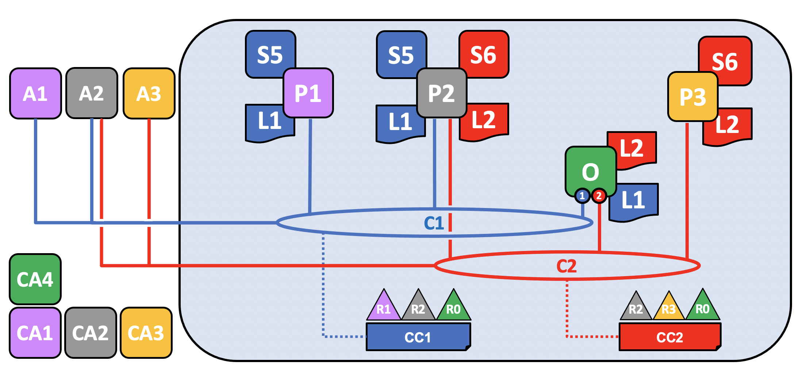
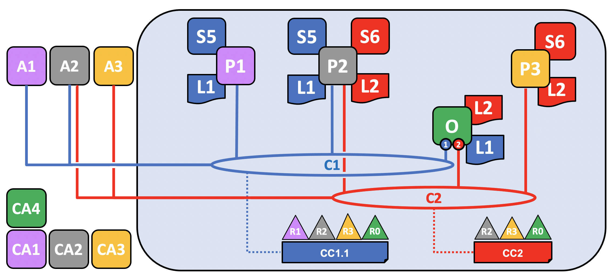

# 区块链网络

这个话题会在**概念层面上**描述 Hyperledger Fabric 是如何让组织间以区块链网络的形式进行合作的。如果你是一个架构师，管理员或者开发者，你可以通过这个话题来深入理解在 Hyperledger Fabric 区块链网络中的主要结构和处理组件。这个话题会使用一个可管理的工作的例子来介绍在一个区块链网络中的主要组件。

当阅读完这个话题并且理解策略的概念后，你会深刻地理解组织在建立一个部署的 Hyperledger Fabric 网络的管控策略时所需要做出的各项决策。你也能够理解组织是如何使用声明式策略来管理网络演变的，策略是 Hyperledger Fabric 的一个重要特点。简言之，你会理解 Hyperledger Fabric 的主要技术组件以及组织对于他们所要做的决策。

注意：这个话题中，我们将引用没有“系统通道”的网络架构，系统通道是由排序服务运行的通道，启动排序节点通过该通道来引导。有关系统通道的主题版本，请查看[区块链 网络](https://hyperledger-fabric.readthedocs.io/en/release-2.2/network/network.html)。

## 什么是区块链网络

区块链网络是一个为应用程序提供账本及智能合约（chaincode）服务的技术基础设施。首先，智能合约被用来生成交易，接下来这些交易会被分发给网络中的每个节点，这些交易会被记录在他们的账本副本上并且是不可篡改的。这个应用程序的用户可能是使用客户端应用的终端用户，或者是一个区块链网络的管理员。

在大多数的情况下，多个[组织](../glossary.html#organization) 会聚集到一起形成一个[通道]，在通道上，交易在链码上被调用。而他们的权限是由一套在通道最初配置的时候联盟成员都同意的[规则](../glossary.html#policy)来决定的。并且，配置的规则可以在通道中的组织同意的情况下随时地被改变。

**在本主题中，我们将同时提到“网络”和“通道”。在Hyperledger Fabric中，这些术语实际上是同义词，因为它们都是指在定义的结构中管理组织之间交互的组织、组件、策略和流程**

## 示例网络

在我们开始前，让我们来展示一下我们最终要做的东西吧！这是一个图表展示了我们示例网络的 **最终状态**。

不必担心这个看起来非常复杂！在我们学习这个话题的过程中，我们会一点一点地构建起这个网络，所以你能够了解组织 R1、R2 和 R0 是如何为网络提供基础设施并且从中获益。这个基础设施实现了区块链网络，并且它是由来自网络中的组织都同意的规则来管理的，比如谁可以添加新的组织。你会发现应用程序是如何消费账本以及区块链网络所提供的智能合约服务。

三个组织 R1、R2 和 R0，他们共同决定，从而建立一个网络。该网络有一个所有组织都同意的配置CC1，并且列出了组织的定义，以及定义每个组织将在通道上扮演的角色的策略。

在该通道上，R1和R2将节点P1和P2加入到通道C1，而R0拥有该通道的排序服务O。所有这些节点都将包含通道账本(L1)的副本，记录交易。注意，排序服务保存的分类帐副本不包含[状态数据库](../glossary.html#state-database)。R1和R2也将通过它们拥有的应用程序A1和A2与通道进行交互。这三个组织都有一个证书颁发机构，该机构为其组织的节点、管理员、组织定义和应用程序生成了必要的证书。

## 创建网络

创建网络或通道的第一步是同意并定义其配置:

通道配置CC1已由组织R1、R2和R0同意，并包含在称为“配置块”的块中，该块通常由`configtxgen`工具根据`configtx.yaml`文件创建。虽然一个组织可以单方面创建这个通道，然后邀请其他组织加入(我们将在[将组织添加到现有的通道中](#将组织添加到现有的通道中)中对此进行探讨)，但现在我们假设这些组织从一开始就希望在该通道上进行协作。

一旦配置块存在，通道就可以说是**逻辑上存在**，即使没有组件物理地连接到它。此配置块包含可以连接组件并在通道上交互的组织的记录，以及定义如何做出决策和达到特定结果的结构的**策略**。虽然节点和应用程序是网络中的关键角色，但它们在通道中的行为更多地取决于通道配置策略，而不是任何其他因素。有关策略以及如何在通道配置中定义策略的更多信息，请查看[策略](../policies/policies.html)。

这些组织的定义及其管理员的身份，必须由与每个组织相关联的证书颁发机构(CA)创建。在我们的示例中，组织R1、R2和R0分别拥有由CA1、CA2和CA0创建的证书和组织定义。有关如何创建CA的信息，请查看[CA规划](https://hyperledger-fabric-ca.readthedocs.io/en/latest/deployguide/ca-deploy-topology.html)。创建CA之后，请查看[向CA登记和注册身份](https://hyperledger-fabric-ca.readthedocs.io/en/latest/deployguide/use_CA.html)，了解如何定义组织并为管理员和节点创建身份。

有关使用`configtxgen`创建配置块的更多信息，请查看[用configtx.yaml生成通道配置](../create_channel/create_channel_config.html)。

### 证书颁发机构（Certificate Authorities，CA）

证书颁发机构在网络中扮演着关键角色，因为它们分发X.509证书，这些证书可用于标识属于某个组织的组件。由ca颁发的证书也可用于签署交易，以表明组织认可交易结果——这是交易结果在账本中被接受的先决条件。让我们更详细地研究一下CA的这两个方面。

首先，区块链网络的不同组件使用证书来相互识别自己来自特定组织。这就是为什么区块链网络通常有不止一个CA的原因——不同的组织通常使用不同的CA。我们将在通道中使用三个CAs;每个组织一个。事实上，CAs是如此重要，以至于Hyperledger Fabric为您提供了一个内置的CA(*称为Fabric-CA*)来帮助您开始，尽管在实践中，组织将选择使用自己的CA。

证书到成员组织的映射是通过称为[成员服务提供者(MSP)](../membership/membership.html)的结构实现，该结构通过创建与根CA证书绑定的MSP来定义组织，以识别由根CA创建的组件和身份。然后通道配置可以通过策略为组织分配某些权利和权限(这将赋予特定组织，例如R1，向通道添加新组织的权利)。我们没有在这些图表中显示MSPs，因为它们会使它们变得混乱，但是因为它们定义了组织，所以它们非常重要。

其次，稍后我们将看到由ca颁发的证书是如何成为[交易](../glossary.html#transaction)生成和验证过程的核心。具体来说，X.509证书用于客户端应用程序[交易提案](../glossary.html#proposal)和智能合约[交易响应](../glossary.html#response)对[交易](../glossary.html#transaction)进行数字签名。随后，拥有账本副本的网络节点在接受交易之前验证交易签名是有效的。

## 节点加入通道

节点是网络的基本元素，因为它们拥有账本和链码(包含智能合约)，而且是在通道上进行交易的组织连接到另一个通道(另一个是应用程序)的物理节点之一。节点可以属于组织认为合适的任意多个通道(取决于诸如节点pod的处理限制和特定国家存在的数据驻留规则等因素)。有关节点的更多信息，请查看[peer节点](../peers/peers.html)。

另一方面，排序服务从应用程序中收集经过背书的交易，并将它们排序到交易块中，这些交易块随后分发到通道中的每个peer节点。在每个提交节点上，记录交易，并适当更新账本的本地副本。排序服务对于特定通道是唯一的，服务于该通道的节点也称为“同意集”。即使一个节点(或一组节点)服务于多个通道，每个通道的排序服务也被认为是排序服务的一个不同实例。有关排序服务的更多信息，请查看[排序服务](../orderer/ordering_service.html)。

**有关如何创建peer节点和排序节点的信息，请查看[部署生产网络](../deployment_guide_overview.html).**

由于R1、R2和R0都列在通道配置中，因此允许它们将peer节点(R1和R2)或排序节点(R0)加入到通道中。

R1的节点P1和R2的节点P2，以及R0的排序服务O，通过[创建通道](../create_channel/create_channel_participation.html)教程中描述的过程加入通道。注意，虽然只有一个排序节点1加入到该通道，但在生产场景中，排序服务应至少包含三个节点。然而，就本主题而言，概念化排序服务与网络其他组件之间的交互比理解高可用性需求如何影响配置决策更为重要。属于每个组织的节点都有与该组织相关联的证书颁发机构为其创建的x.509证书。P1的证书由CA1创建，P2的证书由CA2创建，以此类推。

通道中的每个节点都存储通道L1的账本的副本，该副本将随着每个新块而更新(注意，排序服务仅包含账本的区块链部分，而不包含[状态数据库](./glossary.html#state-database))。因此，我们可以认为L1**在物理上托管***在P1上，但**在逻辑上托管**在通道C1上。最佳实践是R1和R2使它们的节点P1和P2成为[锚节点](./glossary.html#anchor-peer)，因为这将引导R1和R2之间的网络通信。

在将排序服务加入到通道之后，可以向通道配置提出更新并提交更新，但除此之外就没什么了。接下来，您必须在通道上安装、批准和提交链码。

## 安装、批准和提交链码

链码被安装到peer节点，然后被定义和提交到通道：

在Fabric中，定义节点组织如何与账本交互的业务逻辑(例如，更改资产所有权的交易)包含在智能合约中。包含智能合约的结构称为链码(chaincode)，安装在相关的peer节点上，由相关节点的组织批准，并在通道上提交。通过这种方式，您可以考虑将链码**物理托管**在peer节点上，但**逻辑托管**在通道上。在我们的示例中，链码S5安装在每个peer节点上，尽管组织不需要安装每个链码。请注意，排序服务没有安装链码，因为排序节点通常不会提出交易。安装、批准和提交链码的过程被称为链码的“生命周期”。有关更多信息，请查看[Fabric 链码生命周期](../chaincode_lifecycle.html)。

在链码定义中提供的最重要的信息是[背书策略](../glossary.html#endorsement-policy)。它描述了哪些组织必须在交易被其他组织接受到其账本副本之前对交易进行背书。根据用例，可以将背书策略设置为通道中成员的任何组合。如果没有配置背书策略，则继承通道配置中配置的缺省背书策略。

注意，虽然一些链码具有在通道上的成员之间创建[私有数据交易](../private_data_tutorial.html)的能力，但私有数据不在本主题的范围之内。

虽然现在在技术上可以使用peer CLI驱动交易，但最佳实践是创建一个应用程序，并使用它来调用链码上的交易。

## 在通道上使用应用程序

提交智能合约后，客户端应用程序可以通过Fabric Gateway服务(网关)调用链码上的事务。这就完成了我们在第一张图中展示的结构:

就像peer节点和排序节点一样，客户端应用程序具有将其与组织关联起来的身份。在我们的示例中，客户端应用程序A1与组织R1关联，并连接到C1。

从Fabric v2.4开始，客户端应用程序(使用Gateway SDK v1.x开发)与网关服务建立gRPC连接，网关服务随后代表应用程序处理交易提案和背书过程。交易提案作为链码的输入，链码使用它来生成交易响应。

我们可以看到，我们的节点组织R1和R2加入到通道。他们的应用程序可以通过智能合约S5访问账本L1，以生成交易，这些交易将由背书策略中指定的组织进行背书，并写入到账本中。

注意:Fabric v2.3 SDKs在客户端应用程序中嵌入了v2.4 Fabric Gateway服务的逻辑——详细信息请参阅[应用和节点v2.3](https://hyperledger-fabric.readthedocs.io/en/release-2.3/peers/peers.html#applications-and-peers)主题。

有关如何开发应用程序的更多信息，请查看[开发应用](../developapps/developing_applications.html)。

## 加入多个通道

既然我们已经展示了如何创建通道的过程，以及组织、节点、策略、链码和应用程序之间高级交互的性质，那么让我们通过向场景中添加一个新组织和一个新通道来扩展我们的视图。为了展示Fabric组件如何连接到多个通道，我们将R2及其节点P2加入新通道，而R1和P1将不加入。

### 创建新的通道配置

正如我们所看到的，创建通道的第一步是创建它的配置。这个通道不仅包括R2和R0，还包括一个新的组织R3，它已经由CA3为其创建了身份和证书。R1对这个通道没有权限，也不能将组件加入。事实上，它根本不知道自己的存在!

和前面一样，既然已经创建了通道配置CC2，那么可以说该通道在**逻辑上**是存在的，即使没有节点加入。

让我们加入一些节点和组织!

### 将组件加入到新通道

就像我们处理C1一样，让我们把节点加入到C2。因为我们已经展示了所有通道如何拥有账本，以及链码如何安装在对peer节点上并提交到通道(在本例中，链码称为S6)，我们现在将跳过这些步骤，以显示C2的最终状态。注意，这个通道有自己的账本L2，它与C1的账本完全分开。这是因为即使R2(及其节点P2)都连接到两个通道，但这两个通道是完全独立的管理域。

请注意，虽然C1和C2拥有相同的排序组织(R0)，但不同的排序节点为每个通道提供服务。这不是强制性配置，因为即使相同的排序节点连接到多个通道，每个通道也有一个单独的排序服务实例，并且在多个排序组织聚集在一起为排序服务提供节点的通道中更为常见。注意，只有加入到特定通道的排序节点才拥有该通道的账本。

虽然R2也有可能部署一个新的peer节点来连接到通道C2，但在本例中，它们选择将P2部署到C2。注意，P2在其文件系统上既有C1的账本(称为L1)，也有C2的账本(称为L2)。类似地，R2选择修改它的应用程序A2，以便能够与C2一起使用，而R3的应用程序A3正在与C2一起使用。

从逻辑上讲，这与C1的创建非常相似。两个peer节点组织与一个排序组织一起创建一个通道，并将组件和链码连接到该通道。

从R2的角度考虑这个配置，它加入到两个通道。从他们的角度来看，他们可能会认为C1和C2以及他们加入到两者的组件都是“网络”，尽管这两个通道彼此不同。从这个意义上说，一个“网络”也可以被看作是存在于一个特定组织的视角内的“我是其中一员的所有通道和我拥有的所有组件”。

现在我们已经展示了如何将组织及其组件加入到多个通道中，让我们讨论如何将组织及其组件添加到现有通道中。

## 将组织添加到现有的通道中

随着通道技术变得成熟，其配置自然也变得成熟，外部组织的变化必须反映到通道中。修改通道的一种更常见的方法是向其添加新的组织。虽然也可以添加更多的排序组织(它们可能贡献，也可能不贡献自己的节点)，但在本例中，我们将描述如何将组织R3添加到通道C1的配置CC1的过程。

**注意，权利和权限是在通道级别定义的。仅仅因为一个组织是一个通道的管理员，并不意味着它将是另一个通道的管理员。每个通道都是一个不同的管理区域，并且完全可以根据它所服务的用例进行定制

虽然对图的更新看起来只是一个简单的步骤，但是向通道添加一个新组织在高层次上是一个三步的过程:

1. 决定新组织的权限和角色。在将R3添加到C1之前，必须同意这些权利的全部范围，并且超出了本主题的范围，但包含在首先创建通道时必须回答的相同类型的问题。R3对C1有什么样的权限和权利?会是通道的管理员吗?它对任何通道资源的访问是否会受到限制(例如，R3可能只能写入C1，这意味着它可以提出更改，但不能签署它们)?R3将在其同行中安装哪些链码?

2. 更新通道，包括相关的链码，以反映这些决策。

3. 组织将其peer节点(以及潜在的排序节点)加入通道，并开始参与交易。

在本主题中，我们假设R3将以与R1和R2相同的权限和地位加入C1。同样，R3也将作为S5链码的背书者加入，这意味着R1或R2必须重新定义S5(具体来说，是链码定义的背书策略部分)并在通道上批准它。

更新通道配置将创建一个新的配置块CC1.1，它将作为通道配置，直到再次更新。注意，即使配置已经更改，通道仍然存在，P1和P2仍然连接到它。不需要重新向通道中添加组织或节点。

有关将组织添加到通道的过程的更多信息，请查看[将组织添加到通道](../channel_update_tutorial.html)。

有关策略(定义组织在通道上的角色)的更多信息，请查看[策略](../policies/policies.html)。

有关升级链码的更多信息，请查看[链码升级](../chaincode_lifecycle.html#upgrade-a-chaincode)。

### 将现有组件添加到新加入的通道

既然R3能够完全参与通道C1，它可以将其组件添加到通道中。与其一次只加入一个组件，不如让我们展示一下将peer节点、本地账本副本、智能合约和客户端应用程序是如何同时加入通道!

在这个例子中，R3将先前连接到C2的P3添加到C1。当它这样做时，P3拉出C1的账本L1。正如我们在上一节中提到的，R3已经被添加到C1中，具有与R1和R2相同的权限。同样，由于链码S5在通道上被重新定义并重新批准，包括R3, R3现在可以安装S5并开始交易。正如R2修改了其应用程序A2以便能够与通道C2一起使用一样，A3现在也能够调用C1上的交易。

## 网络概述

关于这个话题，我们已经讨论了很多。我们已经从两个组织在单个通道上进行交易处理的简单配置转变为多个组织在多个通道上进行交易处理，以及将组织加入到已经存在的通道的过程。

虽然这个主题代表了一个相对简单的案例，但在Fabric中可以实现复杂拓扑的无限组合，支持无限数量的操作目标，并且对网络的大小没有理论上的限制。仔细使用网络和通道策略可以很好地管理大型网络。

