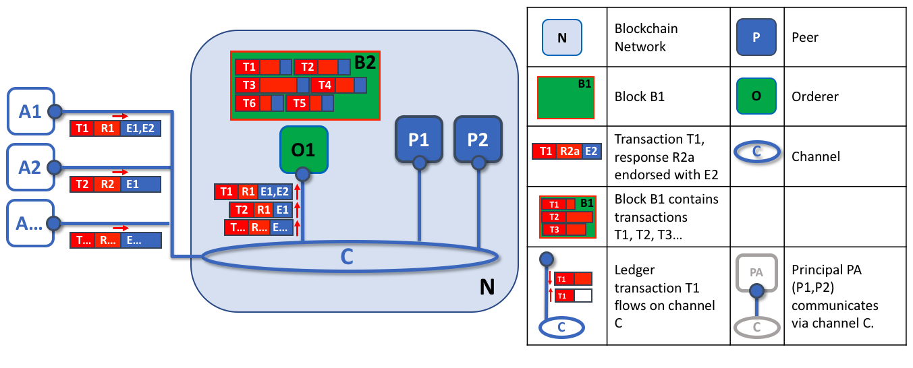

# 排序服务

**受众**：架构师、排序服务管理员、通道创建者

本主题将概念性的介绍排序的概念、排序节点是如何与 Peer 节点交互的、它们在交易流程中如何所发挥作用以及当前可用的排序服务的实现方式，尤其关注建议的 **Raft** 排序服务实现。

## 什么是排序？

许多分布式区块链，如以太坊（Ethereum）和比特币（Bitcoin），都是非许可的，这意味着任何节点都可以参与共识过程，在共识过程中，交易被排序并打包成区块。因此，这些系统依靠**概率**共识算法最终保证账本一致性高的概率，但仍容易受到不同的账本（有时也称为一个账本“分叉”），在网络中不同的参与者对于交易顺序有不同的观点。

Hyperledger Fabric 的工作方式不同。它有一种称为**排序节点**的节点使交易有序，并与其他排序节点一起形成一个**排序服务**。因为 Fabric 的设计依赖于**确定性**的共识算法，所以 Peer 节点所验证的区块都是最终的和正确的。账本不会像其他分布式的以及无需许可的区块链中那样产生分叉。

除了促进确定性之外，排序节点还将链码执行的背书（发生在节点）与排序分离，这在性能和可伸缩性方面给 Fabric 提供了优势，消除了由同一个节点执行和排序时可能出现的瓶颈。

## 排序节点和通道配置

除了**排序**角色之外，排序节点还维护着允许创建通道的组织列表。此组织列表称为“联盟”，列表本身保存在“排序节点系统通道”（也称为“排序系统通道”）的配置中。默认情况下，此列表及其所在的通道只能由排序节点管理员编辑。请注意，排序服务可以保存这些列表中的几个，这使得联盟成为 Fabric 多租户的载体。

排序节点还对通道执行基本访问控制，限制谁可以读写数据，以及谁可以配置数据。请记住，谁有权修改通道中的配置元素取决于相关管理员在创建联盟或通道时设置的策略。配置交易由排序节点处理，因为它需要知道当前的策略集合，并根据策略来执行其基本的访问控制。在这种情况下，排序节点处理配置更新，以确保请求者拥有正确的管理权限。如果有权限，排序节点将根据现有配置验证更新请求，生成一个新的配置交易，并将其打包到一个区块中，该区块将转发给通道上的所有节点。然后节点处理配置交易，以验证排序节点批准的修改确实满足通道中定义的策略。

## 排序节点和身份

与区块链网络交互的所有东西，包括节点、应用程序、管理员和排序节点，都从它们的数字证书和成员服务提供者（MSP）定义中获取它们的组织身份。

有关身份和 MSP 的更多信息，请查看我们关于[身份](../identity/identity.html)和[成员](../membership/membership.html)的文档。

与 Peer 节点一样，排序节点属于组织。也应该像 Peer 节点一样为每个组织使用单独的证书授权中心（CA）。这个 CA 是否将作为根 CA 发挥作用，或者您是否选择部署根 CA，然后部署与该根 CA 关联的中间 CA，这取决于您。

## 排序节点和交易流程

### 阶段一：提案

从我们对 [Peer 节点](../peers/peers.html)的讨论中，我们已经看到它们构成了区块链网络的基础，托管账本，应用程序可以通过智能合约查询和更新这些账本。

具体来说，更新账本的应用程序涉及到三个阶段，该过程确保区块链网络中的所有节点保持它们的账本彼此一致。

在第一阶段，客户端应用程序将交易提案发送给一组节点，这些节点将调用智能合约来生成一个账本更新提案，然后背书该结果。背书节点此时不将提案中的更新应用于其账本副本。相反，背书节点将向客户端应用程序返回一个提案响应。已背书的交易提案最终将在第二阶段经过排序生成区块，然后在第三阶段分发给所有节点进行最终验证和提交。

要深入了解第一个阶段，请参阅[Peer 节点](../peers/peers.html#phase-1-proposal)主题。

For an in-depth look at the first phase, refer back to the [Peers](../peers/peers.html#phase-1-proposal) topic.

### 阶段二：将交易排序并打包到区块中

在完成交易的第一阶段之后，客户端应用程序已经从一组节点接收到一个经过背书的交易提案响应。现在是交易的第二阶段。

在此阶段，应用程序客户端把包含已背书交易提案响应的交易提交到排序服务节点。排序服务创建交易区块，这些交易区块最终将分发给通道上的所有 Peer 节点，以便在第三阶段进行最终验证和提交。

排序服务节点同时接收来自许多不同应用程序客户端的交易。这些排序服务节点一起工作，共同组成排序服务。它的工作是将提交的交易按定义好的顺序安排成批次，并将它们打包成*区块*。这些区块将成为区块链的*区块*！

区块中的交易数量取决于区块的期望大小和最大间隔时间相关的通道配置参数（确切地说，是 `BatchSize` 和 `BatchTimeout` 参数）。然后将这些区块保存到排序节点的账本中，并分发给已经加入通道的所有节点。如果此时恰好有一个 Peer 节点关闭，或者稍后加入通道，它将在重新连接到排序服务节点或与另一个 Peer 节点通信之后接收到这些区块。我们将在第三阶段看到节点如何处理这个区块。

*排序节点的第一个角色是打包提案的账本更新。在本例中，应用程序 A1 向排序节点 O1 发送由 E1 和 E2 背书的交易 T1。同时，应用程序 A2 将 E1 背书的交易 T2 发送给排序节点 O1。O1 将来自应用程序 A1 的交易 T1 和来自应用程序 A2 的交易 T2 以及来自网络中其他应用程序的交易打包到区块 B2 中。我们可以看到，在 B2 中，交易顺序是 T1、T2、T3、T4、T6、T5，但这可能不是这些交易到达排序节点的顺序！（这个例子显示了一个非常简单的排序服务配置，只有一个排序节点。）*

值得注意的是，一个区块中交易的顺序不一定与排序服务接收的顺序相同，因为可能有多个排序服务节点几乎同时接收交易。重要的是，排序服务将交易放入严格的顺序中，并且 Peer 节点在验证和提交交易时将使用这个顺序。

区块内交易的严格排序使得 Hyperledger Fabric 与其他区块链稍有不同，在其他区块链中，相同的交易可以被打包成多个不同的区块，从而形成一个链。在 Hyperledger Fabric 中，由排序服务生成的区块是**最终的**。一旦一笔交易被写进一个区块，它在账本中的地位就得到了保证。正如我们前面所说，Hyperledger Fabric 的最终性意味着没有**账本分叉**，也就是说，经过验证的交易永远不会被重写或删除。

我们还可以看到，虽然节 Peer 点执行智能合约并处理交易，而排序节点不会这样做。到达排序节点的每个授权交易都被机械地打包在一个区块中，排序节点不判断交易的内容（前面提到的通道配置交易除外）。

在第二阶段的最后，我们看到排序节点负责一些简单但重要的过程，包括收集已提案的交易更新、排序并将它们打包成区块、准备分发。

### 阶段三：验证和提交

交易工作流的第三个阶段涉及到从排序节点到 Peer 节点的区块的分发和随后的验证，这些区块可能会被提交到账本中。

第三阶段排序节点将区块分发给连接到它的所有 Peer 节点开始。同样值得注意的是，并不是每个 Peer 节点都需要连接到一个排序节点，Peer 节点可以使用 [**gossip 协议**](../gossip.html)将区块关联到其他节点。

每个节点将独立地以确定的方式验证区块，以确保账本保持一致。具体来说，通道中每个节点都将验证区块中的每个交易，以确保得到了所需组织的节点背书，也就是节点的背书和背书策略相匹配，并且不会因最初认可该事务时可能正在运行的其他最近提交的事务而失效。无效的交易仍然保留在排序节点创建的区块中，但是节点将它们标记为无效，并且不更新账本的状态。

*排序节点的第二个角色是将区块分发给 Peer 节点。在本例中，排序节点 O1 将区块 B2 分配给节点 P1 和 P2。节点 P1 处理区块 B2，在 P1 上的账本 L1 中添加一个新区块。同时，节点 P2 处理区块 B2，从而将一个新区块添加到 P2 上的账本 L1中。一旦这个过程完成，节点 P1 和 P2 上的账本 L1 就会保持一致的更新，并且每个节点都可以通知与之连接的应用程序交易已经被处理。*

总之，第三阶段看到的是由排序服务生成的区块一致地应用于账本。将交易严格地按区块排序，允许每个节点验证交易更新是否在整个区块链网络上一致地应用。

要更深入地了解阶段三，请参阅[节点](../peers/peers.html#phase-3-validation-and-commit)主题。

## 排序服务实现

虽然当前可用的每个排序服务都以相同的方式处理交易和配置更新，但是仍然有几种不同的实现可以在排序服务节点之间就严格的交易排序达成共识。

有关如何建立排序节点（无论该节点将在什么实现中使用）的信息，请参阅[关于建立排序节点](../orderer_deploy.html)的文档。

* **Raft** (推荐)

  作为 v1.4.1 的新特性，Raft 是一种基于 [`etcd`](https://coreos.com/etcd/) 中 [Raft 协议](https://raft.github.io/raft.pdf)实现的崩溃容错（Crash Fault Tolerant，CFT）排序服务。Raft 遵循“领导者跟随者”模型，这个模型中，在每个通道上选举领导者节点，其决策被跟随者复制。Raft  排序服务会比基于 Kafka 的排序服务更容易设置和管理，它的设计允许不同的组织为分布式排序服务贡献节点。

* **Kafka** (在 v2.0 中被弃用)

  和基于 Raft 的排序类似，Apache Kafka 是一个 CFT 的实现，它使用“领导者和跟随者”节点配置。Kafka 利用一个 ZooKeeper 进行管理。基于 Kafka 的排序服务从 Fabric v1.0 开始就可以使用，但许多用户可能会发现管理 Kafka 集群的额外管理开销令人生畏或不受欢迎。

* **Solo** (在 v2.0 中被弃用)

  排序服务的 Solo 实现仅仅是为了测试，并且只包含了一个单一的排序节点。它已经被弃用了，可能会在将来的版本中被完全移除。既存的 Solo 用户应该迁移到一个单一节点的 Raft 网络获得同样的功能。

## Raft

有关如何配置 Raft 排序服务的信息，请参阅有关[配置 Raft 排序服务](../raft_configuration.html)的文档。

对于将用于生产网络的排序服务，Fabric 实现了使用“领导者跟随者”模型的 Raft 协议，领导者是在一个通道的排序节点中动态选择的（这个集合的节点称为“共识者集合（consenter set）”），领导者将信息复制到跟随者节点。Raft 被称为“崩溃容错”是因为系统可以承受节点的损失，包括领导者节点，前提是要剩余大量的排序节点（称为“法定人数（quorum）”）。换句话说，如果一个通道中有三个节点，它可以承受一个节点的丢失（剩下两个节点）。如果一个通道中有五个节点，则可以丢失两个节点（剩下三个节点）。

从它们提供给网络或通道的服务的角度来看，Raft 和现有的基于 Kafka 的排序服务（我们将在稍后讨论）是相似的。它们都是使用领导者跟随者模型设计的 CFT 排序服务。如果您是应用程序开发人员、智能合约开发人员或节点管理员，您不会注意到基于 Raft 和 Kafka 的排序服务之间的功能差异。然而，有几个主要的差异值得考虑，特别是如果你打算管理一个排序服务：

* Raft 更容易设置。虽然 Kafka 有很多崇拜者，但即使是那些崇拜者也（通常）会承认部署 Kafka 集群及其 ZooKeeper 集群会很棘手，需要在 Kafka 基础设施和设置方面拥有高水平的专业知识。此外，使用 Kafka 管理的组件比使用 Raft 管理的组件多，这意味着有更多的地方会出现问题。Kafka 有自己的版本，必须与排序节点协调。**使用 Raft，所有内容都会嵌入到您的排序节点中**。

* Kafka 和 Zookeeper 并不是为了在大型网络上运行。Kafka 是 CFT，它应该在一组紧密的主机中运行。这意味着实际上，您需要有一个组织运行 Kafka 集群。考虑到这一点，在使用 Kafka 时，让不同组织运行排序节点不会给您带来太多的分散性，因为这些节点都将进入同一个由单个组织控制的 Kafka 集群。使用 Raft，每个组织都可以有自己的排序节点参与排序服务，从而形成一个更加分散的系统。

* Raft 是原生支持的，这就意味着用户需要自己去获得所需的镜像并且学习应该如何使用 Kafka 和 Zookeeper。同样，对 Kafka 相关问题的支持是通过 [Apache](https://kafka.apache.org/) 来处理的，Apache 是 Kafka 的开源开发者，而不是 Hyperledge Fabric。另一方面，Fabric Raft 的实现已经开发出来了，并将在 Fabric 开发人员社区及其支持设备中得到支持。

* Kafka 使用一个服务器池（称为“Kafka 代理”），而且排序组织的管理员要指定在特定通道上使用多少个节点，但是 Raft 允许用户指定哪个排序节点要部署到哪个通道。通过这种方式，节点组织可以确保如果他们也拥有一个排序节点，那么这个节点将成为该通道的排序服务的一部分，而不是信任并依赖一个中心来管理 Kafka 节点。

* Raft 是向开发拜占庭容错（BFT）排序服务迈出的第一步。正如我们将看到的，Fabric 开发中的一些决策是由这个驱动的。如果你对 BFT 感兴趣，学习如何使用 Raft 应该可以慢慢过渡。

由于所有这些原因，在 Fabric v2.0 中，对于基于 Kafka 的排序服务正在被弃用。

注意：与 Solo 和 Kafka 类似，在向客户发送回执后 Raft 排序服务也可能会丢失交易。例如，如果领导者和跟随者提供回执时同时崩溃。因此，应用程序客户端应该监听节点上的交易提交事件，而不是检查交易的有效性。但是应该格外小心，要确保客户机也能优雅地容忍在配置的时间内没有交易提交超时。根据应用程序的不同，在这种超时情况下可能需要重新提交交易或收集一组新的背书。

### Raft 概念

虽然 Raft 提供了许多与 Kafka 相同的功能（尽管它是一个简单易用的软件包）但它与 Kafka 的功能却大不相同，它向 Fabric 引入了许多新的概念，或改变了现有的概念。

**日志条目（Log entry）**。 Raft 排序服务中的主要工作单元是一个“日志条目”，该项的完整序列称为“日志”。如果大多数成员（换句话说是一个法定人数）同意条目及其顺序，则我们认为条目是一致的，然后将日志复制到不同排序节点上。

**共识者集合（Consenter set）**。主动参与给定通道的共识机制并接收该通道的日志副本的排序节点。这可以是所有可用的节点（在单个集群中或在多个集群中为系统通道提供服务），也可以是这些节点的一个子集。

**有限状态机（Finite-State Machine，FSM）**。Raft 中的每个排序节点都有一个 FSM，它们共同用于确保各个排序节点中的日志序列是确定（以相同的顺序编写）。

**法定人数（Quorum）**。描述需要确认提案的最小同意人数。对于每个共识者集合，这是**大多数**节点。在具有五个节点的集群中，必须有三个节点可用，才能有一个法定人数。如果节点的法定人数因任何原因不可用，则排序服务集群对于通道上的读和写操作都不可用，并且不能提交任何新日志。

**领导者（Leader）**。这并不是一个新概念，正如我们所说，Kafka 也使用了领导者，但是在任何给定的时间，通道的共识者集合都选择一个节点作为领导者，这一点非常重要（我们稍后将在 Raft 中描述这是如何发生的）。领导者负责接收新的日志条目，将它们复制到跟随者的排序节点，并在认为提交了某个条目时进行管理。这不是一种特殊**类型**的排序节点。它只是排序节点在某些时候可能扮演的角色，而不是由客观环境决定的其他角色。

**跟随者（Follower）**。再次强调，这不是一个新概念，但是理解跟随者的关键是跟随者从领导者那里接收日志并复制它们，确保日志保持一致。我们将在关于领导者选举的部分中看到，跟随者也会收到来自领导者的“心跳”消息。如果领导者在一段可配置的时间内停止发送这些消息，跟随者将发起一次领导者选举，它们中的一个将当选为新的领导者。

### 交易流程中的 Raft

每个通道都在 Raft 协议的**单独**实例上运行，该协议允许每个实例选择不同的领导者。这种配置还允许在集群由不同组织控制的排序节点组成的用例中进一步分散服务。虽然所有 Raft 节点都必须是系统通道的一部分，但它们不一定必须是所有应用程序通道的一部分。通道创建者（和通道管理员）能够选择可用排序节点的子集，并根据需要添加或删除排序节点（只要一次只添加或删除一个节点）。

虽然这种配置以冗余心跳消息和线程的形式产生了更多的开销，但它为 BFT 奠定了必要的基础。

在 Raft 中，交易（以提案或配置更新的形式）由接收交易的排序节点自动路由到该通道的当前领导者。这意味着 Peer 节点和应用程序在任何特定时间都不需要知道谁是领导者节点。只有排序节点需要知道。

当排序节点检查完成后，将按照我们交易流程的第二阶段的描述，对交易进行排序、打包成区块、协商并分发。

### 架构说明

#### Raft 是如何选举领导者的

尽管选举领导者的过程发生在排序节点的内部过程中，但是值得注意一下这个过程是如何工作的。

节点总是处于以下三种状态之一：跟随者、候选人或领导者。所有节点最初都是作为**跟随者**开始的。在这种状态下，他们可以接受来自领导者的日志条目（如果其中一个已经当选），或者为领导者投票。如果在一段时间内没有接收到日志条目或心跳（例如，5秒），节点将自己提升到**候选**状态。在候选状态中，节点从其他节点请求选票。如果候选人获得法定人数的选票，那么他就被提升为领导者。领导者必须接受新的日志条目并将其复制到跟随者。

要了解领导者选举过程的可视化表示，请查看[数据的秘密生活](http://thesecretlivesofdata.com/raft/)。

#### 快照

如果一个排序节点宕机，它如何在重新启动时获得它丢失的日志？

虽然可以无限期地保留所有日志，但是为了节省磁盘空间，Raft 使用了一个称为“快照”的过程，在这个过程中，用户可以定义日志中要保留多少字节的数据。这个数据量将决定区块的数量（这取决于区块中的数据量。注意，快照中只存储完整的区块）。

例如，假设滞后副本 `R1` 刚刚重新连接到网络。它最新的区块是`100`。领导者 `L` 位于第 `196` 块，并被配置为快照20个区块。`R1` 因此将从 `L` 接收区块 `180`，然后为区块 `101` 到 `180` 区块 `分发` 请求。然后`180` 到 `196` 的区块将通过正常 Raft 协议复制到 `R1`。

### Kafka (在 v2.0中被弃用)

Fabric 支持的另一个容错崩溃排序服务是对 Kafka 分布式流平台的改写，将其用作排序节点集群。您可以在 [Apache Kafka 网站](https://kafka.apache.org/intro)上阅读更多关于 Kafka 的信息，但是在更高的层次上，Kafka 使用与 Raft 相同概念上的“领导者跟随者”配置，其中交易（Kafka 称之为“消息”）从领导者节点复制到跟随者节点。就像 Raft 一样，在领导者节点宕机的情况下，一个跟随者成为领导者，排序可以继续，以此来确保容错。

Kafka 集群的管理，包括任务协调、集群成员、访问控制和控制器选择等，由 ZooKeeper 集合及其相关 API 来处理。

Kafka 集群和 ZooKeeper 集合的设置是出了名的棘手，所以我们的文档假设您对 Kafka 和 ZooKeeper 有一定的了解。如果您决定在不具备此专业知识的情况下使用 Kafka，那么在试验基于 Kafka 的排序服务之前，至少应该完成 [Kafka 快速入门指南](https://kafka.apache.org/quickstart)的前六个步骤。您还可以参考 [这个示例配置文件](https://github.com/hyperledger/fabric/blob/release-1.1/bddtests/dc-orderer-kafka.yml) 来简要解释 Kafka 和 ZooKeeper 的合理默认值。

要了解如何启动基于 Kafka 的排序服务，请查看我们关于 [Kafka 的文档](../kafka.html)。

<!--- Licensed under Creative Commons Attribution 4.0 International License
https://creativecommons.org/licenses/by/4.0/) -->
