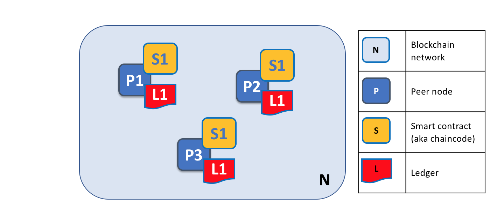
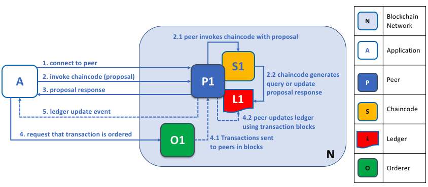
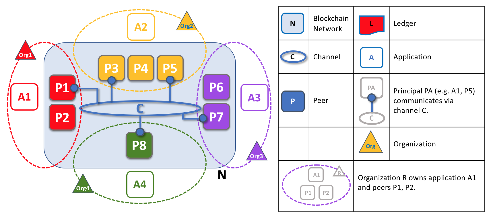

# Peer 节点

区块链网络主要由 *Peer 节点*（或者简单称之为 *Peer*）组成。Peer 是网络的基本元素，因为他们存储了账本和智能合约。之前我们说过账本不可篡改地保存着智能合约生成的所有交易（在 Hyperledger Fabric 中智能合约包含在*链码*中，稍后会详细介绍）。智能合约和账本将网络中共享的*流程*和*信息*对应地封装起来。Peer 节点的这些功能使它成为了理解 Fabric 网络很好的起点。

区块链网络中的其他部分当然也非常重要：账本和智能合约、排序节点、策略、通道、应用程序、组织、身份和成员关系等，你可以在其他的文档中了解更多。这个部分会集中在 Peer 节点上，以及他们和 Hyplerledger Fabric 网络中的其他要素的关系。

*区块链网络是由 Peer 节点组成的，每个节点都保存着账本和智能合约的副本。在这个例子中，网络 N 是由节点 P1、P2 和 P3 组成的，每个节点都维护这他们自己的分布式账本 L1。P1、P2 和 P3 使用相同的链码 S1 来访问他们的分布式账本的副本。*

Peer 节点可以被创建、启动、停止、重新配置甚至删除。他们暴露了一系列的 API，这就可以让管理者和应用程序同这些 API 提供的服务互动。我们会在这里学习更多关于这些服务的知识。

### 一个术语

Fabric 是使用一个被称为**链码**的技术概念来实现**智能合约** 的，就是使用已支持的编程语言编写的一段简单的代码来访问账本。在这个话题中，我们会经常使用名词**链码**，但是如果你更习惯于使用**智能合约**的话，你也可以将它读成**智能合约**。他们是相同的概念！如果你想了解更多关于链码和智能合约的话，查看我们的[智能合约和链码文档](../smartcontract/smartcontract.html)

## 账本和链码

让我们更详细地了解一下 Peer 节点。我们能够看到其实是 Peer 节点在维护账本和链码。确切地说，Peer 节点维护的是账本及链码的*实例*。请注意这其实是在 Fabric 网络中故意提供了冗余，因为这样可以避免单点失效。我们会在接下来的章节中了解更多有关区块链网络的分布式和去中心化的特点。

*Peer 节点维护着账本及链码的实例。在这个例子中，P1 维护着账本 L1 和链码 S1 的实例。也可以多个账本及链码维护在一个独立的 Peer 节点上。*

Peer 节点是账本及链码的*宿主*，应用程序及管理员如果想要访问这些资源，他们必须要和 Peer 节点进行交互。这就是为什么 Peer 节点被认为是 Hyperledger Fabric 网络最基本的组成模块。当 Peer 节点被第一次创建的时候，它并没有账本也没有链码。我们接下来会看到 Peer 节点的上账本是如何被创建的，以及链码是如何被安装的。

### 多账本

一个 Peer 节点可以维护多个账本，这是很有用的，因为它能够进行很灵活的系统设计。最简单的配置就是一个 Peer 节点管理一个账本，但是当需要的时候，一个 Peer 节点维护两个或者更多的账本也是非常适合的。

*一个 Peer 节点维护多个账本。Peer 节点维护着一个或者多个账本，并且每个账本具有零个或者多个链码使用账本。在这个例子中，我们能够看到 Peer 节点 P1 维护着账本 L1 和 L2。账本 L1 通过链码 S1 来访问。账本 2 通过链码 S1 和 S2 访问。*

尽管一个 Peer 节点只维护一个账本的实例而不运行任何访问账本的链码是完全可能的，但是很少有 Peer 节点会像这样来进行配置。大多数的 Peer 节点将会至少安装一个链码，用来查询或更新 Peer 节点的账本实例。有必要说明一下，无论用户是否安装了外部应用使用的链码，Peer 节点总是会有一个特殊的**系统链码**。这个不会在这个章节中进行讨论。

### 多链码

账本数量和访问账本的链码的数量之间没有固定的关系。一个 Peer 节点可能会有很多链码和账本。

*这是一个运行着多个链码的 Peer 节点。每个账本可以拥有多个访问它的链码。在这个例子中，我们能够看到 Peer 节点 P1 维护着账本 L1 和 L2，L1 可以通过链码S1 和 S2 来访问，账本 L2 可以由 S1 和 S3 来访问。我们能够看到链码 S1 既能访问 L1 也能访问 L2。*

稍后我们会看到在 Hyperledger Fabric 中，为什么当 Peer 节点维护多个账本或多个链码的时候，**通道**的概念就会很重要。

## 应用程序和 Peer 节点

现在我们要展示应用程序是如何通过跟 Peer 节点交互来访问账本的。查询账本的操作涉及到应用程序和 Peer 节点之间的一个简单的三步对话；更新账本的操作会涉及到更多的步骤，需要额外的两步。我们将简化这些步骤来帮助你了解 Hyperledger Fabric，不要担心，你需要理解的最重要的部分是应用程序和 Peer 节点之间进行查询账本和更新账本交易的不同。

当应用程序需要访问账本和链码的时候，他们总是需要连接到 Peer 节点。Hyperledger Fabric SDK 将这个操作变得非常简单，它的 API 使应用程序能够连接到 Peer 节点，调用链码生成交易，提交交易到网络，在网络中交易会被排序并且提交到分布式账本中，并且在这个流程结束的时候接收到事件。

通过连接 Peer 节点，应用程序能够执行链码来查询或者更新账本。对账本的查询结果马上会返回，但是对账本的更新会在应用程序、Peer 节点以及排序节点之间有更复杂的交互。让我们更详细地研究一下。

*Peer 节点和排序节点，确保了账本在每个 Peer 节点上都具有最新的账本。在这个例子中，应用程序 A 连接到了 P1 并且调用了链码 S1 来查询或者更新账本 L1。P1 调用了链码 S1 来生成提案响应，这个响应包含了查询结果或者账本更新的提案。应用程序 A 接收到了提案的响应，对于查询来说，流程到这里就结束了。对于更新来说，应用程序 A 会从所有的响应中创建一笔交易，它会把这笔交易发送给排序节点 O1 进行排序。O1 会搜集网络中的交易并打包到区块中，然后将这些区块分发到所有 Peer 节点上，包括 P1。P1 在把交易提交到账本 L1 之前对交易进行验证。当 L1 被更新之后，P1 会生成一个事件，该事件会被 A 接收到，来标识这个过程结束了。*

Peer 节点可以马上将查询的结果返回给应用程序，因为满足这个查询的所有信息都保存在 Peer 节点本地的账本副本中。Peer 节点从来不会为了应用程序的查询返回结果而去询问其他 Peer 节点的。但是应用程序还是能够连接到一个或者多个 Peer 节点来执行一个查询；比如，为了协调在多个 Peer 节点间的一个结果，或者当怀疑数据不是最新的时候，需要从不同的 Peer 节点获得更新的结果。在这个图标中，你能够看到账本查询是一个简单的三步流程。

更新交易和查询交易起点相同，但是有两个额外的步骤。尽管更新账本的应用程序也会连接到 Peer 节点来调用链码，但是不像查询账本的应用程序，一个独立的 Peer 节点目前是不能进行账本更新的，因为其他的 Peer 节点必须首先要同意这个变动（即达成**共识**）。因此，Peer 节点会返回给应用程序一个**被提案过的**更新，这个 Peer 节点会依据其他节点之前的协议来应用这个更新。第一个额外的步骤，也就是第四步，要求应用程序将响应的提案过的更新发送到网络中，网络中的 Peer 节点会将交易提交到它们相应的账本中。应用程序会收到**排序节点**打包了交易的区块，然后将他们分发到网络中所有的 Peer 节点，在区块被更新到每个 Peer 节点本地账本的副本中之前，这些区块都需要被验证。排序流程需要一定时间来完成 (数秒钟)，因此应用程序会被异步通知，像步骤五中展示的那样。

在这个部分的后边，你将会了解到更多关于排序流程的信息。如果你想更详细地了解一下这个流程，你可以阅读[Transaction Flow](../txflow.html)话题。

## Peer 节点和通道

尽管该部分更关注 Peer 节点而不是通道，但是花一些时间来理解 Peer 节点是如何通过应用程序，使用*通道*彼此进行交互还是值得的，这是区块链网络中组件能够进行交流和*私密*交易的机制。

这些组件通常是 Peer 节点、排序节点和应用程序，并且通过加入通道的方式，表明他们同意在那个通道中通过互相合作来共享以及管理完全一致的账本副本。概念上来说，你可以把通道想象为类似于一个由朋友组成的群组一样（尽管一个通道中的成员不需要是朋友！）。一个人可能会有很多个群组，在每个群组中他们会共同地进行一些活动。这些群组可能是完全独立的（一个工作伙伴的群组和一个兴趣爱好伙伴的群组），或者群组间可能会有交叉的部分。然而，每个群组都是它自己的实体，具备某种"规则"。

*通道允许区块链网络中特定的一些 Peer 节点以及应用程序来彼此交互。在这个例子中，应用程序 A 能够直接同 Peer 节点 P1 和 P2 使用通道 C 进行沟通。你可以把通道想象为在某些应用程序和 Peer 节点之间进行通信的小路。（排序节点没有显示在这个图中，但是在工作网络中它必须存在。）*

我们可以看到通道和 Peer 节点是以不同的方式存在的，将通道理解为由物理的 Peer 节点的组成的逻辑结构更合适一些。*理解这一点很重要，因为 Peer 节点提供了对通道访问和管理的控制*。

## Peer 节点和组织

现在你已经理解了 Peer 节点以及它们同账本、链码和通道间的关系，你将会看到多个组织是如何走到一起来构成一个区块链网络的。

区块链网络是由多个组织来管理的，而不是单个组织。对于如何构建这种类型的分布式网络，Peer 节点是核心，因为他们是由这些组织所有，也是这些组织同这个网络的连接点。

*区块链网络中的 Peer 节点和多个组织。区块链网络是由不同的组织所拥有并贡献的 Peer 节点构成的。在这个例子中，我们看到由四个组织贡献了八个 Peer 节点组成一个网络。在网络 N 中，通道 C 连接了这些 Peer 节点中的五个：P1、P3、P5、P7 和 P8。这些组织拥有的其他节点并没有加入该通道，但是通常会加入至少一个其他通道。某个组织开发的应用程序将会连接到他们自己组织的 Peer 节点，其他组织也一样。为了简化，排序节点没有在这个图中表示出来。*

真正重要的是，你能够看到在形成一个区块链网络的时候都发生了什么。*这个网络是由多个组织来组成并维护的，这些组织向这个网络贡献资源。*Peer 节点是我们在这个话题中正在讨论的资源，但是一个组织提供的资源不仅仅是 Peer 节点。这里有一个工作原则：如果组织不为这个网络贡献他们的资源，这个网络是不会存在的。更关键的是，这个网络会随着这些互相合作的组织提供的资源而增长或者萎缩。

在 [上边的例子](#Peer8) 中，你能够看到（除了排序服务），这里没有中心化的资源，如果这些组织不贡献他们的节点的话，网络 **N** 是不会存在的。这反映了一个事实，除非并且直到组织贡献了他们的资源才会形成这样一个网络，否则这个网络没有存在的意义。另外，这个网络不依赖于任何一个单独的组织，只要还存在一个组织，网络就会继续存在，不管其他的组织加入或者离开。这就是去中心化网络的核心。

就像[上边的例子](#Peer8)，在不同的组织中的应用程序可能相同也可能不同。这完全取决于组织想要他们的应用程序如何处理他们的 Peer 节点的账本副本。这意味着应用程序和展示逻辑可能在不同组织间有很大的不同，尽管他们的 Peer 节点维护着完全相同的账本数据。

应用程序会连接到他们组织的 Peer 节点或者其他组织的 Peer 节点，取决于账本交互的需求。对于查询账本的交互，应用程序通常会连接到他们自己组织的 Peer 节点。对于更新账本的交互，之后我们会看到为什么应用程序需要连接到多个 Peer 节点，这些节点是*每一个*要为账本更新进行背书的组织的代表。

## Peer 节点和身份

现在你已经看到了来自于不同组织的 Peer 节点是如何组合到一起形成区块链网络的，花费一些时间来理解 Peer 节点是如何被他们的管理者分配到相关的组织是非常值得的。

Peer 节点会有一个身份信息被分给他们，这是通过一个特定的证书认证机构颁发的数字证书来实现的。你可以在本指南的其他地方阅读更多的关于 X.509 数字证书是如何工作的，但是，现在，就把数字证书看成是能够为 Peer 节点提供可验证信息的身份证。*在网络中的每个 Peer 节点都会被所属组织的管理员分配一个数字证书*。

*当 Peer 节点连接到一个通道的时候，它的数字证书会通过通道 MSP 来识别它的所属组织。在这个例子中，P1 和 P2 具有由 CA1 颁发的身份信息。通道 C 通过在它的通道配置中的策略来决定来自 CA1 的身份信息应该使用 ORG1.MSP 被关联到 Org1。类似的，P3 和 P4 由 ORG2.MSP 识别为 Org2 的一部分。*

当 Peer 节点使用通道连接到一个区块链网络的时候，*在通道配置中的策略会使用 Peer 节点的身份信息来确定它的权利。*关于身份信息和组织的映射是由*成员服务提供者*（MSP）来提供的，它决定了一个 Peer 节点如何在指定的组织中分配到特定的角色以及得到访问区块链资源的相关权限。更多的是，一个 Peer 节点只能被一个组织所有，因此也就只能被关联到一个单独的 MSP。我们会在本部分的后边学习更过关于 Peer 节点的访问控制，并且在本指南中还有关于 MSP 和访问控制策略的部分。目前，可以把 MSP 看作在区块链网络中，为一个独立的身份信息和一个特定的组织角色之间提供了关联。

稍微讨论一个额外的话题，Peer 节点以及同一个区块链网络进行交互的每件事情都会从他们的数字证书和 MSP 来得到他们的组织的身份信息。Peer 节点、应用程序、终端用户、管理员以及排序节点如果想同一个区块链网络进行交互的话，必须要有一个身份信息和一个相关联的 MSP。我们使用身份信息来为每个跟区块链网络进行交互的实体提供一个名字——一个主角（principal）。 你可以在本指南中其他部分学习到更多的关于主角和组织的知识，但是现在你已经有足够的知识来继续你对 Peer 节点的理解了！

最后，请注意 Peer 节点物理上在哪真的不重要——它可以放在云中，或者是由一个组织所有的数据中心中，或者在一个本地机器中——是与它相关联的数字证书信息来识别出它是由哪个组织所有的。在我们上边的例子中，P3 可以运行在 Org1 的数据中心中，只要与它相关联的数字证书是由 CA2 颁发的，那么它就是 Org2 所拥有的。

## Peer 节点和排序节点

我们已经看到了 Peer 节点构成了一个基本的区块链网络，维护着账本和智能合约，连接到 Peer 节点的应用程序进行查询及更新。但是，应用程序和 Peer 节点彼此互相交互来确保每个 Peer 节点的账本永远保持一致是通过以*排序节点*作为中心媒介的一种特殊机制，我们现在会关注这些节点。

一个更新的交易和一个查询的交易区别很大，因为一个单独的 Peer 节点不能够由它自己来更新账本——更新需要网络中其他节点的同意。在一个账本的更新被应用到 Peer 节点的本地账本之前， Peer 节点会请求网络中的其他 Peer 节点来批准这次更新。这个过程被称为*共识*，这会比一个简单的查询花费更长的时间来完成。但是当所有被要求提供批准的节点都提供了批准，并且这笔交易被提交到账本的时候，Peer 节点会通知它连接的应用程序账本已经更新了。在这个章节中你将会看到 Peer 节点和排序节点是如何管理这个共识流程的详细内容。

特别的是，想要更新账本的应用程序会被引入到一个三阶段的流程，这确保了在一个区块链网络中所有的 Peer 节点都彼此保持着一致的账本。

* 在第一个阶段，应用程序会跟*背书节点*的子集一起工作，其中的每个节点都会向应用程序为提案的账本更新提供背书，但是不会将提案的更新应用到他们的账本副本上。
* 在第二个阶段，这些分散的背书会被搜集到一起当做交易被打包进区块中。
* 在最后一个阶段，这些区块会被分发回每个 Peer 节点，在这些 Peer 节点上每笔交易在被应用到 Peer 节点的账本副本之前会被验证。

就像你将会看到的，排序节点在这个流程中处于中心地位，所以让我们稍微详细一点地研究一下应用程序和 Peer 节点对于一个分布式的和重复的账本是如何使用排序节点来生成账本更新的。

### 第一阶段：提案

交易流程的第一阶段会引入在应用程序和一系列的 Peer 节点之间的交互——它并没有涉及到排序节点。第一阶段只在乎应用程序询问不同组织的背书节点同意链码调用的提案结果。

为了开始第一阶段，应用程序会生成一笔交易的提案，它会把这个提案发送给一系列的被要求的节点来获得背书。其中的每一个*背书节点*接下来都会独立地使用交易提案来执行链码，以此来生成这个交易提案的响应。这并没有将这次更新应用到账本上，只是简单地为它提供签名然后将它返回给应用程序。当应用程序接收到有效数量的被签过名的提案响应之后，交易流程中的第一个阶段就结束了。让我们对这个阶段做更详细地研究。

*交易提案会被 Peer 节点独立地执行，Peer 节点会返回经过背书的提案响应。在这个例子中，应用程序 A1 生成了交易 T1 和提案 P，应用程序会将交易及提案发送给通道 C 上的 Peer 节点 P1 和 Peer 节点 P2。P1 使用交易 T1 和 提案 P 来执行链码 S1，这会生成对交易 T1 的响应 R1，它会提供背书 E1。P2 使用交易 T1 提案 P 执行了链码 S1，这会生成对于交易 T1 的响应 R2，它会提供背书 E2。应用程序 A1 对于交易 T1 接收到了两个背书响应，称为 E1 和 E2。*

最初，应用程序会选择一些 Peer 节点来生成一套关于账本更新的提案。应用程序会选择哪些 Peer 节点呢？这取决于*背书策略*（这是为链码定义的），这个策略定义了在一个账本提案能够被网络所接受之前，都需要哪些 Peer 节点需要对这个账本变更提案进行背书。这很明显就是为了实现共识——每一个需要的组织必须对账本更新的提案在被各个 Peer 节点同意更新到他们的账本*之前*，对这个提案进行背书。

Peer 节点通过向提案的响应添加自己的数字签名的方式提供背书，并且使用它的私钥为整个的负载提供签名。然后这个背书会被用于证明这个组织的 Peer 节点生成了一个特殊的响应。在我们的例子中，如果 Peer 节点 P1 是属于组织 Org1 的话，背书 E1 就相当于一个数字证明——"在账本 L1 上的交易 T1 的响应 R1 已经被 Org1 的 Peer 节点 P1 同意了！"。

第一阶段在当应用程序从足够多的有效的 Peer 节点那里收到了签过名的提案响应的时候就结束了。我们注意到了不同的 Peer 节点能够返回不同的响应，因此*对于同一个交易提案*应用程序可能会接收到不同的交易响应。这可能简简单单地因为这个结果是在不同的时间，不同的 Peer 节点以及基于不同状态的账本所产生的，在这个情况下，一个应用程序可以请求一个更新的提案响应。不太可能但是却非常严重的是，结果的不同可能会是因为链码是*非确定性的*。非确定性是链码和账本的敌人，并且如果它真的发生了的话，这代表着这个提案的交易存在一个很严重的问题，因为非一致的结果很明显是不能够被应用到账本上的。一个单独的 Peer 节点是无法知道他们的交易结果是非确定性的——在非确定性问题被发现之前，交易的响应必须要被搜集到一起来进行比较。（严格地说，尽管这个还不够，但是我们会把这个话题放在交易的部分来讨论，在那里非确定性会被讨论。）

在第一阶段的最后，应用程序可以自由地放弃不一致的交易响应，如果他们想这么做的话，就可以在早期有效地终结这个交易流程。我们接下来会看到如果应用程序尝试使用不一致的交易响应来更新账本的时候，这会被拒绝。

### 阶段2：排序和将交易打包到区块

交易流程的第二个阶段是打包阶段。排序节点是这个过程的关键——它接收交易，这些交易中包含了来自很多个应用的已经背书过的交易提案，并且将交易排序并打包进区块。关于排序和打包阶段的更多详细信息，查看我们的[排序阶段的概念信息](../orderer/ordering_service.html#phase-two-ordering-and-packaging-transactions-into-blocks).

### 阶段3：验证和提交

在第二阶段末尾，我们看到了排序节点需要负责这个简单但是重要的搜集提案的交易变更，将他们排序，并且打包到区块中，让他们准备好分发给 Peer 节点的整个流程。

这个交易流程的最后一个阶段是分发以及接下来的对于从排序节点发送给 Peer 节点的区块的验证工作，这些区块最终会提交到账本中。具体来说，在每个 Peer 节点上，区块中的每笔交易都会被验证，以确保它在被提交到账本之前，已经被所有相关的组织一致地背书过了。失败的交易会被留下来方便审计，但是不会被提交到账本中。

*排序节点的第二个角色是将区块分发给 Peer 节点。在这个例子中，排序节点 O1 将区块 B2 分发给了 Peer 节点 P1 和 Peer 节点 P2。Peer P1 处理了区块 B2，产生了一个会被添加到 P1 的账本 L1 中的新区块。同时，peer P2 处理了区块 B2，产生了一个会被添加到 P2 的账本 L1 中的新区块。当这个过程结束之后，账本 L1 就会被一致地更新到了 Peer 节点 P1 和 P2 上，他们也可能会通知所连接的应用程序关于这笔交易已经被处理过的消息。*

阶段三是从排序节点将区块分发到所有与它连接的 Peer 节点开始的。Peer 节点会和通道中的排序节点相连，所有跟这个排序节点相连的 Peer 节点将会收到一个新的区块的副本。每个 Peer 节点会独立处理这个区块，但是会跟这个通道上的每一个其他 Peer 节点使用完全一致的方式处理。通过这种方式，我们会看到账本是会始终保持一致的。不是每个 Peer 节点都需要连接到排序节点——Peer 节点可以使用 **gossip** 协议将区块的信息发送给其他 Peer 节点，其他 Peer 节点也可以独立地处理这些区块。但是让我们把这个话题放在其他的时间来讨论吧！

当接到区块的时候，Peer 节点会按照区块中的顺序处理每笔交易。对于每一笔交易，每个 Peer 节点都会确认这笔交易已经根据产生这笔交易的链码中定义的*背书策略*由要求的组织进行过背书了。比如，在一些交易被认为是有效之前，这些交易可能仅仅需要一个组织的背书，但是其他的交易可能会需要多个背书。这个验证的流程确认了所有相关的组织已经生成了相同的产出或者结果。也需要注意到的是，这次的验证跟在阶段 1 中进行的背书检查是不同的，应用程序从背书节点那里接收到了交易的响应，然后做了决定来发送交易提案。如果应用程序违反了背书策略发送了错误的交易，那么 Peer 节点还是能够在阶段 3 中的验证流程里拒绝这笔交易。

如果一笔交易被正确的背书，Peer 节点会尝试将它应用到账本中。为了做这个，Peer 节点必须要进行账本一致性检查来验证当前账本中的状态同应用了更新提案后的账本是能够兼容的。这可能不是每次都是有可行的，即使交易已经被完整地背书过了。比如，另外一笔交易可能会更新账本中的同一个资产，这样的话交易的更新就不会是有效的了，因此也就不会被应用。通过这种方式，账本在通道中的每个 Peer 节点都是保持一致的，因为他们中每个都在遵守相同的验证规则。

当 Peer 节点成功地验证每笔单独的交易之后，它就会更新账本了。失败的交易是不会应用到账本中的，但是他们会被保留为之后的审计使用，就像成功的交易那样。这意味着 Peer 节点中的区块几乎会跟从排序节点收到的区块是一样的，除了在区块中每笔交易中会带有有效或者无效的指示符。

我们也注意到了第三阶段并没有要求执行链码——那只会在第一阶段执行，这是很重要的。这意味着链码仅仅需要在背书节点中有效，而不需要在区块链网络的所有部分都要有。这个通常是很有帮助的，因为这保持了链码逻辑的机密性只有背书组织了解。这个同链码的输出（交易提案的响应）恰恰相反，这个输出会被分享给通道中的所有 Peer 节点，不管这些 Peer 节点是否为这交易提供背书。这个关于背书节点的特殊性是被设计用来帮助扩展性和保密性的。

最终，每次当区块被提交到 Peer 节点的账本的时候，那个 Peer 节点会生成一个合适的*事件*。*区块事件*包括了整个区块的内容，然而*区块交易事件*仅仅包含了概要信息，比如是否在区块中的每笔交易是有效的还是无效的。链码已经被执行的*链码*事件也可以在这个时候公布出去。应用程序可以对这些事件类型进行注册，所以在这些事件发生的时候他们能够被通知到。这些通知结束了交易流程的第三以及最后的阶段。

总结来说，在第三阶段中看到了由排序节点生成的区块被一致地应用到了账本中。将交易严格地排序到区块中让每个 Peer 节点都来验证交易更新，并一致地应用到区块链网络中。

### 排序节点和共识

整个交易处理流程被称为*共识*，因为所有 Peer 节点在由排序节点提供的流程中对交易的排序及内容都达成了一致。共识是一个多步骤的流程，并且应用程序只会在这个流程结束的时候通知账本更新——这个在不同的 Peer 节点上可能在不同的时间会发生。

我们会在之后的排序节点话题中更详细地讨论排序节点，但是到目前为止，可以把排序节点理解为这样一些节点，它们从应用程序收集和分发账本更新提案以供 Peer 节点验证并写入账本中。

这就是所有内容了！我们完成了 Peer 节点以及在 Hyperledger Fabric 中他们相关联的其他组件的学习。我们看到了 Peer 节点在很多方面都是最基础的元素——他们构成了网络，维护链码和账本，处理交易提案和响应，并且通过一致地将交易更新到账本上来保持一个始终包含最新内容的账本。

<!--- Licensed under Creative Commons Attribution 4.0 International License
https://creativecommons.org/licenses/by/4.0/) -->
