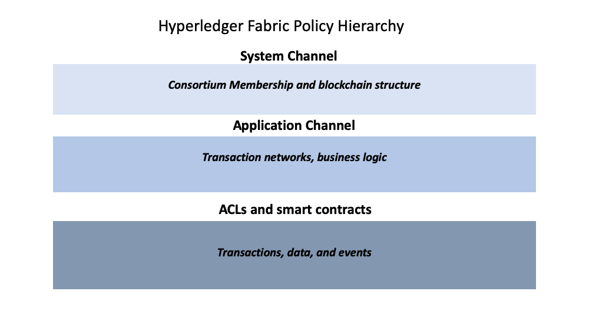
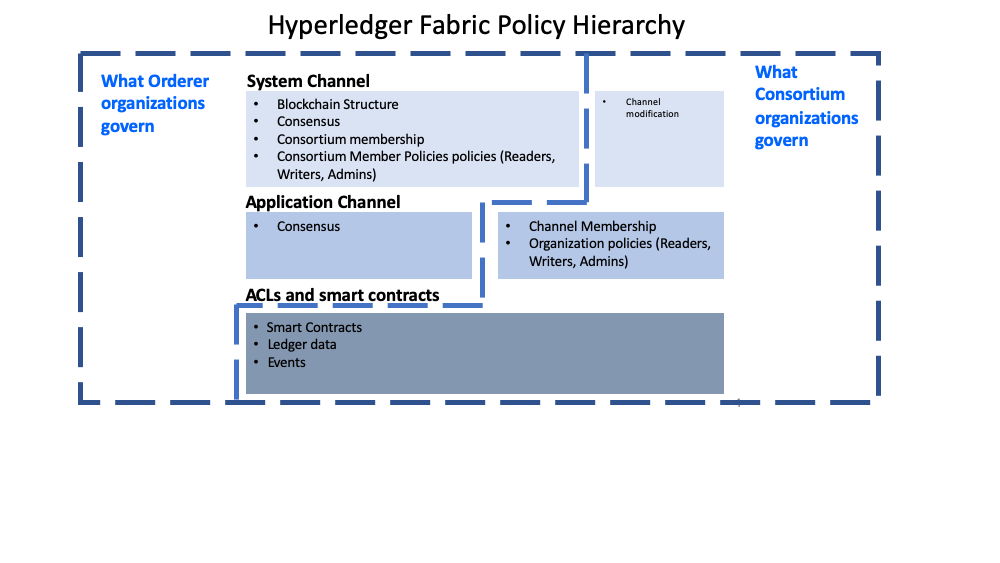

# 策略
# Policies

**受众**： 架构师，应用和智能合约开发者，管理员

**Audience**: Architects, application and smart contract developers,
administrators

本主题将包含：

In this topic, we'll cover:

- [策略](#策略)
  - [策略是什么](#策略是什么)
  - [为什么需要策略](#为什么需要策略)
  - [Fabric是如何实现策略的](#fabric是如何实现策略的)
    - [系统通道配置](#系统通道配置)
    - [应用通道配置](#应用通道配置)
    - [权限控制列表（ACL）](#权限控制列表acl)
    - [智能合约背书策略](#智能合约背书策略)
    - [修改策略](#修改策略)
  - [策略作用域](#策略作用域)
  - [如何将策略写入Fabric](#如何将策略写入fabric)
    - [签名策略](#签名策略)
    - [隐元（ImplicitMeta）策略](#隐元implicitmeta策略)
  - [示例：通道配置策略](#示例通道配置策略)
  - [Fabric链码生命周期](#fabric链码生命周期)
  - [链码背书策略](#链码背书策略)
  - [覆盖策略定义](#覆盖策略定义)

* [What is a policy](#what-is-a-policy)
* [Why are policies needed](#why-are-policies-needed)
* [How are policies implemented throughout Fabric](#how-are-policies-implemented-throughout-fabric)
* [Fabric policy domains](#the-fabric-policy-domains)
* [How do you write a policy in Fabric](#how-do-you-write-a-policy-in-fabric)
* [Fabric chaincode lifecycle](#fabric-chaincode-lifecycle)
* [Overriding policy definitions](#overriding-policy-definitions)

## 策略是什么

## What is a policy

从根本上来说，策略是一组规则，用来定义如何做出决策和实现特定结果。为此，策略一般描述了**谁**和**什么**，比如一个人对**资产**访问或者权限。我们可以看到，在我们的日常生活中策略也在保护我们的资产数据，比如汽车租金、健康、我们的房子等。

At its most basic level, a policy is a set of rules that define the structure
for how decisions are made and specific outcomes are reached. To that end,
policies typically describe a **who** and a **what**, such as the access or
rights that an individual has over an **asset**. We can see that policies are
used throughout our daily lives to protect assets of value to us, from car
rentals, health, our homes, and many more.

例如，购买保险时，保险策略定义了条件、项目、限制和期限。该策略经过了策略持有者和保险公司的一致同意，定义了各方的权利和责任。

For example, an insurance policy defines the conditions, terms, limits, and
expiration under which an insurance payout will be made. The policy is
agreed to by the policy holder and the insurance company, and defines the rights
and responsibilities of each party.

保险策略用于风险管理，在 Hyperledger Fabric 中，策略是基础设施的管理机制。Fabric 策略表示成员如何同意或者拒绝网络、通道或者智能合约的变更。策略在网络最初配置的时候由联盟成员一致同意，但是在网络演化的过程中可以进行修改。例如，他们定义了从通道中添加或者删除成员的标准，改变区块格式或者指定需要给智能合约背书的组织数量。所有这些定义谁可以干什么的行为都在策略中描述。简单来说，你在 Fabric 网络中的所有想做的事情，都要受到策略的控制。

Whereas an insurance policy is put in place for risk management, in Hyperledger
Fabric, policies are the mechanism for infrastructure management. Fabric policies
represent how members come to agreement on accepting or rejecting changes to the
network, a channel, or a smart contract. Policies are agreed to by the consortium
members when a network is originally configured, but they can also be modified
as the network evolves. For example, they describe the criteria for adding or
removing members from a channel, change how blocks are formed, or specify the
number of organizations required to endorse a smart contract. All of these
actions are described by a policy which defines who can perform the action.
Simply put, everything you want to do on a Fabric network is controlled by a
policy.

## 为什么需要策略

## Why are policies needed

策略是使 Hyperledger Fabric 不同于其他区块链系统（比如 Ethereum 或者 Bitcoin）的内容之一。这其他系统中，交易可以在网络中的任意节点生成和验证。治理网络的策略可以在任何时间及时修复，并且只可以使用和治理代码相同的方式进行变更。因为 Fabric 是授权区块链，用户由底层基础设施识别，所以用户可以在启动前决定网络的治理方式，以及改变正在运行的网络的治理方式。

Policies are one of the things that make Hyperledger Fabric different from other
blockchains like Ethereum or Bitcoin. In those systems, transactions can be
generated and validated by any node in the network. The policies that govern the
network are fixed at any point in time and can only be changed using the same
process that governs the code. Because Fabric is a permissioned blockchain whose
users are recognized by the underlying infrastructure, those users have the
ability to decide on the governance of the network before it is launched, and
change the governance of a running network.

策略决定了那些组织可以访问或者更新 Fabric 网络，并且提供了强制执行这些决策的机制。策略包含了有权访问给定资源的组织列表，比如一个用户或者系统链码。他们同样指定了需要多少组织同意更新资源的提案，比如通道或者智能合约。一旦策略被写入，他们就会评估交易和提案中的签名，并验证签名是否满足网络治理规则。

Policies allow members to decide which organizations can access or update a Fabric
network, and provide the mechanism to enforce those decisions. Policies contain
the lists of organizations that have access to a given resource, such as a
user or system chaincode. They also specify how many organizations need to agree
on a proposal to update a resource, such as a channel or smart contracts. Once
they are written, policies evaluate the collection of signatures attached to
transactions and proposals and validate if the signatures fulfill the governance
agreed to by the network.

## Fabric是如何实现策略的

## How are policies implemented throughout Fabric

策略实现在 Fabric 网络的不同层次。每个策略域都管理着网络操作的不同方面。

Policies are implemented at different levels of a Fabric network. Each policy
domain governs different aspects of how a network operates.

 *Fabric 策略层级图。*

 *A visual representation
of the Fabric policy hierarchy.*

### 系统通道配置

### System channel configuration

每个网络都从排序服务**系统通道**开始。网络中必须有至少一个排序服务的排序系统通道，它是第一个被创建的通道。该通道也包含着谁是排序服务（排序服务组织）以及在网络中交易（联盟组织）的成员。

Every network begins with an ordering **system channel**. There must be exactly
one ordering system channel for an ordering service, and it is the first channel
to be created. The system channel also contains the organizations who are the
members of the ordering service (ordering organizations) and those that are
on the networks to transact (consortium organizations).

排序系统通道配置区块中的策略治理着排序服务使用的共识，并定义了新区块如何被创建。系统通道也治理着联盟中的哪些成员可以创建新通道。

The policies in the ordering system channel configuration blocks govern the
consensus used by the ordering service and define how new blocks are created.
The system channel also governs which members of the consortium are allowed to
create new channels.

### 应用通道配置

### Application channel configuration

应用 _通道_ 用于向联盟中的组织间提供私有通信机制。

Application _channels_ are used to provide a private communication mechanism
between organizations in the consortium.

应用通道中的策略治理着从通道中添加和删除成员的能力。应用通道也治理着使用 Fabric 链码生命周期在链码定义和提交到通道前需要哪些组织同意。当系统通道初始创建时，它默认继承了排序系统通道的所有排序服务参数。同时，这些参数（包括治理它们的策略）可以被每个通道自定义。

The policies in an application channel govern the ability to add or remove
members from the channel. Application channels also govern which organizations
are required to approve a chaincode before the chaincode is defined and
committed to a channel using the Fabric chaincode lifecycle. When an application
channel is initially created, it inherits all the ordering service parameters
from the orderer system channel by default. However, those parameters (and the
policies governing them) can be customized in each channel.

### 权限控制列表（ACL）

### Access control lists (ACLs)

网络管理员可能对 Fabric 中 ACL 的使用更感兴趣，ACL 通过将资源和已有策略相关联的方式提供了资源访问配置的能力。“资源”可以是系统链码中的方法（例如，“qscc”中的“GetBlockByNumber”）或者其他资源（例如，谁可以获取区块事件）。ACL 参考应用通道配置中定义的策略并将它们扩展到了其他资源的控制。Fabric ACL 的默认集合在 `configtx.yaml` 文件的 `Application: &ApplicationDefaults` 部分，但是它们可以也应该在生产环境中被重写。`configtx.yaml` 中定义的资源列表是 Fabric 当前定义的所有内部资源的完整集合。

Network administrators will be especially interested in the Fabric use of ACLs,
which provide the ability to configure access to resources by associating those
resources with existing policies. These "resources" could be functions on system
chaincode (e.g., "GetBlockByNumber" on the "qscc" system chaincode) or other
resources (e.g.,who can receive Block events). ACLs refer to policies
defined in an application channel configuration and extends them to control
additional resources. The default set of Fabric ACLs is visible in the
`configtx.yaml` file under the `Application: &ApplicationDefaults` section but
they can and should be overridden in a production environment. The list of
resources named in `configtx.yaml` is the complete set of all internal resources
currently defined by Fabric.

该文件中，ACL 以如下格式表示：

In that file, ACLs are expressed using the following format:

```
# ACL policy for chaincode to chaincode invocation
peer/ChaincodeToChaincode: /Channel/Application/Readers
```

`peer/ChaincodeToChaincode` 表示该资源是被保护的，相关的交易必须符合 `/Channel/Application/Readers` 引用侧策略才能被认为是有效的。

Where `peer/ChaincodeToChaincode` represents the resource being secured and
`/Channel/Application/Readers` refers to the policy which must be satisfied for
the associated transaction to be considered valid.

关于 ACL 更深入的信息，请参考操作指南中的 [ACL](../access_control.html) 主题。

For a deeper dive into ACLS, refer to the topic in the Operations Guide on [ACLs](../access_control.html).

### 智能合约背书策略

### Smart contract endorsement policies

链码包中的每一个智能合约都有一个背书策略，该策略指明了需要通道中多少不同组织的成员根据指定智能合约执行和验证交易才能使一笔交易有效。因此，背书策略定义了必须“背书”（批准）提案执行的组织（的 Peer 节点）。

Every smart contract inside a chaincode package has an endorsement policy that
specifies how many peers belonging to different channel members need to execute
and validate a transaction against a given smart contract in order for the
transaction to be considered valid. Hence, the endorsement policies define the
organizations (through their peers) who must “endorse” (i.e., approve of) the
execution of a proposal.

### 修改策略

### Modification policies

还有一个对 Fabric 的策略工作有重要作用的策略类型—— `修改（Modification）策略`。修改策略指明了需要签名所有配置 _更新_ 的一组身份。它是定义如何更新策略的策略。因此，每个通道配置元素都包含这一个治理它的变更的策略的引用。

There is one last type of policy that is crucial to how policies work in Fabric,
the `Modification policy`. Modification policies specify the group of identities
required to sign (approve) any configuration _update_. It is the policy that
defines how the policy is updated. Thus, each channel configuration element
includes a reference to a policy which governs its modification.

## 策略作用域

## The Fabric policy domains

虽然 Fabric 的策略很灵活地配置以适应网络需要，但是策略的结构天然地隔离了由不同排序服务组织或者不同联盟成员治理的域。下边的图中，你可以看到默认策略是如何实现对 Fabric 策略域的控制的。

While Fabric policies are flexible and can be configured to meet the needs of a
network, the policy structure naturally leads to a division between the domains
governed by either the Ordering Service organizations or the members of the
consortium. In the following diagram you can see how the default policies
implement control over the Fabric policy domains below.

 *排序组织和联名组织治理的策略域的详细视图。*

 *A more detailed look at the
policy domains governed by the Orderer organizations and consortium organizations.*

一个完整的 Fabric 网络可以由许多不同职能的组织组成。通过支持排序服务创建者建立初始规则和联盟成员的方式，域提供了向不同组织扩展不同的优先级和角色的能力。还支持联盟中的组织创建私有应用通道、治理他们自己的商业逻辑以及限制网络中数据的访问权限。

A fully functional Fabric network can feature many organizations with different
responsibilities. The domains provide the ability to extend different privileges
and roles to different organizations by allowing the founders of the ordering
service the ability to establish the initial rules and membership of the
consortium. They also allow the organizations that join the consortium to create
private application channels, govern their own business logic, and restrict
access to the data that is put on the network.

系统通道配置和每个应用通道配置部分提供了排序组织对哪些组织是联盟成员、区块如何分发到通道以及排序服务节点使用的共识机制的控制。

The system channel configuration and a portion of each application channel
configuration provides the ordering organizations control over which organizations
are members of the consortium, how blocks are delivered to channels, and the
consensus mechanism used by the nodes of the ordering service.

系统通道配置为联盟成员提供了创建通道的能力。应用通道和 ACL 是联盟组织用来从通道中添加或删除成员以及限制通道中智能合约和数据访问的机制。

The system channel configuration provides members of the consortium the ability
to create channels. Application channels and ACLs are the mechanism that
consortium organizations use to add or remove members from a channel and restrict
access to data and smart contracts on a channel.

## 如何将策略写入Fabric

## How do you write a policy in Fabric

如果你想修改 Fabric 的任何东西，和资源相关的策略都描述了**谁**需要批准它，无论是明确使用某个还是一组身份的离线签名还是一组。在保险领域，一个明确的签名可以是业主保险代理集团中的一员。而一个隐含的签名类似于需要业主保险代理集团中的大多数管理成员批准。这很重要，因为集团中的成员可以在不更新策略的情况下变动。在 Hyperledger Fabric 中，策略中明确的签名使用 `Signature` 语法，隐含的签名使用 `ImplicitMeta` 语法。

If you want to change anything in Fabric, the policy associated with the resource
describes **who** needs to approve it, either with an explicit sign off from
individuals, or an implicit sign off by a group. In the insurance domain, an
explicit sign off could be a single member of the homeowners insurance agents
group. And an implicit sign off would be analogous to requiring approval from a
majority of the managerial members of the homeowners insurance group. This is
particularly useful because the members of that group can change over time
without requiring that the policy be updated. In Hyperledger Fabric, explicit
sign offs in policies are expressed using the `Signature` syntax and implicit
sign offs use the `ImplicitMeta` syntax.

### 签名策略

### Signature policies

`Signature` 策略定义了要满足策略就必须签名的特定用户类型，比如 `Org1.Peer OR Org2.Peer`。策略是很强大的，应为它可以构造复杂的规则，比如“组织 A 和 2 个其他管理员，或者 6 个组织的管理员中的 5 个”。语法支持 `AND`、 `OR` 和 `NOutOf` 的任意组合。例如，一个策略可以简单表达为使用 `AND (Org1, Org2)` ，表示满足该策略就同时需要 Org1 中的一个成员和 Org2 中的一个成员的签名。

`Signature` policies define specific types of users who must sign in order for a
policy to be satisfied such as `OR('Org1.peer', 'Org2.peer')`. These policies are
considered the most versatile because they allow for the construction of
extremely specific rules like: “An admin of org A and 2 other admins, or 5 of 6
organization admins”. The syntax supports arbitrary combinations of `AND`, `OR`
and `NOutOf`. For example, a policy can be easily expressed by using
`AND('Org1.member', 'Org2.member')` which means that a signature from at least
one member in Org1 AND one member in Org2 is required for the policy to be satisfied.

### 隐元（ImplicitMeta）策略

### ImplicitMeta policies

`隐元`策略只在通道配置上下文中有效，通道配置在配置树策略中是基于分层的层次结构。隐元策略聚合了由签名策略最终定义的配置树深层的结果。它们是`隐藏的`，因为它们基于通道配置中的当前组织隐式构建，它们是`元信息`，因为它们的评测不依赖于特定 MSP 规范，而是依赖于配置树中它们的其他子策略。

`ImplicitMeta` policies are only valid in the context of channel configuration
which is based on a tiered hierarchy of policies in a configuration tree. ImplicitMeta
policies aggregate the result of policies deeper in the configuration tree that
are ultimately defined by Signature policies. They are `Implicit` because they
are constructed implicitly based on the current organizations in the
channel configuration, and they are `Meta` because their evaluation is not
against specific MSP principals, but rather against other sub-policies below
them in the configuration tree.

下边的图例说明了应用通道分层的策略结构，并演示了`隐元`通道配置管理策略（称为 `/Channel/Admins`）是如何处理的，也就是说，当满足配置层级中它的 `Admins` 子策略时，就代表也满足了其子策略的子策略条件。

The following diagram illustrates the tiered policy structure for an application
channel and shows how the `ImplicitMeta` channel configuration admins policy,
named `/Channel/Admins`, is resolved when the sub-policies named `Admins` below it
in the configuration hierarchy are satisfied where each check mark represents that
the conditions of the sub-policy were satisfied.


正如你在上图看到的，`隐元`策略，Type = 3，使用了一种不同的语法 `"<ANY|ALL|MAJORITY> <SubPolicyName>"`，例如：

As you can see in the diagram above, `ImplicitMeta` policies, Type = 3, use a
different syntax, `"<ANY|ALL|MAJORITY> <SubPolicyName>"`, for example:
```
`MAJORITY sub policy: Admins`
```
The diagram shows a sub-policy `Admins`, which refers to all the `Admins` policy
below it in the configuration tree. You can create your own sub-policies
and name them whatever you want and then define them in each of your
organizations.

```
`MAJORITY sub policy: Admins`
```

As mentioned above, a key benefit of an `ImplicitMeta` policy such as `MAJORITY
Admins` is that when you add a new admin organization to the channel, you do not
have to update the channel policy. Therefore `ImplicitMeta` policies are
considered to be more flexible as the consortium members change. The consortium
on the orderer can change as new members are added or an existing member leaves
with the consortium members agreeing to the changes, but no policy updates are
required. Recall that `ImplicitMeta` policies ultimately resolve the
`Signature` sub-policies underneath them in the configuration tree as the
diagram shows.

上边的图表展示了一个在配置树中所有 `Admins` 策略都引用了的 `Admin` 子策略。你可以创建你自己的子策略并随意命名，并且可以定义在你的每一个组织中。

You can also define an application level implicit policy to operate across
organizations, in a channel for example, and either require that ANY of them
are satisfied, that ALL are satisfied, or that a MAJORITY are satisfied. This
format lends itself to much better, more natural defaults, so that each
organization can decide what it means for a valid endorsement.

正如上边提到的，`隐元`策略比如 `MAJORITY Admins` 的主要优势在于当你向通道添加新组织的时候，你不必更新通道策略。因此`隐元`策略就像联盟成员变更一样灵活。联盟中成员的新增或者退出只要联盟成员一致同意即可，不需要更新策略。重申一下，`隐元`策略最终处理的是如图所示的配置树中它们之下的`签名`子策略。

Further granularity and control can be achieved if you include [`NodeOUs`](msp.html#organizational-units) in your
organization definition. Organization Units (OUs) are defined in the Fabric CA
client configuration file and can be associated with an identity when it is
created. In Fabric, `NodeOUs` provide a way to classify identities in a digital
certificate hierarchy. For instance, an organization having specific `NodeOUs`
enabled could require that a 'peer' sign for it to be a valid endorsement,
whereas an organization without any might simply require that any member can
sign.

你也可以定义一个应用级别的隐策略来进行跨组织操作，例如在通道中，需要 ANY （任意）、 ALL （全部）或者 MAJORITY （大多数）组织来满足。这个格式有更好、更自然的默认值，因此组织可以决定有效背书的含义。

## An example: channel configuration policy

你可以通过在组织定义中引入 [`NodeOUs`](msp.html#organizational-units) 来实现进一步的粒度和控制。OU （Organization Units，组织单元）定义在 Fabric CA 客户端配置文件中，当创建身份的时候就会与之关联。在 Fabric 中， `NodeOUs` 提供为数字证书层级分类的功能。例如，一个指定了 `NodeOUs` 的组织可以让一个 `Peer` 签名合法背书，或者组织也可以简单设置为任何成员都可以签名。

Understanding policies begins with examining the `configtx.yaml` where the
channel policies are defined. We can use the `configtx.yaml` file in the Fabric
test network to see examples of both policy syntax types. We are going to examine
the configtx.yaml file used by the [fabric-samples/test-network](https://github.com/hyperledger/fabric-samples/blob/{BRANCH}/test-network/configtx/configtx.yaml) sample.

## 示例：通道配置策略

The first section of the file defines the organizations of the network. Inside each
organization definition are the default policies for that organization, `Readers`, `Writers`,
`Admins`, and `Endorsement`, although you can name your policies anything you want.
Each policy has a `Type` which describes how the policy is expressed (`Signature`
or `ImplicitMeta`) and a `Rule`.

背书策略的理解要从 `configtx.yaml` 开始， `configtx.yaml` 里边定义了通道策略。我们可以查看 BYFN（first-network） 教程中的 `configtx.yaml` 来查看这两种策略语法类型的示例。请导航至 [fabric-samples/first-network](https://github.com/hyperledger/fabric-samples/blob/master/first-network/configtx.yaml) 目录查看 BYFN 中的 configtx.yaml 文件。

The test network example below shows the Org1 organization definition in the system
channel, where the policy `Type` is `Signature` and the endorsement policy rule
is defined as `"OR('Org1MSP.peer')"`. This policy specifies that a peer that is
a member of `Org1MSP` is required to sign. It is these signature policies that
become the sub-policies that the ImplicitMeta policies point to.  

文件的第一部分（Organizations）定义了网络中的组织。在每个组织的定义中设置了默认策略，`Readers, Writers, Admins, and Endorsement`，但是你可以任意定义策略命名。每个策略都有一个 `Type` 和 `Rule`， `Type` 描述了策略的表达式类型（`Signature` 或 `ImplicitMeta`）。

<details>
  <summary>
    **Click here to see an example of an organization defined with signature policies**
  </summary>

下边的 BYFN 示例展示了组织 `Org1` 在系统通道中的定义，其中策略的 `Type` 是 `Signature` 背书策略规则定义为 `"OR('Org1MSP.peer')"`，表示需要 `Org1MSP` 成员中的 peer 来签名。正是这些签名策略形成了隐元策略指向的子策略。

```
 - &Org1
        # DefaultOrg defines the organization which is used in the sampleconfig
        # of the fabric.git development environment
        Name: Org1MSP

<details>
  <summary>
    **Click here to see an example of an organization defined with signature policies**
  </summary>

        # ID to load the MSP definition as
        ID: Org1MSP

```
 - &Org1
        # DefaultOrg defines the organization which is used in the sampleconfig
        # of the fabric.git development environment
        Name: Org1MSP

        MSPDir: crypto-config/peerOrganizations/org1.example.com/msp

        # ID to load the MSP definition as
        ID: Org1MSP

        # Policies defines the set of policies at this level of the config tree
        # For organization policies, their canonical path is usually
        #   /Channel/<Application|Orderer>/<OrgName>/<PolicyName>
        Policies:
            Readers:
                Type: Signature
                Rule: "OR('Org1MSP.admin', 'Org1MSP.peer', 'Org1MSP.client')"
            Writers:
                Type: Signature
                Rule: "OR('Org1MSP.admin', 'Org1MSP.client')"
            Admins:
                Type: Signature
                Rule: "OR('Org1MSP.admin')"
            Endorsement:
                Type: Signature
                Rule: "OR('Org1MSP.peer')"
```
</details>

        MSPDir: crypto-config/peerOrganizations/org1.example.com/msp

The next example shows the `ImplicitMeta` policy type used in the `Application`
section of the `configtx.yaml`. These set of policies lie on the
`/Channel/Application/` path. If you use the default set of Fabric ACLs, these
policies define the behavior of many important features of application channels,
such as who can query the channel ledger, invoke a chaincode, or update a channel
config. These policies point to the sub-policies defined for each organization.
The Org1 defined in the section above contains `Reader`, `Writer`, and `Admin`
sub-policies that are evaluated by the `Reader`, `Writer`, and `Admin` `ImplicitMeta`
policies in the `Application` section. Because the test network is built with the
default policies, you can use the example Org1 to query the channel ledger, invoke a
chaincode, and approve channel updates for any test network channel that you
create.

        # Policies defines the set of policies at this level of the config tree
        # For organization policies, their canonical path is usually
        #   /Channel/<Application|Orderer>/<OrgName>/<PolicyName>
        Policies:
            Readers:
                Type: Signature
                Rule: "OR('Org1MSP.admin', 'Org1MSP.peer', 'Org1MSP.client')"
            Writers:
                Type: Signature
                Rule: "OR('Org1MSP.admin', 'Org1MSP.client')"
            Admins:
                Type: Signature
                Rule: "OR('Org1MSP.admin')"
            Endorsement:
                Type: Signature
                Rule: "OR('Org1MSP.peer')"
```

<details>
  <summary>
    **Click here to see an example of ImplicitMeta policies**
  </summary>
```
################################################################################
#
#   SECTION: Application
#
#   - This section defines the values to encode into a config transaction or
#   genesis block for application related parameters
#
################################################################################
Application: &ApplicationDefaults

</details>

    # Organizations is the list of orgs which are defined as participants on
    # the application side of the network
    Organizations:

下边的示例展示了 `configtx.yaml` 文件中 `Orderer` 部分 `隐元` 策略类型，定义了排序节点的默认行为，包含了 `Readers`、`Writers` 和 `Admins` 的相关策略。同样，这些隐元策略的评估基于上边片段中的签名子策略。

    # Policies defines the set of policies at this level of the config tree
    # For Application policies, their canonical path is
    #   /Channel/Application/<PolicyName>
    Policies:
        Readers:
            Type: ImplicitMeta
            Rule: "ANY Readers"
        Writers:
            Type: ImplicitMeta
            Rule: "ANY Writers"
        Admins:
            Type: ImplicitMeta
            Rule: "MAJORITY Admins"
        LifecycleEndorsement:
            Type: ImplicitMeta
            Rule: "MAJORITY Endorsement"
        Endorsement:
            Type: ImplicitMeta
            Rule: "MAJORITY Endorsement"
```
</details>

<details>
  <summary>
    **Click here to see an example of ImplicitMeta policies**
  </summary>

## Fabric chaincode lifecycle

```
################################################################################
#
#   SECTION: Orderer
#
#   - This section defines the values to encode into a config transaction or
#   genesis block for orderer related parameters
#
################################################################################
Orderer: &OrdererDefaults

In the Fabric 2.0 release, a new chaincode lifecycle process was introduced,
whereby a more democratic process is used to govern chaincode on the network.
The new process allows multiple organizations to vote on how a chaincode will
be operated before it can be used on a channel. This is significant because it is
the combination of this new lifecycle process and the policies that are
specified during that process that dictate the security across the network. More details on
the flow are available in the [Fabric chaincode lifecycle](../chaincode_lifecycle.html)
concept topic, but for purposes of this topic you should understand how policies are
used in this flow. The new flow includes two steps where policies are specified:
when chaincode is **approved** by organization members, and when it is **committed**
to the channel.

# Organizations is the list of orgs which are defined as participants on
# the orderer side of the network
Organizations:

The `Application` section of  the `configtx.yaml` file includes the default
chaincode lifecycle endorsement policy. In a production environment you would
customize this definition for your own use case.

# Policies defines the set of policies at this level of the config tree
# For Orderer policies, their canonical path is
#   /Channel/Orderer/<PolicyName>
Policies:
Readers:
    Type: ImplicitMeta
    Rule: "ANY Readers"
Writers:
    Type: ImplicitMeta
    Rule: "ANY Writers"
Admins:
    Type: ImplicitMeta
    Rule: "MAJORITY Admins"
# BlockValidation specifies what signatures must be included in the block
# from the orderer for the peer to validate it.
BlockValidation:
    Type: ImplicitMeta
    Rule: "ANY Writers"

```
################################################################################
#
#   SECTION: Application
#
#   - This section defines the values to encode into a config transaction or
#   genesis block for application related parameters
#
################################################################################
Application: &ApplicationDefaults

```
</details>

    # Organizations is the list of orgs which are defined as participants on
    # the application side of the network
    Organizations:

## Fabric链码生命周期

    # Policies defines the set of policies at this level of the config tree
    # For Application policies, their canonical path is
    #   /Channel/Application/<PolicyName>
    Policies:
        Readers:
            Type: ImplicitMeta
            Rule: "ANY Readers"
        Writers:
            Type: ImplicitMeta
            Rule: "ANY Writers"
        Admins:
            Type: ImplicitMeta
            Rule: "MAJORITY Admins"
        LifecycleEndorsement:
            Type: ImplicitMeta
            Rule: "MAJORITY Endorsement"
        Endorsement:
            Type: ImplicitMeta
            Rule: "MAJORITY Endorsement"
```

Fabric 2.0 发布版本中，介绍了一个新的链码生命周期过程，这是一个在网络中更民主的治理链码的过程。新的过程允许多个组织在链码应用到通道之前如何操作进行投票。这个很重要，因为这是新生命周期过程和策略的融合，策略是在过程中指定的决定着网络的安全性。关于该流程的更多细节在 [操作者的链码](../chaincode4noah.html) 教程中，但是为了本主题的目的，你应该理解策略在流程中的使用。新的流程指定策略包含两步，当链码被组织成员**批准**的时候，以及当它被**提交**到通道后。

- The `LifecycleEndorsement` policy governs who needs to _approve a chaincode
definition_.
- The `Endorsement` policy is the _default endorsement policy for
a chaincode_. More on this below.

`configtx.yaml` 文件中 `Application` 部分包含了默认的链码生命周期背书策略。在生产环境中你应该为你的用例自定义这个。

## Chaincode endorsement policies

```
################################################################################
#
#   SECTION: Application
#
#   - This section defines the values to encode into a config transaction or
#   genesis block for application related parameters
#
################################################################################
Application: &ApplicationDefaults

The endorsement policy is specified for a **chaincode** when it is approved
and committed to the channel using the Fabric chaincode lifecycle (that is, one
endorsement policy covers all of the state associated with a chaincode). The
endorsement policy can be specified either by reference to an endorsement policy
defined in the channel configuration or by explicitly specifying a Signature policy.

    # Organizations is the list of orgs which are defined as participants on
    # the application side of the network
    Organizations:

If an endorsement policy is not explicitly specified during the approval step,
the default `Endorsement` policy `"MAJORITY Endorsement"` is used which means
that a majority of the peers belonging to the different channel members
(organizations) need to execute and validate a transaction against the chaincode
in order for the transaction to be considered valid.  This default policy allows
organizations that join the channel to become automatically added to the chaincode
endorsement policy. If you don't want to use the default endorsement
policy, use the Signature policy format to specify a more complex endorsement
policy (such as requiring that a chaincode be endorsed by one organization, and
then one of the other organizations on the channel).

    # Policies defines the set of policies at this level of the config tree
    # For Application policies, their canonical path is
    #   /Channel/Application/<PolicyName>
    Policies:
        Readers:
            Type: ImplicitMeta
            Rule: "ANY Readers"
        Writers:
            Type: ImplicitMeta
            Rule: "ANY Writers"
        Admins:
            Type: ImplicitMeta
            Rule: "MAJORITY Admins"
        LifecycleEndorsement:
            Type: ImplicitMeta
            Rule: "MAJORITY Endorsement"
        Endorsement:
            Type: ImplicitMeta
            Rule: "MAJORITY Endorsement"
```

Signature policies also allow you to include `principals` which are simply a way
of matching an identity to a role. Principals are just like user IDs or group
IDs, but they are more versatile because they can include a wide range of
properties of an actor’s identity, such as the actor’s organization,
organizational unit, role or even the actor’s specific identity. When we talk
about principals, they are the properties which determine their permissions.
Principals are described as 'MSP.ROLE', where `MSP` represents the required MSP
ID (the organization),  and `ROLE` represents one of the four accepted roles:
Member, Admin, Client, and Peer. A role is associated to an identity when a user
enrolls with a CA. You can customize the list of roles available on your Fabric
CA.

-`LifecycleEndorsement` 策略管理需要谁 _提议链码定义_ 。
-`Endorsement` 策略是 _链码的默认背书策略_ 。更多细节请继续阅读。

Some examples of valid principals are:
* 'Org0.Admin': an administrator of the Org0 MSP
* 'Org1.Member': a member of the Org1 MSP
* 'Org1.Client': a client of the Org1 MSP
* 'Org1.Peer': a peer of the Org1 MSP
* 'OrdererOrg.Orderer': an orderer in the OrdererOrg MSP

## 链码背书策略

There are cases where it may be necessary for a particular state
(a particular key-value pair, in other words) to have a different endorsement
policy. This **state-based endorsement** allows the default chaincode-level
endorsement policies to be overridden by a different policy for the specified
keys.

当使用 Fabric 链码生命周期**链码**被批准并提交到通道时会指定一个背书策略（这个背书策略会覆盖与该链码相关的所有状态）。背书策略可以引用通道配置中的背书策略或者明确指定签名策略。

For a deeper dive on how to write an endorsement policy refer to the topic on
[Endorsement policies](../endorsement-policies.html) in the Operations Guide.

如果在批准阶段没哟明确指明背书策略，就默认使用 `Endorsement` 策略 `"MAJORITY Endorsement"`，意味着要想使交易生效就需要大多数不同通道成员（组织）的执行并验证交易。默认策略允许加入通道的组织自动加入链码背书策略。如果你不想使用默认背书策略，你可以使用签名策略格式来指定更复杂的背书策略（这样就需要链码先被通道中的一个组织签名，然后让其他组织签名）。

**Note:**  Policies work differently depending on which version of Fabric you are
  using:
- In Fabric releases prior to 2.0, chaincode endorsement policies can be
  updated during chaincode instantiation or by using the chaincode lifecycle
  commands. If not specified at instantiation time, the endorsement policy
  defaults to “any member of the organizations in the channel”. For example,
  a channel with “Org1” and “Org2” would have a default endorsement policy of
  “OR(‘Org1.member’, ‘Org2.member’)”.
- Starting with Fabric 2.0, Fabric introduced a new chaincode
  lifecycle process that allows multiple organizations to agree on how a
  chaincode will be operated before it can be used on a channel.  The new process
  requires that organizations agree to the parameters that define a chaincode,
  such as name, version, and the chaincode endorsement policy.

签名策略也允许你包含`主角（principals）`，这是匹配角色和身份的一种简单方式。主角类似用户 ID 或者 组 ID，但是更广泛，因为它们可以包含更大范围演员身份的属性，比如演员的组织、组织单元、角色，甚至演员指定的身份。我们讨论的主角是决定他们权限的属性。主角被描述为 'MSP.ROLE'，`MSP` 表示需要的 MSP ID（组织），`ROLE` 表示一下四种可接受的角色之一：Member、 Admin、 Client 和 Peer。角色在用户使用 CA 登记（enroll）的时候与之关联。你可以在 Fabric CA 中自定义可用的角色列表。

## Overriding policy definitions

示例合法主角：
* 'Org0.Admin': Org0 MSP 的一个管理员
* 'Org1.Member': Org1 MSP 的一个成员
* 'Org1.Client': Org1 MSP 的一个客户端
* 'Org1.Peer': Org1 MSP 的一个 Peer 节点
* 'OrdererOrg.Orderer': OrdererOrg MSP 的一个排序节点

Hyperledger Fabric includes default policies which are useful for getting started,
developing, and testing your blockchain, but they are meant to be customized
in a production environment. You should be aware of the default policies
in the `configtx.yaml` file. Channel configuration policies can be extended
with arbitrary verbs, beyond the default `Readers, Writers, Admins` in
`configtx.yaml`. The orderer system and application channels are overridden by
issuing a config update when you override the default policies by editing the
`configtx.yaml` for the orderer system channel or the `configtx.yaml` for a
specific channel.

有一些场景可能需要一些特殊的状态（特殊的键-值对，或这其他的）有不同的背书策略。**基于状态的背书**可以指定与默认链码级别背书策略不同的键的背书策略。

See the topic on
[Updating a channel configuration](../config_update.html#updating-a-channel-configuration)
for more information.

如何写一个背书策略的更多信息请参考操作指南中的 [背书策略](../endorsement-policies.html) 主题。

**注意：** 不同版本 Fabric 的策略有所不同：

- 在 Fabric 2.0 之前，链码的背书策略可以在链码实例化或者使用链码生命周期命令时更新。如果没有在实例化时指明，默认背书策略是“通道中组织的任意成员”。例如。在有 “Org1” 和 “Org2” 的通道中，将有一个 “OR(‘Org1.member’, ‘Org2.member’)” 的默认策略。
- 从 Fabric 2.0 开始，Fabric 提出了一个新的链码生命周期过程，允许多组织同意在链码应用到通道之前如何操作。新的过程需要组织同意链码定义的参数，比如名字、版本以及链码背书策略。

## 覆盖策略定义

Hyperledger Fabric 包含了用于快速入门、开发、测试去快来你的默认策略，但是在生产环境中需要自定义。你应该留意 `configtx.yaml` 文件中的默认策略。通道配置策略可以使用任意单词扩展，不仅仅是 `configtx.yaml` 中的 `Readers、 Writers、 Admins`。当你编辑 `configtx.yaml` 文件重写了排序系统通道或这指定通道的默认策略并提交了配置更新，就会覆盖排序系统和应用通道的默认策略。

更多信息请查阅[更新通道配置](../config_update.html#updating-a-channel-configuration)。

