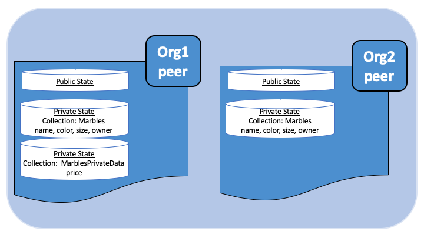

在 Fabric 中使用私有数据
======================================

本教程将演示如何使用集合在区块链网络中授权的 Peer 节点上存储和检索私有数据。

本教程需要你已经掌握私有数据存储及其使用方法。更多信息，请查看 :doc:`private-data/private-data`。

.. note:: 本教程使用 Fabric-2.0 中新的链码生命管理周期操作。如果你想在之前的版本中使用私有数据，请参阅 v1.4 版本的教程`在 Fabric 中使用私有数据教程 <https://hyperledger-fabric.readthedocs.io/en/release-1.4/private_data_tutorial.html>`__.

#. :ref:`pd-build-json`
#. :ref:`pd-read-write-private-data`
#. :ref:`pd-install-define_cc`
#. :ref:`pd-store-private-data`
#. :ref:`pd-query-authorized`
#. :ref:`pd-query-unauthorized`
#. :ref:`pd-purge`
#. :ref:`pd-indexes`
#. :ref:`pd-ref-material`

本教程将会在 Fabric Building Your First Network （BYFN）教程网络中使用 `弹珠私有数据示例 <https://github.com/hyperledger/fabric-samples/tree/{BRANCH}/chaincode/marbles02_private>`__ 来演示如何创建、部署以及 使用私有数据合集。你应该先完成 fabric 的安装 :doc:`install`。

.. _pd-build-json:

创建集合定义的 JSON 文件
------------------------------------------

在通道中使用私有数据的第一步是定义集合以决定私有数据的访问权限。

该集合的定义描述了谁可以保存数据，数据要分发给多少个节点，需要多少个节点来进行数据分发，以及私有数据在私有数据库中的保存时间。之后，我们将会展示链码的接口：``PutPrivateData`` 和 ``GetPrivateData`` 将集合映射到私有数据以确保其安全。

集合定义由以下几个属性组成：

.. _blockToLive:

- ``name``: 集合的名称。

- ``policy``: 定义了哪些组织中的 Peer 节点能够存储集合数据。

- ``requiredPeerCount``: 私有数据要分发到的节点数，这是链码背书成功的条件之一。

- ``maxPeerCount``: 为了数据冗余，当前背书节点将尝试向其他节点分发数据的数量。如果当前背书节点发生故障，其他的冗余节点可以承担私有数据查询的任务。

- ``blockToLive``: 对于非常敏感的信息，比如价格或者个人信息，这个值代表书库可以在私有数据库中保存的时间。数据会在私有数据库中保存 ``blockToLive`` 个区块，之后就会被清除。如果要永久保留，将此值设置为 ``0`` 即可。

- ``memberOnlyRead``: 设置为 ``true`` 时，节点会自动强制集合中定义的成员组织内的客户端对私有数据仅拥有只读权限。

为了说明私有数据的用法，弹珠私有数据示例包含两个私有数据集合定义：``collectionMarbles和`` 和 ``collectionMarblePrivateDetails``。``collectionMarbles`` 定义中的 ``policy`` 属性允许通道的所有成员（Org1 和 Org2）在私有数据库中保存私有数据。``collectionMarblesPrivateDetails`` 集合仅允许 Org1 的成员在其私有数据库中保存私有数据。

关于 ``policy`` 属性的更多相关信息，请查看 :doc:`endorsement-policies`。

.. code:: json

 // collections_config.json

 [
   {
        "name": "collectionMarbles",
        "policy": "OR('Org1MSP.member', 'Org2MSP.member')",
        "requiredPeerCount": 0,
        "maxPeerCount": 3,
        "blockToLive":1000000,
        "memberOnlyRead": true
   },

   {
        "name": "collectionMarblePrivateDetails",
        "policy": "OR('Org1MSP.member')",
        "requiredPeerCount": 0,
        "maxPeerCount": 3,
        "blockToLive":3,
        "memberOnlyRead": true
   }
 ]

由这些策略保护的数据将会在链码中映射出来，在本教程后半段将有说明。

当链码被使用 `peer lifecycle chaincode commit 命令 <commands/peerlifecycle.html#peer-lifecycle-chaincode-commit>`__ 提交到通道中时，集合定义文件也会被部署到通道中。更多信息请看下面的第三节。

.. _pd-read-write-private-data:

使用链码 API 读写私有数据
------------------------------------------------

接下来将通过在链码中构建数据定义来让您理解数据在通道中的私有化。弹珠私有数据示例将私有数据拆分为两个数据定义来进行数据权限控制。

.. code-block:: GO

 // Peers in Org1 and Org2 will have this private data in a side database
 type marble struct {
   ObjectType string `json:"docType"`
   Name       string `json:"name"`
   Color      string `json:"color"`
   Size       int    `json:"size"`
   Owner      string `json:"owner"`
 }

 // Only peers in Org1 will have this private data in a side database
 type marblePrivateDetails struct {
   ObjectType string `json:"docType"`
   Name       string `json:"name"`
   Price      int    `json:"price"`
 }

对私有数据的访问将遵循以下策略：

- ``name, color, size, and owner`` 通道中所有成员都可见（Org1 和 Org2）
- ``price`` 仅对 Org1 中的成员可见

弹珠示例中有两个不同的私有数据定义。这些数据和限制访问权限的集合策略将由链码接口进行控制。具体来说，就是读取和写入带有集合定义的私有数据需要使用 ``GetPrivateData()`` 和 ``PutPrivateData()`` 接口，你可以在 `这里 <https://godoc.org/github.com/hyperledger/fabric-chaincode-go/shim#ChaincodeStub>`_ 找到他们。

下图说明了弹珠私有数据示例中使用的私有数据模型。

读取集合数据
~~~~~~~~~~~~~~~~~~~~~~~~

使用链码 API ``GetPrivateData()`` 在数据库中访问私有数据。 ``GetPrivateData()`` 有两个参数，**集合名（collection name）** 和 **数据键（data key）**。 重申一下，集合 ``collectionMarbles`` 允许 Org1 和 Org2 的成员在侧数据库中保存私有数据，集合 ``collectionMarblePrivateDetails`` 只允许 Org1 在侧数据库中保存私有数据。有关接口的实现详情请查看 `弹珠私有数据方法 <https://github.com/hyperledger/fabric-samples/blob/{BRANCH}/chaincode/marbles02_private/go/marbles_chaincode_private.go>`__ ：

 * **readMarble** 用来查询 ``name, color, size and owner`` 这些属性
 * **readMarblePrivateDetails** 用来查询 ``price`` 属性

下面教程中，使用 peer 命令查询数据库的时候，会使用这两个方法。

写入私有数据
~~~~~~~~~~~~~~~~~~~~

使用链码接口 ``PutPrivateData()`` 将私有数据保存到私有数据库中。该接口需要集合名称。由于弹珠私有数据示例中包含两个不同的私有数据集，因此这个接口在链码中会被调用两次：

1. 使用集合 ``collectionMarbles`` 写入私有数据 ``name, color, size 和 owner``。
2. 使用集合  ``collectionMarblePrivateDetails`` 写入私有数据``price``。

例如,在链码的 ``initMarble`` 方法片段中,``PutPrivateData()`` 被调用了两次，每个私有数据调用一次。

.. code-block:: GO

  // ==== Create marble object, marshal to JSON, and save to state ====
	marble := &marble{
		ObjectType: "marble",
		Name:       marbleInput.Name,
		Color:      marbleInput.Color,
		Size:       marbleInput.Size,
		Owner:      marbleInput.Owner,
	}
	marbleJSONasBytes, err := json.Marshal(marble)
	if err != nil {
		return shim.Error(err.Error())
	}

	// === Save marble to state ===
	err = stub.PutPrivateData("collectionMarbles", marbleInput.Name, marbleJSONasBytes)
	if err != nil {
		return shim.Error(err.Error())
	}

	// ==== Create marble private details object with price, marshal to JSON, and save to state ====
	marblePrivateDetails := &marblePrivateDetails{
		ObjectType: "marblePrivateDetails",
		Name:       marbleInput.Name,
		Price:      marbleInput.Price,
	}
	marblePrivateDetailsBytes, err := json.Marshal(marblePrivateDetails)
	if err != nil {
		return shim.Error(err.Error())
	}
	err = stub.PutPrivateData("collectionMarblePrivateDetails", marbleInput.Name, marblePrivateDetailsBytes)
	if err != nil {
		return shim.Error(err.Error())
	}

总结一下，在上边的 ``collection.json`` 中定义的策略，允许 Org1 和 Org2 中的所有成员都能在他们的私有数据库中对私有数据 ``name, color, size, owner`` 进行存储和交易。但是只有 Org1 中的成员才能够对 ``price`` 进行存储和交易。

数据私有化的另一个好处就是，使用集合时，只有私有数据的哈希值会通过排序节点, 而数据本身不会参与排序。这样就保证了私有数据对排序节点的保密性。

启动网络
-----------------

现在我们准备使用一些命令来如何使用私有数据。

:guilabel:`Try it yourself`

在安装、定义和使用弹珠私有数据示例链码之前，我们需要启动 Fabric 测试网络。为了大家可以正确使用本教程，我们将从一个已知的初始化状态开始操作。接下来的命令将会停止你主机上所有正在运行的 Docker 容器，并会清除之前生成的构件。所以我们运行以下命令来清除之前的环境。

.. code:: bash

   cd fabric-samples/test-network
   ./network.sh down

如果你之前没有运行过本教程，你需要在我们部署链码前下载链码所需的依赖。运行如下命令：

.. code:: bash

    cd ../chaincode/marbles02_private/go
    GO111MODULE=on go mod vendor
    cd ../../../test-network

如果你之前已经运行过本教程，你也需要删除之前弹珠私有数据链码的 Docker 容器。运行如下命令：

.. code:: bash

   docker rm -f $(docker ps -a | awk '($2 ~ /dev-peer.*.marblesp.*/) {print $1}')
   docker rmi -f $(docker images | awk '($1 ~ /dev-peer.*.marblesp.*/) {print $3}')

在 ``test-network`` 目录中，你可以使用如下命令启动使用 CouchDB 的 Fabric 测试网络：

.. code:: bash

   ./network.sh up createChannel -s couchdb

这个命令将会部署一个 Fabric 网络，包括一个名为的通道 ``mychannel``，两个组织（各拥有一个 Peer 节点），Peer 节点将使用 CouchDB 作为状态数据库。用默认的 LevelDB 和 CouchDB 都可以使用私有数据集合。我们选择 CouchDB 来演示如何使用私有数据的索引。

.. note:: 为了保证私有数据集正常工作，需要正确地配置组织间的 gossip 通信。请参考文档 :doc:`gossip`，需要特别注意 "锚节点（anchor peers）" 章节。本教程不关注 gossip，它在测试网络中已经配置好了。但当我们配置通道的时候，gossip 的锚节点是否被正确配置影响到私有数据集能否正常工作。

.. _pd-install-define_cc:

安装并定义一个带集合的链码
-------------------------------------------------

客户端应用程序是通过链码与区块链账本进行数据交互的。因此我们需要在每个节点上安装链码，用他们来执行和背书我们的交易。然而，在我们与链码进行交互之前，通道中的成员需要一致同意链码的定义，以此来建立链码的治理，当然还包括链私有数据集合的定义。我们将要使用命令：:doc:`commands/peerlifecycle` 打包、安装，以及在通道上定义链码。

链码安装到 Peer 节点之前需要先进行打包操作。我们可以用 `peer lifecycle chaincode package <commands/peerlifecycle.html#peer-lifecycle-chaincode-package>`__ 命令对弹珠链码进行打包。

测试网络包含两个组织，Org1 和 Org2，各自拥有一个节点。所以要安装链码包到两个节点上：

- peer0.org1.example.com
- peer0.org2.example.com

链码打包之后，我们可以使用 `peer lifecycle chaincode install <commands/peerlifecycle.html#peer-lifecycle-chaincode-install>`__ 命令将弹珠链码安装到每个节点上。

:guilabel:`Try it yourself`

如果你已经成功启动测试网络，复制粘贴如下环境变量到你的 CLI 以 Org1 管理员的身份与测试网络进行交互。请确保你在 `test-network` 目录中。

.. code:: bash

    export PATH=${PWD}/../bin:$PATH
    export FABRIC_CFG_PATH=$PWD/../config/
    export CORE_PEER_TLS_ENABLED=true
    export CORE_PEER_LOCALMSPID="Org1MSP"
    export CORE_PEER_TLS_ROOTCERT_FILE=${PWD}/organizations/peerOrganizations/org1.example.com/peers/peer0.org1.example.com/tls/ca.crt
    export CORE_PEER_MSPCONFIGPATH=${PWD}/organizations/peerOrganizations/org1.example.com/users/Admin@org1.example.com/msp
    export CORE_PEER_ADDRESS=localhost:7051

1. 用以下命令打包弹珠私有数据链码。

.. code:: bash

    peer lifecycle chaincode package marblesp.tar.gz --path ../chaincode/marbles02_private/go/ --lang golang --label marblespv1

这个命令将会生成一个链码包文件 marblesp.tar.gz。

2. 用以下命令在节点 ``peer0.org1.example.com`` 上安装链码包。

.. code:: bash

    peer lifecycle chaincode install marblesp.tar.gz

安装成功会返回链码标识，类似如下响应：

.. code:: bash

    2019-04-22 19:09:04.336 UTC [cli.lifecycle.chaincode] submitInstallProposal -> INFO 001 Installed remotely: response:<status:200 payload:"\nKmarblespv1:57f5353b2568b79cb5384b5a8458519a47186efc4fcadb98280f5eae6d59c1cd\022\nmarblespv1" >
    2019-04-22 19:09:04.336 UTC [cli.lifecycle.chaincode] submitInstallProposal -> INFO 002 Chaincode code package identifier: marblespv1:57f5353b2568b79cb5384b5a8458519a47186efc4fcadb98280f5eae6d59c1cd

3. 现在在 CLI 中切换到 Org2 管理员。复制粘贴如下代码到你的命令行窗口并运行：

.. code:: bash

    export CORE_PEER_LOCALMSPID="Org2MSP"
    export CORE_PEER_TLS_ROOTCERT_FILE=${PWD}/organizations/peerOrganizations/org2.example.com/peers/peer0.org2.example.com/tls/ca.crt
    export CORE_PEER_MSPCONFIGPATH=${PWD}/organizations/peerOrganizations/org2.example.com/users/Admin@org2.example.com/msp
    export CORE_PEER_ADDRESS=localhost:9051

4. 用以下命令在 Org2 的节点上安装链码：

.. code:: bash

    peer lifecycle chaincode install marblesp.tar.gz

批准链码定义
~~~~~~~~~~~~~~~~~~~~~~~~~~~~~~~~

每个通道中的成员想要使用链码，都需要为他们的组织审批链码定义。由于本教程中的两个组织都要使用链码，所以我们需要使用 `peer lifecycle chaincode approveformyorg <commands/peerlifecycle.html#peer-lifecycle-chaincode-approveformyorg>`__ 为Org1 和 Org2 审批链码定义。链码定义也包含私有数据集合的定义，它们都在 ``marbles02_private`` 示例中。我们会使用 ``--collections-config`` 参数来指明私有数据集 JSON 文件的路径。

:guilabel:`Try it yourself`

在 ``test-network`` 目录下运行如下命令来为 Org1 和 Org2 审批链码定义。

1. 使用如下命令来查询节点上已安装链码包的 ID。

.. code:: bash

    peer lifecycle chaincode queryinstalled

这个命令将返回和安装命令一样的链码包的标识，你会看到类似如下的输出信息：

.. code:: bash

    Installed chaincodes on peer:
    Package ID: marblespv1:f8c8e06bfc27771028c4bbc3564341887881e29b92a844c66c30bac0ff83966e, Label: marblespv1

2. 将包 ID 声明为一个环境变量。粘贴 ``peer lifecycle chaincode queryinstalled`` 命令返回的包 ID 到下边的命令中。包 ID 在不同用户中是不一样的，所以你的 ID 可能与本教程中的不同，所以你需要使用你的终端中返回的包 ID 来完成这一步。

.. code:: bash

    export CC_PACKAGE_ID=marblespv1:f8c8e06bfc27771028c4bbc3564341887881e29b92a844c66c30bac0ff83966e

3. 为了确保我们在以 Org1 的身份运行 CLI。复制粘贴如下信息到节点容器中并执行：

.. code :: bash

    export CORE_PEER_LOCALMSPID="Org1MSP"
    export CORE_PEER_TLS_ROOTCERT_FILE=${PWD}/organizations/peerOrganizations/org1.example.com/peers/peer0.org1.example.com/tls/ca.crt
    export CORE_PEER_MSPCONFIGPATH=${PWD}/organizations/peerOrganizations/org1.example.com/users/Admin@org1.example.com/msp
    export CORE_PEER_ADDRESS=localhost:7051

4. 用如下命令审批 Org1 的弹珠私有数据链码定义。此命令包含了一个集合文件的路径。

.. code:: bash

    export ORDERER_CA=${PWD}/organizations/ordererOrganizations/example.com/orderers/orderer.example.com/msp/tlscacerts/tlsca.example.com-cert.pem
    peer lifecycle chaincode approveformyorg -o localhost:7050 --ordererTLSHostnameOverride orderer.example.com --channelID mychannel --name marblesp --version 1.0 --collections-config ../chaincode/marbles02_private/collections_config.json --signature-policy "OR('Org1MSP.member','Org2MSP.member')" --package-id $CC_PACKAGE_ID --sequence 1 --tls --cafile $ORDERER_CA

当命令成功完成后，你会收到类似如下的返回信息：

.. code:: bash

    2020-01-03 17:26:55.022 EST [chaincodeCmd] ClientWait -> INFO 001 txid [06c9e86ca68422661e09c15b8e6c23004710ea280efda4bf54d501e655bafa9b] committed with status (VALID) at

5. 将 CLI 转换到 Org2。复制粘贴如下信息到节点容器中并执行：

.. code:: bash

    export CORE_PEER_LOCALMSPID="Org2MSP"
    export CORE_PEER_TLS_ROOTCERT_FILE=${PWD}/organizations/peerOrganizations/org2.example.com/peers/peer0.org2.example.com/tls/ca.crt
    export CORE_PEER_MSPCONFIGPATH=${PWD}/organizations/peerOrganizations/org2.example.com/users/Admin@org2.example.com/msp
    export CORE_PEER_ADDRESS=localhost:9051

6. 现在你可以为 Org2 审批链码定义：

.. code:: bash

    peer lifecycle chaincode approveformyorg -o localhost:7050 --ordererTLSHostnameOverride orderer.example.com --channelID mychannel --name marblesp --version 1.0 --collections-config ../chaincode/marbles02_private/collections_config.json --signature-policy "OR('Org1MSP.member','Org2MSP.member')" --package-id $CC_PACKAGE_ID --sequence 1 --tls --cafile $ORDERER_CA

提交链码定义
~~~~~~~~~~~~~~~~~~~~~~~~~~~~~~~

当组织中大部分成员审批通过了链码定义，该组织才可以提交该链码定义到通道上。

使用 `peer lifecycle chaincode commit <commands/peerlifecycle.html#peer-lifecycle-chaincode-commit>`__ 命令来提交链码定义。这个命令同样也会部署私有数据集合到通道上。

在链码定义被提交到通道后，我们就可以使用这个链码了。因为弹珠私有数据示例包含一个初始化方法，我们在调用链码中的其他方法前，需要使用 `peer chaincode invoke <commands/peerchaincode.html?%20chaincode%20instantiate#peer-chaincode-instantiate>`__ 命令
去调用 ``Init()`` 方法。

:guilabel:`Try it yourself`

1. 运行如下命令提交弹珠私有数据示例链码定义到 ``mychannel`` 通道。

:guilabel:`Try it yourself`

.. code:: bash

    export ORDERER_CA=${PWD}/organizations/ordererOrganizations/example.com/orderers/orderer.example.com/msp/tlscacerts/tlsca.example.com-cert.pem
    export ORG1_CA=${PWD}/organizations/peerOrganizations/org1.example.com/peers/peer0.org1.example.com/tls/ca.crt
    export ORG2_CA=${PWD}/organizations/peerOrganizations/org2.example.com/peers/peer0.org2.example.com/tls/ca.crt
    peer lifecycle chaincode commit -o localhost:7050 --ordererTLSHostnameOverride orderer.example.com --channelID mychannel --name marblesp --version 1.0 --sequence 1 --collections-config ../chaincode/marbles02_private/collections_config.json --signature-policy "OR('Org1MSP.member','Org2MSP.member')" --tls --cafile $ORDERER_CA --peerAddresses localhost:7051 --tlsRootCertFiles $ORG1_CA --peerAddresses localhost:9051 --tlsRootCertFiles $ORG2_CA

 提交成功后，你会看到类似如下的输出信息：

.. code:: bash

    2020-01-06 16:24:46.104 EST [chaincodeCmd] ClientWait -> INFO 001 txid [4a0d0f5da43eb64f7cbfd72ea8a8df18c328fb250cb346077d91166d86d62d46] committed with status (VALID) at localhost:9051
    2020-01-06 16:24:46.184 EST [chaincodeCmd] ClientWait -> INFO 002 txid [4a0d0f5da43eb64f7cbfd72ea8a8df18c328fb250cb346077d91166d86d62d46] committed with status (VALID) at localhost:7051

.. _pd-store-private-data:

存储私有数据
------------------

Org1 的成员已经被授权使用弹珠私有数据示例中的所有私有数据进行交易，切换回 Org1 节点并提交添加一个弹珠的请求：

:guilabel:`Try it yourself`

在 CLI 的 `test-network` 的目录中，复制粘贴如下命令：

.. code :: bash

    export CORE_PEER_LOCALMSPID="Org1MSP"
    export CORE_PEER_TLS_ROOTCERT_FILE=${PWD}/organizations/peerOrganizations/org1.example.com/peers/peer0.org1.example.com/tls/ca.crt
    export CORE_PEER_MSPCONFIGPATH=${PWD}/organizations/peerOrganizations/org1.example.com/users/Admin@org1.example.com/msp
    export CORE_PEER_ADDRESS=localhost:7051

调用 ``initMarble`` 方法，将会创建一个带有私有数据的弹珠，该弹珠名为 ``marble1``，所有者为 ``tom``，颜色为 ``blue``，尺寸为 ``35``，价格为 ``99``。重申一下，私有数据 **price** 将会和私有数据 **name, owner, color, size** 分开存储。因此, ``initMarble`` 方法会调用 ``PutPrivateData()`` 接口两次来存储私有数据。另外注意，传递私有数据时使用 ``--transient`` 参数。作为瞬态的输入不会被记录到交易中，以此来保证数据的隐私性。瞬态数据会以二进制的方式被传输，所以在 CLI 中使用时，必须使用 base64 编码。我们设置一个环境变量来获取 base64 编码后的值，并使用 ``tr`` 命令来去掉 linux base64 命令添加的换行符。

.. code:: bash

    export MARBLE=$(echo -n "{\"name\":\"marble1\",\"color\":\"blue\",\"size\":35,\"owner\":\"tom\",\"price\":99}" | base64 | tr -d \\n)
    peer chaincode invoke -o localhost:7050 --ordererTLSHostnameOverride orderer.example.com --tls --cafile ${PWD}/organizations/ordererOrganizations/example.com/orderers/orderer.example.com/msp/tlscacerts/tlsca.example.com-cert.pem -C mychannel -n marblesp -c '{"Args":["InitMarble"]}' --transient "{\"marble\":\"$MARBLE\"}"

你会看到类似如下的输出结果:

.. code:: bash

    [chaincodeCmd] chaincodeInvokeOrQuery->INFO 001 Chaincode invoke successful. result: status:200

.. _pd-query-authorized:

授权节点查询私有数据
--------------------------------------------

我们的集合定义定义允许 Org1 和 Org2 的所有成员在他们的侧数据库中保存 ``name, color, size, owner`` 私有数据，但是只有 Org1 的成员才可以在他们的侧数据库中保存 ``price``私有数据。作为一个已授权的 Org1 的节点，我们可以查询两个私有数据集。

第一个 ``query`` 命令调用了 ``readMarble`` 方法并将 ``collectionMarbles`` 作为参数传入。

.. code-block:: GO

   // ===============================================
   // readMarble - read a marble from chaincode state
   // ===============================================

   func (t *SimpleChaincode) readMarble(stub shim.ChaincodeStubInterface, args []string) pb.Response {
   	var name, jsonResp string
   	var err error
   	if len(args) != 1 {
   		return shim.Error("Incorrect number of arguments. Expecting name of the marble to query")
   	}

   	name = args[0]
   	valAsbytes, err := stub.GetPrivateData("collectionMarbles", name) //get the marble from chaincode state

   	if err != nil {
   		jsonResp = "{\"Error\":\"Failed to get state for " + name + "\"}"
   		return shim.Error(jsonResp)
   	} else if valAsbytes == nil {
   		jsonResp = "{\"Error\":\"Marble does not exist: " + name + "\"}"
   		return shim.Error(jsonResp)
   	}

   	return shim.Success(valAsbytes)
   }

第二个 ``query`` 命令调用了 ``readMarblePrivateDetails`` 方法，
并将 ``collectionMarblePrivateDetails`` 作为参数传入。

.. code-block:: GO

   // ===============================================
   // readMarblePrivateDetails - read a marble private details from chaincode state
   // ===============================================

   func (t *SimpleChaincode) readMarblePrivateDetails(stub shim.ChaincodeStubInterface, args []string) pb.Response {
   	var name, jsonResp string
   	var err error

   	if len(args) != 1 {
   		return shim.Error("Incorrect number of arguments. Expecting name of the marble to query")
   	}

   	name = args[0]
   	valAsbytes, err := stub.GetPrivateData("collectionMarblePrivateDetails", name) //get the marble private details from chaincode state

   	if err != nil {
   		jsonResp = "{\"Error\":\"Failed to get private details for " + name + ": " + err.Error() + "\"}"
   		return shim.Error(jsonResp)
   	} else if valAsbytes == nil {
   		jsonResp = "{\"Error\":\"Marble private details does not exist: " + name + "\"}"
   		return shim.Error(jsonResp)
   	}
   	return shim.Success(valAsbytes)
   }

Now :guilabel:`Try it yourself`

用 Org1 的成员来查询 ``marble1`` 的私有数据 ``name, color, size 和 owner``。注意，因为查询操作不会在账本上留下记录，因此没必要以瞬态的方式传入弹珠名称。

.. code:: bash

    peer chaincode query -C mychannel -n marblesp -c '{"Args":["ReadMarble","marble1"]}'

你会看到如下输出结果：

.. code:: bash

    {"color":"blue","docType":"marble","name":"marble1","owner":"tom","size":35}

Query for the ``price`` private data of ``marble1`` as a member of Org1.

.. code:: bash

    peer chaincode query -C mychannel -n marblesp -c '{"Args":["ReadMarblePrivateDetails","marble1"]}'

你会看到如下输出结果：

.. code:: bash

    {"docType":"marblePrivateDetails","name":"marble1","price":99}

.. _pd-query-unauthorized:

未授权节点查询私有数据
-----------------------------------------------------

现在我们将切换到 Org2 的成员。Org2 在侧数据库中存有私有数据 ``name, color, size, owner``，但是不存储弹珠的 ``price`` 数据。我们来同时查询两个私有数据集。

.. code:: bash

切换到 Org2 的节点
~~~~~~~~~~~~~~~~~~~~~~~~

运行如下命令以 Org2 管理员的身份操作并查询 Org2 节点：

:guilabel:`Try it yourself`

.. code:: bash

    export CORE_PEER_LOCALMSPID="Org2MSP"
    export CORE_PEER_TLS_ROOTCERT_FILE=${PWD}/organizations/peerOrganizations/org2.example.com/peers/peer0.org2.example.com/tls/ca.crt
    export CORE_PEER_MSPCONFIGPATH=${PWD}/organizations/peerOrganizations/org2.example.com/users/Admin@org2.example.com/msp
    export CORE_PEER_ADDRESS=localhost:9051

:guilabel:`Try it yourself`

查询 Org2 被授权的私有数据
~~~~~~~~~~~~~~~~~~~~~~~~~~~~~~~~~~~~~~~~

Org2 的节点应该拥有第一个私有数据集（``name, color, size and owner``）的访问权限，可以使用 ``readMarble()`` 方法，该方法使用了 ``collectionMarbles`` 参数。

:guilabel:`Try it yourself`

.. code:: bash

    peer chaincode query -C mychannel -n marblesp -c '{"Args":["ReadMarble","marble1"]}'

你会看到类似如下的输出结果：

.. code:: json

    {"docType":"marble","name":"marble1","color":"blue","size":35,"owner":"tom"}

查询 Org2 未被授权的私有数据
~~~~~~~~~~~~~~~~~~~~~~~~~~~~~~~~~~~~~~~~~~~~

Org2 的节点的侧数据库中不存在 ``price`` 数据。当你尝试查询这个数据时，将会返回一个公共状态中对应键的 hash 值，但并不会返回私有状态。

:guilabel:`Try it yourself`

.. code:: bash

    peer chaincode query -C mychannel -n marblesp -c '{"Args":["ReadMarblePrivateDetails","marble1"]}'

你会看到类似如下的输出结果：

.. code:: json

    Error: endorsement failure during query. response: status:500
    message:"{\"Error\":\"Failed to get private details for marble1:
    GET_STATE failed: transaction ID: d9c437d862de66755076aeebe79e7727791981606ae1cb685642c93f102b03e5:
    tx creator does not have read access permission on privatedata in chaincodeName:marblesp collectionName: collectionMarblePrivateDetails\"}"

Org2 的成员，将只能看到私有数据的公共 hash。

.. _pd-purge:

清除私有数据
------------------

对于一些案例，私有数据仅需在账本上保存到在链下数据库复制之后就可以了，我们可以将 数据在过了一定数量的区块后进行“清除”，仅仅把数据的哈希作为交易不可篡改的证据保存下来。

私有数据可能会包含私人的或者机密的信息，比如我们例子中的价格数据，这是交易伙伴不想让通道中的其他组织知道的。而且，它具有有限的生命周期，就可以根据集合定义中的 ``blockToLive`` 属性在固定的区块数量之后清除。

我们的 ``collectionMarblePrivateDetails`` 中定义的 ``blockToLive`` 值为3，表明这个数据会在侧数据库中保存三个区块的时间，之后它就会被清除。将所有内容放在一起，回想一下绑定了私有数据 ``price`` 的私有数据集 ``collectionMarblePrivateDetails``，在函数 ``initMarble()`` 中，当调用 ``PutPrivateData()`` API 并传递了参数 ``collectionMarblePrivateDetails``。

我们将在链上增加区块，然后来通过执行四笔新交易（创建一个新弹珠，然后转移三个 弹珠）看一看价格信息被清除的过程，增加新交易的过程中会在链上增加四个新区块。在第四笔交易完成之后（第三个弹珠转移后），我们将验证一下价格私有数据是否被清除了。

:guilabel:`Try it yourself`

使用如下命令切换到 Org1 。复制和粘贴下边的一组命令到节点容器并执行：

.. code :: bash

    export CORE_PEER_LOCALMSPID="Org1MSP"
    export CORE_PEER_TLS_ROOTCERT_FILE=${PWD}/organizations/peerOrganizations/org1.example.com/peers/peer0.org1.example.com/tls/ca.crt
    export CORE_PEER_MSPCONFIGPATH=${PWD}/organizations/peerOrganizations/org1.example.com/users/Admin@org1.example.com/msp
    export CORE_PEER_ADDRESS=localhost:7051

打开一个新终端窗口，通过运行如下命令来查看这个节点上私有数据日志。注意当前区块高度。

.. code:: bash

    docker logs peer0.org1.example.com 2>&1 | grep -i -a -E 'private|pvt|privdata'

回到节点容器中，使用如下命令查询 **marble1** 的 ``price`` 数据（查询并不会产生一笔新的交易）。

.. code:: bash

    peer chaincode query -C mychannel -n marblesp -c '{"Args":["ReadMarblePrivateDetails","marble1"]}'

你将看到类似下边的结果：

.. code:: bash

    {"docType":"marblePrivateDetails","name":"marble1","price":99}

``price`` 数据仍然存在于私有数据库上。

执行如下命令创建一个新的 **marble2**。这个交易将在链上创建一个新区块。

.. code:: bash

    export MARBLE=$(echo -n "{\"name\":\"marble2\",\"color\":\"blue\",\"size\":35,\"owner\":\"tom\",\"price\":99}" | base64 | tr -d \\n)
    peer chaincode invoke -o localhost:7050 --ordererTLSHostnameOverride orderer.example.com --tls --cafile ${PWD}/organizations/ordererOrganizations/example.com/orderers/orderer.example.com/msp/tlscacerts/tlsca.example.com-cert.pem -C mychannel -n marblesp -c '{"Args":["InitMarble"]}' --transient "{\"marble\":\"$MARBLE\"}"

再次切换回终端窗口并查看节点的私有数据日志。你将看到区块高度增加了 1。

.. code:: bash

    docker logs peer0.org1.example.com 2>&1 | grep -i -a -E 'private|pvt|privdata'

返回到节点容器，运行如下命令查询 **marble1** 的价格数据：

.. code:: bash

    peer chaincode query -C mychannel -n marblesp -c '{"Args":["ReadMarblePrivateDetails","marble1"]}'

私有数据没有被清除，查询结果也没有改变：

.. code:: bash

    {"docType":"marblePrivateDetails","name":"marble1","price":99}

运行下边的命令将 marble2 转移给 “joe” 。这个交易将使链上增加第二个区块。

.. code:: bash

    export MARBLE_OWNER=$(echo -n "{\"name\":\"marble2\",\"owner\":\"joe\"}" | base64 | tr -d \\n)
    peer chaincode invoke -o localhost:7050 --ordererTLSHostnameOverride orderer.example.com --tls --cafile ${PWD}/organizations/ordererOrganizations/example.com/orderers/orderer.example.com/msp/tlscacerts/tlsca.example.com-cert.pem -C mychannel -n marblesp -c '{"Args":["TransferMarble"]}' --transient "{\"marble_owner\":\"$MARBLE_OWNER\"}"

再次切换回终端窗口并查看节点的私有数据日志。你将看到区块高度增加了 1 。

.. code:: bash

    docker logs peer0.org1.example.com 2>&1 | grep -i -a -E 'private|pvt|privdata'

返回到节点容器，再次运行如下命令查询 marble1 的价格数据：

.. code:: bash

    peer chaincode query -C mychannel -n marblesp -c '{"Args":["ReadMarblePrivateDetails","marble1"]}'

你仍然可以看到价格。

.. code:: bash

    {"docType":"marblePrivateDetails","name":"marble1","price":99}

运行下边的命令将 marble2 转移给 “tom” 。这个交易将使链上增加第三个区块。

.. code:: bash

    export MARBLE_OWNER=$(echo -n "{\"name\":\"marble2\",\"owner\":\"tom\"}" | base64 | tr -d \\n)
    peer chaincode invoke -o localhost:7050 --ordererTLSHostnameOverride orderer.example.com --tls --cafile ${PWD}/organizations/ordererOrganizations/example.com/orderers/orderer.example.com/msp/tlscacerts/tlsca.example.com-cert.pem -C mychannel -n marblesp -c '{"Args":["TransferMarble"]}' --transient "{\"marble_owner\":\"$MARBLE_OWNER\"}"

再次切换回终端窗口并查看节点的私有数据日志。你将看到区块高度增加了 1 。

.. code:: bash

    docker logs peer0.org1.example.com 2>&1 | grep -i -a -E 'private|pvt|privdata'

返回到节点容器，再次运行如下命令查询 marble1 的价格数据：

.. code:: bash

    peer chaincode query -C mychannel -n marblesp -c '{"Args":["ReadMarblePrivateDetails","marble1"]}'

你仍然可以看到价格数据。

.. code:: bash

    {"docType":"marblePrivateDetails","name":"marble1","price":99}

最后，运行下边的命令将 marble2 转移给 “jerry” 。这个交易将使链上增加第四个区块。在此次交易之后，``price`` 私有数据将会被清除。

.. code:: bash

    export MARBLE_OWNER=$(echo -n "{\"name\":\"marble2\",\"owner\":\"jerry\"}" | base64 | tr -d \\n)
    peer chaincode invoke -o localhost:7050 --ordererTLSHostnameOverride orderer.example.com --tls --cafile ${PWD}/organizations/ordererOrganizations/example.com/orderers/orderer.example.com/msp/tlscacerts/tlsca.example.com-cert.pem -C mychannel -n marblesp -c '{"Args":["TransferMarble"]}' --transient "{\"marble_owner\":\"$MARBLE_OWNER\"}"

再次切换回终端窗口并查看节点的私有数据日志。你将看到区块高度增加了 1 。

.. code:: bash

    docker logs peer0.org1.example.com 2>&1 | grep -i -a -E 'private|pvt|privdata'

返回到节点容器，再次运行如下命令查询 marble1 的价格数据：

.. code:: bash

    peer chaincode query -C mychannel -n marblesp -c '{"Args":["ReadMarblePrivateDetails","marble1"]}'

因为价格数据已经被清除了，所以你就查询不到了。你应该会看到类似下边的结果：

.. code:: bash

    Error: endorsement failure during query. response: status:500
    message:"{\"Error\":\"Marble private details does not exist: marble1\"}"

.. _pd-indexes:

使用私有数据索引
-------------------------------

可以通过打包链码目录中的索引 ``META-INF/statedb/couchdb/collections/<collection_name>/indexes`` 目录，将索引也用于私有数据数据集。`这里 <https://github.com/hyperledger/fabric-samples/blob/{BRANCH}/chaincode/marbles02_private/go/META-INF/statedb/couchdb/collections/collectionMarbles/indexes/indexOwner.json>`__ 有一个可用的索引示例。

在生产环境中部署链码时，建议在链码目录中定义所有索引，这样当链码在通道中的节点上安装和初始化的时候就可以自动作为一个单元自动部署。当使用 ``--collections-config`` 标识私有数据集的 JSON 文件路径时，通道上链码初始化的时候相关的索引会自动被部署。

.. _pd-ref-material:

其他资源
--------------------

这里有一个额外的私有数据学习的视频。

.. note:: 这个视频用的是旧版本的生命周期模型安装私有数据集合。

.. raw:: html

     
   <iframe width="560" height="315" src="https://www.youtube.com/embed/qyjDi93URJE" frameborder="0" allowfullscreen></iframe>
     

.. Licensed under Creative Commons Attribution 4.0 International License
   https://creativecommons.org/licenses/by/4.0/

