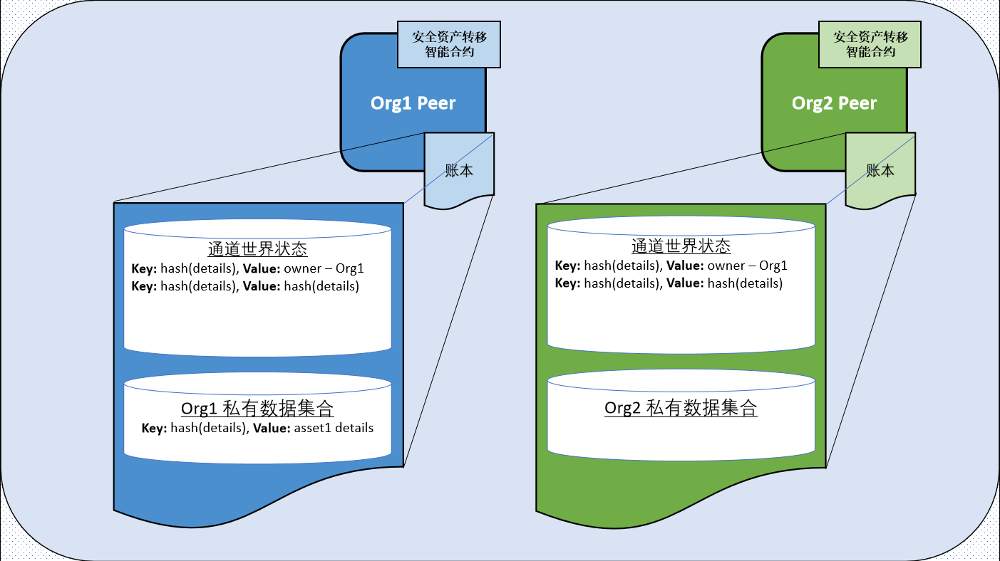
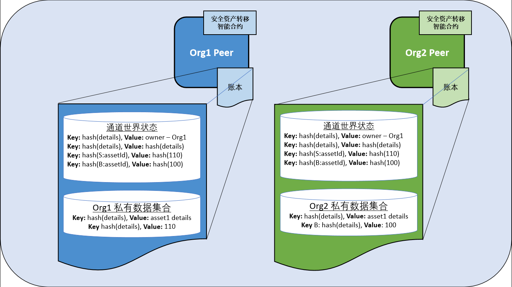
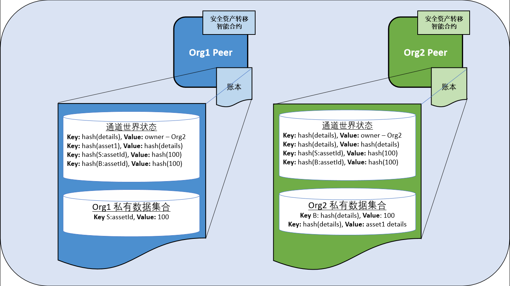

# Fabric 中的安全资产转移

本教程将演示如何在 Hyperledger Fabric 区块链通道中表示和交易资产，同时使用私有数据保持资产和交易的细节私有。每个链上资产都是一种不可替代的代币（NFT），代表一个具有特定不可变属性（例如大小和颜色）和唯一所有者的特定资产。当所有者想要出售该资产时，双方需要在转移资产之前达成相同的价格协议。私有资产转移智能合约强制只有资产所有者才能转移资产。在本教程中，您将学习如何使用 Fabric 的状态基础背书、私有数据和访问控制等功能，提供既保密又可验证的安全交易。

本教程将部署[安全资产转移示例](https://github.com/hyperledger/fabric-samples/tree/main/asset-transfer-secured-agreement/chaincode-go)，演示如何在两个组织之间传输私有资产而不公开共享数据。您应该完成了[安装示例、二进制文件和Docker镜像](../install.html#install-samples-binaries-and-docker-images)的任务。

## 场景需求

私有资产转移场景受以下要求约束：

- 资产可以由第一个所有者的组织发行（在现实世界中，发行可能仅限于某些证明资产属性的权威机构）。
- 所有权在组织级别管理（Fabric 权限方案在组织内部个人身份级别同样支持所有权）。
- 资产标识符是资产不可变属性的哈希值，并且与当前所有者一起存储为所有通道成员的公共通道数据。
- 但是，资产不可变属性是仅知道资产所有者（和先前所有者）的私有信息。
- 感兴趣的买方将希望针对哈希资产 ID 验证资产的私有属性，然后再购买。这可以确认买方具有正确的资产描述。
- 感兴趣的买方将希望验证资产的起源和监管链，以确认自发行以来资产未发生任何变化。
- 要转移资产，买方和卖方必须首先就资产的属性和销售价格达成一致。
- 只有当前所有者可以将其资产转移给另一个组织。
- 实际的私有资产转移必须验证已达成资产属性和价格的协议。买方和卖方都必须对资产转移进行背书。

## 如何维护隐私

智能合约使用以下技术确保资产属性保持私有：

- 资产属性存储在当前拥有组织的隐式私有数据集合中，仅在该组织的节点上。Fabric 通道上的每个组织都有一个私有数据集合，其自己的组织可以使用。该集合是隐式的，因为它不需要在链码中明确定义。
- 虽然私有属性的哈希值会自动存储在链上供所有通道成员查看，但私有属性中包括一个随机盐，以便其他通道成员无法通过字典攻击猜测私有数据（pre-image）。
- 智能合约请求利用瞬态字段进行私有数据传输，以便私有数据不会包含在最终的链上交易中。
- 私有数据查询必须源自客户端，其组织 ID 与节点的组织 ID 匹配，必须与资产所有者的组织 ID 相同。

## 如何实现转移

在开始使用私有资产转移智能合约之前，我们将提供交易流程概述以及如何使用 Fabric 功能来保护在区块链上创建的资产。

### 创建资产

私有资产转移智能合约部署了一个背书策略，该策略要求任何通道成员进行背书。这允许任何组织创建自己拥有的资产，而不需要其他通道成员的背书。资产创建是唯一使用链码级别背书策略的交易。更新或转移现有资产的交易将受到基于状态的背书策略或私有数据集合的背书策略的管控。请注意，在其他场景中，您可能需要发行机构背书创建交易。

智能合约使用以下 Fabric 功能确保只有拥有资产的组织才能更新或转移该资产：

- 当创建资产时，智能合约获取提交请求的组织的 MSP ID，并将该 MSP ID 存储为所有者在公共链码世界状态中资产键/值对中。接下来的智能合约请求更新或转移资产将使用访问控制逻辑来验证请求的客户端是否来自同一组织。请注意，在其他场景中，所有权可以基于组织内特定客户端身份，而不是组织本身。
- 同时，在创建资产时，智能合约为资产键设置了一个基于状态的背书策略。基于状态的策略指定拥有资产的组织的节点必须背书随后请求更新或转移资产。这可以防止其他组织使用已在其自己的 peer 节点上恶意更改的智能合约更新或发起资产转移。为了进一步保障资产转移安全，请考虑将其他方包括在资产的基于状态的背书策略中，例如可信第三方。

### 同意转移

资产创建后，通道成员可以使用智能合约来同意转移资产：

- 资产所有者可以更改公共所有权记录中的描述，例如广告资产出售。智能合约访问控制强制要求此更改需要由资产所有者组织的成员提交。基于状态的背书策略强制要求该描述更改必须得到所有者组织的节点背书。

资产所有者和资产买方同意以某个价格转移资产：

- 买方和卖方商定的价格和私有资产属性存储在每个组织的隐式私有数据集合中。私有数据集合使通道中的其他成员无法查看商定的价格和资产属性。隐式私有数据集合的背书策略确保各自组织的节点背书了价格协议，并且智能合约访问控制逻辑确保价格协议是由相关组织的客户端提交的。
- 在使用私有数据集合时，每个价格协议和资产属性的哈希都会自动存储在账本上。只有当两个组织同意相同的价格并且两个资产描述相对应时，这些哈希才会匹配。这使得组织在执行和背书转移交易时可以验证他们已经就转移细节达成了一致。交易 ID 随机添加到价格协议中，作为盐以确保其他通道成员无法使用账本上的哈希来猜测价格。

### 转移资产

在两个组织同意相同的价格和资产属性后，资产所有者可以调用转移函数将资产转移给买方：

- 智能合约访问控制确保转移必须由拥有资产的组织的成员发起。
- 转移函数通过比较买方私有集合中存在的资产属性哈希和卖方私有集合中存在的资产属性哈希来验证链上的资产属性是否相同，以确保资产所有者出售的是已声明的同一资产。
- 转移函数还使用账本上价格协议的哈希来确保两个组织已经同意相同的价格。
- 如果转移条件满足，转移函数将从卖方的集合中删除资产，并更新公共所有权记录中的所有者。
- 价格协议也将从卖方和买方隐式私有数据集合中删除，并在每个私有数据集合中创建销售收据记录交易价格和时间戳。
- 由于转移交易更新了卖方和买方隐式数据集合中的数据，因此必须由买方和卖方的 peer 节点背书。
- 公共资产记录的基于状态的背书策略更新为只有资产新所有者的节点才能更新或初始化其新资产的后续转移。

## 运行安全资产转移智能合约

您可以使用 Fabric 测试网络来运行安全资产转移智能合约。测试网络包含两个节点组织，Org1 和 Org2，每个组织操作一个 peer 节点。在本教程中，我们将将智能合约部署到由两个组织加入的测试网络的通道中。我们将首先创建一个由 Org1 拥有的资产。在两个组织就资产属性和价格达成一致后，我们将把资产从 Org1 转移给 Org2。

## 部署测试网络

我们将使用 Fabric 测试网络来运行安全资产转移智能合约。打开一个命令终端并导航到您在 [fabric-samples](https://github.com/hyperledger/fabric-samples) 中克隆的本地副本的测试网络目录。我们将在剩余的教程中从 `test-network` 目录操作。

```
cd fabric-samples/test-network
```

首先，关闭任何正在运行的测试网络实例：

```
./network.sh down
```

然后，可以使用以下命令部署网络的新实例：

```
./network.sh up createChannel -c mychannel
```

该脚本将部署网络节点，并创建一个名为 `mychannel` 的单个通道，其中包括 Org1 和 Org2 作为通道成员。我们将使用此通道来部署智能合约并交易我们的资产。

## 部署智能合约

您可以使用测试网络脚本将安全资产转移智能合约部署到通道中。运行以下命令将智能合约部署到 `mychannel`：

```
./network.sh deployCC -ccn secured -ccp ../asset-transfer-secured-agreement/chaincode-go/ -ccl go -ccep "OR('Org1MSP.peer','Org2MSP.peer')"
```

请注意，我们使用 `-ccep` 标志将智能合约部署为背书策略为 `“OR（'Org1MSP.peer'，'Org2MSP.peer'）”`。这允许任何一个组织创建一个资产而无需获得另一个组织的背书。

### 将环境变量设置为 Org1 操作

在运行此示例的过程中，您需要以 Org1 和 Org2 的身份与网络进行交互。为了使教程更易于使用，我们将为每个组织使用单独的终端。打开一个新终端并确保您正在从 `test-network` 目录操作。将以下环境变量设置为 `peer` CLI 的 Org1 管理员：

```
export PATH=${PWD}/../bin:${PWD}:$PATH
export FABRIC_CFG_PATH=$PWD/../config/
export CORE_PEER_TLS_ENABLED=true
export CORE_PEER_LOCALMSPID="Org1MSP"
export CORE_PEER_MSPCONFIGPATH=${PWD}/organizations/peerOrganizations/org1.example.com/users/Admin@org1.example.com/msp
export CORE_PEER_TLS_ROOTCERT_FILE=${PWD}/organizations/peerOrganizations/org1.example.com/peers/peer0.org1.example.com/tls/ca.crt
export CORE_PEER_ADDRESS=localhost:7051
```

环境变量还指定了 Org1 节点的端点信息以提交请求。

### 将环境变量设置为 Org2 操作

现在我们有了一个终端可以作为 Org1 操作，为 Org2 打开一个新终端。确保此终端也正在从 `test-network` 目录操作。将以下环境变量设置为 Org2 管理员：

```
export PATH=${PWD}/../bin:${PWD}:$PATH
export FABRIC_CFG_PATH=$PWD/../config/
export CORE_PEER_TLS_ENABLED=true
export CORE_PEER_LOCALMSPID="Org2MSP"
export CORE_PEER_MSPCONFIGPATH=${PWD}/organizations/peerOrganizations/org2.example.com/users/Admin@org2.example.com/msp
export CORE_PEER_TLS_ROOTCERT_FILE=${PWD}/organizations/peerOrganizations/org2.example.com/peers/peer0.org2.example.com/tls/ca.crt
export CORE_PEER_ADDRESS=localhost:9051
```

您需要在两个终端之间切换，以完成教程。

## 创建资产

任何通道成员都可以使用智能合约创建由其组织拥有的资产。资产的详细信息将存储在私有数据集合中，并且只能由拥有资产的组织访问。资产的公共记录，其所有者和公共描述存储在通道账本中。任何通道成员都可以访问公共所有权记录以查看谁拥有该资产，并可以读取描述以查看该资产是否出售。

### 从 Org1 终端操作

在创建资产之前，我们需要指定资产的详细信息。发出以下命令以创建将描述资产的 JSON。`“salt”` 参数是一个随机字符串，可以防止通道的其他成员通过哈希猜测资产。如果没有盐，用户理论上可以猜测资产参数，直到猜测的哈希和账本上的哈希匹配（这称为字典攻击）。该字符串以 Base64 格式编码，以便可以将其作为瞬态数据传递给创建交易。

```
export ASSET_PROPERTIES=$(echo -n "{\"object_type\":\"asset_properties\",\"color\":\"blue\",\"size\":35,\"salt\":\"a94a8fe5ccb19ba61c4c0873d391e987982fbbd3\"}" | base64 | tr -d \\n)
```

现在，我们可以使用以下命令创建属于 Org1 的资产。

```
peer chaincode invoke -o localhost:7050 --ordererTLSHostnameOverride orderer.example.com --tls --cafile "${PWD}/organizations/ordererOrganizations/example.com/orderers/orderer.example.com/msp/tlscacerts/tlsca.example.com-cert.pem" -C mychannel -n secured -c '{"function":"CreateAsset","Args":["A new asset for Org1MSP"]}' --transient "{\"asset_properties\":\"$ASSET_PROPERTIES\"}"
```

资产属性的哈希将成为资产 ID，并由 CreateAsset 调用返回。在 CLI 报告的响应 “payload” 中寻找哈希，并将其设置为以后的参考环境变量。

```
export ASSET_ID=d9923f21b770adbc79cbcc47a3aeecc81dc7f030bd129155301ce3932be7fbcc
```

我们可以查询 Org1 隐式数据集合以查看已创建的资产，编写以下命令并用返回的 id 替换 assetId。

```
peer chaincode query -o localhost:7050 --ordererTLSHostnameOverride orderer.example.com --tls --cafile "${PWD}/organizations/ordererOrganizations/example.com/orderers/orderer.example.com/msp/tlscacerts/tlsca.example.com-cert.pem" -C mychannel -n secured -c "{\"function\":\"GetAssetPrivateProperties\",\"Args\":[\"$ASSET_ID\"]}"
```

当成功时，该命令将返回以下结果：

```
{"object_type":"asset_properties","color":"blue","size":35,"salt":"a94a8fe5ccb19ba61c4c0873d391e987982fbbd3"}
```

我们还可以查询账本以查看公共所有权记录：

```
peer chaincode query -o localhost:7050 --ordererTLSHostnameOverride orderer.example.com --tls --cafile "${PWD}/organizations/ordererOrganizations/example.com/orderers/orderer.example.com/msp/tlscacerts/tlsca.example.com-cert.pem" -C mychannel -n secured -c "{\"function\":\"ReadAsset\",\"Args\":[\"$ASSET_ID\"]}"

```

该命令将返回该资产由 Org1 拥有的记录：

```
{"object_type":"asset","asset_id":"d9923f21b770adbc79cbcc47a3aeecc81dc7f030bd129155301ce3932be7fbcc","owner_org":"Org1MSP","public_description":"A new asset for Org1MSP"}
```

由于资产市场火热，Org1 想要翻转（flip）此资产并将其公开出售。作为资产所有者，Org1 可以更新公共描述以发布资产出售。运行以下命令更改资产描述：

```
peer chaincode invoke -o localhost:7050 --ordererTLSHostnameOverride orderer.example.com --tls --cafile "${PWD}/organizations/ordererOrganizations/example.com/orderers/orderer.example.com/msp/tlscacerts/tlsca.example.com-cert.pem" -C mychannel -n secured -c "{\"function\":\"ChangePublicDescription\",\"Args\":[\"$ASSET_ID\",\"This asset is for sale\"]}"
```

再次查询账本以查看更新后的描述：

```
peer chaincode query -o localhost:7050 --ordererTLSHostnameOverride orderer.example.com --tls --cafile "${PWD}/organizations/ordererOrganizations/example.com/orderers/orderer.example.com/msp/tlscacerts/tlsca.example.com-cert.pem" -C mychannel -n secured -c "{\"function\":\"ReadAsset\",\"Args\":[\"$ASSET_ID\"]}"
```

现在我们可以看到该资产正在出售：

```
{"object_type":"asset","asset_id":"d9923f21b770adbc79cbcc47a3aeecc81dc7f030bd129155301ce3932be7fbcc","owner_org":"Org1MSP","public_description":"This asset is for sale"}
```

    

*图1：当 Org1 创建属于他们自己的资产时，资产详细信息存储在 Org1 节点的 Org1 隐式数据集合中。公共所有权记录存储在通道世界状态中，并存储在 Org1 和 Org2 节点上。资产密钥的哈希和资产详细信息的哈希也可在通道世界状态中看到，并存储在两个组织的节点上。*

### 从 Org2 终端操作

如果我们从 Org2 终端操作，我们可以使用智能合约查询公共资产数据：

```
export ASSET_ID=d9923f21b770adbc79cbcc47a3aeecc81dc7f030bd129155301ce3932be7fbcc
peer chaincode query -o localhost:7050 --ordererTLSHostnameOverride orderer.example.com --tls --cafile "${PWD}/organizations/ordererOrganizations/example.com/orderers/orderer.example.com/msp/tlscacerts/tlsca.example.com-cert.pem" -C mychannel -n secured -c "{\"function\":\"ReadAsset\",\"Args\":[\"$ASSET_ID\"]}"
```

从此查询中，Org2 了解到该资产正在出售：

```
{"object_type":"asset","asset_id":"d9923f21b770adbc79cbcc47a3aeecc81dc7f030bd129155301ce3932be7fbcc","owner_org":"Org1MSP","public_description":"This asset is for sale"}
```

_在真实的链码中，您可能希望查询所有出售的资产，方法是使用 JSON 查询，或创建不同的销售密钥并使用密钥范围查询以查找当前出售的资产。_
由 Org1 拥有的资产的任何公共描述更改都需要得到 Org1 的背书。背书策略由链码中的访问控制策略强制执行，任何更新都需要由拥有该资产的组织提交。让我们看看如果 Org2 试图以恶作剧的方式更改公共描述会发生什么：

```
peer chaincode invoke -o localhost:7050 --ordererTLSHostnameOverride orderer.example.com --tls --cafile "${PWD}/organizations/ordererOrganizations/example.com/orderers/orderer.example.com/msp/tlscacerts/tlsca.example.com-cert.pem" -C mychannel -n secured -c "{\"function\":\"ChangePublicDescription\",\"Args\":[\"$ASSET_ID\",\"the worst asset\"]}"
```

智能合约不允许Org2访问资产的公共描述。

```
Error: endorsement failure during invoke. response: status:500 message:"a client from Org2MSP cannot update the description of an asset owned by Org1MSP"
```

## 同意出售资产

为了出售资产，买方和卖方必须同意资产价格，并确保他们在各自的私有数据集合中具有相同的资产属性。每个方都在其自己的私有数据集合中存储他们同意的价格。在资产转移之前，私有资产转移智能合约强制执行双方需要同意相同的价格和资产属性。

## 作为 Org1 同意出售

从 Org1 终端操作。Org1 将同意以110美元的价格出售资产。`trade_id` 用作盐以防止不是买方或卖方的通道成员猜测价格。需要通过电子邮件或其他通信方式，将此值与资产属性一起通过带外传递给买方和卖方。买方和卖方还可以向资产密钥添加盐，以防止通道的其他成员猜测哪个资产正在出售。

```
export ASSET_PRICE=$(echo -n "{\"asset_id\":\"$ASSET_ID\",\"trade_id\":\"109f4b3c50d7b0df729d299bc6f8e9ef9066971f\",\"price\":110}" | base64 | tr -d \\n)
peer chaincode invoke -o localhost:7050 --ordererTLSHostnameOverride orderer.example.com --tls --cafile "${PWD}/organizations/ordererOrganizations/example.com/orderers/orderer.example.com/msp/tlscacerts/tlsca.example.com-cert.pem" -C mychannel -n secured -c "{\"function\":\"AgreeToSell\",\"Args\":[\"$ASSET_ID\"]}" --transient "{\"asset_price\":\"$ASSET_PRICE\"}"
```

我们可以查询 Org1 的私有数据集合以读取同意的销售价格：

```
peer chaincode query -o localhost:7050 --ordererTLSHostnameOverride orderer.example.com --tls --cafile "${PWD}/organizations/ordererOrganizations/example.com/orderers/orderer.example.com/msp/tlscacerts/tlsca.example.com-cert.pem" -C mychannel -n secured -c "{\"function\":\"GetAssetSalesPrice\",\"Args\":[\"$ASSET_ID\"]}"
```

## 作为 Org2 同意购买

从 Org2 终端操作。运行以下命令以在同意购买之前验证资产属性。资产属性和盐将通过电子邮件或其他通信方式在买方和卖方之间传递。

```
export ASSET_PROPERTIES=$(echo -n "{\"object_type\":\"asset_properties\",\"color\":\"blue\",\"size\":35,\"salt\":\"a94a8fe5ccb19ba61c4c0873d391e987982fbbd3\"}" | base64 | tr -d \\n)
peer chaincode query -o localhost:7050 --ordererTLSHostnameOverride orderer.example.com --tls --cafile "${PWD}/organizations/ordererOrganizations/example.com/orderers/orderer.example.com/msp/tlscacerts/tlsca.example.com-cert.pem" -C mychannel -n secured -c "{\"function\":\"VerifyAssetProperties\",\"Args\":[\"$ASSET_ID\"]}" --transient "{\"asset_properties\":\"$ASSET_PROPERTIES\"}"
```

运行以下命令以愿意以100美元的价格购买 asset1。目前，Org2 同意的价格与 Org1 不同。不要担心，两个组织将在以后的步骤中达成相同的价格。但是，我们可以使用这个临时的不一致作为测试，看看如果买方和卖方达成不同的价格会发生什么。Org2 需要使用与 Org1 相同的 `trade_id`。

```
export ASSET_PRICE=$(echo -n "{\"asset_id\":\"$ASSET_ID\",\"trade_id\":\"109f4b3c50d7b0df729d299bc6f8e9ef9066971f\",\"price\":100}" | base64 | tr -d \\n)
export ASSET_PROPERTIES=$(echo -n "{\"object_type\":\"asset_properties\",\"color\":\"blue\",\"size\":35,\"salt\":\"a94a8fe5ccb19ba61c4c0873d391e987982fbbd3\"}" | base64 | tr -d \\n)
peer chaincode invoke -o localhost:7050 --ordererTLSHostnameOverride orderer.example.com --tls --cafile "${PWD}/organizations/ordererOrganizations/example.com/orderers/orderer.example.com/msp/tlscacerts/tlsca.example.com-cert.pem" -C mychannel -n secured -c "{\"function\":\"AgreeToBuy\",\"Args\":[\"$ASSET_ID\"]}" --transient "{\"asset_price\":\"$ASSET_PRICE\", \"asset_properties\":\"$ASSET_PROPERTIES\"}"
```

您可以从 Org2 的隐式数据集合中读取同意购买价格：

```
peer chaincode query -o localhost:7050 --ordererTLSHostnameOverride orderer.example.com --tls --cafile "${PWD}/organizations/ordererOrganizations/example.com/orderers/orderer.example.com/msp/tlscacerts/tlsca.example.com-cert.pem" -C mychannel -n secured -c "{\"function\":\"GetAssetBidPrice\",\"Args\":[\"$ASSET_ID\"]}"
```

    

*图2：在 Org1 和 Org2 同意转让资产后，每个组织同意的价格存储在其私有数据集合中。为卖方和买方使用组合键，以防止与资产详细信息和资产所有权记录发生冲突。同意的价格仅存储在每个组织的节点上。但是，两个协议的哈希存储在连接到通道的每个节点的通道世界状态中。*

## 将资产从 Org1 转移到 Org2

在两个组织达成价格和资产属性之后，Org1 可以尝试将资产转移到 Org2。智能合约中的私有资产转移函数使用账本上的哈希来检查两个组织是否同意相同的价格。该函数还将检查卖方和买方私有集合的资产属性哈希，以检查转移的资产是否与 Org1 拥有的资产相同。

### 作为 Org1 转移资产

从 Org1 终端操作。资产所有者需要初始化转移交易。请注意，下面的命令使用 `--peerAddresses` 标志来定位 Org1 和 Org2 的节点。两个组织都需要背书转移交易。 _还要注意，价格作为瞬态属性在转移请求中传递。这样传递是为了让当前所有者确保以正确的价格转移正确的资产。这些属性将由两个背书者根据链上哈希进行检查。_

```
peer chaincode invoke -o localhost:7050 --ordererTLSHostnameOverride orderer.example.com --tls --cafile "${PWD}/organizations/ordererOrganizations/example.com/orderers/orderer.example.com/msp/tlscacerts/tlsca.example.com-cert.pem" -C mychannel -n secured -c "{\"function\":\"TransferAsset\",\"Args\":[\"$ASSET_ID\",\"Org2MSP\"]}" --transient "{\"asset_price\":\"$ASSET_PRICE\"}" --peerAddresses localhost:7051 --tlsRootCertFiles "${PWD}/organizations/peerOrganizations/org1.example.com/peers/peer0.org1.example.com/tls/ca.crt" --peerAddresses localhost:9051 --tlsRootCertFiles "${PWD}/organizations/peerOrganizations/org2.example.com/peers/peer0.org2.example.com/tls/ca.crt"
```

因为两个组织没有同意相同的价格，转移无法完成：

```
Error: endorsement failure during invoke. response: status:500 message:"failed transfer verification: hash cf74b8ce092b637bd28f98f7cdd490534c102a0665e7c985d4f2ab9810e30b1c for passed price JSON {\"asset_id\":\"d9923f21b770adbc79cbcc47a3aeecc81dc7f030bd129155301ce3932be7fbcc\",\"trade_id\":\"109f4b3c50d7b0df729d299bc6f8e9ef9066971f\",\"price\":110} does not match on-chain hash 09341dbb39e81fb50ccb3a81770254525318f777fad217ae49777487116cceb4, buyer hasn't agreed to the passed trade id and price"
```

因此，Org1 和 Org2 达成了资产购买价格的新协议。Org1 将资产价格降至100：

```
export ASSET_PRICE=$(echo -n "{\"asset_id\":\"$ASSET_ID\",\"trade_id\":\"109f4b3c50d7b0df729d299bc6f8e9ef9066971f\",\"price\":100}" | base64 | tr -d \\n)
peer chaincode invoke -o localhost:7050 --ordererTLSHostnameOverride orderer.example.com --tls --cafile "${PWD}/organizations/ordererOrganizations/example.com/orderers/orderer.example.com/msp/tlscacerts/tlsca.example.com-cert.pem" -C mychannel -n secured -c "{\"function\":\"AgreeToSell\",\"Args\":[\"$ASSET_ID\",\"Org2MSP\"]}" --transient "{\"asset_price\":\"$ASSET_PRICE\"}"
```

现在买方和卖方达成了相同的价格，Org1 可以将资产转移给Org2。

```
peer chaincode invoke -o localhost:7050 --ordererTLSHostnameOverride orderer.example.com --tls --cafile "${PWD}/organizations/ordererOrganizations/example.com/orderers/orderer.example.com/msp/tlscacerts/tlsca.example.com-cert.pem" -C mychannel -n secured -c "{\"function\":\"TransferAsset\",\"Args\":[\"$ASSET_ID\",\"Org2MSP\"]}" --transient "{\"asset_price\":\"$ASSET_PRICE\"}" --peerAddresses localhost:7051 --tlsRootCertFiles "${PWD}/organizations/peerOrganizations/org1.example.com/peers/peer0.org1.example.com/tls/ca.crt" --peerAddresses localhost:9051 --tlsRootCertFiles "${PWD}/organizations/peerOrganizations/org2.example.com/peers/peer0.org2.example.com/tls/ca.crt"
```

您可以查询资产所有权记录以验证转移是否成功。

```
peer chaincode query -o localhost:7050 --ordererTLSHostnameOverride orderer.example.com --tls --cafile "${PWD}/organizations/ordererOrganizations/example.com/orderers/orderer.example.com/msp/tlscacerts/tlsca.example.com-cert.pem" -C mychannel -n secured -c "{\"function\":\"ReadAsset\",\"Args\":[\"$ASSET_ID\"]}"
```

现在记录将 Org2 列为资产所有者：

```
{"object_type":"asset","asset_id":"<asset1>","owner_org":"Org2MSP","public_description":"This asset is for sale"}
```

   

*图3：资产转移后，资产详细信息放置在 Org2 隐式数据集合中，并从 Org1 隐式数据集合中删除。因此，资产详细信息现在仅存储在 Org2 节点上。账本上的资产所有权记录已更新，以反映资产归 Org2 所有。*

### 作为 Org2 更新资产描述

从 Org2 终端操作。现在 Org2 拥有该资产，我们可以从 Org2 隐式数据集合中读取资产详细信息：

```
peer chaincode query -o localhost:7050 --ordererTLSHostnameOverride orderer.example.com --tls --cafile "${PWD}/organizations/ordererOrganizations/example.com/orderers/orderer.example.com/msp/tlscacerts/tlsca.example.com-cert.pem" -C mychannel -n secured -c "{\"function\":\"GetAssetPrivateProperties\",\"Args\":[\"$ASSET_ID\"]}"
```

Org2 现在可以更新资产的公共描述：

```
peer chaincode invoke -o localhost:7050 --ordererTLSHostnameOverride orderer.example.com --tls --cafile "${PWD}/organizations/ordererOrganizations/example.com/orderers/orderer.example.com/msp/tlscacerts/tlsca.example.com-cert.pem" -C mychannel -n secured -c "{\"function\":\"ChangePublicDescription\",\"Args\":[\"$ASSET_ID\",\"This asset is not for sale\"]}"
```

查询账本以验证该资产不再出售：

```
peer chaincode query -o localhost:7050 --ordererTLSHostnameOverride orderer.example.com --tls --cafile "${PWD}/organizations/ordererOrganizations/example.com/orderers/orderer.example.com/msp/tlscacerts/tlsca.example.com-cert.pem" -C mychannel -n secured -c "{\"function\":\"ReadAsset\",\"Args\":[\"$ASSET_ID\"]}"
```

## 清理

完成资产转移后，可以关闭测试网络。该命令将删除测试网络的所有节点，并删除您创建的任何账本数据：

```
./network.sh down
```

<!--- Licensed under Creative Commons Attribution 4.0 International License
https://creativecommons.org/licenses/by/4.0/) -->
