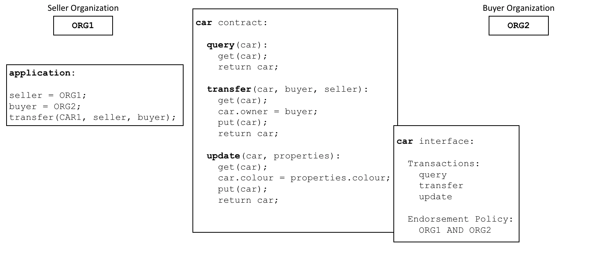

# 智能合约和链码

**受众** ：架构师、应用程序和智能合约开发者、管理员。

从应用程序开发人员的角度来看，**智能合约**与[账本](../ledger/ledger.html)一起构成了 Hyperledger Fabric 区块链系统的核心。账本包含了与一组业务对象的当前和历史状态有关的事实，而**智能合约**定义了生成这些被添加到账本中的新事实的可执行逻辑。管理员通常使用**链码**将相关的智能合约组织起来进行部署，并且链码也可以用于 Fabric 的底层系统编程。在本主题中，我们将重点讨论为什么存在**智能合约**和**链码**，以及如何和何时使用它们。

在本主题中，我们将讨论：

* [什么是智能合约](#智能合约)
* [术语说明](#术语)
* [智能合约和账本](#账本)
* [怎么开发一个智能合约](#开发)
* [背书策略的重要性](#背书)
* [验证交易](#有效交易)
* [通道和链码定义](#通道)
* [智能合约之间的通信](#互通)
* [什么是系统链码](#系统链码)

## 智能合约

在各业务彼此进行交互之前，必须先定义一套通用的合约，其中包括通用术语、数据、规则、概念定义和流程。将这些合约放在一起，就构成了管理交易各方之间所有交互的**业务模型**。

 *智能合约用可执行的代码定义了不同组织之间的规则。应用程序调用智能合约来生成被记录到账本上的交易。*

使用区块链网络，我们可以将这些合约转换为可执行程序（业内称为**智能合约**），从而实现了各种各样的新可能性。这是因为智能合约可以为**任何**类型的业务对象实现治理规则，以便在执行智能合约时自动执行这些规则。例如，一个智能合约可能会确保新车在指定的时间内交付，或者根据预先安排的条款释放资金，前者可改善货物流通，而后者可优化资本流动。然而最重要的是，智能合约的执行要比人工业务流程高效得多。

在[上图](#智能合约)中，我们可以看到组织 `ORG1` 和 `ORG2` 是如何通过定义一个 `car` 智能合约来实现 `查询`、`转移` 和 `更新` 汽车的。来自这些组织的应用程序调用此智能合约执行业务流程中已商定的步骤，例如将特定汽车的所有权从 `ORG1` 转移到 `ORG2`。

## 术语

Hyperledger Fabric 用户经常交替使用**智能合约**和**链码**。通常，智能合约定义的是控制世界状态中业务对象生命周期的**交易逻辑**，随后该交易逻辑被打包进链码，紧接着链码会被部署到区块链网络中。可以将智能合约看成交易的管理者，而链码则管理着如何将智能合约打包以便用于部署。

 *一个智能合约定义在一个链码中。而多个智能合约也可以定义在同一个链码中。当一个链码部署完毕，该链码中的所有智能合约都可供应用程序使用。*

从上图中我们可以看到，`vehicle` 链码包含了以下三个智能合约：`cars`、`boats ` 和 `trucks`；而 `insurance` 链码包含了以下四个智能合约：`policy`、`liability`、`syndication` 和 `securitization`。以上每种智能合约都涵盖了与车辆和保险有关的业务流程的一些关键点。在本主题中，我们将以 `car` 智能合约为例。我们可以看到，智能合约是一个特定领域的程序，它与特定的业务流程相关，而链码则是一组相关智能合约安装和实例化的技术容器。

## 账本

以最简单的方式来说，区块链记录着更新账本状态的交易，且记录不可篡改。智能合约以编程方式访问账本两个不同的部分：一个是**区块链**（记录所有交易的历史，且记录不可篡改），另一个是**世界状态**（保存这些状态当前值的缓存，是经常需要用到的对象的当前值）。

智能合约主要在世界状态中将状态**写入**（put）、**读取**（get）和**删除**（delete），还可以查询不可篡改的区块链交易记录。

* **读取（get）** 操作一般代表的是查询，目的是获取关于交易对象当前状态的信息。
* **写入（put）** 操作通常生成一个新的业务对象或者对账本世界状态中现有的业务对象进行修改。
* **删除（delete）** 操作代表的是将一个业务对象从账本的当前状态中移除，但不从账本的历史中移除。

智能合约有许多可用的 [API](../developapps/transactioncontext.html#structure)。但重要的是，在任意情况下，无论交易创建、读取、更新还是删除世界状态中的业务对象，区块链都包含了这些操作的记录，且[记录不可更改](../ledger/ledger.html) 。

## 开发

智能合约是应用程序开发的重点，正如我们所看到的，一个链码中可定义一个或多个智能合约。将链码部署到网络中以后，网络上的组织就都可以使用该链码中的所有智能合约。这意味着只有管理员才需要考虑链码；其他人都只用考虑智能合约。

智能合约的核心是一组 `交易` 定义。例如，在 [`fabcar.js`](https://github.com/hyperledger/fabric-samples/blob/master/chaincode/fabcar/javascript/lib/fabcar.js#L93) 中，你可以看到一个创建了一辆新车的智能合约交易：

```javascript
async createCar(ctx, carNumber, make, model, color, owner) {

    const car = {
        color,
        docType: 'car',
        make,
        model,
        owner,
    };

    await ctx.stub.putState(carNumber, Buffer.from(JSON.stringify(car)));
}
```

在[编写您的第一个应用程序](../write_first_app.html) 教程中，您可以了解更多关于 **Fabcar** 智能合约的信息。

智能合约几乎可以描述所有与多组织决策中数据不可变性相关的业务案例。智能合约开发人员的工作是将一个现有的业务流程（可能是管理金融价格或交付条件）用 JavaScript、GOLANG 或 Java 等编程语言来表示成一个智能合约。将数百年的法律语言转换为编程语言需要法律和技术方面的技能，**智能合约审核员**们不断地实践着这些技能。您可以在[开发应用程序主题](../developapps/developing_applications.html)中了解如何设计和开发智能合约。

## 背书

每个链码都有一个背书策略与之相关联，该背书策略适用于此链码中定义的所有智能合约。背书策略非常重要，它指明了区块链网络中哪些组织必须对一个给定的智能合约所生成的交易进行签名，以此来宣布该交易**有效**。

 *每个智能合约都有一个与之关联的背书策略。这个背书策略定义了在智能合约生成的交易被认证为有效之前，哪些组织必须同意该交易。*

一个示例背书策略可能这样定义：参与区块链网络的四个组织中有三个必须在交易被认为**有效**之前签署该交易。所有的交易，无论是**有效的**还是**无效的**，都会被添加到分布式账本中，但只有**有效**交易会更新世界状态。

如果一项背书策略指定了必须有不止一个组织来签署交易，那么只有当足够数量的组织都执行了智能合约，才能够生成有效交易。在[上面](#背书)的示例中，要使用于车辆 `transfer` 的智能合约交易有效，需要 `ORG1` 和 `ORG2` 都执行并签署该交易。

背书策略是 Hyperledger Fabric 与以太坊（Ethereum）或比特币（Bitcoin）等其他区块链的区别所在。在这些区块链系统中，网络上的任何节点都可以生成有效的交易。而 Hyperledger Fabric 更真实地模拟了现实世界；交易必须由 Fabric 网络中受信任的组织验证。例如，一个政府组织必须签署一个有效的 `issueIdentity` 交易，或者一辆车的 `买家` 和 `卖家` 都必须签署一个 `车辆` 转移交易。背书策略的设计旨在让 Hyperledger Fabric 更好地模拟这些真实发生的交互。

最后，背书策略只是 Hyperledger Fabric 中[策略](../access_control.html#policies)的一个例子。还可以定义其他策略来确定谁可以查询或更新账本，或者谁可以在网络中添加或删除参与者。总体来说，虽然区块链网络中的组织联盟并非一成不变，但是它们需要事先商定好策略。实际上，策略本身可以定义对自己进行更改的规则。虽然现在谈论这个主题有点早，但是在 Fabric 提供的规则基础上来定义[自定义背书策略](../pluggable_endorsement_and_validation.html)的规则也是可能实现的。

## 有效交易

当智能合约执行时，它会在区块链网络中组织所拥有的节点上运行。智能合约提取一组名为**交易提案**的输入参数，并将其与程序逻辑结合起来使用以读写账本。对世界状态的更改被捕获为**交易提案响应**（或简称**交易响应**），该响应包含一个**读写集**，其中既含有已读取的状态，也含有还未书写的新状态（如果交易有效的话）。注意，在执行智能合约时**世界状态没有更新**！

 *所有的交易都有一个识别符、一个提案和一个被一群组织签名的响应。所有交易，无论是否有效，都会被记录在区块链上，但仅有效交易会更新世界状态。*

检查 `车辆转移` 交易。您可以看到 `ORG1` 和 `ORG2` 之间为转移一辆车而进行的交易 `t3`。看一下交易是如何通过输入 `{CAR1，ORG1，ORG2}` 和输出 `{CAR1.owner=ORG1，CAR1.owner=ORG2}` 来表示汽车的所有者从 `ORG1` 变为了 `ORG2`。注意输入是如何由应用程序的组织 `ORG1` 签名的，输出是如何由背书策略标识的*两个*组织（ `ORG1` 和 `ORG2` ）签名的。这些签名是使用每个参与者的私钥生成的，这意味着网络中的任何人都可以验证网络中的所有参与者是否在交易细节上达成了一致。

一项交易被分发给网络中的所有节点，各节点通过两个阶段对其进行**验证**。首先，根据背书策略检查交易，确保该交易已被足够的组织签署。其次，继续检查交易，以确保当该交易在受到背书节点签名时它的交易读集与世界状态的当前值匹配，并且中间过程中没有被更新。如果一个交易通过了这两个测试，它就被标记为**有效**。所有交易，不管是**有效的**还是**无效的**，都会被添加到区块链历史中，但是仅**有效的**交易才会更新世界状态。

在我们的示例中，`t3` 是一个有效的交易，因此 `CAR1` 的所有者已更新为 `ORG2`。但是 `t4` （未显示）是无效的交易，所以当把它记录在账本上时，世界状态没有更新，`CAR2` 仍然属于 `ORG2` 所有。

最后，要了解如何通过世界状态来使用智能合约或链码，请阅读[链码命名空间主题](../developapps/chaincodenamespace.html)。

## 通道

Hyperledger Fabric 允许一个组织利用**通道**同时参与多个、彼此独立的区块链网络。通过加入多个通道，一个组织可以参与一个所谓的**网络的网络**。通道在维持数据和通信隐私的同时还提供了高效的基础设施共享。通道是足够独立的，可以帮助组织将自己的工作与其他组织的分开，同时它还具有足够的协调性，在必要时能够协调各个独立的活动。

 *通道在一群组织之间提供了一种完全独立的通信机制。当链码定义被提交到通道上时，该通道上所有的应用程序都可以使用此链码中的智能合约。*

虽然智能合约代码被安装在组织节点的链码包内，但是只有等到链码被定义在通道上之后，该通道上的成员才能够执行其中的智能合约。**链码定义**是一种包含了许多参数的结构，这些参数管理着链码的运行方式，包含着链码名、版本以及背书策略。各通道成员批准各自组织的一个链码定义，以表示其对该链码的参数表示同意。当足够数量（默认是大多数）的组织都已批准同一个链码定义，该定义可被提交至这些组织所在的通道。随后，通道成员可依据该链码定义中指明的背书策略来执行其中的智能合约。这个背书策略可同等使用于在相同链码中定义的所有智能合约。

在[上面](#通道)的示例中，`car` 智能合约被定义在 `VEHICLE` 通道上，`insurance` 智能合约被定义在 `INSURANCE` 通道上。`car` 的链码定义明确了以下背书策略：任何交易在被认定为有效之前必须由 `ORG1` 和 `ORG2` 共同签名。`insurance` 智能合约的链码定义明确了只需要 `ORG3` 对交易进行背书即可。`ORG1` 参与了 `VEHICLE` 通道和 `INSURANCE` 通道这两个网络，并且能够跨网络协调与 `ORG2` 和 `ORG3` 的活动。

链码的定义为通道成员提供了一种他们在通道上使用智能合约来交易之前，同意对于一个链码的管理的方式。在上边的例子中，`ORG1` 和 `ORG2` 想要为调用 `car` 智能合约的交易背书。因为默认的背书策略要求主要的组织需要批准一个链码的定义，双方的组织需要批准一个 `AND{ORG1,ORG2}` 的背书策略。否则的话，`ORG1` 和 `ORG2` 将会批准不同的链码定义，并且最终不能够将链码定义提交到通道。这个流程确保了一个来自于 `car` 智能合约的交易需要被两个组织批准。

## 互通

一个智能合约既可以调用同通道上的其他智能合约，也可以调用其他通道上的智能合约。这样一来，智能合约就可以读写原本因为智能合约命名空间而无法访问的世界状态数据。

这些都是智能合约彼此通信的限制，我们将在[链码命名空间](../developapps/chaincodenamespace.html#cross-chaincode-access)主题中详细描述。

## 系统链码

链码中定义的智能合约为一群区块链组织共同认可的业务流程编码了领域相关规则。然而，链码还可以定义低级别程序代码，这些代码符合无关于领域的*系统*交互，但与业务流程的智能合约无关。

以下是不同类型的系统链码及其相关缩写：

* **_生命周期** 在所有 Peer 节点上运行，它负责管理节点上的链码安装、批准组织的链码定义、将链码定义提交到通道上。 你可以了解更多`_生命周期`是如何实现 Fabric 链码声明周期[过程](../chaincode_lifecycle.html)的。

* **生命周期系统链码（LSCC）** 负责为 1.x 版本的 Fabric 管理链码生命周期。该版本的生命周期要求在通道上实例化或升级链码。你可以阅读更多关于 LSCC 如何实现这一[过程](../chaincode4noah.html)。如果你的 V1_4_x 或更低版本设有通道应用程序的功能，那么你也可以使用 LSCC 来管理链码。

* **配置系统链码（CSCC）** 在所有 Peer 节点上运行，以处理通道配置的变化，比如策略更新。你可以在[这里](../configtx.html#configuration-updates)阅读更多 CSCC 实现的内容。

* **查询系统链码（QSCC）** 在所有 Peer 节点上运行，以提供账本 API（应用程序编码接口），其中包括区块查询、交易查询等。你可以在交易场景[主题](../developapps/transactioncontext.html)中查阅更多这些账本 API 的信息。

* **背书系统链码（ESCC）** 在背书节点上运行，对一个交易响应进行密码签名。你可以在[这里](../peers/peers.html#phase-1-proposal)阅读更多 ESCC 实现的内容。

* **验证系统链码（VSCC）** 验证一个交易，包括检查背书策略和读写集版本。你可以在[这里](../peers/peers.html#phase-3-validation)阅读更多 VSCC 实现的内容。

底层的 Fabric 开发人员和管理员可以根据自己的需要修改这些系统链码。然而，系统链码的开发和管理是一项专门的活动，完全独立于智能合约的开发，通常没有必要进行系统链码的开发和管理。系统链码对于一个  Hyperledger Fabric 网络的正常运行至关重要，因此必须非常小心地处理系统链码的更改。例如，如果没有正确地开发系统链码，那么有可能某个 Peer 节点更新的世界状态或区块链备份与其他 Peer 节点的不同。这种缺乏共识的现象是**账本分叉**的一种形式，是极不理想的情况。

<!--- Licensed under Creative Commons Attribution 4.0 International License
https://creativecommons.org/licenses/by/4.0/ -->