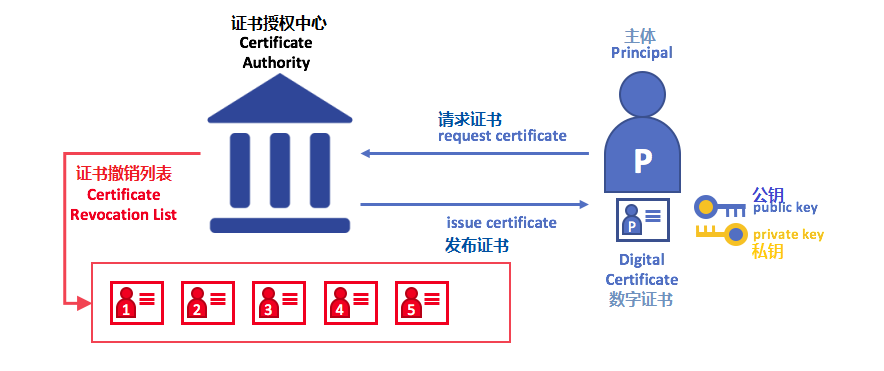
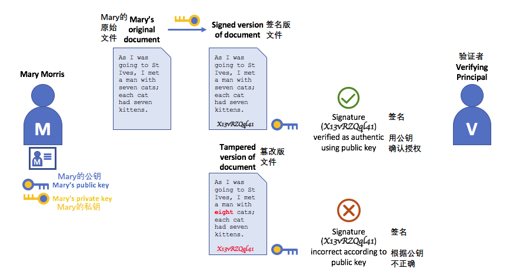
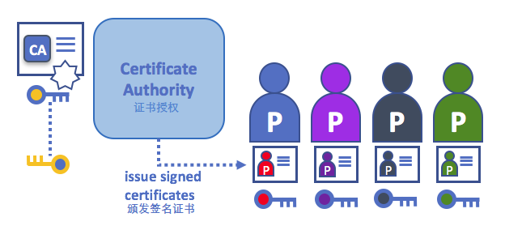
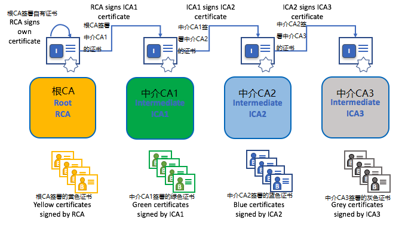
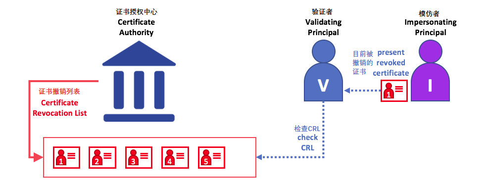

# Identity - 身份

## What is an Identity? - 什么是身份？

The different actors in a blockchain network include peers, orderers, client
applications, administrators and more. Each of these actors --- active elements
inside or outside a network able to consume services --- has a digital identity
encapsulated in an X.509 digital certificate. These identities really matter
because they **determine the exact permissions over resources and access to
information that actors have in a blockchain network.**

区块链网络中的不同参与者包括节点，订购者，客户端应用程序，管理员等。这些参与者中的每一个——网络内部或外部能够使用服务的活动元素——都具有封装在X.509数字证书中的数字身份。这些身份确实很重要，因为它们 **确定了对资源的确切权限以及对参与者在区块链网络中拥有的信息的访问权限。** 

A digital identity furthermore has some additional attributes that Fabric uses
to determine permissions, and it gives the union of an identity and the associated
attributes a special name --- **principal**. Principals are just like userIDs or
groupIDs, but a little more flexible because they can include a wide range of
properties of an actor's identity, such as the actor's organization, organizational
unit, role or even the actor's specific identity. When we talk about principals,
they are the properties which determine their permissions.

此外，数字身份还具有Fabric用于确定权限的一些其他属性，并且它为身份和关联属性的并集提供了特殊名称—— **主体** 。Principal就像userIDs或groupIDs，但更灵活一点，因为它们可以包含actor的身份的各种属性，例如actor的组织，组织单位，角色甚至是actor的特定身份。当我们谈论主体时，它们是决定其权限的属性。

For an identity to be **verifiable**, it must come from a **trusted** authority.
A [membership service provider](../membership/membership.html)
(MSP) is that trusted authority in Fabric. More specifically, an MSP is a component
that defines the rules that govern the valid identities for this organization.
The default MSP implementation in Fabric uses X.509 certificates as identities,
adopting a traditional Public Key Infrastructure (PKI) hierarchical model (more
on PKI later).

要使身份可以**验证**，它必须来自**可信任的**权威机构。 [成员服务提供者](../membership/membership.html) （MSP）是Fabirc中可以信任的权力机构。更具体地说，一个MSP是定义管理该组织的有效身份的规则的组件。Fabric中的默认MSP实现使用X.509证书作为身份，采用传统的公钥基础结构（PKI）分层模型（稍后将详细介绍PKI）。

## A Simple Scenario to Explain the Use of an Identity - 一个简单的场景来解释身份的使用

Imagine that you visit a supermarket to buy some groceries. At the checkout you see
a sign that says that only Visa, Mastercard and AMEX cards are accepted. If you try to
pay with a different card --- let's call it an "ImagineCard" --- it doesn't matter whether
the card is authentic and you have sufficient funds in your account. It will be not be
accepted.

想象你去超市购买一些杂货。在结账时，你会看到一个标志，表明只接受Visa，Mastercard和AMEX卡。如果你尝试使用其他卡付款——我们称之为“想象卡”——无论该卡是否真实、或你的帐户中是否有足够的资金，都无关紧要。它不会被接受。

*Having a valid credit card is not enough --- it must also be accepted by the store! PKIs
and MSPs work together in the same way --- a PKI provides a list of identities,
and an MSP says which of these are members of a given organization that participates in
the network.*

*拥有有效的信用卡是不够的——它也必须被商店接受！PKI和MSP以相同的方式协同工作——PKI提供身份列表，MSP说哪些是参与网络的给定组织的成员。* 

PKI certificate authorities and MSPs provide a similar combination of functionalities.
A PKI is like a card provider --- it dispenses many different types of verifiable
identities. An MSP, on the other hand, is like the list of card providers accepted
by the store, determining which identities are the trusted members (actors)
of the store payment network. **MSPs turn verifiable identities into the members
of a blockchain network**.

PKI证书和MSP提供了类似的功能组合。PKI就像一个卡提供商——它分配了许多不同类型的可验证身份。另一方面，MSP类似于商店接受的卡提供商列表，确定哪些身份是商店支付网络的可信成员（参与者）。 **MSP将可验证的身份转变为区块链网络的成员** 。 

Let's drill into these concepts in a little more detail.

让我们更详细地深入研究这些概念。

## What are PKIs? - 什么是PKI？

**A public key infrastructure (PKI) is a collection of internet technologies that provides
secure communications in a network.** It's PKI that puts the **S** in **HTTPS** --- and if
you're reading this documentation on a web browser, you're probably using a PKI to make
sure it comes from a verified source.

**公钥基础结构（PKI）是一组互联网技术，可在网络中提供安全通信。** 是PKI将 **S** 放在 **HTTPS** 中——如果你在网页浏览器上阅读这个文档，你可能正使用PKI来确保它来自一个验证过的源。

*The elements of Public Key Infrastructure (PKI). A PKI is comprised of Certificate
Authorities who issue digital certificates to parties (e.g., users of a service, service
provider), who then use them to authenticate themselves in the messages they exchange
in their environment. A CA's Certificate Revocation List (CRL) constitutes a reference
for the certificates that are no longer valid. Revocation of a certificate can happen for
a number of reasons. For example, a certificate may be revoked because the cryptographic
private material associated to the certificate has been exposed.*

*公钥基础结构（PKI）的元素。PKI由向各方（例如，服务的用户，服务提供者）发布数字证书的证书授权中心组成，然后使用它们在与其环境交换的消息中对自己进行身份验证。CA的证书撤销列表（CRL）构成不再有效的证书的参考。证书的撤销可能由于多种原因而发生。例如，证书可能被撤销，因为与证书相关联的加密私有材料已被公开。* 

Although a blockchain network is more than a communications network, it relies on the
PKI standard to ensure secure communication between various network participants, and to
ensure that messages posted on the blockchain are properly authenticated.
It's therefore important to understand the basics of PKI and then why MSPs are
so important.

虽然区块链网络不仅仅是一个通信网络，但它依赖于PKI标准来确保各个网络参与者之间的安全通信，并确保在区块链上发布的消息得到适当的认证。因此，了解PKI的基础知识以及为什么MSP如此重要是非常重要的。

There are four key elements to PKI:

 * **Digital Certificates**
 * **Public and Private Keys**
 * **Certificate Authorities**
 * **Certificate Revocation Lists**

PKI有四个关键要素：

 * **数字证书**
 * **公钥和私钥**
 * **证书授权中心**
 * **证书撤销列表**

Let's quickly describe these PKI basics, and if you want to know more details,
[Wikipedia](https://en.wikipedia.org/wiki/Public_key_infrastructure) is a good
place to start.

让我们快速描述这些PKI基础知识，如果你想了解更多细节， [维基百科](https://en.wikipedia.org/wiki/Public_key_infrastructure)是一个很好的起点。

## Digital Certificates - 数字证书

A digital certificate is a document which holds a set of attributes relating to
the holder of the certificate. The most common type of certificate is the one
compliant with the [X.509 standard](https://en.wikipedia.org/wiki/X.509), which
allows the encoding of a party's identifying details in its structure.

数字证书是包含与证书持有者有关的一组属性的文档。最常见的证书类型是符合[X.509标准](https://en.wikipedia.org/wiki/X.509)的证书，它允许在其结构中编码一方的识别细节。

For example, Mary Morris in the Manufacturing Division of Mitchell Cars in Detroit,
Michigan might have a digital certificate with a `SUBJECT` attribute of `C=US`,
`ST=Michigan`, `L=Detroit`, `O=Mitchell Cars`, `OU=Manufacturing`, `CN=Mary Morris /UID=123456`.
Mary's certificate is similar to her government identity card --- it provides
information about Mary which she can use to prove key facts about her. There are
many other attributes in an X.509 certificate, but let's concentrate on just these
for now.

例如，密歇根州底特律的Mitchell汽车的制造部门的Mary Morris可能有一个带有 `SUBJECT` 属性为 `C=US`,
`ST=Michigan`, `L=Detroit`, `O=Mitchell Cars`, `OU=Manufacturing`, `CN=Mary Morris /UID=123456` 的数字证书。Mary的证书类似于她的政府身份证——它提供了玛丽的信息，她可以用来证明关于她的重要事实。X.509证书中还有许多其他属性，但现在让我们专注于这些。

*A digital certificate describing a party called Mary Morris. Mary is the `SUBJECT` of the
certificate, and the highlighted `SUBJECT` text shows key facts about Mary. The
certificate also holds many more pieces of information, as you can see. Most importantly,
Mary's public key is distributed within her certificate, whereas her private signing key
is not. This signing key must be kept private.*

*描述一个名为Mary Morris的组织的数字证书。Mary是证书的 `SUBJECT` ，突出显示的 `SUBJECT` 文本显示了关于Mary的重要事实。如你所见，证书还包含更多信息。最重要的是，Mary的公钥是在她的证书中分发的，而她的私人签名密钥则不是。此签名密钥必须保密。*

What is important is that all of Mary's attributes can be recorded using a mathematical
technique called cryptography (literally, "*secret writing*") so that tampering will
invalidate the certificate. Cryptography allows Mary to present her certificate to others
to prove her identity so long as the other party trusts the certificate issuer, known
as a **Certificate Authority** (CA). As long as the CA keeps certain cryptographic
information securely (meaning, its own **private signing key**), anyone reading the
certificate can be sure that the information about Mary has not been tampered with ---
it will always have those particular attributes for Mary Morris. Think of Mary's X.509
certificate as a digital identity card that is impossible to change.

重要的是，Mary的所有属性都可以使用称为密码学（字面意思，“ *秘密书写* ”）的数学技术进行记录，这样篡改将使证书无效。只要对方信任证书颁发者，即 **证书授权中心** （CA），密码学就允许Mary将证书提交给其他人以证明其身份。只要CA安全地保存某些加密信息（意味着它自己的 **私人签名密钥** ），任何阅读证书的人都可以确定有关Mary的信息没有被篡改——它将始终具有Mary Morris的特定属性。将Mary的X.509证书视为无法改变的数字身份证。

## Authentication, Public keys, and Private Keys - 授权，公钥和私钥

Authentication and message integrity are important concepts in secure
communications. Authentication requires that parties who exchange messages
are assured of the identity that created a specific message. For a message to have
"integrity" means that cannot have been modified during its transmission.
For example, you might want to be sure you're communicating with the real Mary
Morris rather than an impersonator. Or if Mary has sent you a message, you might want
to be sure that it hasn't been tampered with by anyone else during transmission.

身份验证和消息完整性是安全通信中的重要概念。身份验证要求确保交换消息的各方创建特定消息的身份。对于具有“完整性”的消息意味着在其传输期间不能被修改。例如，你可能希望确保与真正的Mary Morris而不是模仿者进行沟通。或者，如果Mary向你发送了一条消息，你可能希望确保其在传输过程中没有被其他任何人篡改过。

Traditional authentication mechanisms rely on **digital signatures** that,
as the name suggests, allow a party to digitally **sign** its messages. Digital
signatures also provide guarantees on the integrity of the signed message.

传统的身份验证机制依赖于 **数字签名** ，顾名思义，它允许一方对其消息进行数字 **签名** 。数字签名还可以保证签名消息的完整性。

Technically speaking, digital signature mechanisms require each party to
hold two cryptographically connected keys: a public key that is made widely available
and acts as authentication anchor, and a private key that is used to produce
**digital signatures** on messages. Recipients of digitally signed messages can verify
the origin and integrity of a received message by checking that the
attached signature is valid under the public key of the expected sender.

从技术上讲，数字签名机制要求每一方保存两个加密连接的密钥：广泛可用的公钥和充当授权锚的私钥，以及用于在消息上产生**数字签名**的私钥 。数字签名消息的接收者可以通过检查附加签名在预期发送者的公钥下是否有效来验证接收消息的来源和完整性。

**The unique relationship between a private key and the respective public key is the
cryptographic magic that makes secure communications possible**. The unique
mathematical relationship between the keys is such that the private key can be used to
produce a signature on a message that only the corresponding public key can match, and
only on the same message.

 **私钥和相应公钥之间的唯一关系是使安全通信成为可能的加密魔法** 。密钥之间的唯一数学关系使得私钥可以用于在仅对应的公钥可以匹配的消息上产生签名，并且仅在相同的消息上。

In the example above, Mary uses her private key to sign the message. The signature
can be verified by anyone who sees the signed message using her public key.

在上面的示例中，Mary使用她的私钥对邮件进行签名。任何使用她的公钥查看签名消息的人都可以验证签名。

## Certificate Authorities - 证书授权中心

As you've seen, an actor or a node is able to participate in the blockchain network,
via the means of a **digital identity** issued for it by an authority trusted by the
system. In the most common case, digital identities (or simply **identities**) have
the form of cryptographically validated digital certificates that comply with X.509
standard and are issued by a Certificate Authority (CA).

如你所见，人员或节点能够通过由系统信任的机构为其发布的 **数字身份** 参与区块链网络。在最常见的情况下，数字身份（或简称 **身份** ）具有符合X.509标准并由证书授权中心（CA）颁发的经加密验证的数字证书的形式。

CAs are a common part of internet security protocols, and you've probably heard of
some of the more popular ones: Symantec (originally Verisign), GeoTrust, DigiCert,
GoDaddy, and Comodo, among others.

CA是互联网安全协议的常见部分，你可能已经听说过一些比较流行的协议：Symantec（最初是Verisign），GeoTrust，DigiCert，GoDaddy和Comodo等。

*A Certificate Authority dispenses certificates to different actors. These certificates
are digitally signed by the CA and bind together the actor with the actor's public key
(and optionally with a comprehensive list of properties). As a result, if one trusts
the CA (and knows its public key), it can trust that the specific actor is bound
to the public key included in the certificate, and owns the included attributes,
by validating the CA's signature on the actor's certificate.*

*证书授权中心向不同的参与者颁发证书。这些证书由CA进行数字签名，并将人员与人员的公钥绑定在一起（并且可选地具有全面的属性列表）。因此，如果一个人信任CA（并且知道其公钥），则可以信任特定参与者绑定到证书中包含的公钥，并通过验证参与者证书上的CA签名来拥有所包含的属性。* 

Certificates can be widely disseminated, as they do not include either the
actors' nor the CA's private keys. As such they can be used as anchor of
trusts for authenticating messages coming from different actors.

证书可以广泛传播，因为它们既不包括人员也不包括CA的私钥。因此，它们可以用作信任的锚，用于验证来自不同参与者的消息。

CAs also have a certificate, which they make widely available. This allows the
consumers of identities issued by a given CA to verify them by checking that the
certificate could only have been generated by the holder of the corresponding
private key (the CA).

CA也有一个证书，它们可以广泛使用。这允许由给定CA发布的身份的消费者通过检查证书只能由相应私钥（CA）的持有者生成来验证它们。

In a blockchain setting, every actor who wishes to interact with the network
needs an identity. In this setting, you might say that **one or more CAs** can be used
to **define the members of an organization's from a digital perspective**. It's
the CA that provides the basis for an organization's actors to have a verifiable
digital identity.

在区块链设置中，希望与网络交互的每个参与者都需要一个身份。在此设置中，你可能会说 **一个或多个CA** 可用于 **从数字角度定义组织的成员** 。CA是为组织的参与者提供可验证的数字身份的基础。

### Root CAs, Intermediate CAs and Chains of Trust - 根CA，中介CA和信任链

CAs come in two flavors: **Root CAs** and **Intermediate CAs**. Because Root CAs
(Symantec, Geotrust, etc) have to **securely distribute** hundreds of millions
of certificates to internet users, it makes sense to spread this process out
across what are called *Intermediate CAs*. These Intermediate CAs have their
certificates issued by the root CA or another intermediate authority, allowing
the establishment of a "chain of trust" for any certificate that is issued by
any CA in the chain. This ability to track back to the Root CA not only allows
the function of CAs to scale while still providing security --- allowing
organizations that consume certificates to use Intermediate CAs with confidence
--- it limits the exposure of the Root CA, which, if compromised, would endanger
the entire chain of trust. If an Intermediate CA is compromised, on the other
hand, there will be a much smaller exposure.

CA的有两种形式： **根CA** 和 **中介CA** 。因为根CA（Symantec，Geotrust等）必须 **安全地** 向互联网用户 **颁发** 数亿个证书，所以将这个过程分散到所谓的 *中介CA中* 是有意义的。这些中介CA具有由根CA或其他中间机构颁发的证书，允许为链中的任何CA颁发的任何证书建立“信任链”。追溯到根CA的这种能力不仅允许CA的功能在仍然提供安全性的同时进行扩展——允许使用证书的组织充满信心地使用中介CA——它限制了根CA的暴露，其如果受到损害，将会危及整个信任链。另一方面，如果中介CA受到损害，则曝光量会小得多。

*A chain of trust is established between a Root CA and a set of Intermediate CAs
as long as the issuing CA for the certificate of each of these Intermediate CAs is
either the Root CA itself or has a chain of trust to the Root CA.*

 *只要每个中介CA的证书的颁发CA是根CA本身或具有对根CA的信任链，就在根CA和一组中介CA之间建立信任链。* 

Intermediate CAs provide a huge amount of flexibility when it comes to the issuance
of certificates across multiple organizations, and that's very helpful in a
permissioned blockchain system (like Fabric). For example, you'll see that
different organizations may use different Root CAs, or the same Root CA with
different Intermediate CAs --- it really does depend on the needs of the network.

中介CA在跨多个组织颁发证书时提供了巨大的灵活性，这在许可的区块链系统（如Fabric）中非常有用。例如，你将看到不同的组织可能使用不同的根CA，或者使用具有不同中介CA的相同根CA——它确实取决于网络的需求。

### Fabric CA - Fabric CA

It's because CAs are so important that Fabric provides a built-in CA component to
allow you to create CAs in the blockchain networks you form. This component --- known
as **Fabric CA** is a private root CA provider capable of managing digital identities of
Fabric participants that have the form of X.509 certificates.
Because Fabric CA is a custom CA targeting the Root CA needs of Fabric,
it is inherently not capable of providing SSL certificates for general/automatic use
in browsers. However, because **some** CA must be used to manage identity
(even in a test environment), Fabric CA can be used to provide and manage
certificates. It is also possible --- and fully appropriate --- to use a
public/commercial root or intermediate CA to provide identification.

因为CA非常重要，Fabric提供了一个内置的CA组件，允许你在你构成的区块链网络中创建CA。此组件——称为 **Fabric CA** ，是一个私有根CA提供程序，能够管理具有X.509证书形式的Fabric参与者的数字身份。由于Fabric CA是针对Fabric的根CA需求的自定义CA，因此它本身无法为浏览器中的常规/自动使用提供SSL证书。但是，由于 **某些** CA必须用于管理身份（即使在测试环境中），因此可以使用Fabric CA来提供和管理证书。使用公共/商业根或中介CA来提供识别也是可能的——并且完全合适。

If you're interested, you can read a lot more about Fabric CA
[in the CA documentation section](http://hyperledger-fabric-ca.readthedocs.io/).

如果你有兴趣，你可以[在CA文档部分](http://hyperledger-fabric-ca.readthedocs.io/)阅读有关Fabric CA的更多信息。

## Certificate Revocation Lists - 证书撤销列表

A Certificate Revocation List (CRL) is easy to understand --- it's just a list of
references to certificates that a CA knows to be revoked for one reason or another.
If you recall the store scenario, a CRL would be like a list of stolen credit cards.

证书撤销列表（CRL）很容易理解——它只是CA知道由于某种原因而被撤销的证书的引用列表。如果你回想商店场景，CRL就像被盗信用卡列表一样。

When a third party wants to verify another party's identity, it first checks the
issuing CA's CRL to make sure that the certificate has not been revoked. A
verifier doesn't have to check the CRL, but if they don't they run the risk of
accepting a compromised identity.

当第三方想要验证另一方的身份时，它首先检查颁发CA的CRL以确保证书尚未被撤销。验证者不是必须要检查CRL，但如果不检查，则他们冒着接受受损身份的风险。

*Using a CRL to check that a certificate is still valid. If an impersonator tries to
pass a compromised digital certificate to a validating party, it can be first
checked against the issuing CA's CRL to make sure it's not listed as no longer valid.*

*使用CRL检查证书是否仍然有效。如果模仿者试图将受损的数字证书传递给验证者，则可以首先检查颁发CA的CRL，以确保其未列为不再有效。* 

Note that a certificate being revoked is very different from a certificate expiring.
Revoked certificates have not expired --- they are, by every other measure, a fully
valid certificate. For more in-depth information about CRLs, click [here](https://hyperledger-fabric-ca.readthedocs.io/en/latest/users-guide.html#generating-a-crl-certificate-revocation-list).

请注意，被撤销的证书与证书过期非常不同。撤销的证书尚未过期——按其他措施，它们是完全有效的证书。有关CRL的更多深入信息，请单击 [此处](https://hyperledger-fabric-ca.readthedocs.io/en/latest/users-guide.html#generating-a-crl-certificate-revocation-list)。

Now that you've seen how a PKI can provide verifiable identities through a chain of
trust, the next step is to see how these identities can be used to represent the
trusted members of a blockchain network. That's where a Membership Service Provider
(MSP) comes into play --- **it identifies the parties who are the members of a
given organization in the blockchain network**.

现在你已经了解了PKI如何通过信任链提供可验证的身份，下一步是了解如何使用这些身份来代表区块链网络的可信成员。这就是成员服务提供者（MSP）发挥作用的地方—— **它确定了区块链网络中特定组织成员的各方** 。

To learn more about membership, check out the conceptual documentation on [MSPs](../membership/membership.html).

要了解有关成员的更多信息，请查看有关[MSP](../membership/membership.html)的概念文档。

<!---
Licensed under Creative Commons Attribution 4.0 International License https://creativecommons.org/licenses/by/4.0/
-->
